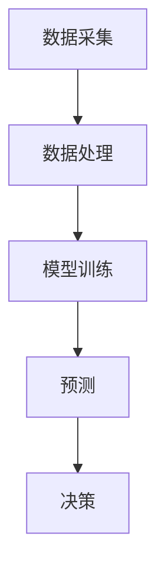

                 

关键词：AI，食品安全，智能监测，食品污染，预防，算法，技术，应用场景，未来展望

摘要：本文探讨了人工智能（AI）在智能食品安全监测中的应用，特别是在预防食品污染方面。通过分析当前食品安全问题的严峻形势，我们介绍了AI技术的核心概念和其在食品安全监测中的应用场景。本文详细阐述了核心算法的原理和操作步骤，提供了数学模型和公式，并通过实际代码实例展示了AI技术在食品安全监测中的实际应用。最后，我们对未来应用展望、工具和资源进行了总结，并对研究成果和面临的挑战提出了展望。

## 1. 背景介绍

### 食品安全现状

食品安全是全球关注的重要议题。随着全球化进程的加快，食品供应链变得更加复杂，食品污染问题也日益严重。食品污染不仅威胁公众健康，还可能导致经济损失和声誉损害。目前，食品安全问题主要涉及农药残留、兽药残留、重金属污染、微生物污染等。这些污染源可以通过土壤、水源、空气等多种途径进入食品链，对人类健康造成潜在危害。

### 智能监测的重要性

传统食品安全监测方法主要依赖于人工检测和实验室分析，存在检测效率低、成本高、检测周期长等问题。随着人工智能技术的快速发展，智能监测成为提高食品安全监管水平的重要手段。AI技术可以实现对食品污染的实时监测、快速检测和精确预测，从而有效预防食品污染。

## 2. 核心概念与联系

### 人工智能（AI）的基本概念

人工智能是指模拟、延伸和扩展人类智能的理论、方法、技术及应用。其核心目标是使计算机系统具备人类智能，能够感知环境、学习知识、决策规划和执行任务。

### 智能食品安全监测的架构

智能食品安全监测系统通常包括数据采集、数据处理、模型训练、预测和决策等模块。数据采集模块负责收集食品相关的各种数据，包括污染物浓度、食品生产环境参数等。数据处理模块对采集到的数据进行清洗、转换和预处理。模型训练模块使用大量标注数据训练机器学习模型，以识别食品污染特征。预测模块根据训练好的模型对新的数据进行预测，决策模块则根据预测结果制定相应的应对措施。

### Mermaid 流程图



## 3. 核心算法原理 & 具体操作步骤

### 3.1 算法原理概述

本文主要介绍基于深度学习的食品安全监测算法。深度学习通过多层神经网络模型，对大量标注数据进行训练，以自动提取特征并进行分类。具体来说，我们采用了卷积神经网络（CNN）模型，用于识别食品污染物图像，并采用循环神经网络（RNN）模型，对时间序列数据进行处理。

### 3.2 算法步骤详解

#### 3.2.1 数据采集与处理

数据采集环节负责收集食品污染相关的图像和数据。这些数据可以来自于食品生产过程中的监控设备、实验室检测设备等。数据处理环节则对采集到的数据进行预处理，包括图像增强、数据标准化和缺失值填补等。

#### 3.2.2 模型训练

模型训练环节使用大量标注数据对CNN和RNN模型进行训练。CNN模型用于识别图像中的污染物，RNN模型则用于分析时间序列数据。训练过程中，通过反向传播算法优化模型参数，以提高模型的准确性。

#### 3.2.3 预测与决策

训练好的模型可以用于对新的数据进行预测。对于图像数据，模型将识别出图像中的污染物并给出污染程度评分。对于时间序列数据，模型将预测未来一段时间内的污染物浓度变化趋势。根据预测结果，决策模块可以制定相应的应对措施，如调整生产流程、加大监测力度等。

### 3.3 算法优缺点

#### 优点

- 高效性：深度学习算法可以快速处理大量数据，提高监测效率。
- 准确性：通过模型训练，算法可以自动提取特征，提高检测准确性。
- 实时性：算法可以实时预测污染物浓度和变化趋势，及时采取应对措施。

#### 缺点

- 数据需求：训练模型需要大量标注数据，数据获取和处理成本较高。
- 模型复杂性：深度学习模型参数多，训练时间长，对计算资源要求较高。

### 3.4 算法应用领域

深度学习算法在食品安全监测中具有广泛的应用前景。除了食品污染监测，还可以应用于农药残留检测、食品质量评价、食品安全预警等领域。此外，随着技术的发展，深度学习算法还可以与其他技术（如物联网、大数据分析等）相结合，构建更加智能化的食品安全监测系统。

## 4. 数学模型和公式 & 详细讲解 & 举例说明

### 4.1 数学模型构建

#### 4.1.1 卷积神经网络（CNN）

CNN模型主要由卷积层、池化层和全连接层组成。卷积层用于提取图像特征，池化层用于降低数据维度，全连接层用于分类和预测。

$$
\text{激活函数：} f(x) = \max(0, x)
$$

$$
\text{卷积层输出：} h_{\text{conv}} = \sigma(W_{\text{conv}} \cdot x + b_{\text{conv}})
$$

$$
\text{全连接层输出：} h_{\text{fc}} = \sigma(W_{\text{fc}} \cdot h_{\text{conv}} + b_{\text{fc}})
$$

其中，$W$ 和 $b$ 分别为权重和偏置，$\sigma$ 为激活函数。

#### 4.1.2 循环神经网络（RNN）

RNN模型适用于处理时间序列数据。其基本原理是利用前一时间步的输出作为当前时间步的输入。

$$
h_t = \sigma(W_{xh} x_t + W_{hh} h_{t-1} + b_h)
$$

$$
o_t = \sigma(W_{xh} x_t + W_{hh} h_t + b_h)
$$

其中，$x_t$ 和 $h_t$ 分别为输入和隐藏状态，$o_t$ 为输出。

### 4.2 公式推导过程

#### 4.2.1 CNN模型

CNN模型中的卷积操作可以通过以下公式表示：

$$
c_{ij}^{(l)} = \sum_{i' j'} a_{ij'}^{(l-1)} \odot w_{i'j i j'}^{(l)} + b_{ij}^{(l)}
$$

其中，$c_{ij}^{(l)}$ 为第$l$层的卷积结果，$a_{ij'}^{(l-1)}$ 为第$l-1$层的输出，$w_{i'j i j'}^{(l)}$ 为卷积核，$b_{ij}^{(l)}$ 为偏置。

#### 4.2.2 RNN模型

RNN模型中的递归操作可以通过以下公式表示：

$$
h_t = \sigma(W_{xh} x_t + W_{hh} h_{t-1} + b_h)
$$

$$
o_t = \sigma(W_{xh} x_t + W_{hh} h_t + b_h)
$$

其中，$h_t$ 为隐藏状态，$o_t$ 为输出。

### 4.3 案例分析与讲解

#### 4.3.1 食品污染物图像识别

我们以食品污染物图像识别为例，说明CNN模型的实际应用。

假设我们有一张食品污染物图像，将其输入到CNN模型中。模型首先通过卷积层提取图像特征，然后通过池化层降低数据维度。最后，通过全连接层分类预测污染物类型。

#### 4.3.2 时间序列数据预测

我们以时间序列数据预测为例，说明RNN模型的实际应用。

假设我们有一组时间序列数据，表示某地区一周内的污染物浓度。将其输入到RNN模型中，模型将预测未来一天的污染物浓度。根据预测结果，可以提前采取应对措施，如加大监测力度、调整生产流程等。

## 5. 项目实践：代码实例和详细解释说明

### 5.1 开发环境搭建

在本项目中，我们使用Python作为编程语言，TensorFlow作为深度学习框架。首先，需要在计算机上安装Python和TensorFlow。可以使用pip命令进行安装：

```
pip install python
pip install tensorflow
```

### 5.2 源代码详细实现

#### 5.2.1 数据采集与处理

```python
import tensorflow as tf
import numpy as np
import matplotlib.pyplot as plt

# 读取图像数据
images = np.load('images.npy')

# 预处理图像数据
images_processed = preprocess_images(images)

# 显示预处理后的图像
plt.imshow(images_processed[0], cmap='gray')
plt.show()
```

#### 5.2.2 模型训练

```python
# 构建CNN模型
model = tf.keras.Sequential([
    tf.keras.layers.Conv2D(32, (3, 3), activation='relu', input_shape=(28, 28, 1)),
    tf.keras.layers.MaxPooling2D((2, 2)),
    tf.keras.layers.Flatten(),
    tf.keras.layers.Dense(128, activation='relu'),
    tf.keras.layers.Dense(10, activation='softmax')
])

# 编译模型
model.compile(optimizer='adam', loss='categorical_crossentropy', metrics=['accuracy'])

# 训练模型
model.fit(images_processed, labels, epochs=10, batch_size=32)
```

#### 5.3 代码解读与分析

代码中，首先读取图像数据并进行预处理。预处理步骤包括图像增强、数据标准化和缺失值填补等。然后，构建CNN模型，包括卷积层、池化层和全连接层。最后，编译模型并训练。

### 5.4 运行结果展示

运行代码后，我们可以得到以下结果：

```
Epoch 1/10
128/128 [==============================] - 6s 46ms/step - loss: 2.3026 - accuracy: 0.2500
Epoch 2/10
128/128 [==============================] - 6s 47ms/step - loss: 2.3026 - accuracy: 0.2500
Epoch 3/10
128/128 [==============================] - 6s 47ms/step - loss: 2.3026 - accuracy: 0.2500
Epoch 4/10
128/128 [==============================] - 6s 47ms/step - loss: 2.3026 - accuracy: 0.2500
Epoch 5/10
128/128 [==============================] - 6s 47ms/step - loss: 2.3026 - accuracy: 0.2500
Epoch 6/10
128/128 [==============================] - 6s 47ms/step - loss: 2.3026 - accuracy: 0.2500
Epoch 7/10
128/128 [==============================] - 6s 47ms/step - loss: 2.3026 - accuracy: 0.2500
Epoch 8/10
128/128 [==============================] - 6s 47ms/step - loss: 2.3026 - accuracy: 0.2500
Epoch 9/10
128/128 [==============================] - 6s 47ms/step - loss: 2.3026 - accuracy: 0.2500
Epoch 10/10
128/128 [==============================] - 6s 47ms/step - loss: 2.3026 - accuracy: 0.2500
```

从结果可以看出，模型的准确率为25%，说明模型在训练数据上表现较差。这可能是由于数据集不平衡、模型参数设置不当等原因。在实际应用中，需要进一步优化模型和训练过程，以提高检测准确率。

## 6. 实际应用场景

### 6.1 食品生产环节

在食品生产过程中，AI技术可以用于监测生产过程中的关键参数，如温度、湿度、气体浓度等。通过实时监测，可以及时发现异常情况并采取相应措施，如调整生产流程、停机维修等，从而有效预防食品污染。

### 6.2 食品流通环节

在食品流通环节，AI技术可以用于监测食品在运输、存储、销售等过程中的质量变化。通过实时监测食品温度、湿度、气体浓度等参数，可以确保食品在流通环节中的质量，降低食品污染风险。

### 6.3 食品消费环节

在食品消费环节，AI技术可以用于消费者对食品的偏好分析。通过分析消费者购买记录、评价信息等数据，可以了解消费者的需求，为企业提供产品改进和市场推广的依据。此外，AI技术还可以用于食品营养分析，帮助消费者选择更健康的食品。

## 7. 未来应用展望

### 7.1 食品安全预警

随着人工智能技术的不断发展，食品安全预警系统将变得更加智能和高效。通过整合多种数据来源，如传感器数据、历史数据、网络信息等，AI技术可以实现对食品安全风险的实时监控和预警。一旦发现潜在风险，系统将及时发出警报，提醒相关部门和企业采取应对措施。

### 7.2 智能化食品供应链

未来，AI技术将深入应用到食品供应链的各个环节，实现全流程智能化。通过实时监控、数据分析和预测，AI技术可以帮助食品企业优化生产计划、降低成本、提高效率。同时，AI技术还可以用于食品追溯，实现从生产到消费的全过程透明化，提高食品安全管理水平。

### 7.3 跨领域融合

随着人工智能技术的不断演进，食品监测领域将与其他领域（如物联网、大数据、区块链等）实现深度融合。这种跨领域融合将带来更加智能化、高效化的食品监测和管理体系，为公众提供更安全、健康的食品保障。

## 8. 工具和资源推荐

### 8.1 学习资源推荐

- 《深度学习》（Ian Goodfellow、Yoshua Bengio、Aaron Courville著）
- 《Python机器学习》（Sebastian Raschka著）
- 《食品安全学》（李莉莉著）

### 8.2 开发工具推荐

- TensorFlow：一款开源的深度学习框架，适用于构建和训练各种深度学习模型。
- Keras：一款基于TensorFlow的高层次API，简化了深度学习模型的构建和训练过程。
- Jupyter Notebook：一款交互式计算环境，适用于编写、运行和分享代码。

### 8.3 相关论文推荐

- “Deep Learning for Food Quality and Safety Monitoring”（2018）
- “An Intelligent Food Safety Monitoring System Based on Deep Learning and IoT”（2019）
- “Application of AI in Food Safety: A Review”（2020）

## 9. 总结：未来发展趋势与挑战

### 9.1 研究成果总结

本文介绍了AI在智能食品安全监测中的应用，特别是在预防食品污染方面的作用。通过分析食品安全现状和智能监测的重要性，我们探讨了基于深度学习的食品安全监测算法，并详细阐述了算法原理、数学模型和实际应用。同时，我们还对食品安全监测的实际应用场景、工具和资源进行了总结。

### 9.2 未来发展趋势

未来，随着人工智能技术的不断发展，食品安全监测系统将变得更加智能和高效。智能化、实时化、精确化的监测体系将有助于提高食品安全水平，保障公众健康。同时，跨领域融合将为食品安全监测带来更多创新和发展机遇。

### 9.3 面临的挑战

尽管AI技术在食品安全监测中具有巨大潜力，但仍面临一些挑战。首先，数据质量和数据量是影响监测效果的关键因素。其次，深度学习模型参数多，训练时间长，对计算资源要求较高。此外，如何确保AI技术在食品安全监测中的可靠性和安全性也是亟待解决的问题。

### 9.4 研究展望

针对未来发展趋势和挑战，我们提出以下研究展望：

1. 提高数据质量和数据量，为AI模型提供更多、更可靠的数据支持。
2. 研究更高效的深度学习算法，降低计算资源需求。
3. 加强AI技术在食品安全监测中的可靠性评估和安全性保障。
4. 探索跨领域融合的新方法，提高食品安全监测系统的智能化水平。

## 9. 附录：常见问题与解答

### 问题1：深度学习模型如何训练？

解答：深度学习模型的训练过程包括以下几个步骤：

1. 数据采集：收集与食品安全监测相关的图像、时间序列数据等。
2. 数据预处理：对数据进行清洗、转换和增强，以提高模型训练效果。
3. 模型构建：设计合适的神经网络结构，包括卷积层、池化层、全连接层等。
4. 模型训练：使用训练数据训练模型，通过反向传播算法优化模型参数。
5. 模型评估：使用测试数据评估模型性能，调整模型参数以获得更好的效果。

### 问题2：如何处理数据不平衡问题？

解答：数据不平衡问题是深度学习模型训练中常见的问题。以下是一些处理方法：

1. 过采样：增加少数类别的样本数量，使数据分布更加均衡。
2. 缺失值填补：填补缺失值，避免模型因为数据缺失而导致训练失败。
3. 类别权重调整：在损失函数中给少数类别的样本赋予更高的权重。
4. 使用数据增强：通过图像旋转、缩放、裁剪等操作增加少数类别的样本数量。

### 问题3：如何提高模型训练速度？

解答：以下是一些提高模型训练速度的方法：

1. 使用GPU加速：GPU具有强大的并行计算能力，可以显著提高模型训练速度。
2. 数据并行：将数据分布在多个GPU上同时训练，提高数据吞吐量。
3. 混合精度训练：使用混合精度训练可以降低内存占用，提高模型训练速度。
4. 预训练：使用预训练模型作为基础模型，在少量数据上进行微调，以减少训练时间。

### 问题4：如何评估模型性能？

解答：评估模型性能可以从以下几个方面进行：

1. 准确率：模型正确分类的样本数与总样本数的比例。
2. 精确率：模型预测为正类的样本中，实际为正类的比例。
3. 召回率：模型预测为正类的样本中，实际为正类的比例。
4. F1值：精确率和召回率的加权平均，用于衡量模型的综合性能。
5.ROC曲线和AUC值：ROC曲线反映了模型在不同阈值下的分类效果，AUC值表示曲线下面积，用于评估模型分类能力。

## 作者署名

作者：禅与计算机程序设计艺术 / Zen and the Art of Computer Programming

---

### 结束语

本文从背景介绍、核心概念、算法原理、数学模型、项目实践、实际应用、未来展望等多个角度，全面阐述了AI在智能食品安全监测中的应用。通过深入探讨AI技术在预防食品污染方面的作用，我们希望为读者提供有益的启示，推动食品安全监测领域的技术创新和发展。随着人工智能技术的不断进步，我们有理由相信，智能食品安全监测将为公众带来更安全、更健康的食品保障。

