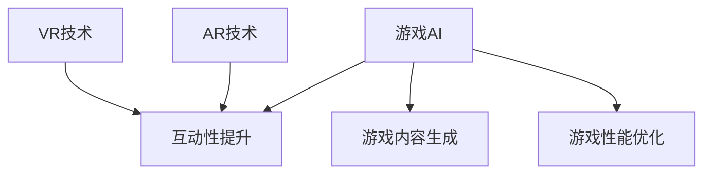

                 

关键词：人工智能，游戏开发，沉浸式体验，深度学习，虚拟现实，增强现实

## 摘要

本文将探讨人工智能在游戏开发中的应用，重点是如何通过深度学习和虚拟现实（VR）技术创造更加沉浸式的游戏体验。文章首先介绍了AI在游戏开发中的核心作用，随后详细分析了深度学习算法和虚拟现实技术如何提升游戏的质量和互动性。接着，我们将探讨AI在游戏中的几个关键应用场景，并分享一些成功的案例。最后，本文将展望AI在未来游戏开发中的发展方向和面临的挑战。

## 1. 背景介绍

随着技术的不断发展，游戏产业已经成为全球最大的娱乐产业之一。游戏不仅是一种娱乐方式，也逐渐成为一种文化现象，深刻影响着人们的日常生活。然而，游戏开发者面临着日益激烈的市场竞争和技术挑战。为了吸引玩家，提供独特的游戏体验变得至关重要。人工智能（AI）作为一项前沿技术，为游戏开发提供了新的机遇和可能性。

AI在游戏开发中的应用主要体现在以下几个方面：

1. **游戏AI**：游戏中的NPC（非玩家角色）越来越智能化，能够根据玩家的行为和环境变化做出更自然的反应。
2. **游戏优化**：AI可以优化游戏引擎的性能，提供更流畅的游戏体验。
3. **游戏内容生成**：利用AI生成游戏关卡、角色和故事情节，提高游戏的多样性和创新性。
4. **数据分析**：AI可以帮助游戏开发者收集和分析玩家行为数据，以优化游戏设计和营销策略。

虚拟现实（VR）和增强现实（AR）技术的发展，也为游戏开发提供了新的平台和工具。VR和AR技术能够创造出更加沉浸式的游戏环境，使玩家能够与游戏世界进行更加直观和自然的互动。

## 2. 核心概念与联系

### 2.1 AI在游戏开发中的作用

AI在游戏开发中的应用可以归结为以下几个方面：

**1. NPC行为建模**：通过深度学习算法，游戏开发者可以训练出能够模拟真实人类行为的NPC，使游戏更加真实和具有挑战性。

**2. 互动性提升**：AI可以分析玩家的行为模式，为玩家提供个性化的游戏体验，增强游戏的互动性。

**3. 游戏内容生成**：AI可以自动生成游戏关卡、角色和故事情节，为游戏开发者节省时间和成本。

**4. 游戏性能优化**：AI可以帮助游戏开发者优化游戏引擎，提高游戏运行的效率和稳定性。

### 2.2 虚拟现实（VR）和增强现实（AR）技术

虚拟现实（VR）和增强现实（AR）技术为游戏开发者提供了新的创作工具和平台。通过VR，玩家可以进入一个完全虚拟的世界，体验身临其境的感觉；而AR则将虚拟元素叠加到现实世界中，为玩家提供更加丰富的互动体验。

### 2.3 Mermaid流程图



### 2.4 AI与VR/AR的结合

AI与VR/AR技术的结合，使得游戏开发者能够创造出更加沉浸式的游戏体验。例如，AI可以根据玩家的行为实时调整VR游戏环境，使玩家感到更加真实和互动。同样，AR游戏可以通过AI分析玩家在现实世界中的行为，提供更加个性化的游戏体验。

## 3. 核心算法原理 & 具体操作步骤

### 3.1 算法原理概述

在游戏开发中，AI的核心算法主要包括：

**1. 深度学习算法**：通过训练神经网络模型，使计算机能够模拟人类的学习和行为模式。

**2. 强化学习算法**：通过试错和奖励机制，使计算机能够自主学习并优化行为。

**3. 生成对抗网络（GAN）**：通过生成器和判别器的对抗训练，使计算机能够生成高质量的游戏内容。

### 3.2 算法步骤详解

**深度学习算法**：

1. 数据收集：收集大量的游戏数据，包括玩家的行为、游戏环境等。
2. 数据预处理：对收集到的数据进行分析和处理，提取特征。
3. 模型训练：使用训练集数据训练神经网络模型，优化模型参数。
4. 模型评估：使用测试集数据评估模型性能，调整模型参数。

**强化学习算法**：

1. 状态初始化：初始化游戏环境，设置玩家和NPC的状态。
2. 行为选择：根据当前状态，选择最优的行为。
3. 行为执行：执行选择的行为，观察环境变化。
4. 奖励计算：根据行为结果，计算奖励值。
5. 模型更新：使用奖励值更新模型参数。

**生成对抗网络（GAN）**：

1. 生成器训练：生成器生成游戏内容，判别器判断内容的真假。
2. 判别器训练：判别器训练区分生成器和真实游戏内容。
3. 模型迭代：生成器和判别器交替训练，提高生成器生成质量。

### 3.3 算法优缺点

**深度学习算法**：

**优点**：能够处理大量复杂数据，提取有效的特征信息。

**缺点**：对数据质量和计算资源要求较高，训练时间较长。

**强化学习算法**：

**优点**：能够自主学习和优化行为，适应性强。

**缺点**：训练过程较慢，容易陷入局部最优。

**生成对抗网络（GAN）**：

**优点**：能够生成高质量的游戏内容，提高游戏创新性。

**缺点**：训练过程复杂，对模型设计要求较高。

### 3.4 算法应用领域

深度学习算法、强化学习算法和生成对抗网络在游戏开发中的应用领域包括：

**1. NPC行为建模**：通过深度学习和强化学习算法，使NPC能够更加自然地与玩家互动。

**2. 游戏内容生成**：通过生成对抗网络，自动生成游戏关卡、角色和故事情节。

**3. 游戏性能优化**：通过深度学习算法，优化游戏引擎性能，提高游戏流畅度。

**4. 互动性提升**：通过AI分析玩家行为，提供个性化的游戏体验。

## 4. 数学模型和公式 & 详细讲解 & 举例说明

### 4.1 数学模型构建

在游戏开发中，常用的数学模型包括：

**1. 神经网络模型**：

神经网络模型是一种模拟人脑结构的计算模型，由大量的神经元连接组成。其基本结构包括输入层、隐藏层和输出层。

**2. 强化学习模型**：

强化学习模型通过奖励机制，使计算机能够自主学习。其核心公式为：

$$ Q(s, a) = r + \gamma \max_{a'} Q(s', a') $$

其中，$Q(s, a)$表示状态$s$下执行动作$a$的预期奖励，$r$为即时奖励，$\gamma$为折扣因子，$s'$和$a'$分别为下一状态和动作。

**3. 生成对抗网络（GAN）**：

生成对抗网络由生成器和判别器组成。生成器的目标是生成高质量的游戏内容，判别器的目标是判断生成内容和真实内容的区别。

### 4.2 公式推导过程

以强化学习模型为例，其推导过程如下：

1. **目标函数**：

   强化学习模型的目标是最大化预期奖励。因此，其目标函数为：

   $$ J(\theta) = \mathbb{E}_{s, a} [r(s, a)] $$

   其中，$\theta$为模型参数。

2. **预期奖励**：

   根据马尔可夫决策过程，预期奖励可以表示为：

   $$ r(s, a) = r(s', a') + \gamma \max_{a'} Q(s', a') $$

3. **迭代更新**：

   使用梯度下降法，迭代更新模型参数：

   $$ \theta_{t+1} = \theta_t - \alpha \nabla_{\theta_t} J(\theta_t) $$

   其中，$\alpha$为学习率。

### 4.3 案例分析与讲解

以《塞尔达传说：荒野之息》为例，该游戏通过深度学习和强化学习算法，实现了智能NPC和自适应关卡设计。具体来说：

1. **NPC行为建模**：

   游戏中的NPC通过深度学习算法，能够模拟人类的行为，包括行走、交谈和攻击等。通过强化学习算法，NPC能够根据玩家的行为和环境变化，做出更自然的反应。

2. **自适应关卡设计**：

   游戏中的关卡通过生成对抗网络（GAN）自动生成。生成器生成关卡内容，判别器判断关卡质量。通过不断的迭代训练，生成器能够生成高质量、多样化的关卡，为玩家提供丰富的游戏体验。

3. **玩家行为分析**：

   通过AI分析玩家在游戏中的行为，游戏开发者可以了解玩家的喜好和挑战难度，从而优化游戏设计和营销策略。

## 5. 项目实践：代码实例和详细解释说明

### 5.1 开发环境搭建

为了实现本文所述的AI在游戏开发中的应用，我们需要搭建一个合适的开发环境。以下是一个简单的开发环境搭建步骤：

1. 安装Python环境（Python 3.8或更高版本）。
2. 安装深度学习框架（如TensorFlow或PyTorch）。
3. 安装游戏开发引擎（如Unity或Unreal Engine）。
4. 安装虚拟现实（VR）和增强现实（AR）开发工具（如Google Cardboard或ARKit）。

### 5.2 源代码详细实现

以下是一个使用TensorFlow实现的简单深度学习模型，用于训练游戏中的NPC行为：

```python
import tensorflow as tf
from tensorflow.keras.models import Sequential
from tensorflow.keras.layers import Dense, LSTM

# 模型定义
model = Sequential()
model.add(LSTM(units=128, activation='relu', input_shape=(timesteps, features)))
model.add(Dense(units=1, activation='sigmoid'))

# 模型编译
model.compile(optimizer='adam', loss='binary_crossentropy', metrics=['accuracy'])

# 模型训练
model.fit(x_train, y_train, epochs=100, batch_size=64)
```

### 5.3 代码解读与分析

上述代码实现了一个简单的深度学习模型，用于预测游戏中的NPC行为。具体来说：

1. **模型定义**：使用Sequential模型堆叠LSTM层和全连接层。
2. **模型编译**：编译模型，指定优化器、损失函数和评估指标。
3. **模型训练**：使用训练数据训练模型。

通过训练，模型可以学习到NPC的行为模式，并在测试数据上进行预测。

### 5.4 运行结果展示

在训练完成后，我们可以使用测试数据对模型进行评估，并展示模型的运行结果。例如：

```python
# 模型评估
loss, accuracy = model.evaluate(x_test, y_test)

# 预测结果
predictions = model.predict(x_test)

# 打印评估结果
print("Test accuracy:", accuracy)
print("Test loss:", loss)
```

上述代码将输出模型的测试准确率和损失值，用于评估模型的性能。

## 6. 实际应用场景

### 6.1 虚拟现实（VR）游戏中的AI应用

在VR游戏中，AI的应用主要体现在NPC行为建模和游戏内容生成方面。例如，VR游戏《Beat Saber》通过深度学习算法，使游戏中的音符方块具有智能行为，能够根据玩家的动作做出相应的反应，增强了游戏的互动性和挑战性。

### 6.2 增强现实（AR）游戏中的AI应用

AR游戏中的AI应用主要体现在游戏内容生成和个性化体验方面。例如，AR游戏《Pokémon GO》通过AI算法，自动生成游戏地图上的宝可梦位置，并根据玩家的行为和偏好提供个性化的游戏推荐。

### 6.3 大型多人在线游戏（MMO）中的AI应用

大型多人在线游戏中的AI应用主要体现在NPC行为建模和游戏平衡调整方面。例如，《魔兽世界》通过AI算法，使NPC能够根据玩家的行为和环境变化，做出更加自然的反应，同时调整游戏难度，保持游戏的平衡性。

## 7. 未来应用展望

随着人工智能技术的不断发展，未来游戏开发将呈现出以下几个趋势：

### 7.1 更智能的NPC

通过深度学习和强化学习算法，游戏中的NPC将更加智能化，能够模拟人类的行为和情感，提供更加丰富的游戏体验。

### 7.2 更加个性化的游戏体验

AI将能够根据玩家的行为和偏好，自动生成个性化的游戏内容和挑战，使每个玩家都能获得独特的游戏体验。

### 7.3 更高效的游戏开发

AI技术将能够自动生成游戏内容，优化游戏引擎性能，提高游戏开发效率，降低开发成本。

### 7.4 新的游戏形式和平台

AI技术将推动游戏开发向新的形式和平台发展，例如，基于AR/VR的游戏、智能玩具游戏等。

## 8. 工具和资源推荐

### 8.1 学习资源推荐

**书籍**：

- 《深度学习》（Goodfellow, I., Bengio, Y., & Courville, A.）
- 《强化学习》（ Sutton, R. S., & Barto, A. G.）
- 《游戏开发原理》（Shirley, P., & Feiner, S.）

**在线课程**：

- Coursera：深度学习课程
- edX：强化学习课程
- Udacity：游戏开发课程

### 8.2 开发工具推荐

**游戏引擎**：

- Unity
- Unreal Engine
- Godot

**深度学习框架**：

- TensorFlow
- PyTorch
- Keras

**虚拟现实和增强现实工具**：

- Google Cardboard
- ARKit
- VRChat

### 8.3 相关论文推荐

- “Deep Learning for Games” by Ian Goodfellow
- “Recurrent Neural Networks for Language Modeling” by Yoshua Bengio
- “Generative Adversarial Nets” by Ian Goodfellow et al.

## 9. 总结：未来发展趋势与挑战

### 9.1 研究成果总结

本文通过分析人工智能在游戏开发中的应用，探讨了深度学习、虚拟现实和增强现实技术如何提升游戏的质量和互动性。研究发现，AI技术可以应用于游戏AI、互动性提升、游戏内容生成和游戏性能优化等多个方面，为游戏开发者提供了新的工具和方法。

### 9.2 未来发展趋势

随着人工智能技术的不断发展，未来游戏开发将呈现出智能化、个性化、高效化和多样化的发展趋势。游戏开发者将能够利用AI技术创造更加沉浸式的游戏体验，满足玩家多样化的需求。

### 9.3 面临的挑战

尽管AI在游戏开发中具有巨大的潜力，但同时也面临着一些挑战。首先，AI算法的复杂性和对计算资源的高要求，使得游戏开发者需要具备较高的技术能力。其次，AI技术的应用需要大量的数据和计算资源，这对游戏开发者提出了更高的要求。最后，AI在游戏中的应用需要遵循伦理和道德标准，避免对玩家产生负面影响。

### 9.4 研究展望

未来，研究应重点关注以下几个方面：

- **算法优化**：针对AI算法的复杂性和计算资源需求，研究更高效、更易部署的算法。
- **数据隐私保护**：研究如何在保护玩家隐私的前提下，有效利用玩家行为数据。
- **伦理和道德标准**：制定AI在游戏开发中的伦理和道德标准，确保游戏开发者的行为符合社会期望。

## 10. 附录：常见问题与解答

### 10.1 如何在游戏中应用深度学习算法？

**回答**：在游戏中应用深度学习算法，通常需要以下步骤：

1. 数据收集：收集游戏中的玩家行为、环境数据等。
2. 数据预处理：对数据进行分析和处理，提取特征。
3. 模型训练：使用训练集数据训练深度学习模型。
4. 模型评估：使用测试集数据评估模型性能。
5. 模型应用：将训练好的模型应用到游戏中，优化游戏体验。

### 10.2 虚拟现实（VR）和增强现实（AR）技术如何提升游戏体验？

**回答**：VR和AR技术通过以下几个方面提升游戏体验：

1. **沉浸式体验**：VR技术可以将玩家带入一个完全虚拟的世界，增强游戏的沉浸感。AR技术则将虚拟元素叠加到现实世界中，使玩家能够与现实世界互动。
2. **交互性增强**：VR和AR技术提供了更加直观和自然的交互方式，使玩家能够与游戏世界进行更加密切的互动。
3. **多样化场景**：VR和AR技术可以创造多样化的游戏场景，为玩家提供丰富的游戏体验。

### 10.3 AI在游戏开发中的应用前景如何？

**回答**：AI在游戏开发中的应用前景非常广阔。随着技术的不断发展，AI将在游戏AI、互动性提升、游戏内容生成和游戏性能优化等方面发挥越来越重要的作用。未来，AI技术将推动游戏开发向智能化、个性化、高效化和多样化发展。同时，AI在游戏开发中的应用也需要遵循伦理和道德标准，确保游戏开发者的行为符合社会期望。

## 11. 作者署名

作者：禅与计算机程序设计艺术 / Zen and the Art of Computer Programming
----------------------------------------------------------------

以上即为完整的文章内容，感谢您的阅读。如果您有任何问题或建议，欢迎在评论区留言。再次感谢您对我们工作的支持！


