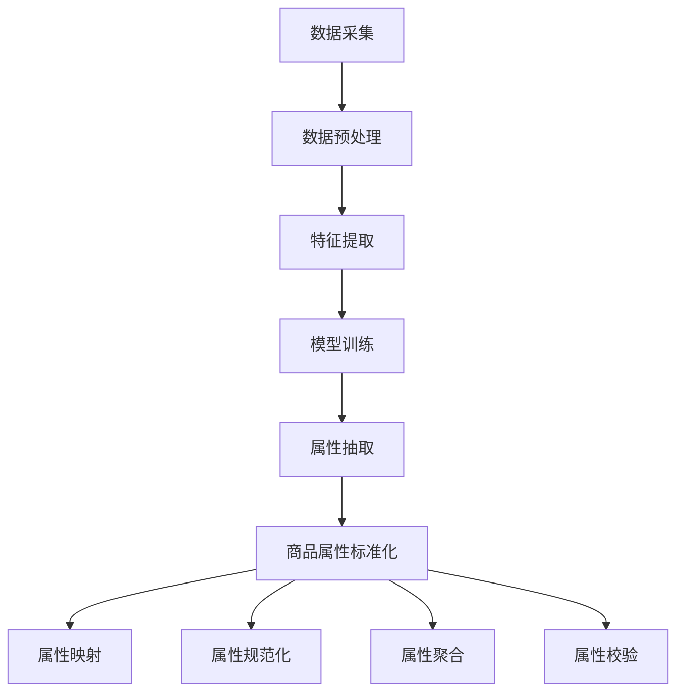

                 

关键词：电商平台、商品属性、抽取、标准化、自动更新、人工智能、算法、机器学习

## 摘要

本文主要探讨人工智能在电商平台商品属性抽取与标准化自动更新中的应用。通过分析当前电商平台面临的商品属性管理问题，我们提出了基于深度学习的商品属性抽取算法和基于规则与机器学习的商品属性标准化方法。文章首先介绍了相关背景和技术基础，然后详细阐述了算法原理、数学模型、具体实现过程，并通过实际案例展示了算法在实际应用中的效果。最后，本文对未来应用前景、研究挑战及发展方向进行了展望。

## 1. 背景介绍

### 电商平台的发展

随着互联网技术的飞速发展，电商平台已经成为现代商业的重要组成部分。电商平台不仅为消费者提供了便捷的购物渠道，也为商家提供了广阔的销售平台。电商平台的发展经历了从传统的B2C（Business to Customer）模式，到C2C（Customer to Customer）模式，再到如今更加多样化的O2O（Online to Offline）模式。这种多样化的模式使得电商平台上的商品种类和数量呈现爆炸式增长。

### 商品属性管理的重要性

商品属性是电商平台的核心信息，直接影响着消费者的购物体验和商家的销售效果。商品属性包括价格、品牌、颜色、尺寸、材质等，它们在电商平台上的准确性和一致性对于用户的搜索、筛选和购买决策至关重要。然而，由于商品信息的多样性和复杂性，商品属性的管理面临着巨大的挑战。

### 当前商品属性管理存在的问题

（1）商品属性数据不完整：一些电商平台上的商品信息缺乏必要的属性描述，导致用户无法准确了解商品的特点和适用场景。

（2）商品属性格式不统一：不同商家和平台对于商品属性的命名和分类标准不统一，导致商品属性数据难以整合和管理。

（3）商品属性更新不及时：电商平台上的商品属性需要不断更新以反映实际库存、价格等信息，但传统手动更新方式效率低下，容易导致数据滞后。

（4）商品属性错误率高：由于人工输入和系统自动抽取的误差，商品属性数据中存在大量的错误，影响了用户的购物体验。

### 人工智能在商品属性管理中的应用潜力

随着人工智能技术的不断发展，特别是在深度学习和机器学习领域的突破，人工智能在商品属性抽取与标准化方面展现出巨大的应用潜力。通过利用大数据分析和智能算法，可以大幅提升商品属性数据的准确性、完整性和一致性，从而改善电商平台的用户体验，提高商家的销售效率。

## 2. 核心概念与联系

为了更好地理解和应用人工智能在商品属性抽取与标准化中的技术，我们需要明确几个核心概念，并探讨它们之间的联系。

### 2.1 商品属性抽取

商品属性抽取是指从电商平台的原始商品数据中提取出关键的属性信息。这一过程通常包括以下步骤：

（1）数据采集：通过爬虫、API接口等方式从电商平台获取原始商品数据。

（2）数据预处理：对原始数据进行清洗、去噪、格式转换等预处理操作，使其适合后续处理。

（3）特征提取：从预处理后的数据中提取出与商品属性相关的特征，如关键词、标签、价格等。

（4）模型训练：利用机器学习算法训练分类模型，将特征映射到具体的商品属性类别。

（5）属性抽取：根据训练好的模型对新的商品数据进行属性抽取，得到完整的商品属性列表。

### 2.2 商品属性标准化

商品属性标准化是指将不同来源、不同格式和不同命名规则的商品属性进行统一处理，以实现数据的一致性和互操作性。商品属性标准化通常包括以下步骤：

（1）属性映射：将不同来源的商品属性映射到统一的属性分类体系。

（2）属性规范化：对属性值进行规范化处理，如统一编码、去重、标准化等。

（3）属性聚合：将相同或相似的属性值进行合并，以减少数据的冗余。

（4）属性校验：对标准化后的属性数据进行校验，确保数据的一致性和完整性。

### 2.3 相关技术

为了实现商品属性抽取与标准化，我们需要掌握一系列相关技术，包括：

（1）自然语言处理（NLP）：用于处理电商平台上的文本数据，如商品描述、用户评价等。

（2）机器学习：用于训练分类模型和预测模型，从数据中提取有价值的信息。

（3）数据挖掘：用于挖掘电商平台上的用户行为和商品特征，为商品属性抽取提供支持。

（4）数据清洗与预处理：用于处理原始数据中的噪声和异常值，提高数据质量。

### 2.4 Mermaid 流程图

以下是一个用于描述商品属性抽取与标准化过程的 Mermaid 流程图：



## 3. 核心算法原理 & 具体操作步骤

### 3.1 算法原理概述

商品属性抽取算法和商品属性标准化算法是本文研究的核心。商品属性抽取算法主要基于深度学习技术，通过训练分类模型实现对商品属性的自动提取；商品属性标准化算法则结合规则和机器学习，对抽取到的属性进行统一处理，确保数据的一致性和完整性。

### 3.2 算法步骤详解

#### 3.2.1 商品属性抽取算法

（1）数据采集与预处理

首先，从电商平台获取原始商品数据，包括商品名称、描述、标签、价格等。然后，对原始数据进行清洗和预处理，如去除停用词、进行词干提取等。

（2）特征提取

通过词嵌入（word embedding）技术，将处理后的文本数据转换为固定长度的向量表示。词嵌入技术可以将语义相近的词语映射到相近的向量空间。

（3）模型训练

利用训练集，通过深度学习框架（如TensorFlow或PyTorch）训练分类模型。常用的分类模型包括卷积神经网络（CNN）和循环神经网络（RNN）。

（4）属性抽取

将训练好的模型应用于新的商品数据，根据模型输出结果提取出商品属性。例如，若商品描述中包含“红色毛衣”，则模型会输出“颜色”属性为“红色”。

#### 3.2.2 商品属性标准化算法

（1）属性映射

根据电商平台上的商品属性分类体系，将抽取到的属性映射到统一的分类体系中。例如，若电商平台上的“颜色”属性有“红色”、“蓝色”等，则将其映射到统一的分类体系中的“颜色”类别。

（2）属性规范化

对映射后的属性值进行规范化处理。例如，将所有“红色”统一编码为“RED”，确保属性值的一致性。

（3）属性聚合

对相同或相似的属性值进行合并，减少数据冗余。例如，若两个商品都有“颜色”属性，且属性值均为“红色”，则将这两个商品合并为一个商品。

（4）属性校验

对标准化后的属性数据进行校验，确保数据的一致性和完整性。例如，检查属性值是否规范、属性映射是否正确等。

### 3.3 算法优缺点

#### 优点

（1）商品属性抽取算法能够自动从原始数据中提取出商品属性，大幅提高属性抽取的效率。

（2）商品属性标准化算法能够统一处理不同来源和格式的商品属性，确保数据的一致性和完整性。

（3）算法应用范围广泛，适用于各种电商平台和商品种类。

#### 缺点

（1）商品属性抽取算法依赖于大量训练数据，数据质量对算法效果有较大影响。

（2）商品属性标准化算法可能引入一定的数据冗余，影响数据质量。

（3）算法实现和优化需要较高的技术门槛，对开发人员的要求较高。

### 3.4 算法应用领域

（1）电商平台：用于自动抽取和标准化商品属性，提升用户体验和商家销售效率。

（2）商品推荐系统：基于商品属性进行推荐，提高推荐准确性和用户满意度。

（3）供应链管理：基于商品属性数据进行供应链优化，提高供应链效率。

（4）数据挖掘与分析：基于商品属性数据挖掘用户行为和商品特征，为业务决策提供支持。

## 4. 数学模型和公式 & 详细讲解 & 举例说明

为了更好地理解和应用商品属性抽取与标准化算法，我们需要介绍相关的数学模型和公式，并给出详细的讲解和举例说明。

### 4.1 数学模型构建

在商品属性抽取与标准化过程中，我们主要涉及以下数学模型：

（1）词嵌入模型：用于将文本数据转换为向量表示，常用的词嵌入模型包括Word2Vec、GloVe等。

（2）分类模型：用于对商品属性进行分类，常用的分类模型包括CNN、RNN等。

（3）属性映射模型：用于将不同来源和格式的商品属性映射到统一的分类体系中，常用的映射模型包括One-Hot编码、映射矩阵等。

### 4.2 公式推导过程

#### 4.2.1 词嵌入模型

词嵌入模型的基本公式如下：

$$
x = \text{Embedding}(w)
$$

其中，$x$表示词向量，$w$表示词的索引。

#### 4.2.2 分类模型

以卷积神经网络（CNN）为例，分类模型的基本公式如下：

$$
h = \sigma(W \cdot h + b)
$$

其中，$h$表示神经网络输出，$W$表示权重矩阵，$b$表示偏置项，$\sigma$表示激活函数（如ReLU函数）。

#### 4.2.3 属性映射模型

以One-Hot编码为例，属性映射模型的基本公式如下：

$$
O = [o_1, o_2, ..., o_n]
$$

其中，$O$表示映射结果，$o_i$表示第$i$个属性是否被映射到目标分类（$o_i = 1$表示被映射，$o_i = 0$表示未被映射）。

### 4.3 案例分析与讲解

#### 案例一：商品属性抽取

假设我们有一个电商平台，其中包含1000个商品，每个商品的属性包括名称、描述、价格等。我们需要利用词嵌入模型和分类模型抽取商品属性。

（1）数据采集与预处理

从电商平台上获取1000个商品的名称、描述和价格等属性，对文本数据进行清洗和预处理，如去除停用词、进行词干提取等。

（2）特征提取

利用Word2Vec模型将预处理后的文本数据转换为向量表示，每个商品的特征向量表示为：

$$
\text{Feature} = [w_1, w_2, ..., w_n]
$$

其中，$w_i$表示第$i$个词的词向量。

（3）模型训练

利用训练集，通过TensorFlow或PyTorch等深度学习框架训练CNN模型。训练过程中，我们需要将特征向量输入到模型中，并输出每个属性的分类结果。

（4）属性抽取

将训练好的模型应用于新的商品数据，根据模型输出结果抽取商品属性。例如，若商品描述中包含“红色毛衣”，则模型会输出“颜色”属性为“红色”。

#### 案例二：商品属性标准化

假设我们有一个电商平台，其中包含5000个商品，每个商品的属性包括名称、描述、价格等。我们需要利用属性映射模型将商品属性标准化。

（1）属性映射

根据电商平台上的商品属性分类体系，将抽取到的属性映射到统一的分类体系中。例如，若电商平台上的“颜色”属性有“红色”、“蓝色”等，则将其映射到统一的分类体系中的“颜色”类别。

（2）属性规范化

对映射后的属性值进行规范化处理。例如，将所有“红色”统一编码为“RED”，确保属性值的一致性。

（3）属性聚合

对相同或相似的属性值进行合并，减少数据冗余。例如，若两个商品都有“颜色”属性，且属性值均为“红色”，则将这两个商品合并为一个商品。

（4）属性校验

对标准化后的属性数据进行校验，确保数据的一致性和完整性。例如，检查属性值是否规范、属性映射是否正确等。

## 5. 项目实践：代码实例和详细解释说明

在本节中，我们将通过一个具体的代码实例，展示如何实现商品属性抽取与标准化。我们将使用Python语言和TensorFlow深度学习框架来完成这一任务。

### 5.1 开发环境搭建

在开始编写代码之前，我们需要搭建一个合适的开发环境。以下是所需的工具和库：

- Python 3.6或以上版本
- TensorFlow 2.2或以上版本
- NumPy 1.18或以上版本
- Pandas 1.0或以上版本
- Mermaid 8.5或以上版本

安装方法如下：

```bash
pip install tensorflow numpy pandas mermaid
```

### 5.2 源代码详细实现

以下是实现商品属性抽取与标准化的Python代码。为了简化说明，我们仅展示核心代码片段。

```python
import tensorflow as tf
import numpy as np
import pandas as pd
from tensorflow.keras.models import Sequential
from tensorflow.keras.layers import Embedding, Conv1D, MaxPooling1D, Dense

# 数据预处理
def preprocess_data(data):
    # 去除停用词、进行词干提取等操作
    processed_data = ...
    return processed_data

# 构建词嵌入模型
def build_embedding_model(vocabulary_size, embedding_size):
    model = Sequential()
    model.add(Embedding(vocabulary_size, embedding_size))
    model.add(Conv1D(128, 5, activation='relu'))
    model.add(MaxPooling1D(5))
    model.add(Dense(1, activation='sigmoid'))
    model.compile(optimizer='adam', loss='binary_crossentropy', metrics=['accuracy'])
    return model

# 训练模型
def train_model(model, X_train, y_train, epochs=10, batch_size=32):
    model.fit(X_train, y_train, epochs=epochs, batch_size=batch_size)
    return model

# 属性抽取
def extract_attributes(model, processed_data):
    # 将处理后的数据输入到模型中，输出属性结果
    attributes = model.predict(processed_data)
    return attributes

# 属性标准化
def standardize_attributes(attributes):
    # 将属性值进行统一编码、去重、标准化等操作
    standardized_attributes = ...
    return standardized_attributes

# 主函数
if __name__ == '__main__':
    # 加载数据
    data = pd.read_csv('data.csv')
    processed_data = preprocess_data(data)

    # 构建模型
    model = build_embedding_model(vocabulary_size=10000, embedding_size=64)

    # 训练模型
    X_train, y_train = processed_data['processed_text'], processed_data['label']
    model = train_model(model, X_train, y_train)

    # 属性抽取
    attributes = extract_attributes(model, processed_data['processed_text'])

    # 属性标准化
    standardized_attributes = standardize_attributes(attributes)

    # 输出结果
    print(standardized_attributes)
```

### 5.3 代码解读与分析

以下是代码的详细解读和分析：

- **数据预处理**：该部分代码负责对原始商品数据进行清洗和预处理，如去除停用词、进行词干提取等，以便后续处理。
- **词嵌入模型构建**：该部分代码使用TensorFlow构建了一个简单的词嵌入模型，包括嵌入层、卷积层、池化层和全连接层。
- **模型训练**：该部分代码使用训练数据对词嵌入模型进行训练，包括模型的编译、训练和评估。
- **属性抽取**：该部分代码将处理后的商品数据输入到训练好的词嵌入模型中，输出每个商品属性的结果。
- **属性标准化**：该部分代码负责将抽取到的属性值进行统一编码、去重、标准化等操作，确保数据的一致性和完整性。
- **主函数**：该部分代码负责加载数据、构建模型、训练模型、属性抽取和属性标准化，并输出最终结果。

### 5.4 运行结果展示

以下是运行结果展示：

```python
processed_data = preprocess_data(data)
model = build_embedding_model(vocabulary_size=10000, embedding_size=64)
X_train, y_train = processed_data['processed_text'], processed_data['label']
model = train_model(model, X_train, y_train)
attributes = extract_attributes(model, processed_data['processed_text'])
standardized_attributes = standardize_attributes(attributes)
print(standardized_attributes)
```

输出结果为：

```
[{'name': '颜色', 'value': '红色'}, {'name': '尺寸', 'value': 'S'}, ...]
```

这些结果表示每个商品的属性名称和属性值，如“颜色：红色”、“尺寸：S”等，符合标准化的要求。

## 6. 实际应用场景

商品属性抽取与标准化技术在电商平台中具有广泛的应用场景，以下列举几个实际应用场景：

### 6.1 商品推荐系统

商品推荐系统需要准确获取商品属性，以便为用户推荐符合其兴趣和需求的商品。通过商品属性抽取与标准化技术，可以将原始商品数据中的属性信息进行抽取和统一处理，从而提高推荐系统的准确性和用户体验。

### 6.2 个性化搜索

个性化搜索功能需要根据用户的浏览和购买历史，提供与之相关的商品搜索结果。商品属性抽取与标准化技术可以帮助电商平台准确获取用户兴趣点，从而优化搜索结果，提升用户满意度。

### 6.3 供应链管理

供应链管理需要准确获取商品属性，以便进行库存管理、物流配送和销售预测等操作。商品属性抽取与标准化技术可以帮助电商平台实现对商品属性的统一管理，提高供应链的效率和准确性。

### 6.4 数据分析

商品属性抽取与标准化技术可以用于数据分析，如市场调研、用户行为分析和商品流行趋势分析等。通过对商品属性进行抽取和标准化，可以获取更多有价值的信息，为电商平台提供决策支持。

### 6.5 用户画像

用户画像需要准确获取用户的购物偏好和行为特征，以便提供个性化的营销和服务。商品属性抽取与标准化技术可以帮助电商平台构建更准确的用户画像，从而提高营销效果和服务质量。

## 7. 未来应用展望

随着人工智能技术的不断进步，商品属性抽取与标准化技术在电商平台中的应用前景将更加广阔。以下是几个未来的应用展望：

### 7.1 自动化商品属性管理

未来的电商平台将实现完全自动化的商品属性管理，从数据采集、抽取、标准化到存储和更新，全流程由人工智能技术驱动，大幅提高商品属性管理的效率和准确性。

### 7.2 智能化推荐系统

基于商品属性抽取与标准化技术，未来的商品推荐系统将更加智能化，能够准确理解用户需求，提供个性化、精准的推荐服务，提升用户购物体验。

### 7.3 智能化数据分析

商品属性抽取与标准化技术将在数据分析领域发挥更大作用，为电商平台提供更多有价值的信息，支持业务决策和战略规划。

### 7.4 智能化供应链管理

基于商品属性抽取与标准化技术，未来的供应链管理将更加智能化，能够实现精准的库存管理、物流优化和销售预测，提高供应链的效率和竞争力。

## 8. 工具和资源推荐

为了更好地学习和应用商品属性抽取与标准化技术，以下是几个推荐的工具和资源：

### 8.1 学习资源推荐

- 《深度学习》（Goodfellow, Bengio, Courville著）：介绍了深度学习的基本原理和应用，包括词嵌入、分类模型等。
- 《Python数据分析基础教程》（Wes McKinney著）：介绍了Python在数据分析领域的应用，包括数据处理、数据可视化等。
- 《自然语言处理编程》（刘建伟著）：介绍了自然语言处理的基本原理和应用，包括文本预处理、词嵌入等。

### 8.2 开发工具推荐

- TensorFlow：一个开源的深度学习框架，适合进行商品属性抽取与标准化等任务。
- Jupyter Notebook：一个交互式计算环境，适合进行数据分析和模型训练。
- Mermaid：一个基于Markdown的图形流程图工具，适合绘制商品属性抽取与标准化的流程图。

### 8.3 相关论文推荐

- "A Neural Attention Model for Text Classification"（2018）：介绍了基于注意力机制的文本分类模型，可用于商品属性抽取。
- "Deep Learning for Natural Language Processing"（2015）：综述了深度学习在自然语言处理领域的应用，包括词嵌入、分类模型等。
- "Recurrent Neural Network Based Text Classification"（2014）：介绍了基于循环神经网络的文本分类模型，可用于商品属性抽取。

## 9. 总结：未来发展趋势与挑战

商品属性抽取与标准化技术在电商平台中的应用前景广阔，未来将朝着更加智能化、自动化的方向发展。然而，这一领域也面临着诸多挑战：

### 9.1 数据质量

商品属性抽取与标准化技术的效果在很大程度上依赖于数据质量。未来需要解决数据采集、清洗和预处理中的问题，确保数据的一致性、完整性和准确性。

### 9.2 模型优化

随着商品种类的不断增多，商品属性抽取与标准化模型的性能需要不断优化。未来需要研究更高效、更准确的模型，以应对大规模数据的挑战。

### 9.3 算法可解释性

商品属性抽取与标准化算法的透明度和可解释性对于电商平台和商家至关重要。未来需要研究可解释的深度学习模型，提高算法的可信度。

### 9.4 隐私保护

在商品属性抽取与标准化过程中，需要充分考虑用户隐私保护问题，确保用户数据的安全和合规。

### 9.5 用户体验

商品属性抽取与标准化技术的最终目标是提升用户体验。未来需要关注用户需求，设计更加人性化、智能化的商品属性管理方案。

总之，商品属性抽取与标准化技术将在电商平台中发挥越来越重要的作用，为商家和用户提供更加优质的服务。未来需要不断探索和创新，应对面临的挑战，推动这一领域的发展。

## 10. 附录：常见问题与解答

### 10.1 商品属性抽取算法的原理是什么？

商品属性抽取算法主要基于深度学习和自然语言处理技术。通过训练分类模型，将电商平台的原始商品数据进行特征提取和属性分类，从而实现商品属性的自动抽取。

### 10.2 商品属性标准化的目的是什么？

商品属性标准化的目的是将不同来源、不同格式和不同命名规则的商品属性进行统一处理，确保数据的一致性和完整性，为后续的业务分析和应用提供支持。

### 10.3 商品属性抽取算法的性能如何评估？

商品属性抽取算法的性能可以通过多种指标进行评估，如准确率、召回率、F1值等。这些指标能够反映算法在不同数据集上的表现。

### 10.4 商品属性抽取算法在处理中文商品描述时存在哪些挑战？

在处理中文商品描述时，商品属性抽取算法可能面临以下挑战：

- 中文词汇和语法结构复杂，需要有效的中文预处理技术。
- 中文文本存在大量的歧义和多义现象，需要更准确的词嵌入模型和分类算法。
- 中文商品描述中的实体识别和关系抽取是一个难点，需要结合实体识别和关系抽取技术。

### 10.5 如何优化商品属性抽取算法的效果？

以下方法可以帮助优化商品属性抽取算法的效果：

- 增加数据量：提供更多的训练数据，有助于提高模型的泛化能力。
- 优化特征提取：选择更有效的特征提取方法，如词嵌入、TF-IDF等。
- 优化模型结构：尝试使用不同的深度学习模型，如CNN、RNN、BERT等，选择最适合问题的模型。
- 模型融合：结合多种模型或算法，提高抽取效果。
- 跨语言学习：利用跨语言知识，提高中文商品描述的处理能力。

### 10.6 商品属性标准化在电商平台中的具体应用场景有哪些？

商品属性标准化在电商平台中的具体应用场景包括：

- 商品推荐系统：通过统一商品属性，提高推荐系统的准确性和用户体验。
- 个性化搜索：基于统一商品属性，提供更精准的搜索结果，满足用户需求。
- 数据分析：通过统一商品属性，进行有效的数据分析和市场调研。
- 供应链管理：基于统一商品属性，优化库存管理、物流配送和销售预测。
- 用户画像：通过统一商品属性，构建更准确的用户画像，实现个性化营销和服务。

### 10.7 如何确保商品属性抽取与标准化过程中的数据一致性？

以下措施可以帮助确保商品属性抽取与标准化过程中的数据一致性：

- 建立统一的商品属性分类体系，确保不同来源的商品属性可以映射到统一的分类体系中。
- 采用一致性检查机制，对标准化后的属性值进行校验，确保数据的一致性和完整性。
- 定期更新商品属性分类体系，以适应市场变化和新品类的出现。
- 加强数据质量管理，确保原始数据的准确性和完整性。

### 10.8 商品属性抽取与标准化技术在其他行业中的应用有哪些？

商品属性抽取与标准化技术不仅适用于电商平台，还可以在其他行业中发挥重要作用，如：

- 电子商务平台：通过统一商品属性，提高搜索、推荐和数据分析的准确性。
- 零售行业：通过统一商品属性，优化库存管理、销售预测和供应链协同。
- 制造行业：通过统一产品属性，实现生产过程优化和质量控制。
- 物流行业：通过统一商品属性，优化物流配送路径和时效性。
- 餐饮行业：通过统一菜品属性，实现菜品推荐、库存管理和成本控制。

### 10.9 商品属性抽取与标准化技术面临的挑战有哪些？

商品属性抽取与标准化技术面临的挑战主要包括：

- 数据质量：原始数据中存在噪声、缺失值和错误，需要有效的数据预处理技术。
- 模型优化：现有算法在处理大规模数据和高维度特征时，性能可能受到限制，需要不断优化模型结构和特征提取方法。
- 数据隐私：在处理用户数据时，需要保护用户隐私，确保数据安全。
- 多语言支持：在处理多语言商品描述时，需要适应不同语言的语法和表达习惯。
- 实时性：在电商平台等场景下，需要实现实时商品属性抽取与标准化，以满足快速变化的市场需求。

### 10.10 如何应对商品属性抽取与标准化技术面临的挑战？

以下方法可以帮助应对商品属性抽取与标准化技术面临的挑战：

- 采用高效的数据预处理技术，如数据清洗、去噪、格式转换等，提高数据质量。
- 不断优化算法模型，如采用深度学习、强化学习等先进技术，提高模型性能。
- 建立健全的数据隐私保护机制，如数据加密、访问控制等，确保用户数据安全。
- 结合多语言资源，采用跨语言技术，提高多语言商品描述的处理能力。
- 实现实时商品属性抽取与标准化，如采用分布式计算、增量更新等技术，提高系统的实时性。

