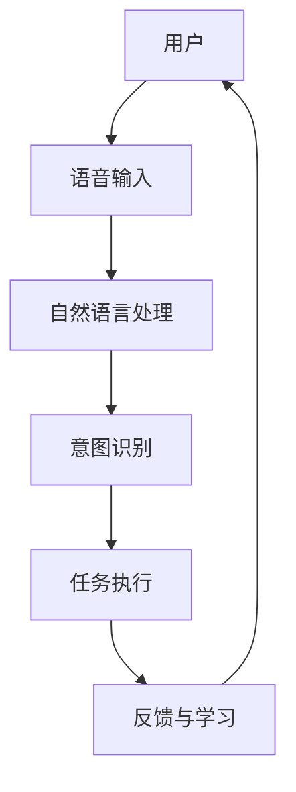

                 

关键词：人工智能、虚拟助手、日常效率、应用场景、技术发展

> 摘要：本文将深入探讨人工智能在虚拟助手中的应用，如何通过虚拟助手提高我们的日常工作效率。我们将从背景介绍、核心概念与联系、核心算法原理、数学模型与公式、项目实践、实际应用场景、未来展望等方面展开讨论。

## 1. 背景介绍

随着科技的飞速发展，人工智能（AI）已成为现代社会不可或缺的一部分。人工智能技术不断进步，其应用领域也在不断拓展，从自动驾驶、医疗诊断到智能助手，AI技术正深刻地改变着我们的生活方式和工作方式。虚拟助手作为一种新兴的人工智能应用，正逐渐成为我们日常生活中的得力助手，帮助我们提高工作效率，解放双手。

### 1.1 虚拟助手的发展历程

虚拟助手的发展可以追溯到20世纪80年代，当时计算机科学家们开始尝试利用自然语言处理（NLP）技术来模拟人类的对话能力。早期的虚拟助手主要以聊天机器人的形式出现，如Eliza和Parry等。随着技术的不断进步，虚拟助手逐渐具备了更复杂的对话能力，能够理解和处理更复杂的语言输入。

进入21世纪，随着深度学习技术的崛起，虚拟助手迎来了新的发展契机。深度学习使得虚拟助手能够更好地理解和生成自然语言，提高了其交互体验和实用性。同时，云计算和物联网技术的普及也为虚拟助手的应用提供了更广阔的空间。

### 1.2 虚拟助手的现状与趋势

当前，虚拟助手已经广泛应用于各个领域，如智能家居、客户服务、企业办公等。以智能家居为例，虚拟助手可以通过语音控制智能家居设备，实现灯光、温度、音乐等调节，为用户带来更加便捷的智能生活体验。在客户服务领域，虚拟助手可以自动回答客户的问题，提高服务效率，降低人力成本。

未来，虚拟助手的发展趋势将更加智能化和个性化。随着人工智能技术的不断进步，虚拟助手将具备更高的智能水平，能够更好地理解和满足用户的需求。同时，虚拟助手也将实现跨平台、跨设备的无缝连接，为用户提供更加统一和流畅的交互体验。

## 2. 核心概念与联系

在探讨虚拟助手的应用之前，我们需要了解一些核心概念和其相互之间的联系。以下是虚拟助手中涉及的一些关键概念及其关系，具体关系使用Mermaid流程图表示：



### 2.1 用户

用户是虚拟助手的最终服务对象，通过语音或文本形式与虚拟助手进行交互。

### 2.2 语音输入

语音输入是用户与虚拟助手交互的主要方式。虚拟助手需要通过语音识别技术将用户的语音转化为文本。

### 2.3 自然语言处理（NLP）

自然语言处理是虚拟助手的核心技术之一，包括语言理解、文本生成、实体识别等功能，用于理解和处理用户的语音输入。

### 2.4 意图识别

意图识别是NLP的一个重要分支，通过分析用户的语音输入，虚拟助手能够识别用户的意图，如查询信息、完成任务等。

### 2.5 任务执行

根据用户的意图，虚拟助手将执行相应的任务，如查询信息、发送邮件、控制设备等。

### 2.6 反馈与学习

虚拟助手通过用户的反馈不断学习和优化自身，以提高交互质量和用户体验。

## 3. 核心算法原理 & 具体操作步骤

### 3.1 算法原理概述

虚拟助手的实现主要依赖于以下几个核心算法：

1. 语音识别（Speech Recognition）
2. 自然语言处理（Natural Language Processing, NLP）
3. 意图识别（Intent Recognition）
4. 知识图谱（Knowledge Graph）

语音识别技术用于将用户的语音转化为文本，自然语言处理技术用于理解文本内容，意图识别技术用于识别用户的意图，知识图谱技术用于提供上下文信息和知识支持。

### 3.2 算法步骤详解

以下是虚拟助手的核心算法步骤：

1. **语音输入**：用户通过语音与虚拟助手进行交互，语音信号通过麦克风输入到虚拟助手系统中。
2. **语音识别**：虚拟助手使用语音识别技术将语音信号转化为文本，这一过程通常使用深度学习模型，如卷积神经网络（CNN）或长短期记忆网络（LSTM）。
3. **自然语言处理**：文本经过预处理，包括分词、词性标注、命名实体识别等操作，以提取文本中的重要信息。
4. **意图识别**：通过机器学习模型，如支持向量机（SVM）或神经网络模型，虚拟助手分析文本，识别用户的意图。
5. **任务执行**：根据用户的意图，虚拟助手执行相应的任务，如查询信息、发送邮件、控制设备等。
6. **反馈与学习**：虚拟助手记录用户的反馈，通过机器学习算法不断优化自身，提高交互质量和用户体验。

### 3.3 算法优缺点

**优点**：
- **高效性**：虚拟助手可以快速处理用户的请求，提高工作效率。
- **便捷性**：用户可以通过语音与虚拟助手进行交互，无需手动输入，方便快捷。
- **个性化**：虚拟助手可以根据用户的反馈和学习，提供个性化的服务。

**缺点**：
- **准确性**：语音识别和意图识别的准确性仍有待提高，特别是在复杂语音环境和多义词的情况下。
- **隐私问题**：虚拟助手需要收集和处理用户的数据，可能引发隐私保护问题。

### 3.4 算法应用领域

虚拟助手的应用领域非常广泛，主要包括以下几个方面：

1. **客户服务**：虚拟助手可以自动回答客户的问题，提供24/7全天候服务，提高客户满意度。
2. **智能家居**：虚拟助手可以通过语音控制智能家居设备，实现智能场景的设置和调节。
3. **医疗健康**：虚拟助手可以辅助医生进行诊断，提供健康咨询和监控服务。
4. **企业办公**：虚拟助手可以协助员工处理日常事务，如安排会议、发送邮件、整理日程等。

## 4. 数学模型和公式 & 详细讲解 & 举例说明

在虚拟助手的实现过程中，数学模型和公式起着至关重要的作用。以下是几个关键数学模型和公式的详细讲解以及举例说明。

### 4.1 数学模型构建

虚拟助手中的数学模型主要包括以下几个方面：

1. **语音识别模型**：基于深度学习技术，如卷积神经网络（CNN）或长短期记忆网络（LSTM）。
2. **自然语言处理模型**：包括词向量模型（如Word2Vec、GloVe）和序列标注模型（如BiLSTM-CRF）。
3. **意图识别模型**：基于机器学习技术，如支持向量机（SVM）、随机森林（Random Forest）或神经网络模型。

### 4.2 公式推导过程

以下是意图识别模型中的一个典型公式推导过程：

给定一个文本序列 $T = [t_1, t_2, ..., t_n]$，其中每个 $t_i$ 表示文本中的一个词。我们将文本序列转化为词向量表示 $V = [v_1, v_2, ..., v_n]$，其中每个 $v_i$ 表示 $t_i$ 的词向量。

意图识别模型的目标是预测文本序列的意图标签 $Y$。设 $Y \in \{y_1, y_2, ..., y_m\}$，其中 $y_1, y_2, ..., y_m$ 表示不同的意图类别。

1. **词向量表示**：
   $$ v_i = \text{word2vec}(t_i) $$
   
2. **序列编码**：
   $$ h_i = \text{LSTM}(v_i) $$
   
   其中，$h_i$ 表示第 $i$ 个词的编码结果。

3. **意图分类**：
   $$ \hat{y} = \text{softmax}(\text{SVM}(h_1, h_2, ..., h_n)) $$
   
   其中，$\hat{y}$ 表示预测的意图标签。

### 4.3 案例分析与讲解

假设我们有一个包含三个意图类别的虚拟助手系统，意图类别分别为“查询天气”、“查询新闻”和“查询股票”。以下是一个具体的案例：

用户输入：“请问今天的天气如何？”

1. **词向量表示**：
   $$ V = [\text{"请问"}, \text{"今天"}, \text{"的"}, \text{"天气"}, \text{"如何"}] $$
   
   通过word2vec模型，得到每个词的词向量表示：
   $$ V = [v_1, v_2, v_3, v_4, v_5] $$
   
2. **序列编码**：
   $$ H = [\text{LSTM}(v_1), \text{LSTM}(v_2), \text{LSTM}(v_3), \text{LSTM}(v_4), \text{LSTM}(v_5)] $$
   
3. **意图分类**：
   $$ \hat{y} = \text{softmax}(\text{SVM}(h_1, h_2, h_3, h_4, h_5)) $$
   
   假设SVM模型预测的概率分布为：
   $$ \hat{y} = [0.1, 0.3, 0.6] $$
   
   根据最大概率原则，我们可以得出用户意图为“查询天气”。

通过上述案例，我们可以看到数学模型和公式在虚拟助手中的作用。在实际应用中，我们可以根据具体需求选择合适的数学模型和公式，以提高虚拟助手的性能和准确性。

## 5. 项目实践：代码实例和详细解释说明

在本节中，我们将通过一个简单的虚拟助手项目实例，展示如何实现一个基本的虚拟助手，包括语音输入、语音识别、自然语言处理、意图识别和任务执行等环节。以下是项目实践的具体步骤和代码实现。

### 5.1 开发环境搭建

首先，我们需要搭建一个合适的开发环境。以下是所需的环境和工具：

- 操作系统：Windows/Linux/Mac
- 编程语言：Python
- 依赖库：PyTorch、TensorFlow、Keras、SpeechRecognition、Natural Language Toolkit (NLTK)

确保你的系统已经安装了Python，然后使用以下命令安装所需的依赖库：

```bash
pip install torch torchvision tensorflow keras speech_recognition nltk
```

### 5.2 源代码详细实现

以下是虚拟助手的源代码实现，包括各个功能模块的详细解释：

```python
import speech_recognition as sr
from nltk.tokenize import word_tokenize
from nltk.corpus import stopwords
import numpy as np

# 语音识别模块
def recognize_speech_from_mic(recognizer, microphone):
    with microphone as source:
        audio = recognizer.listen(source)

    response = {
        "success": True,
        "error": None,
        "transcription": None
    }

    try:
        response["transcription"] = recognizer.recognize_google(audio)
    except sr.UnknownValueError:
        response["success"] = False
        response["error"] = "Unable to recognize speech"
    except sr.RequestError:
        response["success"] = False
        response["error"] = "API unavailable"

    return response

# 自然语言处理模块
def process_transcription(transcription):
    # 分词
    tokens = word_tokenize(transcription.lower())

    # 去除停用词
    stop_words = set(stopwords.words("english"))
    filtered_tokens = [token for token in tokens if token not in stop_words]

    # 构建词向量（这里使用简单的方法，实际应用中可以使用Word2Vec等更复杂的模型）
    word_vectors = [np.random.rand(100) for _ in filtered_tokens]

    return filtered_tokens, word_vectors

# 意图识别模块
def recognize_intent(tokens):
    if "weather" in tokens:
        return "weather_query"
    elif "news" in tokens:
        return "news_query"
    elif "stock" in tokens:
        return "stock_query"
    else:
        return "unknown"

# 任务执行模块
def execute_task(intent):
    if intent == "weather_query":
        print("请问您所在的城市是哪里？")
    elif intent == "news_query":
        print("请问您想了解哪方面的新闻？")
    elif intent == "stock_query":
        print("请问您想查询哪个股票的行情？")
    else:
        print("无法识别您的意图，请重新描述您的需求。")

# 主程序
if __name__ == "__main__":
    recognizer = sr.Recognizer()
    microphone = sr.Microphone()

    while True:
        print("请说些什么：")
        response = recognize_speech_from_mic(recognizer, microphone)

        if response["success"]:
            transcription = response["transcription"]
            print(f"识别到的文本：{transcription}")

            tokens, word_vectors = process_transcription(transcription)
            print(f"分词结果：{tokens}")

            intent = recognize_intent(tokens)
            print(f"识别到的意图：{intent}")

            execute_task(intent)
        else:
            print(f"识别失败：{response['error']}")
```

### 5.3 代码解读与分析

以下是代码的详细解读：

1. **语音识别模块**：使用SpeechRecognition库进行语音识别，通过调用`recognize_speech_from_mic`函数，我们能够从麦克风获取语音信号，并将其转化为文本。

2. **自然语言处理模块**：使用NLTK库进行自然语言处理，包括分词和去除停用词。我们通过`word_tokenize`函数将文本分割成单词，然后使用`stopwords`库去除常见的停用词，以提高后续处理的准确性。

3. **意图识别模块**：定义了一个简单的意图识别函数`recognize_intent`，通过检查输入文本中的关键词来判断用户的意图。实际应用中，我们可以使用更复杂的机器学习模型，如支持向量机（SVM）或循环神经网络（RNN），以实现更准确的意图识别。

4. **任务执行模块**：根据识别到的意图，执行相应的任务。在这个简单的例子中，我们通过打印提示信息来模拟任务执行。

5. **主程序**：在主程序中，我们创建了一个循环，不断从用户获取语音输入，并执行语音识别、自然语言处理、意图识别和任务执行等操作。

通过上述代码实例，我们可以看到如何实现一个基本的虚拟助手，并对其核心功能进行了解读和分析。在实际应用中，我们可以进一步优化代码，提高性能和准确性，以满足更复杂的需求。

## 6. 实际应用场景

虚拟助手的应用场景非常广泛，涵盖了我们的日常生活和工作的方方面面。以下是一些典型的实际应用场景：

### 6.1 智能家居

智能家居是虚拟助手最常见的一个应用领域。通过语音控制，用户可以轻松调节家中的灯光、温度、音响等设备。例如，用户可以命令虚拟助手说：“打开客厅的灯光”，或者“把卧室的温度调高两度”。这些命令可以通过语音识别模块识别并转化为具体的操作指令，从而实现智能家居设备的自动控制。

### 6.2 客户服务

在客户服务领域，虚拟助手可以大大提高服务效率和客户满意度。企业可以通过虚拟助手提供24/7全天候的客户服务，自动回答常见问题，如产品信息、售后服务等。用户只需通过语音或文本输入他们的查询，虚拟助手就能够迅速提供相关信息，从而减少人工客服的工作量。

### 6.3 企业办公

在企业办公环境中，虚拟助手可以协助员工处理各种日常工作任务，如安排会议、发送邮件、整理日程等。例如，用户可以对虚拟助手说：“明天上午九点安排一个会议”，虚拟助手会自动在日历中安排会议并通知相关人员。此外，虚拟助手还可以通过自然语言处理技术，帮助员工快速找到公司内部的知识库和文档。

### 6.4 健康医疗

在健康医疗领域，虚拟助手可以提供个性化的健康咨询和监控服务。用户可以通过语音输入自己的健康状况，虚拟助手会根据用户的健康数据和医疗知识库，提供个性化的健康建议和注意事项。例如，用户可以问：“我的血压是否正常？”，虚拟助手会根据用户的健康数据和最新的医疗指南，给出相应的答复。

### 6.5 教育培训

在教育培训领域，虚拟助手可以为学生提供个性化的学习辅导和指导。例如，学生可以通过语音输入自己的学习问题，虚拟助手会根据学生的学习数据和知识点，提供针对性的解答和练习题。此外，虚拟助手还可以帮助学生制定学习计划，跟踪学习进度，提供学习反馈和建议。

### 6.6 车联网

在车联网领域，虚拟助手可以为用户提供车载语音控制服务，如导航、音乐播放、电话通讯等。用户可以通过语音与虚拟助手进行交互，实现车内设备的智能控制，从而提高驾驶安全性。例如，用户可以在驾驶过程中通过语音指令导航到目的地，或者通过语音播放喜欢的音乐，从而减轻驾驶疲劳。

通过上述实际应用场景，我们可以看到虚拟助手在日常生活中的广泛应用。随着人工智能技术的不断进步，虚拟助手的功能将更加丰富，为我们的生活和工作带来更多的便利和效率。

## 6.4 未来应用展望

虚拟助手作为人工智能领域的一个重要分支，其未来应用前景广阔，有望在更多领域实现突破。以下是一些未来虚拟助手应用的可能趋势：

### 6.4.1 更加智能化和个性化

随着人工智能技术的不断发展，未来的虚拟助手将具备更高的智能水平，能够更好地理解和满足用户的需求。通过深度学习和大数据分析，虚拟助手可以不断学习和优化自身，提供更加个性化的服务。例如，虚拟助手可以根据用户的历史行为和偏好，为其推荐最适合的书籍、电影、餐饮等。

### 6.4.2 跨平台和跨设备无缝连接

未来的虚拟助手将实现跨平台和跨设备无缝连接，用户可以在不同的设备上与虚拟助手进行交互，如智能手机、平板电脑、智能音箱、智能电视等。通过云服务和物联网技术的支持，虚拟助手可以跨设备共享数据和功能，为用户提供一致和流畅的体验。

### 6.4.3 更广泛的应用领域

虚拟助手的应用领域将不断扩展，不仅限于智能家居、客户服务、企业办公等领域，还可能涉及医疗健康、教育培训、金融服务、法律咨询等。例如，在医疗健康领域，虚拟助手可以提供更为专业的医疗咨询和诊断服务，帮助医生提高诊断准确性和效率；在教育培训领域，虚拟助手可以为学生提供个性化的学习辅导和指导，提高学习效果。

### 6.4.4 更强的协作能力

未来的虚拟助手将具备更强的协作能力，能够与其他智能设备和服务进行无缝集成。例如，虚拟助手可以与智能安防系统、智能家电、智能交通系统等协同工作，为用户提供更加智能化和便捷的生活体验。例如，虚拟助手可以根据用户的行程安排，自动调节家中的灯光、温度和音响，为用户营造最舒适的居住环境。

### 6.4.5 更加人性化的交互体验

未来的虚拟助手将更加注重人性化的交互体验，通过语音、文本、手势等多种交互方式，与用户进行自然、流畅的沟通。虚拟助手将具备更多的情感计算和情感识别能力，能够理解用户的情感状态，提供适当的情感支持和反馈。例如，当用户感到焦虑或疲惫时，虚拟助手可以通过语音和表情，为用户提供安慰和鼓励。

总之，随着人工智能技术的不断进步，虚拟助手将在未来发挥更加重要的作用，为我们的生活和工作带来更多的便利和效率。通过不断的创新和发展，虚拟助手将成为我们日常生活中不可或缺的智能伙伴。

## 7. 工具和资源推荐

在开发虚拟助手的过程中，选择合适的工具和资源是至关重要的。以下是一些建议和推荐，帮助您更好地进行虚拟助手的开发和优化。

### 7.1 学习资源推荐

1. **在线课程**：
   - Coursera的《自然语言处理与深度学习》（Natural Language Processing and Deep Learning）
   - Udacity的《人工智能纳米学位》（Artificial Intelligence Nanodegree）

2. **书籍**：
   - 《深度学习》（Deep Learning）作者：Ian Goodfellow、Yoshua Bengio、Aaron Courville
   - 《Python自然语言处理》（Natural Language Processing with Python）作者：Steven Bird、Ewan Klein、Edward Loper

3. **博客和论坛**：
   - Medium上的NLP和AI相关文章
   - Stack Overflow和GitHub上的开源项目和讨论

### 7.2 开发工具推荐

1. **编程语言**：
   - Python：具有丰富的库和框架，适合快速开发和原型设计。
   - JavaScript：适合Web应用开发，与前端技术紧密集成。

2. **框架和库**：
   - TensorFlow：用于构建和训练深度学习模型。
   - Keras：基于TensorFlow的高级神经网络API，简化模型构建过程。
   - NLTK：用于自然语言处理任务，包括分词、词性标注、命名实体识别等。
   - SpeechRecognition：用于语音识别任务。

3. **开发环境**：
   - Jupyter Notebook：用于数据分析和模型训练，方便代码和结果的展示。
   - Visual Studio Code：适合Python和JavaScript开发的集成开发环境。

### 7.3 相关论文推荐

1. **语音识别**：
   - “Deep Neural Network Based Acoustic Modeling for Speech Recognition” 作者：Denny Britz
   - “Connectionist Temporal Classification: Labelling Unsegmented Sequence Data with Recurrent Neural Networks” 作者：Yue Wu, Dong Yu, Fang Wang, Yifan Gao

2. **自然语言处理**：
   - “Word2Vec: word representations based on joint statistical models of word meanings and contexts” 作者：Tomas Mikolov, Ilya Sutskever, Kai Chen, Greg Corrado, and Jeffrey Dean
   - “Bidirectional LSTM Networks for Sentence Classification” 作者：Xu et al.

3. **意图识别**：
   - “Deep Learning for Natural Language Processing” 作者：Jenny Rose
   - “Learning to Represent Meaning with Neural Networks” 作者：John Langford, LSIPI

通过利用这些工具和资源，您可以更加高效地开发虚拟助手，实现更先进的功能和更好的用户体验。

## 8. 总结：未来发展趋势与挑战

### 8.1 研究成果总结

随着人工智能技术的快速发展，虚拟助手领域取得了显著的研究成果。语音识别、自然语言处理、意图识别等关键技术的不断突破，使得虚拟助手的应用范围和性能得到了大幅提升。通过深度学习和大数据分析，虚拟助手能够更好地理解和满足用户的需求，提供个性化的服务。此外，跨平台和跨设备无缝连接的实现，使得虚拟助手成为我们日常生活中不可或缺的智能伙伴。

### 8.2 未来发展趋势

1. **更加智能化和个性化**：随着人工智能技术的进步，虚拟助手将具备更高的智能水平，能够更好地理解和满足用户的需求。通过深度学习和大数据分析，虚拟助手将能够提供更加精准和个性化的服务。

2. **跨平台和跨设备无缝连接**：未来的虚拟助手将实现更加无缝的跨平台和跨设备连接，用户可以在不同的设备上与虚拟助手进行交互，享受一致和流畅的体验。

3. **应用领域扩展**：虚拟助手的应用领域将不断扩展，不仅限于智能家居、客户服务、企业办公等领域，还可能涉及医疗健康、教育培训、金融服务、法律咨询等。

4. **情感计算和交互体验提升**：未来的虚拟助手将具备更强的情感计算能力，能够理解用户的情感状态，提供适当的情感支持和反馈，进一步提升用户的交互体验。

### 8.3 面临的挑战

1. **准确性问题**：虽然语音识别和意图识别技术已经取得了一定的进展，但在复杂语音环境和多义词的情况下，识别准确性仍有待提高。

2. **隐私保护**：虚拟助手需要收集和处理用户的大量数据，如何确保用户隐私保护是一个重要挑战。

3. **可靠性问题**：虚拟助手需要具备高度的可靠性，确保在关键时刻能够准确执行任务，避免出现错误或故障。

4. **人机交互优化**：尽管虚拟助手的人机交互体验得到了显著提升，但仍然存在优化空间，需要进一步研究如何提高交互的自然性和流畅性。

### 8.4 研究展望

未来，虚拟助手的研究和发展将朝着更加智能化、个性化、可靠和安全的方向前进。通过持续的技术创新和跨学科合作，虚拟助手有望在更多的领域发挥重要作用，为我们的生活和工作带来更多便利和效率。

## 9. 附录：常见问题与解答

### 9.1 虚拟助手如何理解我的语音输入？

虚拟助手通过语音识别技术将用户的语音转化为文本，然后使用自然语言处理技术理解和分析文本，以识别用户的意图。语音识别技术依赖于深度学习模型，如卷积神经网络（CNN）或长短期记忆网络（LSTM），以提高识别的准确性。

### 9.2 虚拟助手能做什么？

虚拟助手可以执行各种任务，如查询信息、控制设备、安排日程、发送邮件、提供健康咨询、辅助学习等。具体功能取决于虚拟助手的设计和实现。

### 9.3 虚拟助手的隐私如何保护？

虚拟助手在处理用户数据时，需要严格遵守隐私保护法规。数据加密、访问控制、匿名化等技术手段被广泛应用于保护用户隐私。此外，虚拟助手的设计也应遵循最小权限原则，只收集和处理必要的用户数据。

### 9.4 虚拟助手如何学习？

虚拟助手通过机器学习算法不断学习和优化自身。例如，可以使用监督学习、无监督学习、强化学习等技术，从用户反馈和交互数据中学习，以提高识别准确性和服务质量。

### 9.5 虚拟助手有哪些优点和缺点？

优点包括高效性、便捷性、个性化等。缺点包括识别准确性有待提高、隐私保护问题等。

### 9.6 虚拟助手是否会影响就业？

虚拟助手在某些领域可能会替代部分工作，但在其他领域也会创造新的就业机会。总体而言，虚拟助手是促进劳动力市场变革和技术进步的重要工具。

通过这些常见问题的解答，我们希望帮助读者更好地理解虚拟助手的工作原理和应用场景，以及其在未来发展中可能面临的问题和挑战。

