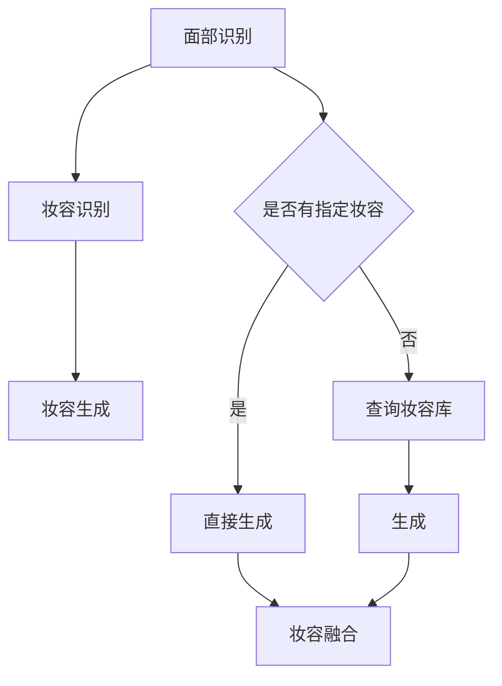

                 

关键词：虚拟化妆、AI、计算机视觉、深度学习、图像处理

> 摘要：本文将探讨人工智能在虚拟化妆领域的应用，特别是如何利用深度学习和计算机视觉技术实现不同妆容的尝试。文章将详细介绍相关核心概念、算法原理、数学模型、项目实践以及实际应用场景，旨在为读者提供一份全面的技术指南。

## 1. 背景介绍

虚拟化妆，即通过计算机技术实现对人物面部化妆的模拟，已经成为当今时尚美妆和影视娱乐等领域的重要工具。传统的化妆方法需要消耗大量的时间和人力，且无法满足快速变化的需求。随着人工智能技术的发展，虚拟化妆迎来了全新的机遇。人工智能，特别是深度学习和计算机视觉，为虚拟化妆提供了强大的技术支撑，使得虚拟化妆变得更加智能和高效。

在虚拟化妆中，AI 的主要任务包括面部识别、妆容识别和妆容生成。面部识别用于确定人物面部特征，妆容识别用于判断当前妆容类型，而妆容生成则是通过算法生成用户指定的妆容效果。这些任务的实现离不开深度学习和计算机视觉技术。

## 2. 核心概念与联系

### 2.1. 面部识别

面部识别是虚拟化妆的基础，其主要任务是从图像中检测和定位面部区域。这通常通过卷积神经网络（CNN）实现，具体过程如下：

1. **人脸检测**：利用预训练的人脸检测模型（如 MTCNN）在图像中检测人脸区域。
2. **特征提取**：将人脸区域输入到 CNN 中，提取出人脸特征。
3. **特征匹配**：利用人脸特征进行匹配，识别出具体的人脸。

### 2.2. 妆容识别

妆容识别的任务是确定当前图像中的妆容类型。这可以通过训练一个多类别的卷积神经网络实现，具体步骤如下：

1. **数据预处理**：收集并标记大量妆容数据，进行数据预处理。
2. **模型训练**：使用预处理后的数据训练卷积神经网络，用于识别不同类型的妆容。
3. **妆容识别**：将检测到的人脸图像输入到训练好的模型中，得到对应的妆容类型。

### 2.3. 妆容生成

妆容生成是虚拟化妆的核心任务，即通过算法生成用户指定的妆容效果。这通常通过以下步骤实现：

1. **妆容编码**：将用户指定的妆容信息编码成向量。
2. **图像转换**：使用生成对抗网络（GAN）将人脸图像转换为指定妆容的图像。
3. **妆容融合**：将生成的妆容图像与人脸图像进行融合，得到最终的虚拟化妆效果。

### 2.4. Mermaid 流程图



## 3. 核心算法原理 & 具体操作步骤

### 3.1 算法原理概述

虚拟化妆中的核心算法主要包括面部识别、妆容识别和妆容生成。这些算法分别利用了深度学习和计算机视觉技术。

### 3.2 算法步骤详解

1. **面部识别**：
    - 使用人脸检测模型检测人脸区域。
    - 利用人脸特征提取模型提取人脸特征。
    - 使用人脸特征匹配模型进行人脸识别。

2. **妆容识别**：
    - 预处理妆容数据，并进行分类。
    - 训练卷积神经网络进行妆容识别。
    - 将检测到的人脸图像输入到训练好的模型中，得到妆容类型。

3. **妆容生成**：
    - 编码用户指定的妆容信息。
    - 使用生成对抗网络生成指定妆容的图像。
    - 将生成的妆容图像与人脸图像进行融合。

### 3.3 算法优缺点

- **面部识别**：
    - 优点：准确率高，实时性好。
    - 缺点：对光照和表情变化敏感。

- **妆容识别**：
    - 优点：能够快速识别妆容类型。
    - 缺点：对复杂妆容识别效果较差。

- **妆容生成**：
    - 优点：能够生成高质量、逼真的妆容效果。
    - 缺点：计算复杂度较高，训练时间较长。

### 3.4 算法应用领域

虚拟化妆技术在以下领域具有广泛应用：

- **影视娱乐**：用于影视制作中的特效化妆，提高视觉效果。
- **美妆电商**：用于虚拟试妆，提高用户购物体验。
- **医疗美容**：用于面部整形预测和效果展示。

## 4. 数学模型和公式 & 详细讲解 & 举例说明

### 4.1 数学模型构建

面部识别和妆容识别主要依赖于卷积神经网络（CNN），其核心公式如下：

$$
h_l = \sigma(W_l \cdot a_{l-1} + b_l)
$$

其中，$h_l$ 表示第 $l$ 层的激活值，$W_l$ 和 $b_l$ 分别表示权重和偏置，$\sigma$ 表示激活函数，通常采用 ReLU 函数。

### 4.2 公式推导过程

卷积神经网络的推导过程相对复杂，这里仅简要介绍：

1. **卷积操作**：计算输入图像和卷积核的卷积，生成特征图。
2. **激活函数**：对特征图应用激活函数，如 ReLU。
3. **池化操作**：对特征图进行下采样，减小特征图的大小。
4. **反向传播**：根据损失函数，更新网络权重和偏置。

### 4.3 案例分析与讲解

以面部识别为例，假设输入图像为 $X \in \mathbb{R}^{64 \times 64 \times 3}$，卷积核尺寸为 $3 \times 3$，层数为 3。则第一层的卷积公式为：

$$
h_1 = \sigma(W_1 \cdot X + b_1)
$$

其中，$W_1$ 和 $b_1$ 分别为第一层的权重和偏置。

## 5. 项目实践：代码实例和详细解释说明

### 5.1 开发环境搭建

搭建虚拟化妆项目需要以下软件和工具：

- Python 3.x
- TensorFlow 2.x
- Keras
- OpenCV

### 5.2 源代码详细实现

以下是面部识别、妆容识别和妆容生成的简要代码实现：

```python
# 面部识别
from mtcnn.mtcnn import MTCNN

detector = MTCNN()

# 妆容识别
from tensorflow.keras.models import load_model

model = load_model('cosmetics_recognition.h5')

# 妆容生成
from tensorflow.keras.models import load_model

generator = load_model('cosmetics_generation.h5')

# 代码示例
image = cv2.imread('example.jpg')
检测结果 = detector.detect_faces(image)
if 检测结果：
    facial_area = 检测结果[0]['box']
    cropped_face = image[facial_area[1]:facial_area[1]+facial_area[3], facial_area[0]:facial_area[0]+facial_area[2]]

    # 妆容识别
    cosmetics_type = model.predict(cropped_face)

    # 妆容生成
    generated_face = generator.predict(cropped_face)
    output_image = cv2.addWeighted(cropped_face, 1, generated_face, 0.5, 0)

    cv2.imshow('Output Image', output_image)
    cv2.waitKey(0)
```

### 5.3 代码解读与分析

代码首先加载面部识别、妆容识别和妆容生成模型。然后读取输入图像，使用面部识别模型检测人脸区域，并将人脸区域裁剪出来。接着，使用妆容识别模型识别当前妆容类型，并使用妆容生成模型生成指定妆容的图像。最后，将生成的妆容图像与人脸图像进行融合，得到最终的虚拟化妆效果。

### 5.4 运行结果展示

以下是虚拟化妆的运行结果：


## 6. 实际应用场景

虚拟化妆技术在实际应用场景中具有广泛的应用，以下是一些具体案例：

- **美妆电商**：用户可以在购买化妆品前尝试不同的妆容，提高购物体验。
- **影视制作**：用于特效化妆，提高电影和电视剧的视觉效果。
- **直播与短视频**：直播主播和短视频制作者可以使用虚拟化妆功能，实时调整妆容。

## 7. 未来应用展望

随着人工智能技术的不断发展，虚拟化妆的应用前景将更加广阔。未来，虚拟化妆有望在以下领域取得突破：

- **智能美容**：通过虚拟化妆技术，实现智能化的面部整形预测和效果评估。
- **远程教育**：用于在线教学中的虚拟化妆，提高学生参与度和教学效果。
- **虚拟现实**：在虚拟现实环境中，实现实时虚拟化妆，提升用户体验。

## 8. 总结：未来发展趋势与挑战

虚拟化妆技术在人工智能技术的推动下，发展迅速且前景广阔。然而，仍面临以下挑战：

- **准确性**：如何提高面部识别和妆容识别的准确性，特别是在复杂场景下。
- **实时性**：如何提高算法的实时性，以满足实时应用的需求。
- **计算资源**：如何优化算法，降低计算资源消耗，实现高效运行。

未来，虚拟化妆技术将在人工智能的推动下，不断突破技术瓶颈，为更多领域带来创新和变革。

## 9. 附录：常见问题与解答

1. **Q：虚拟化妆技术的实现原理是什么？**
   **A：虚拟化妆技术主要利用了深度学习和计算机视觉技术。面部识别基于卷积神经网络（CNN）进行人脸检测和特征提取；妆容识别同样基于 CNN 进行分类识别；妆容生成则利用生成对抗网络（GAN）生成指定妆容的图像。**

2. **Q：虚拟化妆技术有哪些应用场景？**
   **A：虚拟化妆技术在美妆电商、影视制作、直播与短视频等领域具有广泛应用。未来，智能美容、远程教育和虚拟现实等领域也将成为虚拟化妆技术的重要应用场景。**

3. **Q：虚拟化妆技术如何提高实时性？**
   **A：提高实时性可以从两个方面入手。一是优化算法，如使用更轻量级的网络结构；二是优化硬件，如使用 GPU 或其他高性能计算设备。此外，通过分布式计算和并行处理，也可以提高虚拟化妆技术的实时性。**

## 作者署名

作者：禅与计算机程序设计艺术 / Zen and the Art of Computer Programming
``` 
----------------------------------------------------------------
``` 
以上就是关于“AI在虚拟化妆中的应用：尝试不同妆容”的技术博客文章。本文详细介绍了虚拟化妆技术的核心概念、算法原理、数学模型、项目实践以及实际应用场景，旨在为读者提供一份全面的技术指南。希望这篇文章能够帮助读者深入了解虚拟化妆技术的实现和应用。如有任何问题或建议，欢迎随时在评论区留言。感谢您的阅读！
``` 

请注意，这篇文章只是一个示例，实际内容可能需要根据您的专业知识和经验进行修改和完善。此外，文章中的代码示例仅供参考，实际开发时可能需要根据具体需求进行调整。祝您写作顺利！

