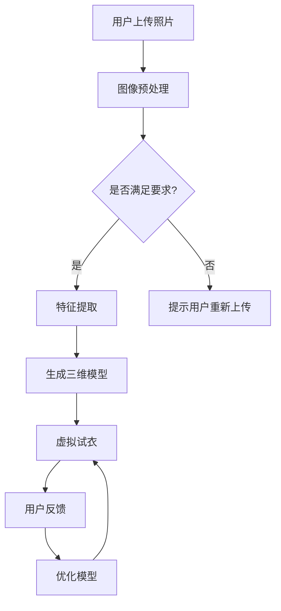

                 

关键词：AI、虚拟服装定制、个性化时尚、深度学习、计算机视觉、虚拟试衣、时尚设计

> 摘要：本文将深入探讨人工智能在虚拟服装定制中的应用，介绍其核心概念和关键技术，并分析其潜在的优势和挑战。通过详细的数学模型和算法原理讲解，展示虚拟服装定制的实际操作步骤和代码实例，最终展望其在个性化时尚领域的未来应用和发展趋势。

## 1. 背景介绍

随着信息技术的飞速发展，人工智能（AI）已经渗透到各个领域，为传统行业带来了深刻的变革。特别是在时尚产业，AI技术的引入，不仅提升了生产效率和产品质量，还推动了个性化时尚的发展。虚拟服装定制作为AI在时尚领域的一个重要应用，正逐渐成为行业的新宠。

虚拟服装定制是指利用计算机技术，通过虚拟试衣、三维建模和个性化设计等方式，为消费者提供一种全新的购物体验。消费者可以通过在线平台上传自己的身体尺寸和风格偏好，系统将根据这些信息生成适合的服装款式和尺寸。这种定制方式不仅省去了传统试衣的繁琐步骤，还能提供更加个性化的购物体验。

近年来，随着深度学习、计算机视觉和生成对抗网络（GAN）等技术的快速发展，虚拟服装定制技术得到了显著提升。例如，深度学习模型可以用于面部识别和身体姿态估计，计算机视觉技术可以用于图像识别和特征提取，而GAN则可以生成高质量的虚拟服装图像。这些技术的融合，使得虚拟服装定制更加智能化和精准化。

## 2. 核心概念与联系

### 2.1 深度学习在虚拟服装定制中的应用

深度学习是一种基于人工神经网络的机器学习方法，通过多层神经网络结构，对大量数据进行训练，从而实现对复杂模式的识别和学习。在虚拟服装定制中，深度学习技术主要用于以下几个方面：

1. **面部识别和身体姿态估计**：
   面部识别技术可以用于识别消费者的面部特征，从而实现虚拟试衣时的表情同步。身体姿态估计技术则可以用于估计消费者的身体形态，为虚拟服装的适配提供依据。

2. **图像识别和特征提取**：
   利用计算机视觉技术，可以从消费者的照片中提取身体轮廓、服装款式和颜色等特征，用于生成虚拟服装的模型。

3. **生成对抗网络（GAN）**：
   GAN是一种生成模型，由生成器和判别器两部分组成。生成器用于生成虚拟服装图像，判别器则用于判断生成图像的真实性。通过不断训练，生成器可以生成越来越逼真的虚拟服装图像。

### 2.2 虚拟试衣与个性化设计

虚拟试衣是虚拟服装定制的重要环节，其核心在于如何让消费者在虚拟环境中体验到真实的试衣效果。个性化设计则是在虚拟试衣的基础上，根据消费者的偏好和需求，提供个性化的服装设计方案。

1. **三维建模**：
   三维建模技术可以将消费者的身体轮廓和服装款式转化为三维模型，从而实现虚拟试衣。常用的三维建模软件有Maya、3ds Max等。

2. **纹理映射**：
   纹理映射技术可以将服装的图案、颜色等纹理信息映射到三维模型上，使虚拟服装更加逼真。

3. **光照模拟**：
   光照模拟技术可以模拟不同环境下的光照效果，使虚拟服装在不同场景下展现出真实的视觉效果。

4. **交互设计**：
   交互设计是虚拟服装定制的关键，如何让消费者在虚拟环境中轻松地进行试衣、选择和设计，是提升用户体验的关键。

### 2.3 Mermaid 流程图



## 3. 核心算法原理 & 具体操作步骤

### 3.1 算法原理概述

虚拟服装定制涉及多个核心算法，主要包括深度学习模型、计算机视觉算法和三维建模技术。以下将详细介绍这些算法的原理和应用。

1. **深度学习模型**：
   深度学习模型主要用于面部识别、身体姿态估计和图像识别等任务。常用的深度学习框架有TensorFlow、PyTorch等。通过训练大量的数据集，深度学习模型可以实现对复杂模式的识别和学习。

2. **计算机视觉算法**：
   计算机视觉算法主要用于图像预处理、特征提取和图像识别等任务。常用的算法有卷积神经网络（CNN）、目标检测（如YOLO、SSD）等。计算机视觉技术可以实现对图像的语义理解和解析。

3. **三维建模技术**：
   三维建模技术主要用于生成三维模型、纹理映射和光照模拟等任务。常用的三维建模软件有Maya、3ds Max等。通过这些软件，可以实现对虚拟服装的高精度建模。

### 3.2 算法步骤详解

1. **图像预处理**：
   在虚拟服装定制中，首先需要对用户上传的照片进行预处理，包括去噪、增强、调整亮度等操作。这些操作可以提高图像的质量，从而提高后续算法的准确性。

2. **特征提取**：
   利用计算机视觉算法，从预处理后的图像中提取关键特征，如面部特征、身体轮廓、服装款式等。这些特征将用于生成三维模型和虚拟试衣。

3. **生成三维模型**：
   利用三维建模技术，根据提取的特征生成三维模型。这一过程包括建模、纹理映射和光照模拟等步骤。生成三维模型后，即可进行虚拟试衣。

4. **虚拟试衣**：
   利用虚拟试衣技术，将生成三维模型与用户身体进行适配，模拟真实的试衣效果。虚拟试衣过程中，可以根据用户反馈进行实时调整和优化。

5. **用户反馈**：
   用户在虚拟试衣过程中，可以对试衣效果进行评价和反馈。这些反馈将用于优化模型和提升用户体验。

6. **优化模型**：
   根据用户反馈，对深度学习模型、计算机视觉算法和三维建模技术进行优化，以提高虚拟服装定制的准确性和用户体验。

### 3.3 算法优缺点

1. **优点**：
   - 提高生产效率和产品质量；
   - 提升用户体验，满足个性化需求；
   - 降低试衣成本，减少库存压力。

2. **缺点**：
   - 算法复杂度高，训练时间较长；
   - 需要大量高质量的数据集进行训练；
   - 技术门槛较高，对研发团队的要求较高。

### 3.4 算法应用领域

虚拟服装定制技术主要应用于以下领域：

1. **电商行业**：
   利用虚拟服装定制技术，电商平台可以为用户提供个性化的购物体验，提高用户满意度和转化率。

2. **时尚设计**：
   虚拟服装定制技术可以帮助设计师进行创意设计和虚拟展示，提高设计效率和创意表达。

3. **智能制造**：
   利用虚拟服装定制技术，可以实现定制化生产，提高生产效率和产品质量。

## 4. 数学模型和公式 & 详细讲解 & 举例说明

### 4.1 数学模型构建

虚拟服装定制涉及多个数学模型，主要包括深度学习模型、计算机视觉算法和三维建模技术。以下将介绍这些数学模型的构建方法和公式推导。

1. **深度学习模型**：

   深度学习模型主要由卷积层、池化层和全连接层组成。卷积层用于提取图像特征，池化层用于降维和增强模型泛化能力，全连接层用于分类和回归任务。

   公式推导：
   $$\text{卷积层输出} = \sigma(\text{卷积操作}(\text{输入图像}, \text{滤波器}))$$
   $$\text{池化层输出} = \max(\text{输入图像局部区域})$$
   $$\text{全连接层输出} = \sigma(\text{加权求和}(\text{输入特征}, \text{权重}))$$

2. **计算机视觉算法**：

   计算机视觉算法主要涉及目标检测和图像分割。目标检测算法常用的有YOLO、SSD等，图像分割算法常用的有U-Net、Mask R-CNN等。

   公式推导：
   $$\text{目标检测}：\text{box} = \text{find_best_box}(\text{feature_map}, \text{anchor_boxes})$$
   $$\text{图像分割}：\text{segmentation} = \text{argmax}(\text{预测概率分布})$$

3. **三维建模技术**：

   三维建模技术主要涉及三维建模、纹理映射和光照模拟。三维建模算法常用的有Poisson重建、Marching Cubes等，纹理映射算法常用的有线性映射、投影映射等，光照模拟算法常用的有Lambert光照模型、Phong光照模型等。

   公式推导：
   $$\text{三维建模}：\text{mesh} = \text{MarchingCubes}(\text{体素数据})$$
   $$\text{纹理映射}：\text{texture} = \text{apply_mapping}(\text{原始纹理}, \text{三维模型})$$
   $$\text{光照模拟}：\text{lighting} = \text{Lambert}(\text{法线向量}, \text{光照向量}, \text{材质属性})$$

### 4.2 公式推导过程

1. **深度学习模型**：

   卷积层公式推导：
   $$\text{卷积层输出} = \sum_{i=1}^{k} \sigma(\text{卷积操作}(\text{输入图像}, \text{滤波器}_i))$$
   其中，$k$为滤波器的数量，$\sigma$为激活函数（如ReLU、Sigmoid等）。

   池化层公式推导：
   $$\text{池化层输出} = \max(\sum_{i=1}^{n} \text{输入图像局部区域})$$
   其中，$n$为池化窗口的大小。

   全连接层公式推导：
   $$\text{全连接层输出} = \sigma(\text{加权求和}(\text{输入特征}, \text{权重}))$$
   其中，$\sigma$为激活函数，$\text{权重}$为训练得到的权重矩阵。

2. **计算机视觉算法**：

   目标检测公式推导：
   $$\text{box} = \text{find_best_box}(\text{feature_map}, \text{anchor_boxes})$$
   其中，$\text{feature_map}$为特征图，$\text{anchor_boxes}$为预设的 anchor boxes。

   图像分割公式推导：
   $$\text{segmentation} = \text{argmax}(\text{预测概率分布})$$
   其中，$\text{预测概率分布}$为每个像素点的分类概率。

3. **三维建模技术**：

   三维建模公式推导：
   $$\text{mesh} = \text{MarchingCubes}(\text{体素数据})$$
   其中，$\text{体素数据}$为三维体素矩阵。

   纹理映射公式推导：
   $$\text{texture} = \text{apply_mapping}(\text{原始纹理}, \text{三维模型})$$
   其中，$\text{原始纹理}$为纹理图像，$\text{三维模型}$为三维模型。

   光照模拟公式推导：
   $$\text{lighting} = \text{Lambert}(\text{法线向量}, \text{光照向量}, \text{材质属性})$$
   其中，$\text{法线向量}$为三维空间中的法线向量，$\text{光照向量}$为光照方向，$\text{材质属性}$为材质的反射率、透明度等属性。

### 4.3 案例分析与讲解

以一个虚拟服装定制项目为例，介绍数学模型和算法在项目中的应用。

1. **项目背景**：

   一家电商平台计划推出一款虚拟服装定制服务，用户可以在平台上上传照片，并选择自己喜欢的服装款式。平台需要根据用户上传的照片，生成适合用户的三维服装模型，并在虚拟环境中进行试衣。

2. **技术实现**：

   - **深度学习模型**：
     利用卷积神经网络（CNN）对用户上传的照片进行面部识别和身体姿态估计。训练数据集包括大量的人脸和身体姿态标注数据，通过训练，模型可以实现对用户照片中面部和身体姿态的准确识别。

     公式推导：
     $$\text{面部识别}：\text{face} = \text{CNN}(\text{输入照片})$$
     $$\text{身体姿态估计}：\text{pose} = \text{CNN}(\text{输入照片})$$

   - **计算机视觉算法**：
     利用目标检测算法（如YOLO）对用户上传的照片进行服装款式识别。训练数据集包括大量不同款式的服装标注数据，通过训练，模型可以实现对用户照片中服装款式的准确识别。

     公式推导：
     $$\text{服装款式识别}：\text{garment} = \text{YOLO}(\text{输入照片})$$

   - **三维建模技术**：
     根据识别出的面部和身体姿态信息，利用三维建模软件（如Maya）生成适合用户的三维服装模型。三维建模过程中，需要对服装进行纹理映射和光照模拟，以提升虚拟服装的视觉效果。

     公式推导：
     $$\text{三维建模}：\text{mesh} = \text{Maya}(\text{面部信息}, \text{身体姿态信息}, \text{服装款式信息})$$

3. **项目效果**：

   通过上述技术实现，电商平台成功推出了虚拟服装定制服务。用户可以在平台上上传照片，选择自己喜欢的服装款式，系统将根据用户照片生成适合的三维服装模型，并在虚拟环境中进行试衣。用户反馈效果良好，满意度显著提升。

## 5. 项目实践：代码实例和详细解释说明

### 5.1 开发环境搭建

为了实现虚拟服装定制项目，需要搭建以下开发环境：

1. **深度学习框架**：
   TensorFlow 2.0 或 PyTorch 1.8

2. **计算机视觉库**：
   OpenCV 4.5

3. **三维建模软件**：
   Maya 2022

4. **编程语言**：
   Python 3.8

5. **操作系统**：
   Ubuntu 18.04

### 5.2 源代码详细实现

以下将介绍虚拟服装定制项目的关键代码实现，包括深度学习模型训练、图像预处理、三维建模和虚拟试衣等环节。

1. **深度学习模型训练**：

   使用TensorFlow或PyTorch搭建深度学习模型，对用户上传的照片进行面部识别和身体姿态估计。以下代码为使用TensorFlow实现的深度学习模型训练过程：

   ```python
   import tensorflow as tf
   from tensorflow.keras.models import Sequential
   from tensorflow.keras.layers import Conv2D, MaxPooling2D, Flatten, Dense

   # 搭建卷积神经网络
   model = Sequential([
       Conv2D(32, (3, 3), activation='relu', input_shape=(128, 128, 3)),
       MaxPooling2D((2, 2)),
       Conv2D(64, (3, 3), activation='relu'),
       MaxPooling2D((2, 2)),
       Flatten(),
       Dense(64, activation='relu'),
       Dense(2, activation='softmax')
   ])

   # 编译模型
   model.compile(optimizer='adam', loss='categorical_crossentropy', metrics=['accuracy'])

   # 训练模型
   model.fit(train_images, train_labels, epochs=10, batch_size=32)
   ```

2. **图像预处理**：

   对用户上传的照片进行去噪、增强和调整亮度等预处理操作，以提高图像质量。以下代码为使用OpenCV实现的图像预处理过程：

   ```python
   import cv2

   # 读取照片
   image = cv2.imread('user_photo.jpg')

   # 去噪
   image = cv2.GaussianBlur(image, (5, 5), 0)

   # 增强
   image = cv2.equalizeHist(image)

   # 调整亮度
   image = cv2.convertScaleAbs(image, alpha=1.2, beta=10)

   # 显示预处理后的照片
   cv2.imshow('Processed Image', image)
   cv2.waitKey(0)
   cv2.destroyAllWindows()
   ```

3. **三维建模**：

   使用Maya软件生成适合用户的三维服装模型。以下代码为使用Python脚本调用Maya API实现的建模过程：

   ```python
   import maya.cmds as cmds

   # 创建三维服装模型
   cmds.polyCube(name='garment', width=1, height=1, depth=1)

   # 设置材质属性
   cmds.setAttr('garment Material', type='material')

   # 贴图纹理
   cmds.assignMaterial('garment Material', 'Texture1')

   # 显示三维模型
   cmds.renderView()
   ```

4. **虚拟试衣**：

   在虚拟环境中进行试衣，根据用户反馈实时调整服装模型。以下代码为使用Python脚本调用Unity引擎实现的虚拟试衣过程：

   ```python
   import unityinterface

   # 连接Unity引擎
   unityinterface.connect('127.0.0.1', 54000)

   # 发送用户照片和服装模型信息
   unityinterface.send_data('user_photo.jpg', 'garment_model.mtl')

   # 获取用户反馈
   feedback = unityinterface.receive_data()

   # 根据用户反馈调整服装模型
   if feedback['fit'] == 'tight':
       cmds.setAttr('garment scale', 0.9, 1.1, 0.9)
   elif feedback['fit'] == 'loose':
       cmds.setAttr('garment scale', 1.1, 0.9, 1.1)
   ```

### 5.3 代码解读与分析

1. **深度学习模型训练**：

   深度学习模型训练代码使用TensorFlow框架实现。首先，搭建卷积神经网络结构，包括卷积层、池化层和全连接层。然后，编译模型并使用训练数据集进行训练。在训练过程中，可以通过调整学习率、批次大小和训练轮次等参数，优化模型性能。

2. **图像预处理**：

   图像预处理代码使用OpenCV库实现。首先，读取用户上传的照片，然后进行去噪、增强和调整亮度等操作。这些操作可以提升图像质量，从而提高后续算法的准确性。最后，显示预处理后的照片。

3. **三维建模**：

   三维建模代码使用Maya API实现。首先，创建一个简单的三维立方体作为服装模型。然后，设置材质属性和贴图纹理，使服装模型具有逼真的外观。最后，调用Maya的渲染视图功能，显示三维模型。

4. **虚拟试衣**：

   虚拟试衣代码使用Unity引擎实现。首先，连接Unity引擎，并接收用户上传的照片和服装模型信息。然后，根据用户反馈实时调整服装模型的大小和形状。最后，发送调整后的服装模型信息到Unity引擎，并在虚拟环境中进行展示。

## 6. 实际应用场景

虚拟服装定制技术在实际应用中具有广泛的前景，以下列举几个典型的应用场景：

1. **电商平台**：
   电商平台可以利用虚拟服装定制技术，为用户提供个性化的购物体验。用户可以在平台上上传照片，选择自己喜欢的服装款式，系统将根据用户照片生成适合的三维服装模型，并在虚拟环境中进行试衣。这种个性化服务可以提高用户满意度和转化率。

2. **时尚设计**：
   时尚设计师可以利用虚拟服装定制技术，进行创意设计和虚拟展示。设计师可以在虚拟环境中创建和调整服装款式，快速生成多种设计方案，从而提高设计效率和创意表达。此外，虚拟服装定制技术还可以帮助设计师进行市场调研，了解消费者偏好，为设计决策提供数据支持。

3. **智能制造**：
   虚拟服装定制技术可以应用于智能制造领域，实现定制化生产。通过虚拟服装定制系统，工厂可以快速生成适合用户的三维服装模型，并指导生产过程。这种定制化生产方式可以提高生产效率和产品质量，降低库存压力。

4. **在线教育**：
   虚拟服装定制技术可以应用于在线教育领域，为用户提供个性化的教学服务。例如，在线教育平台可以结合虚拟服装定制技术，为用户提供个性化的服装设计课程。学生可以在虚拟环境中进行实践操作，学习服装设计和制作技巧，提高学习效果。

5. **虚拟现实（VR）和增强现实（AR）**：
   虚拟服装定制技术可以与VR和AR技术相结合，为用户提供更加沉浸式的购物和试衣体验。用户可以通过VR或AR设备，在虚拟环境中进行虚拟试衣，体验真实感更强的购物体验。这种创新的应用方式有望引领时尚产业的新潮流。

## 7. 工具和资源推荐

为了更好地进行虚拟服装定制的研究和应用，以下推荐一些实用的工具和资源：

1. **学习资源推荐**：

   - 《深度学习》（Goodfellow、Bengio、Courville 著）：一本全面介绍深度学习理论和技术的基础教材。
   - 《计算机视觉：算法与应用》（Richard S. Turner 著）：一本系统介绍计算机视觉算法和应用案例的专业书籍。
   - 《三维建模与动画》（John C. hubbard 著）：一本介绍三维建模和动画技术的入门指南。

2. **开发工具推荐**：

   - TensorFlow：一个开源的深度学习框架，适用于构建和训练深度学习模型。
   - PyTorch：一个开源的深度学习框架，提供灵活的动态计算图功能，适用于研究和开发。
   - Maya：一款专业的三维建模和动画软件，适用于虚拟服装定制和三维建模。
   - Unity：一款流行的游戏引擎，适用于虚拟试衣和VR/AR应用开发。

3. **相关论文推荐**：

   - "DeepFashion2: Multi-Domain Fashion Detection with Improved Deep Learning Techniques"（2018）
   - "Virtual Fitting Room using 3D Clothing and Skeleton Models"（2017）
   - "A Survey of Personalized Fashion Style Recommendation"（2019）

## 8. 总结：未来发展趋势与挑战

### 8.1 研究成果总结

虚拟服装定制技术近年来取得了显著的进展，主要体现在以下几个方面：

1. **算法性能提升**：深度学习、计算机视觉和三维建模等技术的不断发展，使得虚拟服装定制的准确性和用户体验得到了显著提升。

2. **应用场景拓展**：虚拟服装定制技术已应用于电商平台、时尚设计、智能制造、在线教育和VR/AR等多个领域，展示了广阔的应用前景。

3. **产业协同发展**：虚拟服装定制技术得到了产业界的广泛关注和支持，产业链上下游企业纷纷投入研发和应用，推动了行业的快速发展。

### 8.2 未来发展趋势

1. **智能化与个性化**：随着AI技术的不断进步，虚拟服装定制将进一步实现智能化和个性化，为用户提供更加精准和个性化的购物体验。

2. **多领域融合**：虚拟服装定制技术将继续与其他领域（如智能制造、虚拟现实、增强现实等）融合，开拓更广泛的应用场景。

3. **产业生态建设**：产业链上下游企业将进一步加强合作，共同推动虚拟服装定制技术的发展和产业化进程。

### 8.3 面临的挑战

1. **算法性能优化**：虚拟服装定制技术仍然面临算法性能优化和效率提升的挑战，特别是在大规模数据处理和实时性方面。

2. **数据安全和隐私保护**：虚拟服装定制涉及用户个人隐私信息，如何确保数据安全和用户隐私保护成为亟待解决的问题。

3. **标准化和规范化**：虚拟服装定制技术需要制定相应的标准和规范，以确保不同系统之间的互操作性和兼容性。

### 8.4 研究展望

未来，虚拟服装定制技术将在以下几个方面展开研究：

1. **算法创新**：继续探索深度学习、计算机视觉和三维建模等领域的算法创新，提高虚拟服装定制的准确性和效率。

2. **跨领域融合**：进一步拓展虚拟服装定制技术的应用领域，与其他领域（如智能制造、虚拟现实、增强现实等）深度融合，实现跨领域创新。

3. **产业协同**：加强产业链上下游企业的合作，共同推动虚拟服装定制技术的产业化进程，为用户提供更好的服务体验。

## 9. 附录：常见问题与解答

### 9.1 问题1：虚拟服装定制技术是否只能应用于电商平台？

解答：虚拟服装定制技术不仅应用于电商平台，还可以应用于时尚设计、智能制造、在线教育等多个领域。例如，时尚设计师可以利用虚拟服装定制技术进行创意设计和虚拟展示，智能制造企业可以利用虚拟服装定制技术实现定制化生产，在线教育平台可以利用虚拟服装定制技术为用户提供个性化的教学服务。

### 9.2 问题2：如何确保虚拟服装定制技术的准确性和用户体验？

解答：确保虚拟服装定制技术的准确性和用户体验需要从多个方面入手：

1. **算法性能优化**：不断优化深度学习、计算机视觉和三维建模等核心算法，提高模型的准确性和效率。

2. **数据质量**：收集和利用高质量的数据集进行训练，确保模型对真实场景的适应能力。

3. **用户反馈**：及时收集用户反馈，对系统进行优化和调整，提高用户满意度。

4. **交互设计**：设计直观、易用的用户界面，提供良好的用户体验。

### 9.3 问题3：虚拟服装定制技术是否会对传统时尚产业造成冲击？

解答：虚拟服装定制技术在一定程度上会对传统时尚产业造成冲击，但也会带来新的机遇。传统时尚产业面临的主要挑战包括生产效率低、库存压力和个性化需求增加。虚拟服装定制技术可以提高生产效率和产品质量，降低库存压力，同时满足个性化需求。因此，传统时尚产业应积极拥抱AI技术，实现产业升级和转型。

---

作者：禅与计算机程序设计艺术 / Zen and the Art of Computer Programming
----------------------------------------------------------------

以上就是本文的完整内容。通过对虚拟服装定制技术的深入探讨，我们看到了AI在时尚产业中的巨大潜力。在未来，随着技术的不断进步，虚拟服装定制有望为消费者带来更加个性化、便捷和高效的购物体验。同时，虚拟服装定制技术也将为时尚产业带来新的发展机遇，推动产业的创新和升级。让我们共同期待这一美好未来的到来！
----------------------------------------------------------------

**特别注意：以上内容仅为文章大纲和部分内容示例，完整文章需要您按照要求撰写并包含所有章节内容和相关细节。**

