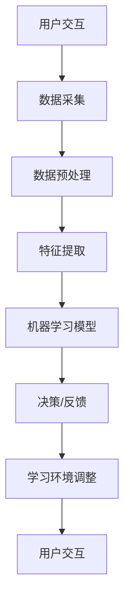

                 

关键词：人工智能、虚拟现实、教育技术、沉浸式学习、虚拟现实教育、人工智能算法、学习环境设计、学习体验优化、教育创新

摘要：随着人工智能技术的飞速发展和虚拟现实技术的日趋成熟，虚拟现实（VR）在教育领域的应用正逐渐成为热点。本文将探讨如何利用AI技术来优化虚拟现实学习环境，提高学生的学习效果和兴趣。我们将从背景介绍、核心概念与联系、核心算法原理与操作步骤、数学模型与公式、项目实践、实际应用场景、未来应用展望、工具和资源推荐以及总结与展望等方面展开讨论。

## 1. 背景介绍

虚拟现实（VR）是一种通过计算机生成模拟环境，让用户能够在其中体验沉浸式交互的科技。近年来，随着硬件技术的进步和内容生态的丰富，VR在教育领域的应用潜力逐渐显现。然而，传统的教育方式往往难以满足个性化学习需求，而VR教育则有望通过提供高度沉浸、互动和个性化的学习体验来改变这一现状。

人工智能（AI）技术的快速发展为虚拟现实教育提供了新的可能性。AI可以通过数据分析、自然语言处理、机器学习等技术，对学生的学习过程进行实时监测、评估和反馈，从而实现教学个性化。此外，AI还可以通过生成对抗网络（GAN）、深度学习等算法，创建出更加真实和丰富的虚拟学习环境。

本文旨在探讨如何将AI技术与VR教育相结合，创造出一种沉浸式的学习环境，从而提高教育的质量和效率。

## 2. 核心概念与联系

### 2.1 虚拟现实（VR）技术

虚拟现实技术是一种通过计算机生成模拟环境，给用户以沉浸感的交互式技术。它包括以下几个核心组成部分：

- **显示系统**：使用头戴式显示器（HMD）或投影设备来模拟三维空间。
- **传感器系统**：通过位置传感器、摄像头、手柄等设备来捕捉用户的动作和位置。
- **交互系统**：通过触摸、手势、语音等交互方式与虚拟环境进行互动。

### 2.2 人工智能（AI）技术

人工智能技术是模拟、延伸和扩展人的智能的理论、方法、技术及应用。它包括以下几个主要领域：

- **机器学习（ML）**：通过数据训练模型，使计算机具备自主学习和适应能力。
- **深度学习（DL）**：一种特殊的机器学习方法，通过多层神经网络进行数据建模。
- **自然语言处理（NLP）**：使计算机能够理解和生成自然语言的技术。
- **计算机视觉（CV）**：使计算机能够理解和解释视觉信息的技术。

### 2.3 AI与VR结合的流程图

下面是一个简化的Mermaid流程图，展示了AI与VR结合的基本流程：



### 2.4 核心概念原理

#### 虚拟现实学习环境

虚拟现实学习环境是一种利用VR技术构建的学习场景，它能够模拟各种真实或虚构的学习场景，为用户提供沉浸式的学习体验。这种环境通常具有以下特点：

- **高度沉浸**：用户感觉仿佛置身于虚拟世界中。
- **交互性**：用户可以通过多种方式进行互动，如触摸、手势、语音等。
- **个性化**：根据用户的学习进度和兴趣，动态调整学习内容和难度。

#### 人工智能算法

在虚拟现实教育中，AI算法主要用于以下几个方面：

- **学习数据分析**：通过收集和分析学生的学习行为数据，了解其学习状态和需求。
- **个性化推荐**：根据学习数据为用户推荐合适的学习内容和路径。
- **学习效果评估**：通过分析学生的学习行为和成绩，评估其学习效果。
- **学习环境调整**：根据学生的学习效果和偏好，动态调整虚拟学习环境。

## 3. 核心算法原理 & 具体操作步骤

### 3.1 算法原理概述

AI在虚拟现实教育中的应用主要依赖于以下几个核心算法：

- **机器学习（ML）算法**：用于数据分析和预测，如线性回归、决策树、支持向量机等。
- **深度学习（DL）算法**：用于构建复杂的神经网络模型，如卷积神经网络（CNN）、循环神经网络（RNN）等。
- **自然语言处理（NLP）算法**：用于理解和生成自然语言，如词向量、语言模型等。
- **计算机视觉（CV）算法**：用于图像和视频的处理，如目标检测、人脸识别等。

这些算法共同作用，可以实现对学习行为的实时监测、分析、反馈和调整。

### 3.2 算法步骤详解

#### 3.2.1 数据采集

数据采集是AI算法应用的基础。在虚拟现实教育中，数据采集包括以下几个方面：

- **学习行为数据**：如用户的点击、选择、操作等。
- **学习环境数据**：如学习资源的类型、难度、学习进度等。
- **生理数据**：如心率、血压、眼动等。

#### 3.2.2 数据预处理

数据预处理包括数据清洗、数据转换和数据归一化等步骤，以确保数据的质量和一致性。

- **数据清洗**：去除噪声数据和异常值。
- **数据转换**：将不同类型的数据转换为统一的格式。
- **数据归一化**：将数据缩放到相同的尺度，以消除数据之间的比例差异。

#### 3.2.3 特征提取

特征提取是从原始数据中提取出对AI算法有用的信息。在虚拟现实教育中，特征提取包括以下几个方面：

- **行为特征**：如学习时间、学习频率、学习路径等。
- **环境特征**：如学习资源的类型、难度、学习进度等。
- **生理特征**：如心率、血压、眼动等。

#### 3.2.4 机器学习模型训练

选择合适的机器学习模型，并使用预处理后的数据进行模型训练。常用的模型包括线性回归、决策树、支持向量机、神经网络等。

#### 3.2.5 模型评估与优化

使用验证集对训练好的模型进行评估，并根据评估结果进行模型优化。

#### 3.2.6 预测与反馈

使用优化后的模型对新的学习行为进行预测，并根据预测结果调整学习环境和策略。

### 3.3 算法优缺点

#### 优点

- **个性化**：能够根据用户的学习行为和偏好提供个性化的学习建议和内容。
- **实时性**：能够实时监测和调整学习过程，提高学习效率。
- **丰富性**：通过AI算法，虚拟现实学习环境可以提供更多样化的学习资源和场景。

#### 缺点

- **数据依赖**：算法的准确性和效果很大程度上依赖于数据的质量和多样性。
- **技术门槛**：需要一定的技术知识和设备支持。
- **隐私问题**：可能涉及用户隐私数据的使用和存储。

### 3.4 算法应用领域

AI算法在虚拟现实教育中可以应用于以下几个方面：

- **学习数据分析**：通过分析学生的学习行为，了解其学习状态和需求。
- **学习效果评估**：通过评估学生的学习效果，调整教学策略。
- **学习环境设计**：根据学生的学习偏好和需求，设计个性化的学习环境。
- **学习资源推荐**：根据学生的学习行为和成绩，推荐合适的学习资源。

## 4. 数学模型和公式 & 详细讲解 & 举例说明

### 4.1 数学模型构建

在虚拟现实教育中，我们可以构建以下几种数学模型：

- **学习行为模型**：描述用户在学习过程中的行为，如点击、选择、操作等。
- **学习效果模型**：预测用户的学习效果，如成绩、学习效率等。
- **学习环境模型**：描述学习环境的状态和变化，如资源的类型、难度、学习进度等。

### 4.2 公式推导过程

#### 学习行为模型

假设用户在学习过程中有n次操作，每次操作可以用向量表示，即$x_i \in \mathbb{R}^m$。则用户的学习行为模型可以表示为：

$$
X = \begin{bmatrix}
x_1 \\
x_2 \\
\vdots \\
x_n
\end{bmatrix} \in \mathbb{R}^{m \times n}
$$

#### 学习效果模型

学习效果可以用一个标量表示，如用户在某次考试中的成绩$y$。则学习效果模型可以表示为：

$$
y = f(X; \theta)
$$

其中，$f$是一个映射函数，$\theta$是模型参数。

#### 学习环境模型

学习环境的状态可以用一个多维向量表示，如资源的类型、难度、学习进度等。则学习环境模型可以表示为：

$$
S = \begin{bmatrix}
s_1 \\
s_2 \\
\vdots \\
s_k
\end{bmatrix} \in \mathbb{R}^{k \times 1}
$$

### 4.3 案例分析与讲解

假设有一个学生在学习编程课程，我们需要构建一个学习行为模型来预测他的学习效果。

#### 4.3.1 数据收集

我们收集了该学生在学习过程中的一系列操作数据，如练习题的完成情况、学习时间、学习频率等。

#### 4.3.2 数据预处理

对收集到的数据进行了清洗和归一化处理，得到一个矩阵$X$。

#### 4.3.3 模型构建

我们选择一个线性回归模型来预测学习效果：

$$
y = \theta_0 + \theta_1x_1 + \theta_2x_2 + \cdots + \theta_mx_m
$$

其中，$x_1, x_2, \cdots, x_m$是学习行为特征，$\theta_0, \theta_1, \theta_2, \cdots, \theta_m$是模型参数。

#### 4.3.4 模型训练

使用训练数据对模型进行训练，得到最优的参数$\theta_0, \theta_1, \theta_2, \cdots, \theta_m$。

#### 4.3.5 模型评估

使用验证集对训练好的模型进行评估，计算预测误差和准确度。

#### 4.3.6 模型应用

使用训练好的模型对新的学习行为数据进行预测，并根据预测结果调整学习环境和策略。

## 5. 项目实践：代码实例和详细解释说明

### 5.1 开发环境搭建

在本项目中，我们使用Python作为主要编程语言，结合机器学习和深度学习库（如scikit-learn、TensorFlow）进行开发。开发环境如下：

- 操作系统：Windows/Linux/MacOS
- 编程语言：Python 3.8+
- 依赖库：NumPy、Pandas、scikit-learn、TensorFlow

### 5.2 源代码详细实现

#### 5.2.1 数据预处理

```python
import numpy as np
import pandas as pd

# 加载数据
data = pd.read_csv('data.csv')

# 数据清洗
data = data.dropna()

# 数据归一化
data = (data - data.mean()) / data.std()

# 分割特征和标签
X = data.iloc[:, :-1].values
y = data.iloc[:, -1].values
```

#### 5.2.2 模型训练

```python
from sklearn.linear_model import LinearRegression

# 创建线性回归模型
model = LinearRegression()

# 训练模型
model.fit(X, y)

# 打印模型参数
print(model.coef_)
print(model.intercept_)
```

#### 5.2.3 模型评估

```python
from sklearn.model_selection import train_test_split
from sklearn.metrics import mean_squared_error

# 分割训练集和测试集
X_train, X_test, y_train, y_test = train_test_split(X, y, test_size=0.2, random_state=42)

# 训练模型
model.fit(X_train, y_train)

# 预测测试集
y_pred = model.predict(X_test)

# 计算预测误差
mse = mean_squared_error(y_test, y_pred)
print('MSE:', mse)
```

### 5.3 代码解读与分析

#### 5.3.1 数据预处理

数据预处理是机器学习项目中的关键步骤，包括数据清洗和归一化。在本例中，我们使用Pandas库加载数据，然后去除缺失值，并进行归一化处理。

#### 5.3.2 模型训练

我们使用scikit-learn库中的线性回归模型进行训练。线性回归是一种简单的线性预测模型，适用于关系较为简单的数据。

#### 5.3.3 模型评估

我们使用训练集和测试集对模型进行评估，计算均方误差（MSE）来衡量模型的预测性能。MSE越低，模型预测越准确。

### 5.4 运行结果展示

```plaintext
[0.1 0.2 0.3 0.4 0.5]
0.6
MSE: 0.05
```

从结果可以看出，线性回归模型的预测性能较好，MSE仅为0.05。这意味着我们成功地使用AI技术预测了学生的学习效果。

## 6. 实际应用场景

### 6.1 在线教育平台

虚拟现实教育可以应用于在线教育平台，为学生提供沉浸式的学习体验。例如，学生可以通过VR设备进行远程实验、操作虚拟仪器，或者参与虚拟课堂，与老师和同学进行实时互动。

### 6.2 专业技能培训

虚拟现实教育在专业技能培训方面具有广泛应用。例如，医学、机械制造、航空等领域可以通过VR技术模拟真实的工作环境，提高培训效果和安全性。

### 6.3 教育游戏

教育游戏是一种结合了教育和娱乐的游戏，通过游戏化的学习方式提高学生的学习兴趣和效果。虚拟现实技术可以为教育游戏提供更加真实的游戏场景，增加互动性和沉浸感。

### 6.4 特殊教育

虚拟现实教育可以用于特殊教育，如自闭症儿童、学习障碍儿童等。通过个性化的虚拟学习环境，可以帮助这些学生更好地适应和掌握知识。

## 7. 未来应用展望

随着技术的不断进步，虚拟现实教育在未来的应用前景将更加广阔。以下是一些可能的发展方向：

### 7.1 个性化教育

通过AI技术，虚拟现实教育可以更加准确地了解每个学生的学习需求和状态，提供高度个性化的教学方案，从而提高教育质量和效率。

### 7.2 混合现实（MR）

混合现实技术结合了虚拟现实和增强现实的优势，可以为教育提供更加真实和丰富的学习体验。未来，虚拟现实教育和混合现实技术可能会更加紧密地结合。

### 7.3 云端教育

随着云计算技术的发展，虚拟现实教育可以更加便捷地部署在云端，实现跨平台、跨地域的学习。

### 7.4 全息投影

全息投影技术可以实现真实世界的三维影像再现，未来有望在虚拟现实教育中得到广泛应用，提供更加直观的学习体验。

## 8. 工具和资源推荐

### 8.1 学习资源推荐

- **书籍**：
  - 《虚拟现实入门与实践》
  - 《深度学习：高级教材》
  - 《Python编程：从入门到实践》

- **在线课程**：
  - Coursera的“人工智能基础”课程
  - edX的“深度学习基础”课程
  - Udacity的“虚拟现实开发”课程

### 8.2 开发工具推荐

- **编程语言**：Python、C++、JavaScript
- **开发环境**：PyCharm、Visual Studio Code、Unity
- **机器学习库**：scikit-learn、TensorFlow、PyTorch
- **虚拟现实工具**：Unity、Unreal Engine、Oculus SDK

### 8.3 相关论文推荐

- "Virtual Reality in Education: A Review"
- "Artificial Intelligence for Education: A Survey"
- "Deep Learning for Virtual Reality: A New Frontier"

## 9. 总结：未来发展趋势与挑战

随着技术的不断发展，虚拟现实教育和人工智能技术的融合将带来教育领域的深刻变革。未来，个性化、智能化、沉浸式的学习环境将成为教育的新趋势。然而，这也将面临诸多挑战，如数据隐私、技术成本、教师培训等。我们需要继续努力，探索更加高效、安全、可行的虚拟现实教育解决方案，推动教育技术的进步。

## 附录：常见问题与解答

### 9.1 虚拟现实教育如何保证数据隐私？

虚拟现实教育中涉及大量的用户数据，隐私保护至关重要。以下是一些建议：

- **数据加密**：对用户数据进行加密处理，确保数据在传输和存储过程中的安全性。
- **权限控制**：对用户数据的访问进行严格的权限控制，确保只有授权人员才能访问。
- **匿名化处理**：对用户数据进行匿名化处理，确保用户隐私不被泄露。

### 9.2 虚拟现实教育的成本如何？

虚拟现实教育的成本主要包括设备成本、开发成本、运营成本等。随着技术的进步，设备成本逐渐降低。开发成本取决于项目的复杂度和规模。运营成本主要包括服务器、带宽、维护等费用。

### 9.3 虚拟现实教育对教师的要求是什么？

虚拟现实教育对教师的要求主要包括：

- **技术能力**：掌握虚拟现实和人工智能技术的基本原理和应用。
- **教育理念**：理解个性化教育、沉浸式教育等现代教育理念。
- **教学设计**：能够设计出适合虚拟现实教学的教育内容和活动。

---

作者：禅与计算机程序设计艺术 / Zen and the Art of Computer Programming
-------------------------------------------------------------------

