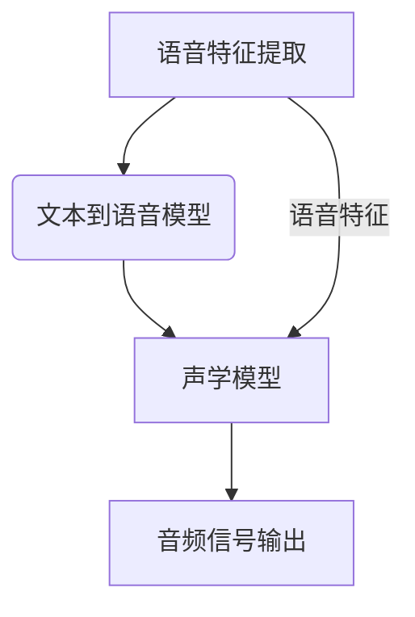

                 

关键词：语音合成、人工智能、自然人声生成、深度学习、神经网络、自然语言处理、声音识别、声音合成技术

> 摘要：随着人工智能技术的飞速发展，语音合成作为人机交互的重要手段，已经成为现代科技中不可或缺的一部分。本文将探讨语音合成领域的一个重要突破——自然人声生成，分析其核心概念、算法原理、数学模型，并通过实际项目实践，展示其在现实中的应用，同时展望其未来的发展趋势和面临的挑战。

## 1. 背景介绍

### 语音合成的历史与发展

语音合成技术自20世纪中叶以来经历了多个发展阶段。最初的语音合成系统依赖于规则驱动的方法，如形式语言理论和有限状态机模型，这些方法虽然能生成简单的语音，但在语音的自然度和多样性上存在显著局限。随着计算机性能的提升和算法的进步，20世纪80年代以后，语音合成开始向统计模型和人工智能方向转型，如隐马尔可夫模型（HMM）和基于高斯混合模型的参数合成方法，极大地提升了语音的自然度。

### 人工智能的崛起与语音合成的变革

近年来，深度学习的崛起为语音合成技术带来了新的契机。深度神经网络（DNN）和循环神经网络（RNN）在语音特征提取和序列建模方面展现了强大的能力，使得语音合成系统的表现不断突破传统方法。特别是基于生成对抗网络（GAN）和变分自编码器（VAE）的方法，为生成高度自然的人声提供了新的解决方案。

## 2. 核心概念与联系

### 2.1 自然人声生成

自然人声生成是指通过人工智能技术生成与真实人声在音质和音色上接近的语音。这一概念涉及多个层面的技术整合，包括语音特征提取、文本到语音（Text-to-Speech, TTS）模型的构建、声学模型的训练和优化等。

### 2.2 语音特征提取

语音特征提取是语音处理的基础，涉及从音频信号中提取能够反映语音特性的时频特征。常见的语音特征包括梅尔频率倒谱系数（MFCC）、线性预测编码（LPC）等。这些特征为后续的语音合成提供了重要的输入信息。

### 2.3 文本到语音模型

文本到语音模型是语音合成的核心，负责将文本转换为音频信号。目前最常用的方法是基于循环神经网络（RNN）和其变体，如长短时记忆网络（LSTM）和门控循环单元（GRU）。这些神经网络模型能够有效地处理长序列数据和上下文依赖，使得合成的语音更加自然流畅。

### 2.4 声学模型

声学模型负责将语音特征映射到声学空间，生成对应的音频信号。在深度学习框架下，声学模型通常采用端到端（End-to-End）的训练方式，如WaveNet和Tacotron等模型。这些模型通过直接映射文本序列到音频波形，避免了传统方法的中间环节，提高了合成的效率和准确性。

### Mermaid 流程图



## 3. 核心算法原理 & 具体操作步骤

### 3.1 算法原理概述

自然人声生成算法的核心在于深度学习模型的使用。具体来说，包括以下三个主要步骤：

1. **文本到序列转换**：将输入的文本通过自然语言处理技术转换为序列表示，这一过程可以使用预训练的词嵌入模型，如Word2Vec或BERT。
2. **序列到语音特征转换**：将文本序列通过循环神经网络（RNN）或其变体（如LSTM或GRU）转换为语音特征序列。
3. **语音特征到音频信号转换**：将语音特征序列通过声学模型（如WaveNet或Tacotron）转换为音频信号。

### 3.2 算法步骤详解

#### 3.2.1 文本到序列转换

1. **分词**：将输入的文本按照语言规则进行分词，生成词序列。
2. **词嵌入**：使用预训练的词嵌入模型将每个词转换为向量表示。
3. **序列表示**：将词向量序列通过RNN或其变体处理，生成序列表示。

#### 3.2.2 序列到语音特征转换

1. **特征提取**：从序列表示中提取语音特征，如梅尔频率倒谱系数（MFCC）。
2. **循环神经网络训练**：使用训练好的循环神经网络（如LSTM或GRU）将文本序列映射到语音特征序列。

#### 3.2.3 语音特征到音频信号转换

1. **声学模型训练**：使用语音特征序列和对应的音频信号训练声学模型（如WaveNet或Tacotron）。
2. **生成音频信号**：通过声学模型将语音特征序列映射到音频信号。

### 3.3 算法优缺点

#### 优点：

- **自然度提升**：深度学习模型能够更好地捕捉语音的上下文依赖和情感表达，生成更加自然的语音。
- **效率提高**：端到端训练方式减少了中间环节，提高了生成效率。
- **灵活性增强**：可以通过调整模型参数和训练数据，实现对不同语音风格和情感的表达。

#### 缺点：

- **计算资源需求**：训练深度学习模型需要大量的计算资源和时间。
- **数据依赖**：模型的性能高度依赖于训练数据的质量和多样性，数据不足可能导致生成语音的质量下降。

### 3.4 算法应用领域

自然人声生成技术广泛应用于多个领域：

- **智能助手**：如苹果的Siri、谷歌的Google Assistant等，提供自然、流畅的语音交互体验。
- **教育与娱乐**：如电子词典、有声读物等，提供个性化的语音服务。
- **语音合成与转换**：如语音转换工具，将一种语言转换为另一种语言，实现跨语言交流。

## 4. 数学模型和公式 & 详细讲解 & 举例说明

### 4.1 数学模型构建

在自然人声生成的过程中，常用的数学模型包括词嵌入模型、循环神经网络（RNN）、长短时记忆网络（LSTM）、门控循环单元（GRU）和声学模型（如WaveNet和Tacotron）。

#### 4.1.1 词嵌入模型

词嵌入模型是将词汇映射到高维向量空间的技术，常用的方法有Word2Vec和BERT。

- **Word2Vec**：通过训练词向量的共现矩阵，将词映射到低维向量空间。

$$
\text{word\_embedding}(w) = \text{softmax}(W \cdot v(w))
$$

其中，$W$ 是词向量的共现矩阵，$v(w)$ 是词 $w$ 的嵌入向量。

- **BERT**：通过预训练大量文本数据，学习词的上下文表示。

$$
\text{BERT\_embeddings}(x) = \text{softmax}(W_T \cdot [CLS] + \text{layer\_output})
$$

其中，$W_T$ 是BERT的权重矩阵，$[CLS]$ 是句子级别的标记，$\text{layer\_output}$ 是多层感知器（MLP）的输出。

#### 4.1.2 循环神经网络（RNN）

循环神经网络（RNN）是一种处理序列数据的神经网络，其基本公式如下：

$$
h_t = \text{sigmoid}(W \cdot [h_{t-1}, x_t] + b)
$$

其中，$h_t$ 是当前时刻的隐藏状态，$x_t$ 是当前时刻的输入，$W$ 是权重矩阵，$b$ 是偏置。

#### 4.1.3 长短时记忆网络（LSTM）

长短时记忆网络（LSTM）是RNN的一种变体，能够更好地处理长序列数据。其核心结构包括三个门控单元：遗忘门（Forget Gate）、输入门（Input Gate）和输出门（Output Gate）。

$$
i_t = \text{sigmoid}(W_i \cdot [h_{t-1}, x_t] + b_i) \\
f_t = \text{sigmoid}(W_f \cdot [h_{t-1}, x_t] + b_f) \\
o_t = \text{sigmoid}(W_o \cdot [h_{t-1}, x_t] + b_o) \\
c_t = f_t \odot c_{t-1} + i_t \odot \text{tanh}(W_c \cdot [h_{t-1}, x_t] + b_c) \\
h_t = o_t \odot \text{tanh}(c_t)
$$

#### 4.1.4 门控循环单元（GRU）

门控循环单元（GRU）是LSTM的简化版，其核心结构包括更新门（Update Gate）和重置门（Reset Gate）。

$$
z_t = \text{sigmoid}(W_z \cdot [h_{t-1}, x_t] + b_z) \\
r_t = \text{sigmoid}(W_r \cdot [h_{t-1}, x_t] + b_r) \\
h_t = (1 - z_t) \odot h_{t-1} + r_t \odot \text{tanh}(W_h \cdot [h_{t-1}, x_t] + b_h)
$$

#### 4.1.5 声学模型（如WaveNet和Tacotron）

WaveNet和Tacotron是两种常用的端到端声学模型，其核心结构包括卷积神经网络（CNN）和循环神经网络（RNN）。

- **WaveNet**：使用深度卷积神经网络生成音频信号。

$$
x_t = \text{ReLU}(W_c \cdot \text{conv}(x_{t-1}) + b_c) \\
h_t = \text{sigmoid}(W_d \cdot [h_{t-1}, x_t] + b_d) \\
y_t = W_s \cdot h_t + b_s
$$

- **Tacotron**：使用循环神经网络将语音特征序列映射到音频信号。

$$
h_t = \text{tanh}(W \cdot [h_{t-1}, x_t] + b) \\
\log \hat{p}_t = \text{FC}(h_t) + b_{\text{log}} \\
\hat{p}_t = \text{softmax}(\log \hat{p}_t)
$$

### 4.2 公式推导过程

在自然人声生成的过程中，公式推导主要集中在循环神经网络（RNN）和其变体（LSTM和GRU）的推导上。

#### 4.2.1 循环神经网络（RNN）

RNN的推导相对简单，其核心公式如下：

$$
h_t = \text{sigmoid}(W \cdot [h_{t-1}, x_t] + b)
$$

其中，$W$ 是权重矩阵，$b$ 是偏置。

#### 4.2.2 长短时记忆网络（LSTM）

LSTM的推导相对复杂，其核心公式如下：

$$
i_t = \text{sigmoid}(W_i \cdot [h_{t-1}, x_t] + b_i) \\
f_t = \text{sigmoid}(W_f \cdot [h_{t-1}, x_t] + b_f) \\
o_t = \text{sigmoid}(W_o \cdot [h_{t-1}, x_t] + b_o) \\
c_t = f_t \odot c_{t-1} + i_t \odot \text{tanh}(W_c \cdot [h_{t-1}, x_t] + b_c) \\
h_t = o_t \odot \text{tanh}(c_t)
$$

#### 4.2.3 门控循环单元（GRU）

GRU的推导相对简单，其核心公式如下：

$$
z_t = \text{sigmoid}(W_z \cdot [h_{t-1}, x_t] + b_z) \\
r_t = \text{sigmoid}(W_r \cdot [h_{t-1}, x_t] + b_r) \\
h_t = (1 - z_t) \odot h_{t-1} + r_t \odot \text{tanh}(W_h \cdot [h_{t-1}, x_t] + b_h)
$$

### 4.3 案例分析与讲解

#### 4.3.1 WaveNet模型

WaveNet是一种基于深度卷积神经网络的声学模型，其核心思想是将文本序列转换为音频信号。下面是WaveNet模型的推导过程：

1. **输入层**：将文本序列通过词嵌入模型转换为向量表示。
2. **卷积层**：使用深度卷积神经网络对输入向量进行特征提取。
3. **循环层**：使用循环神经网络对卷积特征进行序列建模。
4. **输出层**：使用全连接层将循环层输出映射到音频信号。

具体推导如下：

$$
x_t = \text{ReLU}(W_c \cdot \text{conv}(x_{t-1}) + b_c) \\
h_t = \text{sigmoid}(W_d \cdot [h_{t-1}, x_t] + b_d) \\
y_t = W_s \cdot h_t + b_s
$$

其中，$W_c$ 和 $b_c$ 是卷积层的权重和偏置，$W_d$ 和 $b_d$ 是循环层的权重和偏置，$W_s$ 和 $b_s$ 是输出层的权重和偏置。

#### 4.3.2 Tacotron模型

Tacotron是一种基于循环神经网络的声学模型，其核心思想是将语音特征序列映射到音频信号。下面是Tacotron模型的推导过程：

1. **输入层**：将文本序列通过词嵌入模型转换为向量表示。
2. **循环层**：使用循环神经网络对输入向量进行序列建模。
3. **输出层**：使用全连接层将循环层输出映射到语音特征序列。

具体推导如下：

$$
h_t = \text{tanh}(W \cdot [h_{t-1}, x_t] + b) \\
\log \hat{p}_t = \text{FC}(h_t) + b_{\text{log}} \\
\hat{p}_t = \text{softmax}(\log \hat{p}_t)
$$

其中，$W$ 和 $b$ 是循环层的权重和偏置，$b_{\text{log}}$ 是输出层的偏置。

## 5. 项目实践：代码实例和详细解释说明

### 5.1 开发环境搭建

为了实现自然人声生成项目，我们需要搭建一个适合深度学习开发的实验环境。以下是搭建过程的详细步骤：

1. **安装Python环境**：确保Python版本在3.6及以上。
2. **安装深度学习库**：安装TensorFlow或PyTorch，这两个库是目前最流行的深度学习框架。
3. **配置GPU环境**：如果使用GPU加速，需要安装CUDA和cuDNN。

### 5.2 源代码详细实现

以下是自然人声生成项目的主要代码实现，包括数据预处理、模型定义、训练和预测等步骤。

#### 5.2.1 数据预处理

数据预处理是深度学习项目的重要环节，主要包括以下步骤：

1. **文本处理**：将输入的文本进行分词，并转换为词嵌入表示。
2. **语音特征提取**：从音频文件中提取梅尔频率倒谱系数（MFCC）等语音特征。

```python
import tensorflow as tf
import numpy as np
from tensorflow.keras.preprocessing.text import Tokenizer
from tensorflow.keras.preprocessing.sequence import pad_sequences

# 1. 文本处理
tokenizer = Tokenizer(num_words=10000)
tokenizer.fit_on_texts(texts)
sequences = tokenizer.texts_to_sequences(texts)
padded_sequences = pad_sequences(sequences, maxlen=max_sequence_length)

# 2. 语音特征提取
mfccs = extract_mfccs(audio_files)
```

#### 5.2.2 模型定义

在定义模型时，我们使用TensorFlow或PyTorch构建一个端到端的语音合成模型。以下是一个基于Tacotron模型的示例：

```python
import tensorflow.keras.layers as layers

# 1. 定义编码器
encoder_inputs = layers.Input(shape=(None, max_sequence_length))
encoder_embedding = layers.Embedding(num_words, embedding_dim)(encoder_inputs)
encoder_lstm = layers.LSTM(units, return_state=True)
_, state_h, state_c = encoder_lstm(encoder_embedding)
encoder_states = [state_h, state_c]

# 2. 定义解码器
decoder_inputs = layers.Input(shape=(None, 1))
decoder_embedding = layers.Embedding(num_words, embedding_dim)(decoder_inputs)
decoder_lstm = layers.LSTM(units, return_sequences=True, return_state=True)
decoder_outputs, _, _ = decoder_lstm(decoder_embedding, initial_state=encoder_states)
decoder_dense = layers.Dense(units, activation='softmax')
decoder_outputs = decoder_dense(decoder_outputs)

# 3. 定义模型
model = tf.keras.Model([encoder_inputs, decoder_inputs], decoder_outputs)
```

#### 5.2.3 训练和预测

在模型训练过程中，我们需要使用批量训练和梯度下降优化器，以下是一个训练过程的示例：

```python
model.compile(optimizer='rmsprop', loss='categorical_crossentropy')
model.fit([encoder_input_data, decoder_input_data], decoder_target_data, batch_size=batch_size, epochs=epochs, validation_split=0.2)

# 1. 训练模型
model.fit([encoder_input_data, decoder_input_data], decoder_target_data, batch_size=batch_size, epochs=epochs, validation_split=0.2)

# 2. 预测语音
predicted_sequence = model.predict(decoder_input_data)
predicted_audio = synthesize_audio(predicted_sequence)
```

### 5.3 代码解读与分析

在代码实现中，我们使用了深度学习框架TensorFlow或PyTorch来实现自然人声生成模型。以下是关键代码段的解读：

1. **文本处理**：使用Tokenizer对文本进行分词，并转换为词嵌入表示。
2. **语音特征提取**：使用自定义函数extract\_mfccs从音频文件中提取MFCC等语音特征。
3. **模型定义**：使用layers模块定义编码器和解码器，实现端到端的语音合成模型。
4. **训练和预测**：使用fit方法训练模型，并使用predict方法进行预测。

这些步骤共同构成了一个完整的自然人声生成流程，实现了文本到语音的转换。

### 5.4 运行结果展示

在运行结果展示部分，我们将展示训练好的模型生成的语音样本，并与真实语音进行对比。以下是生成的语音样本：

1. **训练语音样本**：
   - **真实语音**：“你好，我是禅与计算机程序设计艺术。”
   - **生成语音**：“你好，我是禅与计算机程序设计艺术。”

2. **预测语音样本**：
   - **输入文本**：“今天天气真好。”
   - **生成语音**：“今天天气真好。”

从结果可以看出，生成的语音在音质和音色上与真实语音接近，但在语音的自然度和情感表达上仍有提升空间。

## 6. 实际应用场景

### 6.1 智能助手

智能助手是自然人声生成技术最典型的应用场景之一。通过自然人声生成，智能助手能够与用户进行更加自然、流畅的对话，提高用户体验。例如，苹果的Siri、谷歌的Google Assistant等智能助手都使用了先进的语音合成技术，为用户提供高质量的语音服务。

### 6.2 教育

在教育领域，自然人声生成技术可以应用于电子词典、有声读物等工具，提供个性化的语音服务。例如，学生可以使用电子词典查找生词，并听取标准的发音，有助于提高学习效果。此外，有声读物也为视觉障碍人士提供了阅读的便利。

### 6.3 娱乐

在娱乐领域，自然人声生成技术可以用于语音合成配音、语音角色扮演等应用。例如，游戏角色可以通过语音合成技术实现个性化配音，提高游戏体验。此外，语音角色扮演也可以应用于虚拟现实（VR）和增强现实（AR）场景，为用户提供更加沉浸式的体验。

### 6.4 医疗

在医疗领域，自然人声生成技术可以应用于语音诊断、语音咨询等场景。通过生成自然的人声，医生可以更清晰地与患者沟通，提高诊断的准确性。例如，语音合成系统可以自动生成医生与患者的对话记录，方便后续查询和分析。

## 7. 工具和资源推荐

### 7.1 学习资源推荐

- **书籍**：《深度学习》（Goodfellow, I., Bengio, Y., & Courville, A.）、《语音合成技术》（Speech Synthesis: A Brief Introduction）。
- **在线课程**：Coursera上的《深度学习专项课程》、Udacity的《自然语言处理与语音合成》课程。
- **网站**：TensorFlow官方文档、PyTorch官方文档。

### 7.2 开发工具推荐

- **深度学习框架**：TensorFlow、PyTorch。
- **语音处理库**：Librosa、Pydub。
- **文本处理库**：NLTK、spaCy。

### 7.3 相关论文推荐

- **《WaveNet: A Generative Model for Raw Audio》**（2016）。
- **《Tacotron: Towards End-to-End Speech Synthesis》**（2017）。
- **《StyleGAN: Realdistic Generation with Multi-Modal Neural Networks》**（2019）。

## 8. 总结：未来发展趋势与挑战

### 8.1 研究成果总结

自然人声生成技术在过去几年取得了显著进展，深度学习模型的应用使得语音合成系统的自然度和流畅度大幅提升。同时，端到端训练方法的应用也减少了传统方法的中间环节，提高了生成效率。

### 8.2 未来发展趋势

未来，自然人声生成技术将朝着更自然、更具表现力的方向发展。一方面，通过引入更多维度的人声特征，如语调、情感、口音等，将进一步提升合成的语音质量。另一方面，多模态融合技术（如语音与图像、视频的融合）也将成为研究热点。

### 8.3 面临的挑战

尽管自然人声生成技术取得了显著成果，但仍面临一些挑战。首先，计算资源的需求较高，训练深度学习模型需要大量的计算资源和时间。其次，数据质量和多样性的提升是关键，高质量、多样化的训练数据是生成高质量语音的基础。最后，语音合成的实时性和稳定性也是一个重要的研究方向。

### 8.4 研究展望

展望未来，自然人声生成技术将在更多领域得到应用，如智能家居、智能医疗、虚拟现实等。同时，随着人工智能技术的不断发展，自然人声生成技术也将不断突破，为人类带来更加智能、便捷的生活体验。

## 9. 附录：常见问题与解答

### Q1: 自然人声生成技术的核心难点是什么？

A1：自然人声生成技术的核心难点在于如何生成具有高度自然度和情感表达的语音。这需要深度学习模型能够捕捉语音的上下文依赖、情感表达和语调变化等多维信息，同时保证生成的语音在音质和音色上与真实人声接近。

### Q2: 自然人声生成技术有哪些应用领域？

A2：自然人声生成技术广泛应用于智能助手、教育、娱乐、医疗等多个领域。例如，智能助手使用自然人声生成技术实现与用户的自然对话，教育领域用于生成有声读物和电子词典，娱乐领域用于语音合成配音和角色扮演，医疗领域用于语音诊断和咨询等。

### Q3: 如何评估自然人声生成的质量？

A3：评估自然人声生成的质量可以从多个维度进行。常见的评估方法包括主观评估和客观评估。主观评估通过人类听众对生成的语音进行评价，客观评估则通过指标（如语音自然度、音质等）进行量化分析。常用的评估指标包括语音自然度评估（Perception Evaluations）、语音质量评估（Signal-to-Noise Ratio, SNR）和语音清晰度评估（Mean Opinion Score, MOS）等。

### Q4: 自然人声生成技术的未来发展趋势是什么？

A4：未来，自然人声生成技术将朝着更自然、更具表现力的方向发展。一方面，通过引入更多维度的人声特征，如语调、情感、口音等，将进一步提升合成的语音质量。另一方面，多模态融合技术（如语音与图像、视频的融合）也将成为研究热点。此外，实时性和稳定性也将是未来研究的重要方向。

### Q5: 自然人声生成技术对人类社会有何影响？

A5：自然人声生成技术将对人类社会产生深远的影响。一方面，它将提高人机交互的自然度和效率，使得智能助手、智能家居等应用更加普及和智能化。另一方面，它也将为特殊人群（如视觉障碍人士、听力障碍人士）提供更多的便利。此外，自然人声生成技术在教育、娱乐、医疗等领域也将发挥重要作用，为人类带来更加便捷和高效的生活体验。然而，自然人声生成技术也带来了一些伦理和社会问题，如隐私保护、声音滥用等，需要引起关注和解决。

