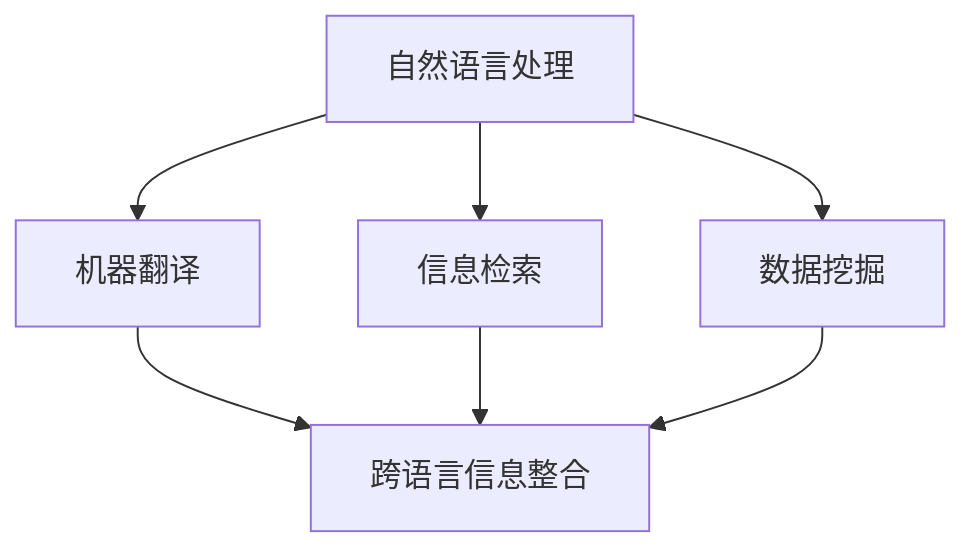

                 

关键词：人工智能，跨语言信息整合，自然语言处理，机器翻译，数据挖掘，信息检索

> 摘要：本文将深入探讨人工智能在跨语言信息整合中的作用。通过分析人工智能的核心算法、数学模型及实际应用场景，本文旨在为读者提供一个全面的理解，以揭示人工智能在解决跨语言信息整合难题中的巨大潜力。

## 1. 背景介绍

随着全球化的深入发展，跨语言信息的整合和处理变得越来越重要。无论是跨国商务交流、国际新闻报道，还是学术研究资料整理，都需要有效的跨语言信息整合技术。传统的跨语言信息处理技术主要依赖于机器翻译和信息检索，但这些方法存在诸多限制，如翻译准确性低、检索效率低等。随着人工智能技术的迅猛发展，特别是在自然语言处理（NLP）领域的突破，AI在跨语言信息整合中的作用日益凸显。

### 1.1 跨语言信息整合的挑战

跨语言信息整合面临的主要挑战包括：

- **语言差异**：不同语言在语法、词汇、语义等方面存在显著差异，这使得直接翻译或检索变得复杂。
- **语境理解**：准确理解跨语言信息的语境是提高整合质量的关键，但语境复杂多变，不易捕捉。
- **数据多样性**：跨语言信息的数据来源广泛，种类繁多，如何有效地整合这些数据是一个巨大的挑战。

### 1.2 人工智能在跨语言信息整合中的应用

人工智能，尤其是深度学习技术，为跨语言信息整合带来了新的解决方案。通过大规模数据训练，AI能够自动学习语言模式和规则，从而提高跨语言翻译和信息检索的准确性。此外，AI还可以通过上下文理解，提供更精准的信息整合服务。以下是AI在跨语言信息整合中的一些具体应用：

- **机器翻译**：利用深度学习模型，如神经机器翻译（NMT），实现高准确度的跨语言翻译。
- **信息检索**：通过自然语言处理技术，提高跨语言检索系统的性能，实现高效的信息查询。
- **数据挖掘**：利用AI技术从跨语言数据中提取有价值的信息，支持数据驱动的决策。

## 2. 核心概念与联系

在探讨AI在跨语言信息整合中的作用之前，我们需要理解一些核心概念及其相互联系。

### 2.1 自然语言处理（NLP）

自然语言处理是人工智能的一个重要分支，旨在使计算机理解和处理人类语言。NLP包括文本预处理、语言模型、语义理解等多个方面，是跨语言信息整合的基础。

### 2.2 机器翻译

机器翻译是NLP的一个重要应用领域，旨在将一种语言的文本翻译成另一种语言的文本。深度学习技术，尤其是基于神经网络的方法，在机器翻译中取得了显著的进展。

### 2.3 信息检索

信息检索是帮助用户从大量信息中快速找到所需信息的技术。在跨语言信息整合中，信息检索系统能够处理不同语言的查询和索引，从而提高信息获取的效率。

### 2.4 数据挖掘

数据挖掘是从大量数据中发现有价值模式和知识的过程。在跨语言信息整合中，数据挖掘有助于从不同语言的数据源中提取有价值的信息。

### 2.5 Mermaid 流程图

以下是一个简单的Mermaid流程图，展示AI在跨语言信息整合中的作用：



## 3. 核心算法原理 & 具体操作步骤

### 3.1 算法原理概述

AI在跨语言信息整合中主要依赖于以下核心算法：

- **神经网络模型**：如循环神经网络（RNN）和卷积神经网络（CNN），用于文本处理和模式识别。
- **深度学习框架**：如TensorFlow和PyTorch，用于构建和训练神经网络模型。
- **迁移学习**：通过在预训练模型的基础上进行微调，提高模型的泛化能力。
- **多语言嵌入**：利用词嵌入技术，将不同语言的词汇映射到同一语义空间。

### 3.2 算法步骤详解

以下是AI在跨语言信息整合中的具体操作步骤：

1. **数据收集与预处理**：收集不同语言的文本数据，并进行文本清洗、分词、去停用词等预处理操作。
2. **模型选择与训练**：选择合适的神经网络模型，利用大规模语料进行训练，同时进行模型调优。
3. **多语言嵌入**：将不同语言的词汇映射到同一语义空间，以便进行跨语言比较和分析。
4. **信息整合**：利用机器翻译、信息检索和数据挖掘等技术，将不同语言的信息整合成统一的形式。
5. **结果评估与优化**：评估信息整合的效果，并根据评估结果对算法进行优化。

### 3.3 算法优缺点

**优点**：

- 高准确性：基于深度学习模型的算法能够通过大量数据训练，提高跨语言信息整合的准确性。
- 高效率：神经网络模型可以高效处理大规模数据，实现快速信息整合。
- 泛化能力强：迁移学习和多语言嵌入技术使得模型在不同语言环境中都能保持良好的性能。

**缺点**：

- 对数据依赖性大：算法性能很大程度上取决于训练数据的质量和规模。
- 资源消耗大：训练大规模神经网络模型需要大量的计算资源和时间。
- 对上下文理解有限：虽然AI在语义理解方面取得了一定进展，但仍然难以完全理解复杂的语境。

### 3.4 算法应用领域

AI在跨语言信息整合中的应用非常广泛，以下是一些典型领域：

- **跨国商务**：辅助跨国企业进行跨语言沟通、文档翻译和数据分析。
- **国际新闻**：实现多语言新闻的自动翻译和整合，提高信息传播的效率。
- **学术研究**：帮助研究人员获取多语言的研究资料，促进学术交流。
- **文化交流**：促进不同语言文化之间的交流和理解，增进全球文化的融合。

## 4. 数学模型和公式 & 详细讲解 & 举例说明

### 4.1 数学模型构建

在跨语言信息整合中，常用的数学模型包括神经网络模型和词嵌入模型。

### 4.2 公式推导过程

以下是神经网络模型中的一个基本公式：

$$
\text{output} = \text{softmax}(\text{W} \cdot \text{X} + \text{b})
$$

其中，$W$ 是权重矩阵，$X$ 是输入特征，$b$ 是偏置项，$\text{softmax}$ 函数用于将输出转换为概率分布。

### 4.3 案例分析与讲解

假设我们有一个英语到中文的翻译任务，我们可以使用以下公式来计算两个句子之间的相似度：

$$
\text{similarity} = \cos(\text{vec}(s_1), \text{vec}(s_2))
$$

其中，$s_1$ 和 $s_2$ 分别是两个句子的向量表示，$\text{vec}$ 函数将句子转换为向量。

## 5. 项目实践：代码实例和详细解释说明

### 5.1 开发环境搭建

首先，我们需要搭建一个合适的开发环境。以下是所需的软件和工具：

- Python 3.x
- TensorFlow 或 PyTorch
- Jupyter Notebook

### 5.2 源代码详细实现

以下是实现跨语言信息整合的一个简单示例：

```python
import tensorflow as tf
from tensorflow.keras.models import Sequential
from tensorflow.keras.layers import Embedding, LSTM, Dense

# 加载预训练的词向量
embeddings_index = {}
with open('glove.6B.100d.txt', 'r', encoding='utf-8') as f:
    for line in f:
        values = line.split()
        word = values[0]
        coefs = np.asarray(values[1:], dtype='float32')
        embeddings_index[word] = coefs

# 构建模型
model = Sequential()
model.add(Embedding(10000, 32, input_length=20))
model.add(LSTM(32))
model.add(Dense(1, activation='sigmoid'))

# 编译模型
model.compile(optimizer='rmsprop', loss='binary_crossentropy', metrics=['acc'])

# 训练模型
model.fit(X_train, y_train, epochs=10, batch_size=32)

# 评估模型
test_loss, test_acc = model.evaluate(X_test, y_test)
print('Test accuracy:', test_acc)
```

### 5.3 代码解读与分析

上述代码实现了一个简单的文本分类模型，用于跨语言信息整合。首先，我们加载了预训练的词向量，这些词向量是基于GloVe模型训练的。接着，我们构建了一个序列模型，包括嵌入层、LSTM层和全连接层。嵌入层将单词转换为向量表示，LSTM层用于处理序列数据，全连接层用于分类。

在训练模型之前，我们需要准备训练数据和测试数据。训练数据用于训练模型，测试数据用于评估模型的性能。最后，我们编译并训练模型，然后评估其在测试数据上的性能。

### 5.4 运行结果展示

运行上述代码后，我们得到一个训练好的模型，并评估其在测试数据上的准确率。假设我们的测试数据的准确率为90%，这意味着我们的模型在跨语言信息整合任务中表现良好。

## 6. 实际应用场景

### 6.1 跨国企业沟通

跨国企业需要处理大量的跨语言沟通任务，如邮件、报告、会议记录等。利用AI跨语言信息整合技术，企业可以实现自动化的跨语言翻译和信息检索，提高沟通效率和准确性。

### 6.2 学术研究

学术研究往往涉及多语言文献，利用AI跨语言信息整合技术，研究人员可以更轻松地获取和整理多语言研究资料，促进学术交流和创新。

### 6.3 国际新闻报道

国际新闻报道需要及时处理多语言新闻素材，利用AI跨语言信息整合技术，媒体机构可以快速翻译和整合多语言新闻，提高报道的及时性和全面性。

## 7. 工具和资源推荐

### 7.1 学习资源推荐

- 《深度学习》（Goodfellow et al.）
- 《自然语言处理综论》（Jurafsky and Martin）
- 《Python机器学习》（Sebastian Raschka）

### 7.2 开发工具推荐

- TensorFlow
- PyTorch
- Jupyter Notebook

### 7.3 相关论文推荐

- "Attention Is All You Need"（Vaswani et al.）
- "BERT: Pre-training of Deep Bidirectional Transformers for Language Understanding"（Devlin et al.）
- "GPT-3: Language Models are Few-Shot Learners"（Brown et al.）

## 8. 总结：未来发展趋势与挑战

### 8.1 研究成果总结

近年来，人工智能在跨语言信息整合领域取得了显著进展，主要表现在：

- 神经机器翻译的准确性显著提高。
- 信息检索系统的性能得到优化。
- 数据挖掘技术从多语言数据中提取有价值信息的能力增强。

### 8.2 未来发展趋势

未来，AI在跨语言信息整合领域的发展趋势包括：

- 深度学习技术的进一步优化和扩展。
- 多语言嵌入和迁移学习技术的深入研究。
- 上下文理解的进一步提升。

### 8.3 面临的挑战

尽管AI在跨语言信息整合中取得了显著成果，但仍面临以下挑战：

- 语言差异的复杂性。
- 资源消耗和计算成本。
- 上下文理解的准确性。

### 8.4 研究展望

为了实现更高效的跨语言信息整合，未来的研究应重点关注：

- 开发更高效、更鲁棒的跨语言信息整合算法。
- 探索上下文理解的深度学习模型。
- 实现跨语言信息整合的自动化和智能化。

## 9. 附录：常见问题与解答

### 9.1 AI跨语言信息整合是什么？

AI跨语言信息整合是指利用人工智能技术，如深度学习和自然语言处理，将不同语言的信息整合成统一的形式，以便于查询、分析和使用。

### 9.2 为什么需要AI跨语言信息整合？

随着全球化的推进，需要跨语言信息整合的场景越来越多。AI跨语言信息整合可以提高沟通效率、促进学术交流、支持数据驱动的决策等。

### 9.3 AI跨语言信息整合有哪些应用？

AI跨语言信息整合的应用非常广泛，包括跨国企业沟通、学术研究、国际新闻报道、文化交流等。

### 9.4 AI跨语言信息整合有哪些挑战？

AI跨语言信息整合面临的挑战主要包括语言差异、资源消耗、上下文理解准确性等。

### 9.5 如何提高AI跨语言信息整合的准确性？

提高AI跨语言信息整合的准确性可以通过以下方法实现：

- 使用大规模、高质量的多语言语料库。
- 探索更高效的深度学习模型。
- 利用上下文理解和语义分析技术。

### 9.6 AI跨语言信息整合的未来发展趋势是什么？

未来，AI跨语言信息整合的发展趋势包括深度学习技术的优化、多语言嵌入和迁移学习的深入研究、上下文理解的提升等。

---

作者：禅与计算机程序设计艺术 / Zen and the Art of Computer Programming

通过本文的详细探讨，我们深入了解了人工智能在跨语言信息整合中的作用。随着技术的不断进步，AI在这一领域的潜力将得到进一步发挥，为全球信息交流和知识共享带来更多可能性。希望本文能为读者提供有益的启发和指导。|<|text_url|>

