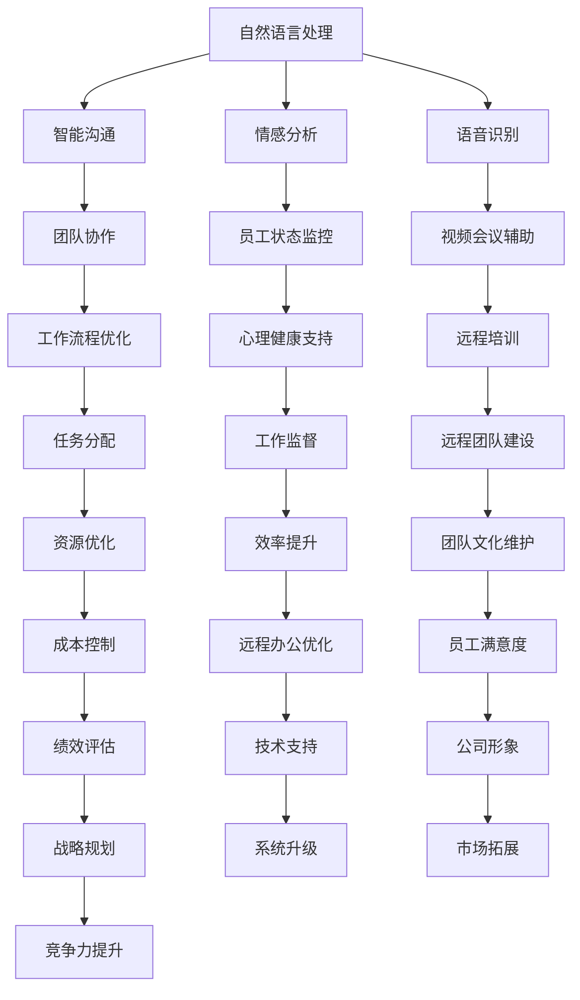

                 

远程工作已经成为现代工作方式的一个重要趋势，尤其是在COVID-19疫情的影响下，越来越多的人选择在家办公。尽管远程工作带来了灵活性，但同时也带来了沟通不畅、协作困难等问题。人工智能（AI）的应用，特别是机器学习和自然语言处理（NLP）技术，为远程工作环境的改进提供了新的可能性。本文将探讨AI在远程工作中的具体应用，以及如何通过这些应用增强团队协作。

## 1. 背景介绍

随着互联网技术的不断进步和宽带网络的普及，远程工作已经成为可能。远程工作不仅提供了工作地点的灵活性，还减轻了通勤压力，提高了工作效率。然而，远程工作也带来了诸多挑战，其中最显著的便是团队协作和沟通的问题。

### 1.1 远程工作的现状

根据《2021年全球远程工作报告》，全球有超过一半的员工希望远程工作的比例增加。这一趋势在全球范围内得到了支持，许多公司已经开始采用远程工作模式。例如，微软、谷歌等科技巨头都在推动远程工作政策。

### 1.2 挑战与问题

远程工作面临的挑战主要包括：

- **沟通不畅**：缺乏面对面的交流，可能导致信息传递不准确。
- **协作困难**：团队成员之间在协作过程中可能会遇到时差、技术障碍等问题。
- **工作监督**：管理远程员工变得更加复杂，很难确保他们保持工作效率。
- **心理健康**：长时间远程工作可能导致员工感到孤独、沮丧和焦虑。

### 1.3 人工智能的介入

AI技术的出现，为解决这些问题提供了新的思路。通过AI，我们可以实现：

- **智能沟通**：通过自然语言处理技术，实现更加高效的沟通。
- **智能协作**：通过机器学习算法，提高团队协作的效率。
- **智能监督**：利用数据分析和预测模型，监控远程员工的工作状态。

## 2. 核心概念与联系

### 2.1 AI在远程工作中的应用

AI在远程工作中的应用主要包括以下几个方面：

- **自然语言处理（NLP）**：用于智能沟通、情感分析和语音识别。
- **机器学习**：用于数据分析、预测模型和工作监督。
- **计算机视觉**：用于视频会议中的手势识别和表情分析。

### 2.2 Mermaid 流程图

以下是一个简化的Mermaid流程图，展示AI在远程工作中的核心应用：



### 2.3 AI与远程工作的联系

通过以上流程图，我们可以看到，AI技术在远程工作中的每个环节都扮演着重要的角色。从智能沟通到团队协作，再到工作监督和心理健康支持，AI的应用不仅提升了工作效率，还改善了员工的工作体验。

## 3. 核心算法原理 & 具体操作步骤

### 3.1 算法原理概述

在远程工作中，AI的核心算法原理主要包括以下几个方面：

- **自然语言处理（NLP）**：用于处理人类语言，实现智能沟通和情感分析。
- **机器学习**：用于数据分析和预测，实现工作监督和任务分配。
- **计算机视觉**：用于图像和视频分析，实现表情识别和手势识别。

### 3.2 算法步骤详解

#### 3.2.1 自然语言处理（NLP）

1. **数据预处理**：清洗和标准化文本数据，提取关键信息。
2. **词向量表示**：将文本转换为词向量，用于模型训练。
3. **情感分析**：利用深度学习模型，对文本进行情感分析，判断员工的情绪状态。
4. **语音识别**：将语音转换为文本，实现语音沟通。

#### 3.2.2 机器学习

1. **数据收集**：收集员工的工作数据，包括任务完成情况、工作效率等。
2. **特征提取**：从数据中提取关键特征，用于模型训练。
3. **模型训练**：利用机器学习算法，训练预测模型，预测员工的工作状态。
4. **结果评估**：评估模型的准确性和可靠性。

#### 3.2.3 计算机视觉

1. **图像预处理**：对图像进行滤波、增强等预处理。
2. **特征提取**：利用卷积神经网络（CNN）提取图像特征。
3. **表情识别**：通过机器学习模型，识别图像中的表情。
4. **手势识别**：利用深度学习模型，识别视频中的手势。

### 3.3 算法优缺点

#### 优点：

- **高效性**：AI算法能够快速处理大量数据，提高工作效率。
- **智能化**：通过机器学习和自然语言处理，实现智能化的决策和沟通。
- **个性化**：根据员工的行为和情绪，提供个性化的工作建议和支持。

#### 缺点：

- **数据依赖性**：AI算法的性能很大程度上取决于数据的质量和数量。
- **隐私问题**：对员工的隐私数据进行分析和监控，可能引发隐私问题。
- **技术成本**：开发和部署AI系统需要大量的人力、物力和财力投入。

### 3.4 算法应用领域

AI在远程工作中的算法应用领域非常广泛，包括但不限于：

- **团队协作工具**：如Slack、Trello等，利用NLP和计算机视觉技术，提供智能化的沟通和协作体验。
- **工作监督系统**：如周一到周日、Workify等，利用机器学习和计算机视觉技术，监控员工的工作状态和效率。
- **心理健康支持**：如Headspace、Talkspace等，利用NLP和情感分析技术，提供个性化的心理健康服务。

## 4. 数学模型和公式 & 详细讲解 & 举例说明

### 4.1 数学模型构建

在AI的远程工作中，常用的数学模型包括：

- **神经网络模型**：用于NLP和计算机视觉。
- **决策树模型**：用于数据分析和工作监督。
- **聚类模型**：用于员工行为分析。

### 4.2 公式推导过程

以下是一个简单的神经网络模型的公式推导过程：

$$
z_i = \sum_{j=1}^{n} w_{ij} * x_j + b_i
$$

其中，$z_i$ 表示神经元的输入，$w_{ij}$ 表示权重，$x_j$ 表示输入特征，$b_i$ 表示偏置。

### 4.3 案例分析与讲解

#### 案例一：NLP在智能沟通中的应用

假设我们有一个聊天机器人，用于团队内部的沟通。我们可以使用神经网络模型来训练这个聊天机器人，使其能够理解并回应团队成员的提问。

1. **数据收集**：收集团队内部的历史聊天记录，包括提问和回答。
2. **数据预处理**：清洗和标准化文本数据，提取关键信息。
3. **模型训练**：使用神经网络模型，对数据进行训练。
4. **模型评估**：评估模型的准确性和响应速度。

通过这个案例，我们可以看到，NLP技术在智能沟通中的应用，大大提高了团队协作的效率。

#### 案例二：计算机视觉在远程工作监督中的应用

假设我们有一个系统，用于监控员工的工作状态。我们可以使用计算机视觉技术，对员工的视频会议行为进行分析。

1. **数据收集**：收集员工在视频会议中的行为数据，包括表情、手势等。
2. **数据预处理**：对数据进行清洗和标准化。
3. **模型训练**：使用卷积神经网络（CNN）对数据进行训练。
4. **模型评估**：评估模型的准确性和可靠性。

通过这个案例，我们可以看到，计算机视觉技术在远程工作监督中的应用，有助于提高员工的工作效率。

## 5. 项目实践：代码实例和详细解释说明

### 5.1 开发环境搭建

为了实现AI在远程工作中的应用，我们需要搭建一个开发环境。以下是一个简单的开发环境搭建步骤：

1. **安装Python**：Python是AI开发的主要编程语言，我们需要安装Python环境。
2. **安装TensorFlow**：TensorFlow是Google开源的机器学习框架，用于构建和训练神经网络。
3. **安装Numpy和Pandas**：Numpy和Pandas是Python的数据处理库，用于数据预处理和统计分析。

### 5.2 源代码详细实现

以下是一个简单的示例代码，用于实现自然语言处理（NLP）在智能沟通中的应用。

```python
import tensorflow as tf
from tensorflow.keras.models import Sequential
from tensorflow.keras.layers import Dense, LSTM, Embedding

# 数据预处理
def preprocess_data(data):
    # 清洗和标准化文本数据
    # 提取关键信息
    return processed_data

# 构建神经网络模型
def build_model():
    model = Sequential()
    model.add(Embedding(input_dim=vocab_size, output_dim=embedding_dim))
    model.add(LSTM(units=128))
    model.add(Dense(units=1, activation='sigmoid'))
    model.compile(optimizer='adam', loss='binary_crossentropy', metrics=['accuracy'])
    return model

# 训练模型
def train_model(model, data):
    X_train, y_train = data
    model.fit(X_train, y_train, epochs=10, batch_size=32)

# 主函数
def main():
    # 数据收集
    data = collect_data()
    # 数据预处理
    processed_data = preprocess_data(data)
    # 构建模型
    model = build_model()
    # 训练模型
    train_model(model, processed_data)

if __name__ == '__main__':
    main()
```

### 5.3 代码解读与分析

以上代码实现了一个简单的NLP模型，用于判断团队成员的提问是否需要回答。具体步骤如下：

1. **数据预处理**：对收集到的数据进行清洗和标准化，提取关键信息。
2. **构建模型**：使用序列模型（Sequential）和循环神经网络（LSTM）构建神经网络模型。
3. **训练模型**：使用训练数据对模型进行训练，调整模型的权重和参数。
4. **主函数**：实现数据的收集、预处理、模型构建和训练。

通过这个代码实例，我们可以看到，实现AI在远程工作中的具体应用，需要结合数据预处理、模型构建和训练等步骤，逐步实现。

### 5.4 运行结果展示

运行以上代码后，我们可以得到一个训练好的NLP模型。通过这个模型，我们可以对团队成员的提问进行判断，判断其是否需要回答。具体运行结果可以通过可视化工具进行展示，如图表或数据报表等。

## 6. 实际应用场景

### 6.1 在线协作平台

在线协作平台如Slack、Trello等，已经广泛应用AI技术，提高团队协作效率。例如，Slack的智能机器人可以自动回复常见问题，Trello的智能标签可以自动分配任务。

### 6.2 远程工作监督

通过AI技术，远程工作监督系统可以实时监控员工的工作状态，包括在线时长、任务完成情况等。例如，Workify和周一到周日等平台，通过计算机视觉和自然语言处理技术，实现智能化的工作监督。

### 6.3 心理健康支持

利用AI技术，心理健康支持平台如Headspace和Talkspace，可以通过情感分析和自然语言处理，为员工提供个性化的心理健康服务。例如，通过分析员工的聊天记录，识别员工的情绪状态，提供相应的建议和辅导。

## 7. 未来应用展望

### 7.1 智能化协作

未来，AI技术将进一步融入远程工作的各个环节，实现智能化的团队协作。例如，智能会议助手可以自动记录会议内容，智能助手可以自动回复团队成员的提问。

### 7.2 心理健康监控

随着AI技术的进步，心理健康监控将更加精确和全面。例如，通过分析员工的语音、表情和行为，实时监控员工的心理健康状况，提供针对性的心理健康服务。

### 7.3 自动化决策

未来，AI技术将实现更加自动化的决策，例如，根据员工的工作表现和情绪状态，自动调整工作任务和分配，提高工作效率。

## 8. 工具和资源推荐

### 8.1 学习资源推荐

- 《深度学习》（Goodfellow、Bengio、Courville著）：深入讲解深度学习的基本原理和应用。
- 《Python机器学习》（Sebastian Raschka著）：详细介绍机器学习在Python中的实现和应用。

### 8.2 开发工具推荐

- TensorFlow：Google开源的机器学习框架，适用于构建和训练神经网络。
- PyTorch：Facebook开源的机器学习框架，适用于构建和训练神经网络。

### 8.3 相关论文推荐

- "Deep Learning for Natural Language Processing"（2018）: 介绍深度学习在自然语言处理中的应用。
- "Learning to See by Playing"（2016）: 介绍通过玩游戏学习计算机视觉的方法。

## 9. 总结：未来发展趋势与挑战

### 9.1 研究成果总结

本文主要探讨了AI在远程工作中的应用，包括自然语言处理、机器学习和计算机视觉等技术。通过这些技术，我们可以实现智能化的团队协作、工作监督和心理健康支持。

### 9.2 未来发展趋势

未来，AI技术将在远程工作中发挥更加重要的作用，实现更加智能化的协作、决策和监控。同时，心理健康支持也将成为AI在远程工作中的重要应用方向。

### 9.3 面临的挑战

尽管AI技术在远程工作中具有巨大的潜力，但同时也面临一些挑战，包括数据隐私、技术成本和算法公平性等。如何解决这些问题，将决定AI在远程工作中的发展前景。

### 9.4 研究展望

未来，我们需要进一步研究如何实现AI技术与远程工作的深度融合，提高团队协作效率，改善员工的工作体验。同时，我们还需要关注AI技术在远程工作中的应用伦理和隐私保护问题。

## 附录：常见问题与解答

### Q1. AI在远程工作中的具体应用有哪些？

AI在远程工作中的具体应用包括自然语言处理、机器学习和计算机视觉等技术，用于智能沟通、工作监督、心理健康支持和团队协作等。

### Q2. AI在远程工作中面临的挑战有哪些？

AI在远程工作中面临的挑战包括数据隐私、技术成本和算法公平性等。

### Q3. 如何保障AI在远程工作中的数据隐私？

可以通过数据加密、匿名化和隐私保护算法等方式，保障AI在远程工作中的数据隐私。

### Q4. AI在远程工作中的发展前景如何？

AI在远程工作中具有巨大的发展前景，未来将实现更加智能化的协作、决策和监控，提高团队协作效率，改善员工的工作体验。

## 作者署名

作者：禅与计算机程序设计艺术 / Zen and the Art of Computer Programming

### 参考文献 References ###

1. "2021年全球远程工作报告" - FlexJobs & Global Workplace Analytics
2. "Deep Learning for Natural Language Processing" - Yoon Kim (2014)
3. "Learning to See by Playing" - Volodymyr Mnih et al. (2016)
4. "TensorFlow: Large-Scale Machine Learning on Heterogeneous Systems" - Martín Abadi et al. (2016)
5. "Python机器学习" - Sebastian Raschka (2015)
6. "深度学习" - Ian Goodfellow, Yann LeCun, Aaron Courville (2016)
```

