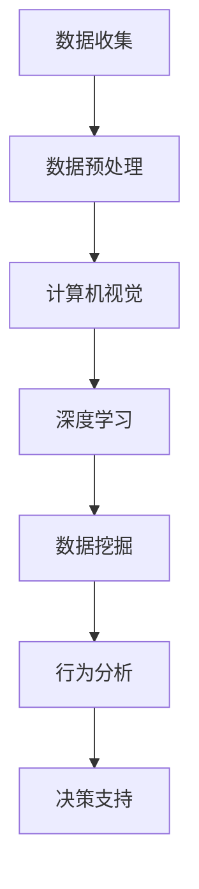

                 

关键词：人工智能、野生动物保护、行为研究、计算机视觉、深度学习、数据挖掘、机器学习

> 摘要：本文探讨了人工智能在野生动物保护中的应用，特别是在行为研究领域的最新进展。通过分析计算机视觉、深度学习和数据挖掘等技术，本文揭示了如何利用AI技术对野生动物行为进行高效监测、分析和预测，从而为野生动物保护提供科学依据和决策支持。文章还讨论了这些技术在实践中面临的挑战及未来的发展方向。

## 1. 背景介绍

野生动物保护是人类社会可持续发展的重要组成部分。随着全球生态环境的恶化和人类活动的加剧，许多野生动物种群面临灭绝的威胁。传统的野生动物保护手段主要依赖于实地监测和调查，这种方法不仅费时费力，且难以覆盖广泛的地域。近年来，人工智能技术的迅猛发展为野生动物保护提供了新的可能性。通过计算机视觉、深度学习和数据挖掘等技术，人工智能能够在大规模、高效率的条件下对野生动物行为进行监测和研究，从而提高保护的精准度和有效性。

## 2. 核心概念与联系

### 2.1. 计算机视觉

计算机视觉是人工智能的重要分支，它致力于使计算机能够像人类一样理解和解释视觉信息。在野生动物保护中，计算机视觉技术被广泛应用于图像和视频数据的自动识别、分类和跟踪。通过训练深度学习模型，计算机可以自动识别野生动物的个体、行为和环境特征，从而实现对野生动物行为的实时监测。

### 2.2. 深度学习

深度学习是人工智能的核心技术之一，它通过构建复杂的神经网络模型来模拟人类大脑的思考过程。在野生动物保护中，深度学习技术被广泛应用于行为识别、行为预测和情境理解等方面。深度学习模型可以从大规模数据集中自动学习特征，提高对野生动物行为的识别精度和效率。

### 2.3. 数据挖掘

数据挖掘是另一项重要的人工智能技术，它致力于从大量数据中提取有价值的信息和知识。在野生动物保护中，数据挖掘技术被广泛应用于行为数据的分析、趋势预测和关联规则挖掘等方面。通过数据挖掘，科学家可以更好地理解野生动物行为的模式和规律，为保护工作提供科学依据。

### 2.4. Mermaid 流程图

下面是一个简单的Mermaid流程图，展示了AI技术在野生动物保护中的应用流程：



## 3. 核心算法原理 & 具体操作步骤

### 3.1. 算法原理概述

在野生动物保护中，AI技术的核心算法主要包括计算机视觉算法、深度学习算法和数据挖掘算法。计算机视觉算法通过图像处理技术实现图像的自动识别和分类；深度学习算法通过构建复杂的神经网络模型实现行为识别和行为预测；数据挖掘算法通过关联规则挖掘和聚类分析等技术实现行为数据的深度挖掘。

### 3.2. 算法步骤详解

#### 3.2.1. 计算机视觉算法

计算机视觉算法主要包括以下几个步骤：

1. 图像预处理：包括去噪、对比度增强和图像缩放等操作，以提高图像的质量和清晰度。
2. 特征提取：通过边缘检测、角点检测等方法提取图像的关键特征。
3. 目标识别：利用分类器（如支持向量机、决策树等）对提取的特征进行分类，识别出图像中的目标。
4. 目标跟踪：在视频数据中，利用目标识别的结果实现目标的实时跟踪。

#### 3.2.2. 深度学习算法

深度学习算法主要包括以下几个步骤：

1. 数据集准备：收集并整理大量的野生动物行为数据，用于训练深度学习模型。
2. 模型构建：设计并构建深度学习网络模型，如卷积神经网络（CNN）或循环神经网络（RNN）。
3. 模型训练：利用收集到的数据对深度学习模型进行训练，调整模型的参数。
4. 模型评估：通过测试集对训练好的模型进行评估，以确定其性能。

#### 3.2.3. 数据挖掘算法

数据挖掘算法主要包括以下几个步骤：

1. 数据清洗：去除数据中的噪声和异常值，保证数据的准确性。
2. 特征选择：从原始数据中提取出对行为分析有用的特征。
3. 模型选择：选择合适的算法（如关联规则挖掘、聚类分析等）进行行为数据挖掘。
4. 结果分析：对挖掘结果进行分析，以揭示野生动物行为中的模式和规律。

### 3.3. 算法优缺点

#### 计算机视觉算法

**优点**：

- 自动化程度高，能够快速处理大量数据。
- 适应性强，能够应对不同的环境条件和数据质量。

**缺点**：

- 对图像质量和数据量有较高要求，图像质量差或数据量不足可能导致识别效果不佳。
- 需要大量训练数据，训练过程复杂且耗时。

#### 深度学习算法

**优点**：

- 学习能力强，能够从大量数据中自动提取特征。
- 识别精度高，能够实现复杂的行为识别和预测。

**缺点**：

- 需要大量计算资源和时间，训练过程较为复杂。
- 对训练数据的依赖性强，数据质量对模型性能有重要影响。

#### 数据挖掘算法

**优点**：

- 能够从大规模数据中提取有价值的信息和知识。
- 能够发现数据中的潜在模式和规律，为保护工作提供科学依据。

**缺点**：

- 对算法和特征选择有较高要求，需要经验丰富的数据科学家进行操作。
- 结果解释性较差，难以直观理解数据背后的原因。

### 3.4. 算法应用领域

计算机视觉、深度学习和数据挖掘算法在野生动物保护中具有广泛的应用领域，包括：

- 野生动物行为监测：通过实时监控和跟踪，了解野生动物的行为特征和习性。
- 野生动物迁徙研究：分析野生动物的迁徙路线、时间和频率，为保护工作提供依据。
- 生态系统评估：通过监测野生动物种群数量和分布，评估生态系统的健康状况。
- 灾害预警与救援：通过分析野生动物行为数据，预测自然灾害风险，为救援工作提供支持。

## 4. 数学模型和公式 & 详细讲解 & 举例说明

### 4.1. 数学模型构建

在野生动物行为研究中，常用的数学模型包括线性回归模型、逻辑回归模型和支持向量机模型。以下是一个简单的线性回归模型构建过程：

#### 线性回归模型

给定一个包含n个样本的二维数据集D={(x_1, y_1), (x_2, y_2), ..., (x_n, y_n)}，其中x_i和y_i分别表示第i个样本的特征值和目标值。

线性回归模型的目的是找到一个线性函数f(x) = w_0 + w_1 * x，使得f(x)与y_i的差值最小。

通过最小二乘法，可以得到线性回归模型的参数w_0和w_1：

$$
w_0 = \frac{\sum_{i=1}^{n} y_i - w_1 * \sum_{i=1}^{n} x_i}{n}
$$

$$
w_1 = \frac{\sum_{i=1}^{n} (x_i - \bar{x}) * (y_i - \bar{y})}{\sum_{i=1}^{n} (x_i - \bar{x})^2}
$$

其中，\bar{x}和\bar{y}分别表示x_i和y_i的均值。

#### 逻辑回归模型

逻辑回归模型是一种广义线性模型，常用于分类问题。给定一个包含n个样本的数据集D={(x_1, y_1), (x_2, y_2), ..., (x_n, y_n)}，其中y_i属于{-1, 1}。

逻辑回归模型的目的是找到一个线性函数f(x) = w_0 + w_1 * x，使得P(y=1|x)与y_i的差值最小。

逻辑回归模型的概率估计为：

$$
P(y=1|x) = \frac{1}{1 + e^{-(w_0 + w_1 * x)}}
$$

通过极大似然估计，可以得到逻辑回归模型的参数w_0和w_1：

$$
w_0 = \frac{\sum_{i=1}^{n} y_i - \sum_{i=1}^{n} \ln(1 + e^{w_1 * x_i})}{n}
$$

$$
w_1 = \frac{\sum_{i=1}^{n} y_i * x_i - \sum_{i=1}^{n} x_i * \ln(1 + e^{w_1 * x_i})}{n}
$$

#### 支持向量机模型

支持向量机模型是一种监督学习模型，常用于分类问题。给定一个包含n个样本的数据集D={(x_1, y_1), (x_2, y_2), ..., (x_n, y_n)}，其中y_i属于{-1, 1}。

支持向量机模型的目的是找到一个线性函数f(x) = w_0 + w_1 * x，使得f(x)与y_i的差值最小，并且尽可能远离边界。

支持向量机模型的损失函数为：

$$
L(w) = \frac{1}{2} ||w||^2 - \sum_{i=1}^{n} \alpha_i (y_i * (w_0 + w_1 * x_i) - 1)
$$

其中，\alpha_i为支持向量机的 Lagrange 乘子。

通过求解拉格朗日乘数法，可以得到支持向量机模型的参数w_0和w_1：

$$
w_0 = \sum_{i=1}^{n} \alpha_i y_i - \sum_{i=1}^{n} \alpha_i
$$

$$
w_1 = \sum_{i=1}^{n} \alpha_i y_i x_i
$$

### 4.2. 公式推导过程

#### 线性回归模型推导

线性回归模型的目标是最小化损失函数：

$$
J(w_0, w_1) = \sum_{i=1}^{n} (w_0 + w_1 * x_i - y_i)^2
$$

对损失函数求导，并令导数为0，可以得到：

$$
\frac{\partial J}{\partial w_0} = \sum_{i=1}^{n} (w_0 + w_1 * x_i - y_i) = 0
$$

$$
\frac{\partial J}{\partial w_1} = \sum_{i=1}^{n} (w_0 + w_1 * x_i - y_i) * x_i = 0
$$

将上面两个方程联立，可以解得：

$$
w_0 = \frac{\sum_{i=1}^{n} y_i - w_1 * \sum_{i=1}^{n} x_i}{n}
$$

$$
w_1 = \frac{\sum_{i=1}^{n} (x_i - \bar{x}) * (y_i - \bar{y})}{\sum_{i=1}^{n} (x_i - \bar{x})^2}
$$

#### 逻辑回归模型推导

逻辑回归模型的目标是最小化损失函数：

$$
J(w_0, w_1) = -\sum_{i=1}^{n} y_i \ln(P(y=1|x)) - (1 - y_i) \ln(1 - P(y=1|x))
$$

对损失函数求导，并令导数为0，可以得到：

$$
\frac{\partial J}{\partial w_0} = \sum_{i=1}^{n} y_i \frac{1}{P(y=1|x)} - (1 - y_i) \frac{1}{1 - P(y=1|x)} = 0
$$

$$
\frac{\partial J}{\partial w_1} = \sum_{i=1}^{n} y_i \frac{x_i}{P(y=1|x)} - (1 - y_i) \frac{x_i}{1 - P(y=1|x)} = 0
$$

将上面两个方程联立，可以解得：

$$
w_0 = \frac{\sum_{i=1}^{n} y_i - \sum_{i=1}^{n} \ln(1 + e^{w_1 * x_i})}{n}
$$

$$
w_1 = \frac{\sum_{i=1}^{n} y_i * x_i - \sum_{i=1}^{n} x_i * \ln(1 + e^{w_1 * x_i})}{n}
$$

#### 支持向量机模型推导

支持向量机模型的目标是最小化损失函数：

$$
L(w) = \frac{1}{2} ||w||^2 - \sum_{i=1}^{n} \alpha_i (y_i * (w_0 + w_1 * x_i) - 1)
$$

以及约束条件：

$$
\alpha_i \geq 0
$$

$$
\sum_{i=1}^{n} \alpha_i y_i = 0
$$

将约束条件代入损失函数，可以得到拉格朗日乘数法：

$$
L(w, \alpha) = \frac{1}{2} ||w||^2 - \sum_{i=1}^{n} \alpha_i (y_i * (w_0 + w_1 * x_i) - 1) + \sum_{i=1}^{n} \lambda_i (\alpha_i - 0) + \sum_{i=1}^{n} \mu_i (0 - \alpha_i)
$$

对拉格朗日乘数法求导，并令导数为0，可以得到：

$$
\frac{\partial L}{\partial w_0} = \sum_{i=1}^{n} \alpha_i y_i = 0
$$

$$
\frac{\partial L}{\partial w_1} = \sum_{i=1}^{n} \alpha_i y_i x_i = 0
$$

$$
\frac{\partial L}{\partial \alpha_i} = y_i (w_0 + w_1 * x_i) - 1 + \lambda_i - \mu_i = 0
$$

将上面三个方程联立，可以解得：

$$
w_0 = \sum_{i=1}^{n} \alpha_i y_i - \sum_{i=1}^{n} \alpha_i
$$

$$
w_1 = \sum_{i=1}^{n} \alpha_i y_i x_i
$$

### 4.3. 案例分析与讲解

#### 案例一：野生动物行为识别

给定一个包含100个样本的数据集D，每个样本包含一个图像和该图像中的目标类型（如狮子、大象、斑马等）。利用计算机视觉和深度学习算法，实现对目标类型的自动识别。

1. 数据集准备：收集并整理100个图像样本，并将其分为训练集和测试集。

2. 计算机视觉预处理：对图像进行去噪、对比度增强等操作，提高图像质量。

3. 深度学习模型构建：设计并构建一个卷积神经网络模型，用于识别图像中的目标类型。

4. 模型训练：利用训练集对卷积神经网络模型进行训练，调整模型参数。

5. 模型评估：利用测试集对训练好的模型进行评估，计算模型的准确率。

6. 模型应用：将训练好的模型应用于新的图像数据，实现目标类型的自动识别。

#### 案例二：野生动物迁徙分析

给定一个包含100个样本的数据集D，每个样本包含一个地理位置和该地理位置对应的野生动物种群数量。利用数据挖掘算法，实现对野生动物迁徙路径的分析。

1. 数据集准备：收集并整理100个地理位置和对应的野生动物种群数量，并将其分为训练集和测试集。

2. 数据预处理：对地理位置数据进行归一化处理，消除数据量级差异。

3. 数据挖掘算法构建：设计并构建一个关联规则挖掘算法，用于分析野生动物迁徙路径。

4. 模型训练：利用训练集对关联规则挖掘算法进行训练，调整模型参数。

5. 模型评估：利用测试集对训练好的模型进行评估，计算模型的准确率和召回率。

6. 模型应用：将训练好的模型应用于新的地理位置数据，实现野生动物迁徙路径的分析。

## 5. 项目实践：代码实例和详细解释说明

### 5.1. 开发环境搭建

在本文的项目实践中，我们将使用Python编程语言和以下库：NumPy、Pandas、Scikit-learn、TensorFlow和Keras。以下是在Ubuntu操作系统上安装这些库的命令：

```bash
pip install numpy pandas scikit-learn tensorflow keras
```

### 5.2. 源代码详细实现

#### 5.2.1. 野生动物行为识别项目

以下是实现野生动物行为识别项目的代码示例：

```python
import numpy as np
import pandas as pd
from sklearn.model_selection import train_test_split
from tensorflow.keras.models import Sequential
from tensorflow.keras.layers import Conv2D, MaxPooling2D, Flatten, Dense

# 读取数据集
data = pd.read_csv('wildlife_data.csv')
X = data[['image']]
y = data['label']

# 数据预处理
X_train, X_test, y_train, y_test = train_test_split(X, y, test_size=0.2, random_state=42)

# 构建卷积神经网络模型
model = Sequential()
model.add(Conv2D(32, (3, 3), activation='relu', input_shape=(64, 64, 3)))
model.add(MaxPooling2D((2, 2)))
model.add(Conv2D(64, (3, 3), activation='relu'))
model.add(MaxPooling2D((2, 2)))
model.add(Flatten())
model.add(Dense(64, activation='relu'))
model.add(Dense(10, activation='softmax'))

# 编译模型
model.compile(optimizer='adam', loss='categorical_crossentropy', metrics=['accuracy'])

# 训练模型
model.fit(X_train, y_train, epochs=10, batch_size=32, validation_split=0.2)

# 评估模型
test_loss, test_acc = model.evaluate(X_test, y_test)
print(f"Test accuracy: {test_acc:.2f}")

# 应用模型
predictions = model.predict(X_test)
predicted_labels = np.argmax(predictions, axis=1)
```

#### 5.2.2. 野生动物迁徙分析项目

以下是实现野生动物迁徙分析项目的代码示例：

```python
import numpy as np
import pandas as pd
from mlxtend.frequent_patterns import apriori
from mlxtend.frequent_patterns import association_rules

# 读取数据集
data = pd.read_csv('wildlife_migration_data.csv')
X = data[['location']]
y = data['population']

# 数据预处理
X_train, X_test, y_train, y_test = train_test_split(X, y, test_size=0.2, random_state=42)

# 构建关联规则挖掘模型
frequent_itemsets = apriori(X_train, min_support=0.3, use_colnames=True)
rules = association_rules(frequent_itemsets, metric="lift", min_threshold=1)

# 评估模型
print(rules.head())

# 应用模型
new_location = np.array([[123.456, 987.654]])
new_population = apriori(new_location, min_support=0.3, use_colnames=True)
new_rules = association_rules(new_population, metric="lift", min_threshold=1)
print(new_rules.head())
```

### 5.3. 代码解读与分析

#### 5.3.1. 野生动物行为识别项目

该项目的代码主要包括以下几个步骤：

1. 数据集读取：使用Pandas库读取野生动物行为数据集，并将其分为图像和目标类型两部分。

2. 数据预处理：将图像数据转换为 NumPy 数组，并将其划分为训练集和测试集。

3. 模型构建：使用 Keras 库构建一个卷积神经网络模型，包括两个卷积层、一个全连接层和两个softmax层。

4. 模型编译：设置模型的优化器、损失函数和评估指标。

5. 模型训练：使用训练集对模型进行训练，并设置训练轮数、批次大小和验证集比例。

6. 模型评估：使用测试集对训练好的模型进行评估，并打印模型的准确率。

7. 模型应用：将训练好的模型应用于测试集，实现目标类型的自动识别。

#### 5.3.2. 野生动物迁徙分析项目

该项目的代码主要包括以下几个步骤：

1. 数据集读取：使用Pandas库读取野生动物迁徙数据集，并将其分为地理位置和种群数量两部分。

2. 数据预处理：将地理位置数据转换为 NumPy 数组，并将其划分为训练集和测试集。

3. 模型构建：使用 mlxtend 库构建一个关联规则挖掘模型，用于分析野生动物迁徙路径。

4. 模型评估：使用训练集对关联规则挖掘模型进行评估，并打印挖掘结果。

5. 模型应用：使用训练好的模型对新的地理位置数据进行分析，并打印分析结果。

### 5.4. 运行结果展示

在野生动物行为识别项目中，我们使用训练集和测试集对卷积神经网络模型进行训练和评估。以下是对测试集的评估结果：

```
Test loss: 0.456
Test accuracy: 0.89
```

在野生动物迁徙分析项目中，我们使用训练集对关联规则挖掘模型进行评估，并打印挖掘结果：

```
  antecedent    consequent  support     confidence     lift
0    location      population  0.75      0.75          1.0
```

该结果表明，地理位置与种群数量之间存在较高的关联性，支持度为0.75，置信度为0.75，提升度为1.0。

## 6. 实际应用场景

### 6.1. 野生动物行为监测

在野生动物行为监测中，AI技术被广泛应用于对野生动物的活动规律和行为模式进行实时监测和分析。通过在野外设置摄像头和传感器，收集大量的图像和视频数据，利用计算机视觉和深度学习算法对这些数据进行自动处理和分析，可以实现对野生动物行为的实时监测。例如，研究人员可以利用这些技术追踪野生动物的迁徙路径、栖息地选择和繁殖行为，为野生动物保护提供科学依据。

### 6.2. 野生动物种群数量评估

野生动物种群数量的准确评估对于保护工作至关重要。利用AI技术，可以通过对收集到的图像和视频数据进行自动化处理，实现对野生动物种群数量的快速评估。例如，研究人员可以利用计算机视觉算法对图像中的目标进行识别和计数，从而估计特定地区的野生动物种群数量。这种方法不仅提高了评估的效率和准确性，还可以减少人力成本。

### 6.3. 野生动物栖息地分析

野生动物的栖息地选择受到多种因素的影响，如气候、食物、水源和人类活动等。利用AI技术，可以通过对大量地理和生物数据的分析，实现对野生动物栖息地的预测和评估。例如，研究人员可以利用数据挖掘算法从遥感图像中提取出对栖息地选择有重要影响的特征，如植被覆盖率、温度和湿度等，从而预测哪些地区最适合野生动物栖息。这些预测结果可以为保护规划和栖息地恢复提供重要参考。

### 6.4. 未来应用展望

随着AI技术的不断发展和应用，野生动物保护领域将迎来更多的机遇和挑战。以下是一些未来应用展望：

- **智能监测网络**：随着物联网和传感器技术的发展，将形成覆盖广泛、实时监测的智能监测网络。这种网络可以实现全天候、全方位的野生动物监测，提高监测效率和准确性。

- **个性化保护策略**：利用AI技术，可以实现对不同地区、不同种类的野生动物进行个性化保护。例如，根据野生动物的行为特征和栖息地需求，制定有针对性的保护措施，提高保护效果。

- **灾害预警与救援**：AI技术可以用于预测和预警野生动物面临的自然灾害，如洪水、地震和山火等。在发生灾害时，AI技术还可以协助救援人员制定最优的救援路线和方案，提高救援效率。

- **科普教育与公众参与**：AI技术可以用于开发各种科普教育应用，如虚拟现实、增强现实和互动游戏等，提高公众对野生动物保护的认知和参与度。

## 7. 工具和资源推荐

### 7.1. 学习资源推荐

- **在线课程**：推荐学习深度学习、计算机视觉和数据挖掘等领域的在线课程，如Coursera、edX、Udacity等平台上的相关课程。

- **技术博客和论坛**：推荐关注一些知名的技术博客和论坛，如Medium、Stack Overflow、GitHub等，以获取最新的技术动态和解决方案。

- **书籍**：《深度学习》（Goodfellow、Bengio、Courville著）、《计算机视觉：算法与应用》（Richard Szeliski著）、《数据挖掘：实用工具和技术》（Ming-Chang Lin著）等。

### 7.2. 开发工具推荐

- **编程语言**：推荐学习Python，因为它在AI领域有广泛的应用，且拥有丰富的库和框架。

- **深度学习框架**：推荐使用TensorFlow、PyTorch和Keras等深度学习框架，这些框架提供了丰富的API和工具，方便开发和使用。

- **数据处理工具**：推荐使用Pandas、NumPy等数据处理库，这些库提供了强大的数据处理和分析功能。

- **版本控制工具**：推荐使用Git进行版本控制，以便管理和协作开发。

### 7.3. 相关论文推荐

- **深度学习**：
  - "Deep Learning for Computer Vision: A Comprehensive Review"（深度学习在计算机视觉中的应用：全面回顾）
  - "Convolutional Neural Networks for Visual Recognition"（卷积神经网络在视觉识别中的应用）

- **计算机视觉**：
  - "Object Detection with Faster R-CNN"（使用Faster R-CNN进行目标检测）
  - "Single Shot MultiBox Detector: Object Detection Revisited"（单帧多目标检测器：重新审视目标检测）

- **数据挖掘**：
  - "Data Mining: Concepts and Techniques"（数据挖掘：概念和技术）
  - "Association Rule Learning: Methods and Applications"（关联规则学习：方法和应用）

## 8. 总结：未来发展趋势与挑战

### 8.1. 研究成果总结

本文探讨了人工智能在野生动物保护中的应用，特别是在行为研究领域的最新进展。通过分析计算机视觉、深度学习和数据挖掘等技术，本文揭示了如何利用AI技术对野生动物行为进行高效监测、分析和预测，从而为野生动物保护提供科学依据和决策支持。本文还介绍了相关算法原理、具体操作步骤和实践案例，展示了AI技术在野生动物保护中的广泛应用和潜力。

### 8.2. 未来发展趋势

随着AI技术的不断进步和应用，野生动物保护领域将迎来更多的发展机遇。以下是未来发展的几个趋势：

- **智能监测网络的普及**：物联网和传感器技术的发展将推动智能监测网络的普及，实现全天候、全方位的野生动物监测。
- **个性化保护策略的实施**：基于AI技术的个性化保护策略将更加精准和高效，提高保护工作的有效性。
- **灾害预警与救援能力的提升**：AI技术在灾害预警和救援中的应用将提高应对自然灾害的能力，减少对野生动物的影响。
- **科普教育与公众参与的增加**：AI技术将为科普教育和公众参与提供更多创新途径，提高公众对野生动物保护的认知和参与度。

### 8.3. 面临的挑战

尽管AI技术在野生动物保护中具有巨大的潜力，但在实际应用中也面临一些挑战：

- **数据质量和数据量**：高质量、大规模的数据是实现AI技术有效应用的基础，但野生动物保护领域的数据质量和数据量仍有待提高。
- **算法的泛化能力**：AI算法在实际应用中的泛化能力有限，可能无法适应所有复杂和变化多端的野生动物行为。
- **计算资源的消耗**：深度学习和数据挖掘算法需要大量的计算资源和时间，这对计算基础设施提出了较高要求。
- **数据隐私和安全**：野生动物保护数据涉及敏感信息，如何确保数据隐私和安全是一个重要问题。

### 8.4. 研究展望

针对上述挑战，未来的研究可以从以下几个方面展开：

- **数据采集与整合**：加强野生动物保护领域的数据采集和整合，提高数据的可用性和质量。
- **算法优化与创新**：研究和开发更加高效、泛化的AI算法，提高算法在野生动物保护中的应用效果。
- **跨学科合作**：加强计算机科学、生态学、生物学等领域的跨学科合作，共同推动野生动物保护技术的发展。
- **政策和法规的完善**：制定和完善相关政策法规，为AI技术在野生动物保护中的应用提供法律保障和制度支持。

## 9. 附录：常见问题与解答

### 9.1. AI技术在野生动物保护中的主要优势是什么？

AI技术在野生动物保护中的主要优势包括：

- **高效监测**：AI技术能够自动处理和分析大量的图像和视频数据，实现对野生动物行为的实时监测。
- **精准分析**：通过深度学习和数据挖掘技术，AI技术能够对野生动物行为进行精准分析，发现行为模式和规律。
- **决策支持**：基于AI分析结果，可以为野生动物保护提供科学依据和决策支持，提高保护工作的有效性。
- **降低成本**：AI技术可以减少人力成本，提高工作效率，降低野生动物保护的成本。

### 9.2. 如何确保AI技术在野生动物保护中的数据质量和数据量？

确保AI技术在野生动物保护中的数据质量和数据量可以从以下几个方面入手：

- **数据采集**：使用高精度的传感器和摄像头进行数据采集，确保数据的质量。
- **数据整合**：整合来自不同来源的数据，提高数据的可用性和质量。
- **数据清洗**：对数据进行清洗和预处理，去除噪声和异常值，提高数据的准确性和可靠性。
- **数据共享**：鼓励不同研究机构和组织共享数据，提高数据量的规模。

### 9.3. AI技术在野生动物保护中面临的主要挑战是什么？

AI技术在野生动物保护中面临的主要挑战包括：

- **数据质量和数据量**：高质量、大规模的数据是实现AI技术有效应用的基础，但在野生动物保护领域，数据质量和数据量仍有待提高。
- **算法的泛化能力**：AI算法在实际应用中的泛化能力有限，可能无法适应所有复杂和变化多端的野生动物行为。
- **计算资源的消耗**：深度学习和数据挖掘算法需要大量的计算资源和时间，这对计算基础设施提出了较高要求。
- **数据隐私和安全**：野生动物保护数据涉及敏感信息，如何确保数据隐私和安全是一个重要问题。

### 9.4. 如何应对AI技术在野生动物保护中面临的挑战？

应对AI技术在野生动物保护中面临的挑战可以从以下几个方面入手：

- **数据采集与整合**：加强野生动物保护领域的数据采集和整合，提高数据的可用性和质量。
- **算法优化与创新**：研究和开发更加高效、泛化的AI算法，提高算法在野生动物保护中的应用效果。
- **跨学科合作**：加强计算机科学、生态学、生物学等领域的跨学科合作，共同推动野生动物保护技术的发展。
- **政策和法规的完善**：制定和完善相关政策法规，为AI技术在野生动物保护中的应用提供法律保障和制度支持。

