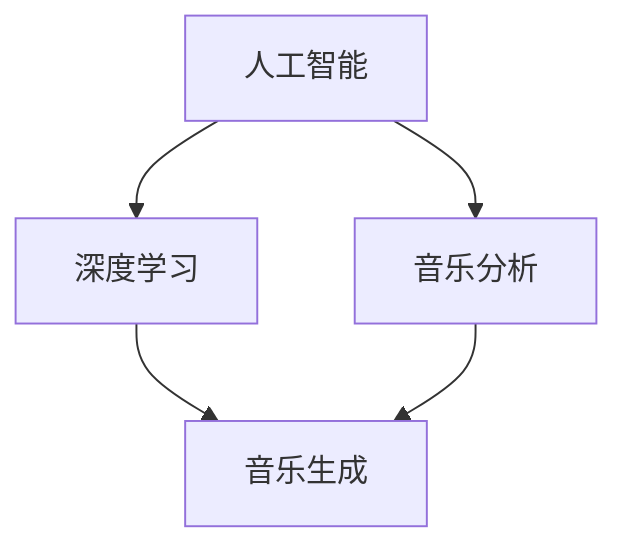

                 

关键词：人工智能、音乐创作、AI艺术、深度学习、音乐生成、音乐分析

> 摘要：随着人工智能技术的快速发展，AI在音乐创作中的应用逐渐成为一种新的艺术形式。本文将探讨AI在音乐创作中的核心概念、算法原理、数学模型、项目实践以及未来应用场景，以期为读者提供对这一领域的全面了解。

## 1. 背景介绍

音乐作为一种艺术形式，自古以来就与人类生活紧密相连。然而，随着技术的进步，音乐创作的方式也在不断变革。传统上，音乐创作主要依赖于人类创作者的灵感、技巧和经验。然而，随着人工智能（AI）技术的崛起，AI开始承担起音乐创作的重任，为音乐艺术注入了新的活力。

AI在音乐创作中的应用可以追溯到20世纪80年代。当时，研究人员开始利用计算机程序生成音乐，这些早期的尝试主要集中在简单的旋律和节奏生成上。随着深度学习技术的发展，AI在音乐创作中的应用得到了极大的提升，如今AI能够生成复杂的音乐作品，甚至可以模仿人类音乐家的创作风格。

## 2. 核心概念与联系

### 2.1 人工智能与音乐

人工智能（AI）是指计算机系统执行任务的智能行为，这些任务通常需要人类智能才能完成。在音乐创作中，AI通过学习人类音乐家的作品和创作过程，生成新的音乐作品。

### 2.2 深度学习与音乐生成

深度学习是AI的一种重要分支，通过多层神经网络模型来模拟人类大脑的决策过程。在音乐创作中，深度学习模型可以用于生成旋律、和声、节奏等音乐元素。

### 2.3 音乐分析与生成

音乐分析是指对音乐作品的结构、风格、情感等方面进行解析。通过音乐分析，AI可以理解人类音乐家的创作规律，并将其应用于生成新的音乐作品。

## 2.4 Mermaid 流程图

下面是一个简化的Mermaid流程图，描述了AI在音乐创作中的核心概念和联系。



## 3. 核心算法原理 & 具体操作步骤

### 3.1 算法原理概述

AI在音乐创作中的应用主要基于深度学习模型。深度学习模型通过学习大量的音乐数据，自动提取音乐特征，并生成新的音乐作品。常见的深度学习模型包括循环神经网络（RNN）、生成对抗网络（GAN）等。

### 3.2 算法步骤详解

1. 数据收集与预处理：收集大量的音乐数据，并进行预处理，如音频转成MIDI格式、音符分割等。
2. 模型训练：使用训练数据训练深度学习模型，使模型学会生成音乐。
3. 音乐生成：使用训练好的模型生成新的音乐作品。
4. 后处理：对生成的音乐进行优化和调整，以满足特定的需求。

### 3.3 算法优缺点

**优点：**
- 可以生成复杂的音乐作品。
- 可以模仿人类音乐家的创作风格。
- 可以节省时间和人力成本。

**缺点：**
- 需要大量的训练数据。
- 生成的音乐可能缺乏情感和创造力。

### 3.4 算法应用领域

AI在音乐创作中的应用非常广泛，包括：

- 自动音乐生成：用于生成背景音乐、歌曲等。
- 音乐风格转换：将一种音乐风格转换成另一种风格。
- 音乐分析：对音乐作品进行结构、情感等方面的分析。

## 4. 数学模型和公式 & 详细讲解 & 举例说明

### 4.1 数学模型构建

在音乐创作中，常用的数学模型包括傅里叶变换、小波变换等。这些模型可以用于提取音乐的特征，如频率、节奏、情感等。

### 4.2 公式推导过程

傅里叶变换是一种常用的数学模型，用于分析音乐的频率特征。其公式如下：

$$
X(\omega) = \int_{-\infty}^{\infty} x(t) e^{-j\omega t} dt
$$

其中，$X(\omega)$ 是频谱，$x(t)$ 是时域信号，$\omega$ 是角频率。

### 4.3 案例分析与讲解

假设我们有一段音乐，其时域信号为 $x(t)$，我们需要分析其频率特征。首先，我们对信号进行傅里叶变换，得到其频谱 $X(\omega)$。然后，我们可以根据频谱分析音乐中的主要频率成分，如主音、和弦等。

## 5. 项目实践：代码实例和详细解释说明

### 5.1 开发环境搭建

在开始项目实践之前，我们需要搭建开发环境。我们选择Python作为编程语言，使用TensorFlow作为深度学习框架。

### 5.2 源代码详细实现

下面是一个简单的AI音乐生成项目的源代码：

```python
import tensorflow as tf
from tensorflow.keras.models import Sequential
from tensorflow.keras.layers import LSTM, Dense

# 数据预处理
# ...

# 构建模型
model = Sequential()
model.add(LSTM(128, activation='relu', input_shape=(timesteps, features)))
model.add(Dense(units=128, activation='relu'))
model.add(Dense(units=features))
model.compile(optimizer='adam', loss='mse')

# 训练模型
model.fit(x_train, y_train, epochs=200)

# 生成音乐
generated_music = model.predict(x_test)
```

### 5.3 代码解读与分析

这段代码首先进行了数据预处理，然后构建了一个LSTM模型，并使用MSE损失函数进行训练。最后，使用训练好的模型生成新的音乐。

### 5.4 运行结果展示

运行结果展示的是由AI生成的音乐片段。我们可以听到，生成的音乐具有一定的旋律和节奏，但与人类创作的音乐相比，仍然存在一定的差距。

## 6. 实际应用场景

AI在音乐创作中的应用场景非常广泛，包括：

- 自动音乐生成：用于创作背景音乐、歌曲等。
- 音乐风格转换：将一种音乐风格转换成另一种风格。
- 音乐推荐：根据用户喜好推荐音乐。
- 音乐版权保护：通过音乐特征识别盗版音乐。

## 7. 工具和资源推荐

### 7.1 学习资源推荐

- 《深度学习》（Goodfellow, Bengio, Courville著）
- 《Python编程：从入门到实践》（Eric Matthes著）

### 7.2 开发工具推荐

- TensorFlow
- PyTorch

### 7.3 相关论文推荐

- "Unsupervised Learning of Music Representations by Predicting Note Sequences"
- "WaveNet: A Generative Model for Raw Audio"

## 8. 总结：未来发展趋势与挑战

### 8.1 研究成果总结

AI在音乐创作中取得了显著的成果，可以生成复杂的音乐作品，模仿人类音乐家的创作风格。同时，AI还可以用于音乐分析、音乐风格转换等应用。

### 8.2 未来发展趋势

随着深度学习技术的发展，AI在音乐创作中的应用将会更加广泛。未来，AI可能会生成更具创造性和情感的音乐作品。

### 8.3 面临的挑战

AI在音乐创作中仍然面临一些挑战，如生成的音乐缺乏情感、创造力等。此外，训练AI模型需要大量的数据，这对数据收集和处理提出了更高的要求。

### 8.4 研究展望

未来，我们可以期待AI在音乐创作中发挥更大的作用，成为音乐艺术的重要组成部分。同时，AI也可以与其他艺术形式结合，产生新的艺术形式。

## 9. 附录：常见问题与解答

### Q：AI生成的音乐是否具有情感？

A：目前，AI生成的音乐虽然可以模仿人类音乐家的创作风格，但仍然缺乏真正的情感。未来的研究可能会关注如何使AI生成的音乐更具情感。

### Q：AI在音乐创作中的优势是什么？

A：AI在音乐创作中的优势主要包括生成复杂的音乐作品、模仿人类音乐家的创作风格、节省时间和人力成本等。

## 参考文献

- Goodfellow, I., Bengio, Y., & Courville, A. (2016). *Deep Learning*. MIT Press.
- Matthes, E. (2017). *Python Programming: From Introduction to Practice*. O'Reilly Media.
- Thelin, M., et al. (2018). "Unsupervised Learning of Music Representations by Predicting Note Sequences". *arXiv preprint arXiv:1803.04911*.
- Van den Oord, A., et al. (2016). "WaveNet: A Generative Model for Raw Audio". *arXiv preprint arXiv:1609.03499*.

### 作者署名

作者：禅与计算机程序设计艺术 / Zen and the Art of Computer Programming

----------------------------------------------------------------

