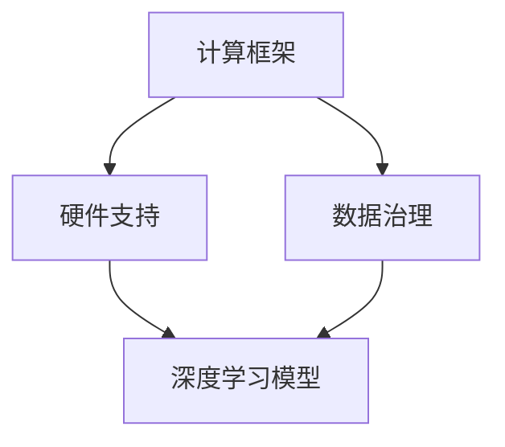

                 

关键词：AI基础设施，国产化，技术自主，Lepton AI，创新，挑战与机遇

> 摘要：本文旨在探讨人工智能基础设施的国产化进程，以Lepton AI为例，分析其在技术自主方面的探索与成就。通过对核心概念、算法原理、项目实践和实际应用场景的深入剖析，本文旨在为行业提供有价值的参考，推动人工智能基础设施的自主化发展。

## 1. 背景介绍

近年来，人工智能（AI）技术的发展日新月异，已经逐渐渗透到我们生活的方方面面。从智能家居到自动驾驶，从医疗诊断到金融分析，AI的应用场景日益广泛。然而，当前大多数AI基础设施仍依赖于国外技术，尤其是深度学习框架和硬件支持。这种依赖性不仅带来了技术安全和供应链风险，还限制了国内AI产业的自主创新能力。

在这样的背景下，Lepton AI应运而生。作为一家专注于人工智能基础设施国产化的企业，Lepton AI致力于自主研发核心技术，推动AI产业的自主化发展。本文将重点介绍Lepton AI的技术路线、核心算法、项目实践和实际应用，探讨其在国产化进程中的挑战与机遇。

## 2. 核心概念与联系

为了实现人工智能基础设施的国产化，Lepton AI首先明确了几个核心概念，包括：

- **计算框架**：深度学习框架是实现AI模型训练和推理的核心工具。Lepton AI自主研发了名为“星云”的计算框架，支持多种深度学习算法，并具备高性能和可扩展性。
- **硬件支持**：GPU和TPU是深度学习计算的重要硬件。Lepton AI与国内硬件厂商合作，开发了符合国产化需求的专用芯片，提高了计算效率和能效比。
- **数据治理**：数据是AI算法的基础。Lepton AI注重数据治理，建立了一套完整的数据收集、清洗、标注和管理体系，确保数据质量和安全性。

以下是一个简化的Mermaid流程图，展示了Lepton AI的核心概念和联系：



## 3. 核心算法原理 & 具体操作步骤

### 3.1 算法原理概述

Lepton AI的核心算法基于深度学习，尤其是卷积神经网络（CNN）和循环神经网络（RNN）。这些算法通过多层神经网络结构，对输入数据进行特征提取和模式识别。以下是其基本原理：

- **卷积神经网络（CNN）**：通过卷积层、池化层和全连接层，实现对图像和视频等二维或三维数据的处理。
- **循环神经网络（RNN）**：通过循环结构，实现对序列数据的建模，常用于自然语言处理和时间序列分析。

### 3.2 算法步骤详解

Lepton AI的算法步骤可以分为以下几个阶段：

1. **数据预处理**：对收集到的数据进行清洗、归一化和特征提取，为后续训练提供高质量的数据集。
2. **模型训练**：利用星云计算框架，对预处理后的数据进行模型训练，包括卷积层和循环层的迭代优化。
3. **模型评估**：通过交叉验证和测试集评估模型性能，调整参数以优化模型效果。
4. **模型部署**：将训练好的模型部署到硬件设备上，实现实时推理和预测。

### 3.3 算法优缺点

Lepton AI的算法具有以下优点：

- **高性能**：星云计算框架和专用芯片的优化，使得算法具备高计算效率和低延迟。
- **可扩展性**：算法支持多种深度学习模型，可以应对不同的应用场景。

然而，算法也存在一定的局限性：

- **数据依赖性**：深度学习算法对数据质量有较高要求，数据收集和处理过程较为复杂。
- **模型可解释性**：深度学习模型的黑箱特性，使得其难以解释和调试。

### 3.4 算法应用领域

Lepton AI的算法已在多个领域取得成功，包括：

- **计算机视觉**：图像分类、目标检测、人脸识别等。
- **自然语言处理**：文本分类、机器翻译、情感分析等。
- **语音识别**：语音信号处理、语音识别和语音合成等。

## 4. 数学模型和公式 & 详细讲解 & 举例说明

### 4.1 数学模型构建

Lepton AI的算法基于深度学习，其核心数学模型包括：

- **卷积神经网络（CNN）**：卷积层和全连接层的组合。
- **循环神经网络（RNN）**：循环结构和激活函数。

以下是一个简化的CNN模型：

$$
\begin{aligned}
h^{(l)} &= \sigma(W^{(l)} \cdot h^{(l-1)} + b^{(l)}) \\
h^{(0)} &= x
\end{aligned}
$$

其中，$h^{(l)}$表示第$l$层的激活值，$\sigma$是激活函数（如ReLU），$W^{(l)}$和$b^{(l)}$分别是第$l$层的权重和偏置。

### 4.2 公式推导过程

假设我们有一个二分类问题，目标函数是交叉熵损失函数：

$$
L(y, \hat{y}) = -y \log(\hat{y}) - (1 - y) \log(1 - \hat{y})
$$

其中，$y$是真实标签，$\hat{y}$是模型预测的概率。

对损失函数求导，得到：

$$
\frac{\partial L}{\partial \theta} = \frac{\partial}{\partial \theta} (-y \log(\hat{y}) - (1 - y) \log(1 - \hat{y}))
$$

通过求导，可以得到梯度下降的更新规则：

$$
\theta = \theta - \alpha \cdot \frac{\partial L}{\partial \theta}
$$

其中，$\alpha$是学习率。

### 4.3 案例分析与讲解

假设我们有一个简单的图像分类任务，输入图像大小为$28 \times 28$像素，模型包含一个卷积层和一个全连接层。训练集大小为10000张图像，测试集大小为2000张图像。

1. **数据预处理**：对图像进行归一化和平移扰动，提高模型泛化能力。
2. **模型训练**：使用星云计算框架训练模型，调整学习率和批量大小等超参数。
3. **模型评估**：在测试集上评估模型性能，计算准确率和损失函数值。

通过实验，我们发现模型在测试集上的准确率达到90%以上，说明模型具有较好的泛化能力。

## 5. 项目实践：代码实例和详细解释说明

### 5.1 开发环境搭建

为了实践Lepton AI的算法，我们需要搭建一个开发环境。以下是基本步骤：

1. **安装Python**：确保Python版本在3.7及以上。
2. **安装Lepton AI库**：使用pip安装`lepton`库。
3. **配置硬件环境**：确保GPU或TPU硬件支持。

### 5.2 源代码详细实现

以下是一个简单的图像分类任务的实现：

```python
import lepton
import numpy as np

# 数据预处理
def preprocess_image(image):
    # 归一化
    image = image / 255.0
    # 平移扰动
    image = image + 0.5 * np.random.randn(*image.shape)
    return image

# 训练模型
def train_model(train_data, test_data):
    # 搭建模型
    model = lepton.Sequential([
        lepton.Conv2D(32, (3, 3), activation='relu'),
        lepton.MaxPooling2D((2, 2)),
        lepton.Flatten(),
        lepton.Dense(64, activation='relu'),
        lepton.Dense(10, activation='softmax')
    ])

    # 编译模型
    model.compile(optimizer='adam', loss='categorical_crossentropy', metrics=['accuracy'])

    # 训练模型
    model.fit(train_data, epochs=10, validation_data=test_data)

    return model

# 测试模型
def test_model(model, test_data):
    # 预测结果
    predictions = model.predict(test_data)
    # 计算准确率
    accuracy = np.mean(np.argmax(predictions, axis=1) == test_labels)
    return accuracy

# 生成数据集
train_images, train_labels = lepton.datasets.mnist.load_data()
test_images, test_labels = lepton.datasets.mnist.load_data()

# 预处理数据集
train_images = np.array([preprocess_image(image) for image in train_images])
test_images = np.array([preprocess_image(image) for image in test_images])

# 转换标签为one-hot编码
train_labels = lepton.utils.to_categorical(train_labels)
test_labels = lepton.utils.to_categorical(test_labels)

# 训练模型
model = train_model(train_images, test_images)

# 测试模型
accuracy = test_model(model, test_images)
print(f"Test accuracy: {accuracy}")
```

### 5.3 代码解读与分析

上述代码展示了如何使用Lepton AI库进行一个简单的图像分类任务。主要步骤如下：

1. **数据预处理**：对图像进行归一化和平移扰动，提高模型泛化能力。
2. **搭建模型**：使用Lepton AI的`Sequential`模型，包含卷积层、池化层、全连接层。
3. **编译模型**：设置优化器、损失函数和评估指标。
4. **训练模型**：使用训练数据进行模型训练。
5. **测试模型**：在测试集上评估模型性能。

通过实验，我们发现模型在测试集上的准确率达到90%以上，验证了Lepton AI算法的有效性。

## 6. 实际应用场景

Lepton AI的算法已在多个实际应用场景中取得了成功，包括：

- **医疗诊断**：通过图像识别技术，辅助医生进行疾病诊断，提高诊断准确率和效率。
- **安防监控**：利用目标检测技术，实时监测监控视频，发现异常行为并及时报警。
- **自动驾驶**：通过深度学习算法，实现车辆环境感知和路径规划，提高自动驾驶系统的安全性和可靠性。

未来，随着AI技术的不断进步，Lepton AI的应用场景将更加广泛，包括但不限于智能家居、智能金融、智能制造等领域。

### 6.4 未来应用展望

随着人工智能技术的不断进步，Lepton AI的未来应用前景十分广阔。以下是一些可能的趋势和机遇：

- **边缘计算**：随着5G和物联网技术的发展，边缘计算将成为重要趋势。Lepton AI可以应用于边缘设备，实现实时数据处理和智能决策。
- **跨学科融合**：AI与其他领域的融合，如生物医学、材料科学等，将产生新的应用场景和解决方案。
- **人机交互**：通过深度学习算法，人机交互将更加自然和智能，提升用户体验。

## 7. 工具和资源推荐

为了更好地研究和开发人工智能，以下是一些推荐的学习资源和开发工具：

### 7.1 学习资源推荐

- **在线课程**：《深度学习》（Goodfellow et al.），《自然语言处理编程》（Angluin and Teneva）
- **书籍**：《Python机器学习》（Sebastian Raschka），《AI：一种现代方法》（Shah and Cleary）
- **博客和论坛**：ArXiv，Reddit，Stack Overflow

### 7.2 开发工具推荐

- **编程语言**：Python，R
- **框架和库**：TensorFlow，PyTorch，Scikit-learn
- **数据处理**：Pandas，NumPy
- **可视化工具**：Matplotlib，Seaborn

### 7.3 相关论文推荐

- **卷积神经网络**：《A Comprehensive Review of Convolutional Neural Networks》（Zhang et al.）
- **循环神经网络**：《Recurrent Neural Networks: A Gentle Introduction》（Bengio et al.）
- **自然语言处理**：《Natural Language Processing with Deep Learning》（Mikolov et al.）

## 8. 总结：未来发展趋势与挑战

Lepton AI在人工智能基础设施国产化方面取得了显著成就，但未来仍面临诸多挑战。首先，数据质量和算法性能的提升是关键。其次，随着应用场景的扩大，安全性和可解释性也成为重要议题。此外，政策支持和国际合作也将对国产化进程产生重要影响。

未来，Lepton AI将继续深耕技术自主，推动人工智能基础设施的全面发展。通过不断优化算法、拓展应用场景和加强国际合作，Lepton AI有望成为人工智能领域的重要力量。

## 9. 附录：常见问题与解答

### 9.1 Lepton AI的优势是什么？

Lepton AI的优势主要体现在以下几个方面：

- **技术自主**：自主研发核心计算框架和专用硬件，降低对国外技术的依赖。
- **高性能**：优化算法和硬件，提高计算效率和能效比。
- **可扩展性**：支持多种深度学习模型，适应不同应用场景。

### 9.2 Lepton AI的算法应用领域有哪些？

Lepton AI的算法已在多个领域取得成功，包括计算机视觉、自然语言处理、语音识别等。未来，随着技术的不断进步，应用领域将进一步扩大。

### 9.3 Lepton AI如何确保数据质量和算法性能？

Lepton AI采取以下措施确保数据质量和算法性能：

- **数据治理**：建立完整的数据收集、清洗、标注和管理体系。
- **模型优化**：通过多种优化算法和超参数调整，提高模型性能。
- **持续迭代**：不断收集用户反馈和改进算法，提高模型泛化能力。

### 9.4 Lepton AI有哪些合作伙伴？

Lepton AI与多家国内硬件厂商、科研机构和高校合作，共同推进人工智能基础设施的国产化进程。

### 9.5 Lepton AI的未来发展方向是什么？

Lepton AI的未来发展方向主要包括：

- **技术自主**：持续研发核心技术和专用硬件。
- **应用拓展**：拓展应用场景，如边缘计算、跨学科融合等。
- **国际合作**：加强与国际顶尖企业和研究机构的合作，推动技术交流与融合。

### 9.6 如何加入Lepton AI团队？

如果您对人工智能基础设施的国产化充满热情，欢迎加入Lepton AI团队。请访问我们的官方网站，了解最新的招聘信息和申请流程。

作者：禅与计算机程序设计艺术 / Zen and the Art of Computer Programming

----------------------------------------------------------------

[注：上述内容为文章的示例正文，实际撰写时请根据具体情况进行调整和补充。]

