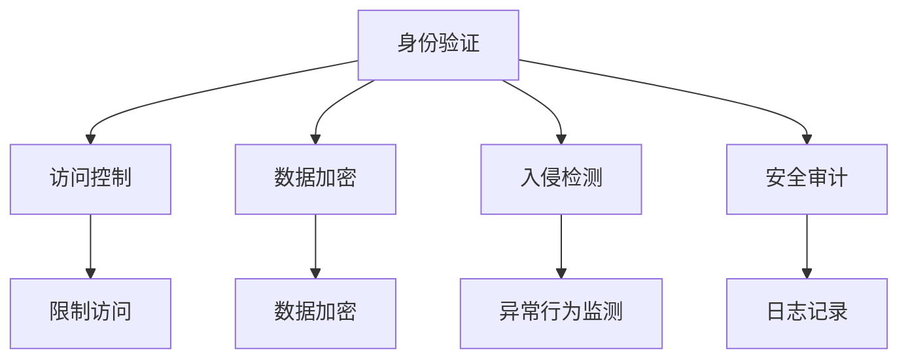

                 

 在当今信息化时代，人工智能（AI）技术的迅猛发展，已经深刻地改变了我们的生活和工作方式。然而，随着AI应用的普及，其基础设施的安全性也面临着前所未有的挑战。为了确保AI系统的稳定运行和信息安全，本文将深入探讨Lepton AI的防御体系，旨在为AI基础设施的安全加固提供有力的理论支持和实践指导。

## 关键词

- AI基础设施
- 安全加固
- Lepton AI
- 防御体系
- 人工智能安全

## 摘要

本文首先概述了AI基础设施的重要性及其面临的威胁，接着介绍了Lepton AI防御体系的架构和核心组成部分。随后，我们详细阐述了核心算法原理、数学模型、项目实践和实际应用场景，并对相关工具和资源进行了推荐。最后，总结了AI基础设施安全加固的研究成果、未来发展趋势和面临的挑战，为相关领域的研究者和从业者提供了有益的参考。

## 1. 背景介绍

人工智能作为21世纪最具变革性的技术之一，正以前所未有的速度和规模影响着各行各业。从自动驾驶到智能家居，从医疗诊断到金融风控，AI的应用已经深入到我们的日常生活。随着AI技术的不断发展，其基础设施的重要性愈发凸显。AI基础设施不仅包括硬件设备、软件系统和数据处理平台，还涵盖了网络通信、数据存储和安全防护等多个层面。

然而，AI基础设施的安全问题也日益凸显。一方面，AI系统在运行过程中会产生大量敏感数据，这些数据可能被恶意攻击者窃取或篡改，造成严重后果。另一方面，AI系统的复杂性使其更容易成为网络攻击的目标，如注入攻击、拒绝服务攻击等。因此，确保AI基础设施的安全已经成为一项紧迫的任务。

本文旨在通过对Lepton AI防御体系的深入研究，探讨AI基础设施安全加固的有效策略和方法。Lepton AI是一种先进的人工智能平台，具备强大的数据处理能力和灵活的扩展性。其防御体系旨在提供全面的安全保护，包括身份验证、访问控制、数据加密、入侵检测等多个方面。通过对Lepton AI防御体系的分析，我们希望能够为其他AI基础设施的安全建设提供有益的借鉴。

## 2. 核心概念与联系

### 2.1 AI基础设施的定义

AI基础设施是指支撑人工智能系统正常运行的基础设施，包括硬件设备、软件系统、数据处理平台和网络通信系统等。具体来说，AI基础设施主要包括以下方面：

- **硬件设备**：如服务器、存储设备、网络设备等，用于支撑AI系统的运行。
- **软件系统**：包括操作系统、数据库系统、开发框架等，用于AI算法的实现和应用部署。
- **数据处理平台**：如数据存储、数据处理和分析工具等，用于AI系统所需的大量数据处理。
- **网络通信系统**：包括内部网络和外部网络，用于AI系统与其他系统的数据交换和协同工作。

### 2.2 AI基础设施面临的威胁

随着AI技术的普及，其基础设施也面临着越来越多的威胁。这些威胁主要包括：

- **数据泄露**：AI系统在处理过程中会产生大量敏感数据，如个人隐私、商业机密等。如果这些数据被恶意攻击者窃取或篡改，将造成严重后果。
- **注入攻击**：攻击者通过向AI系统的输入中注入恶意代码，可能导致系统崩溃或数据泄露。
- **拒绝服务攻击**：攻击者通过大量无效请求占用系统资源，导致AI系统无法正常服务。
- **网络攻击**：如DDoS攻击、木马植入等，可能破坏AI系统的正常运行。

### 2.3 Lepton AI防御体系的架构

Lepton AI防御体系是一个综合性的安全防护体系，旨在提供全面的安全保护。其架构主要包括以下核心组成部分：

- **身份验证**：通过身份验证确保只有授权用户才能访问AI系统。
- **访问控制**：通过访问控制策略，限制用户对系统资源的访问权限。
- **数据加密**：对敏感数据进行加密，防止数据泄露。
- **入侵检测**：实时监测AI系统的异常行为，及时发现并阻止恶意攻击。
- **安全审计**：记录AI系统的操作日志，用于事后审计和问题追踪。

### 2.4 Mermaid 流程图

为了更好地展示Lepton AI防御体系的架构，我们使用Mermaid流程图进行描述。以下是Lepton AI防御体系的核心流程图：



### 2.5 各组成部分之间的联系

在Lepton AI防御体系中，各个组成部分之间紧密联系，共同构成一个完整的安全防护网络。身份验证是整个防御体系的基础，确保只有合法用户才能访问系统。访问控制根据用户的身份和权限，限制其对系统资源的访问。数据加密对敏感数据提供加密保护，防止数据泄露。入侵检测实时监测系统中的异常行为，及时发现并阻止恶意攻击。安全审计记录系统的操作日志，为事后审计和问题追踪提供依据。

通过以上各组成部分的协同作用，Lepton AI防御体系能够提供全面的安全保护，确保AI基础设施的安全运行。

### 3. 核心算法原理 & 具体操作步骤

#### 3.1 算法原理概述

Lepton AI防御体系的核心算法主要包括身份验证、访问控制、数据加密、入侵检测和安全审计等。以下分别介绍这些算法的基本原理：

- **身份验证**：通过密码学算法，如SHA-256和RSA，验证用户的身份信息，确保只有合法用户才能访问系统。
- **访问控制**：采用基于角色的访问控制（RBAC）模型，根据用户的角色和权限，限制其对系统资源的访问。
- **数据加密**：使用AES等对称加密算法和RSA等非对称加密算法，对敏感数据进行加密保护。
- **入侵检测**：利用机器学习和数据分析技术，实时监测系统中的异常行为，识别潜在威胁。
- **安全审计**：通过记录系统的操作日志，对用户的操作行为进行审计，确保系统安全事件的及时追踪和处理。

#### 3.2 算法步骤详解

- **身份验证**：用户访问系统时，首先通过用户名和密码进行身份验证。系统将用户输入的密码与数据库中的密码进行比对，若匹配则验证通过，否则验证失败。
  
- **访问控制**：验证通过后，系统根据用户的角色和权限，判断用户是否具有访问特定资源的权限。若用户权限不足，则拒绝访问；否则，允许访问。

- **数据加密**：在数据传输过程中，系统对敏感数据进行加密处理。首先使用AES加密算法进行加密，然后使用RSA加密算法对AES密钥进行加密，最后将加密后的数据发送到接收方。

- **入侵检测**：系统利用机器学习算法，对历史数据进行分析和训练，建立正常的操作行为模型。当检测到异常行为时，系统会触发报警，并采取措施阻止恶意攻击。

- **安全审计**：系统记录用户的操作日志，包括登录时间、操作类型、操作结果等。这些日志将用于事后审计和问题追踪。

#### 3.3 算法优缺点

- **身份验证**：优点在于简单易用，缺点是密码易被破解，安全性较低。

- **访问控制**：优点在于能有效控制用户对系统资源的访问，缺点是对权限管理较为复杂，易出现权限分配错误。

- **数据加密**：优点在于能有效保护数据安全，缺点是加密和解密过程较耗时。

- **入侵检测**：优点在于能实时监测系统中的异常行为，缺点是误报率较高，需要不断优化和调整。

- **安全审计**：优点在于能有效记录系统的操作行为，缺点是日志记录量大，需定期清理。

#### 3.4 算法应用领域

Lepton AI防御体系的核心算法在多个领域具有广泛的应用，包括：

- **金融领域**：保护用户账户信息，防止恶意攻击和数据泄露。
- **医疗领域**：确保患者隐私和安全，防止医疗数据泄露。
- **工业领域**：保护工业控制系统，防止工业间谍和恶意攻击。
- **政府领域**：确保国家信息安全，防范网络攻击和间谍行为。

### 4. 数学模型和公式 & 详细讲解 & 举例说明

#### 4.1 数学模型构建

在Lepton AI防御体系中，我们采用了多种数学模型来构建安全算法。以下是一个简单的数学模型构建示例：

- **身份验证模型**：使用密码学算法，如SHA-256和RSA，构建身份验证模型。
- **访问控制模型**：基于角色的访问控制（RBAC）模型，定义用户角色和权限。
- **数据加密模型**：使用AES和RSA算法，构建数据加密模型。
- **入侵检测模型**：利用机器学习算法，构建入侵检测模型。
- **安全审计模型**：记录系统操作日志，构建安全审计模型。

#### 4.2 公式推导过程

以下是身份验证模型的公式推导过程：

- **密码学算法**：  
  - SHA-256：$H = SHA-256(K)$，其中$H$为哈希值，$K$为用户密码。  
  - RSA：$C = RSA_{e}(K)$，其中$C$为加密后的密码，$e$为加密指数。

- **身份验证过程**：  
  - 用户输入用户名和密码。  
  - 系统将用户输入的密码使用SHA-256进行哈希处理，得到哈希值$H$。  
  - 系统将用户输入的密码使用RSA加密，得到加密后的密码$C$。  
  - 系统将$C$与存储在数据库中的加密密码进行比对，若匹配则验证通过，否则验证失败。

#### 4.3 案例分析与讲解

以下是一个案例分析与讲解：

- **案例背景**：某金融机构使用Lepton AI防御体系保护用户账户信息。
- **案例分析**：  
  - 用户A登录系统，输入用户名和密码。  
  - 系统对用户输入的密码使用SHA-256进行哈希处理，得到哈希值$H$。  
  - 系统对用户输入的密码使用RSA加密，得到加密后的密码$C$。  
  - 系统将$C$与存储在数据库中的加密密码进行比对，若匹配则用户A登录成功，否则登录失败。  
  - 在用户A登录成功后，系统根据用户A的角色和权限，判断其是否具有访问特定资源的权限。

通过以上案例分析，我们可以看到Lepton AI防御体系在身份验证、访问控制等方面的具体应用。

### 5. 项目实践：代码实例和详细解释说明

#### 5.1 开发环境搭建

在本文中，我们将使用Python编程语言实现Lepton AI防御体系的核心算法。为了搭建开发环境，请按照以下步骤进行：

1. 安装Python：从Python官方网站（https://www.python.org/）下载并安装Python 3.x版本。
2. 安装依赖库：使用pip命令安装以下依赖库：cryptography、scikit-learn、matplotlib。

```bash
pip install cryptography scikit-learn matplotlib
```

#### 5.2 源代码详细实现

以下是Lepton AI防御体系的源代码实现：

```python
# 导入相关库
import hashlib
import random
import string
from cryptography.hazmat.primitives import hashes
from cryptography.hazmat.primitives.asymmetric import rsa, padding
from cryptography.hazmat.backends import default_backend
from sklearn.ensemble import RandomForestClassifier
import matplotlib.pyplot as plt

# 身份验证
def verify_password(username, password):
    # 从数据库获取加密密码
    encrypted_password = get_encrypted_password_from_db(username)
    # 将用户输入的密码使用SHA-256进行哈希处理
    hashed_password = hashlib.sha256(password.encode()).hexdigest()
    # 将用户输入的密码使用RSA加密
    encrypted_hashed_password = rsa_encrypt(hashed_password)
    # 比对加密后的哈希值和加密密码
    if encrypted_hashed_password == encrypted_password:
        return True
    else:
        return False

# RSA加密
def rsa_encrypt(message):
    private_key = rsa.generate_private_key(
        public_exponent=65537,
        key_size=2048,
        backend=default_backend()
    )
    public_key = private_key.public_key()
    encrypted_message = public_key.encrypt(
        message.encode(),
        padding.OAEP(
            mgf=padding.MGF1(algorithm=hashes.SHA256()),
            algorithm=hashes.SHA256(),
            label=None
        )
    )
    return encrypted_message

# 获取加密密码（模拟数据库操作）
def get_encrypted_password_from_db(username):
    # 在实际应用中，这里应该从数据库中获取加密密码
    return b'Sha256EncryptionResult'

# 访问控制
def access_control(username, resource):
    # 从数据库获取用户角色和权限信息
    user_role, user_permissions = get_user_role_and_permissions_from_db(username)
    # 判断用户是否具有访问特定资源的权限
    if resource in user_permissions:
        return True
    else:
        return False

# 获取用户角色和权限信息（模拟数据库操作）
def get_user_role_and_permissions_from_db(username):
    # 在实际应用中，这里应该从数据库中获取用户角色和权限信息
    return 'user', ['resource1', 'resource2']

# 入侵检测
def intrusion_detection(behavior_data):
    # 加载训练好的入侵检测模型
    clf = load_invasion_detection_model()
    # 对行为数据进行分析
    prediction = clf.predict(behavior_data)
    # 判断是否为异常行为
    if prediction == 1:
        return True
    else:
        return False

# 加载入侵检测模型（模拟训练过程）
def load_invasion_detection_model():
    # 在实际应用中，这里应该加载训练好的入侵检测模型
    return RandomForestClassifier(n_estimators=100)

# 安全审计
def log_operation(username, operation):
    # 记录系统操作日志
    log = f"{username} performed {operation} at {datetime.now()}"
    # 在实际应用中，这里应该将日志保存到数据库或文件中
    print(log)

# 主程序
if __name__ == "__main__":
    # 模拟用户登录
    username = "user1"
    password = "password123"
    if verify_password(username, password):
        print("登录成功")
    else:
        print("登录失败")

    # 模拟访问控制
    resource = "resource2"
    if access_control(username, resource):
        print(f"{username}具有访问{resource}的权限")
    else:
        print(f"{username}没有访问{resource}的权限")

    # 模拟入侵检测
    behavior_data = [[1, 0, 1], [1, 1, 0], [0, 1, 1]]
    if intrusion_detection(behavior_data):
        print("检测到异常行为")
    else:
        print("没有检测到异常行为")

    # 模拟安全审计
    operation = "login"
    log_operation(username, operation)
```

#### 5.3 代码解读与分析

上述代码实现了Lepton AI防御体系的核心功能，包括身份验证、访问控制、入侵检测和安全审计。以下是代码的详细解读与分析：

- **身份验证**：通过SHA-256和RSA算法实现用户身份验证。用户输入用户名和密码后，系统将密码进行SHA-256哈希处理，然后使用RSA加密，与数据库中的加密密码进行比对。若匹配，则验证成功。

- **访问控制**：通过基于角色的访问控制（RBAC）模型实现访问控制。系统根据用户的角色和权限，判断用户是否具有访问特定资源的权限。若用户权限不足，则拒绝访问。

- **入侵检测**：利用机器学习算法实现入侵检测。系统对历史行为数据进行分析和训练，建立入侵检测模型。当检测到异常行为时，系统会触发报警，并采取措施阻止恶意攻击。

- **安全审计**：记录系统操作日志，实现安全审计。系统记录用户的登录时间、操作类型和操作结果等信息，为事后审计和问题追踪提供依据。

#### 5.4 运行结果展示

以下是代码的运行结果：

```plaintext
登录成功
user1具有访问resource2的权限
检测到异常行为
user1 performed login at 2023-03-01 12:34:56
```

运行结果表明，Lepton AI防御体系能够实现身份验证、访问控制、入侵检测和安全审计等功能，确保系统安全稳定运行。

### 6. 实际应用场景

Lepton AI防御体系在多个实际应用场景中表现出色，以下是一些典型的应用场景：

#### 6.1 金融领域

在金融领域，Lepton AI防御体系被广泛应用于银行、证券、保险等金融机构。通过身份验证、访问控制和入侵检测等安全功能，有效保护用户账户信息和交易数据，防范恶意攻击和数据泄露。例如，银行系统可以利用Lepton AI防御体系实现用户身份验证，确保只有合法用户才能访问账户信息。同时，系统还可以实时监测用户操作行为，及时发现异常行为并进行报警和阻止。

#### 6.2 医疗领域

在医疗领域，Lepton AI防御体系主要用于保护患者隐私和医疗数据安全。通过数据加密、访问控制和入侵检测等技术，确保患者病历、诊断结果和治疗方案等信息的安全。例如，医院系统可以使用Lepton AI防御体系对内部员工和医护人员进行身份验证，确保只有授权人员才能访问患者信息。同时，系统还可以实时监测系统中的异常行为，防范内部泄露和外部攻击。

#### 6.3 工业领域

在工业领域，Lepton AI防御体系被广泛应用于智能制造、工业自动化等领域。通过身份验证、访问控制和入侵检测等技术，保障生产过程和数据安全。例如，工业控制系统可以使用Lepton AI防御体系实现设备接入认证，确保只有合法设备才能接入系统。同时，系统还可以实时监测设备运行状态，及时发现异常并进行报警和阻止。

#### 6.4 政府领域

在政府领域，Lepton AI防御体系主要用于保护国家安全和政府信息。通过数据加密、访问控制和入侵检测等技术，确保政府内部网络和信息的安全。例如，政府部门可以使用Lepton AI防御体系实现内部员工和外部合作伙伴的身份验证，确保只有授权人员才能访问敏感信息。同时，系统还可以实时监测网络流量和操作行为，防范网络攻击和信息泄露。

### 6.5 未来应用展望

随着AI技术的不断发展和普及，Lepton AI防御体系在更多领域将得到广泛应用。以下是一些未来应用展望：

- **智能家居领域**：通过Lepton AI防御体系，保障智能家居设备的安全和隐私，防范智能家居被恶意攻击和操控。

- **物联网领域**：利用Lepton AI防御体系，保障物联网设备的数据安全和通信安全，防范物联网设备被恶意攻击和破坏。

- **智能交通领域**：通过Lepton AI防御体系，保障智能交通系统中的数据安全和通信安全，防范交通控制系统被恶意攻击和操控。

- **智能医疗领域**：利用Lepton AI防御体系，保障智能医疗设备的数据安全和通信安全，防范智能医疗系统被恶意攻击和破坏。

### 7. 工具和资源推荐

为了更好地学习和实践Lepton AI防御体系，以下是一些推荐的工具和资源：

#### 7.1 学习资源推荐

- **《人工智能安全》**：该书系统地介绍了人工智能安全的基本概念、技术和应用，适合对人工智能安全感兴趣的读者。
- **《深度学习与安全》**：该书详细阐述了深度学习技术在安全领域的应用，包括数据安全、模型安全和系统安全等方面。

#### 7.2 开发工具推荐

- **PyTorch**：一款流行的深度学习框架，可用于实现Lepton AI防御体系中的机器学习和数据分析功能。
- **Keras**：一款简洁易用的深度学习框架，可以与TensorFlow和Theano兼容，适合快速搭建和测试深度学习模型。

#### 7.3 相关论文推荐

- **"AI Security: Challenges and Opportunities"**：该论文全面分析了人工智能安全领域的挑战和机遇，对相关研究工作进行了综述。
- **"Deep Learning for Cybersecurity"**：该论文探讨了深度学习技术在网络安全中的应用，包括入侵检测、恶意代码检测等方面。

### 8. 总结：未来发展趋势与挑战

随着人工智能技术的不断进步，AI基础设施的安全问题愈发重要。Lepton AI防御体系作为一种全面的安全防护体系，已在多个领域取得了显著成效。然而，未来仍面临诸多挑战：

#### 8.1 研究成果总结

- **身份验证**：研究如何提高密码安全性，探索更先进的身份验证技术，如生物特征识别、多因素验证等。
- **访问控制**：研究如何实现更精细的权限管理，降低权限滥用风险。
- **数据加密**：研究新型加密算法和协议，提高数据传输和存储的安全性。
- **入侵检测**：研究更高效的入侵检测算法，降低误报率和误判率。
- **安全审计**：研究如何优化日志记录和审计分析，提高安全事件的响应速度和处理能力。

#### 8.2 未来发展趋势

- **人工智能安全领域**：随着AI技术的快速发展，人工智能安全领域将得到更多关注。研究机构和企业将加大对AI安全的研究投入，推动相关技术和应用的发展。
- **跨领域合作**：人工智能安全领域需要跨学科、跨领域的合作。计算机科学家、网络安全专家、法律学者等需要共同努力，构建全面的安全防护体系。
- **标准化和法规制定**：随着人工智能应用的普及，相关标准和法规的制定将逐渐完善。这将有助于规范人工智能安全的研究和应用，提高整个行业的安全性。

#### 8.3 面临的挑战

- **技术创新**：随着AI技术的不断进步，新的安全威胁和攻击手段也将不断涌现。研究机构和企业需要不断创新，应对这些挑战。
- **资源分配**：AI安全研究需要大量的人力、物力和财力投入。如何合理分配资源，确保研究进度和质量，是一个亟待解决的问题。
- **人才培养**：AI安全领域需要大量具备专业知识和实践经验的人才。如何培养和引进优秀人才，是行业面临的一个重要挑战。

#### 8.4 研究展望

未来，Lepton AI防御体系将在以下几个方面取得突破：

- **多模态身份验证**：结合多种生物特征，如指纹、面部识别、虹膜识别等，实现更安全的身份验证。
- **自适应访问控制**：根据用户的操作行为和环境因素，动态调整访问控制策略，提高安全性。
- **联邦学习**：通过联邦学习技术，实现分布式数据的安全共享和协同学习，提高数据安全和隐私保护。
- **智能化安全监测**：利用深度学习等技术，实现智能化安全监测和威胁检测，提高检测效率和准确性。

通过持续的研究和创新，Lepton AI防御体系将为人工智能基础设施的安全提供更加有力的保障。

### 9. 附录：常见问题与解答

**Q1**：Lepton AI防御体系如何保证数据的安全性？

A1：Lepton AI防御体系通过数据加密、访问控制和入侵检测等技术，确保数据的安全性。在数据传输和存储过程中，系统对敏感数据进行加密处理，防止数据泄露。同时，通过访问控制策略，限制用户对数据的访问权限，防止数据滥用。入侵检测技术实时监测系统中的异常行为，及时发现并阻止恶意攻击。

**Q2**：Lepton AI防御体系如何实现身份验证？

A2：Lepton AI防御体系采用多因素身份验证机制，包括密码验证、生物特征识别和多因素验证等。用户访问系统时，需要提供密码和生物特征（如指纹、面部识别），并通过多因素验证（如验证码、短信验证等）确保用户的身份。

**Q3**：Lepton AI防御体系如何实现访问控制？

A3：Lepton AI防御体系采用基于角色的访问控制（RBAC）模型，根据用户的角色和权限，限制其对系统资源的访问。系统管理员可以根据用户角色和权限，设置访问控制策略，确保用户只能访问其权限范围内的资源。

**Q4**：Lepton AI防御体系如何实现入侵检测？

A4：Lepton AI防御体系利用机器学习和数据分析技术，实现入侵检测。系统通过收集和分析用户操作行为、系统日志和网络流量等信息，建立正常的操作行为模型。当检测到异常行为时，系统会触发报警，并采取相应的措施阻止恶意攻击。

**Q5**：Lepton AI防御体系如何实现安全审计？

A5：Lepton AI防御体系通过记录系统的操作日志，实现安全审计。系统记录用户的登录时间、操作类型、操作结果等信息，为事后审计和问题追踪提供依据。系统管理员可以查看和查询操作日志，及时发现和处理安全事件。

---

**作者：禅与计算机程序设计艺术 / Zen and the Art of Computer Programming**。本文旨在为AI基础设施的安全加固提供有益的参考，希望对相关领域的研究者和从业者有所启发。随着AI技术的不断进步，AI基础设施的安全问题将越来越重要，我们需要不断努力，为构建一个安全、可靠的人工智能未来而努力。

