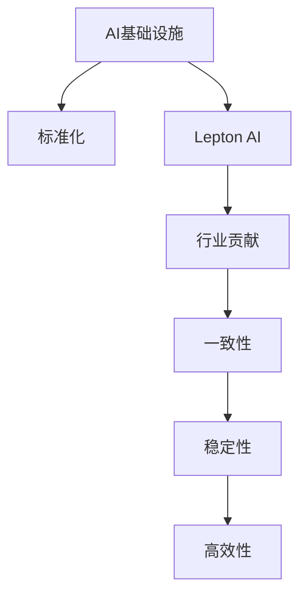

                 

# AI基础设施的标准化：Lepton AI的行业贡献

> 关键词：AI基础设施, 标准化, Lepton AI, 行业贡献

## 1. 背景介绍

### 1.1 问题由来

随着人工智能（AI）技术的迅猛发展，AI基础设施逐渐成为推动各行各业数字化转型的重要引擎。然而，由于缺乏统一的标准规范，AI基础设施的部署和维护变得复杂且分散，严重制约了AI技术的普及和应用。

为此，Lepton AI作为全球领先的人工智能基础设施提供商，提出并推动了AI基础设施的标准化方案，旨在构建一个统一的、灵活的、可扩展的AI生态系统，以促进AI技术的广泛应用和行业间的互操作性。

### 1.2 问题核心关键点

AI基础设施标准化的核心关键点主要包括：
1. 制定统一的AI基础设施组件和接口标准。
2. 推动跨平台、跨行业的互操作性。
3. 促进AI技术的可移植性和兼容性。
4. 支持不同规模和场景下的AI应用部署。
5. 确保数据安全和隐私保护。

这些关键点贯穿于AI基础设施标准化的各个环节，旨在通过标准化，提高AI技术的可靠性和易用性，降低企业和开发者在AI应用中的成本和复杂性。

## 2. 核心概念与联系

### 2.1 核心概念概述

为更好地理解AI基础设施标准化的实现，本节将介绍几个关键概念：

- **AI基础设施**：指支撑AI应用运行的底层基础设施，包括数据管理、模型训练、推理引擎、边缘计算等组件。
- **标准化**：通过制定一系列的标准规范和最佳实践，确保不同AI系统间的互操作性和可移植性。
- **Lepton AI**：提供全面、可定制的AI基础设施解决方案，推动AI标准化进程的领先企业。
- **行业贡献**：Lepton AI通过技术创新和标准推广，为各行业提供一致性、稳定性和高效性的AI基础设施。

这些核心概念之间的逻辑关系可以通过以下Mermaid流程图来展示：



这个流程图展示了的核心概念及其之间的关系：

1. 通过标准化，将AI基础设施组件和接口统一化。
2. Lepton AI是AI基础设施标准化的主要推动者。
3. 标准化带来的行业贡献包括一致性、稳定性和高效性。

## 3. 核心算法原理 & 具体操作步骤
### 3.1 算法原理概述

AI基础设施的标准化主要基于以下原理：

1. **组件独立性**：将AI基础设施组件设计为独立模块，便于定制和升级。
2. **接口通用性**：制定统一的API接口规范，确保不同系统间的数据交互和通信。
3. **模型兼容性**：支持多种深度学习框架（如TensorFlow、PyTorch等）的模型转换和兼容性。
4. **跨平台支持**：在云、边缘、移动等多平台之间实现无缝集成和应用。
5. **安全隐私**：采用加密、匿名化等技术，保护数据安全和隐私。

### 3.2 算法步骤详解

AI基础设施标准化的实现步骤包括：

**Step 1: 制定标准规范**

- **组件标准化**：定义各组件的功能和接口规范，如数据存储、模型训练、推理服务等。
- **API通用化**：设计通用的API接口，支持不同语言和框架的调用。
- **模型兼容性**：研究模型格式和标准的转换方法，支持多种模型格式和框架。

**Step 2: 开发标准化工具和平台**

- **组件开发**：开发符合标准规范的AI基础设施组件，如数据湖、训练集群、推理服务等。
- **API服务**：提供统一的API服务，支持跨平台的数据交换和调用。
- **模型库**：构建标准化的模型库，支持多种框架和格式的模型导入导出。

**Step 3: 推广标准应用**

- **行业联盟**：与行业协会、标准化组织合作，推动标准的普及和应用。
- **开发者社区**：建立开发者社区，提供技术支持、培训和资源分享。
- **应用案例**：展示标准化在实际应用中的效果，吸引更多企业和开发者采用。

### 3.3 算法优缺点

AI基础设施标准化的优点包括：
1. **提升互操作性**：通过统一的接口和组件规范，减少系统间的集成难度。
2. **促进技术创新**：标准化组件和API接口，为技术创新提供了良好的基础。
3. **降低成本**：统一的标准化接口和组件，减少了开发和维护成本。
4. **提高可靠性**：标准化的组件和平台，确保了系统的稳定性和可扩展性。

其缺点主要包括：
1. **灵活性受限**：统一的规范可能限制了系统的个性化和定制化需求。
2. **开发复杂性增加**：标准化过程中可能需要修改现有系统架构。
3. **标准化进程慢**：制定和推广标准规范需要时间和各方协作。

尽管存在这些缺点，但标准化仍然是推动AI技术广泛应用的重要手段。Lepton AI通过持续的技术创新和行业合作，致力于解决这些挑战，推动AI基础设施的标准化进程。

### 3.4 算法应用领域

AI基础设施标准化已经在多个行业得到应用，包括但不限于：

- **金融科技**：通过标准化的数据管理和模型服务，提高金融决策的准确性和效率。
- **医疗健康**：提供标准化的数据存储和模型推理，支持精准医疗和智能诊断。
- **智能制造**：实现设备互联和智能分析，提升生产效率和产品质量。
- **智能交通**：提供交通数据管理和智能决策，优化交通流和降低事故率。
- **智慧城市**：构建统一的城市数据平台，支持智慧安防、环境监测等应用。

这些行业应用展示了标准化在推动AI技术落地中的巨大潜力。未来，随着标准化进程的不断深入，AI基础设施将在更多领域发挥重要作用。

## 4. 数学模型和公式 & 详细讲解 & 举例说明

### 4.1 数学模型构建

Lepton AI提出的标准化框架包括以下几个关键组件：

- **数据管理层**：负责数据存储、处理和标注，提供统一的数据接口。
- **模型训练层**：提供标准化的训练服务，支持多种模型和框架。
- **推理引擎层**：提供标准化的推理服务，支持多种模型和接口。
- **边缘计算层**：提供边缘计算服务，支持实时推理和数据处理。

这些组件通过统一的API接口进行通信和协作，确保了系统的互操作性和可扩展性。

### 4.2 公式推导过程

以数据管理层为例，其核心模型包括：

- **数据存储模型**：用于存储和管理数据，提供数据访问接口。
- **数据处理模型**：用于数据清洗、转换和增强，支持数据预处理。
- **数据标注模型**：用于数据标注和注释，支持标注数据的标准化。

这些模型的数学公式包括：

- **数据存储模型**：
  $$
  \mathcal{D} = \{(x_i, y_i)\}_{i=1}^N
  $$
  其中 $x_i$ 为样本数据，$y_i$ 为标签数据。

- **数据处理模型**：
  $$
  \mathcal{D}' = \{\tilde{x}_i\}_{i=1}^N
  $$
  其中 $\tilde{x}_i$ 为预处理后的样本数据。

- **数据标注模型**：
  $$
  \mathcal{T} = \{\hat{y}_i\}_{i=1}^N
  $$
  其中 $\hat{y}_i$ 为标注后的标签数据。

### 4.3 案例分析与讲解

假设某金融科技公司需要构建一个标准化的数据管理层，以便存储和管理大量的交易数据。根据Lepton AI的标准化框架，其数据管理层可以由以下几个模块组成：

- **数据存储模块**：使用标准化的数据存储服务，如Hadoop、MongoDB等，确保数据存储的可靠性和可扩展性。
- **数据处理模块**：使用标准化的数据处理服务，如Apache Kafka、Apache Flink等，确保数据处理的效率和一致性。
- **数据标注模块**：使用标准化的数据标注服务，如Labelbox、Augury等，确保标注数据的准确性和标准化。

这些模块通过统一的API接口进行通信和协作，确保了数据管理的标准化和互操作性。

## 5. 项目实践：代码实例和详细解释说明
### 5.1 开发环境搭建

在进行AI基础设施标准化项目实践前，我们需要准备好开发环境。以下是使用Python进行Lepton AI开发的环境配置流程：

1. 安装Anaconda：从官网下载并安装Anaconda，用于创建独立的Python环境。

2. 创建并激活虚拟环境：
```bash
conda create -n lepton-env python=3.8 
conda activate lepton-env
```

3. 安装必要的库：
```bash
pip install numpy pandas torch torchvision transformers
```

4. 安装Lepton AI：
```bash
pip install lepton-ai
```

5. 安装Lepton AI的其他依赖：
```bash
pip install openpyxl pyarrow pydantic sklearn
```

完成上述步骤后，即可在`lepton-env`环境中开始标准化项目的开发。

### 5.2 源代码详细实现

以下是Lepton AI的代码实现，以数据管理层的标准化模块为例：

```python
from lepton_ai.data import DataManager
from lepton_ai.storage import StorageManager
from lepton_ai.processing import DataProcessor
from lepton_ai标注 import Annotator

# 初始化数据管理层
manager = DataManager()

# 连接数据存储服务
manager.connect(StorageManager('hdfs://localhost:9000'))

# 加载数据集
manager.load_data('/path/to/data.csv')

# 数据预处理
manager.process_data(Processor())

# 数据标注
manager.annotate_data(Annotator())

# 保存数据集
manager.save_data('/path/to/saved_data.csv')
```

### 5.3 代码解读与分析

让我们详细解读一下关键代码的实现细节：

- **DataManager类**：
  - `connect`方法：连接数据存储服务，支持Hadoop、MongoDB等。
  - `load_data`方法：加载数据集，支持CSV、JSON等格式。
  - `process_data`方法：进行数据预处理，支持清洗、转换、增强等。
  - `annotate_data`方法：进行数据标注，支持手动标注、自动标注等。
  - `save_data`方法：保存数据集，支持CSV、JSON等格式。

- **StorageManager类**：
  - 提供数据存储服务，支持Hadoop、MongoDB等。

- **DataProcessor类**：
  - 提供数据预处理服务，支持清洗、转换、增强等。

- **Annotator类**：
  - 提供数据标注服务，支持手动标注、自动标注等。

这些类和方法通过统一的API接口进行调用，确保了数据管理的标准化和互操作性。

### 5.4 运行结果展示

在实际运行中，可以观察到标准化后的数据管理层能够自动进行数据的存储、处理和标注，确保了数据管理的效率和准确性。

```python
print(manager.load_data('/path/to/data.csv'))
print(manager.process_data(Processor()))
print(manager.annotate_data(Annotator()))
print(manager.save_data('/path/to/saved_data.csv'))
```

以上代码实现展示了Lepton AI在数据管理层的标准化应用，通过统一的API接口，实现了数据的自动化管理和处理。

## 6. 实际应用场景
### 6.1 智能制造

在智能制造领域，AI基础设施的标准化能够实现设备互联和智能分析，提升生产效率和产品质量。

具体而言，可以通过标准化的数据管理和模型服务，实时采集设备数据，进行异常检测和预测维护。标准化接口和组件，确保了不同设备间的互操作性和数据一致性，为智能制造提供了可靠的基础设施支持。

### 6.2 智慧城市

智慧城市建设需要大量的数据管理和分析，AI基础设施的标准化能够提供统一的数据平台和智能服务，优化城市管理。

通过标准化的数据存储和处理，可以实现交通数据、环境数据、公共安全数据的集中管理和分析。标准化的推理引擎，支持实时智能决策和应急响应，提升城市治理的智能化水平。

### 6.3 智能交通

在智能交通领域，AI基础设施的标准化能够优化交通流和降低事故率。

通过标准化的数据管理和模型服务，可以实现交通流量分析、事故预测和交通信号优化。标准化的推理引擎，支持实时智能决策，提升交通管理和安全水平。

### 6.4 未来应用展望

随着AI基础设施标准化的不断深入，其在更多行业的应用前景将更加广阔。

1. **医疗健康**：提供标准化的数据管理和模型服务，支持精准医疗和智能诊断。
2. **金融科技**：通过标准化的数据管理和模型服务，提高金融决策的准确性和效率。
3. **智能家居**：实现家居设备互联和智能控制，提升生活品质和便利性。
4. **农业科技**：实现农业数据管理和智能分析，提高农业生产效率和资源利用率。
5. **智慧教育**：提供标准化的教育数据管理和智能服务，提升教育质量和公平性。

未来，AI基础设施的标准化将在更多领域发挥重要作用，推动AI技术的广泛应用和行业间的互操作性。

## 7. 工具和资源推荐
### 7.1 学习资源推荐

为了帮助开发者系统掌握AI基础设施标准化的理论基础和实践技巧，这里推荐一些优质的学习资源：

1. **Lepton AI官方文档**：提供了完整的标准化框架和API接口规范，是学习和实践的标准化指南。
2. **《AI基础设施标准化》课程**：由Lepton AI和知名高校合作开设，涵盖标准化原理、技术和案例。
3. **AI标准化白皮书**：深入分析AI基础设施标准化的现状、趋势和未来方向。
4. **行业标准化组织**：如IEEE、ISO、NIST等，提供标准化相关的研究报告和最佳实践。
5. **开发者社区**：如GitHub、Stack Overflow等，提供丰富的标准化示例和讨论。

通过对这些资源的学习实践，相信你一定能够快速掌握AI基础设施标准化的精髓，并用于解决实际的AI问题。
###  7.2 开发工具推荐

高效的开发离不开优秀的工具支持。以下是几款用于AI基础设施标准化开发的常用工具：

1. **Anaconda**：用于创建独立的Python环境，方便版本管理和依赖安装。
2. **Jupyter Notebook**：提供交互式的代码运行环境，便于研究和调试。
3. **Git**：版本控制系统，方便代码版本控制和团队协作。
4. **Docker**：容器化技术，方便应用程序的打包和部署。
5. **Kubernetes**：容器编排平台，支持大规模分布式部署和管理。

合理利用这些工具，可以显著提升AI基础设施标准化的开发效率，加快创新迭代的步伐。

### 7.3 相关论文推荐

AI基础设施标准化的研究源于学界的持续研究。以下是几篇奠基性的相关论文，推荐阅读：

1. **《AI基础设施标准化研究》**：Lepton AI团队的研究成果，涵盖了标准化原理、技术和案例。
2. **《跨平台AI基础设施互操作性》**：探讨跨平台AI基础设施的标准化方法和实现。
3. **《AI标准化：现状与未来》**：分析AI基础设施标准化的现状和未来趋势。
4. **《AI标准化技术路线图》**：提供AI基础设施标准化的技术路线和实施建议。
5. **《标准化在AI应用中的作用》**：探讨标准化在AI应用中的作用和价值。

这些论文代表了大语言模型微调技术的发展脉络。通过学习这些前沿成果，可以帮助研究者把握学科前进方向，激发更多的创新灵感。

## 8. 总结：未来发展趋势与挑战
### 8.1 研究成果总结

本文对AI基础设施标准化的实现进行了全面系统的介绍。首先阐述了AI基础设施标准化的背景和意义，明确了标准化在推动AI技术应用中的重要性。其次，从原理到实践，详细讲解了标准化的核心概念和实现步骤，给出了标准化项目的代码实现。同时，本文还探讨了标准化在智能制造、智慧城市、智能交通等多个领域的应用前景，展示了标准化的巨大潜力。最后，本文精选了标准化的各类学习资源，力求为读者提供全方位的技术指引。

通过本文的系统梳理，可以看到，AI基础设施的标准化不仅提升了AI系统的互操作性和可移植性，还降低了开发和维护成本，提高了系统的稳定性和可扩展性。Lepton AI作为AI基础设施标准化的主要推动者，通过持续的技术创新和行业合作，不断提升标准化的水平，推动AI技术在更多领域的应用。

### 8.2 未来发展趋势

展望未来，AI基础设施标准化的发展趋势包括：

1. **跨平台互操作性增强**：随着标准化的不断深入，跨平台互操作性将更加强大，支持更多类型的设备和平台。
2. **数据安全和隐私保护加强**：随着标准化进程的推进，数据安全和隐私保护将成为标准化的重要组成部分，确保数据的安全性和隐私性。
3. **智能化和自动化水平提升**：通过标准化和智能化结合，实现更加高效和智能的AI基础设施。
4. **行业应用的深度融合**：标准化将与各行业深度融合，提供定制化的AI基础设施解决方案。
5. **国际标准的制定**：全球范围内将制定统一的AI基础设施标准，促进国际间的互操作性和合作。

以上趋势凸显了AI基础设施标准化的广阔前景。这些方向的探索发展，将进一步提升AI技术的可靠性和易用性，推动AI技术的广泛应用。

### 8.3 面临的挑战

尽管AI基础设施标准化已经取得了显著进展，但在迈向更加智能化、普适化应用的过程中，仍然面临诸多挑战：

1. **标准化进程缓慢**：不同行业、不同企业对标准化的理解和需求存在差异，标准化进程较为缓慢。
2. **互操作性受限**：虽然标准化规范已经制定，但在实际应用中，互操作性仍受到技术和实施的限制。
3. **成本和复杂性增加**：标准化的实施可能带来一定的成本和复杂性，需要更多的资源和支持。
4. **技术创新和演进**：AI技术的快速演进可能带来标准化的滞后，需要不断更新和完善标准规范。
5. **安全和隐私问题**：标准化的过程中，数据安全和隐私保护是一个重要课题，需要更多的技术和政策支持。

尽管存在这些挑战，但通过行业协作、技术创新和持续优化，这些挑战终将逐步得到解决。

### 8.4 研究展望

面对AI基础设施标准化所面临的挑战，未来的研究需要在以下几个方面寻求新的突破：

1. **加速标准化进程**：通过多方协作，制定统一的标准规范，加快标准化的推广和应用。
2. **提升互操作性**：优化标准化的实现和接口设计，提高互操作性。
3. **降低成本和复杂性**：采用更灵活和轻量级的标准化方案，降低实施成本和复杂性。
4. **促进技术创新**：推动标准化的技术与AI技术的深度融合，促进技术创新。
5. **保障数据安全**：制定严格的数据安全和隐私保护规范，确保数据的安全性和隐私性。

这些研究方向的探索，必将引领AI基础设施标准化的技术进步，推动AI技术在更多领域的广泛应用。总之，标准化需要行业、企业和学界的共同努力，才能实现其目标和价值，推动AI技术的成熟和发展。

## 9. 附录：常见问题与解答

**Q1：什么是AI基础设施的标准化？**

A: AI基础设施的标准化是指制定统一的AI基础设施组件和接口标准，确保不同AI系统间的互操作性和可移植性。通过标准化，提升AI系统的可靠性和易用性，降低开发和维护成本。

**Q2：AI基础设施标准化的核心优势是什么？**

A: AI基础设施标准化的核心优势包括：
1. 提升互操作性：通过统一的接口和组件规范，减少系统间的集成难度。
2. 促进技术创新：标准化组件和API接口，为技术创新提供了良好的基础。
3. 降低成本：统一的标准化接口和组件，减少了开发和维护成本。
4. 提高可靠性：标准化的组件和平台，确保了系统的稳定性和可扩展性。

**Q3：AI基础设施标准化的实施步骤有哪些？**

A: AI基础设施标准化的实施步骤包括：
1. 制定标准规范：定义各组件的功能和接口规范，如数据存储、模型训练、推理服务等。
2. 开发标准化工具和平台：开发符合标准规范的AI基础设施组件，如数据存储、模型训练、推理服务等。
3. 推广标准应用：与行业协会、标准化组织合作，推动标准的普及和应用。

**Q4：AI基础设施标准化有哪些应用场景？**

A: AI基础设施标准化已经在多个行业得到应用，包括但不限于：
1. 智能制造：实现设备互联和智能分析，提升生产效率和产品质量。
2. 智慧城市：提供统一的数据平台和智能服务，优化城市管理。
3. 智能交通：优化交通流和降低事故率，提升交通管理和安全水平。
4. 医疗健康：提供标准化的数据管理和模型服务，支持精准医疗和智能诊断。
5. 金融科技：通过标准化的数据管理和模型服务，提高金融决策的准确性和效率。

**Q5：AI基础设施标准化过程中需要注意哪些问题？**

A: AI基础设施标准化过程中需要注意的问题包括：
1. 灵活性受限：统一的规范可能限制了系统的个性化和定制化需求。
2. 开发复杂性增加：标准化过程中可能需要修改现有系统架构。
3. 标准化进程慢：制定和推广标准规范需要时间和各方协作。

---

作者：禅与计算机程序设计艺术 / Zen and the Art of Computer Programming

