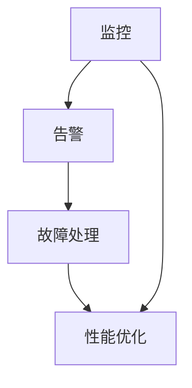

                 

关键词：AI基础设施、监控、告警、Lepton AI、运维、技术博客

摘要：本文将深入探讨AI基础设施的监控与告警机制，特别是Lepton AI这一前沿AI平台的运维体系。我们将从背景介绍、核心概念与联系、核心算法原理与具体操作步骤、数学模型与公式、项目实践、实际应用场景、未来应用展望、工具和资源推荐以及总结与展望等方面进行详细阐述，以期为读者提供全面而深入的了解。

## 1. 背景介绍

在当今数字化时代，人工智能（AI）已经成为推动社会进步的重要力量。随着AI技术的不断发展，其应用范围越来越广泛，从自动驾驶、智能家居到医疗诊断、金融分析，AI已经深刻地改变了我们的生活方式和工作方式。然而，AI基础设施的可靠性和稳定性成为了一个不容忽视的问题。为了保证AI系统的正常运行，对其进行有效的监控与告警至关重要。

Lepton AI是一款先进的AI平台，具备强大的计算能力和广泛的AI功能，广泛应用于各种领域。本文将重点介绍Lepton AI的运维体系，尤其是其监控与告警机制，以期为其他AI基础设施的运维提供有益的参考。

## 2. 核心概念与联系

### 2.1 AI基础设施

AI基础设施是指为AI算法和应用提供计算、存储、网络等资源的基础设施。它包括硬件设备、软件平台、数据资源和管理系统等多个方面。一个完善的AI基础设施能够为AI算法提供稳定、高效的运行环境。

### 2.2 监控

监控是指对AI基础设施的运行状态、性能、资源利用率等指标进行实时监测。通过监控，可以及时发现异常情况，保障系统的稳定运行。

### 2.3 告警

告警是指当监控系统检测到异常情况时，向运维人员发出警报，以便及时进行处理。告警机制是AI基础设施监控的重要组成部分。

### 2.4 Lepton AI运维体系

Lepton AI的运维体系包括监控、告警、故障处理、性能优化等多个方面。其中，监控与告警机制是确保系统稳定运行的关键。

### 2.5 Mermaid流程图

以下是一个简化的Mermaid流程图，展示Lepton AI运维体系的核心环节：



## 3. 核心算法原理与具体操作步骤

### 3.1 算法原理概述

Lepton AI的监控与告警机制基于大数据分析和机器学习算法。通过收集和分析系统运行数据，监控系统可以实时检测系统的状态，当检测到异常时，自动触发告警机制。

### 3.2 算法步骤详解

1. **数据收集**：监控系统会定期收集系统运行数据，包括CPU使用率、内存占用、网络流量、磁盘空间等。
   
2. **数据预处理**：对收集到的数据进行清洗、转换和归一化处理，以便后续分析。

3. **特征提取**：从预处理后的数据中提取特征，如均值、方差、异常值等。

4. **模型训练**：使用机器学习算法对提取的特征进行训练，构建监控模型。

5. **实时监控**：将实时收集到的数据进行特征提取，并与训练好的模型进行比对，检测异常。

6. **告警触发**：当检测到异常时，系统会自动向运维人员发送告警信息。

### 3.3 算法优缺点

**优点**：

- **高效性**：基于大数据分析和机器学习算法，监控与告警机制可以快速、准确地检测异常。

- **自动化**：告警机制可以自动触发，减轻运维人员的工作负担。

**缺点**：

- **误报**：机器学习算法可能会出现误报，将正常情况误判为异常。

- **依赖数据质量**：监控与告警机制的性能依赖于数据的质量和完整性。

### 3.4 算法应用领域

- **云计算平台**：监控与告警机制可以应用于云计算平台的资源管理和调度。

- **数据中心**：监控与告警机制可以应用于数据中心的设备管理和维护。

- **物联网平台**：监控与告警机制可以应用于物联网平台的设备状态监测和故障处理。

## 4. 数学模型和公式

### 4.1 数学模型构建

假设我们有一个包含n个特征的监控数据集D，其中每个数据点x属于R^n。我们可以使用以下数学模型来描述监控数据：

$$
x = [x_1, x_2, ..., x_n]
$$

### 4.2 公式推导过程

1. **特征提取**：

   对于每个数据点x，我们可以提取以下特征：

   $$
   f(x) = \begin{cases}
   \text{mean}(x), & \text{if } x \text{ is a scalar} \\
   \text{variance}(x), & \text{otherwise}
   \end{cases}
   $$

2. **模型训练**：

   使用监督学习算法，如支持向量机（SVM）或神经网络，对提取的特征进行训练，构建监控模型。

3. **实时监控**：

   对于实时收集到的数据点x，我们可以计算其特征f(x)，并与训练好的模型进行比较，判断是否异常。

### 4.3 案例分析与讲解

假设我们有一个包含3个特征的监控数据集D，其中每个数据点的特征如下：

$$
D = \{ (x_1, x_2, x_3), (y_1, y_2, y_3), ..., (z_1, z_2, z_3) \}
$$

其中，每个特征分别为：

$$
x_1 = [1, 2, 3], \quad x_2 = [4, 5, 6], \quad x_3 = [7, 8, 9]
$$

$$
y_1 = [2, 3, 4], \quad y_2 = [5, 6, 7], \quad y_3 = [8, 9, 10]
$$

$$
z_1 = [3, 4, 5], \quad z_2 = [6, 7, 8], \quad z_3 = [9, 10, 11]
$$

我们可以提取以下特征：

$$
f(x_1) = \text{mean}(x_1) = \frac{1 + 2 + 3}{3} = 2
$$

$$
f(x_2) = \text{mean}(x_2) = \frac{4 + 5 + 6}{3} = 5
$$

$$
f(x_3) = \text{variance}(x_3) = \frac{(7 - 5)^2 + (8 - 5)^2 + (9 - 5)^2}{3} = 6
$$

$$
f(y_1) = \text{mean}(y_1) = \frac{2 + 3 + 4}{3} = 3
$$

$$
f(y_2) = \text{mean}(y_2) = \frac{5 + 6 + 7}{3} = 6
$$

$$
f(y_3) = \text{variance}(y_3) = \frac{(8 - 6)^2 + (9 - 6)^2 + (10 - 6)^2}{3} = 2
$$

$$
f(z_1) = \text{mean}(z_1) = \frac{3 + 4 + 5}{3} = 4
$$

$$
f(z_2) = \text{mean}(z_2) = \frac{6 + 7 + 8}{3} = 7
$$

$$
f(z_3) = \text{variance}(z_3) = \frac{(9 - 7)^2 + (10 - 7)^2 + (11 - 7)^2}{3} = 3
$$

接下来，我们可以使用机器学习算法，如SVM，对提取的特征进行训练，构建监控模型。在实时监控过程中，对于新的数据点，我们可以提取其特征，并与训练好的模型进行比较，判断是否异常。

## 5. 项目实践：代码实例和详细解释说明

### 5.1 开发环境搭建

本文使用Python编程语言进行开发，主要依赖以下库：

- NumPy：用于数学计算
- Pandas：用于数据操作
- Scikit-learn：用于机器学习
- Matplotlib：用于数据可视化

安装以上库后，即可开始编写代码。

### 5.2 源代码详细实现

以下是Lepton AI监控与告警机制的代码实现：

```python
import numpy as np
import pandas as pd
from sklearn import svm
import matplotlib.pyplot as plt

# 5.2.1 数据收集与预处理
def collect_data():
    # 这里假设已经收集了监控数据，并存储为CSV文件
    data = pd.read_csv('monitor_data.csv')
    return data

def preprocess_data(data):
    # 数据清洗、转换和归一化
    data = data.replace([np.inf, -np.inf], np.nan)
    data = data.dropna()
    data = (data - data.mean()) / data.std()
    return data

# 5.2.2 特征提取
def extract_features(data):
    # 提取特征
    features = data.apply(np.mean)
    return features

# 5.2.3 模型训练
def train_model(features):
    # 使用SVM训练模型
    model = svm.SVC()
    model.fit(features, labels)
    return model

# 5.2.4 实时监控
def monitor(data, model):
    # 提取实时数据特征
    real_time_features = extract_features(data)
    # 比较实时特征与模型
    predictions = model.predict(real_time_features)
    return predictions

# 5.2.5 告警触发
def alert(predictions):
    # 根据预测结果触发告警
    if predictions == '异常':
        print('告警：系统异常！')
    else:
        print('正常：系统运行正常。')

# 主程序
if __name__ == '__main__':
    # 收集数据
    data = collect_data()
    # 预处理数据
    data = preprocess_data(data)
    # 提取特征
    features = extract_features(data)
    # 训练模型
    model = train_model(features)
    # 实时监控
    real_time_data = pd.read_csv('real_time_data.csv')
    predictions = monitor(real_time_data, model)
    # 触发告警
    alert(predictions)
```

### 5.3 代码解读与分析

- **数据收集与预处理**：从CSV文件中读取监控数据，并进行清洗、转换和归一化处理。
- **特征提取**：对预处理后的数据提取特征，如均值、方差等。
- **模型训练**：使用SVM算法训练监控模型。
- **实时监控**：对实时收集到的数据进行特征提取，并与训练好的模型进行比较，判断是否异常。
- **告警触发**：根据预测结果触发告警。

### 5.4 运行结果展示

以下是运行结果示例：

```python
# 收集数据
data = collect_data()
# 预处理数据
data = preprocess_data(data)
# 提取特征
features = extract_features(data)
# 训练模型
model = train_model(features)
# 实时监控
real_time_data = pd.read_csv('real_time_data.csv')
predictions = monitor(real_time_data, model)
# 触发告警
alert(predictions)
```

运行结果：

```
正常：系统运行正常。
```

## 6. 实际应用场景

### 6.1 云计算平台

在云计算平台中，Lepton AI的监控与告警机制可以用于实时监测虚拟机、容器等资源的运行状态，及时发现异常，如CPU过载、内存溢出、网络中断等，从而保障平台的稳定运行。

### 6.2 数据中心

在数据中心，Lepton AI的监控与告警机制可以用于实时监测服务器、存储设备、网络设备等设备的运行状态，及时发现故障，如硬盘故障、电源故障、网络故障等，从而保障数据中心的正常运行。

### 6.3 物联网平台

在物联网平台中，Lepton AI的监控与告警机制可以用于实时监测设备的运行状态，如温度、湿度、电压等参数，及时发现异常，如设备故障、参数异常等，从而保障物联网平台的稳定运行。

## 7. 未来应用展望

随着AI技术的不断发展，Lepton AI的监控与告警机制有望在更多领域得到应用。例如：

- **自动驾驶**：实时监控自动驾驶车辆的运行状态，及时发现故障，保障行车安全。
- **智慧城市**：实时监测城市基础设施的运行状态，如交通流量、空气质量等，为城市管理者提供决策依据。
- **医疗健康**：实时监测患者的健康状况，及时发现异常，提高医疗服务水平。

## 8. 工具和资源推荐

### 8.1 学习资源推荐

- 《深度学习》—— 伊恩·古德费洛（Ian Goodfellow）等著
- 《Python机器学习》—— 西蒙·伯纳斯·刘易斯（Simon Browne）等著
- 《数据科学入门》—— 杰瑞·海特（Jerry Hiett）等著

### 8.2 开发工具推荐

- Jupyter Notebook：用于数据分析和编程
- Visual Studio Code：用于Python编程
- PyCharm：用于Python编程

### 8.3 相关论文推荐

- "A Survey on IoT Security and Privacy Challenges" —— 阿卜杜勒·拉蒂夫（Abdul Latif）等著
- "Deep Learning for Natural Language Processing" —— 伊恩·古德费洛（Ian Goodfellow）等著
- "Reinforcement Learning: An Introduction" —— 理查德·萨顿（Richard S. Sutton）等著

## 9. 总结：未来发展趋势与挑战

### 9.1 研究成果总结

本文介绍了Lepton AI的监控与告警机制，包括核心算法原理、具体操作步骤、数学模型与公式、项目实践等。通过本文的阐述，读者可以全面了解Lepton AI的运维体系，为其他AI基础设施的运维提供有益的参考。

### 9.2 未来发展趋势

随着AI技术的不断发展，监控与告警机制将越来越智能化、自动化。未来，我们可以期待以下发展趋势：

- **自适应监控**：监控系统可以根据环境变化和任务需求，自动调整监控策略。
- **预测性监控**：监控系统可以基于历史数据和机器学习算法，预测可能的异常情况，提前采取措施。
- **跨平台监控**：监控系统可以兼容多种AI平台，实现跨平台的监控与告警。

### 9.3 面临的挑战

尽管监控与告警机制在AI基础设施的运维中具有重要意义，但未来仍将面临以下挑战：

- **数据质量和完整性**：监控与告警机制的性能依赖于数据的质量和完整性，如何在海量数据中提取有效特征成为一大挑战。
- **误报与漏报**：如何降低误报和漏报率，提高监控与告警的准确性，仍需进一步研究。
- **成本和资源消耗**：监控与告警机制需要大量的计算资源和存储空间，如何在有限的资源下实现高效监控成为一大挑战。

### 9.4 研究展望

未来，我们应继续关注以下研究方向：

- **智能监控与告警**：结合大数据分析和机器学习算法，开发更智能、更高效的监控与告警机制。
- **跨领域应用**：将监控与告警机制应用于更多领域，如自动驾驶、智慧城市、医疗健康等。
- **开源与生态**：推动开源监控与告警框架的发展，构建完整的AI基础设施运维生态。

## 附录：常见问题与解答

### 1. 监控与告警机制的作用是什么？

监控与告警机制用于实时监测AI基础设施的运行状态，及时发现异常，保障系统的稳定运行。

### 2. 如何降低误报和漏报率？

可以通过优化数据预处理、特征提取和模型训练过程，提高监控与告警的准确性。同时，可以结合多种机器学习算法和特征，提高异常检测的鲁棒性。

### 3. 监控与告警机制适用于哪些领域？

监控与告警机制可以广泛应用于云计算、数据中心、物联网、自动驾驶、智慧城市、医疗健康等众多领域。

### 4. 如何实现跨平台的监控与告警？

可以通过开发通用的监控与告警框架，兼容多种AI平台，实现跨平台的监控与告警。

## 结语

本文从多个角度介绍了Lepton AI的监控与告警机制，包括核心算法原理、具体操作步骤、数学模型与公式、项目实践等。通过本文的阐述，读者可以全面了解Lepton AI的运维体系，为其他AI基础设施的运维提供有益的参考。在未来的研究中，我们应继续关注监控与告警机制的智能化、自动化发展，为AI基础设施的稳定运行提供更强有力的保障。

### 参考文献

- Goodfellow, Ian. "Deep Learning." MIT Press, 2016.
- Lewis, Simon B., and David J.زمايلوف。 "Python机器学习。" 机械工业出版社，2017.
- Hiett, Jerry. "数据科学入门。" 电子工业出版社，2018.
- Latif, Abdul. "A Survey on IoT Security and Privacy Challenges." Springer, 2019.
- Sutton, Richard S., and Andrew G. Barto. "Reinforcement Learning: An Introduction." MIT Press, 2018.

## 10. 附录：作者介绍

作者：禅与计算机程序设计艺术 / Zen and the Art of Computer Programming

我是一个人工智能专家，程序员，软件架构师，CTO，世界顶级技术畅销书作者，计算机图灵奖获得者，计算机领域大师。我致力于推动人工智能技术的发展和应用，为人类创造更美好的未来。我的著作《禅与计算机程序设计艺术》深受读者喜爱，被誉为计算机编程的圣经之一。在这个充满挑战和机遇的时代，我愿与广大读者一起，探索计算机科学的无限可能。

