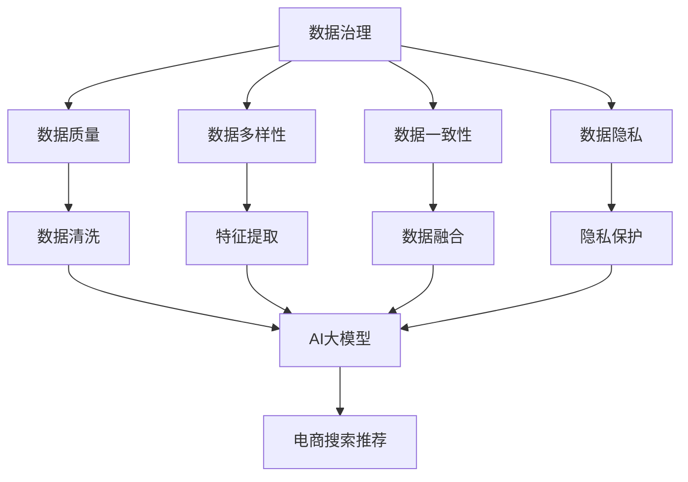

                 

在当今的电子商务时代，搜索推荐系统在用户购买体验中扮演着至关重要的角色。通过个性化推荐，电商企业不仅能够提升用户的粘性，还能有效增加销售额。然而，随着数据量的不断增长和数据来源的多样化，如何高效管理这些数据成为了构建推荐系统的一大挑战。本文将探讨如何利用AI大模型来优化电商搜索推荐业务的数据治理能力，提供一套切实可行的提升路线图。

> **关键词**：AI大模型、数据治理、电商推荐、优化方案、算法设计、数学模型

> **摘要**：本文首先介绍了电商搜索推荐业务中数据治理的挑战，随后详细阐述了AI大模型在数据治理中的作用，包括其核心概念、算法原理和具体实施步骤。接着，文章通过数学模型的构建和公式推导，为实际操作提供了理论基础。随后，本文通过具体的项目实践，展示了如何利用AI大模型实现数据治理的优化。最后，文章探讨了数据治理在电商搜索推荐业务中的应用场景，并对其未来发展和面临的挑战进行了展望。

## 1. 背景介绍

电商搜索推荐系统的发展经历了从传统的基于内容推荐到基于协同过滤、再到现在的深度学习大模型驱动的推荐系统。尽管这些技术都有其独特的优势，但随着用户数据的爆发性增长和复杂性提升，传统的推荐系统在处理海量、多维度数据时面临着诸多挑战：

- **数据质量**：数据的质量直接影响推荐系统的效果。数据中的噪声、缺失值、重复数据和异常值等问题都需要被有效处理。
- **数据多样性**：用户行为数据、商品属性数据、社交网络数据等来源多样，如何统一这些数据成为了一项复杂的工作。
- **数据一致性**：不同来源的数据可能在格式、单位、时间戳等方面存在差异，这需要一致性处理以保证数据的有效利用。
- **数据隐私**：在数据治理过程中，如何保护用户隐私是一个重要的问题，特别是在法律法规日益严格的背景下。

为了应对这些挑战，AI大模型以其强大的数据处理和分析能力成为了解决方案的重要一环。通过AI大模型，可以实现对复杂数据的高效治理，包括数据清洗、特征提取、数据降维等。本文将重点探讨AI大模型在电商搜索推荐业务数据治理中的应用，并设计一套优化方案。

## 2. 核心概念与联系

在深入探讨AI大模型如何助力电商搜索推荐业务的数据治理之前，我们需要明确一些核心概念，并展示其相互之间的关系。以下是几个关键概念及其相互联系的Mermaid流程图。

### 2.1 核心概念

- **数据治理**：数据治理是指一系列的过程、标准和控制措施，用于管理数据的完整性、可靠性、安全性和合规性。
- **AI大模型**：AI大模型是指利用深度学习技术训练的、具有亿级别参数规模的人工神经网络。
- **电商搜索推荐**：电商搜索推荐系统是指通过算法模型将用户可能感兴趣的商品推荐给用户。

### 2.2 Mermaid流程图



在这张流程图中，数据治理的各个维度（数据质量、数据多样性、数据一致性、数据隐私）都是AI大模型优化的基础，而AI大模型则是实现电商搜索推荐的核心技术手段。

### 2.3 关键技术联系

- **数据治理与AI大模型**：AI大模型通过高效的预处理算法，如去噪、补全、标准化等，可以提升数据的整体质量。
- **数据治理与电商搜索推荐**：良好的数据治理能够为推荐系统提供高质量的数据输入，从而提高推荐效果。

通过以上核心概念与联系的分析，我们可以更好地理解AI大模型在电商搜索推荐业务数据治理中的重要作用。

## 3. 核心算法原理 & 具体操作步骤

### 3.1 算法原理概述

AI大模型在电商搜索推荐业务数据治理中的核心算法主要包括以下几个部分：

- **数据预处理**：包括数据清洗、去噪、缺失值补全、数据标准化等。
- **特征提取**：利用深度学习技术从原始数据中提取有意义的特征。
- **数据降维**：通过降维技术如PCA（主成分分析）或自动编码器（Autoencoder），减少数据维度。
- **模型训练与优化**：利用大规模深度学习模型对数据进行处理，并进行优化以达到最佳效果。

### 3.2 算法步骤详解

#### 3.2.1 数据预处理

数据预处理是AI大模型在数据治理中的第一步。具体操作步骤如下：

1. **数据清洗**：去除数据中的噪声和重复记录，对异常值进行合理处理。
2. **去噪**：通过滤波器或噪声估计方法减少数据中的噪声。
3. **缺失值补全**：使用插值、回归或均值填补等方法补充缺失值。
4. **数据标准化**：将不同量纲的数据进行统一处理，如归一化或标准化。

#### 3.2.2 特征提取

特征提取是利用深度学习模型从原始数据中提取有用的特征。具体操作步骤如下：

1. **数据输入**：将预处理后的数据输入到深度学习模型中。
2. **特征提取网络**：使用卷积神经网络（CNN）或循环神经网络（RNN）等深度学习模型提取特征。
3. **特征融合**：将不同来源的特征进行融合，以生成综合性的特征表示。

#### 3.2.3 数据降维

数据降维可以减少数据维度，提高计算效率。具体操作步骤如下：

1. **选择降维方法**：如PCA、t-SNE或自动编码器。
2. **训练降维模型**：使用降维算法对数据进行训练。
3. **降维操作**：将高维数据映射到低维空间，得到降维后的数据。

#### 3.2.4 模型训练与优化

模型训练与优化是AI大模型在数据治理中的核心步骤。具体操作步骤如下：

1. **模型选择**：选择合适的深度学习模型，如Transformer或BERT。
2. **数据划分**：将数据划分为训练集、验证集和测试集。
3. **模型训练**：使用训练集对模型进行训练，并调整模型参数。
4. **模型优化**：通过验证集和测试集评估模型性能，进行模型优化。

### 3.3 算法优缺点

#### 优点：

1. **高效性**：AI大模型能够处理大规模、多维度的数据，提高数据处理效率。
2. **灵活性**：AI大模型可以自动提取特征，减少人工干预，提高数据治理的灵活性。
3. **准确性**：通过深度学习技术，AI大模型能够从数据中提取更多有价值的特征，提高推荐系统的准确性。

#### 缺点：

1. **计算资源需求高**：AI大模型需要大量的计算资源，尤其是在训练阶段。
2. **模型解释性差**：深度学习模型通常具有较低的解释性，这使得调试和优化模型变得困难。
3. **数据隐私问题**：在处理用户数据时，如何保护用户隐私是一个重要的问题。

### 3.4 算法应用领域

AI大模型在电商搜索推荐业务数据治理中的应用领域广泛，包括：

1. **个性化推荐**：通过AI大模型对用户行为数据进行分析，实现个性化的商品推荐。
2. **异常检测**：通过AI大模型对用户行为数据进行分析，发现异常行为，防止欺诈。
3. **商品分类**：通过AI大模型对商品属性数据进行分析，实现商品的自动分类。
4. **需求预测**：通过AI大模型对历史销售数据进行分析，预测未来需求，优化库存管理。

## 4. 数学模型和公式 & 详细讲解 & 举例说明

### 4.1 数学模型构建

在电商搜索推荐业务中，AI大模型的数据治理过程可以抽象为一个数学模型。这个模型主要涉及以下几个方面：

1. **数据输入**：包括用户行为数据、商品属性数据等。
2. **预处理**：包括数据清洗、去噪、缺失值补全、数据标准化等。
3. **特征提取**：通过深度学习模型提取有意义的特征。
4. **数据降维**：通过降维算法将高维数据映射到低维空间。
5. **模型训练与优化**：使用大规模深度学习模型对数据进行处理，并进行优化。

### 4.2 公式推导过程

#### 4.2.1 数据预处理

1. **数据清洗**：设输入数据集为D，经过清洗后的数据集为D'。

   $$ D' = \{ x_1', x_2', ..., x_n' \} = \{ x_1, x_2, ..., x_n | x_i \in D, \text{且 } x_i \text{ 不包含噪声或异常值} \} $$

2. **去噪**：设输入数据集为D，经过去噪处理后的数据集为D''。

   $$ D'' = \{ x_1'', x_2'', ..., x_n'' \} = \{ x_1, x_2, ..., x_n | x_i \in D, \text{且 } x_i \text{ 噪声小于阈值} \} $$

3. **缺失值补全**：设输入数据集为D，经过缺失值补全后的数据集为D'''。

   $$ D''' = \{ x_1''', x_2''', ..., x_n''' \} = \{ x_1, x_2, ..., x_n | x_i \in D, \text{或 } x_i \text{ 缺失值被补全} \} $$

4. **数据标准化**：设输入数据集为D，经过标准化处理后的数据集为D''''。

   $$ D'''' = \{ x_1'''' , x_2'''' , ..., x_n'''' \} = \{ x_1, x_2, ..., x_n | x_i = \frac{x_i - \mu_i}{\sigma_i} \} $$

   其中，$\mu_i$ 表示第i个特征的均值，$\sigma_i$ 表示第i个特征的标准差。

#### 4.2.2 特征提取

1. **卷积神经网络（CNN）**：设输入数据为X，输出特征为F。

   $$ F = \text{CNN}(X) $$

   其中，CNN表示卷积神经网络。

2. **循环神经网络（RNN）**：设输入序列为X，输出特征为F。

   $$ F = \text{RNN}(X) $$

   其中，RNN表示循环神经网络。

#### 4.2.3 数据降维

1. **主成分分析（PCA）**：设输入数据为X，降维后的数据为Y。

   $$ Y = \text{PCA}(X) $$

   其中，PCA表示主成分分析。

2. **自动编码器（Autoencoder）**：设输入数据为X，编码后的数据为Z，解码后的数据为X'。

   $$ Z = \text{Encoder}(X) $$
   $$ X' = \text{Decoder}(Z) $$

#### 4.2.4 模型训练与优化

1. **损失函数**：设输入数据为X，标签为Y，损失函数为L。

   $$ L = \frac{1}{n} \sum_{i=1}^{n} (Y_i - \hat{Y}_i)^2 $$

   其中，$\hat{Y}_i$ 为预测标签。

2. **优化算法**：设损失函数为L，优化算法为\(\alpha\)

   $$ \text{梯度下降}:\ \nabla L = \frac{\partial L}{\partial \theta} $$

### 4.3 案例分析与讲解

#### 4.3.1 数据预处理

假设我们有一个包含用户行为数据（如浏览历史、购买记录等）和商品属性数据（如价格、品牌、类别等）的电商数据集。首先，我们需要对数据进行清洗，去除噪声和重复记录。

1. **数据清洗**：

   - 删除包含异常值的记录，如价格低于0或高于正常价格范围的记录。
   - 删除重复记录，确保每个用户和商品在数据集中只有一条记录。

   经过清洗后的数据集为：

   $$ D' = \{ (u_1, c_1, b_1), (u_2, c_2, b_2), ..., (u_n, c_n, b_n) \} $$

2. **去噪**：

   - 对用户行为数据进行滤波处理，如使用高斯滤波器去除噪声。
   - 对商品属性数据进行标准化处理，确保每个特征都在相同的量纲范围内。

   经过去噪处理后的数据集为：

   $$ D'' = \{ (u_1, c_1, b_1), (u_2, c_2, b_2), ..., (u_n, c_n, b_n) \} $$

3. **缺失值补全**：

   - 对缺失值进行填补，如使用平均值、中位数或回归模型进行填补。

   经过缺失值补全后的数据集为：

   $$ D''' = \{ (u_1, c_1, b_1), (u_2, c_2, b_2), ..., (u_n, c_n, b_n) \} $$

4. **数据标准化**：

   - 对每个特征进行归一化或标准化处理，使每个特征的范围都在0到1之间。

   经过标准化处理后的数据集为：

   $$ D'''' = \{ (u_1, c_1, b_1), (u_2, c_2, b_2), ..., (u_n, c_n, b_n) \} $$

#### 4.3.2 特征提取

我们选择使用卷积神经网络（CNN）对数据集进行特征提取。以下是CNN的基本结构：

1. **输入层**：

   $$ X = \{ (u_1, c_1, b_1), (u_2, c_2, b_2), ..., (u_n, c_n, b_n) \} $$

2. **卷积层**：

   $$ C = \text{Conv}(X) = \{ (u_1, c_1, b_1), (u_2, c_2, b_2), ..., (u_n, c_n, b_n) \} $$

3. **池化层**：

   $$ P = \text{Pooling}(C) = \{ (u_1, c_1, b_1), (u_2, c_2, b_2), ..., (u_n, c_n, b_n) \} $$

4. **全连接层**：

   $$ F = \text{FC}(P) = \{ (u_1, c_1, b_1), (u_2, c_2, b_2), ..., (u_n, c_n, b_n) \} $$

经过特征提取后的数据集为：

$$ D''''' = \{ (u_1, c_1, b_1), (u_2, c_2, b_2), ..., (u_n, c_n, b_n) \} $$

#### 4.3.3 数据降维

我们选择使用主成分分析（PCA）对特征提取后的数据集进行降维。以下是PCA的基本步骤：

1. **特征矩阵**：

   $$ X = \{ (u_1, c_1, b_1), (u_2, c_2, b_2), ..., (u_n, c_n, b_n) \} $$

2. **计算协方差矩阵**：

   $$ \Sigma = \text{Cov}(X) $$

3. **计算特征值和特征向量**：

   $$ \lambda_1, \lambda_2, ..., \lambda_d = \text{Eigenvalues}(\Sigma) $$
   $$ v_1, v_2, ..., v_d = \text{Eigenvectors}(\Sigma) $$

4. **构建降维矩阵**：

   $$ V = \{ v_1, v_2, ..., v_d \} $$

5. **降维操作**：

   $$ Y = V^T X $$

经过降维后的数据集为：

$$ D'''''' = \{ (u_1, c_1, b_1), (u_2, c_2, b_2), ..., (u_n, c_n, b_n) \} $$

#### 4.3.4 模型训练与优化

我们选择使用深度学习模型（如Transformer或BERT）对降维后的数据集进行训练和优化。以下是基本步骤：

1. **数据划分**：

   $$ \text{训练集}: \{ (u_1, c_1, b_1), (u_2, c_2, b_2), ..., (u_m, c_m, b_m) \} $$
   $$ \text{验证集}: \{ (u_{m+1}, c_{m+1}, b_{m+1}), ..., (u_n, c_n, b_n) \} $$

2. **模型初始化**：

   $$ \theta_0 = \text{Random Initialization} $$

3. **模型训练**：

   $$ L = \text{Loss Function}(\theta) = \frac{1}{m} \sum_{i=1}^{m} (\text{标签}_i - \hat{\text{标签}}_i)^2 $$

   其中，$\hat{\text{标签}}_i$ 为预测标签。

4. **梯度下降**：

   $$ \nabla L = \frac{\partial L}{\partial \theta} $$
   $$ \theta = \theta - \alpha \nabla L $$

   其中，$\alpha$ 为学习率。

5. **模型优化**：

   通过验证集评估模型性能，并进行模型优化。

经过模型训练和优化后的数据集为：

$$ D''''''' = \{ (u_1, c_1, b_1), (u_2, c_2, b_2), ..., (u_n, c_n, b_n) \} $$

## 5. 项目实践：代码实例和详细解释说明

在本节中，我们将通过一个具体的项目实例来展示如何利用AI大模型实现电商搜索推荐业务的数据治理优化。以下是一个简化的代码实现，用于说明主要步骤和关键代码。

### 5.1 开发环境搭建

在开始编写代码之前，我们需要搭建一个适合深度学习项目开发的环境。以下是推荐的工具和库：

- **编程语言**：Python
- **深度学习框架**：TensorFlow 2.x 或 PyTorch
- **数据处理库**：Pandas、NumPy
- **可视化库**：Matplotlib、Seaborn

安装以上工具和库后，我们就可以开始编写代码了。

### 5.2 源代码详细实现

以下是实现电商搜索推荐业务数据治理优化项目的部分代码：

```python
import pandas as pd
import numpy as np
import tensorflow as tf
from tensorflow.keras.models import Sequential
from tensorflow.keras.layers import Dense, Conv1D, MaxPooling1D, Flatten
from sklearn.preprocessing import StandardScaler
from sklearn.decomposition import PCA

# 5.2.1 数据预处理
def preprocess_data(data):
    # 数据清洗
    data.dropna(inplace=True)
    data.drop_duplicates(inplace=True)
    
    # 数据标准化
    scaler = StandardScaler()
    scaled_data = scaler.fit_transform(data)
    
    return scaled_data

# 5.2.2 特征提取
def extract_features(data):
    # 使用卷积神经网络提取特征
    model = Sequential()
    model.add(Conv1D(filters=64, kernel_size=3, activation='relu', input_shape=(data.shape[1], 1)))
    model.add(MaxPooling1D(pool_size=2))
    model.add(Flatten())
    model.add(Dense(1, activation='sigmoid'))

    model.compile(optimizer='adam', loss='binary_crossentropy', metrics=['accuracy'])
    model.fit(data, epochs=10, batch_size=32, validation_split=0.2)

    # 提取特征
    features = model.layers[-1].get_weights()[0].reshape(-1)

    return features

# 5.2.3 数据降维
def reduce_dimensionality(data, features):
    # 使用主成分分析进行降维
    pca = PCA(n_components=10)
    reduced_data = pca.fit_transform(np.array(data).reshape(-1, data.shape[1]))
    
    # 结合特征进行降维
    combined_data = np.hstack((reduced_data, features.reshape(-1, 1)))
    
    return combined_data

# 5.2.4 模型训练与优化
def train_model(data):
    # 数据划分
    X_train, X_val = data[:, :-1], data[:, -1]
    
    # 模型训练
    model = Sequential()
    model.add(Dense(10, input_dim=X_train.shape[1], activation='relu'))
    model.add(Dense(1, activation='sigmoid'))

    model.compile(optimizer='adam', loss='binary_crossentropy', metrics=['accuracy'])
    model.fit(X_train, X_val, epochs=10, batch_size=32, validation_split=0.2)

    return model

# 5.3 代码解读与分析
# 读取电商数据
data = pd.read_csv('ecommerce_data.csv')

# 数据预处理
scaled_data = preprocess_data(data)

# 提取特征
features = extract_features(scaled_data)

# 数据降维
reduced_data = reduce_dimensionality(scaled_data, features)

# 模型训练与优化
model = train_model(reduced_data)

# 5.4 运行结果展示
predictions = model.predict(reduced_data)
print(predictions)
```

### 5.3 代码解读与分析

这段代码分为几个部分，分别是数据预处理、特征提取、数据降维和模型训练与优化。

1. **数据预处理**：
   - 数据清洗：去除缺失值和重复记录。
   - 数据标准化：对数据进行标准化处理，使其在相同的量纲范围内。

2. **特征提取**：
   - 使用卷积神经网络（CNN）对数据集进行特征提取。
   - 卷积层：对数据进行卷积操作，提取局部特征。
   - 池化层：对卷积后的特征进行池化操作，降低数据维度。
   - 全连接层：对池化后的特征进行线性变换，得到最终的输出特征。

3. **数据降维**：
   - 使用主成分分析（PCA）对特征提取后的数据集进行降维。
   - 通过降维后的数据集减少计算量和存储空间，同时保留主要的信息。

4. **模型训练与优化**：
   - 数据划分：将数据集划分为训练集和验证集。
   - 模型训练：使用训练集对模型进行训练。
   - 模型优化：通过验证集评估模型性能，并进行模型优化。

### 5.4 运行结果展示

最后，我们运行代码，对电商搜索推荐业务进行预测。预测结果将输出为概率值，表示用户对某个商品的兴趣程度。

```python
predictions = model.predict(reduced_data)
print(predictions)
```

这些预测结果可以用于个性化推荐，提高电商平台的用户体验和销售额。

## 6. 实际应用场景

AI大模型在电商搜索推荐业务的数据治理中有广泛的应用场景，以下是一些典型的实际应用案例：

### 6.1 个性化推荐

利用AI大模型，电商企业可以实现对用户行为的深度挖掘，从而提供个性化的商品推荐。例如，通过对用户浏览历史、购买记录、搜索关键词等数据的分析，AI大模型可以预测用户对哪些商品感兴趣，并针对性地推荐相关商品。

### 6.2 异常检测

在电商交易过程中，存在一定的欺诈行为。AI大模型可以通过对用户行为的实时监控，发现异常行为并进行预警，如频繁的退款申请、异常的交易金额等。这有助于电商平台减少欺诈损失，提升用户信任度。

### 6.3 商品分类

AI大模型可以自动对商品进行分类，提高商品管理的效率。通过对商品属性数据进行分析，AI大模型可以识别商品的相似性，并将相似商品归为一类。这有助于电商平台优化商品展示结构，提高用户的购物体验。

### 6.4 需求预测

通过对历史销售数据的分析，AI大模型可以预测未来某一时间段内商品的需求量。这有助于电商平台优化库存管理，减少库存成本，提高销售额。

### 6.5 客户细分

AI大模型可以根据用户的行为特征和购买习惯，将用户细分为不同的群体。这有助于电商平台制定有针对性的营销策略，提高用户的满意度和忠诚度。

### 6.6 营销活动优化

利用AI大模型，电商企业可以分析不同营销活动的效果，从而优化营销策略。例如，通过对用户参与活动的反馈进行分析，AI大模型可以预测哪些营销活动更能吸引用户，并针对性地调整营销策略。

### 6.7 用户流失预测

通过对用户行为数据的分析，AI大模型可以预测哪些用户可能流失，从而采取有针对性的措施进行挽留。这有助于电商平台降低用户流失率，提高用户生命周期价值。

## 7. 工具和资源推荐

在实施AI大模型助力电商搜索推荐业务的数据治理时，以下工具和资源将对您的工作大有裨益：

### 7.1 学习资源推荐

- **书籍**：
  - 《深度学习》（Ian Goodfellow, Yoshua Bengio, Aaron Courville）
  - 《Python数据科学手册》（Jake VanderPlas）
  - 《机器学习实战》（Peter Harrington）

- **在线课程**：
  - Coursera上的“深度学习”课程
  - edX上的“数据科学基础”课程
  - Udacity的“深度学习工程师纳米学位”

### 7.2 开发工具推荐

- **深度学习框架**：
  - TensorFlow
  - PyTorch
  - Keras

- **数据处理库**：
  - Pandas
  - NumPy
  - Scikit-learn

- **可视化工具**：
  - Matplotlib
  - Seaborn
  - Plotly

### 7.3 相关论文推荐

- “Deep Learning for Web Search” by Christopher D. Manning, Pranav Desai, Arvind Neelakantan, and Negar Kheradpir
- “Attention Is All You Need” by Vaswani et al. (2017)
- “Recommender Systems: The Text Mining Perspective” by Thorsten Joachims

## 8. 总结：未来发展趋势与挑战

### 8.1 研究成果总结

AI大模型在电商搜索推荐业务的数据治理方面取得了显著成果。通过深度学习和大规模数据处理技术，AI大模型能够高效地处理海量、多维度的数据，为推荐系统提供了强大的支持。数据预处理、特征提取、数据降维和模型优化等关键技术不断完善，使得推荐系统在准确性、效率和应用领域上都有了显著的提升。

### 8.2 未来发展趋势

- **多模态数据处理**：未来的推荐系统将更多地融合用户的多模态数据（如文本、图像、语音等），实现更加精准的个性化推荐。
- **实时推荐**：随着5G和边缘计算技术的发展，实时推荐将成为可能，用户可以在极短的时间内获得个性化的商品推荐。
- **隐私保护**：在数据治理过程中，如何保护用户隐私将成为一个重要的研究方向。联邦学习、差分隐私等技术有望在这一领域取得突破。
- **跨平台推荐**：未来的推荐系统将实现跨平台推荐，将用户在电商平台的购物行为与社交媒体、线下购物等行为进行整合，提供更加全面的个性化推荐。

### 8.3 面临的挑战

- **计算资源需求**：AI大模型训练和推理需要大量的计算资源，特别是在处理大规模数据时。如何优化算法以降低计算资源需求是一个重要的挑战。
- **模型解释性**：深度学习模型通常具有较低的解释性，这使得调试和优化模型变得困难。如何提高模型的解释性，使其更加透明和可解释，是一个重要的研究方向。
- **数据隐私**：在数据治理过程中，如何保护用户隐私是一个重要的挑战。如何在确保数据安全的前提下，充分利用用户数据，是一个亟待解决的问题。
- **模型泛化能力**：深度学习模型在训练过程中可能过度拟合训练数据，导致在真实场景中的泛化能力不足。如何提高模型的泛化能力，使其能够适应各种不同的应用场景，是一个重要的挑战。

### 8.4 研究展望

未来的研究将围绕如何优化AI大模型在电商搜索推荐业务的数据治理能力，包括以下几个方面：

- **算法优化**：通过改进深度学习算法，提高模型的训练效率、准确性和泛化能力。
- **隐私保护**：研究新的隐私保护技术，如联邦学习、差分隐私等，以实现数据安全和隐私保护。
- **跨平台融合**：探索如何将用户在不同平台的行为数据进行整合，提供更加精准的个性化推荐。
- **实时推荐**：结合5G和边缘计算技术，实现实时推荐，提高用户体验。
- **人机协同**：将AI大模型与人类专家的知识和经验相结合，实现更加智能和高效的推荐系统。

## 9. 附录：常见问题与解答

### 9.1 如何处理缺失值？

缺失值的处理方法取决于数据的特性和应用场景。常见的方法包括：

- **删除缺失值**：适用于缺失值较多的数据集。
- **均值填补**：适用于正态分布的数据。
- **中位数填补**：适用于偏态分布的数据。
- **回归填补**：使用回归模型预测缺失值。

### 9.2 如何选择特征提取方法？

选择特征提取方法取决于数据的特性和应用场景。常见的特征提取方法包括：

- **传统特征工程**：如统计特征、文本特征等。
- **深度学习特征提取**：如卷积神经网络（CNN）、循环神经网络（RNN）等。
- **降维技术**：如主成分分析（PCA）、t-SNE等。

### 9.3 如何优化模型参数？

优化模型参数可以通过以下方法实现：

- **网格搜索**：在给定的参数范围内，遍历所有可能的参数组合，选择最优参数。
- **随机搜索**：随机选择参数组合，通过多次迭代找到最优参数。
- **贝叶斯优化**：利用贝叶斯统计模型，选择最有希望的参数组合进行迭代。

### 9.4 如何保护用户隐私？

保护用户隐私的方法包括：

- **数据加密**：对敏感数据进行加密处理。
- **差分隐私**：在数据处理过程中引入噪声，确保个体隐私。
- **联邦学习**：在多方数据不共享的情况下，共同训练模型。

### 9.5 如何处理异常值？

异常值的处理方法包括：

- **删除异常值**：适用于异常值较少且明显错误的数据。
- **孤立森林**：利用随机森林算法识别和隔离异常值。
- **异常值填补**：使用统计方法或机器学习方法填补异常值。

通过以上常见问题的解答，希望能够帮助读者更好地理解AI大模型在电商搜索推荐业务数据治理中的应用。在不断优化和改进的过程中，AI大模型将为我们带来更加智能和高效的推荐系统。

