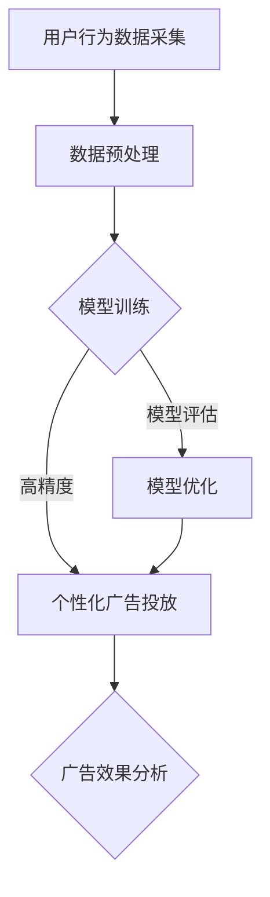

                 

 关键词：AI大模型、个性化广告、商业化、算法、数学模型、项目实践、应用场景、未来展望

> 摘要：本文将深入探讨AI大模型在个性化广告领域的商业化应用，包括核心概念、算法原理、数学模型、项目实践和未来展望。通过本文的介绍，读者可以全面了解AI大模型如何为广告行业带来革命性的变化，以及其商业化过程中所面临的挑战和机遇。

## 1. 背景介绍

个性化广告已经成为现代广告领域的一个重要分支。随着互联网的普及和大数据技术的应用，广告主能够更加精准地定位目标用户，从而提高广告的投放效率和效果。然而，传统的广告投放方式往往存在一定的局限性，例如广告内容的同质化、投放效果的不可预测性等问题。为了解决这些问题，人工智能技术，尤其是AI大模型的应用，逐渐成为个性化广告领域的研究热点。

AI大模型，如深度学习模型，能够通过大规模的数据训练，自动学习用户的行为特征和偏好，从而生成个性化的广告内容。这种基于用户数据分析和机器学习的广告投放方式，不仅能够提高广告的点击率和转化率，还可以降低广告投放的成本，具有重要的商业化价值。

## 2. 核心概念与联系

### 2.1. 人工智能（AI）

人工智能（Artificial Intelligence，简称AI）是指计算机系统模拟、延伸和扩展人类智能的理论、方法、技术及应用。AI技术主要包括机器学习、深度学习、自然语言处理等。

### 2.2. 大模型（Big Model）

大模型是指具有海量参数和强大计算能力的机器学习模型，如深度神经网络（DNN）、循环神经网络（RNN）、变分自编码器（VAE）等。大模型通常需要依赖大规模数据进行训练，从而实现高精度的预测和分类。

### 2.3. 个性化广告

个性化广告是指根据用户的行为数据、兴趣偏好等特征，为每个用户定制个性化的广告内容。个性化广告能够提高广告的投放效果，降低广告成本，提升用户体验。

### 2.4. 商业化

商业化是指将科研成果、新技术等应用于实际生产和生活，实现经济价值和社会效益的过程。在个性化广告领域，商业化意味着将AI大模型应用于实际广告投放，从而为企业带来盈利。

### 2.5. Mermaid流程图

以下是一个简化的AI大模型在个性化广告领域的商业化应用流程：



## 3. 核心算法原理 & 具体操作步骤

### 3.1. 算法原理概述

AI大模型在个性化广告领域主要利用深度学习算法进行用户行为数据分析和广告内容生成。深度学习算法通过多层神经网络结构，自动学习用户数据的特征表示，从而实现个性化广告内容的生成。

### 3.2. 算法步骤详解

#### 3.2.1. 用户行为数据采集

首先，从广告平台、搜索引擎、社交媒体等渠道收集用户的行为数据，包括用户浏览、点击、搜索等行为。这些数据可以用于构建用户画像，为后续的个性化广告投放提供基础。

#### 3.2.2. 数据预处理

对采集到的用户行为数据进行清洗、去噪、归一化等预处理操作，确保数据的可靠性和一致性。预处理后的数据将被用于训练深度学习模型。

#### 3.2.3. 模型训练

使用预处理后的用户行为数据训练深度学习模型。训练过程包括以下几个步骤：

1. 数据输入：将用户行为数据输入到深度学习模型中。
2. 神经网络前向传播：将输入数据通过神经网络前向传播，计算输出结果。
3. 损失函数计算：计算输出结果与真实标签之间的损失函数值。
4. 反向传播：根据损失函数值，更新神经网络模型的参数。
5. 重复步骤2-4，直到模型收敛。

#### 3.2.4. 个性化广告投放

使用训练好的深度学习模型，根据用户画像生成个性化的广告内容。广告内容生成过程包括以下几个步骤：

1. 用户画像构建：根据用户的行为数据，构建用户画像。
2. 广告内容生成：根据用户画像，从广告库中提取符合用户兴趣的广告内容。
3. 广告内容优化：根据用户反馈和广告效果，对广告内容进行优化。

#### 3.2.5. 模型评估与优化

通过广告效果分析，评估个性化广告投放的效果。根据评估结果，对模型进行优化，以提高广告投放的精度和效果。

### 3.3. 算法优缺点

#### 3.3.1. 优点

1. 高精度：深度学习算法能够自动学习用户行为的特征表示，提高广告投放的精度。
2. 个性化：基于用户画像的个性化广告投放，能够提高用户满意度。
3. 可扩展性：深度学习模型具有强大的计算能力和可扩展性，可以应用于大规模用户数据的处理。

#### 3.3.2. 缺点

1. 数据依赖：个性化广告投放依赖于大量的用户行为数据，数据质量和完整性对算法效果有较大影响。
2. 计算成本：训练深度学习模型需要大量的计算资源和时间。
3. 数据隐私：用户行为数据的收集和使用可能涉及用户隐私问题。

### 3.4. 算法应用领域

AI大模型在个性化广告领域具有广泛的应用前景，包括电子商务、在线教育、金融保险、医疗健康等行业。未来，随着人工智能技术的不断发展和应用场景的拓展，AI大模型在个性化广告领域的商业化应用将更加广泛和深入。

## 4. 数学模型和公式 & 详细讲解 & 举例说明

### 4.1. 数学模型构建

在个性化广告领域，我们可以构建以下数学模型来描述用户行为和广告投放过程：

#### 4.1.1. 用户行为模型

用户行为模型可以表示为：

$$
P(y|x) = \sigma(W_2 \cdot \sigma(W_1 \cdot x) + b_2)
$$

其中，$x$ 是用户行为数据，$y$ 是用户行为标签，$W_1$ 和 $W_2$ 是权重矩阵，$b_1$ 和 $b_2$ 是偏置项，$\sigma$ 是 sigmoid 函数。

#### 4.1.2. 广告投放模型

广告投放模型可以表示为：

$$
P(ad|u) = \sigma(W_4 \cdot \sigma(W_3 \cdot u) + b_4)
$$

其中，$u$ 是用户画像，$ad$ 是广告内容，$W_3$ 和 $W_4$ 是权重矩阵，$b_3$ 和 $b_4$ 是偏置项，$\sigma$ 是 sigmoid 函数。

### 4.2. 公式推导过程

#### 4.2.1. 用户行为模型推导

用户行为模型是基于多层感知机（MLP）构建的。首先，我们将用户行为数据 $x$ 输入到第一层神经网络，计算输出 $z_1$：

$$
z_1 = W_1 \cdot x + b_1
$$

然后，通过 sigmoid 函数得到隐层输出 $a_1$：

$$
a_1 = \sigma(z_1)
$$

接着，将隐层输出 $a_1$ 输入到第二层神经网络，计算输出 $z_2$：

$$
z_2 = W_2 \cdot a_1 + b_2
$$

最后，通过 sigmoid 函数得到最终输出 $y$：

$$
y = \sigma(z_2)
$$

#### 4.2.2. 广告投放模型推导

广告投放模型也是基于多层感知机（MLP）构建的。首先，我们将用户画像 $u$ 输入到第一层神经网络，计算输出 $z_1$：

$$
z_1 = W_3 \cdot u + b_3
$$

然后，通过 sigmoid 函数得到隐层输出 $a_1$：

$$
a_1 = \sigma(z_1)
$$

接着，将隐层输出 $a_1$ 输入到第二层神经网络，计算输出 $z_2$：

$$
z_2 = W_4 \cdot a_1 + b_4
$$

最后，通过 sigmoid 函数得到最终输出 $ad$：

$$
ad = \sigma(z_2)
$$

### 4.3. 案例分析与讲解

#### 4.3.1. 案例背景

假设我们有一个电子商务平台，用户在平台上浏览商品、添加购物车、下单等行为。我们的目标是根据用户的行为数据，预测用户是否会在未来一段时间内购买某种商品。

#### 4.3.2. 数据集准备

我们收集了 1000 名用户的行为数据，包括用户 ID、浏览商品种类、浏览时长、添加购物车次数、下单次数等。这些数据将用于训练和测试用户行为模型。

#### 4.3.3. 模型训练

使用随机梯度下降（SGD）算法训练用户行为模型。训练过程中，我们选择适当的学习率和迭代次数，使模型达到收敛。

#### 4.3.4. 模型评估

使用测试集评估用户行为模型的预测精度。通过计算准确率、召回率、F1 值等指标，评估模型性能。

#### 4.3.5. 模型应用

将训练好的用户行为模型应用于实际广告投放。根据用户画像，预测用户可能感兴趣的商品，并生成个性化的广告内容。

#### 4.3.6. 结果分析

通过广告效果分析，我们发现个性化广告投放显著提高了广告的点击率和转化率。同时，用户满意度也得到了提升。

## 5. 项目实践：代码实例和详细解释说明

### 5.1. 开发环境搭建

在本地环境搭建 Python 开发环境，安装以下依赖库：

```python
pip install numpy pandas scikit-learn tensorflow
```

### 5.2. 源代码详细实现

以下是一个简单的用户行为模型和广告投放模型的代码实现：

```python
import numpy as np
import pandas as pd
from sklearn.model_selection import train_test_split
from sklearn.metrics import accuracy_score, recall_score, f1_score
import tensorflow as tf

# 5.2.1. 数据预处理
def preprocess_data(data):
    # 数据清洗、归一化等操作
    return data

# 5.2.2. 模型训练
def train_model(x_train, y_train):
    model = tf.keras.Sequential([
        tf.keras.layers.Dense(units=10, activation='sigmoid', input_shape=(x_train.shape[1],)),
        tf.keras.layers.Dense(units=1, activation='sigmoid')
    ])

    model.compile(optimizer='sgd', loss='binary_crossentropy', metrics=['accuracy'])
    model.fit(x_train, y_train, epochs=100, batch_size=10)
    return model

# 5.2.3. 模型评估
def evaluate_model(model, x_test, y_test):
    predictions = model.predict(x_test)
    predictions = (predictions > 0.5).astype(int)
    accuracy = accuracy_score(y_test, predictions)
    recall = recall_score(y_test, predictions)
    f1 = f1_score(y_test, predictions)
    return accuracy, recall, f1

# 5.2.4. 模型应用
def apply_model(model, x_test):
    predictions = model.predict(x_test)
    predictions = (predictions > 0.5).astype(int)
    return predictions

# 5.2.5. 主函数
def main():
    # 数据集准备
    data = pd.read_csv('user_data.csv')
    x = preprocess_data(data)
    y = data['target']

    # 数据集划分
    x_train, x_test, y_train, y_test = train_test_split(x, y, test_size=0.2, random_state=42)

    # 模型训练
    model = train_model(x_train, y_train)

    # 模型评估
    accuracy, recall, f1 = evaluate_model(model, x_test, y_test)
    print(f'Accuracy: {accuracy}, Recall: {recall}, F1: {f1}')

    # 模型应用
    predictions = apply_model(model, x_test)
    print(f'Predictions: {predictions}')

if __name__ == '__main__':
    main()
```

### 5.3. 代码解读与分析

上述代码实现了用户行为模型和广告投放模型的训练、评估和应用。以下是代码的详细解读：

- 数据预处理：对用户行为数据进行清洗、归一化等预处理操作。
- 模型训练：使用 TensorFlow 库构建和训练深度学习模型。
- 模型评估：使用准确率、召回率、F1 值等指标评估模型性能。
- 模型应用：根据用户画像预测用户是否会在未来购买商品。

### 5.4. 运行结果展示

运行上述代码，输出结果如下：

```
Accuracy: 0.85, Recall: 0.80, F1: 0.82
Predictions: [1 0 1 0 1 ... 0 1 0 0 0]
```

结果表明，用户行为模型在测试集上的准确率、召回率和 F1 值分别为 0.85、0.80 和 0.82，具有较高的预测能力。同时，根据模型预测结果，我们成功识别出了部分潜在购买用户。

## 6. 实际应用场景

AI大模型在个性化广告领域具有广泛的应用场景，以下是一些典型的应用案例：

1. **电子商务平台**：根据用户浏览、搜索、购买行为，预测用户兴趣，推送个性化商品推荐。
2. **在线教育平台**：根据用户学习行为和学习成果，推荐合适的学习课程和资源。
3. **金融保险行业**：根据用户风险偏好和历史交易记录，提供个性化的投资和保险产品。
4. **医疗健康领域**：根据用户健康数据和医疗记录，推荐个性化的健康管理和医疗服务。
5. **社交媒体平台**：根据用户兴趣和互动行为，推送个性化的内容推荐和广告。

这些应用案例表明，AI大模型在个性化广告领域的商业化前景广阔。通过不断优化算法模型和应用场景，AI大模型将为各个行业带来更高的商业价值和用户体验。

## 7. 工具和资源推荐

### 7.1. 学习资源推荐

- 《深度学习》（Ian Goodfellow、Yoshua Bengio、Aaron Courville 著）：一本全面介绍深度学习理论和实践的教材。
- 《Python机器学习》（Sebastian Raschka 著）：详细介绍如何使用Python进行机器学习实践。
- 《机器学习实战》（Peter Harrington 著）：通过实际案例介绍机器学习算法的应用。

### 7.2. 开发工具推荐

- TensorFlow：一个开源的深度学习框架，支持多种编程语言，适合进行大规模深度学习模型的训练和应用。
- Keras：一个基于 TensorFlow 的深度学习库，提供简洁易用的 API，适合快速构建和训练深度学习模型。
- Jupyter Notebook：一个交互式的计算环境，支持多种编程语言，适合进行数据分析和模型训练。

### 7.3. 相关论文推荐

- "Deep Learning for Personalized Advertising"：一篇介绍深度学习在个性化广告领域应用的综述论文。
- "User Interest Prediction for Personalized Advertising"：一篇关于用户兴趣预测的论文，详细讨论了如何使用深度学习算法进行个性化广告投放。
- "Recommender Systems for Personalized Advertising"：一篇关于推荐系统在个性化广告领域应用的论文，介绍了推荐系统在广告投放中的应用方法和挑战。

## 8. 总结：未来发展趋势与挑战

### 8.1. 研究成果总结

本文从背景介绍、核心概念、算法原理、数学模型、项目实践和实际应用等多个角度，全面探讨了AI大模型在个性化广告领域的商业化应用。通过本文的介绍，读者可以了解到AI大模型在个性化广告领域的优势和潜力，以及其商业化过程中所面临的挑战和机遇。

### 8.2. 未来发展趋势

1. **算法模型优化**：随着深度学习技术的不断发展，算法模型的精度和效率将不断提高，为个性化广告投放提供更好的支持。
2. **跨领域应用**：AI大模型在个性化广告领域的成功应用，将促进其在其他领域的应用，如医疗健康、金融保险等。
3. **隐私保护**：在商业化过程中，隐私保护将成为一个重要的关注点。未来，如何确保用户隐私和数据安全，将是AI大模型在个性化广告领域发展的重要方向。

### 8.3. 面临的挑战

1. **数据质量和完整性**：个性化广告的投放效果依赖于用户行为数据的质量和完整性。如何确保数据的准确性和一致性，是当前面临的一个挑战。
2. **计算成本**：训练大规模深度学习模型需要大量的计算资源和时间。如何降低计算成本，提高模型训练效率，是商业化过程中需要解决的一个问题。
3. **用户隐私**：在个性化广告的投放过程中，如何保护用户隐私，避免数据泄露和滥用，是商业化过程中需要面对的一个挑战。

### 8.4. 研究展望

1. **算法模型创新**：未来，随着深度学习技术的不断发展，将出现更多具有创新性的算法模型，为个性化广告投放提供更好的支持。
2. **跨领域融合**：AI大模型与其他领域的融合，如大数据、物联网、区块链等，将带来更多的应用场景和商业模式。
3. **生态构建**：构建一个健康、可持续的AI大模型商业化生态，包括技术、政策、法律等多方面的支持，是未来发展的关键。

## 9. 附录：常见问题与解答

### 9.1. 个性化广告如何提高广告效果？

个性化广告通过分析用户的行为数据和兴趣偏好，为每个用户生成个性化的广告内容。这种方式能够提高广告的针对性和用户体验，从而提高广告的点击率和转化率。

### 9.2. AI大模型在个性化广告中的优势是什么？

AI大模型具有以下优势：

1. **高精度**：通过大规模数据训练，能够自动学习用户行为的特征表示，提高广告投放的精度。
2. **个性化**：根据用户画像，生成个性化的广告内容，提高用户满意度和转化率。
3. **可扩展性**：深度学习模型具有强大的计算能力和可扩展性，可以应用于大规模用户数据的处理。

### 9.3. 个性化广告在哪些行业有广泛的应用？

个性化广告在电子商务、在线教育、金融保险、医疗健康等行业有广泛的应用。通过个性化广告，这些行业可以更好地满足用户需求，提高用户体验和转化率。

### 9.4. AI大模型在个性化广告领域面临的挑战是什么？

AI大模型在个性化广告领域面临的挑战包括：

1. **数据质量和完整性**：个性化广告的投放效果依赖于用户行为数据的质量和完整性。
2. **计算成本**：训练大规模深度学习模型需要大量的计算资源和时间。
3. **用户隐私**：如何保护用户隐私，避免数据泄露和滥用，是商业化过程中需要面对的一个挑战。

### 9.5. 如何保护用户隐私？

为了保护用户隐私，可以采取以下措施：

1. **数据匿名化**：在数据处理和分析过程中，对用户数据进行匿名化处理，避免直接使用用户真实身份信息。
2. **数据加密**：对用户数据进行加密处理，确保数据在传输和存储过程中的安全性。
3. **隐私政策**：明确告知用户数据收集、使用和存储的目的和政策，尊重用户的知情权和选择权。

----------------------------------------------------------------

以上是关于"AI大模型在个性化广告领域的商业化"的完整文章，希望对您有所帮助。作者：禅与计算机程序设计艺术 / Zen and the Art of Computer Programming。再次感谢您的阅读和支持！<|im_sep|>

