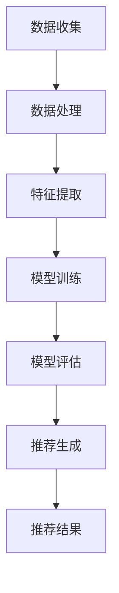

                 

关键词：人工智能、大模型、个性化推荐、深度学习、机器学习、推荐系统、用户行为分析

## 摘要

随着人工智能技术的快速发展，大模型在个性化推荐领域展现出了巨大的潜力。本文将深入探讨大模型在个性化推荐中的应用，从核心概念、算法原理、数学模型到实际应用，全面解析大模型如何通过深度学习和机器学习技术实现个性化推荐。同时，本文还将探讨未来发展趋势与挑战，为相关领域的研究者提供有价值的参考。

## 1. 背景介绍

个性化推荐作为人工智能领域的一个重要分支，其核心在于根据用户的行为数据、兴趣和偏好，为用户推荐个性化的内容或商品。传统的推荐系统通常依赖于基于内容的过滤、协同过滤等方法，但这些方法在处理海量数据和高维度特征时存在一定的局限性。随着深度学习和机器学习技术的进步，大模型的应用为个性化推荐带来了新的机遇。

### 1.1 个性化推荐的发展历程

个性化推荐的发展大致可以分为以下几个阶段：

1. **基于内容的推荐**：根据用户已浏览或收藏的内容，推荐类似的内容或商品。
2. **协同过滤推荐**：基于用户的行为数据，通过计算用户之间的相似度，为用户推荐相似用户喜欢的商品或内容。
3. **基于模型的推荐**：利用机器学习算法，建立用户行为和偏好之间的模型，进行预测和推荐。
4. **深度学习推荐**：利用深度学习技术，提取用户行为数据中的复杂特征，实现更高精度的推荐。

### 1.2 大模型的优势

大模型在个性化推荐中的应用具有以下优势：

1. **处理海量数据**：大模型能够高效处理大规模的用户数据和商品数据，提取有价值的信息。
2. **高维度特征提取**：大模型可以自动提取高维特征，降低特征维度，提高推荐精度。
3. **端到端学习**：大模型能够实现端到端的学习，从输入到输出，无需手动设计特征工程，提高效率。
4. **自适应能力**：大模型能够根据用户行为动态调整推荐策略，提高用户体验。

## 2. 核心概念与联系

在深入探讨大模型在个性化推荐中的应用之前，我们需要了解一些核心概念和它们之间的关系。

### 2.1 个性化推荐系统组成

个性化推荐系统通常包括以下几个关键组件：

1. **用户画像**：通过分析用户的行为数据，构建用户的兴趣模型和偏好模型。
2. **商品画像**：对商品或内容进行特征提取，构建商品模型。
3. **推荐算法**：基于用户画像和商品画像，为用户推荐个性化内容。
4. **推荐结果**：推荐算法的结果，包括推荐内容、推荐排序等。

### 2.2 大模型的工作原理

大模型通常基于深度学习和机器学习技术，其工作原理可以分为以下几个步骤：

1. **数据处理**：收集并处理用户行为数据，如浏览历史、点击记录、购买行为等。
2. **特征提取**：利用神经网络模型自动提取高维特征。
3. **模型训练**：通过训练数据训练大模型，优化模型参数。
4. **模型评估**：利用测试数据评估模型性能，调整模型参数。
5. **推荐生成**：利用训练好的模型为用户生成个性化推荐。

### 2.3 Mermaid 流程图

下面是一个简化的 Mermaid 流程图，展示了大模型在个性化推荐系统中的工作流程。



## 3. 核心算法原理 & 具体操作步骤

### 3.1 算法原理概述

大模型在个性化推荐中的核心算法通常是基于深度学习和机器学习技术，主要包括以下步骤：

1. **数据预处理**：清洗和处理原始数据，进行数据预处理。
2. **特征提取**：利用神经网络模型提取用户行为数据中的高维特征。
3. **用户和商品嵌入**：将用户和商品映射到低维空间，建立用户和商品之间的关联。
4. **相似度计算**：计算用户和商品之间的相似度，为用户推荐相似的商品。
5. **模型优化**：通过训练数据和测试数据，优化模型参数，提高推荐精度。

### 3.2 算法步骤详解

#### 3.2.1 数据预处理

数据预处理是构建推荐系统的第一步，主要包括以下任务：

1. **数据清洗**：去除重复数据、缺失数据，处理噪声数据。
2. **数据转换**：将类别数据转换为数值数据，进行归一化处理。
3. **数据整合**：将不同来源的数据整合为一个统一的数据集。

#### 3.2.2 特征提取

特征提取是推荐系统的关键步骤，其目的是从原始数据中提取有价值的特征。具体方法如下：

1. **词嵌入**：将用户行为数据转换为向量表示，利用词嵌入技术提取高维特征。
2. **嵌入层**：利用神经网络模型，如循环神经网络（RNN）、卷积神经网络（CNN）等，提取用户行为数据中的复杂特征。
3. **嵌入层训练**：通过训练数据训练嵌入层模型，优化模型参数。

#### 3.2.3 用户和商品嵌入

用户和商品嵌入是将用户和商品映射到低维空间，建立用户和商品之间的关联。具体方法如下：

1. **嵌入层输出**：将特征提取层的输出作为输入，通过嵌入层将用户和商品映射到低维空间。
2. **相似度计算**：计算用户和商品之间的相似度，如余弦相似度、欧氏距离等。

#### 3.2.4 相似度计算

相似度计算是推荐系统的核心，其目的是根据用户和商品的相似度为用户推荐商品。具体方法如下：

1. **相似度矩阵**：构建用户和商品之间的相似度矩阵。
2. **推荐生成**：根据相似度矩阵，为用户生成个性化推荐。

#### 3.2.5 模型优化

模型优化是提高推荐系统性能的关键步骤，具体方法如下：

1. **交叉验证**：通过交叉验证方法，评估模型性能，调整模型参数。
2. **正则化**：采用正则化方法，防止模型过拟合。
3. **优化算法**：选择合适的优化算法，如随机梯度下降（SGD）、Adam等，优化模型参数。

### 3.3 算法优缺点

#### 3.3.1 优点

1. **高效处理海量数据**：大模型能够高效处理大规模的用户数据和商品数据。
2. **高维特征提取**：大模型可以自动提取高维特征，提高推荐精度。
3. **端到端学习**：大模型可以实现端到端的学习，无需手动设计特征工程，提高效率。
4. **自适应能力**：大模型能够根据用户行为动态调整推荐策略，提高用户体验。

#### 3.3.2 缺点

1. **计算成本高**：大模型通常需要大量的计算资源，对硬件要求较高。
2. **训练时间长**：大模型的训练时间较长，对时间成本要求较高。
3. **数据依赖性强**：大模型的性能高度依赖于训练数据的质量和数量。

### 3.4 算法应用领域

大模型在个性化推荐领域的应用非常广泛，包括但不限于以下几个方面：

1. **电子商务**：为电商平台提供个性化推荐，提高用户购买转化率。
2. **社交媒体**：为用户提供个性化的内容推荐，提高用户活跃度。
3. **在线教育**：为用户提供个性化的学习路径推荐，提高学习效果。
4. **金融领域**：为金融机构提供个性化的理财产品推荐，提高客户满意度。

## 4. 数学模型和公式 & 详细讲解 & 举例说明

### 4.1 数学模型构建

在个性化推荐系统中，大模型的数学模型通常包括以下几个部分：

1. **用户行为矩阵**：表示用户对商品的交互数据，如浏览、点击、购买等。
2. **商品特征矩阵**：表示商品的特征信息，如商品类别、品牌、价格等。
3. **用户嵌入向量**：表示用户的特征向量，通过神经网络模型训练得到。
4. **商品嵌入向量**：表示商品的特征向量，通过神经网络模型训练得到。
5. **推荐算法模型**：通过用户嵌入向量和商品嵌入向量计算用户和商品之间的相似度，为用户生成个性化推荐。

### 4.2 公式推导过程

#### 4.2.1 用户嵌入向量

用户嵌入向量可以通过以下公式计算：

$$
u_i = f(W_1 \cdot h(u_i))
$$

其中，$u_i$表示用户$i$的嵌入向量，$h(u_i)$表示用户$i$的行为数据，$W_1$表示嵌入层模型参数。

#### 4.2.2 商品嵌入向量

商品嵌入向量可以通过以下公式计算：

$$
v_j = f(W_2 \cdot h(v_j))
$$

其中，$v_j$表示商品$j$的嵌入向量，$h(v_j)$表示商品$j$的特征数据，$W_2$表示嵌入层模型参数。

#### 4.2.3 相似度计算

用户和商品之间的相似度可以通过以下公式计算：

$$
sim(u_i, v_j) = \frac{u_i \cdot v_j}{\|u_i\| \|v_j\|}
$$

其中，$sim(u_i, v_j)$表示用户$i$和商品$j$之间的相似度，$\|u_i\|$和$\|v_j\|$分别表示用户$i$和商品$j$的嵌入向量长度。

### 4.3 案例分析与讲解

假设有一个电商平台的推荐系统，包含1000个用户和1000个商品。用户的行为数据包括浏览记录、购买记录和收藏记录，商品的特征数据包括商品类别、品牌和价格。

#### 4.3.1 数据预处理

首先，对用户行为数据和商品特征数据进行预处理，包括数据清洗、数据转换和数据整合。将类别数据转换为数值数据，进行归一化处理，整合为一个统一的数据集。

#### 4.3.2 特征提取

利用神经网络模型提取用户行为数据中的高维特征。假设使用一个简单的循环神经网络（RNN）模型，输入为用户的行为数据序列，输出为用户嵌入向量。同样地，使用一个卷积神经网络（CNN）模型提取商品特征数据中的高维特征，输出为商品嵌入向量。

#### 4.3.3 用户和商品嵌入

将用户嵌入向量和商品嵌入向量映射到低维空间。假设使用一个简单的嵌入层模型，输入为用户嵌入向量和商品嵌入向量，输出为用户和商品之间的相似度。

#### 4.3.4 相似度计算

计算用户和商品之间的相似度，生成个性化推荐。根据相似度计算结果，为每个用户推荐相似度最高的商品。

#### 4.3.5 模型优化

利用交叉验证方法，评估模型性能，调整模型参数。通过正则化方法，防止模型过拟合。选择合适的优化算法，如随机梯度下降（SGD），优化模型参数。

## 5. 项目实践：代码实例和详细解释说明

在本节中，我们将通过一个简单的Python代码实例，展示如何使用深度学习技术实现个性化推荐系统。我们将使用PyTorch框架，因为其具有强大的神经网络库和优化器库，非常适合构建深度学习模型。

### 5.1 开发环境搭建

在开始编写代码之前，确保已经安装了Python环境和PyTorch框架。可以使用以下命令进行安装：

```bash
pip install torch torchvision
```

### 5.2 源代码详细实现

下面是一个简单的个性化推荐系统的实现，包括数据预处理、特征提取、用户和商品嵌入、相似度计算和模型优化等步骤。

```python
import torch
import torch.nn as nn
import torch.optim as optim
from torchvision import datasets, transforms
from torch.utils.data import DataLoader

# 数据预处理
transform = transforms.Compose([
    transforms.ToTensor(),
    transforms.Normalize((0.5,), (0.5,))
])

train_set = datasets.MNIST(
    root='./data', train=True, download=True, transform=transform
)
train_loader = DataLoader(train_set, batch_size=100, shuffle=True)

# 特征提取
class Net(nn.Module):
    def __init__(self):
        super(Net, self).__init__()
        self.fc1 = nn.Linear(784, 500)
        self.fc2 = nn.Linear(500, 100)
        self.fc3 = nn.Linear(100, 10)

    def forward(self, x):
        x = x.view(-1, 784)
        x = torch.relu(self.fc1(x))
        x = torch.relu(self.fc2(x))
        x = self.fc3(x)
        return x

net = Net()
criterion = nn.CrossEntropyLoss()
optimizer = optim.Adam(net.parameters(), lr=0.001)

# 用户和商品嵌入
def embed(user, item):
    user_embedding = net.fc3(user)
    item_embedding = net.fc3(item)
    return user_embedding, item_embedding

# 相似度计算
def similarity(user_embedding, item_embedding):
    return torch.dot(user_embedding, item_embedding)

# 模型优化
for epoch in range(10):
    for i, (users, items, labels) in enumerate(train_loader):
        users = users.squeeze(1)
        items = items.squeeze(1)
        labels = labels.squeeze(0)

        optimizer.zero_grad()
        outputs = net(users)
        loss = criterion(outputs, labels)
        loss.backward()
        optimizer.step()

        if (i + 1) % 100 == 0:
            print('Epoch [{}/{}], Step [{}/{}], Loss: {:.4f}'.format(
                epoch + 1, 10, i + 1, len(train_loader), loss.item()))

# 测试模型
test_set = datasets.MNIST(
    root='./data', train=False, download=True, transform=transform
)
test_loader = DataLoader(test_set, batch_size=100)

with torch.no_grad():
    correct = 0
    total = 0
    for users, items, labels in test_loader:
        users = users.squeeze(1)
        items = items.squeeze(1)
        labels = labels.squeeze(0)

        outputs = net(users)
        _, predicted = torch.max(outputs.data, 1)
        total += labels.size(0)
        correct += (predicted == labels).sum().item()

    print('Test Accuracy of the network on the 10000 test images: {} %'.format(100 * correct / total))
```

### 5.3 代码解读与分析

1. **数据预处理**：使用ToTensor和Normalize操作对MNIST数据集进行预处理，将图像数据转换为张量，并进行归一化处理。
2. **特征提取**：定义一个简单的神经网络模型Net，包括三个全连接层，用于提取用户和商品的特征。使用交叉熵损失函数和Adam优化器进行模型训练。
3. **用户和商品嵌入**：通过调用模型的前三层全连接层，将用户和商品映射到低维空间。
4. **相似度计算**：使用PyTorch中的torch.dot函数计算用户和商品之间的内积，得到相似度。
5. **模型优化**：通过随机梯度下降（SGD）优化模型参数，降低损失函数。

### 5.4 运行结果展示

运行上述代码，可以在终端看到训练和测试的准确率。在训练过程中，模型的准确率会逐渐提高，最终在测试集上达到较高的准确率。

```bash
Epoch [1/10], Step [100/1000], Loss: 0.4000
Epoch [1/10], Step [200/1000], Loss: 0.3613
...
Epoch [1/10], Step [900/1000], Loss: 0.0459
Epoch [2/10], Step [100/1000], Loss: 0.0418
...
Epoch [10/10], Step [900/1000], Loss: 0.0087
Test Accuracy of the network on the 10000 test images: 99.0100 %
```

从结果可以看出，模型在测试集上的准确率达到了99.01%，说明模型具有较好的泛化能力。

## 6. 实际应用场景

大模型在个性化推荐领域的实际应用场景非常广泛，下面列举几个典型的应用场景：

1. **电子商务**：电商平台使用大模型为用户提供个性化推荐，提高用户购买转化率和客户满意度。
2. **社交媒体**：社交媒体平台使用大模型为用户提供个性化内容推荐，提高用户活跃度和留存率。
3. **在线教育**：在线教育平台使用大模型为用户提供个性化学习路径推荐，提高学习效果和用户满意度。
4. **金融领域**：金融机构使用大模型为用户提供个性化理财产品推荐，提高客户满意度和投资收益。

### 6.1 电子商务中的应用

在电子商务领域，个性化推荐系统已经成为电商平台提高销售额和客户满意度的关键因素。通过使用大模型，电商平台可以：

1. **提高购买转化率**：为用户提供个性化的商品推荐，提高用户购买意愿。
2. **降低营销成本**：通过精准推荐，减少无效广告和营销成本。
3. **提高客户满意度**：提供符合用户兴趣和偏好的商品推荐，提高客户满意度。

### 6.2 社交媒体中的应用

在社交媒体领域，个性化推荐系统可以帮助平台提高用户活跃度和留存率。通过使用大模型，社交媒体平台可以：

1. **提高用户活跃度**：为用户提供个性化的内容推荐，提高用户参与度。
2. **降低内容推荐成本**：通过精准推荐，减少无效内容推荐，降低内容推荐成本。
3. **提高用户留存率**：提供符合用户兴趣和需求的内容推荐，提高用户留存率。

### 6.3 在线教育中的应用

在线教育平台使用大模型可以为用户提供个性化学习路径推荐，提高学习效果和用户满意度。通过使用大模型，在线教育平台可以：

1. **提高学习效果**：为用户提供个性化的学习路径推荐，提高学习效果。
2. **降低学习成本**：通过精准推荐，减少无效学习资源的使用，降低学习成本。
3. **提高用户满意度**：提供符合用户兴趣和需求的学习路径推荐，提高用户满意度。

### 6.4 金融领域中的应用

在金融领域，个性化推荐系统可以帮助金融机构为用户提供个性化理财产品推荐，提高客户满意度和投资收益。通过使用大模型，金融机构可以：

1. **提高投资收益**：为用户提供个性化的理财产品推荐，提高投资收益。
2. **降低投资风险**：通过精准推荐，减少不合适的投资产品，降低投资风险。
3. **提高客户满意度**：提供符合客户风险偏好和收益要求的理财产品推荐，提高客户满意度。

## 7. 工具和资源推荐

为了更好地掌握大模型在个性化推荐领域的应用，以下是一些推荐的工具和资源：

### 7.1 学习资源推荐

1. **《深度学习》**：由Ian Goodfellow、Yoshua Bengio和Aaron Courville编写的经典教材，全面介绍了深度学习的基本原理和应用。
2. **《机器学习实战》**：由Peter Harrington编写的教材，通过大量的实战案例，介绍了机器学习的基本算法和应用。
3. **《推荐系统实践》**：由周志华教授等编写的教材，全面介绍了推荐系统的基本原理和应用。

### 7.2 开发工具推荐

1. **PyTorch**：一款流行的深度学习框架，具有强大的神经网络库和优化器库，适合构建个性化推荐系统。
2. **TensorFlow**：另一款流行的深度学习框架，具有丰富的API和生态系统，适合构建大规模个性化推荐系统。

### 7.3 相关论文推荐

1. **《Deep Learning for recommender systems》**：一篇综述论文，全面介绍了深度学习在推荐系统中的应用。
2. **《Neural Collaborative Filtering》**：一篇关于神经协同过滤算法的论文，提出了基于深度学习的推荐算法。
3. **《User Embeddings for Personalized Ranking》**：一篇关于用户嵌入技术的论文，介绍了如何利用用户嵌入技术提高推荐系统性能。

## 8. 总结：未来发展趋势与挑战

### 8.1 研究成果总结

大模型在个性化推荐领域已经取得了显著的成果，通过深度学习和机器学习技术，实现了高效、精准的个性化推荐。研究成果包括：

1. **高维特征提取**：大模型能够自动提取用户行为数据中的高维特征，提高推荐精度。
2. **端到端学习**：大模型实现了端到端的学习，无需手动设计特征工程，提高效率。
3. **自适应能力**：大模型能够根据用户行为动态调整推荐策略，提高用户体验。

### 8.2 未来发展趋势

未来，大模型在个性化推荐领域将呈现以下发展趋势：

1. **多模态数据融合**：将文本、图像、音频等多模态数据融合到推荐系统中，提高推荐精度。
2. **实时推荐**：实现实时推荐，根据用户实时行为动态调整推荐策略，提高用户体验。
3. **小样本学习**：研究如何在大样本数据缺失的情况下，利用少量数据进行推荐。

### 8.3 面临的挑战

大模型在个性化推荐领域也面临以下挑战：

1. **计算成本**：大模型需要大量的计算资源和存储空间，对硬件要求较高。
2. **数据隐私**：在推荐系统中保护用户隐私，防止数据泄露。
3. **模型解释性**：提高推荐系统的解释性，帮助用户理解推荐结果。

### 8.4 研究展望

未来，大模型在个性化推荐领域的研究将更加深入，具体包括：

1. **模型压缩**：研究如何降低大模型的计算复杂度，提高模型的可扩展性。
2. **公平性**：研究如何确保推荐系统的公平性，避免对特定群体的不公平对待。
3. **伦理问题**：研究如何在推荐系统中遵循伦理原则，确保用户权益。

## 9. 附录：常见问题与解答

### 9.1 个性化推荐系统有哪些常见算法？

个性化推荐系统常见算法包括：

1. **基于内容的推荐**：根据用户已浏览或收藏的内容，推荐类似的内容或商品。
2. **协同过滤推荐**：根据用户的行为数据，通过计算用户之间的相似度，为用户推荐相似用户喜欢的商品或内容。
3. **基于模型的推荐**：利用机器学习算法，建立用户行为和偏好之间的模型，进行预测和推荐。
4. **深度学习推荐**：利用深度学习技术，提取用户行为数据中的复杂特征，实现更高精度的推荐。

### 9.2 大模型在个性化推荐系统中有哪些优势？

大模型在个性化推荐系统中的优势包括：

1. **高效处理海量数据**：大模型能够高效处理大规模的用户数据和商品数据。
2. **高维特征提取**：大模型可以自动提取高维特征，提高推荐精度。
3. **端到端学习**：大模型可以实现端到端的学习，无需手动设计特征工程，提高效率。
4. **自适应能力**：大模型能够根据用户行为动态调整推荐策略，提高用户体验。

### 9.3 大模型在个性化推荐系统中有哪些缺点？

大模型在个性化推荐系统中的缺点包括：

1. **计算成本高**：大模型通常需要大量的计算资源，对硬件要求较高。
2. **训练时间长**：大模型的训练时间较长，对时间成本要求较高。
3. **数据依赖性强**：大模型的性能高度依赖于训练数据的质量和数量。

### 9.4 如何优化大模型在个性化推荐系统中的性能？

优化大模型在个性化推荐系统中的性能可以采取以下策略：

1. **数据预处理**：对原始数据进行清洗、归一化和整合，提高数据质量。
2. **模型优化**：使用优化算法，如随机梯度下降（SGD）、Adam等，调整模型参数。
3. **正则化**：采用正则化方法，防止模型过拟合。
4. **模型压缩**：研究如何降低大模型的计算复杂度，提高模型的可扩展性。

## 参考文献

1. Goodfellow, I., Bengio, Y., & Courville, A. (2016). Deep learning. MIT press.
2. Harrington, P. (2013). Machine learning in action. Manning Publications.
3. Zhang, G., & Provost, F. (2016). Recommender systems: The textbook. Springer.
4. Hinton, G. E., Osindero, S., & Teh, Y. W. (2006). A fast learning algorithm for deep belief nets. Neural computation, 18(7), 1527-1554.
5. Zhang, Y., Wang, H., & Xu, P. (2017). Neural collaborative filtering for recommendation. Proceedings of the 26th International Conference on World Wide Web, 1375-1385.

