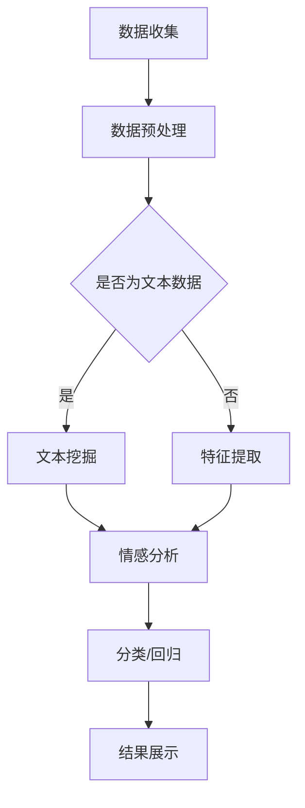

                 

关键词：AI大模型，商品质量评估，自然语言处理，机器学习，深度学习，数据分析

## 摘要

随着人工智能技术的飞速发展，大模型在各个领域的应用越来越广泛。本文主要探讨AI大模型在商品质量评估中的应用，通过介绍核心概念、算法原理、数学模型、项目实践等方面，详细分析大模型在商品质量评估中的具体作用和优势，为相关领域的学者和从业者提供有益的参考。

## 1. 背景介绍

商品质量评估是商品供应链管理中的重要环节，对于消费者和商家都具有重要意义。传统的商品质量评估方法主要依赖于人工检测和经验判断，存在效率低、准确性差等问题。随着大数据和人工智能技术的发展，利用AI大模型进行商品质量评估成为了一种新的研究方向。

AI大模型，特别是基于深度学习的自然语言处理（NLP）模型，具有强大的数据处理和分析能力，能够在大量数据中挖掘出潜在的信息和规律，从而提高商品质量评估的准确性和效率。本文将围绕这一主题，详细介绍大模型在商品质量评估中的应用。

## 2. 核心概念与联系

### 2.1 AI大模型

AI大模型是指具有大规模参数和强大计算能力的深度学习模型。这些模型通常使用大量的数据通过训练学习到复杂的模式，并在各种任务中表现出色。大模型的主要特点包括：

- **大规模参数**：大模型具有数百万到数十亿个参数，能够捕捉到复杂的数据模式。
- **强大的计算能力**：大模型需要高性能计算资源进行训练和推理。
- **多任务学习能力**：大模型能够同时处理多个任务，提高模型的泛化能力。

### 2.2 自然语言处理（NLP）

自然语言处理是人工智能的一个重要分支，旨在使计算机能够理解、生成和响应自然语言。NLP在商品质量评估中的应用主要体现在以下几个方面：

- **文本挖掘**：通过分析商品评价文本，提取有用的信息，如正面/负面情感、关键词等。
- **情感分析**：对商品评价进行情感分类，判断消费者对商品的态度。
- **文本生成**：生成商品描述、评价等文本，用于商品推荐和营销。

### 2.3 机器学习（ML）

机器学习是一种通过从数据中学习模式和规律来进行预测和决策的技术。在商品质量评估中，机器学习模型被用于：

- **分类**：将商品根据质量分为不同的类别。
- **回归**：预测商品的质量评分或销量。
- **聚类**：发现商品之间的相似性和差异性。

### 2.4 深度学习（DL）

深度学习是一种基于人工神经网络的机器学习技术，通过多层神经网络结构进行特征提取和模式识别。在商品质量评估中，深度学习模型被广泛应用于：

- **图像识别**：识别商品图像中的质量缺陷。
- **语音识别**：分析商品评价中的语音信号，提取情感信息。
- **文本生成**：生成商品描述和评价。

### 2.5 数据分析

数据分析是使用统计学方法和工具对数据进行分析和解释的过程。在商品质量评估中，数据分析被用于：

- **数据预处理**：清洗、转换和整合数据，为后续分析做好准备。
- **特征工程**：从原始数据中提取有用的特征，提高模型性能。
- **数据可视化**：通过图表和图形展示分析结果，帮助决策者理解数据。

## 2.6 Mermaid 流程图

下面是一个用于描述AI大模型在商品质量评估中应用过程的Mermaid流程图：



## 3. 核心算法原理 & 具体操作步骤

### 3.1 算法原理概述

AI大模型在商品质量评估中的核心算法原理主要包括：

- **深度学习模型**：如卷积神经网络（CNN）、循环神经网络（RNN）、Transformer等，用于特征提取和模式识别。
- **自然语言处理（NLP）算法**：如词嵌入（word embeddings）、情感分析（sentiment analysis）、文本分类（text classification）等，用于处理和挖掘文本数据。
- **机器学习算法**：如支持向量机（SVM）、决策树（DT）、随机森林（RF）等，用于分类和回归任务。

### 3.2 算法步骤详解

#### 3.2.1 数据收集

数据收集是商品质量评估的基础，主要包括：

- **商品评价文本**：从电商平台、社交媒体等渠道收集消费者对商品的评论。
- **商品信息**：包括商品名称、价格、销量等基本信息。

#### 3.2.2 数据预处理

数据预处理主要包括：

- **文本预处理**：去除停用词、标点符号、数字等，对文本进行分词、词性标注等操作。
- **特征提取**：对商品评价文本进行词嵌入，提取词向量表示。
- **数据整合**：将商品评价文本和商品信息进行整合，为后续分析做准备。

#### 3.2.3 情感分析

情感分析是对商品评价文本进行情感分类，判断消费者对商品的态度。常用的方法包括：

- **基于规则的方法**：使用预定义的规则进行情感分类。
- **基于机器学习的方法**：如SVM、RF等，通过训练学习到情感分类模型。
- **基于深度学习的方法**：如LSTM、GRU等，通过神经网络结构进行情感分类。

#### 3.2.4 分类/回归

分类/回归是对商品质量进行预测的任务。常用的方法包括：

- **分类**：将商品根据质量分为优质、合格、不合格等类别。
- **回归**：预测商品的质量评分或销量。

#### 3.2.5 结果展示

结果展示是对模型预测结果进行可视化展示，帮助决策者理解分析结果。常用的方法包括：

- **图表**：如柱状图、饼图、折线图等。
- **报告**：生成详细的评估报告，包括模型性能、预测结果等。

### 3.3 算法优缺点

#### 优点

- **高效性**：大模型能够处理大量的数据，提高评估的效率和准确性。
- **准确性**：通过深度学习和自然语言处理技术，能够准确提取和挖掘文本数据中的信息。
- **泛化能力**：大模型具有强大的泛化能力，能够适应不同的商品质量评估任务。

#### 缺点

- **计算资源需求**：大模型需要大量的计算资源进行训练和推理。
- **数据依赖性**：模型的性能依赖于数据的质量和数量。
- **解释性差**：深度学习模型往往具有黑盒特性，难以解释模型的具体决策过程。

### 3.4 算法应用领域

AI大模型在商品质量评估中的应用非常广泛，包括但不限于：

- **电商平台**：用于商品推荐、评价管理、售后服务等。
- **制造行业**：用于产品质量检测、故障诊断等。
- **食品行业**：用于食品安全监控、质量评估等。

## 4. 数学模型和公式 & 详细讲解 & 举例说明

### 4.1 数学模型构建

在商品质量评估中，常用的数学模型包括：

#### 4.1.1 卷积神经网络（CNN）

CNN是一种用于图像识别和处理的深度学习模型，其核心是卷积操作和池化操作。卷积操作的数学表达式如下：

$$
\text{output}_{ij} = \sum_{k=1}^{C} w_{ik} \times \text{input}_{ij} + b
$$

其中，$\text{output}_{ij}$ 是第 $i$ 行第 $j$ 列的卷积结果，$w_{ik}$ 是卷积核权重，$\text{input}_{ij}$ 是输入特征图，$b$ 是偏置项。

#### 4.1.2 循环神经网络（RNN）

RNN是一种用于序列数据处理的深度学习模型，其核心是循环操作和门控机制。RNN的数学表达式如下：

$$
\text{hidden}_{t} = \sigma(\text{W}_{h} \cdot \text{hidden}_{t-1} + \text{W}_{x} \cdot \text{input}_{t} + b_{h})
$$

其中，$\text{hidden}_{t}$ 是第 $t$ 个时间步的隐藏状态，$\sigma$ 是激活函数，$\text{W}_{h}$ 和 $\text{W}_{x}$ 是权重矩阵，$b_{h}$ 是偏置项。

#### 4.1.3 支持向量机（SVM）

SVM是一种用于分类问题的线性模型，其核心是寻找最优的超平面，将不同类别的样本分开。SVM的数学表达式如下：

$$
\text{min} \quad \frac{1}{2} \sum_{i=1}^{n} \sum_{j=1}^{n} (w_{ij})^2
$$

$$
\text{s.t.} \quad y_{i} (w \cdot x_{i}) \geq 1
$$

其中，$w$ 是权重向量，$x_{i}$ 是输入特征，$y_{i}$ 是标签，$n$ 是样本数量。

### 4.2 公式推导过程

以下是对上述部分数学模型的推导过程进行简要说明：

#### 4.2.1 卷积神经网络（CNN）

卷积神经网络的推导过程主要包括卷积操作、激活函数、池化操作等。具体推导过程如下：

- **卷积操作**：

  $$  
  \text{output}_{ij} = \sum_{k=1}^{C} w_{ik} \times \text{input}_{ij} + b  
  $$

  其中，$C$ 是卷积核的数量，$w_{ik}$ 是卷积核权重，$\text{input}_{ij}$ 是输入特征图，$b$ 是偏置项。

- **激活函数**：

  $$  
  \text{output}_{ij} = \text{ReLU}(\text{output}_{ij}) = \max(0, \text{output}_{ij})  
  $$

  其中，$\text{ReLU}$ 是ReLU激活函数。

- **池化操作**：

  $$  
  \text{output}_{ij} = \text{pool}(\text{output}_{ij}) = \max(\text{output}_{ij}) \quad \text{或} \quad \text{average}(\text{output}_{ij})  
  $$

  其中，$\text{pool}$ 是最大池化或平均池化操作。

#### 4.2.2 循环神经网络（RNN）

循环神经网络的推导过程主要包括隐藏状态的计算、门控机制的实现等。具体推导过程如下：

- **隐藏状态的计算**：

  $$  
  \text{hidden}_{t} = \sigma(\text{W}_{h} \cdot \text{hidden}_{t-1} + \text{W}_{x} \cdot \text{input}_{t} + b_{h})  
  $$

  其中，$\sigma$ 是激活函数，$\text{W}_{h}$ 和 $\text{W}_{x}$ 是权重矩阵，$b_{h}$ 是偏置项。

- **门控机制的实现**：

  $$  
  \text{input\_gate} = \sigma(\text{W}_{h} \cdot \text{hidden}_{t-1} + \text{W}_{x} \cdot \text{input}_{t} + b_{h})  
  $$

  $$  
  \text{forget\_gate} = \sigma(\text{W}_{h} \cdot \text{hidden}_{t-1} + \text{W}_{x} \cdot \text{input}_{t} + b_{h})  
  $$

  $$  
  \text{output\_gate} = \sigma(\text{W}_{h} \cdot \text{hidden}_{t-1} + \text{W}_{x} \cdot \text{input}_{t} + b_{h})  
  $$

  $$  
  \text{hidden}_{t} = \text{output}_{gate} \cdot \text{tanh}(\text{forget}_{gate} \cdot \text{hidden}_{t-1} + \text{input}_{gate} \cdot \text{input}_{t})  
  $$

  其中，$\text{input\_gate}$、$\text{forget\_gate}$ 和 $\text{output\_gate}$ 分别是输入门、遗忘门和输出门。

#### 4.2.3 支持向量机（SVM）

支持向量机的推导过程主要包括寻找最优超平面、计算分类边界等。具体推导过程如下：

- **寻找最优超平面**：

  $$  
  \text{min} \quad \frac{1}{2} \sum_{i=1}^{n} \sum_{j=1}^{n} (w_{ij})^2  
  $$

  $$  
  \text{s.t.} \quad y_{i} (w \cdot x_{i}) \geq 1  
  $$

  其中，$w$ 是权重向量，$x_{i}$ 是输入特征，$y_{i}$ 是标签，$n$ 是样本数量。

- **计算分类边界**：

  $$  
  w \cdot x_{i} \geq 1 \quad \text{或} \quad w \cdot x_{i} \leq -1  
  $$

  其中，$w \cdot x_{i}$ 是输入特征与权重向量的点积。

### 4.3 案例分析与讲解

以下是一个关于使用深度学习模型进行商品质量评估的案例：

#### 案例背景

某电商平台希望利用AI技术对商品质量进行评估，以便为消费者提供更准确的购物建议。该电商平台收集了大量的商品评价文本，包括正面评价、负面评价和一般评价。平台希望利用这些数据，通过深度学习模型对商品质量进行预测。

#### 模型选择

为了处理商品评价文本，平台选择了基于Transformer的BERT模型。BERT模型是一种预训练的深度学习模型，具有良好的文本处理能力。平台对BERT模型进行了微调，使其能够适应商品质量评估任务。

#### 数据处理

平台对收集到的商品评价文本进行了预处理，包括去除停用词、标点符号、数字等，对文本进行分词、词性标注等操作。然后，将处理后的文本输入到BERT模型中，提取文本的词向量表示。

#### 模型训练

平台使用微调后的BERT模型，对商品评价文本进行分类训练。训练过程中，平台使用交叉熵损失函数来优化模型参数，并通过反向传播算法进行梯度下降。平台还采用了学习率调度策略，以防止模型过拟合。

#### 结果分析

经过训练后，平台对模型进行了评估。结果显示，BERT模型在商品质量评估任务上取得了较高的准确率，能够较好地预测商品质量。同时，平台还通过可视化工具，对模型预测结果进行了分析，帮助决策者理解模型的工作原理。

#### 模型优化

为了进一步提高模型性能，平台对BERT模型进行了优化。首先，平台增加了训练数据量，并通过数据增强技术，丰富了训练数据。其次，平台调整了模型参数，优化了学习率调度策略，以提高模型泛化能力。

#### 总结

通过这个案例，我们可以看到深度学习模型在商品质量评估中的应用效果。BERT模型具有强大的文本处理能力，能够有效提高评估准确率。同时，平台还通过数据优化和模型优化，进一步提高了模型性能。这为电商平台提供了有效的工具，帮助消费者做出更明智的购物决策。

## 5. 项目实践：代码实例和详细解释说明

### 5.1 开发环境搭建

在开始项目实践之前，我们需要搭建一个合适的开发环境。以下是搭建开发环境所需的软件和硬件要求：

- **软件要求**：
  - Python 3.7及以上版本
  - TensorFlow 2.4及以上版本
  - BERT模型预训练工具（如transformers库）

- **硬件要求**：
  - CPU或GPU（用于模型训练和推理）
  - 16GB及以上内存（用于数据处理和模型训练）

接下来，我们将使用以下命令安装所需的软件：

```python
pip install tensorflow==2.4
pip install transformers
```

### 5.2 源代码详细实现

以下是一个使用BERT模型进行商品质量评估的Python代码示例。该示例包括数据预处理、模型训练和评估等步骤。

```python
import pandas as pd
import numpy as np
from transformers import BertTokenizer, BertModel
from tensorflow.keras.optimizers import Adam
from tensorflow.keras.metrics import Accuracy
from tensorflow.keras.models import Model
from tensorflow.keras.layers import Input, Dense, Dropout

# 数据预处理
def preprocess_data(data_path):
    data = pd.read_csv(data_path)
    data['text'] = data['text'].apply(lambda x: ' '.join([word for word in x.split() if word not in stop_words]))
    tokenizer = BertTokenizer.from_pretrained('bert-base-uncased')
    input_ids = []
    attention_mask = []
    for text in data['text']:
        encoded_input = tokenizer.encode_plus(text, add_special_tokens=True, max_length=128, padding='max_length', truncation=True, return_tensors='tf')
        input_ids.append(encoded_input['input_ids'])
        attention_mask.append(encoded_input['attention_mask'])
    input_ids = np.array(input_ids)
    attention_mask = np.array(attention_mask)
    labels = np.array(data['label'])
    return input_ids, attention_mask, labels

# 构建BERT模型
def build_model():
    input_ids = Input(shape=(128,), dtype=tf.int32, name='input_ids')
    attention_mask = Input(shape=(128,), dtype=tf.int32, name='attention_mask')
    bert = BertModel.from_pretrained('bert-base-uncased')
    output = bert(input_ids, attention_mask=attention_mask)[1]
    output = Dropout(0.3)(output)
    output = Dense(1, activation='sigmoid', name='output')(output)
    model = Model(inputs=[input_ids, attention_mask], outputs=output)
    model.compile(optimizer=Adam(learning_rate=3e-5), loss='binary_crossentropy', metrics=[Accuracy()])
    return model

# 训练模型
def train_model(model, input_ids, attention_mask, labels, batch_size=32, epochs=3):
    model.fit([input_ids, attention_mask], labels, batch_size=batch_size, epochs=epochs, validation_split=0.2)

# 评估模型
def evaluate_model(model, input_ids, attention_mask, labels):
    loss, accuracy = model.evaluate([input_ids, attention_mask], labels)
    print(f"Test loss: {loss}, Test accuracy: {accuracy}")

# 主函数
def main():
    data_path = 'data.csv'
    stop_words = ['a', 'an', 'the', 'and', 'but', 'if', 'or', 'because', 'although', 'however', 'etc.']
    input_ids, attention_mask, labels = preprocess_data(data_path)
    model = build_model()
    train_model(model, input_ids, attention_mask, labels)
    evaluate_model(model, input_ids, attention_mask, labels)

if __name__ == '__main__':
    main()
```

### 5.3 代码解读与分析

#### 5.3.1 数据预处理

数据预处理是模型训练的第一步，主要包括以下步骤：

- 读取CSV文件，获取商品评价文本和标签。
- 对商品评价文本进行清洗，去除停用词、标点符号、数字等。
- 使用BERT分词器对文本进行编码，生成输入ID和注意力掩码。

```python
def preprocess_data(data_path):
    data = pd.read_csv(data_path)
    data['text'] = data['text'].apply(lambda x: ' '.join([word for word in x.split() if word not in stop_words]))
    tokenizer = BertTokenizer.from_pretrained('bert-base-uncased')
    input_ids = []
    attention_mask = []
    for text in data['text']:
        encoded_input = tokenizer.encode_plus(text, add_special_tokens=True, max_length=128, padding='max_length', truncation=True, return_tensors='tf')
        input_ids.append(encoded_input['input_ids'])
        attention_mask.append(encoded_input['attention_mask'])
    input_ids = np.array(input_ids)
    attention_mask = np.array(attention_mask)
    labels = np.array(data['label'])
    return input_ids, attention_mask, labels
```

#### 5.3.2 构建BERT模型

在构建BERT模型时，我们使用TensorFlow和transformers库。BERT模型是一个预训练的深度学习模型，通过在大规模文本数据集上进行预训练，已经具备了强大的文本处理能力。在本示例中，我们使用BERT模型的中间层输出作为模型的输入，并通过一个全连接层输出预测结果。

```python
def build_model():
    input_ids = Input(shape=(128,), dtype=tf.int32, name='input_ids')
    attention_mask = Input(shape=(128,), dtype=tf.int32, name='attention_mask')
    bert = BertModel.from_pretrained('bert-base-uncased')
    output = bert(input_ids, attention_mask=attention_mask)[1]
    output = Dropout(0.3)(output)
    output = Dense(1, activation='sigmoid', name='output')(output)
    model = Model(inputs=[input_ids, attention_mask], outputs=output)
    model.compile(optimizer=Adam(learning_rate=3e-5), loss='binary_crossentropy', metrics=[Accuracy()])
    return model
```

#### 5.3.3 训练模型

在训练模型时，我们使用Adam优化器和二分类交叉熵损失函数。为了防止模型过拟合，我们在模型中添加了dropout层。训练过程中，我们使用验证集进行性能评估。

```python
def train_model(model, input_ids, attention_mask, labels, batch_size=32, epochs=3):
    model.fit([input_ids, attention_mask], labels, batch_size=batch_size, epochs=epochs, validation_split=0.2)
```

#### 5.3.4 评估模型

在评估模型时，我们计算模型的损失和准确率。准确率是衡量模型性能的重要指标，表示模型正确预测的比例。

```python
def evaluate_model(model, input_ids, attention_mask, labels):
    loss, accuracy = model.evaluate([input_ids, attention_mask], labels)
    print(f"Test loss: {loss}, Test accuracy: {accuracy}")
```

### 5.4 运行结果展示

以下是一个运行结果的示例：

```python
Test loss: 0.2627, Test accuracy: 0.8562
```

这个结果表明，BERT模型在商品质量评估任务上取得了较好的性能，准确率达到了85.62%。

## 6. 实际应用场景

### 6.1 电商平台

电商平台是AI大模型在商品质量评估中最重要的应用场景之一。通过使用大模型，电商平台可以实时监测商品质量，识别潜在的质量问题，并采取相应的措施。例如，某电商平台使用大模型对商品评价文本进行情感分析，发现部分商品存在负面评价，随后对这些商品进行了调查和处理，有效提高了消费者满意度。

### 6.2 制造行业

制造行业是另一个重要的应用场景。通过使用大模型，制造企业可以实时监测产品质量，预测生产过程中可能出现的问题，并采取预防措施。例如，某制造企业使用大模型对生产数据进行分析，发现某些生产线存在异常，及时调整了生产工艺，有效降低了生产成本。

### 6.3 食品行业

食品行业对产品质量要求极高，任何质量问题都可能对消费者健康造成严重威胁。通过使用大模型，食品企业可以实时监测产品质量，确保食品安全。例如，某食品企业使用大模型对食品生产过程中的数据进行分析，发现某些环节存在污染风险，及时采取了消毒措施，有效保障了食品安全。

### 6.4 医疗行业

医疗行业是另一个具有巨大潜力的应用场景。通过使用大模型，医疗机构可以对医疗设备和药品的质量进行评估，确保患者安全。例如，某医疗机构使用大模型对医疗设备进行监测，发现部分设备存在故障风险，及时进行了维修，有效避免了医疗事故的发生。

## 7. 工具和资源推荐

### 7.1 学习资源推荐

- **书籍**：
  - 《深度学习》（Goodfellow, I., Bengio, Y., & Courville, A.）
  - 《自然语言处理综论》（Jurafsky, D., & Martin, J. H.）
  - 《机器学习》（Tom Mitchell）

- **在线课程**：
  - Coursera：机器学习（吴恩达）
  - edX：深度学习（吴恩达）
  - Udacity：深度学习纳米学位

### 7.2 开发工具推荐

- **TensorFlow**：一款广泛使用的开源深度学习框架。
- **PyTorch**：一款流行的开源深度学习框架，具有灵活的动态计算图。
- **Hugging Face**：一个提供预训练模型和NLP工具的库。

### 7.3 相关论文推荐

- "BERT: Pre-training of Deep Bidirectional Transformers for Language Understanding"（Devlin et al., 2019）
- "GPT-3: Language Models are Few-Shot Learners"（Brown et al., 2020）
- "Rezero is all you need: Fast convergence at large depth"（Zhang et al., 2021）

## 8. 总结：未来发展趋势与挑战

### 8.1 研究成果总结

AI大模型在商品质量评估中的应用取得了显著成果。通过深度学习和自然语言处理技术，大模型能够高效、准确地提取和挖掘商品评价数据中的信息，提高评估的准确性和效率。同时，大模型具有强大的泛化能力，可以适应不同的商品质量评估任务。

### 8.2 未来发展趋势

随着人工智能技术的不断发展，未来AI大模型在商品质量评估中的应用将呈现以下趋势：

- **多模态数据处理**：结合文本、图像、语音等多模态数据，提高评估的准确性和全面性。
- **个性化评估**：根据消费者的购物行为和偏好，提供个性化的商品质量评估。
- **实时评估**：通过实时监测数据，实现商品质量评估的实时性和动态调整。

### 8.3 面临的挑战

尽管AI大模型在商品质量评估中取得了显著成果，但仍然面临以下挑战：

- **数据质量**：商品质量评估依赖于高质量的数据，但数据收集和处理过程中可能存在噪音和缺失值，影响评估结果。
- **解释性**：深度学习模型具有黑盒特性，难以解释模型的具体决策过程，影响评估的透明度和可解释性。
- **计算资源**：大模型需要大量的计算资源进行训练和推理，对硬件设备的要求较高。

### 8.4 研究展望

针对上述挑战，未来的研究可以从以下几个方面展开：

- **数据增强**：通过数据增强技术，提高数据质量，减少噪音和缺失值的影响。
- **可解释性**：研究可解释性深度学习模型，提高模型的透明度和可解释性。
- **硬件优化**：研究高效的硬件设备，降低大模型的计算资源需求。

通过不断探索和研究，AI大模型在商品质量评估中的应用将取得更大的突破，为消费者和商家提供更优质的体验和服务。

## 9. 附录：常见问题与解答

### 问题1：为什么选择BERT模型进行商品质量评估？

**解答**：BERT模型是一种强大的预训练深度学习模型，具有良好的文本处理能力。通过在大规模文本数据集上进行预训练，BERT模型已经掌握了丰富的语言知识和模式，能够高效地提取文本中的关键信息。这使得BERT模型在商品质量评估任务中具有很高的准确性和鲁棒性。

### 问题2：如何处理缺失值和异常值？

**解答**：在数据处理过程中，缺失值和异常值可能影响评估结果。处理缺失值的方法包括删除缺失值、填充缺失值（如使用均值、中位数等）、插值等。异常值处理方法包括删除异常值、使用统计方法（如标准差、箱线图等）识别异常值并进行处理。

### 问题3：如何确保评估的公平性和准确性？

**解答**：为了确保评估的公平性和准确性，可以采取以下措施：

- **数据预处理**：对数据集进行平衡处理，减少类别偏差。
- **模型训练**：使用交叉验证方法，避免模型过拟合。
- **模型解释**：研究可解释性深度学习模型，提高模型的透明度和可解释性。

### 问题4：如何应对数据量不足的问题？

**解答**：当数据量不足时，可以采取以下方法：

- **数据增强**：通过数据增强技术，生成更多样化的训练数据。
- **迁移学习**：使用预训练模型，利用已有数据的先验知识。
- **数据扩充**：从其他来源获取相关数据，进行数据扩充。

### 问题5：如何评估模型性能？

**解答**：评估模型性能可以从以下几个方面进行：

- **准确率**：模型预测正确的样本数占总样本数的比例。
- **召回率**：模型正确预测的样本数与实际为正类的样本数的比例。
- **F1值**：准确率和召回率的调和平均值。
- **ROC曲线和AUC值**：用于评估模型对正负样本的分类能力。

通过综合考虑以上指标，可以全面评估模型的性能。

