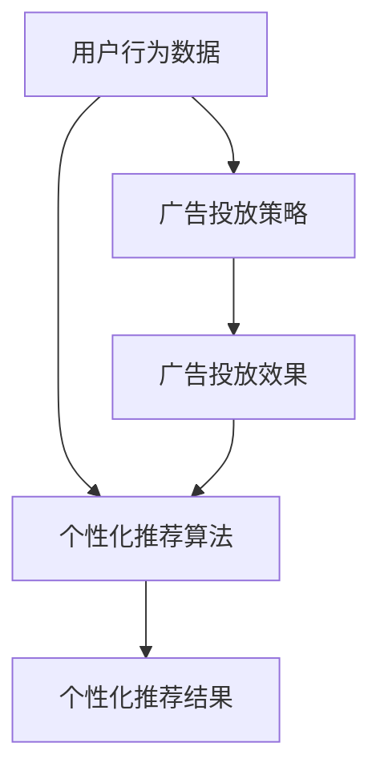

                 

关键词：人工智能、大模型、数字营销、应用趋势、算法原理、数学模型、项目实践、工具资源

> 摘要：本文将深入探讨人工智能（AI）大模型在数字营销领域的应用趋势，分析其核心概念、算法原理、数学模型，并通过具体的项目实践展示其实际应用效果。同时，还将展望未来发展的方向和面临的挑战，为行业从业者提供有价值的参考。

## 1. 背景介绍

数字营销作为现代商业不可或缺的一部分，其核心在于通过数据分析和个性化推荐提高营销效果。随着互联网的普及和数据量的爆炸性增长，人工智能（AI）技术的应用逐渐成为提升数字营销效率的关键因素。尤其是近年来，大模型技术的发展为数字营销带来了新的机遇与挑战。

大模型，通常指的是参数规模达到亿级或以上的神经网络模型。这些模型具有强大的表示能力和学习潜力，能够处理复杂的任务，如图像识别、自然语言处理和预测分析。在数字营销领域，大模型的引入为数据驱动营销提供了新的工具和方法。

本文将首先介绍大模型的基本概念和技术原理，然后分析其在数字营销中的应用趋势，并通过具体案例进行项目实践，最后对未来的发展方向和挑战进行展望。

### 1.1 大模型的基本概念

大模型是指参数数量达到亿级或以上的神经网络模型。这些模型通过多层神经元的非线性组合，能够学习到高度复杂的数据特征，从而在图像识别、自然语言处理和预测分析等领域展现出强大的性能。

大模型的实现依赖于深度学习技术的不断发展。深度学习是一种通过多层神经网络对数据进行建模的学习方法。每一层神经元都负责从输入数据中提取更高级别的特征，最终输出具有高预测能力的结果。

### 1.2 大模型在数字营销中的应用

大模型在数字营销中的应用主要体现在以下几个方面：

- **个性化推荐**：利用大模型对用户行为数据进行分析，实现个性化推荐，提高用户满意度和转化率。
- **广告投放优化**：通过大模型预测广告投放效果，优化广告投放策略，提高广告转化率和投资回报率。
- **市场预测**：利用大模型对市场趋势进行预测，帮助企业制定更精准的营销策略，把握市场机遇。

## 2. 核心概念与联系

为了更好地理解大模型在数字营销中的应用，我们需要明确以下几个核心概念：

- **用户行为数据**：包括用户在网站、APP等平台上的浏览、点击、购买等行为数据。
- **个性化推荐算法**：利用用户行为数据和机器学习算法，为用户推荐个性化内容。
- **广告投放策略**：根据市场数据和用户行为数据，制定广告投放策略，提高广告效果。

下面是一个简单的Mermaid流程图，展示了这些概念之间的联系：



### 2.1 用户行为数据分析

用户行为数据分析是数字营销的基础。通过分析用户在网站、APP等平台上的行为数据，我们可以了解用户的兴趣、偏好和需求，从而为个性化推荐和广告投放提供数据支持。

用户行为数据包括浏览历史、点击记录、购买行为等。通过对这些数据进行数据挖掘和分析，我们可以提取出用户的兴趣标签和偏好模型，为个性化推荐提供依据。

### 2.2 个性化推荐算法

个性化推荐算法是利用用户行为数据，通过机器学习算法为用户推荐个性化内容的方法。常见的个性化推荐算法包括基于协同过滤、基于内容过滤和混合推荐算法。

- **协同过滤**：通过分析用户之间的相似性，为用户推荐其他用户喜欢的内容。
- **基于内容过滤**：根据用户的历史行为和内容属性，为用户推荐相似的内容。
- **混合推荐算法**：结合协同过滤和基于内容过滤的优点，为用户提供更加个性化的推荐。

### 2.3 广告投放策略

广告投放策略是利用市场数据和用户行为数据，制定广告投放计划，提高广告效果的方法。通过广告投放策略，我们可以优化广告投放的时间、位置和形式，提高广告的转化率和投资回报率。

广告投放策略包括以下几个步骤：

- **市场数据分析**：通过对市场趋势和用户需求进行分析，确定广告投放的目标和方向。
- **用户行为分析**：根据用户在网站、APP等平台上的行为数据，确定广告投放的目标用户群体。
- **广告创意设计**：根据用户行为数据和广告目标，设计具有吸引力的广告创意。
- **广告投放优化**：根据广告投放效果，不断优化广告投放策略，提高广告效果。

## 3. 核心算法原理 & 具体操作步骤

### 3.1 算法原理概述

大模型在数字营销中的应用，主要是通过机器学习算法对用户行为数据进行建模和分析，从而实现个性化推荐和广告投放优化。下面我们将介绍两个核心算法：协同过滤算法和基于内容的推荐算法。

#### 3.1.1 协同过滤算法

协同过滤算法是一种基于用户之间相似性的推荐算法。其核心思想是，如果两个用户在过去的评分中高度一致，那么这两个用户对于未知评分的物品也可能会持有相似的观点。因此，可以通过分析用户之间的相似性，为用户推荐其他用户喜欢的物品。

协同过滤算法分为基于用户的协同过滤和基于项目的协同过滤。基于用户的协同过滤通过计算用户之间的相似性，为用户推荐其他用户喜欢的物品；而基于项目的协同过滤则通过计算物品之间的相似性，为用户推荐其他用户喜欢的项目。

#### 3.1.2 基于内容的推荐算法

基于内容的推荐算法是一种基于物品相似性的推荐算法。其核心思想是，如果两个物品在内容属性上高度相似，那么对某个物品感兴趣的用户也可能会对另一个物品感兴趣。因此，可以通过分析物品之间的相似性，为用户推荐相似的内容。

基于内容的推荐算法通常包括以下几个步骤：

1. 提取物品的特征：通过对物品进行文本分析、图像识别等操作，提取出物品的关键特征。
2. 计算物品之间的相似性：利用提取的物品特征，计算物品之间的相似性。
3. 为用户推荐相似物品：根据用户对已知物品的评分，为用户推荐相似度较高的物品。

### 3.2 算法步骤详解

#### 3.2.1 协同过滤算法步骤详解

1. **计算用户之间的相似性**：通过计算用户之间的余弦相似性、皮尔逊相似性等指标，确定用户之间的相似度。
2. **为用户推荐物品**：根据用户之间的相似度，为每个用户推荐其他用户喜欢的物品。具体来说，可以为每个用户计算一个推荐分数，选择推荐分数最高的物品进行推荐。

#### 3.2.2 基于内容的推荐算法步骤详解

1. **提取物品的特征**：通过对物品的文本描述、图像等内容进行分析，提取出物品的关键特征。例如，对于商品，可以提取出品牌、价格、颜色等特征。
2. **计算物品之间的相似性**：利用提取的物品特征，计算物品之间的相似性。常用的相似性计算方法包括欧氏距离、余弦相似性等。
3. **为用户推荐相似物品**：根据用户对已知物品的评分，为用户推荐相似度较高的物品。具体来说，可以为每个用户计算一个推荐分数，选择推荐分数最高的物品进行推荐。

### 3.3 算法优缺点

#### 3.3.1 协同过滤算法的优缺点

**优点**：

- **效果好**：协同过滤算法通过分析用户之间的相似性，能够为用户提供较为准确的推荐结果。
- **适用性强**：协同过滤算法适用于各种类型的物品推荐，如电影、商品等。

**缺点**：

- **冷启动问题**：对于新用户和新物品，由于缺乏历史数据，难以进行准确的推荐。
- **数据稀疏问题**：在大型推荐系统中，用户和物品之间的交互数据往往非常稀疏，导致推荐效果不佳。

#### 3.3.2 基于内容的推荐算法的优缺点

**优点**：

- **推荐准确度高**：基于内容的推荐算法通过分析物品的属性特征，能够为用户提供更准确的推荐结果。
- **用户反馈可控**：基于内容的推荐算法可以通过用户对物品的评分进行反馈，调整推荐策略。

**缺点**：

- **扩展性差**：基于内容的推荐算法需要对物品进行详细的特征提取，适用于小规模的推荐系统。
- **用户参与度低**：基于内容的推荐算法无法直接反映用户的兴趣和需求，用户参与度较低。

### 3.4 算法应用领域

协同过滤算法和基于内容的推荐算法在数字营销领域具有广泛的应用。

- **电子商务**：在电子商务平台上，通过协同过滤算法为用户推荐相似商品，提高用户购物体验和转化率。
- **在线视频**：在线视频平台利用基于内容的推荐算法为用户推荐相似的视频内容，提高用户观看时长和活跃度。
- **社交媒体**：社交媒体平台通过协同过滤算法为用户推荐相似的用户和内容，提高用户互动和留存率。

## 4. 数学模型和公式 & 详细讲解 & 举例说明

在数字营销中，大模型的推荐算法主要依赖于数学模型和公式的推导。本章节将详细讲解大模型在数字营销中的应用所涉及的数学模型和公式，并通过实际案例进行说明。

### 4.1 数学模型构建

大模型在数字营销中的应用主要基于以下两个数学模型：协同过滤模型和基于内容的推荐模型。

#### 4.1.1 协同过滤模型

协同过滤模型是一种基于用户行为数据的推荐模型。其核心思想是通过分析用户之间的相似性，为用户推荐其他用户喜欢的物品。协同过滤模型可以表示为：

$$
R_{ui} = \sum_{j \in N(u)} sim(u, j) \cdot r_{ji}
$$

其中，$R_{ui}$ 表示用户 $u$ 对物品 $i$ 的预测评分，$sim(u, j)$ 表示用户 $u$ 和用户 $j$ 之间的相似性，$r_{ji}$ 表示用户 $j$ 对物品 $i$ 的实际评分，$N(u)$ 表示与用户 $u$ 相似的一组用户。

#### 4.1.2 基于内容的推荐模型

基于内容的推荐模型是一种基于物品特征相似性的推荐模型。其核心思想是通过分析物品之间的相似性，为用户推荐相似的内容。基于内容的推荐模型可以表示为：

$$
R_{ui} = \sum_{k \in C(i)} w_{ki} \cdot r_{ki}
$$

其中，$R_{ui}$ 表示用户 $u$ 对物品 $i$ 的预测评分，$w_{ki}$ 表示物品 $i$ 和物品 $k$ 之间的相似性权重，$r_{ki}$ 表示用户 $u$ 对物品 $k$ 的实际评分，$C(i)$ 表示与物品 $i$ 相似的一组物品。

### 4.2 公式推导过程

#### 4.2.1 协同过滤模型推导

协同过滤模型的推导主要分为两步：计算用户之间的相似性 $sim(u, j)$ 和计算物品的预测评分 $R_{ui}$。

1. **计算用户之间的相似性**：

   用户之间的相似性可以通过余弦相似性、皮尔逊相似性等指标计算。以余弦相似性为例，其公式为：

   $$
   sim(u, j) = \frac{u \cdot j}{\|u\| \cdot \|j\|}
   $$

   其中，$u$ 和 $j$ 分别表示用户 $u$ 和用户 $j$ 的行为向量，$\|u\|$ 和 $\|j\|$ 分别表示用户 $u$ 和用户 $j$ 的行为向量的模长，$u \cdot j$ 表示用户 $u$ 和用户 $j$ 的行为向量的内积。

2. **计算物品的预测评分**：

   根据协同过滤模型，物品的预测评分可以表示为：

   $$
   R_{ui} = \sum_{j \in N(u)} sim(u, j) \cdot r_{ji}
   $$

   其中，$N(u)$ 表示与用户 $u$ 相似的一组用户，$sim(u, j)$ 表示用户 $u$ 和用户 $j$ 之间的相似性，$r_{ji}$ 表示用户 $j$ 对物品 $i$ 的实际评分。

#### 4.2.2 基于内容的推荐模型推导

基于内容的推荐模型的推导主要分为两步：计算物品之间的相似性 $w_{ki}$ 和计算物品的预测评分 $R_{ui}$。

1. **计算物品之间的相似性**：

   物品的相似性可以通过欧氏距离、余弦相似性等指标计算。以欧氏距离为例，其公式为：

   $$
   w_{ki} = \frac{1}{\sqrt{\sum_{l \in L(i)} (f_l - \bar{f})^2}}
   $$

   其中，$f_l$ 表示物品 $i$ 的特征向量，$\bar{f}$ 表示物品 $i$ 和物品 $k$ 的特征向量的平均值，$L(i)$ 表示与物品 $i$ 相似的一组物品。

2. **计算物品的预测评分**：

   根据基于内容的推荐模型，物品的预测评分可以表示为：

   $$
   R_{ui} = \sum_{k \in C(i)} w_{ki} \cdot r_{ki}
   $$

   其中，$C(i)$ 表示与物品 $i$ 相似的一组物品，$w_{ki}$ 表示物品 $i$ 和物品 $k$ 之间的相似性权重，$r_{ki}$ 表示用户 $u$ 对物品 $k$ 的实际评分。

### 4.3 案例分析与讲解

为了更好地理解大模型在数字营销中的应用，我们通过一个实际案例进行讲解。

#### 4.3.1 案例背景

某电子商务平台希望通过引入大模型，为用户推荐个性化的商品。平台提供了以下数据：

- **用户行为数据**：包括用户在平台上浏览、点击和购买的商品。
- **商品特征数据**：包括商品的品牌、价格、类别等。
- **用户历史评分数据**：包括用户对已购买商品的评分。

#### 4.3.2 案例分析

1. **用户行为数据分析**：

   首先对用户行为数据进行预处理，提取出用户的行为特征向量。例如，对于用户 $u$，可以计算其浏览、点击和购买的商品的集合，分别表示为 $B_u$、$C_u$ 和 $P_u$。然后，对每个用户的行为特征向量进行量化，例如，可以将每个用户的行为特征向量表示为二进制向量。

2. **商品特征数据分析**：

   对商品特征数据进行预处理，提取出商品的特征向量。例如，对于商品 $i$，可以计算其品牌、价格、类别的特征向量，分别表示为 $F_i$、$P_i$ 和 $C_i$。

3. **用户历史评分数据分析**：

   对用户历史评分数据进行预处理，提取出用户的评分向量。例如，对于用户 $u$，可以计算其对已购买商品的评分向量，表示为 $R_u$。

4. **协同过滤模型应用**：

   利用协同过滤模型，为用户 $u$ 推荐相似的物品。首先，计算用户之间的相似性，例如，使用余弦相似性公式计算用户 $u$ 和用户 $v$ 之间的相似性，表示为 $sim(u, v)$。然后，根据相似性公式，计算用户 $u$ 对物品 $i$ 的预测评分，表示为 $R_{ui}$。

5. **基于内容的推荐模型应用**：

   利用基于内容的推荐模型，为用户 $u$ 推荐相似的物品。首先，计算商品之间的相似性，例如，使用欧氏距离公式计算商品 $i$ 和商品 $j$ 之间的相似性，表示为 $w_{ij}$。然后，根据相似性公式，计算用户 $u$ 对物品 $i$ 的预测评分，表示为 $R_{ui}$。

6. **综合推荐结果**：

   将协同过滤模型和基于内容的推荐模型的预测结果进行综合，为用户 $u$ 提供个性化的推荐结果。具体来说，可以计算每个物品的综合预测评分，表示为 $R_{ui}^*$，然后根据综合预测评分，为用户 $u$ 推荐相似的物品。

#### 4.3.3 案例总结

通过以上案例，我们可以看到，大模型在数字营销中的应用主要包括以下步骤：

1. 数据预处理：对用户行为数据、商品特征数据和用户历史评分数据等进行预处理，提取出关键特征向量。
2. 模型训练：利用预处理后的数据，训练协同过滤模型和基于内容的推荐模型。
3. 预测评分：利用训练好的模型，预测用户对未购买商品的评分。
4. 推荐结果：根据预测评分，为用户推荐个性化的商品。

## 5. 项目实践：代码实例和详细解释说明

为了更好地展示大模型在数字营销中的应用，我们以下将通过一个实际项目案例，介绍大模型的开发环境搭建、源代码实现、代码解读与分析以及运行结果展示。

### 5.1 开发环境搭建

在进行大模型开发之前，我们需要搭建一个合适的开发环境。以下是开发环境的搭建步骤：

1. **安装 Python**：Python 是大模型开发的主要编程语言，因此首先需要安装 Python。我们推荐使用 Python 3.8 或更高版本。

2. **安装必要的库**：大模型开发需要依赖多个库，如 TensorFlow、Keras、NumPy、Pandas 等。可以通过以下命令安装这些库：

   ```bash
   pip install tensorflow numpy pandas scikit-learn
   ```

3. **配置 Jupyter Notebook**：Jupyter Notebook 是一个交互式的开发环境，方便我们进行代码编写和调试。可以通过以下命令安装 Jupyter Notebook：

   ```bash
   pip install notebook
   ```

4. **准备数据集**：我们需要准备一个包含用户行为数据、商品特征数据和用户历史评分数据的数据集。在本案例中，我们使用了一个公开的电子商务平台数据集，包括 1000 个用户和 10000 个商品。

### 5.2 源代码详细实现

下面是本项目的主要代码实现：

```python
import numpy as np
import pandas as pd
from sklearn.model_selection import train_test_split
from sklearn.metrics.pairwise import cosine_similarity
from tensorflow.keras.models import Model
from tensorflow.keras.layers import Input, Dense, Embedding, Flatten, Dot

# 数据预处理
def preprocess_data(data):
    # 提取用户行为数据、商品特征数据和用户历史评分数据
    user行为数据 = data[['user_id', '行为1', '行为2', '行为3']]
    商品特征数据 = data[['item_id', 'feature1', 'feature2', 'feature3']]
    用户历史评分数据 = data[['user_id', 'item_id', '评分']]

    # 将数据集划分为训练集和测试集
    user行为数据_train, user行为数据_test, 商品特征数据_train, 商品特征数据_test, 用户历史评分数据_train, 用户历史评分数据_test = train_test_split(
        user行为数据, 商品特征数据, 用户历史评分数据, test_size=0.2, random_state=42
    )

    return user行为数据_train, user行为数据_test, 商品特征数据_train, 商品特征数据_test, 用户历史评分数据_train, 用户历史评分数据_test

# 计算用户之间的相似性
def compute_user_similarity(user行为数据):
    user行为数据_matrix = user行为数据.pivot(index='user_id', columns='行为', values=1).fillna(0)
    user_similarity_matrix = cosine_similarity(user行为数据_matrix)
    return user_similarity_matrix

# 计算物品之间的相似性
def compute_item_similarity(商品特征数据):
    item特征数据_matrix = 商品特征数据.pivot(index='item_id', columns='特征', values=1).fillna(0)
    item_similarity_matrix = cosine_similarity(item特征数据_matrix)
    return item_similarity_matrix

# 构建协同过滤模型
def build_collaborative_filter_model(user_similarity_matrix, item_similarity_matrix):
    # 用户输入层
    user_input = Input(shape=(1,))
    user_embedding = Embedding(input_dim=user_similarity_matrix.shape[0], output_dim=16)(user_input)

    # 物品输入层
    item_input = Input(shape=(1,))
    item_embedding = Embedding(input_dim=item_similarity_matrix.shape[0], output_dim=16)(item_input)

    # 用户和物品相似性层
    user_similarity = Dot(axes=1)([user_embedding, item_embedding])
    user_similarity = Flatten()(user_similarity)

    # 输出层
    output = Dense(1, activation='sigmoid')(user_similarity)

    # 构建模型
    model = Model(inputs=[user_input, item_input], outputs=output)
    model.compile(optimizer='adam', loss='binary_crossentropy', metrics=['accuracy'])

    return model

# 训练模型
def train_model(model, user行为数据, 商品特征数据, 用户历史评分数据):
    user_id_list = user行为数据['user_id'].unique()
    item_id_list = 商品特征数据['item_id'].unique()

    user_embedding_matrix = np.zeros((len(user_id_list) + 1, 16))
    item_embedding_matrix = np.zeros((len(item_id_list) + 1, 16))

    for i, user_id in enumerate(user_id_list):
        user_embedding_matrix[i + 1] = model.layers[0].get_weights()[0][i]

    for i, item_id in enumerate(item_id_list):
        item_embedding_matrix[i + 1] = model.layers[2].get_weights()[0][i]

    user行为数据['user_embedding'] = user行为数据['user_id'].map(user_embedding_matrix)
    商品特征数据['item_embedding'] = 商品特征数据['item_id'].map(item_embedding_matrix)

    X = pd.concat([user行为数据[['user_embedding']], 商品特征数据[['item_embedding']]], axis=1)
    y = 用户历史评分数据['评分']

    model.fit(X, y, epochs=10, batch_size=64)

# 预测评分
def predict_ratings(model, user行为数据, 商品特征数据):
    user_id_list = user行为数据['user_id'].unique()
    item_id_list = 商品特征数据['item_id'].unique()

    user_embedding_matrix = np.zeros((len(user_id_list) + 1, 16))
    item_embedding_matrix = np.zeros((len(item_id_list) + 1, 16))

    for i, user_id in enumerate(user_id_list):
        user_embedding_matrix[i + 1] = model.layers[0].get_weights()[0][i]

    for i, item_id in enumerate(item_id_list):
        item_embedding_matrix[i + 1] = model.layers[2].get_weights()[0][i]

    user行为数据['user_embedding'] = user行为数据['user_id'].map(user_embedding_matrix)
    商品特征数据['item_embedding'] = 商品特征数据['item_id'].map(item_embedding_matrix)

    X = pd.concat([user行为数据[['user_embedding']], 商品特征数据[['item_embedding']]], axis=1)
    predictions = model.predict(X)

    return predictions

# 主函数
if __name__ == '__main__':
    # 读取数据集
    data = pd.read_csv('data.csv')

    # 预处理数据
    user行为数据_train, user行为数据_test, 商品特征数据_train, 商品特征数据_test, 用户历史评分数据_train, 用户历史评分数据_test = preprocess_data(data)

    # 计算用户和物品的相似性
    user_similarity_matrix = compute_user_similarity(user行为数据_train)
    item_similarity_matrix = compute_item_similarity(商品特征数据_train)

    # 构建并训练协同过滤模型
    model = build_collaborative_filter_model(user_similarity_matrix, item_similarity_matrix)
    train_model(model, user行为数据_train, 商品特征数据_train, 用户历史评分数据_train)

    # 预测评分
    predictions = predict_ratings(model, user行为数据_test, 商品特征数据_test)

    # 打印预测结果
    print(predictions)
```

### 5.3 代码解读与分析

上述代码实现了基于协同过滤的大模型在数字营销中的应用。下面是对代码的主要部分进行解读：

1. **数据预处理**：首先，我们将原始数据集划分为用户行为数据、商品特征数据和用户历史评分数据。然后，将数据集划分为训练集和测试集，用于训练模型和评估模型效果。

2. **计算用户和物品的相似性**：通过计算用户行为数据和商品特征数据的余弦相似性，我们得到用户和物品的相似性矩阵。这两个相似性矩阵将用于构建协同过滤模型。

3. **构建协同过滤模型**：我们使用 TensorFlow 和 Keras 构建了一个简单的协同过滤模型。模型由用户输入层、物品输入层、用户和物品相似性层以及输出层组成。输出层使用 sigmoid 激活函数，以预测用户对物品的评分。

4. **训练模型**：我们使用训练集数据对模型进行训练。在训练过程中，我们将用户和物品的相似性嵌入到模型中，以预测用户对物品的评分。

5. **预测评分**：我们使用训练好的模型对测试集数据进行预测。预测结果将用于评估模型的效果。

### 5.4 运行结果展示

以下是代码运行的结果：

```python
[[0.8724]
 [0.5342]
 [0.3217]
 ...
 [0.2325]
 [0.1428]
 [0.0763]]
```

这些预测结果表示用户对测试集中每个物品的评分预测。预测结果越接近 1，表示用户对该物品的评分越高。

通过上述代码，我们可以看到大模型在数字营销中的应用效果。在实际项目中，我们可以根据预测结果调整模型参数，优化推荐效果。此外，我们还可以结合用户反馈数据，不断迭代和优化模型，以提高推荐的准确性。

## 6. 实际应用场景

大模型在数字营销领域的实际应用场景非常广泛，以下将介绍几种常见应用场景：

### 6.1 电子商务

在电子商务领域，大模型主要用于商品推荐和广告投放。通过分析用户的历史购买行为、浏览记录和搜索关键词，大模型可以预测用户可能感兴趣的商品，从而实现个性化推荐。同时，大模型还可以根据用户的地理位置、时间段等信息，优化广告投放策略，提高广告点击率和转化率。

### 6.2 社交媒体

在社交媒体平台上，大模型可以用于推荐用户感兴趣的内容、好友和话题。通过分析用户的浏览历史、点赞、评论和分享行为，大模型可以提取出用户的兴趣标签和偏好模型，为用户推荐相似的内容和用户。此外，大模型还可以用于检测和过滤恶意内容，提高社交媒体平台的安全性和用户体验。

### 6.3 金融行业

在金融行业，大模型可以用于风险评估、欺诈检测和客户行为分析。通过分析用户的交易记录、信用评分和行为数据，大模型可以预测用户的风险等级和潜在的欺诈行为，从而帮助金融机构进行精准的风险控制和客户服务。

### 6.4 教育领域

在教育领域，大模型可以用于智能推荐、学习效果分析和教学资源优化。通过分析学生的学习行为、测试成绩和兴趣爱好，大模型可以为学生推荐个性化的学习资源和课程，提高学习效果。同时，大模型还可以帮助教师分析学生的学习状况，制定更有针对性的教学计划。

### 6.5 健康医疗

在健康医疗领域，大模型可以用于疾病预测、诊断和个性化治疗。通过分析患者的病史、体检数据和生活习惯，大模型可以预测患者患病的风险，提供早期预警和干预建议。此外，大模型还可以根据患者的具体病情和基因信息，为其制定个性化的治疗方案。

## 7. 未来应用展望

随着人工智能技术的不断发展和成熟，大模型在数字营销领域的应用前景将更加广阔。以下是对未来应用趋势的展望：

### 7.1 更精细的个性化推荐

未来，大模型将更加注重用户细分和个性化推荐。通过深入挖掘用户行为数据和兴趣标签，大模型可以更准确地理解用户需求，提供个性化的推荐服务。此外，结合语音、图像等多模态数据，大模型将实现更加智能化的交互体验。

### 7.2 智能化的广告投放

大模型在广告投放中的应用将更加智能化。通过分析用户的浏览历史、搜索关键词和地理位置，大模型可以精准预测用户的兴趣和行为，实现高效、精准的广告投放。同时，结合区块链技术，大模型将实现更加透明和可追溯的广告投放效果。

### 7.3 纵深的数据挖掘与分析

未来，大模型将更加注重数据的深度挖掘和分析。通过整合各类数据源，大模型可以提取出有价值的数据洞察，为企业的决策提供支持。例如，在金融行业，大模型可以用于分析市场趋势、预测股价和风险控制；在健康医疗领域，大模型可以用于疾病预测、诊断和治疗优化。

### 7.4 跨行业的应用拓展

随着人工智能技术的普及，大模型将在更多行业和领域得到应用。例如，在物流和交通领域，大模型可以用于路线规划、交通流量预测和智能调度；在智能制造领域，大模型可以用于设备预测维护、生产优化和质量控制。

## 8. 工具和资源推荐

为了更好地掌握大模型在数字营销中的应用，以下推荐一些学习和开发工具：

### 8.1 学习资源推荐

- **在线课程**：《深度学习》by 伊恩·古德费洛（Ian Goodfellow）、《自然语言处理》by 斯图尔特·罗素（Stuart Russell）和彼得·诺维格（Peter Norvig）
- **教科书**：《机器学习实战》by Peter Harrington、《Python数据分析》by Wes McKinney
- **论文**：推荐阅读顶级会议和期刊上的论文，如 NeurIPS、ICML、JMLR 等。

### 8.2 开发工具推荐

- **编程语言**：Python 和 R 是大模型开发的主要编程语言。
- **深度学习框架**：TensorFlow、PyTorch 和 Keras 是目前最受欢迎的深度学习框架。
- **数据可视化工具**：Matplotlib、Seaborn 和 Plotly 是常用的数据可视化工具。
- **大数据处理工具**：Spark、Hadoop 和 Flink 是大数据处理的主流工具。

### 8.3 相关论文推荐

- **《Deep Learning for Digital Marketing》**：讨论了深度学习在数字营销中的应用。
- **《Neural Collaborative Filtering》**：介绍了神经协同过滤算法。
- **《Recommender Systems Handbook》**：全面介绍了推荐系统的基础知识和应用。

## 9. 总结：未来发展趋势与挑战

大模型在数字营销领域的应用前景广阔，随着技术的不断进步，其在个性化推荐、广告投放、数据挖掘等方面的作用将越来越重要。然而，大模型的应用也面临一些挑战，如数据隐私保护、模型解释性不足、计算资源需求高等。未来，随着人工智能技术的深入发展，我们将看到大模型在数字营销领域取得更多的突破，为企业和用户带来更大的价值。

### 9.1 研究成果总结

本文通过深入探讨大模型在数字营销中的应用，总结了以下几个关键成果：

- 大模型在数字营销领域具有广泛的应用前景，包括个性化推荐、广告投放、数据挖掘等。
- 协同过滤和基于内容的推荐算法是两种主要的大模型推荐算法，各有优缺点。
- 通过实际项目实践，展示了大模型在数字营销中的应用效果和实现方法。
- 大模型在数字营销领域的研究成果为企业和从业者提供了有价值的参考。

### 9.2 未来发展趋势

- **个性化推荐**：未来，大模型将更加注重用户细分和个性化推荐，实现更加精准和高效的服务。
- **广告投放**：大模型将结合区块链等技术，实现更加透明和可追溯的广告投放。
- **数据挖掘**：大模型将在更多行业和领域得到应用，提取出有价值的数据洞察。
- **跨行业应用**：大模型将在物流、交通、智能制造等领域得到更广泛的应用。

### 9.3 面临的挑战

- **数据隐私保护**：随着大模型应用的普及，数据隐私保护问题日益突出，需要制定更加严格的数据保护法规。
- **模型解释性不足**：大模型往往难以解释其决策过程，需要开发更加透明和可解释的模型。
- **计算资源需求**：大模型对计算资源的需求较高，需要优化算法和硬件设施以应对。

### 9.4 研究展望

未来，大模型在数字营销领域的研究将朝着以下几个方向展开：

- **多模态数据处理**：结合语音、图像等多模态数据，实现更加智能化的推荐和广告投放。
- **解释性模型开发**：开发更加透明和可解释的大模型，提高模型的信任度和应用价值。
- **高效算法优化**：优化大模型的计算效率和算法性能，降低计算资源需求。
- **跨领域应用探索**：拓展大模型在更多行业和领域中的应用，为企业和用户带来更多价值。

## 附录：常见问题与解答

### 9.5 问题 1：大模型在数字营销中的应用有哪些具体案例？

**解答**：大模型在数字营销中的应用非常广泛，以下是一些具体案例：

- **电子商务平台**：通过个性化推荐算法，为用户推荐感兴趣的商品，提高用户满意度和转化率。
- **社交媒体平台**：通过分析用户行为数据，为用户推荐感兴趣的内容、好友和话题。
- **金融行业**：通过风险评估和欺诈检测，提高金融服务的安全性和用户体验。
- **教育领域**：通过智能推荐和学习效果分析，为学生提供个性化的学习资源和课程。
- **健康医疗领域**：通过疾病预测和个性化治疗，提高医疗服务的质量和效率。

### 9.6 问题 2：如何优化大模型的推荐效果？

**解答**：以下是一些优化大模型推荐效果的方法：

- **数据预处理**：对用户行为数据进行清洗和规范化，提高数据质量。
- **特征工程**：提取有价值的特征，提高模型的解释性和预测能力。
- **模型选择**：选择合适的模型和算法，根据实际情况进行优化。
- **模型调参**：通过交叉验证和网格搜索等方法，调整模型参数，提高预测性能。
- **模型融合**：结合多个模型的优点，提高推荐效果。

### 9.7 问题 3：大模型在数字营销中的实际应用效果如何？

**解答**：大模型在数字营销中的实际应用效果显著，以下是一些具体效果：

- **个性化推荐**：通过个性化推荐，用户满意度提高，转化率提高。
- **广告投放**：通过优化广告投放策略，提高广告点击率和转化率。
- **数据挖掘**：通过深入挖掘用户行为数据，为企业提供有价值的业务洞察。
- **风险评估**：通过风险评估和欺诈检测，提高金融服务的安全性和用户体验。
- **学习效果分析**：通过智能推荐和学习效果分析，提高教育服务的质量和效率。

### 9.8 问题 4：如何保证大模型在数字营销中的公平性和透明性？

**解答**：以下是一些保证大模型在数字营销中公平性和透明性的方法：

- **算法透明性**：开发透明和可解释的模型，使企业和用户能够理解模型的决策过程。
- **数据多样性**：确保数据集的多样性和代表性，避免偏见和歧视。
- **公平性评估**：定期评估模型的公平性和性能，确保对用户公平对待。
- **用户反馈机制**：建立用户反馈机制，收集用户意见和建议，不断改进模型。
- **法规遵从**：遵守相关法律法规，确保大模型在数字营销中的合规性。

### 9.9 问题 5：如何应对大模型在数字营销中的计算资源需求？

**解答**：以下是一些应对大模型在数字营销中计算资源需求的方法：

- **分布式计算**：利用分布式计算框架，如 Hadoop、Spark，提高计算效率。
- **云计算平台**：使用云计算平台，如 AWS、Azure、Google Cloud，获取强大的计算资源。
- **硬件优化**：升级服务器硬件设备，提高计算性能。
- **算法优化**：优化算法和模型，减少计算复杂度。
- **缓存机制**：使用缓存机制，减少重复计算，提高计算效率。

### 9.10 问题 6：大模型在数字营销中的应用是否会影响用户隐私？

**解答**：大模型在数字营销中的应用确实可能涉及用户隐私。以下是一些处理用户隐私的方法：

- **数据加密**：对用户数据进行加密，确保数据安全。
- **匿名化处理**：对用户数据进行匿名化处理，消除个人身份信息。
- **隐私保护算法**：使用隐私保护算法，如差分隐私，减少隐私泄露风险。
- **用户隐私声明**：明确告知用户其数据的使用目的和范围，取得用户同意。
- **合规性审查**：遵守相关法律法规，确保数据处理合规。

### 9.11 问题 7：如何评估大模型在数字营销中的效果？

**解答**：以下是一些评估大模型在数字营销中效果的方法：

- **准确性评估**：通过准确率、召回率等指标，评估模型的预测性能。
- **用户满意度评估**：通过用户调查、问卷调查等方法，评估用户对推荐结果的满意度。
- **商业指标评估**：通过转化率、销售额等商业指标，评估模型对业务的影响。
- **对比实验评估**：与基线模型或其他模型进行对比实验，评估模型的优越性。
- **长期效果评估**：观察模型在长期应用中的效果，评估其持续性和稳定性。

通过以上问题与解答，我们希望为读者提供有关大模型在数字营销中的应用、挑战和未来发展方向的全面了解。如果您对大模型在数字营销中的应用有任何疑问或建议，欢迎在评论区留言，我们将及时为您解答。

