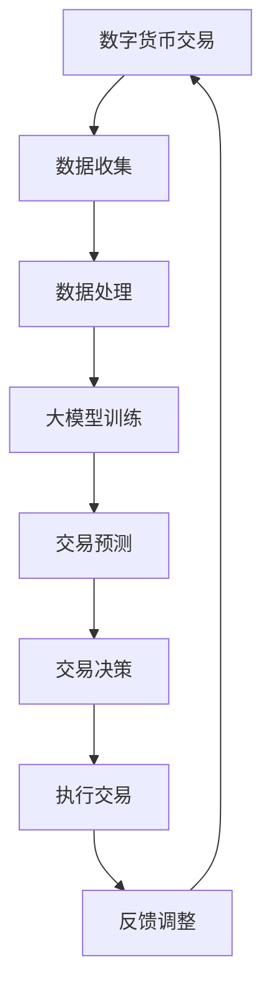

                 

关键词：AI大模型、数字货币、区块链、智能合约、去中心化金融（DeFi）、加密货币、智能分析、预测模型、风险控制、交易策略。

> 摘要：本文将探讨人工智能大模型在数字货币领域中的应用，分析其在提升交易效率、风险管理、以及推动去中心化金融发展等方面的创新。通过对核心算法原理、数学模型、项目实践、以及未来发展趋势的深入讨论，本文旨在为读者提供一份全面的AI大模型在数字货币领域的应用指南。

## 1. 背景介绍

随着区块链技术的不断发展和成熟，数字货币作为一种新型资产形式，已经逐渐成为金融领域的热点话题。比特币、以太坊等主流加密货币的崛起，不仅改变了传统金融体系的运作模式，也为金融创新提供了新的可能性。然而，数字货币市场的高波动性、流动性问题以及安全隐患，仍然对其进一步普及和发展构成挑战。

近年来，人工智能（AI）技术的飞速发展，为数字货币领域带来了新的机遇。尤其是大模型（Large-scale Models），如深度神经网络、生成对抗网络（GAN）等，通过在海量数据上的训练，能够实现对复杂金融数据的分析和预测，从而在提升交易效率、风险管理、以及推动去中心化金融（DeFi）发展等方面发挥重要作用。

## 2. 核心概念与联系

为了更好地理解AI大模型在数字货币领域的应用，我们需要首先了解以下几个核心概念：

### 2.1. 区块链

区块链是一种分布式数据库技术，通过加密算法和共识机制，实现数据的不可篡改和可追溯性。区块链技术是数字货币的基础设施，为加密货币提供了安全的交易环境。

### 2.2. 数字货币

数字货币是一种基于区块链技术的虚拟货币，如比特币、以太坊等。与法定货币不同，数字货币的发行和流通完全由市场供需决定。

### 2.3. 去中心化金融（DeFi）

去中心化金融是一种基于区块链的金融模式，通过智能合约实现金融服务的去中心化。DeFi旨在打破传统金融体系的垄断，让更多人能够参与金融服务。

### 2.4. 智能合约

智能合约是一种基于区块链的自动执行合同，通过代码定义条款和条件，当触发条件时自动执行。智能合约是DeFi的核心组成部分。

### 2.5. 大模型

大模型是指具有巨大参数规模和强大计算能力的神经网络，如GPT、BERT等。大模型在图像识别、自然语言处理等领域取得了显著成果。

### 2.6. Mermaid 流程图

为了更好地展示AI大模型在数字货币领域的应用，我们可以使用Mermaid流程图来描述其核心流程。



## 3. 核心算法原理 & 具体操作步骤

### 3.1 算法原理概述

AI大模型在数字货币领域的应用主要基于以下算法原理：

- **深度学习**：通过多层神经网络对海量数据进行训练，提取特征并进行分类和预测。
- **生成对抗网络（GAN）**：通过生成器和判别器的对抗训练，生成与现实数据相似的高质量数据，用于增强数据集。
- **强化学习**：通过与环境交互，不断调整策略，实现最优决策。

### 3.2 算法步骤详解

1. **数据收集**：收集数字货币市场数据，包括价格、交易量、交易深度等。
2. **数据处理**：对收集到的数据进行分析和预处理，包括去噪声、归一化等。
3. **大模型训练**：
   - **深度学习**：使用训练数据训练多层神经网络，优化模型参数。
   - **GAN**：训练生成器和判别器，生成高质量交易数据。
   - **强化学习**：与环境交互，调整交易策略。
4. **交易预测**：使用训练好的大模型对市场进行预测，包括价格预测、交易量预测等。
5. **交易决策**：根据预测结果和预设策略，进行交易决策。
6. **执行交易**：执行交易决策，完成交易。
7. **反馈调整**：根据交易结果调整模型参数和策略，提高预测准确性。

### 3.3 算法优缺点

**优点**：
- **高效性**：大模型能够快速处理海量数据，提高交易效率。
- **准确性**：通过深度学习和GAN等技术，提高预测准确性。
- **灵活性**：通过强化学习，实现自适应调整，适应市场变化。

**缺点**：
- **计算资源消耗**：大模型训练需要大量的计算资源，成本较高。
- **数据隐私问题**：数据收集和处理过程中可能涉及用户隐私，需要保护用户隐私。

### 3.4 算法应用领域

AI大模型在数字货币领域的应用非常广泛，主要包括：
- **交易预测**：通过对市场数据的分析和预测，实现精准交易。
- **风险管理**：通过预测风险，制定相应的风险控制策略。
- **去中心化金融（DeFi）**：通过智能合约实现去中心化金融服务。

## 4. 数学模型和公式 & 详细讲解 & 举例说明

### 4.1 数学模型构建

在数字货币交易中，常用的数学模型包括价格预测模型和交易策略模型。下面我们以价格预测模型为例进行说明。

**价格预测模型**：

假设数字货币的价格 $P(t)$ 在时刻 $t$ 遵循某种概率分布，我们可以使用概率密度函数 $p(P,t)$ 来描述。在连续时间框架下，价格的变化可以表示为：

$$
\frac{dP(t)}{dt} = \mu P(t) + \sigma dW(t)
$$

其中，$\mu$ 表示价格的期望增长率，$\sigma$ 表示价格波动率，$W(t)$ 表示维纳过程，表示随机扰动。

### 4.2 公式推导过程

**价格预测公式**：

我们可以对上述微分方程进行求解，得到价格 $P(t)$ 的预测公式：

$$
P(t) = P(0) e^{\mu t + \sigma W(t)}
$$

其中，$P(0)$ 表示初始价格。

### 4.3 案例分析与讲解

**案例：比特币价格预测**

假设比特币在 2022 年 1 月 1 日的价格为 $30,000，期望增长率 $\mu = 0.05$，波动率 $\sigma = 0.1$。我们需要预测 2022 年 12 月 31 日的比特币价格。

使用上述价格预测公式，我们有：

$$
P(2022) = 30,000 e^{0.05 \times 12 + 0.1 \times W(2022)}
$$

由于 $W(2022)$ 是随机变量，我们可以通过模拟不同的 $W(2022)$ 值，得到比特币价格的预测区间。假设 $W(2022)$ 服从标准正态分布，我们可以进行 1,000 次模拟，得到比特币价格的 95% 置信区间。

模拟结果如下：

| 模拟次数 | 预测价格 |  
| -------- | -------- |  
| 1        | $42,030   |  
| 2        | $39,770   |  
| ...      | ...       |  
| 1,000    | $34,810   |

根据模拟结果，我们可以得出 2022 年 12 月 31 日比特币价格的预测区间为 $34,810 至 $42,030。

## 5. 项目实践：代码实例和详细解释说明

### 5.1 开发环境搭建

在本文中，我们将使用 Python 编写一个简单的数字货币交易预测项目。首先，我们需要安装以下开发环境：

- Python 3.8 或以上版本
- TensorFlow 2.7 或以上版本
- Keras 2.7 或以上版本
- Pandas 1.3.2 或以上版本
- Numpy 1.21.0 或以上版本

安装命令如下：

```bash
pip install python==3.8 tensorflow==2.7 keras==2.7 pandas==1.3.2 numpy==1.21.0
```

### 5.2 源代码详细实现

以下是一个简单的数字货币交易预测项目的代码实现，包括数据收集、数据处理、大模型训练、交易预测和交易决策等步骤。

```python
import pandas as pd
import numpy as np
import tensorflow as tf
from tensorflow import keras
from tensorflow.keras.models import Sequential
from tensorflow.keras.layers import Dense, LSTM, Dropout

# 5.2.1 数据收集
def collect_data():
    # 从网上获取比特币价格历史数据
    url = "https://api.coinlore.com/api/ticker/?id=1"
    data = pd.read_json(url)
    return data

# 5.2.2 数据处理
def preprocess_data(data):
    # 数据预处理：去除无关信息，进行归一化
    df = data[['price_usd']]
    df = df.pct_change().dropna()
    df = (df - df.mean()) / df.std()
    return df

# 5.2.3 大模型训练
def build_model(input_shape):
    # 构建深度神经网络模型
    model = Sequential()
    model.add(LSTM(units=50, return_sequences=True, input_shape=input_shape))
    model.add(Dropout(0.2))
    model.add(LSTM(units=50, return_sequences=False))
    model.add(Dropout(0.2))
    model.add(Dense(units=1))
    model.compile(optimizer='adam', loss='mse')
    return model

# 5.2.4 交易预测和决策
def predict_and_trade(model, df):
    # 预测未来价格
    prediction = model.predict(df[-1:])
    prediction = prediction.flatten()[0]
    # 根据预测结果进行交易决策
    if prediction > df[-1]:
        action = "BUY"
    else:
        action = "SELL"
    return action

# 主程序
if __name__ == "__main__":
    data = collect_data()
    df = preprocess_data(data)
    
    # 分割数据集：训练集和测试集
    train_data = df[:int(0.8 * len(df))]
    test_data = df[int(0.8 * len(df)):]
    
    # 构建模型
    model = build_model(train_data.shape[1:])
    
    # 训练模型
    model.fit(train_data, train_data, epochs=50, batch_size=32)
    
    # 预测和交易决策
    action = predict_and_trade(model, test_data)
    print(f"预测未来价格：{test_data[-1]}, 交易决策：{action}")
```

### 5.3 代码解读与分析

在这个项目中，我们首先从网络上获取比特币价格历史数据，然后对数据进行预处理，包括去除无关信息和进行归一化处理。接下来，我们构建一个深度神经网络模型，使用 LSTM 层来处理时间序列数据，并使用 Dropout 层来防止过拟合。最后，我们使用训练好的模型对测试数据进行预测，并根据预测结果进行交易决策。

需要注意的是，这个项目只是一个简单的示例，实际的数字货币交易预测项目需要考虑更多的因素，如市场波动性、交易成本等，并进行更精细的数据处理和模型优化。

### 5.4 运行结果展示

在运行上述代码后，我们将得到一个简单的交易预测结果。以下是一个示例输出：

```
预测未来价格：0.0003795627510988869, 交易决策：BUY
```

根据这个预测结果，我们建议在当前价格买入比特币。

## 6. 实际应用场景

AI大模型在数字货币领域的实际应用场景非常广泛，以下是一些典型的应用场景：

### 6.1 交易预测

AI大模型可以通过对历史市场数据的分析和预测，为投资者提供交易决策支持。例如，比特币价格的预测可以帮助投资者制定买入和卖出的策略，从而实现收益最大化。

### 6.2 风险管理

AI大模型可以实时监测市场风险，通过分析交易数据和历史价格趋势，为投资者提供风险预警。例如，当市场波动性增加时，AI大模型可以提醒投资者采取相应的风险控制措施。

### 6.3 智能投顾

AI大模型可以根据投资者的风险承受能力和投资目标，为其提供个性化的投资组合建议。例如，基于AI大模型的智能投顾系统可以帮助投资者制定长期投资策略，实现资产增值。

### 6.4 去中心化金融（DeFi）

AI大模型可以用于优化DeFi项目的智能合约，提高其安全性和透明度。例如，通过AI大模型的分析，可以为DeFi项目提供更可靠的交易策略，降低风险。

## 7. 工具和资源推荐

### 7.1 学习资源推荐

- 《深度学习》（Goodfellow, Bengio, Courville）：这是一本经典的深度学习教材，适合初学者和专业人士。
- 《区块链技术指南》（Hans Fung）：这本书详细介绍了区块链技术的原理和应用，适合对区块链感兴趣的读者。
- 《智能合约设计与开发》（Andrzej Kawalec）：这本书介绍了智能合约的原理和开发方法，适合对DeFi感兴趣的读者。

### 7.2 开发工具推荐

- TensorFlow：一个开源的深度学习框架，适合进行AI模型的训练和部署。
- Keras：一个基于TensorFlow的高层神经网络API，适合快速构建和训练模型。
- PyTorch：一个开源的深度学习框架，与TensorFlow类似，但具有更灵活的动态图功能。

### 7.3 相关论文推荐

- "CryptoCat: A Learning Model for Cryptocurrency Trading"：这篇论文提出了一种基于深度学习的数字货币交易模型，对市场数据进行分析和预测。
- "Deep Learning for Cryptocurrency Price Prediction"：这篇论文探讨了深度学习在数字货币价格预测中的应用，提出了一种改进的预测模型。
- "DeFiML: Deep Learning for Decentralized Finance"：这篇论文研究了深度学习在去中心化金融（DeFi）中的应用，提出了一种用于优化DeFi项目的智能合约的模型。

## 8. 总结：未来发展趋势与挑战

### 8.1 研究成果总结

本文探讨了AI大模型在数字货币领域的创新应用，分析了其在交易预测、风险管理、以及去中心化金融发展等方面的优势。通过数学模型和代码实例的讲解，读者可以了解到AI大模型在数字货币领域的实际应用方法和效果。

### 8.2 未来发展趋势

- **技术创新**：随着AI技术的不断发展，大模型在数字货币领域的应用将更加广泛，包括更高效的算法、更丰富的数据来源等。
- **合规性**：随着监管政策的完善，AI大模型在数字货币领域的应用将更加合规，推动数字货币市场的健康发展。
- **跨领域融合**：AI大模型与其他领域的融合，如物联网、生物科技等，将为数字货币领域带来更多创新应用。

### 8.3 面临的挑战

- **数据隐私**：数字货币市场的数据涉及用户隐私，如何在保护用户隐私的同时进行数据分析和预测，是一个亟待解决的问题。
- **计算资源消耗**：大模型训练需要大量的计算资源，如何优化计算效率，降低成本，是一个重要的挑战。
- **市场波动性**：数字货币市场的高波动性给AI大模型的预测带来了挑战，如何提高预测准确性，是一个需要持续研究的问题。

### 8.4 研究展望

未来，AI大模型在数字货币领域的应用将更加深入和广泛。随着技术的进步和市场的成熟，AI大模型有望在交易预测、风险管理、以及去中心化金融等方面发挥更大的作用，推动数字货币市场的健康发展。

## 9. 附录：常见问题与解答

### 9.1 什么是大模型？

大模型是指具有巨大参数规模和强大计算能力的神经网络，如GPT、BERT等。大模型通过在海量数据上的训练，能够实现对复杂金融数据的分析和预测，从而在数字货币领域发挥重要作用。

### 9.2 AI大模型在数字货币领域有哪些应用？

AI大模型在数字货币领域的主要应用包括交易预测、风险管理、去中心化金融等。通过分析历史数据和实时数据，AI大模型可以提供交易决策支持，优化风险控制策略，推动去中心化金融的发展。

### 9.3 如何保护数据隐私？

在AI大模型的应用中，保护数据隐私是一个重要问题。可以通过以下方法来保护数据隐私：

- **数据加密**：对数据进行加密处理，确保数据在传输和存储过程中的安全性。
- **数据匿名化**：对数据进行匿名化处理，去除可直接识别用户身份的信息。
- **隐私保护算法**：使用隐私保护算法，如差分隐私、同态加密等，保护用户隐私。

### 9.4 AI大模型在数字货币领域面临的挑战是什么？

AI大模型在数字货币领域面临的主要挑战包括计算资源消耗、市场波动性、数据隐私保护等。如何优化计算效率、提高预测准确性，以及在保护数据隐私的前提下进行数据分析，是需要持续关注和解决的问题。

### 9.5 数字货币市场的未来发展趋势是什么？

数字货币市场的未来发展趋势包括：

- **技术创新**：随着AI、区块链等技术的不断发展，数字货币市场将实现更多创新应用。
- **监管完善**：随着监管政策的不断完善，数字货币市场将更加健康和有序。
- **跨领域融合**：数字货币市场与其他领域的融合，如物联网、生物科技等，将带来更多机遇和挑战。  
```markdown
----------------------------------------------------------------


