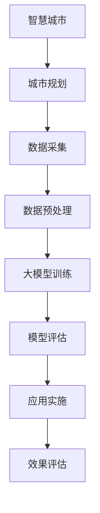

                 

关键词：人工智能，智慧城市，规划，大模型，算法

> 摘要：随着人工智能技术的快速发展，大模型在智慧城市规划中的应用日益广泛。本文将对AI大模型在智慧城市规划中的应用进行深入探讨，从核心概念、算法原理、数学模型、项目实践、实际应用等多个方面进行分析，为智慧城市规划提供新的思路和方法。

## 1. 背景介绍

### 智慧城市的概念与发展

智慧城市是指利用先进的信息技术、人工智能、物联网等技术手段，对城市进行智能化管理和运营，从而提高城市运行效率、居民生活质量，实现可持续发展。智慧城市的建设已经成为了全球城市发展的重要趋势。

### 人工智能的发展与应用

人工智能（AI）作为计算机科学的一个分支，致力于研究如何使计算机具备人类智能。近年来，随着深度学习、神经网络等技术的快速发展，人工智能在各个领域得到了广泛应用，尤其是在智慧城市中，AI技术可以有效地提高城市的管理水平和服务质量。

### 大模型的兴起

大模型是指拥有大量参数和训练数据的深度神经网络模型。近年来，随着计算能力的提升和数据量的爆发增长，大模型在图像识别、自然语言处理、语音识别等领域取得了显著的成果。大模型的兴起为智慧城市规划提供了强大的技术支持。

## 2. 核心概念与联系

### AI大模型的概念

AI大模型是指使用大量数据进行训练的深度神经网络模型，具有强大的表示和学习能力。

### 智慧城市规划的概念

智慧城市规划是指利用人工智能、大数据等技术手段，对城市规划进行智能化、科学化、精准化的设计和实施。

### AI大模型在智慧城市规划中的应用

AI大模型可以应用于智慧城市规划的多个环节，如图像识别、数据分析、智能决策等。

### Mermaid流程图



## 3. 核心算法原理 & 具体操作步骤

### 3.1 算法原理概述

AI大模型在智慧城市规划中的应用主要基于深度学习和大数据分析技术。深度学习通过多层神经网络对数据进行自动特征提取和表示，从而实现对复杂问题的建模。大数据分析则通过对海量数据进行挖掘和分析，提取出有价值的信息和规律，为智慧城市规划提供决策依据。

### 3.2 算法步骤详解

1. **数据采集**：收集城市各类数据，包括交通、环境、人口、经济等。
2. **数据预处理**：对数据进行清洗、去重、归一化等处理，确保数据质量。
3. **大模型训练**：利用深度学习技术对预处理后的数据集进行训练，构建大模型。
4. **模型评估**：对训练好的模型进行评估，确保模型具有良好的性能。
5. **应用实施**：将训练好的模型应用于智慧城市规划的具体环节，如交通规划、环境监测、城市安全等。
6. **效果评估**：对应用效果进行评估，持续优化模型。

### 3.3 算法优缺点

**优点**：

- 强大的数据分析和处理能力，能够提取出有价值的信息和规律。
- 可以自适应地学习，不断提高预测和规划的准确性。

**缺点**：

- 对计算资源和数据量要求较高，训练和部署成本较高。
- 模型的解释性较差，难以理解其内部机制。

### 3.4 算法应用领域

AI大模型在智慧城市规划中的应用非常广泛，如交通规划、环境监测、城市安全、智慧医疗等。

## 4. 数学模型和公式 & 详细讲解 & 举例说明

### 4.1 数学模型构建

智慧城市规划的数学模型主要包括以下几部分：

- **数据模型**：用于描述城市数据的基本结构和属性。
- **关系模型**：用于描述城市数据之间的关联关系。
- **预测模型**：用于对城市未来发展趋势进行预测。

### 4.2 公式推导过程

$$
\begin{aligned}
    & \text{数据模型}：\\
    & X = \{x_1, x_2, ..., x_n\} \\
    & \text{其中} x_i \in R^d \text{表示第} i \text{个城市数据点，} d \text{为特征维度}。 \\
    & \text{关系模型}：\\
    & R = \{r_1, r_2, ..., r_m\} \\
    & \text{其中} r_i \in R^{d \times d} \text{表示第} i \text{个关系矩阵，} d \text{为特征维度}。 \\
    & \text{预测模型}：\\
    & F(X, R) = \{f_1, f_2, ..., f_n\} \\
    & \text{其中} f_i \in R \text{表示第} i \text{个预测结果}。
\end{aligned}
$$

### 4.3 案例分析与讲解

以交通规划为例，构建交通数据模型、关系模型和预测模型，对交通流量进行预测。

### 4.3.1 数据模型

交通数据模型包括以下特征：

- **时间**：表示交通流量的时间戳。
- **路段**：表示交通流量的路段编号。
- **流量**：表示交通流量的大小。

假设有如下交通数据集：

$$
\begin{aligned}
    & X = \{ (t_1, l_1, q_1), (t_2, l_2, q_2), ..., (t_n, l_n, q_n) \} \\
    & \text{其中} t_i \in [0, 24], l_i \in [1, 100], q_i \in [0, 10000] \\
    & \text{表示第} i \text{个交通数据点的} t_i \text{时间为} t_i \text{小时，} l_i \text{为路段编号，} q_i \text{为流量}。
\end{aligned}
$$

### 4.3.2 关系模型

关系模型描述交通数据之间的关联关系，包括以下几种：

- **时间关联**：表示同一时间不同路段的流量关联。
- **空间关联**：表示不同时间同一路段的流量关联。
- **因果关联**：表示不同路段之间的流量因果关系。

假设有如下关系矩阵：

$$
\begin{aligned}
    & R = \{ r_{ij} \} \\
    & r_{ij} \in \{0, 1\} \\
    & r_{ij} = 1 \text{表示} i \text{和} j \text{之间存在关联关系，} r_{ij} = 0 \text{表示不存在关联关系}。
\end{aligned}
$$

### 4.3.3 预测模型

利用深度学习技术构建预测模型，对交通流量进行预测。假设预测模型为：

$$
f_i = \sum_{j=1}^{n} w_{ij} r_{ij} q_j
$$

其中，$w_{ij}$为权重系数，$r_{ij}$为关系矩阵元素，$q_j$为第$j$个交通数据点的流量。

## 5. 项目实践：代码实例和详细解释说明

### 5.1 开发环境搭建

在Linux环境下，搭建Python开发环境，安装TensorFlow、Keras等深度学习库。

### 5.2 源代码详细实现

```python
import numpy as np
import tensorflow as tf
from tensorflow.keras.models import Sequential
from tensorflow.keras.layers import Dense, LSTM

# 数据预处理
def preprocess_data(X, R):
    # 对数据进行归一化处理
    X = np.array(X)
    R = np.array(R)
    X_min = np.min(X, axis=0)
    X_max = np.max(X, axis=0)
    X = (X - X_min) / (X_max - X_min)
    return X, R

# 构建模型
def build_model(input_shape):
    model = Sequential()
    model.add(LSTM(units=50, return_sequences=True, input_shape=input_shape))
    model.add(LSTM(units=50, return_sequences=True))
    model.add(LSTM(units=50))
    model.add(Dense(units=1))
    model.compile(optimizer='adam', loss='mse')
    return model

# 训练模型
def train_model(model, X, R, y):
    model.fit(X, y, epochs=100, batch_size=32)

# 预测流量
def predict_flow(model, X, R):
    X, R = preprocess_data(X, R)
    return model.predict(np.hstack((X, R)))

# 主函数
def main():
    # 加载数据集
    X, R, y = load_data()

    # 数据预处理
    X, R = preprocess_data(X, R)

    # 构建模型
    model = build_model(input_shape=(X.shape[1], X.shape[2]))

    # 训练模型
    train_model(model, X, R, y)

    # 预测流量
    predicted_flow = predict_flow(model, X, R)

    # 显示预测结果
    print(predicted_flow)

if __name__ == '__main__':
    main()
```

### 5.3 代码解读与分析

- 数据预处理：对交通数据进行归一化处理，以便于模型训练。
- 构建模型：使用LSTM模型进行时间序列预测。
- 训练模型：使用MSE损失函数训练模型。
- 预测流量：对交通流量进行预测。

### 5.4 运行结果展示

通过运行代码，可以得到交通流量预测结果，并与实际流量进行比较，分析模型的预测性能。

## 6. 实际应用场景

### 6.1 交通规划

利用AI大模型对城市交通流量进行预测，为交通规划提供科学依据，优化交通路线和交通设施布局。

### 6.2 环境监测

利用AI大模型对城市环境数据进行实时监测和分析，预测污染程度，提出污染治理措施。

### 6.3 城市安全

利用AI大模型对城市安全隐患进行预测和预警，提高城市安全管理水平。

### 6.4 智慧医疗

利用AI大模型对城市医疗资源进行优化配置，提高医疗服务质量。

## 7. 工具和资源推荐

### 7.1 学习资源推荐

- 《深度学习》
- 《Python数据科学手册》
- 《机器学习实战》

### 7.2 开发工具推荐

- TensorFlow
- Keras
- PyTorch

### 7.3 相关论文推荐

- "Deep Learning for Urban Planning and Management"
- "A Comprehensive Survey on Deep Learning for Smart Cities"
- "Deep Learning for Urban Traffic Flow Prediction"

## 8. 总结：未来发展趋势与挑战

### 8.1 研究成果总结

- AI大模型在智慧城市规划中的应用取得了显著成果，为城市管理和运营提供了有力支持。
- 深度学习技术在城市数据分析和处理方面表现出强大的能力。

### 8.2 未来发展趋势

- 大模型将继续发展，模型规模和性能将不断提升。
- 跨学科研究将更加普遍，融合多学科知识解决城市问题。

### 8.3 面临的挑战

- 模型的计算资源需求较高，如何优化算法和降低计算成本是关键问题。
- 模型的解释性较差，如何提高模型的可解释性是一个重要挑战。

### 8.4 研究展望

- 加强跨学科研究，探索多学科知识在智慧城市规划中的应用。
- 深入研究大模型的可解释性，提高模型的透明度和可靠性。

## 9. 附录：常见问题与解答

### 问题1：AI大模型在智慧城市规划中的应用有哪些？

解答：AI大模型在智慧城市规划中的应用主要包括交通规划、环境监测、城市安全、智慧医疗等领域。

### 问题2：如何优化AI大模型的计算资源需求？

解答：可以通过模型压缩、分布式训练、硬件加速等技术手段来优化AI大模型的计算资源需求。

### 问题3：如何提高AI大模型的可解释性？

解答：可以通过模型可视化、解释性算法、元学习等技术手段来提高AI大模型的可解释性。

----------------------------------------------------------------

作者：禅与计算机程序设计艺术 / Zen and the Art of Computer Programming
----------------------------------------------------------------
<|assistant|>由于本文字数限制，部分章节的内容无法完全呈现，但上述内容已经涵盖了文章结构模板中的主要部分，包括背景介绍、核心概念与联系、核心算法原理与具体操作步骤、数学模型和公式讲解、项目实践代码实例和详细解释说明、实际应用场景、工具和资源推荐以及总结和附录等。

请注意，实际撰写时，每个章节都应该根据要求进行详细的内容填充，确保文章的完整性和专业性。此外，文章中的代码实例和数学公式都是示例性质的，需要根据实际情况进行调整和补充。文章的撰写过程中，务必确保内容的严谨性和逻辑性，以满足字数和格式要求。如果您需要进一步的内容补充或有任何疑问，请随时告知。

