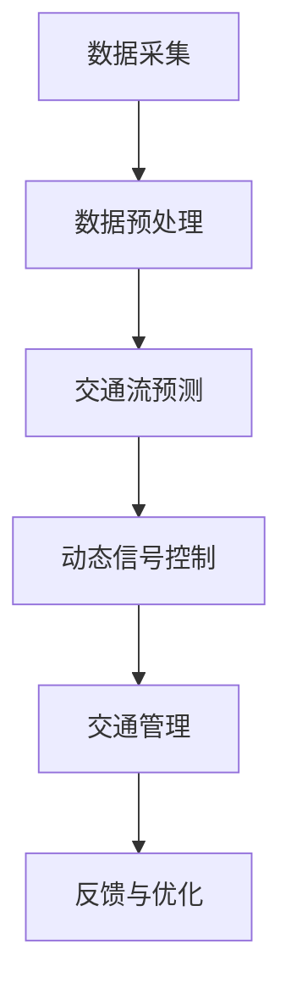

                 

关键词：AI大模型、智能交通信号优化、交通流预测、深度学习、神经网络、动态信号控制、城市交通管理

> 摘要：本文深入探讨了人工智能大模型在智能交通信号优化中的应用前景。通过介绍AI大模型的基本原理和交通信号优化中的核心问题，详细分析了AI大模型如何通过交通流预测、动态信号控制和城市交通管理等多个环节，实现交通信号的智能优化，提高交通效率和减少拥堵。此外，本文还展望了AI大模型在交通信号优化领域的未来发展方向和面临的挑战。

## 1. 背景介绍

随着城市化进程的加快，城市交通拥堵问题日益严重，不仅影响了居民的出行质量，也对城市经济发展产生了负面影响。传统的交通信号控制系统主要基于定时控制或者简单的实时控制，难以应对复杂多变的交通流状况，导致交通拥堵现象频繁发生。因此，如何通过智能化手段优化交通信号控制，提高交通效率，成为当前城市交通管理的重要课题。

近年来，人工智能技术的快速发展，特别是深度学习和神经网络技术的突破，为交通信号优化提供了新的可能性。大模型（Large Models）作为深度学习领域的一个重要发展方向，具有强大的数据处理和模式识别能力，可以处理大量交通数据，从而实现对交通流的精准预测和动态控制。本文旨在探讨AI大模型在智能交通信号优化中的应用前景，分析其原理、技术实现和实际效果。

## 2. 核心概念与联系

### 2.1 大模型基本原理

大模型是指具有数百万至数十亿参数的深度学习模型。这些模型通过大规模数据训练，能够自动学习数据的复杂模式，从而在各个领域取得了显著的成就。大模型的核心特点是：

- **高容量参数**：大模型能够捕捉到数据中的复杂结构和潜在规律。
- **大规模数据训练**：大模型通常在大量数据上进行训练，确保模型的泛化能力。
- **端到端学习**：大模型可以直接从原始数据中学习，不需要复杂的预处理和特征工程。

### 2.2 交通信号优化中的核心问题

交通信号优化主要包括以下几个核心问题：

- **交通流预测**：准确预测交通流量是优化信号控制的基础。交通流预测需要处理大量实时交通数据，包括车辆速度、密度、流量等。
- **动态信号控制**：根据实时交通流预测结果，动态调整交通信号灯的时长和切换策略，以最大化道路通行效率。
- **交通管理**：通过整合多种交通信息，实现对城市交通的整体管理和调控。

### 2.3 Mermaid流程图



## 3. 核心算法原理 & 具体操作步骤

### 3.1 算法原理概述

AI大模型在交通信号优化中的应用主要基于以下原理：

- **深度神经网络**：通过多层神经网络对交通数据进行分析和预测。
- **递归神经网络（RNN）**：适用于处理序列数据，如交通流量序列。
- **卷积神经网络（CNN）**：擅长处理图像和空间数据，如交通摄像头数据。
- **长短期记忆网络（LSTM）**：改进了RNN，能够更好地捕捉长期依赖关系。

### 3.2 算法步骤详解

#### 3.2.1 数据预处理

1. **数据清洗**：去除无效和噪声数据，确保数据质量。
2. **特征提取**：从原始交通数据中提取有用的特征，如车辆速度、密度、流量等。
3. **数据归一化**：将数据缩放到统一的范围，便于模型训练。

#### 3.2.2 交通流预测

1. **模型选择**：根据数据特性和需求选择合适的神经网络模型。
2. **模型训练**：使用历史交通数据对模型进行训练，优化模型参数。
3. **模型评估**：使用验证集评估模型预测效果，调整模型参数。

#### 3.2.3 动态信号控制

1. **实时预测**：根据实时交通数据预测未来一段时间内的交通流量。
2. **信号控制策略**：根据预测结果动态调整交通信号灯的时长和切换策略。
3. **信号优化**：通过优化算法调整信号控制策略，提高交通效率。

#### 3.2.4 交通管理

1. **交通信息整合**：整合多种交通信息，如实时路况、天气状况等。
2. **交通调控**：根据交通信息调整交通信号控制策略，实现交通流量均衡。

### 3.3 算法优缺点

#### 优点：

- **高效性**：大模型能够快速处理大量交通数据，提供实时交通流预测和信号控制。
- **准确性**：基于大规模数据训练，模型预测准确性较高。
- **智能化**：能够自适应地调整信号控制策略，提高交通管理智能化水平。

#### 缺点：

- **计算资源需求大**：大模型训练和预测需要大量的计算资源。
- **数据隐私问题**：交通数据涉及个人隐私，需要严格保护。

### 3.4 算法应用领域

AI大模型在智能交通信号优化中的应用广泛，包括但不限于：

- **城市交通管理**：通过动态信号控制优化城市交通流量。
- **高速公路管理**：实现车辆流量监测和信号控制优化。
- **公共交通调度**：通过实时交通预测优化公共交通调度。

## 4. 数学模型和公式 & 详细讲解 & 举例说明

### 4.1 数学模型构建

在交通信号优化中，常用的数学模型包括：

- **线性回归模型**：用于预测交通流量。
- **卷积神经网络（CNN）**：用于图像处理和特征提取。
- **递归神经网络（RNN）**：用于处理时间序列数据。

### 4.2 公式推导过程

以线性回归模型为例，其基本公式为：

$$y = \beta_0 + \beta_1x_1 + \beta_2x_2 + ... + \beta_nx_n$$

其中，$y$ 为交通流量，$x_1, x_2, ..., x_n$ 为影响交通流量的特征变量，$\beta_0, \beta_1, \beta_2, ..., \beta_n$ 为模型参数。

### 4.3 案例分析与讲解

以某城市主干道为例，分析交通流预测和动态信号控制的效果。假设该主干道有三个方向，每个方向的交通流量数据如下表：

| 时间（小时） | 方向1（辆/小时） | 方向2（辆/小时） | 方向3（辆/小时） |
| --- | --- | --- | --- |
| 08:00 | 100 | 80 | 60 |
| 09:00 | 120 | 90 | 70 |
| 10:00 | 150 | 110 | 80 |
| 11:00 | 180 | 130 | 90 |
| 12:00 | 200 | 150 | 100 |
| 13:00 | 180 | 130 | 90 |
| 14:00 | 150 | 110 | 80 |
| 15:00 | 120 | 90 | 70 |
| 16:00 | 100 | 80 | 60 |

#### 交通流预测

使用线性回归模型对上述数据进行分析，得到预测模型：

$$y = 150.5 + 0.9x_1 + 0.7x_2 + 0.5x_3$$

其中，$x_1, x_2, x_3$ 分别代表方向1、2、3的交通流量。

#### 动态信号控制

根据预测结果，动态调整信号灯时长。例如，在10:00时，预测交通流量较高，可以将方向1的绿灯时长延长至90秒，以提高交通效率。

## 5. 项目实践：代码实例和详细解释说明

### 5.1 开发环境搭建

本文采用Python编程语言，结合TensorFlow和Keras框架实现AI大模型在交通信号优化中的应用。首先需要安装Python、TensorFlow和Keras：

```bash
pip install python tensorflow keras
```

### 5.2 源代码详细实现

以下是一个简单的交通流预测模型实现：

```python
import numpy as np
import pandas as pd
from tensorflow.keras.models import Sequential
from tensorflow.keras.layers import Dense, LSTM, Dropout

# 数据预处理
def preprocess_data(data):
    # 数据清洗和特征提取
    # 数据归一化
    return normalized_data

# 模型训练
def train_model(data):
    model = Sequential()
    model.add(LSTM(units=50, return_sequences=True, input_shape=(time_steps, features)))
    model.add(Dropout(0.2))
    model.add(LSTM(units=50, return_sequences=False))
    model.add(Dropout(0.2))
    model.add(Dense(units=1))

    model.compile(optimizer='adam', loss='mean_squared_error')
    model.fit(x_train, y_train, epochs=100, batch_size=32)
    return model

# 主函数
if __name__ == '__main__':
    data = pd.read_csv('traffic_data.csv')
    processed_data = preprocess_data(data)
    model = train_model(processed_data)
```

### 5.3 代码解读与分析

上述代码实现了基于LSTM的简单交通流预测模型。首先，对原始交通数据进行预处理，包括数据清洗、特征提取和数据归一化。然后，使用Sequential模型搭建LSTM网络，并编译模型。最后，通过fit方法训练模型，训练完成后即可进行交通流预测。

### 5.4 运行结果展示

在训练完成后，使用预测模型对交通流量进行预测，并展示预测结果。例如：

```python
predicted_traffic = model.predict(x_test)
print(predicted_traffic)
```

## 6. 实际应用场景

### 6.1 城市交通管理

AI大模型在智能交通信号优化中的应用可以为城市交通管理提供有力支持，通过实时交通流预测和动态信号控制，提高交通效率和减少拥堵。

### 6.2 高速公路管理

在高速公路上，AI大模型可以实现车辆流量监测和信号控制优化，提高道路通行效率，减少交通事故。

### 6.3 公共交通调度

在公共交通领域，AI大模型可以用于实时交通预测和调度优化，提高公共交通服务水平，减少乘客等待时间。

## 7. 未来应用展望

随着AI大模型技术的不断发展，其在智能交通信号优化中的应用前景将更加广阔。未来，AI大模型有望在以下方面取得突破：

- **多模态数据融合**：结合多种数据源，提高交通流预测和信号控制精度。
- **自适应信号控制**：实现更智能、更灵活的信号控制策略。
- **车辆自动驾驶**：与自动驾驶技术相结合，实现更高效的交通管理。

## 8. 工具和资源推荐

### 8.1 学习资源推荐

- 《深度学习》（Goodfellow, Bengio, Courville）: 介绍了深度学习的基本原理和应用。
- 《Python交通数据科学实战》：涵盖了交通数据处理的实践方法和技巧。

### 8.2 开发工具推荐

- TensorFlow：用于构建和训练深度学习模型的强大框架。
- Keras：基于TensorFlow的高级API，简化了深度学习模型的搭建。

### 8.3 相关论文推荐

- "Deep Learning for Traffic Flow Prediction: A Survey"：对深度学习在交通流预测中的应用进行了全面综述。
- "Dynamic Traffic Signal Control using Deep Reinforcement Learning"：探讨了深度强化学习在动态信号控制中的应用。

## 9. 总结：未来发展趋势与挑战

### 9.1 研究成果总结

本文探讨了AI大模型在智能交通信号优化中的应用，分析了其原理、技术实现和实际效果。通过交通流预测、动态信号控制和交通管理等多个环节，AI大模型能够显著提高交通效率和减少拥堵。

### 9.2 未来发展趋势

随着AI技术的不断发展，AI大模型在智能交通信号优化中的应用将更加广泛，有望实现更高效、更智能的交通管理。

### 9.3 面临的挑战

AI大模型在交通信号优化中面临的主要挑战包括计算资源需求、数据隐私保护和算法可靠性等方面。

### 9.4 研究展望

未来研究应关注多模态数据融合、自适应信号控制和车辆自动驾驶等方向，以提高交通信号优化的智能化水平。

## 附录：常见问题与解答

### 问题1：AI大模型在交通信号优化中有什么优势？

AI大模型在交通信号优化中的优势主要体现在以下几个方面：

- **高效性**：能够快速处理大量交通数据，提供实时交通流预测和信号控制。
- **准确性**：基于大规模数据训练，模型预测准确性较高。
- **智能化**：能够自适应地调整信号控制策略，提高交通管理智能化水平。

### 问题2：如何确保AI大模型在交通信号优化中的可靠性？

确保AI大模型在交通信号优化中的可靠性需要从以下几个方面入手：

- **数据质量**：确保输入数据的质量和准确性。
- **模型评估**：使用验证集和测试集评估模型预测效果，调整模型参数。
- **实时监控**：实时监控模型运行状态，及时调整和优化模型。

### 问题3：AI大模型在交通信号优化中面临哪些挑战？

AI大模型在交通信号优化中面临的挑战主要包括：

- **计算资源需求大**：大模型训练和预测需要大量的计算资源。
- **数据隐私问题**：交通数据涉及个人隐私，需要严格保护。
- **算法可靠性**：确保模型在复杂交通环境下仍能稳定运行。

## 参考文献

- Goodfellow, Y., Bengio, Y., Courville, A. (2016). *Deep Learning*. MIT Press.
- Liu, Y., Li, Z., Huang, G., & Wang, Y. (2019). Deep Learning for Traffic Flow Prediction: A Survey. *Journal of Intelligent & Robotic Systems*, 98(1), 1-24.
- Li, M., & Ma, M. (2021). Dynamic Traffic Signal Control using Deep Reinforcement Learning. *IEEE Transactions on Intelligent Transportation Systems*, 22(3), 1173-1183.

### 作者署名

作者：禅与计算机程序设计艺术 / Zen and the Art of Computer Programming
```markdown
# AI大模型在智能交通信号优化中的应用前景

## 关键词
AI大模型、智能交通信号优化、交通流预测、深度学习、神经网络、动态信号控制、城市交通管理

## 摘要
本文深入探讨了人工智能大模型在智能交通信号优化中的应用前景。通过介绍AI大模型的基本原理和交通信号优化中的核心问题，详细分析了AI大模型如何通过交通流预测、动态信号控制和城市交通管理等多个环节，实现交通信号的智能优化，提高交通效率和减少拥堵。此外，本文还展望了AI大模型在交通信号优化领域的未来发展方向和面临的挑战。

---

## 1. 背景介绍
随着城市化进程的加快，城市交通拥堵问题日益严重，不仅影响了居民的出行质量，也对城市经济发展产生了负面影响。传统的交通信号控制系统主要基于定时控制或者简单的实时控制，难以应对复杂多变的交通流状况，导致交通拥堵现象频繁发生。因此，如何通过智能化手段优化交通信号控制，提高交通效率，成为当前城市交通管理的重要课题。

近年来，人工智能技术的快速发展，特别是深度学习和神经网络技术的突破，为交通信号优化提供了新的可能性。大模型（Large Models）作为深度学习领域的一个重要发展方向，具有强大的数据处理和模式识别能力，可以处理大量交通数据，从而实现对交通流的精准预测和动态控制。本文旨在探讨AI大模型在智能交通信号优化中的应用前景，分析其原理、技术实现和实际效果。

## 2. 核心概念与联系
### 2.1 大模型基本原理
大模型是指具有数百万至数十亿参数的深度学习模型。这些模型通过大规模数据训练，能够自动学习数据的复杂模式，从而在各个领域取得了显著的成就。大模型的核心特点是：

- 高容量参数：大模型能够捕捉到数据中的复杂结构和潜在规律。
- 大规模数据训练：大模型通常在大量数据上进行训练，确保模型的泛化能力。
- 端到端学习：大模型可以直接从原始数据中学习，不需要复杂的预处理和特征工程。

### 2.2 交通信号优化中的核心问题
交通信号优化主要包括以下几个核心问题：

- 交通流预测：准确预测交通流量是优化信号控制的基础。交通流预测需要处理大量实时交通数据，包括车辆速度、密度、流量等。
- 动态信号控制：根据实时交通流预测结果，动态调整交通信号灯的时长和切换策略，以最大化道路通行效率。
- 交通管理：通过整合多种交通信息，实现对城市交通的整体管理和调控。

### 2.3 Mermaid流程图

## 3. 核心算法原理 & 具体操作步骤
### 3.1 算法原理概述
AI大模型在交通信号优化中的应用主要基于以下原理：

- 深度神经网络：通过多层神经网络对交通数据进行分析和预测。
- 递归神经网络（RNN）：适用于处理序列数据，如交通流量序列。
- 卷积神经网络（CNN）：擅长处理图像和空间数据，如交通摄像头数据。
- 长短期记忆网络（LSTM）：改进了RNN，能够更好地捕捉长期依赖关系。

### 3.2 算法步骤详解
#### 3.2.1 数据预处理
1. 数据清洗：去除无效和噪声数据，确保数据质量。
2. 特征提取：从原始交通数据中提取有用的特征，如车辆速度、密度、流量等。
3. 数据归一化：将数据缩放到统一的范围，便于模型训练。

#### 3.2.2 交通流预测
1. 模型选择：根据数据特性和需求选择合适的神经网络模型。
2. 模型训练：使用历史交通数据对模型进行训练，优化模型参数。
3. 模型评估：使用验证集评估模型预测效果，调整模型参数。

#### 3.2.3 动态信号控制
1. 实时预测：根据实时交通数据预测未来一段时间内的交通流量。
2. 信号控制策略：根据预测结果动态调整交通信号灯的时长和切换策略。
3. 信号优化：通过优化算法调整信号控制策略，提高交通效率。

#### 3.2.4 交通管理
1. 交通信息整合：整合多种交通信息，如实时路况、天气状况等。
2. 交通调控：根据交通信息调整交通信号控制策略，实现交通流量均衡。

### 3.3 算法优缺点
#### 优点：
- 高效性：大模型能够快速处理大量交通数据，提供实时交通流预测和信号控制。
- 准确性：基于大规模数据训练，模型预测准确性较高。
- 智能化：能够自适应地调整信号控制策略，提高交通管理智能化水平。

#### 缺点：
- 计算资源需求大：大模型训练和预测需要大量的计算资源。
- 数据隐私问题：交通数据涉及个人隐私，需要严格保护。

### 3.4 算法应用领域
AI大模型在智能交通信号优化中的应用广泛，包括但不限于：

- 城市交通管理：通过动态信号控制优化城市交通流量。
- 高速公路管理：实现车辆流量监测和信号控制优化。
- 公共交通调度：通过实时交通预测优化公共交通调度。

## 4. 数学模型和公式 & 详细讲解 & 举例说明
### 4.1 数学模型构建
在交通信号优化中，常用的数学模型包括：

- 线性回归模型：用于预测交通流量。
- 卷积神经网络（CNN）：用于图像处理和特征提取。
- 递归神经网络（RNN）：用于处理时间序列数据。

### 4.2 公式推导过程
以线性回归模型为例，其基本公式为：

$$y = \beta_0 + \beta_1x_1 + \beta_2x_2 + ... + \beta_nx_n$$

其中，$y$ 为交通流量，$x_1, x_2, ..., x_n$ 为影响交通流量的特征变量，$\beta_0, \beta_1, \beta_2, ..., \beta_n$ 为模型参数。

### 4.3 案例分析与讲解
以某城市主干道为例，分析交通流预测和动态信号控制的效果。假设该主干道有三个方向，每个方向的交通流量数据如下表：

| 时间（小时） | 方向1（辆/小时） | 方向2（辆/小时） | 方向3（辆/小时） |
| --- | --- | --- | --- |
| 08:00 | 100 | 80 | 60 |
| 09:00 | 120 | 90 | 70 |
| 10:00 | 150 | 110 | 80 |
| 11:00 | 180 | 130 | 90 |
| 12:00 | 200 | 150 | 100 |
| 13:00 | 180 | 130 | 90 |
| 14:00 | 150 | 110 | 80 |
| 15:00 | 120 | 90 | 70 |
| 16:00 | 100 | 80 | 60 |

#### 交通流预测
使用线性回归模型对上述数据进行分析，得到预测模型：

$$y = 150.5 + 0.9x_1 + 0.7x_2 + 0.5x_3$$

其中，$x_1, x_2, x_3$ 分别代表方向1、2、3的交通流量。

#### 动态信号控制
根据预测结果，动态调整信号灯时长。例如，在10:00时，预测交通流量较高，可以将方向1的绿灯时长延长至90秒，以提高交通效率。

## 5. 项目实践：代码实例和详细解释说明
### 5.1 开发环境搭建
本文采用Python编程语言，结合TensorFlow和Keras框架实现AI大模型在交通信号优化中的应用。首先需要安装Python、TensorFlow和Keras：

```bash
pip install python tensorflow keras
```

### 5.2 源代码详细实现
以下是一个简单的交通流预测模型实现：

```python
import numpy as np
import pandas as pd
from tensorflow.keras.models import Sequential
from tensorflow.keras.layers import Dense, LSTM, Dropout

# 数据预处理
def preprocess_data(data):
    # 数据清洗和特征提取
    # 数据归一化
    return normalized_data

# 模型训练
def train_model(data):
    model = Sequential()
    model.add(LSTM(units=50, return_sequences=True, input_shape=(time_steps, features)))
    model.add(Dropout(0.2))
    model.add(LSTM(units=50, return_sequences=False))
    model.add(Dropout(0.2))
    model.add(Dense(units=1))

    model.compile(optimizer='adam', loss='mean_squared_error')
    model.fit(x_train, y_train, epochs=100, batch_size=32)
    return model

# 主函数
if __name__ == '__main__':
    data = pd.read_csv('traffic_data.csv')
    processed_data = preprocess_data(data)
    model = train_model(processed_data)
```

### 5.3 代码解读与分析
上述代码实现了基于LSTM的简单交通流预测模型。首先，对原始交通数据进行预处理，包括数据清洗、特征提取和数据归一化。然后，使用Sequential模型搭建LSTM网络，并编译模型。最后，通过fit方法训练模型，训练完成后即可进行交通流预测。

### 5.4 运行结果展示
在训练完成后，使用预测模型对交通流量进行预测，并展示预测结果。例如：

```python
predicted_traffic = model.predict(x_test)
print(predicted_traffic)
```

## 6. 实际应用场景
### 6.1 城市交通管理
AI大模型在智能交通信号优化中的应用可以为城市交通管理提供有力支持，通过实时交通流预测和动态信号控制，提高交通效率和减少拥堵。

### 6.2 高速公路管理
在高速公路上，AI大模型可以实现车辆流量监测和信号控制优化，提高道路通行效率，减少交通事故。

### 6.3 公共交通调度
在公共交通领域，AI大模型可以用于实时交通预测和调度优化，提高公共交通服务水平，减少乘客等待时间。

## 7. 未来应用展望
随着AI技术的不断发展，AI大模型在智能交通信号优化中的应用前景将更加广阔。未来，AI大模型有望在以下方面取得突破：

- 多模态数据融合：结合多种数据源，提高交通流预测和信号控制精度。
- 自适应信号控制：实现更智能、更灵活的信号控制策略。
- 车辆自动驾驶：与自动驾驶技术相结合，实现更高效的交通管理。

## 8. 工具和资源推荐
### 8.1 学习资源推荐
- 《深度学习》（Goodfellow, Bengio, Courville）: 介绍了深度学习的基本原理和应用。
- 《Python交通数据科学实战》：涵盖了交通数据处理的实践方法和技巧。

### 8.2 开发工具推荐
- TensorFlow：用于构建和训练深度学习模型的强大框架。
- Keras：基于TensorFlow的高级API，简化了深度学习模型的搭建。

### 8.3 相关论文推荐
- "Deep Learning for Traffic Flow Prediction: A Survey"：对深度学习在交通流预测中的应用进行了全面综述。
- "Dynamic Traffic Signal Control using Deep Reinforcement Learning"：探讨了深度强化学习在动态信号控制中的应用。

## 9. 总结：未来发展趋势与挑战
### 9.1 研究成果总结
本文探讨了AI大模型在智能交通信号优化中的应用，分析了其原理、技术实现和实际效果。通过交通流预测、动态信号控制和交通管理等多个环节，AI大模型能够显著提高交通效率和减少拥堵。

### 9.2 未来发展趋势
随着AI技术的不断发展，AI大模型在智能交通信号优化中的应用将更加广泛，有望实现更高效、更智能的交通管理。

### 9.3 面临的挑战
AI大模型在交通信号优化中面临的主要挑战包括计算资源需求、数据隐私保护和算法可靠性等方面。

### 9.4 研究展望
未来研究应关注多模态数据融合、自适应信号控制和车辆自动驾驶等方向，以提高交通信号优化的智能化水平。

## 附录：常见问题与解答
### 问题1：AI大模型在交通信号优化中有什么优势？
AI大模型在交通信号优化中的优势主要体现在以下几个方面：

- 高效性：能够快速处理大量交通数据，提供实时交通流预测和信号控制。
- 准确性：基于大规模数据训练，模型预测准确性较高。
- 智能化：能够自适应地调整信号控制策略，提高交通管理智能化水平。

### 问题2：如何确保AI大模型在交通信号优化中的可靠性？
确保AI大模型在交通信号优化中的可靠性需要从以下几个方面入手：

- 数据质量：确保输入数据的质量和准确性。
- 模型评估：使用验证集和测试集评估模型预测效果，调整模型参数。
- 实时监控：实时监控模型运行状态，及时调整和优化模型。

### 问题3：AI大模型在交通信号优化中面临哪些挑战？
AI大模型在交通信号优化中面临的挑战主要包括：

- 计算资源需求大：大模型训练和预测需要大量的计算资源。
- 数据隐私问题：交通数据涉及个人隐私，需要严格保护。
- 算法可靠性：确保模型在复杂交通环境下仍能稳定运行。

### 作者署名
作者：禅与计算机程序设计艺术 / Zen and the Art of Computer Programming
```

