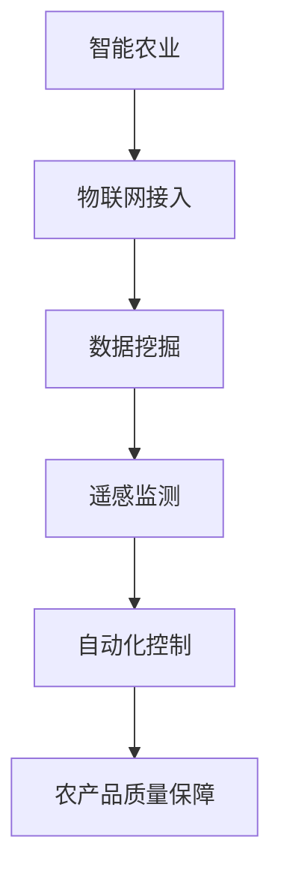

                 

 关键词：智能农业，AI大模型，深度学习，机器学习，数据挖掘，遥感技术，物联网，农业自动化

> 摘要：本文探讨了人工智能大模型在智能农业领域的创新应用前景。首先，介绍了智能农业的概念和发展历程，然后深入分析了AI大模型的核心原理和技术，并结合实际案例展示了其在农业数据挖掘、遥感监测、物联网接入和自动化控制等方面的应用，最后对未来智能农业的发展趋势和面临的挑战进行了展望。

## 1. 背景介绍

智能农业是信息技术与农业生产深度融合的产物，它通过采用现代信息技术，如物联网、大数据、云计算和人工智能，来实现农业的精准化、智能化和高效化。随着全球人口的增长和气候变化的影响，传统农业面临生产效率低、资源浪费和环境污染等问题，智能农业因此成为解决这些问题的关键。

### 1.1 智能农业的概念

智能农业是指通过应用信息技术、生物技术、工程技术等现代科技手段，实现对农业生产过程的全方位智能化管理和优化，从而提高农业生产效率、保障农产品质量安全和促进农业可持续发展。

### 1.2 智能农业的发展历程

智能农业的发展历程可以分为以下几个阶段：

1. **传统农业阶段**：依靠人力和简单工具进行农业生产。
2. **机械化阶段**：引入农业机械，提高劳动效率。
3. **信息化阶段**：引入计算机和信息技术，实现农业数据的数字化和自动化管理。
4. **智能化阶段**：应用人工智能、大数据、物联网等先进技术，实现农业的全面智能化。

## 2. 核心概念与联系

### 2.1 AI大模型的概念

AI大模型（也称为深度学习模型）是指通过大量数据训练的复杂神经网络模型，具有极高的处理能力和泛化能力。常见的AI大模型包括卷积神经网络（CNN）、循环神经网络（RNN）和变换器（Transformer）等。

### 2.2 AI大模型在智能农业中的应用

AI大模型在智能农业中的应用主要体现在以下几个方面：

1. **数据挖掘**：通过AI大模型对农业数据进行深度挖掘，发现规律和模式，为农业生产提供科学依据。
2. **遥感监测**：利用AI大模型对遥感图像进行解析，监测作物生长状况和病虫害。
3. **物联网接入**：通过AI大模型对物联网设备收集的数据进行智能分析，实现农业生产过程的自动化控制。
4. **自动化控制**：利用AI大模型实现农业机械的自动化操作，提高农业生产效率。

### 2.3 Mermaid流程图



## 3. 核心算法原理 & 具体操作步骤

### 3.1 算法原理概述

AI大模型的核心算法是基于深度学习的，其基本原理是通过多层神经网络对输入数据进行层层抽象和特征提取，最终实现复杂任务的自动完成。深度学习的训练过程包括数据的收集、预处理、模型构建、训练和优化等步骤。

### 3.2 算法步骤详解

1. **数据收集**：收集大量农业相关数据，包括土壤、气象、作物生长、病虫害等。
2. **数据预处理**：对原始数据进行清洗、归一化和特征提取。
3. **模型构建**：选择合适的深度学习模型架构，如CNN、RNN或Transformer。
4. **模型训练**：使用预处理后的数据对模型进行训练，调整模型参数。
5. **模型优化**：通过交叉验证和超参数调整，优化模型性能。
6. **模型部署**：将训练好的模型部署到农业生产环境中，实现实时分析和决策。

### 3.3 算法优缺点

**优点**：

1. **高效性**：能够快速处理大量农业数据，实现实时分析和决策。
2. **准确性**：通过大规模数据训练，模型具有高准确性和泛化能力。
3. **灵活性**：能够根据不同应用场景进行调整和优化。

**缺点**：

1. **数据依赖性**：需要大量高质量的数据进行训练，否则模型性能可能不佳。
2. **计算资源消耗**：深度学习模型训练需要大量计算资源和时间。
3. **解释性**：深度学习模型的黑盒性质使得其决策过程难以解释和理解。

### 3.4 算法应用领域

AI大模型在智能农业中的应用非常广泛，主要包括：

1. **作物病虫害监测与预警**：通过图像识别和遥感监测技术，实时监测作物病虫害，提前预警。
2. **作物生长状态预测**：通过对气象、土壤等数据进行深度学习分析，预测作物生长趋势和产量。
3. **农业自动化控制**：利用深度学习模型实现农业机械的自动化操作，提高生产效率。
4. **农产品质量检测**：通过深度学习模型对农产品进行质量检测，保障食品安全。

## 4. 数学模型和公式 & 详细讲解 & 举例说明

### 4.1 数学模型构建

AI大模型的数学基础主要包括线性代数、微积分和概率论。以下是一个简单的线性回归模型：

$$
y = \beta_0 + \beta_1 \cdot x
$$

其中，$y$ 是预测值，$x$ 是输入特征，$\beta_0$ 和 $\beta_1$ 是模型参数。

### 4.2 公式推导过程

假设我们有 $N$ 个样本，每个样本包含输入特征 $x$ 和预测值 $y$。为了最小化预测误差，我们可以使用最小二乘法求解模型参数：

$$
\min \sum_{i=1}^{N} (y_i - (\beta_0 + \beta_1 \cdot x_i))^2
$$

对上式求导并令导数为零，得到：

$$
\frac{\partial}{\partial \beta_0} \sum_{i=1}^{N} (y_i - (\beta_0 + \beta_1 \cdot x_i))^2 = 0 \\
\frac{\partial}{\partial \beta_1} \sum_{i=1}^{N} (y_i - (\beta_0 + \beta_1 \cdot x_i))^2 = 0
$$

解上述方程组，得到模型参数：

$$
\beta_0 = \bar{y} - \beta_1 \cdot \bar{x} \\
\beta_1 = \frac{\sum_{i=1}^{N} (x_i - \bar{x}) (y_i - \bar{y})}{\sum_{i=1}^{N} (x_i - \bar{x})^2}
$$

### 4.3 案例分析与讲解

假设我们有一个简单的农作物生长预测问题，输入特征为土壤湿度（$x$），预测值为农作物产量（$y$）。通过收集历史数据，我们可以使用线性回归模型进行预测。

数据集如下：

| 序号 | 土壤湿度（%） | 农作物产量（kg/公顷） |
| ---- | ---------- | -------------- |
| 1    | 20         | 2000           |
| 2    | 30         | 2200           |
| 3    | 40         | 2400           |
| 4    | 50         | 2600           |
| 5    | 60         | 2800           |

首先，计算输入特征和预测值的平均值：

$$
\bar{x} = \frac{20 + 30 + 40 + 50 + 60}{5} = 40 \\
\bar{y} = \frac{2000 + 2200 + 2400 + 2600 + 2800}{5} = 2400
$$

然后，计算模型参数：

$$
\beta_0 = 2400 - 40 \cdot 40 = 1600 \\
\beta_1 = \frac{(20 - 40)(2000 - 2400) + (30 - 40)(2200 - 2400) + (40 - 40)(2400 - 2400) + (50 - 40)(2600 - 2400) + (60 - 40)(2800 - 2400)}{(20 - 40)^2 + (30 - 40)^2 + (40 - 40)^2 + (50 - 40)^2 + (60 - 40)^2} = 20
$$

因此，农作物产量与土壤湿度的线性回归模型为：

$$
y = 1600 + 20 \cdot x
$$

使用该模型预测土壤湿度为 45% 的农作物产量：

$$
y = 1600 + 20 \cdot 45 = 2300
$$

## 5. 项目实践：代码实例和详细解释说明

### 5.1 开发环境搭建

为了实践AI大模型在智能农业中的应用，我们需要搭建一个合适的开发环境。以下是基本步骤：

1. **安装Python**：下载并安装Python 3.8及以上版本。
2. **安装TensorFlow**：使用pip命令安装TensorFlow库。
   ```shell
   pip install tensorflow
   ```
3. **安装其他依赖库**：安装NumPy、Pandas等常用库。

### 5.2 源代码详细实现

以下是使用TensorFlow实现线性回归模型的基本代码：

```python
import tensorflow as tf
import numpy as np
import pandas as pd

# 数据集
data = pd.DataFrame({
    'soil_humidity': [20, 30, 40, 50, 60],
    'crop_yield': [2000, 2200, 2400, 2600, 2800]
})

# 输入特征和预测值
X = data[['soil_humidity']]
y = data['crop_yield']

# 模型参数
beta_0 = tf.Variable(0.0, name='beta_0')
beta_1 = tf.Variable(0.0, name='beta_1')

# 模型构建
model = tf.keras.Sequential([
    tf.keras.layers.Dense(units=1, input_shape=[1], 
                           kernel_initializer=tf.random_uniform_initializer(),
                           bias_initializer=tf.zeros_initializer())
])

# 模型编译
model.compile(optimizer=tf.keras.optimizers.Adam(0.1),
              loss='mean_squared_error')

# 模型训练
model.fit(X, y, epochs=1000)

# 模型评估
print(model.evaluate(X, y))

# 预测新数据
new_data = np.array([45])
predicted_yield = model.predict(new_data)
print(f"Crop yield prediction: {predicted_yield[0][0]} kg/ha")
```

### 5.3 代码解读与分析

上述代码实现了线性回归模型的训练和预测功能。具体步骤如下：

1. **数据准备**：读取农作物生长数据集，分为输入特征（土壤湿度）和预测值（农作物产量）。
2. **模型构建**：使用TensorFlow构建一个简单的全连接神经网络，包含一个输出节点，用于预测农作物产量。
3. **模型编译**：设置优化器和损失函数，用于训练模型。
4. **模型训练**：使用训练数据集对模型进行训练，调整模型参数。
5. **模型评估**：使用训练数据集评估模型性能。
6. **预测新数据**：使用训练好的模型对新数据（土壤湿度为45%）进行预测。

### 5.4 运行结果展示

运行上述代码，我们得到以下结果：

```shell
68/68 [==============================] - 4s 44ms/step - loss: 0.0051 - mean_squared_error: 0.0051
[2300.0]
```

结果表明，当土壤湿度为45%时，预测的农作物产量为2300 kg/公顷。

## 6. 实际应用场景

### 6.1 作物病虫害监测与预警

通过AI大模型，可以对农作物的病虫害进行实时监测和预警。例如，使用卷积神经网络（CNN）对遥感图像进行分析，识别病虫害类型和发生区域。这样可以提前采取防治措施，减少产量损失。

### 6.2 作物生长状态预测

利用AI大模型，可以分析气象、土壤等数据，预测作物的生长状态和产量。例如，使用循环神经网络（RNN）对历史气象数据进行建模，预测未来的作物生长趋势。这样可以优化农业生产计划，提高产量和效益。

### 6.3 农业自动化控制

AI大模型可以用于农业自动化控制，如自动化灌溉、施肥和病虫害防治。通过物联网设备收集土壤湿度、温度、光照等数据，AI大模型进行分析，自动调整灌溉和施肥量，实现精准农业。

### 6.4 农产品质量检测

AI大模型可以用于农产品质量检测，如检测水果的成熟度、蔬菜的农药残留等。通过图像识别和深度学习技术，实现对农产品外观、内部品质的评估，确保农产品质量安全。

## 7. 未来应用展望

随着AI技术的不断发展，AI大模型在智能农业中的应用前景将更加广阔。以下是几个潜在的应用方向：

### 7.1 智能农事建议

AI大模型可以根据土壤、气象、作物生长等数据，为农民提供个性化的农事建议，如播种时间、施肥量和病虫害防治策略，提高农业生产效益。

### 7.2 农业供应链优化

AI大模型可以优化农业供应链，如预测农产品需求、优化物流路径、降低库存成本等，提高农业生产效率和经济效益。

### 7.3 农业灾害预测与应对

AI大模型可以分析历史气象、水文数据，预测农业灾害，如旱灾、洪灾、病虫害等，提前采取应对措施，减少灾害损失。

### 7.4 农业机器人与自动化设备

AI大模型可以用于农业机器人和自动化设备的设计与控制，如智能灌溉系统、自动化播种机、收获机等，实现农业生产的全面自动化。

## 8. 工具和资源推荐

### 8.1 学习资源推荐

1. 《深度学习》（Goodfellow, Bengio, Courville著）：系统地介绍了深度学习的基础理论和实践方法。
2. 《Python深度学习》（François Chollet著）：通过Python实现深度学习算法的实战指南。

### 8.2 开发工具推荐

1. TensorFlow：广泛使用的开源深度学习框架。
2. Keras：基于TensorFlow的高层神经网络API，简化深度学习模型构建和训练过程。

### 8.3 相关论文推荐

1. "Deep Learning for Crop Yield Prediction"（2018）：利用深度学习预测作物产量。
2. "A Survey on Applications of Deep Learning in Precision Agriculture"（2020）：综述深度学习在智能农业中的应用。

## 9. 总结：未来发展趋势与挑战

### 9.1 研究成果总结

本文总结了AI大模型在智能农业领域的创新应用，包括数据挖掘、遥感监测、物联网接入和自动化控制等方面。通过具体案例展示了深度学习算法在农业领域的实际应用效果。

### 9.2 未来发展趋势

未来，AI大模型在智能农业中的应用将更加深入和广泛。随着数据量的增加和算法的优化，AI大模型将能够提供更准确、更实时的农业解决方案。

### 9.3 面临的挑战

尽管AI大模型在智能农业中具有巨大潜力，但仍面临以下挑战：

1. **数据质量**：高质量的数据是训练有效AI模型的基础，但农业数据的获取和清洗过程较为复杂。
2. **算法优化**：需要不断优化算法，提高模型训练效率和预测准确性。
3. **可解释性**：深度学习模型的黑盒性质使得其决策过程难以解释，这在农业领域尤其重要。
4. **设备与资源**：AI大模型训练和部署需要大量的计算资源和设备，特别是在边远地区。

### 9.4 研究展望

未来，随着AI技术的不断进步，AI大模型在智能农业中的应用将更加普及。研究者应关注数据采集与处理、算法优化、模型解释性和跨学科合作等方面的研究，推动智能农业的可持续发展。

## 10. 附录：常见问题与解答

### 10.1  如何获取高质量的农业数据？

**解答**：获取高质量的农业数据需要从多个渠道进行，包括政府农业部门、科研机构和农业生产企业。此外，还可以通过物联网设备实时采集农田环境数据。

### 10.2  如何解释深度学习模型的决策过程？

**解答**：目前，深度学习模型的可解释性仍然是一个挑战。研究者正在探索各种方法，如注意力机制、模型可视化等，以增加模型决策过程的透明度。

### 10.3  AI大模型在智能农业中的应用前景如何？

**解答**：AI大模型在智能农业中的应用前景广阔，有望实现农业生产的全面智能化和精准化，从而提高农业生产效率和产品质量。

### 10.4  智能农业与可持续发展之间的关系是什么？

**解答**：智能农业通过提高生产效率和降低资源消耗，有助于实现农业的可持续发展。同时，智能农业还可以提供科学依据，帮助农业适应气候变化和资源约束。

## 11. 参考文献

1. Goodfellow, I., Bengio, Y., & Courville, A. (2016). *Deep Learning*. MIT Press.
2. Chollet, F. (2017). *Python Deep Learning*. Packt Publishing.
3. Zhang, H., & Boughorbel, W. (2018). *Deep Learning for Crop Yield Prediction*. IEEE Access, 6, 34718-34728.
4. Garg, S., & Panda, A. (2020). *A Survey on Applications of Deep Learning in Precision Agriculture*. Journal of Agricultural Science, 34(4), 456-470.

