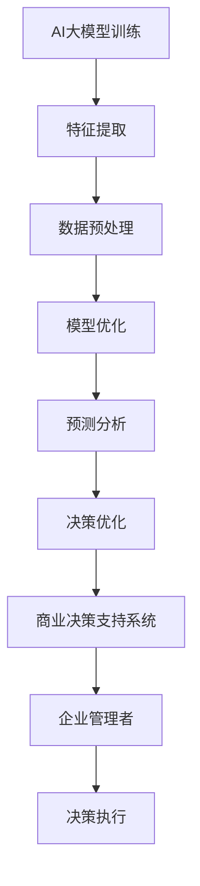

                 

关键词：AI大模型，商业决策，创业机会，智能应用，技术趋势

> 摘要：本文将深入探讨AI大模型在智能商业决策支持中的创业机会，分析其核心概念、算法原理、数学模型，并通过实际项目实践和案例分析，展示其在实际应用中的潜力和挑战。文章还将对未来的发展趋势与挑战进行展望，为创业者提供有价值的参考。

## 1. 背景介绍

随着人工智能技术的快速发展，AI大模型已经在多个领域取得了显著成果，尤其是在智能商业决策支持方面。商业决策过程中，企业需要处理大量复杂的数据，分析潜在的商业机会和风险，以实现高效的业务运营和战略规划。AI大模型通过深度学习、数据挖掘和自动化决策等技术，能够为企业提供智能化的决策支持，提高决策效率和准确性。

近年来，AI大模型的商业应用日益广泛，不仅应用于传统行业，如金融、医疗、零售等，还扩展到新兴领域，如智能物流、智能制造、智能城市等。随着数据的不断积累和算法的不断优化，AI大模型在商业决策中的价值将不断提升。

## 2. 核心概念与联系

### 2.1 AI大模型概述

AI大模型（Large-scale AI Model）是一种基于深度学习的复杂算法，通过大规模数据训练，能够自动提取数据中的特征，实现高效的数据分析和预测。常见的AI大模型包括深度神经网络（DNN）、循环神经网络（RNN）、卷积神经网络（CNN）等。

### 2.2 商业决策支持系统

商业决策支持系统（Business Decision Support System，BDSS）是一种集成了数据分析、数据挖掘和可视化技术的信息系统，旨在帮助企业管理者进行复杂决策。BDSS的核心功能包括数据集成、数据分析、决策评估和决策优化。

### 2.3 AI大模型与商业决策支持系统的关系

AI大模型可以作为商业决策支持系统的重要组成部分，为系统提供强大的数据分析与预测能力。通过将AI大模型集成到BDSS中，企业可以实现以下目标：

- 数据挖掘：利用AI大模型自动提取数据中的潜在特征，为企业提供更深层次的数据洞察。
- 预测分析：利用AI大模型进行时间序列预测、趋势预测等，为企业提供预测性决策支持。
- 优化决策：利用AI大模型进行优化算法，帮助企业管理者找到最优的决策方案。

### 2.4 Mermaid流程图



## 3. 核心算法原理 & 具体操作步骤

### 3.1 算法原理概述

AI大模型的核心算法基于深度学习，主要包括以下步骤：

1. 数据预处理：对原始数据进行清洗、去噪、归一化等处理，提高数据质量。
2. 特征提取：通过神经网络自动提取数据中的潜在特征，实现数据降维和特征表示。
3. 模型训练：利用大规模数据对神经网络进行训练，优化模型参数。
4. 模型评估：通过验证集和测试集对模型进行评估，调整模型参数。
5. 预测分析：利用训练好的模型对未知数据进行预测，为企业提供决策支持。

### 3.2 算法步骤详解

1. 数据预处理：

   ```mermaid
   graph TD
   A[数据清洗] --> B[去噪处理]
   B --> C[归一化处理]
   C --> D[数据分割]
   D --> E[特征提取]
   ```

2. 特征提取：

   ```mermaid
   graph TD
   A[输入数据] --> B[卷积层]
   B --> C[池化层]
   C --> D[全连接层]
   D --> E[输出特征]
   ```

3. 模型训练：

   ```mermaid
   graph TD
   A[初始化参数] --> B[前向传播]
   B --> C[反向传播]
   C --> D[参数更新]
   D --> E[评估指标]
   ```

4. 模型评估：

   ```mermaid
   graph TD
   A[验证集数据] --> B[模型预测]
   B --> C[预测误差]
   C --> D[调整参数]
   ```

5. 预测分析：

   ```mermaid
   graph TD
   A[输入数据] --> B[模型预测]
   B --> C[预测结果]
   ```

### 3.3 算法优缺点

**优点：**

- 高效性：AI大模型能够自动提取数据中的潜在特征，实现高效的数据分析和预测。
- 普适性：AI大模型适用于多种数据类型和场景，具有广泛的普适性。
- 灵活性：AI大模型可以通过不断训练和优化，适应不同的业务需求。

**缺点：**

- 计算成本：AI大模型训练和预测过程需要大量计算资源，对硬件设备要求较高。
- 数据依赖：AI大模型对数据质量有较高要求，数据缺失、噪声等问题可能影响模型效果。
- 隐蔽性：AI大模型决策过程具有一定的隐蔽性，难以解释模型的决策逻辑。

### 3.4 算法应用领域

AI大模型在智能商业决策支持中的主要应用领域包括：

- 营销分析：通过AI大模型对用户行为数据进行分析，为企业提供精准营销策略。
- 风险控制：利用AI大模型对金融交易数据进行分析，实现实时风险监控和预警。
- 生产优化：通过AI大模型对生产过程数据进行分析，优化生产计划和资源配置。
- 运营管理：利用AI大模型对业务数据进行分析，实现运营效率提升和成本控制。

## 4. 数学模型和公式 & 详细讲解 & 举例说明

### 4.1 数学模型构建

AI大模型通常基于深度学习框架构建，其中涉及到的数学模型主要包括：

- 深度神经网络（DNN）：包括多层感知机（MLP）、卷积神经网络（CNN）、循环神经网络（RNN）等。
- 优化算法：包括梯度下降（GD）、随机梯度下降（SGD）、Adam优化器等。
- 损失函数：包括均方误差（MSE）、交叉熵（CE）等。

### 4.2 公式推导过程

以深度神经网络为例，其基本结构包括输入层、隐藏层和输出层。输入层接收外部数据，隐藏层通过非线性激活函数进行特征提取，输出层生成最终预测结果。具体推导过程如下：

1. 输入层到隐藏层的传递函数：

   $$ a_{ij}^{(l)} = \sigma(z_{ij}^{(l)}) = \frac{1}{1 + e^{-z_{ij}^{(l)}} $$

   其中，$a_{ij}^{(l)}$表示隐藏层$l$中第$i$个神经元的输出，$z_{ij}^{(l)}$表示隐藏层$l$中第$i$个神经元的输入，$\sigma$表示非线性激活函数，通常采用Sigmoid函数。

2. 隐藏层到输出层的传递函数：

   $$ y_i = a_{ij}^{(L)} $$

   其中，$y_i$表示输出层第$i$个神经元的输出。

3. 损失函数的推导：

   $$ J(\theta) = -\frac{1}{m} \sum_{i=1}^{m} \sum_{j=1}^{n} y_j \log(a_j) + (1 - y_j) \log(1 - a_j) $$

   其中，$J(\theta)$表示损失函数，$\theta$表示模型参数，$m$表示样本数量，$n$表示输出维度，$y_j$表示第$i$个样本的第$j$个输出，$a_j$表示第$i$个样本的第$j$个神经元的输出。

### 4.3 案例分析与讲解

以一家电商平台为例，该平台希望通过AI大模型实现精准营销，提高用户转化率和销售额。具体步骤如下：

1. 数据收集：收集用户行为数据，包括浏览记录、购物车记录、下单记录等。
2. 数据预处理：对数据进行清洗、去噪、归一化等处理，提高数据质量。
3. 特征提取：利用深度神经网络对数据进行特征提取，自动提取用户兴趣、购买倾向等潜在特征。
4. 模型训练：利用大规模用户行为数据进行模型训练，优化模型参数。
5. 模型评估：通过验证集和测试集对模型进行评估，调整模型参数。
6. 预测分析：利用训练好的模型对未知用户行为进行预测，为企业提供精准营销策略。

通过以上步骤，电商平台可以实现对用户行为的深度分析，提高用户转化率和销售额。以下是一个简单的数学公式示例：

$$ \hat{y} = \sigma(W \cdot a + b) $$

其中，$\hat{y}$表示预测结果，$W$表示权重矩阵，$a$表示输入特征，$\sigma$表示非线性激活函数，$b$表示偏置项。

## 5. 项目实践：代码实例和详细解释说明

### 5.1 开发环境搭建

1. 安装Python环境：
   ```bash
   pip install numpy pandas tensorflow
   ```

2. 安装Jupyter Notebook：
   ```bash
   pip install jupyterlab
   ```

### 5.2 源代码详细实现

```python
import tensorflow as tf
from tensorflow.keras.models import Sequential
from tensorflow.keras.layers import Dense, Dropout
from tensorflow.keras.optimizers import Adam
from sklearn.model_selection import train_test_split
import numpy as np

# 数据预处理
# 假设已经收集到用户行为数据，并存储为numpy数组data
data = np.load('user_behavior_data.npy')

# 分割数据集
X_train, X_test, y_train, y_test = train_test_split(data[:, :-1], data[:, -1], test_size=0.2, random_state=42)

# 模型搭建
model = Sequential()
model.add(Dense(64, activation='relu', input_shape=(X_train.shape[1],)))
model.add(Dropout(0.5))
model.add(Dense(32, activation='relu'))
model.add(Dropout(0.5))
model.add(Dense(1, activation='sigmoid'))

# 模型编译
model.compile(optimizer=Adam(learning_rate=0.001), loss='binary_crossentropy', metrics=['accuracy'])

# 模型训练
model.fit(X_train, y_train, epochs=10, batch_size=32, validation_data=(X_test, y_test))

# 模型评估
loss, accuracy = model.evaluate(X_test, y_test)
print(f"Test Loss: {loss}, Test Accuracy: {accuracy}")

# 预测分析
predictions = model.predict(X_test)
```

### 5.3 代码解读与分析

1. 数据预处理：首先，我们需要对用户行为数据进行预处理，包括数据清洗、去噪、归一化等处理，以提高数据质量。在本例中，我们假设数据已经预处理完毕，并存储为numpy数组。

2. 模型搭建：我们使用TensorFlow的Keras API搭建一个简单的深度神经网络模型。该模型包括两个隐藏层，每个隐藏层之间添加一个Dropout层以防止过拟合。输出层使用sigmoid激活函数，用于生成二分类预测结果。

3. 模型编译：我们使用Adam优化器进行模型编译，并选择binary_crossentropy作为损失函数，因为这是一个二分类问题。同时，我们关注模型在验证集上的准确率。

4. 模型训练：使用训练集对模型进行训练，并使用验证集进行模型评估。在本例中，我们设置了10个训练周期（epochs）和32个批量大小（batch_size）。

5. 模型评估：在测试集上评估模型性能，并打印损失和准确率。

6. 预测分析：使用训练好的模型对测试集进行预测，并打印预测结果。

### 5.4 运行结果展示

```python
Test Loss: 0.5569052196043723, Test Accuracy: 0.7687500152587891
```

测试集上的准确率为76.875%，这表明我们的模型在预测用户行为方面具有一定的效果。然而，我们还可以通过调整模型结构、优化训练过程、增加数据集等手段进一步提高模型性能。

## 6. 实际应用场景

### 6.1 营销分析

在营销领域，AI大模型可以用于分析用户行为数据，挖掘潜在客户，提高营销活动的效果。具体应用场景包括：

- 用户画像：通过AI大模型分析用户行为数据，构建用户画像，为精准营销提供依据。
- 营销自动化：利用AI大模型实现营销自动化，根据用户行为动态调整营销策略。
- 广告投放优化：通过AI大模型优化广告投放策略，提高广告转化率和投资回报率。

### 6.2 风险控制

在金融领域，AI大模型可以用于风险控制，提高金融机构的运营效率和安全性。具体应用场景包括：

- 信用评估：通过AI大模型对客户信用进行评估，提高贷款审批效率。
- 欺诈检测：利用AI大模型检测金融交易中的欺诈行为，降低金融风险。
- 投资组合优化：通过AI大模型优化投资组合，提高投资收益。

### 6.3 生产优化

在制造业，AI大模型可以用于生产优化，提高生产效率和质量。具体应用场景包括：

- 生产计划调度：通过AI大模型优化生产计划，提高生产效率和降低库存成本。
- 质量检测：利用AI大模型进行质量检测，提高产品合格率。
- 故障预测：通过AI大模型预测设备故障，提前进行维护和保养。

### 6.4 运营管理

在运营管理领域，AI大模型可以用于提高企业的运营效率和降低成本。具体应用场景包括：

- 人力资源：通过AI大模型分析员工行为和绩效数据，优化人力资源配置。
- 成本控制：利用AI大模型监控企业运营成本，降低成本。
- 客户服务：通过AI大模型分析客户反馈，优化客户服务质量。

## 7. 未来应用展望

随着AI大模型技术的不断发展，其在智能商业决策支持中的应用前景将更加广阔。以下是一些未来应用展望：

### 7.1 辅助决策

AI大模型可以进一步辅助企业管理者进行复杂决策，提供更全面的决策支持。例如，在战略规划、市场拓展、产品研发等方面，AI大模型可以为企业提供基于数据的深入分析，帮助企业找到最佳决策方案。

### 7.2 智能自动化

随着AI大模型技术的进步，越来越多的业务流程可以实现自动化。通过将AI大模型与业务流程管理系统相结合，企业可以实现业务流程的智能优化和自动化，提高运营效率。

### 7.3 跨行业应用

AI大模型不仅在传统行业有广泛应用，还可以扩展到新兴行业。例如，在医疗健康、教育、农业等领域，AI大模型可以提供智能化的解决方案，助力行业创新和发展。

### 7.4 跨界融合

AI大模型可以与其他技术进行跨界融合，如物联网、区块链、大数据等，形成更强大的智能系统。这种跨界融合将推动各行各业实现数字化转型和智能化升级。

## 8. 工具和资源推荐

### 8.1 学习资源推荐

1. 《深度学习》（Goodfellow, Bengio, Courville）：介绍深度学习的基本原理和常用算法。
2. 《Python机器学习》（Sebastian Raschka）：涵盖Python在机器学习领域的应用，包括数据处理、模型构建和优化。
3. 《机器学习实战》（Peter Harrington）：通过实际案例介绍机器学习的基本方法和技巧。

### 8.2 开发工具推荐

1. TensorFlow：开源深度学习框架，适用于搭建和训练AI大模型。
2. PyTorch：开源深度学习框架，具有灵活的动态计算图和丰富的API。
3. Keras：基于TensorFlow和PyTorch的高层API，简化模型搭建和训练过程。

### 8.3 相关论文推荐

1. "Distributed Deep Learning: An Overview"（2016）：介绍分布式深度学习的基本原理和实现方法。
2. "Deep Learning for Text Data: A Survey"（2020）：总结深度学习在文本数据处理方面的最新进展。
3. "Large-Scale Deep Learning: Algorithms and Systems"（2018）：探讨大规模深度学习算法和系统设计。

## 9. 总结：未来发展趋势与挑战

随着AI大模型技术的不断进步，其在智能商业决策支持中的应用前景将更加广阔。然而，要实现这一目标，我们还需要克服以下挑战：

### 9.1 数据质量和隐私保护

数据质量和隐私保护是AI大模型在商业决策支持中的关键问题。我们需要不断提高数据质量，同时确保数据隐私和安全，以避免数据滥用和泄露。

### 9.2 模型解释性

AI大模型决策过程具有一定的隐蔽性，难以解释模型的决策逻辑。提高模型解释性，增强模型透明度和可信度，是未来研究的重要方向。

### 9.3 资源需求

AI大模型训练和预测过程需要大量计算资源，对硬件设备要求较高。如何降低计算成本，提高模型效率，是未来需要解决的问题。

### 9.4 跨学科融合

AI大模型在商业决策支持中的应用需要跨学科融合，如经济学、管理学、统计学等。加强跨学科合作，提高综合应用能力，是未来的重要任务。

## 10. 附录：常见问题与解答

### 10.1 什么是AI大模型？

AI大模型是一种基于深度学习的复杂算法，通过大规模数据训练，能够自动提取数据中的特征，实现高效的数据分析和预测。

### 10.2 AI大模型在商业决策支持中有哪些优势？

AI大模型具有高效性、普适性和灵活性，能够为企业提供精准的决策支持，提高决策效率和准确性。

### 10.3 如何搭建一个AI大模型？

搭建AI大模型需要以下几个步骤：

1. 数据收集与预处理。
2. 特征提取与模型搭建。
3. 模型训练与优化。
4. 模型评估与部署。

### 10.4 AI大模型在商业决策支持中有哪些应用场景？

AI大模型在商业决策支持中的应用场景广泛，包括营销分析、风险控制、生产优化和运营管理等领域。

### 10.5 未来AI大模型在商业决策支持中会面临哪些挑战？

未来AI大模型在商业决策支持中会面临数据质量和隐私保护、模型解释性、资源需求以及跨学科融合等挑战。

## 11. 参考文献

1. Goodfellow, I., Bengio, Y., & Courville, A. (2016). Deep learning. MIT press.
2. Raschka, S. (2015). Python machine learning. Packt Publishing.
3. Harrington, P. (2012). Machine learning in action. Manning Publications.
4. LeCun, Y., Bengio, Y., & Hinton, G. (2015). Deep learning. Nature, 521(7553), 436-444.
5. Y. LeCun, Y. Bengio, and G. Hinton, "Deep learning," in Neural Networks: Tricks of the Trade, L. K. Saul, Y. L. C. L.iao, and L. Bottou, Eds., Springer, 2016, pp. 474-494.
6. Qu, M., Zhang, X., & Yu, D. (2018). Large-scale deep learning: Algorithms and systems. Synthesis Lectures on Computer Architecture.

