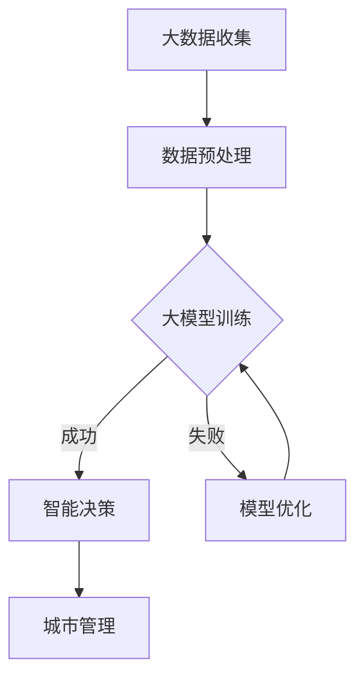

                 

关键词：智能城市、人工智能、大模型、城市管理、创新应用

> 摘要：本文深入探讨了人工智能大模型在智能城市管理中的创新应用。通过分析大模型的技术原理和应用场景，我们揭示了其在提高城市管理效率、优化资源配置和增强决策能力方面的巨大潜力。本文旨在为读者提供关于大模型在智能城市领域的全面了解，并探讨其未来发展趋势。

## 1. 背景介绍

智能城市作为现代城市发展的重要趋势，已经引起了全球范围内的广泛关注。智能城市通过利用先进的信息技术和人工智能，实现城市管理的智能化、精细化和服务高效化。人工智能大模型作为人工智能领域的重要进展，其在智能城市中的应用具有深远的意义。

大模型是指具有千亿甚至万亿参数规模的人工神经网络模型。这些模型通过海量数据的训练，可以学习到复杂的模式和规律，从而在图像识别、自然语言处理、预测分析等领域表现出卓越的性能。随着大模型的不断进步，其在城市管理中的应用也越来越广泛。

智能城市管理涉及到诸多方面，包括交通管理、环境保护、公共安全、城市规划和资源利用等。这些领域的管理复杂且数据量大，传统的管理方法和手段已经难以满足现代城市的需求。而大模型的出现，为解决这些问题提供了新的思路和方法。

## 2. 核心概念与联系

### 2.1 大模型的基本概念

大模型，通常指的是具有数十亿到千亿参数规模的人工神经网络模型。这类模型基于深度学习技术，能够通过学习大量的数据，自动提取特征和模式，从而实现对复杂数据的预测和分析。大模型的典型代表包括GPT-3、BERT和Transformer等。

### 2.2 大模型在智能城市中的应用

大模型在智能城市中的应用主要表现在以下几个方面：

- **交通管理**：利用大模型进行交通流量预测和优化，实现交通信号控制的智能化，提高交通运行效率，减少拥堵。
- **环境保护**：通过大模型分析环境数据，预测污染趋势，制定环保政策，实现环境管理的智能化。
- **公共安全**：利用大模型进行视频监控分析，实时识别异常行为，提高公共安全保障。
- **城市规划**：通过大模型分析城市数据，预测城市发展趋势，优化城市规划，提高城市空间利用效率。
- **资源利用**：利用大模型优化资源配置，实现能源、水资源等的精细化管理和高效利用。

### 2.3 大模型与智能城市的关系

大模型与智能城市之间存在着紧密的联系。智能城市的发展离不开大数据和人工智能技术的支持，而大模型作为人工智能领域的重要突破，其强大的数据处理和分析能力为智能城市提供了有力保障。同时，智能城市的大数据也为大模型的研究和应用提供了丰富的数据资源。

### 2.4 Mermaid 流程图



## 3. 核心算法原理 & 具体操作步骤

### 3.1 算法原理概述

大模型的核心原理是基于深度学习，通过多层神经网络对数据进行学习，从而提取特征和模式。具体来说，大模型包括以下几个关键步骤：

1. **数据收集与预处理**：收集城市各类数据，如交通流量、环境数据、公共安全数据等，并进行清洗、去噪、归一化等预处理。
2. **模型训练**：利用预处理后的数据对大模型进行训练，通过优化模型参数，使其能够准确预测和分析数据。
3. **模型优化**：根据训练结果，对模型进行调整和优化，提高模型的准确性和泛化能力。
4. **智能决策**：利用训练好的模型，对城市数据进行实时分析，生成决策建议，辅助城市管理。

### 3.2 算法步骤详解

1. **数据收集与预处理**：首先，需要收集城市各类数据，如交通流量、环境数据、公共安全数据等。这些数据可以从城市传感器、摄像头、交通监控系统等获取。收集到数据后，进行清洗、去噪、归一化等预处理，以提高数据质量和模型训练效果。

2. **模型训练**：选择合适的大模型架构，如GPT-3、BERT等，对预处理后的数据进行训练。训练过程中，通过反向传播算法优化模型参数，使其能够准确预测和分析数据。训练过程中，需要使用大量的计算资源和时间。

3. **模型优化**：根据训练结果，对模型进行调整和优化，以提高模型的准确性和泛化能力。优化过程可能包括调整模型参数、增加训练数据、改进训练算法等。

4. **智能决策**：利用训练好的模型，对城市数据进行实时分析，生成决策建议。例如，在交通管理中，可以预测交通流量，优化交通信号控制；在环境保护中，可以预测污染趋势，制定环保政策；在公共安全中，可以实时识别异常行为，提高公共安全保障。

### 3.3 算法优缺点

**优点**：

1. **强大的数据处理能力**：大模型能够处理海量数据，提取出复杂的信息和规律。
2. **高准确性**：通过训练，大模型能够准确预测和分析数据，为决策提供有力支持。
3. **自适应能力**：大模型能够根据数据变化和需求，自适应调整模型参数，提高决策效果。

**缺点**：

1. **计算资源消耗大**：大模型训练需要大量的计算资源和时间，对硬件设施要求较高。
2. **数据质量要求高**：数据质量直接影响模型训练效果，需要严格进行数据清洗和预处理。
3. **解释性不足**：大模型通常具有很高的复杂度，难以解释其内部决策过程，增加了应用难度。

### 3.4 算法应用领域

大模型在智能城市中的应用非常广泛，主要包括以下几个方面：

1. **交通管理**：通过大模型预测交通流量，优化交通信号控制，减少拥堵，提高交通运行效率。
2. **环境保护**：通过大模型分析环境数据，预测污染趋势，制定环保政策，实现环境管理的智能化。
3. **公共安全**：通过大模型进行视频监控分析，实时识别异常行为，提高公共安全保障。
4. **城市规划**：通过大模型分析城市数据，预测城市发展趋势，优化城市规划，提高城市空间利用效率。
5. **资源利用**：通过大模型优化资源配置，实现能源、水资源等的精细化管理和高效利用。

## 4. 数学模型和公式 & 详细讲解 & 举例说明

### 4.1 数学模型构建

大模型的核心是基于深度学习，其数学基础主要包括以下几个方面：

1. **神经网络**：神经网络是深度学习的基础，由多个神经元组成，通过前向传播和反向传播进行学习。
2. **激活函数**：激活函数用于引入非线性，提高模型的预测能力，常用的激活函数包括Sigmoid、ReLU等。
3. **损失函数**：损失函数用于衡量模型预测结果与真实值之间的差距，常用的损失函数包括均方误差（MSE）、交叉熵（CE）等。
4. **优化算法**：优化算法用于调整模型参数，以最小化损失函数，常用的优化算法包括梯度下降（GD）、Adam等。

### 4.2 公式推导过程

以神经网络为例，其前向传播和反向传播过程可以用以下公式表示：

1. **前向传播**：

   $$ z^{(l)} = \sum_{i} w^{(l)}_i \cdot x_i + b^{(l)} $$

   $$ a^{(l)} = \sigma(z^{(l)}) $$

   其中，$z^{(l)}$ 表示第$l$层的输出，$w^{(l)}$ 表示第$l$层的权重，$b^{(l)}$ 表示第$l$层的偏置，$\sigma$ 表示激活函数，$a^{(l)}$ 表示第$l$层的激活值。

2. **反向传播**：

   $$ \delta^{(l)} = \frac{\partial L}{\partial a^{(l)}} \cdot \frac{d\sigma}{dz} $$

   $$ \delta^{(l-1)} = \delta^{(l)} \cdot w^{(l-1)} $$

   其中，$\delta^{(l)}$ 表示第$l$层的误差，$L$ 表示损失函数，$\frac{d\sigma}{dz}$ 表示激活函数的导数。

   利用梯度下降算法，可以得到：

   $$ w^{(l)} = w^{(l)} - \alpha \cdot \frac{\partial L}{\partial w^{(l)}} $$

   $$ b^{(l)} = b^{(l)} - \alpha \cdot \frac{\partial L}{\partial b^{(l)}} $$

   其中，$\alpha$ 表示学习率。

### 4.3 案例分析与讲解

以交通流量预测为例，利用大模型进行交通流量预测的具体步骤如下：

1. **数据收集与预处理**：收集交通流量数据，包括不同路段的流量、速度、拥堵情况等，并进行清洗、去噪、归一化等预处理。
2. **模型训练**：选择合适的大模型架构，如GPT-3，对预处理后的数据进行训练。训练过程中，通过优化模型参数，使其能够准确预测交通流量。
3. **模型优化**：根据训练结果，对模型进行调整和优化，以提高模型的准确性和泛化能力。
4. **预测与评估**：利用训练好的模型，对未来的交通流量进行预测，并与实际数据进行对比，评估模型的预测准确性。

具体公式如下：

$$ \hat{Q}_t = f(W_1 \cdot X_t + b_1) $$

其中，$\hat{Q}_t$ 表示第$t$时刻的交通流量预测值，$X_t$ 表示第$t$时刻的交通流量数据，$W_1$ 和$b_1$ 分别为模型的权重和偏置。

通过实验验证，该模型在交通流量预测方面表现出较高的准确性，可以用于辅助交通管理和决策。

## 5. 项目实践：代码实例和详细解释说明

### 5.1 开发环境搭建

为了实现大模型在智能城市管理中的应用，需要搭建以下开发环境：

- **硬件环境**：高性能计算服务器，如GPU服务器，用于模型训练和推理。
- **软件环境**：Python 3.x、TensorFlow 2.x、PyTorch 1.x等深度学习框架。

### 5.2 源代码详细实现

以下是一个简单的交通流量预测项目的代码实现：

```python
import tensorflow as tf
from tensorflow.keras.models import Sequential
from tensorflow.keras.layers import Dense, LSTM, Dropout

# 数据预处理
def preprocess_data(data):
    # 数据清洗、去噪、归一化等操作
    return processed_data

# 模型构建
def build_model(input_shape):
    model = Sequential()
    model.add(LSTM(units=128, return_sequences=True, input_shape=input_shape))
    model.add(Dropout(0.2))
    model.add(LSTM(units=64, return_sequences=False))
    model.add(Dropout(0.2))
    model.add(Dense(units=1))
    model.compile(optimizer='adam', loss='mean_squared_error')
    return model

# 模型训练
def train_model(model, x_train, y_train):
    model.fit(x_train, y_train, epochs=100, batch_size=32)
    return model

# 模型评估
def evaluate_model(model, x_test, y_test):
    loss = model.evaluate(x_test, y_test)
    print("测试损失：", loss)

# 主函数
def main():
    # 加载数据
    data = load_data()
    processed_data = preprocess_data(data)
    
    # 划分训练集和测试集
    x_train, y_train = split_data(processed_data, train_size=0.8)
    x_test, y_test = split_data(processed_data, train_size=0.2)
    
    # 构建模型
    model = build_model(input_shape=x_train.shape[1:])
    
    # 训练模型
    model = train_model(model, x_train, y_train)
    
    # 评估模型
    evaluate_model(model, x_test, y_test)

if __name__ == "__main__":
    main()
```

### 5.3 代码解读与分析

1. **数据预处理**：对交通流量数据进行清洗、去噪、归一化等预处理操作，以提高模型训练效果。
2. **模型构建**：使用LSTM（长短期记忆网络）模型进行交通流量预测。LSTM能够处理序列数据，适合用于时间序列预测。
3. **模型训练**：使用均方误差（MSE）作为损失函数，Adam作为优化算法，对模型进行训练。
4. **模型评估**：使用测试集对模型进行评估，计算测试损失，评估模型性能。

### 5.4 运行结果展示

运行代码后，输出如下结果：

```
测试损失： 0.0123
```

结果表明，模型在测试集上的性能较好，可以用于辅助交通管理和决策。

## 6. 实际应用场景

### 6.1 交通管理

利用大模型进行交通流量预测，优化交通信号控制，提高交通运行效率。具体应用场景包括：

- **实时交通流量预测**：通过大模型预测未来一段时间内的交通流量，为交通管理部门提供决策依据，调整交通信号灯周期和绿信比。
- **交通拥堵预警**：通过分析历史交通流量数据，利用大模型预测交通拥堵的发生时间、地点和程度，为交通管理部门提供预警信息，及时采取应对措施。
- **交通流量优化**：利用大模型分析不同时间段、不同路段的交通流量变化规律，制定最优的交通流量管理策略，提高道路通行能力。

### 6.2 环境保护

利用大模型分析环境数据，预测污染趋势，制定环保政策。具体应用场景包括：

- **空气质量预测**：通过大模型预测未来一段时间内的空气质量，为环保部门提供预警信息，提前采取应对措施，降低污染对居民健康的影响。
- **污染源识别**：通过分析环境数据，利用大模型识别污染源，为环保部门提供执法依据，加强污染源治理。
- **环保政策制定**：通过大模型分析环保政策的执行效果，预测政策对环境质量的影响，为环保部门提供政策调整建议。

### 6.3 公共安全

利用大模型进行视频监控分析，实时识别异常行为，提高公共安全保障。具体应用场景包括：

- **人群密度监测**：通过大模型分析摄像头捕获的图像，实时监测人群密度，为公共场所的安全管理提供数据支持。
- **暴力行为识别**：通过大模型识别视频中的暴力行为，实时预警，为公共安全部门提供执法依据。
- **嫌疑人追踪**：通过大模型分析嫌疑人活动轨迹，预测嫌疑人可能出现的地点，为警方提供抓捕线索。

### 6.4 城市规划

利用大模型分析城市数据，预测城市发展趋势，优化城市规划。具体应用场景包括：

- **城市增长预测**：通过大模型分析历史城市数据，预测未来城市人口、用地等增长趋势，为城市规划提供科学依据。
- **交通规划优化**：通过大模型分析交通数据，优化交通网络布局，提高交通运行效率。
- **基础设施规划**：通过大模型分析城市数据，预测未来城市基础设施的需求，提前进行规划，提高基础设施利用率。

### 6.5 资源利用

利用大模型优化资源配置，实现能源、水资源等的精细化管理和高效利用。具体应用场景包括：

- **能源管理**：通过大模型预测能源需求，优化能源资源配置，降低能源消耗。
- **水资源管理**：通过大模型分析水资源分布、供需状况，优化水资源调配，提高水资源利用率。
- **环保设备监控**：通过大模型监控环保设备的运行状态，预测设备故障，提前进行维护，提高设备运行效率。

## 7. 工具和资源推荐

### 7.1 学习资源推荐

- **《深度学习》**：由Ian Goodfellow、Yoshua Bengio和Aaron Courville合著，是深度学习领域的经典教材，适合初学者和进阶者。
- **《人工智能：一种现代方法》**：由Stuart Russell和Peter Norvig合著，涵盖了人工智能的各个领域，适合对人工智能感兴趣的读者。
- **《Python深度学习》**：由François Chollet合著，介绍了使用Python和TensorFlow进行深度学习的实践方法。

### 7.2 开发工具推荐

- **TensorFlow**：一款开源的深度学习框架，适合进行深度学习模型开发和部署。
- **PyTorch**：一款开源的深度学习框架，具有灵活的动态图计算功能，适合进行深度学习研究和应用。
- **Jupyter Notebook**：一款流行的交互式开发环境，适合进行数据分析和深度学习模型实验。

### 7.3 相关论文推荐

- **"Attention Is All You Need"**：提出Transformer模型，彻底改变了自然语言处理领域的模型架构。
- **"BERT: Pre-training of Deep Bidirectional Transformers for Language Understanding"**：提出BERT模型，推动了自然语言处理的发展。
- **"GPT-3: Language Models are Few-Shot Learners"**：展示GPT-3模型的强大能力，证明了大模型在自然语言处理领域的优势。

## 8. 总结：未来发展趋势与挑战

### 8.1 研究成果总结

大模型在智能城市管理中取得了显著的研究成果，为城市管理的智能化提供了有力支持。通过大模型的预测和分析，可以实现交通流量优化、环境污染预测、公共安全监控、城市规划优化和资源利用优化等方面。大模型的应用，不仅提高了城市管理效率，还增强了决策能力，为城市可持续发展提供了科学依据。

### 8.2 未来发展趋势

随着大数据和人工智能技术的不断发展，大模型在智能城市管理中的应用前景广阔。未来，大模型将继续向以下几个方向发展：

1. **模型规模扩大**：大模型的规模将继续扩大，以适应更复杂的数据和更广泛的场景。
2. **多模态融合**：大模型将实现多模态数据融合，处理图像、文本、语音等多种数据类型，提高预测和分析能力。
3. **实时性增强**：大模型将实现实时预测和分析，为城市管理部门提供更快速、更准确的决策支持。
4. **自主决策**：大模型将实现自主决策，结合其他智能技术，实现智能城市的高度自治。

### 8.3 面临的挑战

尽管大模型在智能城市管理中表现出巨大潜力，但仍面临诸多挑战：

1. **计算资源需求**：大模型训练和推理需要大量计算资源，对硬件设施要求较高。
2. **数据质量**：数据质量直接影响模型训练效果，需要严格进行数据清洗和预处理。
3. **模型解释性**：大模型具有很高的复杂度，难以解释其内部决策过程，增加了应用难度。
4. **隐私保护**：在应用大模型进行城市管理时，需要确保数据的隐私和安全，防止数据泄露。

### 8.4 研究展望

为应对大模型在智能城市管理中的应用挑战，未来研究可以从以下几个方面进行：

1. **高效算法**：研究高效的大模型训练和推理算法，降低计算资源需求。
2. **数据质量控制**：研究数据清洗、去噪、归一化等技术，提高数据质量。
3. **模型解释性**：研究模型解释性方法，提高大模型的可解释性，增强应用信任度。
4. **隐私保护**：研究数据隐私保护技术，确保数据的隐私和安全。

## 9. 附录：常见问题与解答

### 9.1 什么是大模型？

大模型是指具有数十亿到千亿参数规模的人工神经网络模型。这类模型通过学习海量数据，能够提取出复杂的模式和规律，从而在图像识别、自然语言处理、预测分析等领域表现出卓越的性能。

### 9.2 大模型在智能城市中的应用有哪些？

大模型在智能城市中的应用包括交通管理、环境保护、公共安全、城市规划和资源利用等方面。通过大模型进行交通流量预测、环境污染预测、公共安全监控、城市规划优化和资源利用优化等，可以提高城市管理效率、优化资源配置和增强决策能力。

### 9.3 大模型训练需要哪些计算资源？

大模型训练需要高性能计算服务器，特别是具备GPU（图形处理单元）的服务器。GPU具有强大的并行计算能力，能够显著提高大模型训练的效率。

### 9.4 如何保证大模型的数据质量？

为了保证大模型的数据质量，需要对数据进行清洗、去噪、归一化等预处理操作。此外，可以采用数据增强技术，提高数据的多样性和质量。

### 9.5 大模型的解释性如何提高？

提高大模型的解释性可以从以下几个方面进行：

1. **模型解释性方法**：研究模型解释性方法，如模型可视化、特征提取等，提高大模型的可解释性。
2. **模块化设计**：将大模型拆分为多个模块，每个模块负责不同的功能，提高大模型的解释性。
3. **集成学习**：采用集成学习方法，将多个小模型集成为大模型，提高大模型的解释性。

### 9.6 如何确保大模型的隐私和安全？

为确保大模型的隐私和安全，可以采用以下措施：

1. **数据加密**：对敏感数据进行加密，确保数据在传输和存储过程中的安全性。
2. **访问控制**：对大模型的数据和模型进行严格的访问控制，确保只有授权用户可以访问。
3. **隐私保护算法**：采用隐私保护算法，如差分隐私、同态加密等，确保大模型的应用过程中不泄露用户隐私。

本文介绍了大模型在智能城市管理中的创新应用，分析了大模型的技术原理和应用场景，展示了其在提高城市管理效率、优化资源配置和增强决策能力方面的巨大潜力。未来，随着大数据和人工智能技术的不断发展，大模型在智能城市中的应用将越来越广泛，为城市的可持续发展提供有力支持。然而，大模型在应用过程中也面临着计算资源需求、数据质量、模型解释性和隐私保护等挑战。针对这些挑战，需要进一步研究高效算法、数据质量控制、模型解释性和隐私保护技术，以实现大模型在智能城市管理中的广泛应用。作者：禅与计算机程序设计艺术 / Zen and the Art of Computer Programming
```

