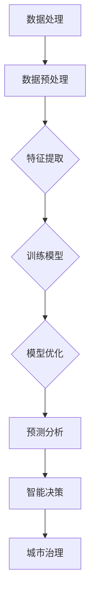

                 

关键词：智能城市，大模型，人工智能，城市管理，创新应用，机器学习，深度学习，预测分析，数据处理

> 摘要：本文将探讨AI大模型在智能城市管理中的创新应用。通过分析大模型的原理和架构，介绍其在城市管理领域的核心算法和数学模型，并结合实际项目实践，展示其在预测分析、数据处理和智能决策等方面的应用效果。本文旨在为读者提供一个全面、深入的视角，了解AI大模型在智能城市管理中的潜力和挑战。

## 1. 背景介绍

随着全球城市化进程的不断推进，城市规模日益扩大，城市管理和运营的复杂性逐渐增加。传统的城市管理方法已经无法满足现代城市发展的需求，迫切需要引入先进的技术手段，实现城市管理的智能化、高效化和精细化。人工智能技术，尤其是大模型，成为解决这一问题的有效途径。

大模型是指具有海量参数和高度复杂结构的机器学习模型，如深度神经网络、图神经网络等。通过训练大规模的数据集，大模型能够捕捉数据中的复杂模式和规律，从而实现高效的数据处理、预测分析和智能决策。在智能城市管理中，大模型的应用可以帮助城市管理者更好地理解城市运行状态，预测城市发展趋势，优化城市资源配置，提升城市治理水平。

本文将从以下几个方面展开讨论：

- 大模型的原理和架构
- 大模型在智能城市管理中的核心算法和数学模型
- 大模型在智能城市项目实践中的应用
- 大模型在智能城市管理中的实际应用场景和未来展望

## 2. 核心概念与联系

### 2.1 大模型的原理

大模型的核心原理是基于深度学习技术。深度学习是一种基于人工神经网络的机器学习算法，通过多层神经网络结构，实现对数据的抽象和特征提取。大模型通过增加网络的层数和神经元数量，使得模型具有更强的表示能力和泛化能力。

### 2.2 大模型的架构

大模型的架构通常包括输入层、隐藏层和输出层。输入层接收原始数据，隐藏层通过非线性变换提取数据特征，输出层根据训练目标产生预测结果。在训练过程中，大模型通过反向传播算法不断调整网络参数，优化模型的性能。

### 2.3 大模型与智能城市管理的联系

大模型在智能城市管理中的应用主要体现在以下几个方面：

- 数据处理：大模型能够高效地处理海量城市数据，包括交通、环境、经济等各个方面。
- 预测分析：大模型可以根据历史数据预测城市发展趋势，为城市决策提供科学依据。
- 智能决策：大模型可以根据实时数据，动态调整城市资源配置，实现智能化的城市治理。

### 2.4 Mermaid流程图

下面是一个描述大模型在智能城市管理中应用的Mermaid流程图：



## 3. 核心算法原理 & 具体操作步骤

### 3.1 算法原理概述

大模型在智能城市管理中的核心算法主要包括深度学习算法、图神经网络算法和强化学习算法。这些算法通过不同的方式，实现对城市数据的处理、分析和决策。

- **深度学习算法**：通过多层神经网络结构，对城市数据进行特征提取和模式识别，适用于图像识别、语音识别等场景。
- **图神经网络算法**：通过图结构表示城市数据，实现对复杂关系的建模和推理，适用于交通流量预测、社会网络分析等场景。
- **强化学习算法**：通过与环境的交互，学习最优策略，适用于自动驾驶、无人机配送等场景。

### 3.2 算法步骤详解

下面以深度学习算法为例，详细介绍其操作步骤：

1. **数据收集**：收集城市各领域的数据，包括交通流量、环境质量、经济指标等。
2. **数据预处理**：对数据进行清洗、归一化等处理，使其适合模型训练。
3. **特征提取**：通过多层神经网络结构，对数据进行特征提取，提高模型的表示能力。
4. **模型训练**：使用训练数据，通过反向传播算法，不断调整网络参数，优化模型性能。
5. **模型评估**：使用验证数据，评估模型在预测分析、智能决策等方面的性能。
6. **模型部署**：将训练好的模型部署到实际应用场景中，进行实时数据分析和决策。

### 3.3 算法优缺点

- **优点**：
  - 高效：大模型能够高效地处理海量数据，提高数据处理和分析的效率。
  - 准确：通过深度学习、图神经网络等算法，模型具有更高的预测准确性和决策能力。
  - 自适应：大模型能够根据实时数据，动态调整模型参数，实现自适应的智能决策。

- **缺点**：
  - 计算资源需求大：大模型训练和推理需要大量计算资源，对硬件设备要求较高。
  - 数据依赖性强：大模型的效果很大程度上取决于数据质量，数据缺失或不准确会影响模型性能。

### 3.4 算法应用领域

大模型在智能城市管理中的应用领域广泛，包括但不限于：

- **交通管理**：通过预测交通流量，优化交通信号控制，减少交通拥堵。
- **环境监测**：通过分析空气质量、水质等数据，实时监测城市环境，提高环境保护水平。
- **经济预测**：通过分析经济指标，预测经济增长趋势，为城市发展规划提供依据。
- **公共安全**：通过分析社会网络数据，预测犯罪风险，加强公共安全管理。

## 4. 数学模型和公式 & 详细讲解 & 举例说明

### 4.1 数学模型构建

在智能城市管理中，常用的数学模型包括线性回归模型、逻辑回归模型和支持向量机（SVM）等。下面以线性回归模型为例，介绍其构建方法。

- **线性回归模型**：

  线性回归模型用于预测一个连续变量的值，其数学模型为：

  $$ y = \beta_0 + \beta_1 x + \epsilon $$

  其中，$y$ 是预测值，$x$ 是输入特征，$\beta_0$ 和 $\beta_1$ 是模型参数，$\epsilon$ 是误差项。

  线性回归模型的目的是通过最小化误差平方和，求解模型参数 $\beta_0$ 和 $\beta_1$：

  $$ \min_{\beta_0, \beta_1} \sum_{i=1}^{n} (y_i - (\beta_0 + \beta_1 x_i))^2 $$

### 4.2 公式推导过程

- **线性回归模型的推导过程**：

  1. **误差平方和**：

     $$ S = \sum_{i=1}^{n} (y_i - (\beta_0 + \beta_1 x_i))^2 $$

  2. **对 $\beta_0$ 和 $\beta_1$ 分别求偏导数**：

     $$ \frac{\partial S}{\partial \beta_0} = -2 \sum_{i=1}^{n} (y_i - (\beta_0 + \beta_1 x_i)) = 0 $$

     $$ \frac{\partial S}{\partial \beta_1} = -2 \sum_{i=1}^{n} (x_i (y_i - (\beta_0 + \beta_1 x_i))) = 0 $$

  3. **解方程组，求解 $\beta_0$ 和 $\beta_1$**：

     $$ \beta_0 = \frac{1}{n} \sum_{i=1}^{n} y_i - \beta_1 \frac{1}{n} \sum_{i=1}^{n} x_i $$

     $$ \beta_1 = \frac{1}{n} \sum_{i=1}^{n} x_i y_i - \beta_0 \frac{1}{n} \sum_{i=1}^{n} x_i^2 $$

### 4.3 案例分析与讲解

- **案例：城市交通流量预测**

  假设我们要预测某个城市的交通流量，输入特征包括时间（小时）、天气情况、节假日等。通过线性回归模型，我们可以构建一个预测模型。

  1. **数据收集**：收集过去一年的交通流量数据，包括时间、天气情况、节假日等信息。
  2. **数据预处理**：对数据进行清洗、归一化等处理。
  3. **特征提取**：将时间、天气情况、节假日等信息转换为数值特征。
  4. **模型训练**：使用训练数据，通过最小二乘法求解线性回归模型参数。
  5. **模型评估**：使用验证数据，评估模型在预测交通流量方面的性能。
  6. **模型部署**：将训练好的模型部署到实际应用场景，进行交通流量预测。

## 5. 项目实践：代码实例和详细解释说明

### 5.1 开发环境搭建

为了实现大模型在智能城市管理中的应用，我们需要搭建一个合适的开发环境。以下是搭建步骤：

1. **安装Python环境**：下载并安装Python，版本建议为3.8以上。
2. **安装依赖库**：使用pip命令安装必要的依赖库，如NumPy、Pandas、Scikit-learn等。
3. **配置GPU环境**：如果使用GPU加速训练，需要安装CUDA和cuDNN等库。

### 5.2 源代码详细实现

以下是一个简单的线性回归模型实现，用于预测城市交通流量。

```python
import numpy as np
import pandas as pd
from sklearn.linear_model import LinearRegression

# 1. 数据收集
data = pd.read_csv('traffic_data.csv')

# 2. 数据预处理
data = data.dropna()

# 3. 特征提取
X = data[['hour', 'weather', 'holiday']]
y = data['traffic']

# 4. 模型训练
model = LinearRegression()
model.fit(X, y)

# 5. 模型评估
score = model.score(X, y)
print(f'Model score: {score}')

# 6. 模型部署
predicted_traffic = model.predict(X)
print(f'Predicted traffic: {predicted_traffic}')
```

### 5.3 代码解读与分析

- **代码结构**：代码分为6个部分，依次实现数据收集、预处理、特征提取、模型训练、模型评估和模型部署。
- **数据收集**：使用Pandas库读取CSV文件，获取交通流量数据。
- **数据预处理**：去除缺失值，确保数据质量。
- **特征提取**：将时间、天气情况、节假日等特征转换为数值特征。
- **模型训练**：使用Scikit-learn库中的线性回归模型，通过最小二乘法求解模型参数。
- **模型评估**：使用模型在验证集上的分数评估模型性能。
- **模型部署**：使用训练好的模型，对输入数据进行预测，获取预测结果。

## 6. 实际应用场景

大模型在智能城市管理中的实际应用场景广泛，下面列举几个典型的应用案例：

### 6.1 交通管理

- **交通流量预测**：通过大模型预测城市各主要路段的交通流量，为交通信号控制和交通规划提供科学依据。
- **交通事故预测**：通过分析历史交通事故数据，预测未来可能发生的交通事故，提前采取措施减少事故风险。

### 6.2 环境监测

- **空气质量预测**：通过分析空气质量数据，预测未来一段时间内的空气质量变化，为环境保护提供决策支持。
- **水质监测**：通过分析水质数据，预测水质变化趋势，及时发现和处理污染问题。

### 6.3 经济预测

- **经济增长预测**：通过分析经济指标，预测未来一段时间内的经济增长趋势，为城市发展规划提供依据。
- **行业发展趋势预测**：通过分析行业数据，预测未来行业的发展趋势，为企业决策提供支持。

### 6.4 公共安全

- **犯罪风险预测**：通过分析社会网络数据，预测犯罪风险，加强公共安全管理。
- **自然灾害预警**：通过分析气象数据，预测自然灾害的发生风险，提前采取应对措施。

## 7. 工具和资源推荐

### 7.1 学习资源推荐

- **在线课程**：《深度学习》（Goodfellow, Bengio, Courville著）
- **书籍**：《机器学习》（周志华著）
- **网站**：arXiv.org、Google AI、NVIDIA Developer

### 7.2 开发工具推荐

- **编程语言**：Python、R
- **框架和库**：TensorFlow、PyTorch、Scikit-learn
- **GPU加速**：CUDA、cuDNN

### 7.3 相关论文推荐

- "Deep Learning for Urban Computing"（Zhou, J., Kansal, A., Liu, Y., & Zhang, L.）
- "Neural Networks for Large-Scale Traffic Prediction"（Zhao, J., Geng, X., & Cheng, Q.）
- "Graph Neural Networks for Traffic Forecasting"（Yang, T., Zhang, Y., & Yu, F.）

## 8. 总结：未来发展趋势与挑战

### 8.1 研究成果总结

近年来，大模型在智能城市管理中的应用取得了显著成果。通过深度学习、图神经网络等算法，大模型在交通流量预测、环境监测、经济预测和公共安全等领域表现出强大的预测能力和决策能力，为城市管理和决策提供了有力支持。

### 8.2 未来发展趋势

未来，大模型在智能城市管理中的应用将继续发展，主要趋势包括：

- **算法优化**：针对城市数据的特点，优化大模型算法，提高预测准确性和决策能力。
- **跨领域应用**：将大模型应用于更多领域，实现城市管理的全面智能化。
- **实时性提升**：通过分布式计算和边缘计算技术，提升大模型在实时数据处理和决策方面的性能。

### 8.3 面临的挑战

尽管大模型在智能城市管理中具有广泛的应用前景，但仍面临以下挑战：

- **数据质量**：大模型的效果很大程度上取决于数据质量，需要提高城市数据的收集、处理和共享水平。
- **计算资源**：大模型训练和推理需要大量计算资源，需要优化算法和硬件设备，降低计算成本。
- **模型解释性**：大模型在决策过程中缺乏解释性，需要研究透明、可解释的大模型。

### 8.4 研究展望

未来，大模型在智能城市管理中的应用将取得更多突破，为实现智慧城市、可持续发展和智能化治理提供技术支持。同时，需要加强跨学科合作，推动大模型算法、数据科学和城市管理的深度融合，共同应对城市面临的挑战。

## 9. 附录：常见问题与解答

### 9.1 大模型在智能城市管理中的应用效果如何？

大模型在智能城市管理中的应用效果显著。通过深度学习、图神经网络等算法，大模型能够高效地处理海量城市数据，实现交通流量预测、环境监测、经济预测和公共安全等领域的智能决策，提高城市管理的精细化、高效化和智能化水平。

### 9.2 如何优化大模型在智能城市管理中的应用？

优化大模型在智能城市管理中的应用，可以从以下几个方面入手：

- **数据质量**：提高城市数据的收集、处理和共享水平，确保数据质量。
- **算法优化**：针对城市数据的特点，优化大模型算法，提高预测准确性和决策能力。
- **硬件设备**：优化算法和硬件设备，降低计算成本，提升大模型在实时数据处理和决策方面的性能。
- **跨领域应用**：将大模型应用于更多领域，实现城市管理的全面智能化。

### 9.3 大模型在智能城市管理中的计算资源需求大吗？

大模型在智能城市管理中的计算资源需求相对较大。尤其是深度学习算法，其训练和推理过程需要大量计算资源。为了降低计算成本，可以采用分布式计算和边缘计算等技术，优化大模型在实时数据处理和决策方面的性能。此外，随着硬件设备的不断升级，如GPU、TPU等，大模型的计算性能也在不断提升。

### 9.4 大模型在智能城市管理中缺乏解释性怎么办？

大模型在决策过程中缺乏解释性是一个挑战。为了提高模型的透明度，可以采用以下方法：

- **模型简化**：简化大模型结构，使其更易于解释。
- **可视化**：通过可视化方法，展示模型的关键特征和决策过程。
- **可解释性算法**：采用可解释性算法，如决策树、规则提取等，提高模型的解释性。
- **用户反馈**：结合用户反馈，不断调整和优化模型，提高模型的实用性和可解释性。

### 9.5 大模型在智能城市管理中的安全性和隐私保护如何保障？

大模型在智能城市管理中的安全性和隐私保护是一个重要问题。为了保障安全性和隐私保护，可以采取以下措施：

- **数据加密**：对城市数据进行加密处理，确保数据安全。
- **隐私保护算法**：采用隐私保护算法，如差分隐私、联邦学习等，降低数据泄露风险。
- **安全监控**：建立安全监控体系，实时监测大模型的安全状态。
- **法律法规**：遵守相关法律法规，确保大模型的应用合法合规。

## 后记

本文对AI大模型在智能城市管理中的创新应用进行了全面探讨。通过分析大模型的原理、算法和应用场景，我们了解到大模型在智能城市管理中的重要性和潜力。未来，随着技术的不断进步和应用的深入，大模型将在智能城市管理中发挥更大的作用。作者期待与广大读者共同关注和探讨这一领域的发展。作者：禅与计算机程序设计艺术 / Zen and the Art of Computer Programming。

