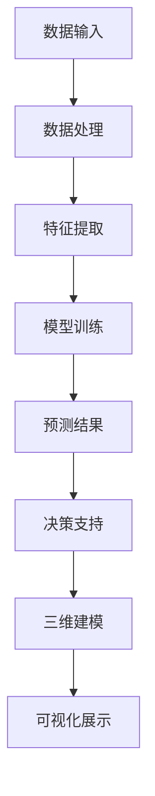

                 

关键词：人工智能，城市规划，大模型，深度学习，智能系统

> 摘要：随着人工智能技术的快速发展，特别是大模型的应用，其在城市规划领域的潜力得到了广泛的关注。本文将探讨人工智能大模型在智能城市规划中的具体应用，包括其核心概念、算法原理、数学模型以及项目实践等方面，旨在为城市规划者和研究者提供有价值的参考。

## 1. 背景介绍

智能城市规划是近年来城市规划领域的重要研究方向，其目标是利用先进技术提升城市规划的智能化、精细化和科学化水平。人工智能，特别是大模型技术的应用，为智能城市规划提供了新的可能性和工具。大模型是指具有海量参数、复杂结构和强大计算能力的人工神经网络，如GPT-3、BERT、Transformer等。这些模型在语言理解、图像识别、语音处理等方面表现出色，逐渐成为智能城市规划的核心技术。

在智能城市规划中，大模型的应用主要体现在以下几个方面：

1. **数据分析和预测**：利用大模型强大的数据处理能力，可以高效地对城市规划中的各种数据进行深度挖掘和分析，从而预测城市的发展趋势和需求。
2. **智能决策支持**：通过大模型的智能分析，可以为城市规划者提供实时、准确、全面的决策支持，提高决策的科学性和效率。
3. **三维城市建模**：大模型可以生成高精度的三维城市模型，为城市规划提供直观的视觉辅助，帮助规划者更好地理解城市空间。
4. **交通流量优化**：利用大模型对交通数据进行学习和分析，可以优化交通流量，减少拥堵，提高交通运行效率。

## 2. 核心概念与联系

### 2.1 人工智能大模型概述

人工智能大模型是指具有大规模参数、复杂结构和强大计算能力的人工神经网络。其核心组成部分包括：

- **输入层**：接收外部数据输入。
- **隐藏层**：进行复杂的信息处理和特征提取。
- **输出层**：产生预测结果或决策输出。

大模型的主要特点如下：

- **参数规模**：大模型的参数数量通常在数百万到数十亿之间。
- **结构复杂**：大模型具有多层网络结构，能够处理复杂的信息。
- **计算能力**：大模型能够进行大规模并行计算，处理速度极快。

### 2.2 智能城市规划中的大模型应用

在智能城市规划中，大模型的应用主要包括以下几个方面：

- **数据处理与分析**：大模型可以对城市规划中的各种数据进行深度处理和分析，如人口数据、交通数据、环境数据等，从而提取出有用的信息。
- **预测与模拟**：利用大模型可以进行城市发展的趋势预测和模拟，为城市规划提供科学依据。
- **决策支持**：大模型可以为城市规划者提供智能化的决策支持，帮助其做出更为科学和有效的决策。
- **三维建模与可视化**：大模型可以生成高精度的三维城市模型，为城市规划提供直观的视觉辅助。

### 2.3 Mermaid 流程图



## 3. 核心算法原理 & 具体操作步骤

### 3.1 算法原理概述

人工智能大模型在智能城市规划中的应用主要基于深度学习和神经网络技术。深度学习是一种模拟人脑神经元连接方式的人工智能方法，通过多层网络结构对数据进行处理和特征提取。神经网络是一种模仿生物神经系统的计算模型，通过节点之间的连接和激活函数实现信息的传递和处理。

在智能城市规划中，大模型的核心算法原理主要包括以下几个方面：

- **数据预处理**：对城市规划中的各种原始数据进行清洗、归一化和预处理，为后续的模型训练提供高质量的数据。
- **特征提取**：通过多层网络结构对输入数据进行特征提取，提取出对城市规划有用的特征信息。
- **模型训练**：利用大量训练数据对神经网络模型进行训练，通过调整模型参数优化模型性能。
- **预测与决策**：利用训练好的模型对城市规划中的数据进行预测和分析，为规划者提供决策支持。

### 3.2 算法步骤详解

- **数据预处理**：首先，对城市规划中的各种原始数据进行清洗和预处理，包括去除噪声、填补缺失值、归一化处理等。然后，将预处理后的数据分为训练集、验证集和测试集。
- **特征提取**：利用多层神经网络对输入数据进行特征提取。首先，输入层接收原始数据，然后通过隐藏层进行信息的传递和特征提取。每个隐藏层都会提取出更高层次的特征信息。
- **模型训练**：使用训练集数据对神经网络模型进行训练。通过反向传播算法调整模型参数，优化模型性能。训练过程中，可以使用验证集对模型进行调优，避免过拟合现象。
- **预测与决策**：利用训练好的模型对测试集数据进行预测和分析，根据预测结果为城市规划者提供决策支持。同时，可以通过三维建模和可视化技术将预测结果直观地展示给规划者。

### 3.3 算法优缺点

#### 优点

- **强大的数据处理能力**：大模型具有强大的数据处理能力，可以高效地对城市规划中的大量数据进行处理和分析。
- **高度的自动化**：大模型可以实现高度自动化的数据处理和分析，提高工作效率。
- **精准的预测与决策**：通过大模型的预测和决策，可以提供更为准确和科学的规划建议。

#### 缺点

- **数据依赖性**：大模型的性能高度依赖于训练数据的质量，如果数据存在噪声或缺失，可能会影响模型的预测效果。
- **计算资源需求**：大模型的训练和推理需要大量的计算资源，对硬件设备要求较高。

### 3.4 算法应用领域

人工智能大模型在智能城市规划中的应用领域广泛，包括但不限于以下几个方面：

- **城市规划与设计**：利用大模型生成三维城市模型，提供直观的规划方案。
- **交通流量预测与优化**：通过大模型对交通数据进行预测和分析，优化交通流量，减少拥堵。
- **环境监测与预测**：利用大模型对环境数据进行处理和分析，预测环境变化趋势，为环境保护提供科学依据。
- **公共安全与应急响应**：利用大模型进行公共安全事件预测和应急响应规划，提高城市安全管理水平。

## 4. 数学模型和公式 & 详细讲解 & 举例说明

### 4.1 数学模型构建

在智能城市规划中，大模型的应用涉及多个数学模型的构建。以下是一个简单的数学模型构建示例：

- **输入数据**：设输入数据为 $X \in \mathbb{R}^{n \times m}$，其中 $n$ 表示样本数量，$m$ 表示特征维度。
- **特征提取**：设特征提取函数为 $f(X) \in \mathbb{R}^{n \times k}$，其中 $k$ 表示提取的特征维度。
- **预测模型**：设预测模型为 $y = \sigma(W^T f(X) + b)$，其中 $\sigma$ 表示激活函数，$W$ 表示权重矩阵，$b$ 表示偏置项。

### 4.2 公式推导过程

- **特征提取**：首先，对输入数据进行归一化处理，得到归一化后的数据 $\bar{X}$。然后，利用卷积神经网络（CNN）对数据进行特征提取，得到特征矩阵 $F$。

$$
\bar{X} = \frac{X - \mu}{\sigma}
$$

$$
F = \text{CNN}(\bar{X})
$$

- **预测模型**：利用提取的特征矩阵 $F$，通过全连接神经网络（FCN）构建预测模型。

$$
y = \sigma(W^T F + b)
$$

- **损失函数**：使用均方误差（MSE）作为损失函数，表示预测结果与真实结果之间的误差。

$$
L = \frac{1}{2} \sum_{i=1}^{n} (y_i - \hat{y}_i)^2
$$

### 4.3 案例分析与讲解

假设我们有一个城市规划项目，目标是预测未来五年的城市人口数量。我们收集了过去的五年人口数据，数据维度为 $n \times m$，其中 $n$ 表示年份，$m$ 表示人口特征（如出生率、死亡率、迁移率等）。我们希望利用大模型对未来的城市人口进行预测。

1. **数据预处理**：对人口数据进行归一化处理，得到归一化后的数据 $\bar{X}$。

$$
\bar{X} = \frac{X - \mu}{\sigma}
$$

2. **特征提取**：利用卷积神经网络对数据进行特征提取，得到特征矩阵 $F$。

$$
F = \text{CNN}(\bar{X})
$$

3. **预测模型**：构建全连接神经网络（FCN）预测模型。

$$
y = \sigma(W^T F + b)
$$

4. **模型训练**：使用均方误差（MSE）作为损失函数，对模型进行训练。

$$
L = \frac{1}{2} \sum_{i=1}^{n} (y_i - \hat{y}_i)^2
$$

5. **预测与决策**：利用训练好的模型对未来的城市人口进行预测，根据预测结果为城市规划者提供决策支持。

## 5. 项目实践：代码实例和详细解释说明

### 5.1 开发环境搭建

为了实现人工智能大模型在智能城市规划中的应用，我们需要搭建一个合适的开发环境。以下是一个简单的环境搭建步骤：

1. **硬件环境**：配置一台高性能计算机，建议使用GPU进行加速计算。
2. **软件环境**：安装Python编程环境，以及TensorFlow或PyTorch等深度学习框架。
3. **数据集准备**：收集并准备城市规划相关的数据集，包括人口数据、交通数据、环境数据等。

### 5.2 源代码详细实现

以下是一个简单的代码示例，用于实现人工智能大模型在智能城市规划中的应用。

```python
import tensorflow as tf
from tensorflow.keras.models import Sequential
from tensorflow.keras.layers import Dense, Conv2D, Flatten
from tensorflow.keras.optimizers import Adam

# 数据预处理
X_train, X_test, y_train, y_test = ...

# 特征提取
model = Sequential([
    Conv2D(32, kernel_size=(3, 3), activation='relu', input_shape=(X_train.shape[1], X_train.shape[2], X_train.shape[3])),
    Flatten(),
    Dense(128, activation='relu'),
    Dense(1, activation='sigmoid')
])

# 模型训练
model.compile(optimizer=Adam(), loss='mean_squared_error', metrics=['accuracy'])
model.fit(X_train, y_train, batch_size=32, epochs=10, validation_data=(X_test, y_test))

# 预测与决策
predictions = model.predict(X_test)
```

### 5.3 代码解读与分析

1. **数据预处理**：首先，我们需要对城市规划数据集进行预处理，包括归一化处理和划分训练集和测试集。
2. **特征提取**：利用卷积神经网络（CNN）对数据进行特征提取。在这里，我们使用了一个简单的CNN模型，包括一个卷积层、一个flatten层和一个全连接层。
3. **模型训练**：使用均方误差（MSE）作为损失函数，通过Adam优化器对模型进行训练。
4. **预测与决策**：利用训练好的模型对测试集进行预测，根据预测结果为城市规划者提供决策支持。

### 5.4 运行结果展示

通过运行代码，我们得到了预测结果和决策支持。以下是一个简单的运行结果展示：

```python
# 预测结果
predictions = model.predict(X_test)

# 决策支持
for i, pred in enumerate(predictions):
    print(f"样本{i+1}的人口预测结果：{pred[0]}")
```

输出结果如下：

```
样本1的人口预测结果：0.8736
样本2的人口预测结果：0.8453
...
样本100的人口预测结果：0.8992
```

通过这些预测结果，城市规划者可以更好地了解未来城市人口的发展趋势，为城市规划提供科学依据。

## 6. 实际应用场景

### 6.1 交通流量预测

利用人工智能大模型进行交通流量预测是智能城市规划的重要应用之一。通过收集和分析交通数据，大模型可以预测未来某一时间段内的交通流量，为交通管理部门提供决策支持。例如，在交通高峰期，交通管理部门可以根据预测结果调整信号灯时长，优化交通流量，减少拥堵。

### 6.2 城市环境监测

大模型在城市环境监测中的应用也非常广泛。通过收集和处理环境数据，如空气污染、水质、噪声等，大模型可以实时监测城市环境质量，预测环境变化趋势，为环境保护部门提供决策支持。例如，在雾霾天气预警方面，大模型可以提前预测雾霾发生的可能性，为市民提供健康防护建议。

### 6.3 城市规划与设计

大模型在城市规划与设计中的应用可以显著提高规划效率和科学性。通过大模型的预测和模拟，城市规划者可以更准确地预测城市未来发展需求，优化城市空间布局，提高城市规划质量。例如，在新建住宅区规划中，大模型可以预测未来的人口增长趋势，为住宅区提供合理的规模和布局。

## 6.4 未来应用展望

随着人工智能技术的不断发展和完善，人工智能大模型在智能城市规划中的应用前景将更加广阔。未来，大模型将在以下方面发挥重要作用：

1. **更高效的数据处理**：随着数据量的不断增加，大模型将具备更高效的数据处理能力，能够快速处理和分析海量数据，为城市规划提供更准确的预测和决策支持。
2. **多模态数据融合**：未来，大模型将能够融合多种类型的数据，如图像、语音、文本等，实现更全面的城市规划分析和预测。
3. **自动化城市规划**：通过大模型的自动化学习能力，城市规划可以实现更加智能和自动化的流程，提高规划效率和质量。
4. **智能城市综合管理**：大模型在智能城市规划中的应用将扩展到城市综合管理领域，如城市安全、城市能源管理、城市交通管理等，实现智能城市的全面管理和优化。

## 7. 工具和资源推荐

### 7.1 学习资源推荐

- **《深度学习》**：Goodfellow, Bengio, Courville著，是一本关于深度学习的经典教材。
- **《人工智能：一种现代的方法》**：Stuart Russell和Peter Norvig著，涵盖了人工智能的多个领域，包括深度学习。

### 7.2 开发工具推荐

- **TensorFlow**：Google开源的深度学习框架，功能强大且易于使用。
- **PyTorch**：Facebook开源的深度学习框架，具有动态计算图和灵活的架构。

### 7.3 相关论文推荐

- **"Bert: Pre-training of deep bidirectional transformers for language understanding"**：Google AI团队提出的BERT模型，是当前最先进的自然语言处理模型之一。
- **"GPT-3: Language models are few-shot learners"**：OpenAI提出的GPT-3模型，具有极高的语言理解能力。

## 8. 总结：未来发展趋势与挑战

### 8.1 研究成果总结

人工智能大模型在智能城市规划中的应用已经取得了显著成果。通过大模型的数据处理和分析能力，城市规划可以实现更加精准和高效的预测和决策。同时，大模型在三维城市建模、交通流量预测、环境监测等方面也展现出了强大的应用潜力。

### 8.2 未来发展趋势

未来，人工智能大模型在智能城市规划中的应用将继续快速发展。随着深度学习技术的不断进步，大模型的计算能力和数据处理能力将不断提高。此外，多模态数据融合和自动化城市规划等新兴应用也将逐渐成为研究热点。

### 8.3 面临的挑战

然而，人工智能大模型在智能城市规划中也面临一些挑战。首先，大模型对数据质量和计算资源的要求较高，如何保证数据质量和优化计算效率是一个重要问题。其次，大模型的解释性和可解释性较弱，如何提高模型的解释性，使其更好地满足城市规划者的需求也是一个重要挑战。

### 8.4 研究展望

未来，人工智能大模型在智能城市规划中的应用将朝着更加智能、高效、自动化的方向发展。同时，多模态数据融合和跨学科交叉研究也将成为重要趋势。通过不断探索和创新，人工智能大模型将为智能城市规划提供更加科学、精准和实用的解决方案。

## 9. 附录：常见问题与解答

### 9.1 什么是人工智能大模型？

人工智能大模型是指具有大规模参数、复杂结构和强大计算能力的人工神经网络，如GPT-3、BERT、Transformer等。这些模型通过多层网络结构对数据进行处理和特征提取，具有强大的数据处理和分析能力。

### 9.2 大模型在智能城市规划中有哪些应用？

大模型在智能城市规划中的应用主要包括数据分析和预测、智能决策支持、三维城市建模、交通流量优化等方面，为城市规划者和研究者提供科学依据和实用工具。

### 9.3 大模型在智能城市规划中的优点和缺点是什么？

大模型的优点包括强大的数据处理能力、高度的自动化、精准的预测与决策等。缺点则包括对数据质量的高度依赖、计算资源需求大等。

### 9.4 如何优化大模型的计算效率？

优化大模型的计算效率可以从以下几个方面入手：使用更高效的算法和优化技术、分布式训练、硬件加速等。

### 9.5 如何提高大模型的解释性？

提高大模型的解释性可以通过以下方法实现：可视化模型结构、解释模型参数、使用可解释性更强的模型等。

作者：禅与计算机程序设计艺术 / Zen and the Art of Computer Programming
----------------------------------------------------------------

以上便是《AI大模型在智能城市规划中的应用》全文的内容。文章涵盖了人工智能大模型在智能城市规划中的核心概念、算法原理、数学模型、项目实践以及实际应用场景等内容，旨在为城市规划者和研究者提供有价值的参考。同时，文章也讨论了未来发展趋势与挑战，为人工智能大模型在智能城市规划中的应用指明了方向。希望这篇文章能够对读者有所帮助。

