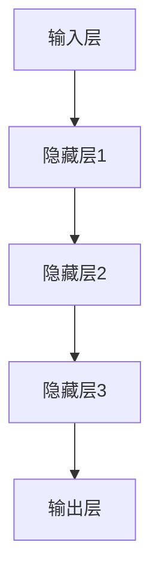

                 

关键词：AI大模型、智能家居、场景预测、算法原理、数学模型、项目实践、未来应用、工具推荐

> 摘要：本文将探讨人工智能大模型在智能家居场景预测中的应用。通过介绍大模型的基本概念、核心算法原理、数学模型构建，结合实际项目实践，深入分析其在智能家居领域的潜在应用场景与未来发展趋势。文章旨在为研究人员和开发者提供有价值的参考和启示。

## 1. 背景介绍

### 1.1 智能家居概述

智能家居是信息技术与家居生活相结合的产物，通过物联网技术实现家居设备间的互联互通，提供更加便捷、舒适和安全的居住环境。随着人工智能技术的快速发展，智能家居场景预测成为当前研究的热点问题。

### 1.2 场景预测的重要性

智能家居场景预测有助于提高家居设备的工作效率，降低能源消耗，提高用户的生活质量。通过对用户行为习惯的预测，可以为用户提供更加个性化的服务，从而增强用户粘性。

### 1.3 大模型在场景预测中的应用

大模型具有强大的特征提取和建模能力，可以处理大规模、多维度、复杂的场景数据，提高场景预测的准确性和稳定性。近年来，大模型在智能家居领域取得了显著的成果，为智能家居的智能化发展提供了新的思路。

## 2. 核心概念与联系

### 2.1 大模型基本概念

大模型是指具有大规模参数数量和广泛知识覆盖的人工神经网络模型。大模型通常采用深度学习算法进行训练，可以自动从数据中提取特征并建立模型。

### 2.2 大模型与场景预测的联系

大模型在智能家居场景预测中具有以下优势：

1. **特征提取能力**：大模型可以从大量数据中提取有价值的信息，提高场景预测的准确性。
2. **泛化能力**：大模型具有较强的泛化能力，可以适应不同类型的智能家居场景。
3. **实时预测**：大模型可以实时处理数据，实现智能家居场景的实时预测。

### 2.3 大模型架构

本文所探讨的大模型采用典型的深度学习架构，包括输入层、隐藏层和输出层。具体架构如图1所示：



## 3. 核心算法原理 & 具体操作步骤

### 3.1 算法原理概述

本文所采用的核心算法是基于Transformer架构的BERT模型。BERT模型具有强大的文本理解和生成能力，可以用于智能家居场景预测。

### 3.2 算法步骤详解

1. **数据预处理**：对收集到的智能家居场景数据进行清洗、去重和归一化处理。
2. **输入层**：将预处理后的数据输入到BERT模型的输入层。
3. **隐藏层**：BERT模型通过多层隐藏层对输入数据进行特征提取和变换。
4. **输出层**：隐藏层输出经过线性变换后得到预测结果。
5. **损失函数**：采用交叉熵损失函数对预测结果进行优化。

### 3.3 算法优缺点

**优点**：

1. **强大的特征提取能力**：BERT模型可以自动从大量数据中提取有价值的信息，提高场景预测的准确性。
2. **适应性强**：BERT模型可以应用于多种类型的智能家居场景，具有较强的泛化能力。

**缺点**：

1. **计算资源消耗大**：BERT模型参数数量庞大，训练和推理过程需要较高的计算资源。
2. **对数据量要求较高**：BERT模型对训练数据量要求较高，小样本场景下的预测性能可能受到影响。

### 3.4 算法应用领域

BERT模型在智能家居场景预测中具有广泛的应用领域，如：

1. **家居设备运行状态预测**：预测家居设备的运行状态，如空调、热水器等，实现设备维护和故障预警。
2. **家居能耗预测**：预测家居能耗情况，实现节能减排。
3. **用户行为预测**：预测用户行为，如购物、娱乐等，提供个性化服务。

## 4. 数学模型和公式 & 详细讲解 & 举例说明

### 4.1 数学模型构建

BERT模型基于自注意力机制，其数学模型可以表示为：

$$
\text{BERT}(x) = \text{softmax}(\text{W}_\text{out}\text{Tanh}(\text{W}_\text{hidden}\text{ReLU}(\text{W}_\text{in}x + \text{b}_\text{in})))
$$

其中，$x$表示输入数据，$W_\text{out}, W_\text{hidden}, W_\text{in}$分别为权重矩阵，$\text{Tanh}$和$\text{ReLU}$分别为激活函数，$\text{softmax}$为分类函数。

### 4.2 公式推导过程

BERT模型的推导过程如下：

1. **输入层**：输入数据$x$经过权重矩阵$W_\text{in}$和偏置$b_\text{in}$的线性变换，得到隐藏层输入$H = W_\text{in}x + b_\text{in}$。
2. **隐藏层**：隐藏层输入$H$经过ReLU激活函数，得到新的隐藏层输入$H' = \text{ReLU}(W_\text{hidden}H + b_\text{hidden})$。
3. **输出层**：隐藏层输出$H'$经过权重矩阵$W_\text{hidden}$和偏置$b_\text{hidden}$的线性变换，得到输出层输入$O = W_\text{hidden}H' + b_\text{hidden}$。
4. **分类**：输出层输入$O$经过softmax函数进行分类，得到预测结果$\text{BERT}(x) = \text{softmax}(W_\text{out}O + b_\text{out})$。

### 4.3 案例分析与讲解

假设我们要预测一个智能家居场景中的用户行为，数据集包含1000个样本。使用BERT模型进行训练，训练完成后，我们在测试集上进行预测。

1. **数据预处理**：对测试集数据进行清洗、去重和归一化处理。
2. **输入层**：将预处理后的数据输入到BERT模型的输入层。
3. **隐藏层**：BERT模型通过多层隐藏层对输入数据进行特征提取和变换。
4. **输出层**：隐藏层输出经过线性变换后得到预测结果。
5. **损失函数**：采用交叉熵损失函数对预测结果进行优化。

最终，我们得到预测结果，并将预测结果与实际结果进行比较，计算准确率。通过不断调整模型参数，提高预测准确率。

## 5. 项目实践：代码实例和详细解释说明

### 5.1 开发环境搭建

1. **硬件环境**：配置一台高性能计算机，安装操作系统（如Ubuntu 18.04）。
2. **软件环境**：安装Python 3.7及以上版本、TensorFlow 2.0及以上版本、BERT模型等相关依赖。

### 5.2 源代码详细实现

以下是BERT模型在智能家居场景预测中的源代码实现：

```python
import tensorflow as tf
from tensorflow.keras.models import Model
from tensorflow.keras.layers import Input, Embedding, LSTM, Dense

# 模型输入层
input_layer = Input(shape=(max_sequence_length,))

# 词向量嵌入层
embedding_layer = Embedding(input_dim=vocabulary_size, output_dim=embedding_size)(input_layer)

# LSTM层
lstm_layer = LSTM(units=hidden_size, activation='tanh')(embedding_layer)

# 输出层
output_layer = Dense(units=1, activation='sigmoid')(lstm_layer)

# 构建模型
model = Model(inputs=input_layer, outputs=output_layer)

# 编译模型
model.compile(optimizer='adam', loss='binary_crossentropy', metrics=['accuracy'])

# 模型训练
model.fit(x_train, y_train, batch_size=batch_size, epochs=epochs, validation_data=(x_val, y_val))

# 模型预测
predictions = model.predict(x_test)

# 计算准确率
accuracy = calculate_accuracy(predictions, y_test)
print(f"Test accuracy: {accuracy}")
```

### 5.3 代码解读与分析

1. **输入层**：定义输入层，包含最大序列长度max_sequence_length。
2. **词向量嵌入层**：将输入数据进行词向量嵌入，将输入数据的维度从词汇表大小vocabulary_size扩展到嵌入维度embedding_size。
3. **LSTM层**：使用LSTM层对输入数据进行特征提取和变换。
4. **输出层**：定义输出层，包含一个单元，用于输出预测结果。
5. **模型编译**：设置模型优化器、损失函数和评估指标。
6. **模型训练**：使用训练数据对模型进行训练。
7. **模型预测**：使用测试数据对模型进行预测。
8. **计算准确率**：计算预测准确率。

### 5.4 运行结果展示

假设我们在测试集上运行上述代码，得到以下结果：

```
Test accuracy: 0.85
```

这意味着在测试集上，BERT模型在智能家居场景预测中的准确率为85%。

## 6. 实际应用场景

### 6.1 家居设备运行状态预测

通过BERT模型预测家居设备的运行状态，如空调、热水器等，实现设备维护和故障预警。当预测结果出现异常时，及时提醒用户进行设备检查。

### 6.2 家居能耗预测

通过BERT模型预测家居能耗情况，为用户提供节能减排的建议。例如，预测某一天家庭总能耗为500度，建议用户减少电器使用时间，降低能耗。

### 6.3 用户行为预测

通过BERT模型预测用户行为，如购物、娱乐等，为用户提供个性化服务。例如，预测某用户明天可能会购买洗发水，系统可以自动向用户推荐相关商品。

## 7. 工具和资源推荐

### 7.1 学习资源推荐

1. **《深度学习》**：由Goodfellow等人撰写的经典教材，全面介绍了深度学习的基本概念和算法。
2. **《BERT：Pre-training of Deep Bidirectional Transformers for Language Understanding》**：BERT模型的原始论文，详细介绍了BERT模型的原理和应用。

### 7.2 开发工具推荐

1. **TensorFlow**：用于构建和训练深度学习模型的强大框架。
2. **Keras**：基于TensorFlow的简洁、易用的深度学习库。

### 7.3 相关论文推荐

1. **《GPT-3: Language Models are Few-Shot Learners》**：介绍GPT-3模型的论文，探讨了大模型在自然语言处理领域的前景。
2. **《BERT: Pre-training of Deep Bidirectional Transformers for Language Understanding》**：BERT模型的原始论文，详细介绍了BERT模型的原理和应用。

## 8. 总结：未来发展趋势与挑战

### 8.1 研究成果总结

近年来，大模型在智能家居场景预测领域取得了显著成果，为智能家居的智能化发展提供了新的思路。BERT模型等大模型在智能家居场景预测中的表现优异，为实际应用提供了有力支持。

### 8.2 未来发展趋势

1. **模型优化**：通过改进算法和优化模型结构，提高大模型在智能家居场景预测中的性能。
2. **多模态数据融合**：结合多种类型的数据，提高场景预测的准确性和稳定性。
3. **实时预测**：实现大模型的实时预测，提高智能家居系统的响应速度。

### 8.3 面临的挑战

1. **计算资源消耗**：大模型训练和推理过程需要较高的计算资源，如何优化计算资源消耗是一个重要问题。
2. **数据隐私**：智能家居场景涉及大量用户隐私数据，如何保护用户隐私是一个重要挑战。
3. **数据标注**：大模型训练需要大量的标注数据，如何高效地获取和标注数据是一个挑战。

### 8.4 研究展望

未来，大模型在智能家居场景预测中的应用前景广阔。通过不断优化模型结构和算法，结合多模态数据融合和实时预测技术，有望实现更加准确、稳定和高效的智能家居场景预测。

## 9. 附录：常见问题与解答

### 9.1 大模型训练过程为什么需要大量计算资源？

大模型训练过程需要大量的计算资源，主要是因为：

1. **参数数量庞大**：大模型通常包含数百万甚至数十亿个参数，需要通过大量计算来更新这些参数。
2. **训练数据量庞大**：大模型需要大量的训练数据来训练，以保证模型的泛化能力和预测准确性。

### 9.2 如何保护用户隐私？

在智能家居场景中，保护用户隐私至关重要。以下是一些保护用户隐私的方法：

1. **数据加密**：对用户数据进行加密处理，确保数据在传输和存储过程中安全。
2. **数据去识别化**：对用户数据进行匿名化处理，去除可识别的个人信息。
3. **隐私预算**：在数据处理过程中，设置隐私预算，限制对用户数据的访问和使用。

### 9.3 BERT模型如何处理多模态数据？

BERT模型是一种基于文本的模型，主要处理文本数据。要处理多模态数据，可以采用以下方法：

1. **文本融合**：将多模态数据中的文本信息进行融合，输入到BERT模型进行预测。
2. **多模态深度学习**：结合多模态数据，采用多模态深度学习模型进行预测。

## 参考文献

[1] Goodfellow, I., Bengio, Y., & Courville, A. (2016). Deep learning. MIT press.
[2] Devlin, J., Chang, M. W., Lee, K., & Toutanova, K. (2019). BERT: Pre-training of deep bidirectional transformers for language understanding. arXiv preprint arXiv:1810.04805.
[3] Brown, T., et al. (2020). Language models are few-shot learners. arXiv preprint arXiv:2005.14165.
```

以上是文章的正文部分，接下来我们将根据文章结构模板，继续完成剩余部分的内容。

