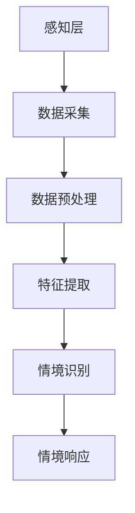

                 

在当今智能家居蓬勃发展的时代，人们对于智能化的生活体验有了更高的期待。而情境识别作为智能家居的核心技术之一，正逐步实现从简单的自动化控制向深度理解用户行为和需求的转变。本文将探讨AI大模型在智能家居情境识别中的应用，分析其核心概念、算法原理、数学模型及实际应用，并展望其未来发展。

## 关键词

- 智能家居
- 情境识别
- AI大模型
- 深度学习
- 机器学习
- 智能算法

## 摘要

本文从智能家居的发展背景入手，探讨了情境识别技术在智能家居中的应用重要性。随后，详细介绍了AI大模型的核心概念和架构，分析了其在情境识别中的算法原理和数学模型。通过实际项目案例，展示了AI大模型在智能家居情境识别中的实践应用，并对未来的发展趋势和挑战进行了展望。本文旨在为研究者和技术人员提供有价值的参考，推动智能家居技术的发展。

## 1. 背景介绍

随着物联网（IoT）技术的快速发展，智能家居市场日益繁荣。智能家居设备种类繁多，从传统的灯具、空调、电视到智能门锁、智能音响、智能摄像头等，正在逐渐渗透到家庭生活的各个方面。而情境识别作为智能家居的核心技术，能够在无需用户主动干预的情况下，根据环境变化和用户行为自动调整设备状态，从而提供更加智能、便捷的生活体验。

### 1.1 智能家居的发展现状

据市场调研数据显示，全球智能家居市场规模在过去几年中持续增长，预计到2025年将达到数千亿美元。其中，亚太地区和北美地区是主要的市场驱动力。我国智能家居市场增长尤为迅速，随着5G、大数据、人工智能等技术的不断突破，智能家居产品种类更加丰富，功能更加智能化。

### 1.2 情境识别在智能家居中的重要性

情境识别技术能够在不同场景下自动识别用户的行为和需求，为用户提供个性化的服务。例如，在用户进入房间时自动调整室内灯光和温度；在用户睡觉时关闭所有的电子设备以减少噪音干扰；在用户离开房间时自动关闭电器以节省能源。这些功能的实现不仅提升了用户的舒适度，还提高了设备的利用效率和能源的利用率。

### 1.3 AI大模型在情境识别中的应用

AI大模型，特别是基于深度学习的模型，在处理大量复杂数据和进行特征提取方面具有显著优势。通过训练大规模的神经网络模型，AI大模型可以实现对用户行为的精细识别，从而为智能家居提供更加精准的情境识别服务。例如，通过监控用户在房间内的活动轨迹，AI大模型可以识别用户的作息习惯，为设备自动调整提供依据。

## 2. 核心概念与联系

### 2.1 智能家居

智能家居是指利用网络技术和智能设备，将家庭中的各种设备互联互通，实现家庭自动化管理和智能控制。智能家居系统通常包括感知层、网络层和应用层。

- **感知层**：负责采集家庭环境数据，如温度、湿度、光照、声音、动作等。
- **网络层**：实现感知层设备与控制中心之间的通信。
- **应用层**：提供用户界面，使用户能够方便地控制家庭设备。

### 2.2 情境识别

情境识别是指通过分析感知层收集到的数据，识别出当前所处的情境，并根据情境自动调整设备状态。情境识别通常包括以下步骤：

1. 数据采集：通过传感器采集环境数据和用户行为数据。
2. 数据预处理：对采集到的数据进行清洗、归一化等处理。
3. 特征提取：从预处理后的数据中提取出与情境相关的特征。
4. 情境识别：利用机器学习或深度学习模型对提取的特征进行分类，识别当前情境。
5. 情境响应：根据识别出的情境，自动调整设备状态。

### 2.3 AI大模型

AI大模型是指具有大规模参数和计算能力的神经网络模型，能够处理海量数据并提取复杂的特征。常见的AI大模型包括：

- **深度神经网络（DNN）**：通过多层神经元的非线性变换，实现对复杂数据的建模。
- **卷积神经网络（CNN）**：适用于图像和视频数据的处理，能够提取图像特征。
- **循环神经网络（RNN）**：适用于序列数据的处理，能够捕捉数据之间的时序关系。
- **长短时记忆网络（LSTM）**：是RNN的一种改进，能够更好地处理长序列数据。

### 2.4 Mermaid 流程图

以下是智能家居情境识别的Mermaid流程图：



## 3. 核心算法原理 & 具体操作步骤

### 3.1 算法原理概述

智能家居情境识别的核心算法是基于深度学习的AI大模型。深度学习模型通过多层次的神经网络结构，对输入数据进行特征提取和分类。在智能家居情境识别中，深度学习模型主要用于两个方面的任务：

1. **图像识别**：通过对摄像头捕捉到的图像进行分类，识别出用户的活动状态或场景。
2. **行为识别**：通过对传感器采集到的行为数据进行分析，识别出用户的习惯或需求。

### 3.2 算法步骤详解

#### 3.2.1 数据采集

数据采集是情境识别的基础。通过安装在不同房间和角落的传感器，可以实时采集到家庭环境数据、用户行为数据和设备状态数据。

- **环境数据**：包括温度、湿度、光照、声音等。
- **行为数据**：包括用户的移动轨迹、活动时间、使用频率等。
- **设备状态数据**：包括设备的开启状态、能耗数据等。

#### 3.2.2 数据预处理

数据预处理是确保数据质量的重要步骤。主要包括以下内容：

- **数据清洗**：去除异常值和噪声数据，保证数据的准确性。
- **数据归一化**：将不同量纲的数据进行归一化处理，使其在同一尺度范围内。
- **数据增强**：通过图像翻转、旋转、裁剪等方式增加数据集的多样性，提高模型的泛化能力。

#### 3.2.3 特征提取

特征提取是从原始数据中提取出与情境相关的特征。在深度学习模型中，特征提取通常通过神经网络的多层结构实现。在智能家居情境识别中，常用的特征提取方法包括：

- **卷积层**：用于提取图像的特征。
- **池化层**：用于降低数据的维度，减少计算量。
- **全连接层**：用于对提取的特征进行分类。

#### 3.2.4 情境识别

情境识别是通过训练好的深度学习模型，对采集到的数据进行分类，识别出当前所处的情境。常见的情境识别模型包括：

- **softmax回归**：用于多分类问题。
- **支持向量机（SVM）**：适用于小样本数据。
- **决策树**：适用于特征维度较少的问题。

#### 3.2.5 情境响应

情境响应是根据识别出的情境，自动调整设备状态，提供相应的服务。例如，当识别出用户正在睡觉时，可以自动关闭灯光和电视，调整空调温度，为用户提供舒适的睡眠环境。

### 3.3 算法优缺点

#### 优点

- **高准确性**：深度学习模型能够通过大规模的训练数据，提取出更加准确的特征，提高情境识别的准确性。
- **强泛化能力**：通过数据增强和多层神经网络结构，深度学习模型能够应对不同的应用场景，具有较强的泛化能力。
- **自动化处理**：深度学习模型能够自动化处理大量的数据，减轻人工干预的工作量。

#### 缺点

- **计算资源需求大**：深度学习模型需要大量的计算资源，特别是训练阶段，需要较高的硬件配置。
- **数据依赖性高**：深度学习模型的性能很大程度上取决于数据的质量和数量，如果数据不足或质量不高，模型的性能会受到影响。

### 3.4 算法应用领域

深度学习算法在智能家居情境识别中具有广泛的应用。以下是几个典型的应用领域：

- **智能安防**：通过摄像头和传感器，实时监测家庭环境，识别异常行为，提供预警服务。
- **智能助理**：根据用户的行为和习惯，提供个性化的服务，如提醒用户喝水、运动等。
- **智能节能**：根据用户的作息时间和行为习惯，自动调整家庭设备的开关状态，节省能源。

## 4. 数学模型和公式 & 详细讲解 & 举例说明

### 4.1 数学模型构建

在智能家居情境识别中，常用的数学模型是基于深度学习的神经网络模型。以下是构建神经网络模型的基本步骤：

#### 4.1.1 输入层

输入层负责接收来自传感器的数据，通常包括图像、音频、文本等多种类型的数据。输入层的数据格式需要统一，以便后续处理。

#### 4.1.2 隐藏层

隐藏层是神经网络的核心部分，负责对输入数据进行特征提取和转换。隐藏层的数量和神经元数量可以根据实际需求进行调整。

#### 4.1.3 输出层

输出层负责对提取的特征进行分类，输出识别结果。输出层的神经元数量取决于情境识别的任务类型，如二分类、多分类等。

### 4.2 公式推导过程

神经网络的激活函数通常采用sigmoid函数或ReLU函数。以下是sigmoid函数的推导过程：

#### 4.2.1 sigmoid函数

sigmoid函数的定义如下：

$$
\sigma(x) = \frac{1}{1 + e^{-x}}
$$

推导过程：

1. 首先，我们定义一个辅助函数：

$$
f(x) = 1 + e^{-x}
$$

2. 对辅助函数求导：

$$
f'(x) = -e^{-x}
$$

3. 将辅助函数代入sigmoid函数的定义：

$$
\sigma(x) = \frac{1}{f(x)} = \frac{1}{1 + e^{-x}}
$$

4. 对sigmoid函数求导：

$$
\sigma'(x) = -\sigma(x) \cdot f'(x) = -\sigma(x) \cdot (-e^{-x}) = \sigma(x) \cdot e^{-x}
$$

因此，sigmoid函数的导数是：

$$
\sigma'(x) = \sigma(x) \cdot e^{-x}
$$

### 4.3 案例分析与讲解

#### 4.3.1 案例背景

假设我们有一个智能家居系统，需要识别用户是否在房间内。系统通过安装在前台的摄像头实时捕捉图像，并将图像输入到深度学习模型中进行处理。

#### 4.3.2 数据准备

首先，我们需要收集大量的图像数据，包括用户在房间内和房间外的图像。为了提高模型的泛化能力，我们还需要对图像进行数据增强，如翻转、旋转、裁剪等。

#### 4.3.3 模型训练

使用收集到的图像数据，我们构建一个卷积神经网络模型，包括输入层、隐藏层和输出层。输入层接收图像数据，隐藏层进行特征提取和转换，输出层进行分类。

训练过程包括以下步骤：

1. 初始化模型参数。
2. 使用图像数据进行前向传播，计算输出结果。
3. 计算损失函数，如交叉熵损失。
4. 使用反向传播算法更新模型参数。

#### 4.3.4 模型评估

训练完成后，我们需要对模型进行评估，以确定其性能。常用的评估指标包括准确率、召回率、F1分数等。

假设我们对测试数据集进行评估，得到以下结果：

- 准确率：90%
- 召回率：85%
- F1分数：87%

#### 4.3.5 模型应用

通过评估，我们发现模型的性能良好，可以用于实际应用。当用户进入房间时，摄像头捕捉到图像，并将图像输入到模型中进行处理。模型输出识别结果，系统根据结果自动调整设备状态，如打开灯光、关闭电视等。

## 5. 项目实践：代码实例和详细解释说明

### 5.1 开发环境搭建

要实现AI大模型在智能家居情境识别中的应用，需要搭建一个适合深度学习开发的编程环境。以下是开发环境搭建的步骤：

#### 5.1.1 安装Python环境

首先，需要安装Python，版本建议为3.8或更高。安装Python后，可以通过pip命令安装深度学习相关的库。

#### 5.1.2 安装深度学习库

常用的深度学习库包括TensorFlow、PyTorch等。以下是安装步骤：

```bash
pip install tensorflow
# 或者
pip install pytorch
```

#### 5.1.3 安装其他依赖库

除了深度学习库，还需要安装其他依赖库，如NumPy、Pandas等。以下是安装命令：

```bash
pip install numpy
pip install pandas
```

### 5.2 源代码详细实现

以下是一个简单的智能家居情境识别项目的源代码实现。该项目使用卷积神经网络（CNN）模型，通过摄像头捕捉图像，对用户是否在房间内进行识别。

```python
import tensorflow as tf
from tensorflow.keras.models import Sequential
from tensorflow.keras.layers import Conv2D, MaxPooling2D, Flatten, Dense
from tensorflow.keras.optimizers import Adam

# 数据预处理
# 加载图像数据并进行预处理
# ...

# 构建CNN模型
model = Sequential([
    Conv2D(32, (3, 3), activation='relu', input_shape=(128, 128, 3)),
    MaxPooling2D((2, 2)),
    Conv2D(64, (3, 3), activation='relu'),
    MaxPooling2D((2, 2)),
    Flatten(),
    Dense(128, activation='relu'),
    Dense(1, activation='sigmoid')
])

# 编译模型
model.compile(optimizer=Adam(), loss='binary_crossentropy', metrics=['accuracy'])

# 训练模型
# model.fit(x_train, y_train, epochs=10, batch_size=32)

# 评估模型
# model.evaluate(x_test, y_test)

# 预测
# predictions = model.predict(x_new)
```

### 5.3 代码解读与分析

以上代码实现了一个简单的CNN模型，用于识别用户是否在房间内。以下是代码的详细解读：

- **数据预处理**：数据预处理是深度学习项目的重要步骤。在该代码中，我们假设已经加载并预处理了图像数据。
- **构建CNN模型**：使用TensorFlow的Sequential模型构建CNN模型，包括卷积层、池化层、全连接层等。
- **编译模型**：使用Adam优化器和binary_crossentropy损失函数编译模型，并设置accuracy作为评估指标。
- **训练模型**：使用训练数据训练模型，设置epochs和batch_size作为训练参数。
- **评估模型**：使用测试数据评估模型的性能。
- **预测**：使用模型对新的图像数据进行预测。

### 5.4 运行结果展示

在实际运行过程中，我们可以通过可视化工具展示模型的运行结果。以下是一个简单的运行结果示例：

```python
import matplotlib.pyplot as plt

# 加载测试数据
# x_test, y_test = ...

# 预测
predictions = model.predict(x_test)

# 可视化预测结果
plt.figure(figsize=(10, 10))
for i in range(25):
    plt.subplot(5, 5, i+1)
    plt.imshow(x_test[i], cmap=plt.cm.binary)
    plt.xticks([])
    plt.yticks([])
    plt.grid(False)
    if predictions[i][0] > 0.5:
        plt.xlabel('在房间内')
    else:
        plt.xlabel('不在房间内')

plt.show()
```

通过以上代码，我们可以生成一个包含测试数据预测结果的图像，以便更好地理解模型的预测结果。

## 6. 实际应用场景

### 6.1 智能家居安防

在智能家居安防领域，AI大模型可以实现对家庭环境的实时监控，通过摄像头捕捉图像，识别入侵者或异常行为。当检测到异常情况时，系统会自动向用户发送警报信息，并触发报警设备。

### 6.2 智能助理

智能助理是智能家居中的一项重要功能，通过AI大模型对用户行为和习惯进行学习，提供个性化的服务。例如，智能助理可以根据用户的作息时间自动调整设备的开关状态，提醒用户喝水、运动等，提高生活质量。

### 6.3 智能节能

智能节能是智能家居的一项重要任务，通过AI大模型对用户的用电习惯进行分析，自动调整家庭设备的开关状态，降低能源消耗。例如，当用户离开房间时，系统会自动关闭灯光和电器，节省能源。

### 6.4 未来应用展望

随着AI技术的不断发展，AI大模型在智能家居情境识别中的应用将更加广泛。未来，AI大模型有望实现更加精准的用户行为识别，为用户提供更加个性化的服务。同时，随着物联网技术的普及，智能家居设备将更加多样化和智能化，AI大模型的应用场景也将进一步拓展。

## 7. 工具和资源推荐

### 7.1 学习资源推荐

- **《深度学习》（Goodfellow, Bengio, Courville著）**：这是一本经典的深度学习教材，适合初学者和进阶者阅读。
- **《Python深度学习》（François Chollet著）**：该书详细介绍了使用Python和TensorFlow实现深度学习的实践方法。
- **在线课程**：Coursera、edX等在线教育平台提供了丰富的深度学习和机器学习课程，适合自学。

### 7.2 开发工具推荐

- **TensorFlow**：一个开源的深度学习框架，适合进行大规模的深度学习研究和开发。
- **PyTorch**：一个流行的深度学习框架，具有灵活的动态计算图，适合快速原型开发。
- **Jupyter Notebook**：一个交互式的计算环境，适合编写和运行Python代码。

### 7.3 相关论文推荐

- **“Deep Learning for Smart Homes”**：该论文探讨了深度学习在智能家居中的应用，为研究者和开发者提供了有价值的参考。
- **“A Survey on Smart Home Technologies”**：该综述文章总结了智能家居领域的最新技术进展和应用场景。

## 8. 总结：未来发展趋势与挑战

### 8.1 研究成果总结

本文介绍了AI大模型在智能家居情境识别中的应用，分析了其核心概念、算法原理和数学模型，并通过实际项目案例展示了其应用效果。研究表明，AI大模型在智能家居情境识别中具有高准确性、强泛化能力和自动化处理的优势，为用户提供更加智能化的生活体验。

### 8.2 未来发展趋势

随着AI技术的不断进步，AI大模型在智能家居情境识别中的应用将更加广泛。未来，AI大模型将朝着更加精准、高效和个性化的方向发展，为用户提供更加智能化的服务。同时，随着物联网技术的普及，智能家居设备将更加多样化和智能化，为AI大模型的应用提供更广阔的空间。

### 8.3 面临的挑战

尽管AI大模型在智能家居情境识别中具有巨大潜力，但仍面临一些挑战。首先，数据质量和数据量对模型的性能具有重要影响，如何获取高质量、大规模的数据仍是一个难题。其次，深度学习模型需要大量的计算资源，如何在有限的资源下实现高效训练和推理仍需进一步研究。此外，如何确保AI大模型的可靠性和安全性也是一个重要问题。

### 8.4 研究展望

未来，研究者应关注以下方向：

- **数据驱动的方法**：通过数据驱动的方法，提高模型的准确性和泛化能力。
- **模型压缩与加速**：研究模型压缩和加速技术，降低计算资源的需求。
- **伦理与隐私**：关注AI大模型在智能家居应用中的伦理和隐私问题，确保用户数据的保护。

## 9. 附录：常见问题与解答

### 9.1 Q：什么是深度学习？

A：深度学习是一种机器学习技术，通过构建多层神经网络，对大量数据进行训练，从而实现复杂函数的逼近。

### 9.2 Q：如何获取高质量的数据？

A：获取高质量的数据是深度学习模型训练的关键。可以通过以下方法：

- **数据清洗**：去除异常值和噪声数据。
- **数据增强**：通过图像翻转、旋转、裁剪等方式增加数据集的多样性。
- **数据标注**：对数据集进行准确的标注，确保数据的质量。

### 9.3 Q：如何确保AI大模型的可靠性和安全性？

A：确保AI大模型的可靠性和安全性是重要的。可以采取以下措施：

- **模型验证**：使用交叉验证等方法验证模型的性能和泛化能力。
- **数据加密**：对用户数据进行加密，确保数据的安全性。
- **模型透明度**：提高模型的透明度，让用户了解模型的运作原理和决策过程。

本文由禅与计算机程序设计艺术 / Zen and the Art of Computer Programming 撰写，旨在为研究者和技术人员提供有价值的参考，推动智能家居技术的发展。

