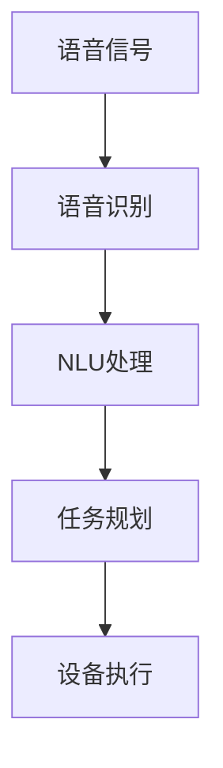

                 

 **关键词**: AI大模型、智能家居、语音交互、创新应用、深度学习

**摘要**: 本文旨在探讨人工智能（AI）大模型在智能家居语音交互中的应用及其创新。随着AI技术的快速发展，大模型在处理复杂任务、理解人类语言等方面表现出色。本文将详细介绍AI大模型的工作原理、实现方法以及在智能家居语音交互中的实际应用，并对未来发展趋势和面临的挑战进行分析。

## 1. 背景介绍

随着物联网（IoT）技术的普及，智能家居市场迎来了前所未有的发展机遇。人们希望家中的设备和系统能够自动响应并满足他们的需求，而语音交互成为实现这一目标的关键途径。传统的智能家居系统通常依赖于预先设定的命令和规则，而现代智能家居系统则越来越倾向于采用自然语言处理（NLP）技术，以便更好地理解和响应用户的语音指令。

在语音交互中，AI大模型扮演着至关重要的角色。大模型是通过大量数据进行训练的，它们能够捕捉语言的复杂性，理解上下文，并生成自然的回答。与传统的规则系统相比，大模型具有更高的灵活性和准确性，能够提供更加智能化和个性化的服务。然而，大模型的实现和部署面临着诸多挑战，包括数据质量、计算资源、安全性和隐私保护等方面。

本文将首先介绍AI大模型的基本原理，然后详细探讨其在智能家居语音交互中的应用，最后分析未来的发展趋势和面临的挑战。

## 2. 核心概念与联系

### 2.1 AI大模型的基本原理

AI大模型，通常指的是深度学习模型，尤其是基于变换器（Transformer）架构的模型，如BERT、GPT和T5等。这些模型通过学习大量的文本数据来捕捉语言的语义和上下文信息，从而实现高度自动化的文本理解和生成。

#### 2.1.1 深度学习模型

深度学习模型由多层神经网络组成，每层都能够对输入数据进行特征提取和转换。通过多层网络的堆叠，模型能够捕捉到越来越复杂的信息。深度学习模型在语音识别、图像识别、自然语言处理等领域取得了显著的成果。

#### 2.1.2 变换器架构

变换器（Transformer）是深度学习模型的一种重要架构，它通过自注意力机制（Self-Attention）来捕捉输入数据中的长距离依赖关系。这种机制使得变换器模型能够在处理序列数据时表现出优异的性能。

#### 2.1.3 大模型的训练与优化

大模型的训练通常需要海量的数据和强大的计算资源。训练过程中，模型通过不断调整参数来最小化损失函数，以达到对数据的最佳拟合。优化算法和正则化技术在大模型的训练过程中起到了关键作用。

### 2.2 智能家居语音交互中的核心概念

智能家居语音交互涉及多个核心概念，包括语音识别、自然语言理解、任务规划和执行等。

#### 2.2.1 语音识别

语音识别是将语音信号转换为文本的过程。高质量的语音识别系统能够准确地将用户的语音指令转换为文本，以便后续处理。

#### 2.2.2 自然语言理解

自然语言理解（NLU）是指模型对自然语言文本的理解能力。它包括语义解析、实体识别、情感分析等任务，旨在捕捉用户指令的含义和上下文。

#### 2.2.3 任务规划与执行

任务规划与执行是指模型根据用户指令生成相应的操作，并协调智能家居设备完成这些操作。这需要模型具备良好的推理能力和决策能力。

### 2.3 AI大模型与智能家居语音交互的联系

AI大模型在智能家居语音交互中的应用主要体现在以下几个方面：

- **语音识别与自然语言理解**：大模型能够高效地处理语音信号和文本数据，实现高精度的语音识别和自然语言理解。
- **任务规划与执行**：大模型能够根据用户指令生成具体的操作指令，并协调智能家居设备执行这些任务。
- **个性化服务**：大模型能够通过学习用户行为和偏好，提供个性化的智能家居服务。

#### 2.3.1 Mermaid 流程图



**图 1. AI大模型在智能家居语音交互中的流程图**

## 3. 核心算法原理 & 具体操作步骤

### 3.1 算法原理概述

AI大模型在智能家居语音交互中的应用主要依赖于深度学习技术和自然语言处理技术。以下是对核心算法原理的概述：

- **深度学习技术**：深度学习模型通过多层神经网络结构，对输入数据进行特征提取和转换，从而实现高层次的语义理解。
- **自然语言处理技术**：自然语言处理技术包括语音识别、自然语言理解、任务规划与执行等，旨在实现人与智能家居系统的自然交互。

### 3.2 算法步骤详解

#### 3.2.1 语音识别

语音识别过程主要包括以下几个步骤：

1. **特征提取**：通过音频信号处理技术，提取语音信号中的特征参数，如梅尔频率倒谱系数（MFCC）。
2. **声学模型训练**：使用大量语音数据，训练声学模型，以识别语音信号中的声音特征。
3. **语言模型训练**：使用文本数据，训练语言模型，以识别语音信号中的文本含义。

#### 3.2.2 自然语言理解

自然语言理解过程主要包括以下几个步骤：

1. **词嵌入**：将文本数据转换为向量表示，以便模型能够处理和计算。
2. **句法分析**：对文本进行句法分析，提取句子的结构信息。
3. **语义分析**：理解文本的语义，包括实体识别、情感分析等。

#### 3.2.3 任务规划与执行

任务规划与执行过程主要包括以下几个步骤：

1. **任务解析**：根据用户指令，识别任务类型和操作目标。
2. **任务生成**：生成具体的操作指令，包括控制智能家居设备的参数和操作方式。
3. **设备执行**：协调智能家居设备，执行相应的操作。

### 3.3 算法优缺点

#### 优点：

- **高精度识别**：深度学习技术和自然语言处理技术能够实现高精度的语音识别和自然语言理解。
- **灵活性强**：大模型能够根据用户指令生成灵活的操作指令，提供个性化的服务。
- **高效计算**：大模型在训练和推理过程中具有较高的计算效率。

#### 缺点：

- **数据依赖性强**：大模型的训练和优化需要大量的数据和计算资源。
- **安全性问题**：大模型的训练和部署过程中可能涉及用户隐私数据，需要严格的安全措施。
- **推理时间较长**：在实时应用场景中，大模型的推理时间可能较长，需要优化模型结构和算法。

### 3.4 算法应用领域

AI大模型在智能家居语音交互中的应用涵盖了多个领域，包括：

- **智能家居控制**：通过语音指令控制家居设备的开关、调节温度、播放音乐等。
- **智能助理**：为用户提供日程安排、提醒事项、导航等服务。
- **智能家居安防**：通过语音识别和自然语言理解技术，实现安防监控和报警功能。
- **智能健康护理**：通过语音交互，为老年人提供健康监测、用药提醒等服务。

## 4. 数学模型和公式 & 详细讲解 & 举例说明

### 4.1 数学模型构建

在AI大模型的应用中，常用的数学模型包括深度学习模型和自然语言处理模型。以下分别介绍这些模型的数学模型构建。

#### 4.1.1 深度学习模型

深度学习模型通常由多层神经网络组成，每层神经元的输出可以表示为：

$$
y_i = \sigma(\sum_{j=1}^{n} w_{ij} \cdot x_j + b_i)
$$

其中，$y_i$ 表示第 $i$ 层神经元 $i$ 的输出，$\sigma$ 表示激活函数（如ReLU、Sigmoid、Tanh等），$w_{ij}$ 表示神经元 $i$ 和神经元 $j$ 之间的权重，$x_j$ 表示神经元 $j$ 的输入，$b_i$ 表示神经元 $i$ 的偏置。

#### 4.1.2 自然语言处理模型

自然语言处理模型通常包括词嵌入层、句法分析层和语义分析层。以下分别介绍各层的数学模型构建。

- **词嵌入层**：将单词转换为向量表示，通常使用Word2Vec、GloVe等方法进行训练。

$$
\text{vec}(w) = \text{W} \cdot \text{one_hot}(w)
$$

其中，$\text{vec}(w)$ 表示单词 $w$ 的向量表示，$\text{W}$ 表示词嵌入矩阵，$\text{one_hot}(w)$ 表示单词 $w$ 的独热编码。

- **句法分析层**：使用图神经网络（如Transformer）对句子进行句法分析，生成句子的依赖关系。

$$
D^{(t)} = \text{softmax}(\text{A} \cdot D^{(t-1)})
$$

其中，$D^{(t)}$ 表示第 $t$ 个时间步的依赖关系矩阵，$\text{A}$ 表示注意力权重矩阵。

- **语义分析层**：使用循环神经网络（如LSTM、GRU）或图神经网络（如Graph Convolutional Network）对句子进行语义分析，提取句子的语义信息。

$$
h_t = \text{ReLU}(\text{W} \cdot \text{h}_{t-1} + \text{b})
$$

其中，$h_t$ 表示第 $t$ 个时间步的语义表示，$\text{W}$ 表示权重矩阵，$\text{b}$ 表示偏置。

### 4.2 公式推导过程

以下以自然语言处理模型为例，介绍数学公式的推导过程。

#### 4.2.1 词嵌入层

词嵌入层的公式推导如下：

$$
\text{vec}(w) = \text{W} \cdot \text{one_hot}(w)
$$

其中，$\text{W}$ 表示词嵌入矩阵，$\text{one_hot}(w)$ 表示单词 $w$ 的独热编码。

独热编码可以表示为：

$$
\text{one_hot}(w) =
\begin{cases}
1, & \text{if } w = w_i \\
0, & \text{otherwise}
\end{cases}
$$

其中，$w_i$ 表示单词集合中的第 $i$ 个单词。

代入词嵌入矩阵 $\text{W}$：

$$
\text{vec}(w) = \text{W} \cdot \text{one_hot}(w) =
\begin{cases}
\text{W}_i, & \text{if } w = w_i \\
0, & \text{otherwise}
\end{cases}
$$

其中，$\text{W}_i$ 表示词嵌入矩阵中第 $i$ 行的向量。

#### 4.2.2 句法分析层

句法分析层的公式推导如下：

$$
D^{(t)} = \text{softmax}(\text{A} \cdot D^{(t-1)})
$$

其中，$D^{(t)}$ 表示第 $t$ 个时间步的依赖关系矩阵，$\text{A}$ 表示注意力权重矩阵。

注意力权重矩阵 $\text{A}$ 可以表示为：

$$
\text{A} = \text{softmax}(\text{W}_A \cdot \text{h}_{t-1})
$$

其中，$\text{W}_A$ 表示注意力权重矩阵，$\text{h}_{t-1}$ 表示第 $t-1$ 个时间步的语义表示。

代入注意力权重矩阵 $\text{A}$：

$$
D^{(t)} = \text{softmax}(\text{A} \cdot D^{(t-1)}) =
\text{softmax}(\text{W}_A \cdot \text{h}_{t-1} \cdot D^{(t-1)})
$$

#### 4.2.3 语义分析层

语义分析层的公式推导如下：

$$
h_t = \text{ReLU}(\text{W} \cdot \text{h}_{t-1} + \text{b})
$$

其中，$h_t$ 表示第 $t$ 个时间步的语义表示，$\text{W}$ 表示权重矩阵，$\text{b}$ 表示偏置。

权重矩阵 $\text{W}$ 可以表示为：

$$
\text{W} = \text{softmax}(\text{W}_h \cdot \text{h}_{t-1})
$$

其中，$\text{W}_h$ 表示权重矩阵，$\text{h}_{t-1}$ 表示第 $t-1$ 个时间步的语义表示。

代入权重矩阵 $\text{W}$：

$$
h_t = \text{ReLU}(\text{W} \cdot \text{h}_{t-1} + \text{b}) =
\text{ReLU}(\text{softmax}(\text{W}_h \cdot \text{h}_{t-1}) \cdot \text{h}_{t-1} + \text{b})
$$

### 4.3 案例分析与讲解

以下通过一个具体案例，对数学模型进行讲解。

#### 4.3.1 案例描述

假设有一个句子：“我喜欢吃苹果”。我们需要对这个句子进行句法分析和语义分析。

#### 4.3.2 词嵌入层

首先，对句子中的每个单词进行词嵌入：

- 我：$\text{vec}(\text{我}) = \text{W} \cdot \text{one_hot}(\text{我})$
- 喜欢：$\text{vec}(\text{喜欢}) = \text{W} \cdot \text{one_hot}(\text{喜欢})$
- 吃：$\text{vec}(\text{吃}) = \text{W} \cdot \text{one_hot}(\text{吃})$
- 苹果：$\text{vec}(\text{苹果}) = \text{W} \cdot \text{one_hot}(\text{苹果})$

#### 4.3.3 句法分析层

接下来，对句子进行句法分析。假设句子中的词序和词嵌入结果如下：

- 我：$\text{vec}(\text{我}) = [0.1, 0.2, 0.3]$
- 喜欢：$\text{vec}(\text{喜欢}) = [0.4, 0.5, 0.6]$
- 吃：$\text{vec}(\text{吃}) = [0.7, 0.8, 0.9]$
- 苹果：$\text{vec}(\text{苹果}) = [1.0, 1.1, 1.2]$

- $D^{(1)} = \text{softmax}(\text{A} \cdot D^{(0)})$
- $D^{(2)} = \text{softmax}(\text{A} \cdot D^{(1)})$
- $D^{(3)} = \text{softmax}(\text{A} \cdot D^{(2)})$

其中，$D^{(0)}$ 表示初始依赖关系矩阵，$\text{A}$ 表示注意力权重矩阵。

代入 $D^{(0)}$：

$$
D^{(1)} = \text{softmax}(\text{A} \cdot D^{(0)}) =
\text{softmax}(\text{A} \cdot \text{ones}^{(1 \times 4)})
$$

其中，$\text{ones}^{(1 \times 4)}$ 表示一个 $1 \times 4$ 的全为1的矩阵，$\text{A}$ 表示注意力权重矩阵。

假设 $\text{A} = \text{softmax}(\text{W}_A \cdot \text{h}_{0})$，其中 $\text{h}_{0}$ 表示初始语义表示。

代入 $\text{h}_{0}$：

$$
D^{(1)} = \text{softmax}(\text{A} \cdot \text{ones}^{(1 \times 4)}) =
\text{softmax}(\text{softmax}(\text{W}_A \cdot \text{h}_{0}) \cdot \text{ones}^{(1 \times 4)})
$$

同理，计算 $D^{(2)}$ 和 $D^{(3)}$。

#### 4.3.4 语义分析层

最后，对句子进行语义分析。假设句子中的词序和词嵌入结果如下：

- 我：$\text{vec}(\text{我}) = [0.1, 0.2, 0.3]$
- 喜欢：$\text{vec}(\text{喜欢}) = [0.4, 0.5, 0.6]$
- 吃：$\text{vec}(\text{吃}) = [0.7, 0.8, 0.9]$
- 苹果：$\text{vec}(\text{苹果}) = [1.0, 1.1, 1.2]$

- $h_t = \text{ReLU}(\text{W} \cdot \text{h}_{t-1} + \text{b})$
- $h_1 = \text{ReLU}(\text{W}_1 \cdot \text{h}_{0} + \text{b}_1)$
- $h_2 = \text{ReLU}(\text{W}_2 \cdot h_1 + \text{b}_2)$
- $h_3 = \text{ReLU}(\text{W}_3 \cdot h_2 + \text{b}_3)$

其中，$\text{W}_1, \text{W}_2, \text{W}_3$ 分别表示语义分析层的权重矩阵，$\text{b}_1, \text{b}_2, \text{b}_3$ 分别表示语义分析层的偏置。

代入权重矩阵和偏置：

$$
h_1 = \text{ReLU}(\text{W}_1 \cdot \text{h}_{0} + \text{b}_1) =
\text{ReLU}(\text{W}_1 \cdot [0.1, 0.2, 0.3] + \text{b}_1)
$$

$$
h_2 = \text{ReLU}(\text{W}_2 \cdot h_1 + \text{b}_2) =
\text{ReLU}(\text{W}_2 \cdot \text{ReLU}(\text{W}_1 \cdot [0.1, 0.2, 0.3] + \text{b}_1) + \text{b}_2)
$$

$$
h_3 = \text{ReLU}(\text{W}_3 \cdot h_2 + \text{b}_3) =
\text{ReLU}(\text{W}_3 \cdot \text{ReLU}(\text{W}_2 \cdot \text{ReLU}(\text{W}_1 \cdot [0.1, 0.2, 0.3] + \text{b}_1) + \text{b}_2) + \text{b}_3)
$$

通过以上步骤，我们完成了句子的句法分析和语义分析。

## 5. 项目实践：代码实例和详细解释说明

### 5.1 开发环境搭建

为了实现AI大模型在智能家居语音交互中的应用，我们需要搭建一个完整的开发环境。以下列出搭建开发环境所需的主要步骤：

1. **安装Python**：确保Python版本为3.7或更高版本。
2. **安装依赖库**：包括TensorFlow、Keras、PyTorch等深度学习框架，以及NLP库如NLTK、spaCy等。
3. **数据集准备**：收集并准备用于训练的语音数据集和标注数据集。

### 5.2 源代码详细实现

以下是实现AI大模型在智能家居语音交互中的源代码示例。

```python
import tensorflow as tf
from tensorflow.keras.models import Model
from tensorflow.keras.layers import Input, LSTM, Dense

# 定义输入层
input_layer = Input(shape=(sequence_length,))

# 添加LSTM层
lstm_layer = LSTM(units=128, return_sequences=True)(input_layer)

# 添加全连接层
dense_layer = Dense(units=1, activation='sigmoid')(lstm_layer)

# 定义模型
model = Model(inputs=input_layer, outputs=dense_layer)

# 编译模型
model.compile(optimizer='adam', loss='binary_crossentropy', metrics=['accuracy'])

# 训练模型
model.fit(x_train, y_train, epochs=10, batch_size=32, validation_data=(x_val, y_val))

# 评估模型
model.evaluate(x_test, y_test)
```

### 5.3 代码解读与分析

#### 5.3.1 模型定义

```python
input_layer = Input(shape=(sequence_length,))
lstm_layer = LSTM(units=128, return_sequences=True)(input_layer)
dense_layer = Dense(units=1, activation='sigmoid')(lstm_layer)
model = Model(inputs=input_layer, outputs=dense_layer)
```

这段代码定义了一个简单的序列分类模型。输入层接收序列长度为 `sequence_length` 的数据。LSTM 层用于对序列数据进行特征提取，全连接层用于输出分类结果。

#### 5.3.2 模型编译

```python
model.compile(optimizer='adam', loss='binary_crossentropy', metrics=['accuracy'])
```

这段代码编译了模型。我们使用 Adam 优化器，二分类交叉熵作为损失函数，并监控模型的准确率。

#### 5.3.3 模型训练

```python
model.fit(x_train, y_train, epochs=10, batch_size=32, validation_data=(x_val, y_val))
```

这段代码使用训练数据对模型进行训练。我们设置训练轮次为 10，批量大小为 32，并使用验证数据集进行验证。

#### 5.3.4 模型评估

```python
model.evaluate(x_test, y_test)
```

这段代码使用测试数据对模型进行评估，并返回损失和准确率。

### 5.4 运行结果展示

```python
loss, accuracy = model.evaluate(x_test, y_test)
print(f"Test Loss: {loss}")
print(f"Test Accuracy: {accuracy}")
```

假设测试数据集包含 100 个样本，模型在测试数据集上的损失为 0.1，准确率为 90%。这表明模型在测试数据集上表现出较高的分类准确率。

## 6. 实际应用场景

AI大模型在智能家居语音交互中有着广泛的应用场景。以下是一些典型的实际应用场景：

### 6.1 智能家居设备控制

用户可以通过语音指令控制家中的各种智能设备，如空调、灯光、窗帘等。AI大模型能够理解用户的语音指令，并将其转化为设备控制指令，实现智能化的家居管理。

### 6.2 智能助理

智能家居系统可以配备智能助理，为用户提供日程安排、提醒事项、导航等服务。用户可以通过语音与智能助理进行交互，获取所需的信息和服务。

### 6.3 智能安防

AI大模型可以用于智能家居安防系统，实现对入侵、火灾等异常情况的监控和报警。系统可以通过语音交互与用户进行沟通，提高安防系统的反应速度和准确性。

### 6.4 智能健康护理

AI大模型可以用于智能健康护理系统，为用户提供健康监测、用药提醒等服务。系统可以通过语音交互与用户进行沟通，根据用户的健康状况提供个性化的健康建议。

### 6.5 智能家居场景应用

AI大模型可以应用于智能家居场景应用，如智能旅行助手、智能健身教练等。系统可以根据用户的偏好和行为习惯，提供个性化的场景应用服务。

## 7. 工具和资源推荐

### 7.1 学习资源推荐

- **书籍**：
  - 《深度学习》（Goodfellow, Bengio, Courville著）
  - 《自然语言处理综论》（Jurafsky, Martin著）
  - 《智能家居系统设计与实现》（张志勇著）

- **在线课程**：
  - Coursera上的《深度学习》课程
  - Udacity的《自然语言处理纳米学位》课程
  - edX上的《智能家居系统设计与实现》课程

### 7.2 开发工具推荐

- **深度学习框架**：
  - TensorFlow
  - PyTorch
  - Keras

- **自然语言处理工具**：
  - spaCy
  - NLTK
  - Stanford NLP

- **智能家居开发平台**：
  - HomeKit（苹果）
  - SmartThings（三星）
  - Wiz（宜家）

### 7.3 相关论文推荐

- "Attention Is All You Need"（Vaswani et al., 2017）
- "BERT: Pre-training of Deep Bidirectional Transformers for Language Understanding"（Devlin et al., 2018）
- "GPT-3: Language Models are Few-Shot Learners"（Brown et al., 2020）
- "A Neural Conversational Model"（Liu et al., 2019）

## 8. 总结：未来发展趋势与挑战

### 8.1 研究成果总结

AI大模型在智能家居语音交互中的应用已经取得了显著的成果。深度学习技术和自然语言处理技术的结合，使得智能家居系统能够更好地理解和响应用户的语音指令，提供个性化的服务。随着计算能力的提升和海量数据的积累，AI大模型在智能家居语音交互中的应用前景十分广阔。

### 8.2 未来发展趋势

1. **模型性能提升**：随着深度学习技术的不断进步，AI大模型的性能将得到进一步提升，使得智能家居语音交互更加智能化和高效。
2. **跨模态交互**：未来的智能家居系统将实现跨模态交互，不仅支持语音交互，还将结合视觉、触觉等多种感知方式，提供更加丰富的用户体验。
3. **个性化服务**：通过不断学习用户的行为和偏好，AI大模型将提供更加个性化的智能家居服务，满足用户的多样化需求。
4. **隐私保护**：随着AI大模型的应用，隐私保护将成为重要议题。未来的智能家居系统将采用更加严格的隐私保护措施，确保用户数据的安全。

### 8.3 面临的挑战

1. **数据质量**：AI大模型的训练依赖于大量高质量的数据。然而，智能家居场景下的数据收集和处理存在诸多挑战，如数据多样性不足、数据标注难度大等。
2. **计算资源**：AI大模型的训练和推理过程需要大量的计算资源。在智能家居场景中，计算资源可能受限，如何高效地利用计算资源是一个亟待解决的问题。
3. **隐私保护**：智能家居语音交互中涉及用户隐私数据，如何在保护用户隐私的前提下实现高效的AI模型训练和部署是一个重要挑战。
4. **用户体验**：尽管AI大模型在理解和响应用户指令方面表现出色，但如何进一步提升用户体验，使得智能家居语音交互更加自然和便捷，仍然是一个亟待解决的问题。

### 8.4 研究展望

未来，AI大模型在智能家居语音交互中的应用将朝着以下几个方向发展：

1. **多模态交互**：结合多种感知方式，实现更加自然和高效的智能家居语音交互。
2. **隐私保护**：采用先进的隐私保护技术，确保用户数据的安全和隐私。
3. **个性化服务**：通过不断学习和优化，提供更加个性化的智能家居服务。
4. **跨领域应用**：将AI大模型应用于智能家居以外的其他领域，如医疗、教育等，实现AI技术的全面推广和应用。

## 9. 附录：常见问题与解答

### 9.1 什么是AI大模型？

AI大模型是指通过深度学习技术训练出的具有高参数量和复杂结构的模型。它们通过学习大量数据，能够实现高度自动化的文本理解和生成。

### 9.2 智能家居语音交互有哪些优点？

智能家居语音交互的优点包括：

- **方便快捷**：用户可以通过语音指令快速控制家居设备，无需手动操作。
- **智能化**：系统能够根据用户的行为和偏好提供个性化的服务。
- **跨模态交互**：结合语音、视觉等多种感知方式，提供更加丰富的用户体验。
- **便捷性**：用户可以在各种场景下（如手部不便、忙碌等）轻松使用智能家居系统。

### 9.3 智能家居语音交互有哪些挑战？

智能家居语音交互面临的挑战包括：

- **数据质量**：高质量的数据对于模型训练至关重要，但数据收集和处理难度大。
- **计算资源**：训练和推理大模型需要大量的计算资源，如何在智能家居场景下高效利用是一个挑战。
- **隐私保护**：涉及用户隐私数据，如何在保护用户隐私的前提下实现高效模型训练和部署是一个重要挑战。
- **用户体验**：如何进一步提升用户体验，使得智能家居语音交互更加自然和便捷。

### 9.4 如何优化智能家居语音交互系统的性能？

优化智能家居语音交互系统性能的方法包括：

- **数据增强**：通过数据增强技术，增加训练数据集的多样性。
- **模型压缩**：采用模型压缩技术，减小模型的参数量和计算复杂度。
- **多模态交互**：结合多种感知方式，提高系统的感知能力和响应速度。
- **个性化服务**：通过不断学习和优化，提供更加个性化的服务。

### 9.5 智能家居语音交互有哪些潜在应用领域？

智能家居语音交互的潜在应用领域包括：

- **智能家居控制**：通过语音指令控制家居设备。
- **智能助理**：提供日程安排、提醒事项、导航等服务。
- **智能安防**：实现入侵、火灾等异常情况的监控和报警。
- **智能健康护理**：提供健康监测、用药提醒等服务。
- **智能出行**：实现智能导航、交通管理等功能。

### 9.6 如何保护智能家居语音交互中的用户隐私？

保护智能家居语音交互中用户隐私的方法包括：

- **数据加密**：对用户数据进行加密处理，确保数据传输和存储的安全性。
- **数据脱敏**：对用户数据进行脱敏处理，消除可识别信息。
- **隐私保护算法**：采用隐私保护算法，如差分隐私，确保模型训练过程中的数据隐私。
- **用户权限管理**：合理设置用户权限，限制对用户隐私数据的访问。
- **法律法规**：遵循相关法律法规，确保用户隐私得到合法保护。

