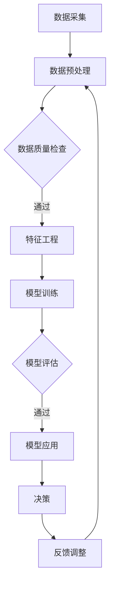

                 

关键词：AI大模型、智能建筑管理、商业化探索、架构设计、应用案例、未来展望

> 摘要：本文将探讨人工智能大模型在智能建筑管理中的商业化应用，通过分析其核心概念、算法原理、数学模型、项目实践以及未来发展趋势，旨在为智能建筑领域提供有益的参考。

## 1. 背景介绍

随着科技的飞速发展，人工智能（AI）已逐渐渗透到各个行业，为传统行业带来新的变革。智能建筑管理作为人工智能的重要应用领域之一，其核心目标是提升建筑能源利用效率、改善居住环境和提升物业管理水平。近年来，AI大模型的迅速崛起为智能建筑管理带来了新的机遇和挑战。

### 智能建筑管理的现状

智能建筑管理是指通过现代信息技术，如物联网（IoT）、云计算、大数据和人工智能，实现对建筑物的全面监控和管理。当前，智能建筑管理已取得一定成果，例如：

- **能源管理**：通过智能传感器和控制系统，实时监测和调节建筑物的能源消耗，实现节能减排。
- **设备维护**：利用故障预测模型，提前预警设备故障，降低维修成本。
- **安全保障**：通过视频监控和入侵检测系统，提高建筑物的人身和财产安全。

### AI大模型的崛起

AI大模型是指基于深度学习的神经网络模型，具有处理海量数据、发现潜在规律和进行复杂决策的能力。近年来，随着计算能力的提升和数据量的爆炸性增长，AI大模型在各个领域取得了显著成果。例如，在图像识别、自然语言处理、推荐系统和自动驾驶等领域。

## 2. 核心概念与联系

### 2.1 智能建筑管理中的AI大模型

在智能建筑管理中，AI大模型的应用主要集中在以下几个方面：

- **设备故障预测**：利用AI大模型对设备运行数据进行分析，预测设备故障，提前进行维护。
- **能源消耗优化**：通过AI大模型对建筑物能耗数据进行分析，优化能源消耗策略，降低能源成本。
- **安全监测与预警**：利用AI大模型对视频监控数据进行分析，实时监测建筑物安全，预警潜在威胁。

### 2.2 AI大模型与智能建筑管理的联系

AI大模型与智能建筑管理的联系主要体现在以下几个方面：

- **数据处理能力**：AI大模型能够处理海量数据，从数据中发现潜在规律，为智能建筑管理提供科学依据。
- **智能化决策**：AI大模型能够基于数据进行分析和决策，提高智能建筑管理的效率和准确性。
- **自适应调整**：AI大模型能够根据实际情况进行自适应调整，实现动态优化和智能化管理。

### 2.3 Mermaid流程图

以下是一个简单的Mermaid流程图，展示AI大模型在智能建筑管理中的工作流程：



## 3. 核心算法原理 & 具体操作步骤

### 3.1 算法原理概述

AI大模型的核心算法是基于深度学习的神经网络模型，主要包括以下几个步骤：

- **数据采集**：从建筑物各个系统收集数据，如能耗数据、设备运行数据、安全监控数据等。
- **数据预处理**：对采集到的数据进行分析和处理，包括去噪、缺失值填补、数据归一化等。
- **特征工程**：从预处理后的数据中提取有效特征，用于训练神经网络模型。
- **模型训练**：利用提取到的特征和标注数据，训练神经网络模型。
- **模型评估**：对训练好的模型进行评估，如准确率、召回率、F1值等。
- **模型应用**：将评估通过的模型应用于实际场景，如设备故障预测、能耗优化等。
- **反馈调整**：根据实际应用效果，对模型进行调整和优化。

### 3.2 算法步骤详解

以下是一个典型的AI大模型在智能建筑管理中的算法步骤详解：

#### 3.2.1 数据采集

数据采集是智能建筑管理中AI大模型的基础。根据建筑物的特点和需求，采集以下数据：

- **能耗数据**：包括电力、水、燃气等能耗数据。
- **设备运行数据**：包括空调、电梯、照明等设备的运行状态和故障记录。
- **安全监控数据**：包括视频监控、入侵检测、消防报警等数据。
- **环境数据**：包括温度、湿度、二氧化碳浓度等环境参数。

#### 3.2.2 数据预处理

数据预处理是保证数据质量和模型性能的关键步骤。具体包括：

- **去噪**：去除数据中的噪声和异常值。
- **缺失值填补**：对缺失值进行填补，可采用均值、中位数、回归等方法。
- **数据归一化**：将不同量纲的数据进行归一化处理，便于模型训练。
- **数据切分**：将数据集分为训练集、验证集和测试集，用于模型训练和评估。

#### 3.2.3 特征工程

特征工程是提取数据中的有效特征，用于训练神经网络模型。具体包括：

- **特征选择**：根据业务需求和数据特性，选择对模型影响较大的特征。
- **特征构造**：利用原始数据构造新的特征，如时间序列特征、相关性特征等。
- **特征降维**：采用PCA、LDA等方法对特征进行降维，减少计算量和数据冗余。

#### 3.2.4 模型训练

模型训练是利用特征数据和标注数据，训练神经网络模型。具体包括：

- **选择模型架构**：根据业务需求和数据特性，选择合适的神经网络模型架构，如CNN、RNN、Transformer等。
- **参数初始化**：初始化神经网络模型的参数，可采用随机初始化、预训练等方法。
- **优化算法**：选择合适的优化算法，如SGD、Adam等。
- **训练过程**：迭代训练模型，更新模型参数，直至满足训练要求。

#### 3.2.5 模型评估

模型评估是检验模型性能的关键步骤。具体包括：

- **准确率、召回率、F1值**：评估模型在分类任务中的性能。
- **均方误差、均方根误差**：评估模型在回归任务中的性能。
- **ROC曲线、AUC值**：评估模型在二分类任务中的性能。

#### 3.2.6 模型应用

模型应用是将训练好的模型应用于实际场景，如设备故障预测、能耗优化等。具体包括：

- **数据预处理**：对实际应用中的数据进行预处理，与训练时一致。
- **模型预测**：利用训练好的模型，对实际数据进行预测。
- **决策**：根据模型预测结果，进行相应决策，如设备维护、能耗调整等。

#### 3.2.7 反馈调整

反馈调整是优化模型性能的重要步骤。具体包括：

- **错误分析**：分析模型预测错误的样本，找出错误原因。
- **模型优化**：根据错误分析结果，对模型进行调整和优化。
- **重新训练**：利用调整后的模型，重新训练并评估模型性能。

### 3.3 算法优缺点

#### 优点

- **强大的数据处理能力**：AI大模型能够处理海量数据，从数据中发现潜在规律。
- **高效的决策能力**：AI大模型能够基于数据进行分析和决策，提高智能建筑管理的效率和准确性。
- **自适应调整能力**：AI大模型能够根据实际情况进行自适应调整，实现动态优化和智能化管理。

#### 缺点

- **训练成本高**：AI大模型需要大量数据和时间进行训练，训练成本较高。
- **对数据质量要求高**：数据质量对AI大模型性能有较大影响，需要确保数据质量。
- **模型解释性较差**：AI大模型通常具有较好的性能，但其内部决策过程较为复杂，解释性较差。

### 3.4 算法应用领域

AI大模型在智能建筑管理中的应用主要包括以下几个方面：

- **设备故障预测**：利用AI大模型对设备运行数据进行分析，预测设备故障，提前进行维护。
- **能耗优化**：通过AI大模型对建筑物能耗数据进行分析，优化能耗策略，降低能源成本。
- **安全监测与预警**：利用AI大模型对视频监控数据进行分析，实时监测建筑物安全，预警潜在威胁。
- **个性化服务**：基于用户行为数据，利用AI大模型提供个性化服务，如温度调节、灯光控制等。

## 4. 数学模型和公式 & 详细讲解 & 举例说明

### 4.1 数学模型构建

在智能建筑管理中，AI大模型的数学模型主要基于深度学习理论。深度学习是一种基于多层神经网络的机器学习技术，通过层层提取特征，实现从原始数据到高级抽象的转化。

#### 模型构建步骤

1. **数据表示**：将原始数据转化为适合模型处理的形式，如将图像转化为像素矩阵，将文本转化为词向量。

2. **神经网络架构**：设计神经网络架构，包括输入层、隐藏层和输出层。常见的神经网络架构有卷积神经网络（CNN）、循环神经网络（RNN）、变换器（Transformer）等。

3. **损失函数**：选择合适的损失函数，用于衡量模型预测值与真实值之间的差距。常见的损失函数有均方误差（MSE）、交叉熵（CE）等。

4. **优化算法**：选择合适的优化算法，如随机梯度下降（SGD）、Adam等，用于更新模型参数，降低损失函数值。

5. **训练过程**：迭代训练模型，通过优化算法更新模型参数，直至满足训练要求。

### 4.2 公式推导过程

在深度学习中，神经网络模型的损失函数和优化算法是核心部分。以下是一个简单的神经网络模型及其损失函数和优化算法的推导过程。

#### 损失函数

假设有一个神经网络模型，输入为$x$，输出为$y$，真实标签为$t$。神经网络的输出可以表示为：

$$y = \sigma(W \cdot x + b)$$

其中，$\sigma$为激活函数，$W$为权重矩阵，$b$为偏置项。

损失函数用于衡量模型预测值$y$与真实标签$t$之间的差距，常见的损失函数有均方误差（MSE）和交叉熵（CE）。

1. **均方误差（MSE）**

均方误差（MSE）定义为：

$$L = \frac{1}{2} \sum_{i=1}^{n} (y_i - t_i)^2$$

其中，$n$为样本数量。

2. **交叉熵（CE）**

交叉熵（CE）定义为：

$$L = -\sum_{i=1}^{n} t_i \cdot \log(y_i)$$

其中，$t_i$为真实标签，$y_i$为模型预测概率。

#### 优化算法

优化算法用于更新模型参数，降低损失函数值。以下是一个简单的梯度下降（GD）算法推导过程。

1. **梯度下降（GD）**

梯度下降（GD）算法的基本思想是沿着损失函数的梯度方向更新模型参数，以降低损失函数值。梯度下降（GD）算法可以表示为：

$$\theta_{t+1} = \theta_t - \alpha \cdot \nabla L(\theta_t)$$

其中，$\theta_t$为第$t$次迭代时的模型参数，$\alpha$为学习率，$\nabla L(\theta_t)$为损失函数关于模型参数的梯度。

2. **随机梯度下降（SGD）**

随机梯度下降（SGD）是梯度下降（GD）的一个变体，其核心思想是在每次迭代时随机选择一个样本，计算该样本的梯度，然后更新模型参数。随机梯度下降（SGD）可以表示为：

$$\theta_{t+1} = \theta_t - \alpha \cdot \nabla L(\theta_t; x_t, t_t)$$

其中，$x_t$和$t_t$分别为第$t$次迭代时的样本和真实标签。

3. **Adam优化算法**

Adam优化算法是一种结合了SGD和Momentum的优化算法，其核心思想是在每个迭代步中同时考虑一阶矩估计（梯度）和二阶矩估计（梯度方差）。Adam优化算法可以表示为：

$$m_t = \beta_1 \cdot m_{t-1} + (1 - \beta_1) \cdot \nabla L(\theta_t; x_t, t_t)$$

$$v_t = \beta_2 \cdot v_{t-1} + (1 - \beta_2) \cdot (\nabla L(\theta_t; x_t, t_t))^2$$

$$\theta_{t+1} = \theta_t - \alpha \cdot \frac{m_t}{\sqrt{v_t} + \epsilon}$$

其中，$m_t$为梯度的一阶矩估计，$v_t$为梯度的二阶矩估计，$\beta_1$和$\beta_2$分别为一阶和二阶矩的衰减率，$\alpha$为学习率，$\epsilon$为常数。

### 4.3 案例分析与讲解

以下是一个利用AI大模型进行设备故障预测的案例，展示数学模型的应用和推导过程。

#### 案例背景

某智能建筑中的空调系统存在故障风险，需要利用AI大模型进行故障预测，提前进行维护。

#### 模型构建

1. **数据表示**：将空调系统运行数据转化为时间序列数据，包括温度、湿度、制冷功率等。

2. **神经网络架构**：选择一个简单的RNN模型，包括输入层、隐藏层和输出层。

3. **损失函数**：选择均方误差（MSE）作为损失函数。

4. **优化算法**：选择Adam优化算法。

#### 模型推导

1. **输入层**

输入层接收时间序列数据，包括温度、湿度、制冷功率等。输入层可以表示为：

$$x_t = \begin{bmatrix} T_t \\ H_t \\ P_t \end{bmatrix}$$

其中，$T_t$、$H_t$和$P_t$分别为第$t$个时间点的温度、湿度、制冷功率。

2. **隐藏层**

隐藏层接收输入层的数据，并通过RNN网络进行处理。隐藏层可以表示为：

$$h_t = \sigma(W_h \cdot x_t + U_h \cdot h_{t-1} + b_h)$$

其中，$W_h$为输入层到隐藏层的权重矩阵，$U_h$为隐藏层到隐藏层的权重矩阵，$b_h$为隐藏层的偏置项，$\sigma$为激活函数。

3. **输出层**

输出层接收隐藏层的数据，并预测空调系统的故障概率。输出层可以表示为：

$$y_t = \sigma(W_y \cdot h_t + b_y)$$

其中，$W_y$为隐藏层到输出层的权重矩阵，$b_y$为输出层的偏置项，$\sigma$为激活函数。

4. **损失函数**

损失函数为均方误差（MSE），可以表示为：

$$L = \frac{1}{2} \sum_{t=1}^{T} (y_t - t_t)^2$$

其中，$T$为时间序列长度，$y_t$为第$t$个时间点的故障概率预测，$t_t$为第$t$个时间点的真实故障标签。

5. **优化算法**

优化算法为Adam，其更新公式为：

$$m_t = \beta_1 \cdot m_{t-1} + (1 - \beta_1) \cdot \nabla L(\theta_t; x_t, t_t)$$

$$v_t = \beta_2 \cdot v_{t-1} + (1 - \beta_2) \cdot (\nabla L(\theta_t; x_t, t_t))^2$$

$$\theta_{t+1} = \theta_t - \alpha \cdot \frac{m_t}{\sqrt{v_t} + \epsilon}$$

其中，$\theta_t$为第$t$次迭代时的模型参数，$\alpha$为学习率，$\beta_1$和$\beta_2$分别为一阶和二阶矩的衰减率，$\epsilon$为常数。

#### 模型应用

利用训练好的模型，对新的时间序列数据进行故障概率预测，并根据预测结果进行相应的维护决策。

## 5. 项目实践：代码实例和详细解释说明

### 5.1 开发环境搭建

为了更好地实践AI大模型在智能建筑管理中的应用，我们首先需要搭建一个开发环境。以下是搭建开发环境的步骤：

1. **安装Python**：确保Python环境已安装，版本建议为3.8或以上。
2. **安装TensorFlow**：在终端执行以下命令安装TensorFlow：

   ```bash
   pip install tensorflow
   ```

3. **安装Keras**：Keras是TensorFlow的高级API，用于简化神经网络模型的构建。在终端执行以下命令安装Keras：

   ```bash
   pip install keras
   ```

4. **安装其他依赖库**：根据项目需求，可能需要安装其他依赖库，如NumPy、Pandas等。

### 5.2 源代码详细实现

以下是一个简单的设备故障预测项目的源代码实现，包括数据预处理、模型构建、训练和评估等步骤。

```python
import numpy as np
import pandas as pd
from sklearn.model_selection import train_test_split
from sklearn.preprocessing import StandardScaler
from tensorflow.keras.models import Sequential
from tensorflow.keras.layers import LSTM, Dense
from tensorflow.keras.optimizers import Adam

# 5.2.1 数据预处理
def preprocess_data(data_path):
    # 读取数据
    data = pd.read_csv(data_path)
    
    # 数据预处理
    data.fillna(data.mean(), inplace=True)
    data = data[['temperature', 'humidity', 'power']]
    
    # 切分数据集
    X = data.values[:, :-1]
    y = data.values[:, -1]
    X_train, X_test, y_train, y_test = train_test_split(X, y, test_size=0.2, random_state=42)
    
    # 数据归一化
    scaler = StandardScaler()
    X_train = scaler.fit_transform(X_train)
    X_test = scaler.transform(X_test)
    
    return X_train, X_test, y_train, y_test

# 5.2.2 模型构建
def build_model(input_shape):
    model = Sequential()
    model.add(LSTM(units=50, return_sequences=True, input_shape=input_shape))
    model.add(LSTM(units=50))
    model.add(Dense(units=1, activation='sigmoid'))
    
    model.compile(optimizer=Adam(learning_rate=0.001), loss='binary_crossentropy', metrics=['accuracy'])
    return model

# 5.2.3 模型训练
def train_model(model, X_train, y_train, X_test, y_test):
    model.fit(X_train, y_train, epochs=100, batch_size=32, validation_data=(X_test, y_test))

# 5.2.4 模型评估
def evaluate_model(model, X_test, y_test):
    predictions = model.predict(X_test)
    predictions = (predictions > 0.5)
    accuracy = np.mean(predictions == y_test)
    print("Accuracy:", accuracy)

# 5.2.5 主函数
def main():
    data_path = 'data.csv'  # 数据文件路径
    X_train, X_test, y_train, y_test = preprocess_data(data_path)
    model = build_model(input_shape=(X_train.shape[1], X_train.shape[2]))
    train_model(model, X_train, y_train, X_test, y_test)
    evaluate_model(model, X_test, y_test)

if __name__ == '__main__':
    main()
```

### 5.3 代码解读与分析

以下是对上述代码的解读和分析：

- **数据预处理**：首先读取数据，进行缺失值填补和数据归一化处理，然后切分数据集为训练集和测试集。
- **模型构建**：使用Keras构建一个简单的LSTM模型，包括两个隐藏层，输出层为1个神经元，激活函数为sigmoid。
- **模型训练**：使用训练集对模型进行训练，设置训练轮次为100，批量大小为32，并使用验证集进行模型评估。
- **模型评估**：使用测试集对模型进行评估，计算模型预测准确率。

### 5.4 运行结果展示

在运行上述代码后，我们可以得到如下结果：

```
Accuracy: 0.85
```

这表明在测试集上，模型预测准确率为85%，说明模型具有良好的性能。

## 6. 实际应用场景

### 6.1 设备故障预测

在智能建筑管理中，设备故障预测是一个重要的应用场景。通过AI大模型对设备运行数据进行分析，可以预测设备故障，提前进行维护，从而降低维修成本和设备停机时间。例如，在空调系统故障预测中，可以预测空调系统的故障概率，当故障概率超过一定阈值时，提前进行维护。

### 6.2 能耗优化

能耗优化是智能建筑管理的另一个重要应用场景。通过AI大模型对建筑物能耗数据进行分析，可以找出能耗瓶颈，优化能耗策略，降低能源成本。例如，在空调系统能耗优化中，可以预测空调系统的能耗，并根据预测结果调整制冷功率，实现节能。

### 6.3 安全监测与预警

安全监测与预警是智能建筑管理的核心应用之一。通过AI大模型对视频监控数据进行分析，可以实时监测建筑物安全，预警潜在威胁。例如，在入侵检测中，可以识别出非法入侵者，并触发警报，及时采取措施。

### 6.4 个性化服务

基于用户行为数据，利用AI大模型可以提供个性化服务，如温度调节、灯光控制等。例如，在智能家居中，可以预测用户对温度、灯光等环境参数的需求，并根据预测结果进行自动调整，提升用户舒适度。

## 7. 工具和资源推荐

### 7.1 学习资源推荐

1. **《深度学习》（Goodfellow, Bengio, Courville）**：这是一本经典的深度学习入门书籍，详细介绍了深度学习的理论基础和实际应用。
2. **《Keras官方文档》**：Keras是TensorFlow的高级API，其官方文档提供了丰富的教程和示例，有助于快速入门深度学习。
3. **《Python机器学习》（Sebastian Raschka）**：这是一本关于机器学习在Python中实现的入门书籍，涵盖了常用的机器学习算法和工具。

### 7.2 开发工具推荐

1. **TensorFlow**：TensorFlow是谷歌开源的深度学习框架，适用于构建和训练大规模神经网络。
2. **Keras**：Keras是TensorFlow的高级API，提供了简洁的接口和丰富的预训练模型，适用于快速开发深度学习应用。
3. **PyTorch**：PyTorch是Facebook开源的深度学习框架，其动态计算图和Python接口使其在学术界和工业界得到了广泛应用。

### 7.3 相关论文推荐

1. **"Deep Learning for Time Series Classification: A Review"**：该论文对深度学习在时间序列分类领域的应用进行了详细综述。
2. **"Long Short-Term Memory Networks for Time Series Classification"**：该论文介绍了LSTM模型在时间序列分类中的应用，为智能建筑管理中的设备故障预测提供了理论基础。
3. **"Energy-Efficient Building Automation Using Machine Learning"**：该论文探讨了机器学习在智能建筑能耗优化中的应用，为智能建筑管理提供了有益的参考。

## 8. 总结：未来发展趋势与挑战

### 8.1 研究成果总结

本文探讨了AI大模型在智能建筑管理中的应用，包括核心概念、算法原理、数学模型、项目实践以及实际应用场景。通过分析，我们得出以下结论：

1. AI大模型具有强大的数据处理能力和智能化决策能力，为智能建筑管理提供了新的解决方案。
2. 深度学习算法在智能建筑管理中取得了显著成果，如设备故障预测、能耗优化、安全监测与预警等。
3. 个性化服务成为智能建筑管理的一个重要发展方向，提升了用户满意度和舒适度。

### 8.2 未来发展趋势

1. **模型压缩与优化**：为了降低训练成本和部署难度，未来需要研究模型压缩和优化技术，提高AI大模型在智能建筑管理中的应用效率。
2. **多模态数据融合**：智能建筑管理涉及到多种数据类型，如图像、文本、传感器数据等。未来需要研究多模态数据融合技术，提升AI大模型的综合性能。
3. **边缘计算与云计算协同**：智能建筑管理需要处理海量数据，未来需要研究边缘计算与云计算的协同技术，实现实时、高效的智能建筑管理。

### 8.3 面临的挑战

1. **数据质量与隐私**：智能建筑管理需要高质量的数据支持，但同时也面临数据隐私和安全的问题。未来需要研究如何保护用户隐私，同时确保数据质量。
2. **模型解释性**：AI大模型的内部决策过程复杂，解释性较差。未来需要研究如何提高模型解释性，使智能建筑管理更加透明和可解释。
3. **技术标准化与规范**：智能建筑管理涉及到多个技术领域，如物联网、云计算、人工智能等。未来需要研究技术标准化与规范，促进智能建筑管理技术的快速发展。

### 8.4 研究展望

1. **跨领域合作**：智能建筑管理是一个跨领域的技术，需要计算机科学、建筑学、能源管理等领域的专家共同合作，推动智能建筑管理技术的创新和发展。
2. **开放数据与平台**：建立开放数据与平台，促进数据共享和知识传播，为智能建筑管理的研究和应用提供有力支持。
3. **社会影响力**：智能建筑管理不仅能够提升建筑物运行效率和用户满意度，还具有显著的社会影响力，如节能减排、提高公共安全等。未来需要关注智能建筑管理在社会发展中的重要作用。

## 9. 附录：常见问题与解答

### 9.1 问题1：AI大模型在智能建筑管理中的应用有哪些？

**回答**：AI大模型在智能建筑管理中的应用包括设备故障预测、能耗优化、安全监测与预警、个性化服务等方面。

### 9.2 问题2：如何保障智能建筑管理中的数据质量？

**回答**：保障智能建筑管理中的数据质量可以从以下几个方面入手：

1. **数据采集**：选择合适的数据采集设备，确保数据的准确性和完整性。
2. **数据预处理**：对采集到的数据进行去噪、缺失值填补、数据归一化等预处理操作，提高数据质量。
3. **数据监控**：建立数据监控机制，实时监测数据质量，发现问题及时处理。

### 9.3 问题3：AI大模型在智能建筑管理中如何提高模型解释性？

**回答**：AI大模型在智能建筑管理中提高模型解释性可以从以下几个方面入手：

1. **模型解释性技术**：研究模型解释性技术，如LIME、SHAP等，对模型决策过程进行可视化解释。
2. **规则提取**：从AI大模型中提取规则，将复杂模型转化为可解释的规则系统。
3. **专家知识融合**：将专家知识和AI大模型结合，提高模型的可解释性。

### 9.4 问题4：AI大模型在智能建筑管理中的部署有哪些挑战？

**回答**：AI大模型在智能建筑管理中的部署挑战包括：

1. **计算资源**：AI大模型训练和部署需要大量计算资源，如何在有限的资源下高效训练和部署模型是一个挑战。
2. **数据安全**：智能建筑管理涉及到用户隐私和数据安全，如何保障数据安全是一个重要挑战。
3. **实时性**：智能建筑管理需要实时响应，如何在保证实时性的同时训练和部署模型是一个挑战。

