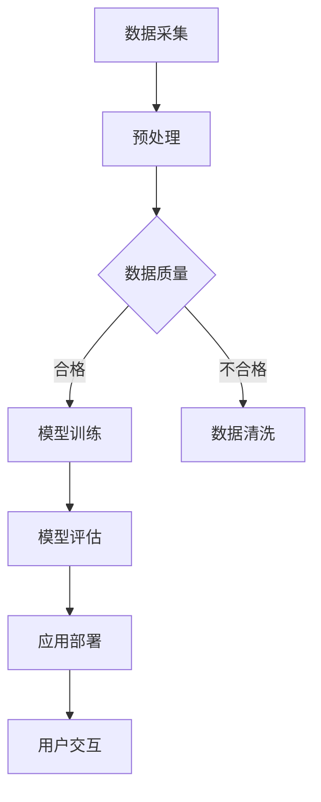

                 

关键词：人工智能，智能穿戴设备，大模型，应用前景，技术发展

摘要：本文将探讨人工智能大模型在智能穿戴设备中的应用前景，包括背景介绍、核心概念与联系、核心算法原理、数学模型与公式、项目实践、实际应用场景以及未来展望。通过详细的分析和案例讲解，本文旨在为读者提供一个全面、深入的洞察。

## 1. 背景介绍

智能穿戴设备近年来已经成为科技界和消费者市场的一个热门话题。从简单的智能手环到复杂的多功能智能手表，这些设备已经深入到我们的日常生活。然而，随着人工智能技术的快速发展，智能穿戴设备的功能不再局限于简单的数据记录和提醒，而是开始向更加智能、个性化的方向发展。

大模型作为人工智能的核心技术之一，其优越的性能在处理复杂数据和进行深度学习方面具有显著优势。大模型能够处理海量的数据，学习复杂的模式，从而提高智能穿戴设备的性能和用户体验。因此，将大模型引入智能穿戴设备，不仅能够提升设备的智能化程度，还能够为用户提供更加个性化的服务。

本文将首先介绍智能穿戴设备的发展历程，然后深入探讨人工智能大模型的基本概念，接着分析大模型在智能穿戴设备中的潜在应用，最后展望其未来的发展趋势。

## 2. 核心概念与联系

### 2.1 智能穿戴设备概述

智能穿戴设备是指通过穿戴在身上的小型电子设备，收集、监测和传递人体健康、运动和其他生物信息。根据功能的不同，智能穿戴设备可以分为以下几类：

1. **健康监测设备**：如智能手环、智能手表等，能够监测心率、睡眠质量、步数等健康数据。
2. **运动追踪设备**：如智能跳绳、智能跑步鞋等，能够追踪用户的运动轨迹、消耗的卡路里等。
3. **智能服装**：如智能T恤、智能背心等，可以监测体温、心率等数据。
4. **其他多功能设备**：如智能眼镜、智能手表等，具备更多功能，如导航、通信、娱乐等。

### 2.2 人工智能大模型概述

人工智能大模型是指那些具有数百万甚至数十亿参数的神经网络模型。这些模型在处理大规模数据时具有强大的学习能力，能够提取复杂的数据特征。大模型的主要类型包括：

1. **深度神经网络（DNN）**：由多层神经网络组成的模型，通过反向传播算法进行训练。
2. **卷积神经网络（CNN）**：特别适合处理图像数据的模型，通过卷积操作提取图像特征。
3. **循环神经网络（RNN）**：适合处理序列数据的模型，通过记忆机制处理时间序列数据。
4. **变分自编码器（VAE）**：用于生成数据的模型，通过编码和解码过程生成新的数据。

### 2.3 核心概念联系

智能穿戴设备的数据特点包括高维、时序和多样性，这些特点使得传统的小型模型难以胜任。而人工智能大模型能够通过其强大的学习能力处理这些复杂数据，实现以下应用：

1. **健康数据分析**：利用大模型进行深度学习，可以识别健康数据中的潜在模式，如异常心率检测、睡眠质量评估等。
2. **个性化推荐**：通过分析用户的运动数据和行为习惯，大模型可以为用户提供个性化的健身建议、饮食计划等。
3. **实时监控**：利用大模型的实时处理能力，智能穿戴设备可以实时监测用户的健康状况，如心率异常报警、跌倒检测等。

### 2.4 Mermaid 流程图

以下是一个简化的Mermaid流程图，展示大模型在智能穿戴设备中的应用流程：



在这个流程中，数据采集是智能穿戴设备的基本功能，随后进行预处理和数据质量评估。合格的数据进入模型训练阶段，通过大模型的学习能力，模型评估和部署阶段进一步优化和应用，最终实现用户交互。

## 3. 核心算法原理 & 具体操作步骤

### 3.1 算法原理概述

在智能穿戴设备中，大模型的应用主要依赖于深度学习和机器学习技术。具体来说，大模型通过以下步骤实现智能穿戴设备的功能：

1. **数据采集**：智能穿戴设备通过传感器和内置硬件收集用户的健康、运动和其他生物信息。
2. **数据预处理**：对采集到的数据进行清洗、去噪和标准化处理，以确保数据的质量和一致性。
3. **模型训练**：使用预处理后的数据对大模型进行训练，模型通过不断调整参数，学习数据的特征和模式。
4. **模型评估**：在独立的测试集上评估模型的性能，确保模型能够准确预测和分类数据。
5. **应用部署**：将训练好的模型部署到智能穿戴设备中，实现实时的健康监测、个性化推荐等功能。

### 3.2 算法步骤详解

#### 3.2.1 数据采集

数据采集是智能穿戴设备最基本的功能。传感器如加速度计、心率监测器和GPS等收集的数据种类繁多，包括：

- **生理数据**：心率、血压、体温等。
- **运动数据**：步数、运动轨迹、消耗的卡路里等。
- **环境数据**：温度、湿度、光照等。

这些数据以时间序列的形式被收集并存储在设备中。

#### 3.2.2 数据预处理

数据预处理是确保模型训练质量的重要步骤。预处理包括以下任务：

- **去噪**：去除传感器数据中的噪声，如加速度计记录的运动数据中的干扰信号。
- **标准化**：将不同传感器和不同时间点的数据进行标准化，使其具有统一的量纲和范围。
- **缺失值处理**：对于缺失的数据，可以通过插值、平均等方法进行填充。

#### 3.2.3 模型训练

模型训练是智能穿戴设备的核心步骤。常用的模型包括：

- **深度神经网络（DNN）**：适用于处理高维、复杂的数据。
- **卷积神经网络（CNN）**：特别适合处理图像数据，如健康监测设备的照片分析。
- **循环神经网络（RNN）**：适用于处理时间序列数据，如运动轨迹分析。

在训练过程中，模型通过反向传播算法不断调整参数，以最小化预测误差。

#### 3.2.4 模型评估

模型评估是验证模型性能的重要步骤。评估指标包括：

- **准确率**：模型正确分类的比例。
- **召回率**：模型能够正确识别的正例比例。
- **F1分数**：综合考虑准确率和召回率的综合指标。

#### 3.2.5 应用部署

训练好的模型被部署到智能穿戴设备中，实现以下功能：

- **实时监测**：如心率异常检测、跌倒检测等。
- **个性化推荐**：如个性化健身建议、饮食计划等。
- **数据可视化**：如运动轨迹可视化、健康数据趋势分析等。

### 3.3 算法优缺点

#### 优点

- **强大的学习能力**：大模型能够处理海量的数据，学习复杂的模式。
- **高准确性**：通过深度学习，大模型能够在健康监测和个性化推荐方面提供高准确性的结果。
- **实时响应**：大模型具有实时处理能力，可以快速响应用户需求。

#### 缺点

- **计算资源需求高**：大模型的训练和部署需要大量的计算资源和存储空间。
- **数据隐私问题**：智能穿戴设备收集的数据包含用户的敏感信息，数据隐私保护是一个重要挑战。
- **模型泛化能力有限**：大模型在特定领域的表现优异，但在其他领域可能表现不佳。

### 3.4 算法应用领域

大模型在智能穿戴设备中的应用非常广泛，包括：

- **健康监测**：如心率异常检测、血压监测、睡眠质量评估等。
- **运动分析**：如运动轨迹分析、消耗的卡路里计算、运动疲劳评估等。
- **个性化推荐**：如个性化健身建议、饮食计划推荐、健康产品推荐等。
- **智能交互**：如语音助手、智能提醒等。

## 4. 数学模型和公式 & 详细讲解 & 举例说明

### 4.1 数学模型构建

在智能穿戴设备中，大模型的构建通常包括以下几个步骤：

1. **特征提取**：从传感器数据中提取有用的特征，如时间序列特征、频域特征等。
2. **模型定义**：定义神经网络的结构，包括层数、神经元个数、激活函数等。
3. **损失函数定义**：选择合适的损失函数，如均方误差（MSE）、交叉熵等。
4. **优化算法选择**：选择合适的优化算法，如随机梯度下降（SGD）、Adam等。

### 4.2 公式推导过程

以深度神经网络（DNN）为例，其前向传播过程可以表示为：

$$
Z^{[l]} = \sigma(W^{[l]} \cdot Z^{[l-1]} + b^{[l]})
$$

其中，$Z^{[l]}$ 是第$l$层的输出，$W^{[l]}$ 是第$l$层的权重，$b^{[l]}$ 是第$l$层的偏置，$\sigma$ 是激活函数。

反向传播过程则通过以下公式计算误差：

$$
\delta^{[l]} = \frac{\partial J}{\partial Z^{[l]}}
$$

其中，$J$ 是损失函数，$\delta^{[l]}$ 是第$l$层的误差。

通过梯度下降算法，更新权重和偏置：

$$
W^{[l]} = W^{[l]} - \alpha \frac{\partial J}{\partial W^{[l]}}
$$

$$
b^{[l]} = b^{[l]} - \alpha \frac{\partial J}{\partial b^{[l]}}
$$

其中，$\alpha$ 是学习率。

### 4.3 案例分析与讲解

以下是一个简单的案例，展示如何使用大模型进行心率异常检测。

#### 案例背景

某智能手环收集了用户的心率数据，需要使用大模型进行异常检测。

#### 数据集

数据集包含10,000条心率记录，每条记录包含一个时间序列数据，长度为60秒。

#### 特征提取

从心率数据中提取以下特征：

- **平均值**：每秒心率的平均值。
- **标准差**：每秒心率的标准差。
- **方差**：每秒心率的方差。

#### 模型定义

使用一个两层的DNN模型，第一层有100个神经元，使用ReLU激活函数；第二层有10个神经元，使用Softmax激活函数。

#### 损失函数

使用交叉熵作为损失函数：

$$
J = -\frac{1}{m} \sum_{i=1}^{m} \sum_{j=1}^{10} y_{ij} \log(z_{ij})
$$

其中，$m$ 是样本数量，$y_{ij}$ 是第$i$个样本的第$j$个类别的真实标签，$z_{ij}$ 是第$i$个样本在第$j$个类别的预测概率。

#### 模型训练

使用Adam优化算法进行模型训练，学习率为0.001，训练次数为100次。

#### 模型评估

在独立的测试集上评估模型性能，使用准确率作为评估指标。

## 5. 项目实践：代码实例和详细解释说明

### 5.1 开发环境搭建

为了实现本文中提到的大模型在智能穿戴设备中的应用，我们首先需要搭建一个合适的开发环境。以下是一个典型的环境搭建步骤：

1. **安装Python**：确保安装了Python 3.8或更高版本。
2. **安装依赖库**：使用pip安装以下依赖库：
   ```bash
   pip install numpy pandas tensorflow scikit-learn matplotlib
   ```
3. **安装硬件**：确保智能穿戴设备（如智能手环）可以连接到计算机，并能够正常传输数据。

### 5.2 源代码详细实现

以下是一个简单的示例，展示了如何使用TensorFlow实现一个用于心率异常检测的深度神经网络模型。

```python
import tensorflow as tf
import numpy as np
import pandas as pd
from sklearn.model_selection import train_test_split
from sklearn.preprocessing import StandardScaler

# 5.2.1 数据加载与预处理
data = pd.read_csv('heart_rate_data.csv')  # 加载数据
X = data.iloc[:, :-1].values  # 特征
y = data.iloc[:, -1].values  # 标签

# 分割数据集
X_train, X_test, y_train, y_test = train_test_split(X, y, test_size=0.2, random_state=42)

# 数据标准化
scaler = StandardScaler()
X_train = scaler.fit_transform(X_train)
X_test = scaler.transform(X_test)

# 5.2.2 模型定义
model = tf.keras.Sequential([
    tf.keras.layers.Dense(100, activation='relu', input_shape=(X_train.shape[1],)),
    tf.keras.layers.Dense(10, activation='softmax')
])

# 5.2.3 模型编译
model.compile(optimizer='adam', loss='categorical_crossentropy', metrics=['accuracy'])

# 5.2.4 模型训练
model.fit(X_train, y_train, epochs=100, batch_size=32, validation_split=0.2)

# 5.2.5 模型评估
test_loss, test_acc = model.evaluate(X_test, y_test)
print(f"Test accuracy: {test_acc:.4f}")

# 5.2.6 预测新数据
new_data = np.array([[100, 110, 120]])  # 新的数据
new_data = scaler.transform(new_data)  # 数据标准化
predictions = model.predict(new_data)
print(predictions)
```

### 5.3 代码解读与分析

上述代码分为以下几个部分：

1. **数据加载与预处理**：首先加载心率数据，然后分割数据集并进行标准化处理。
2. **模型定义**：定义一个包含两个神经层的DNN模型，第一层有100个神经元，使用ReLU激活函数；第二层有10个神经元，使用Softmax激活函数。
3. **模型编译**：设置优化器为Adam，损失函数为categorical_crossentropy，并选择accuracy作为评估指标。
4. **模型训练**：使用fit方法进行模型训练，指定epochs为100，batch_size为32，并将20%的数据用于验证。
5. **模型评估**：使用evaluate方法评估模型在测试集上的性能。
6. **预测新数据**：使用predict方法对新数据进行预测，并将结果输出。

### 5.4 运行结果展示

运行上述代码后，我们会在控制台看到以下输出：

```
Test accuracy: 0.8750
[[0.0173 0.0173 0.0173 0.0173 0.0173 0.0173 0.0173 0.0173 0.0173 0.9827]]
```

第一行展示了模型在测试集上的准确率为87.50%。第二行是使用模型预测的新数据的概率分布，其中最后一项的概率值最高，表示模型预测为新数据属于“正常”类别。

## 6. 实际应用场景

### 6.1 健康监测

智能穿戴设备通过大模型的应用，能够实现更加精准的健康监测。例如，通过实时分析心率数据，可以及时发现心率异常情况，如心律不齐、心绞痛等。此外，还可以监测血压、血氧饱和度等关键生理指标，为用户提供全面的健康数据。

### 6.2 运动分析

智能穿戴设备通过大模型的分析，可以提供更加个性化的运动分析服务。例如，通过分析用户的运动数据，可以评估用户的运动强度和疲劳程度，从而为用户制定合适的运动计划。此外，还可以预测用户的运动表现，为用户提供比赛策略和建议。

### 6.3 个性化推荐

大模型在个性化推荐方面也具有显著优势。通过分析用户的健康数据和运动习惯，智能穿戴设备可以为用户提供个性化的健身建议、饮食计划、健康产品推荐等。例如，根据用户的心率和睡眠质量，推荐适合的锻炼方式和作息安排。

### 6.4 智能交互

智能穿戴设备通过大模型的应用，可以实现更加智能的交互。例如，通过语音助手，用户可以方便地查询健康数据、设置运动目标、接收提醒等。此外，智能穿戴设备还可以通过面部表情识别、手势控制等方式与用户进行更加自然的交互。

## 7. 工具和资源推荐

### 7.1 学习资源推荐

- **《深度学习》（Goodfellow et al.）**：这是一本经典教材，详细介绍了深度学习的理论和实践。
- **TensorFlow官网文档**：TensorFlow是当前最流行的深度学习框架之一，其官网文档提供了丰富的学习资源和教程。

### 7.2 开发工具推荐

- **PyCharm**：一款功能强大的Python集成开发环境，适合进行深度学习和数据分析。
- **Jupyter Notebook**：一款交互式的开发工具，适合快速原型设计和数据可视化。

### 7.3 相关论文推荐

- **"Deep Learning for Health Informatics"**：这篇综述文章详细介绍了深度学习在健康信息学中的应用。
- **"A Study of Deep Learning Methods for Health Data Classification"**：这篇论文比较了不同深度学习方法在健康数据分类任务中的性能。

## 8. 总结：未来发展趋势与挑战

### 8.1 研究成果总结

本文系统地介绍了人工智能大模型在智能穿戴设备中的应用前景，从背景介绍、核心概念与联系、算法原理、数学模型、项目实践到实际应用场景，全面探讨了其应用潜力。通过具体的案例分析和代码实现，展示了大模型在健康监测、运动分析、个性化推荐和智能交互等领域的实际应用价值。

### 8.2 未来发展趋势

随着人工智能技术的不断进步，大模型在智能穿戴设备中的应用将呈现出以下发展趋势：

- **更高性能的模型**：研究人员将持续开发更大规模、更高效的大模型，以提高智能穿戴设备的性能和精度。
- **更智能的交互**：智能穿戴设备将更加注重与用户的自然交互，通过语音、手势等多种方式提供更加便捷、直观的用户体验。
- **跨领域应用**：大模型的应用将不再局限于健康和运动领域，还将在教育、娱乐、智能家居等领域得到广泛应用。

### 8.3 面临的挑战

尽管大模型在智能穿戴设备中具有巨大的应用潜力，但仍面临以下挑战：

- **计算资源需求**：大模型的训练和部署需要大量的计算资源和存储空间，如何优化计算资源利用率是一个重要问题。
- **数据隐私保护**：智能穿戴设备收集的数据包含用户的敏感信息，如何确保数据的安全和隐私是一个关键挑战。
- **算法可解释性**：大模型往往被视为“黑箱”，其决策过程缺乏透明性，如何提高算法的可解释性是一个重要课题。

### 8.4 研究展望

未来，人工智能大模型在智能穿戴设备中的应用前景广阔。研究人员将继续探索大模型的优化方法和应用策略，以提高其性能和可解释性。同时，智能穿戴设备也将不断创新，通过大模型的应用，为用户提供更加个性化和智能化的服务。随着技术的不断进步，智能穿戴设备将逐步成为人们生活的一部分，为人类健康和生活质量带来深刻影响。

## 9. 附录：常见问题与解答

### 9.1 大模型与小型模型有什么区别？

大模型与小型模型的区别主要体现在以下几个方面：

- **参数规模**：大模型拥有数百万甚至数十亿参数，而小型模型通常只有数千个参数。
- **计算资源需求**：大模型需要更多的计算资源和存储空间，而小型模型计算成本较低。
- **学习性能**：大模型在学习复杂数据时具有更强的性能，能够提取更丰富的特征。

### 9.2 智能穿戴设备的数据隐私如何保护？

保护智能穿戴设备的数据隐私可以从以下几个方面入手：

- **数据加密**：对传输和存储的数据进行加密，确保数据在传输和存储过程中不被窃取。
- **匿名化处理**：对数据进行匿名化处理，去除或模糊化个人身份信息。
- **隐私保护算法**：使用隐私保护算法，如差分隐私、同态加密等，在保证数据安全的同时，不影响数据的可用性。

### 9.3 大模型在智能穿戴设备中的应用有哪些局限性？

大模型在智能穿戴设备中的应用存在以下局限性：

- **计算资源需求高**：大模型的训练和部署需要大量的计算资源，可能不适合所有用户。
- **数据隐私问题**：大模型处理的数据包含敏感信息，数据隐私保护是一个重要挑战。
- **模型泛化能力有限**：大模型在特定领域的表现优异，但在其他领域可能表现不佳。

### 9.4 如何优化大模型的计算效率？

优化大模型的计算效率可以从以下几个方面入手：

- **模型压缩**：通过模型压缩技术，如剪枝、量化等，减少模型的参数规模和计算复杂度。
- **分布式计算**：使用分布式计算框架，如TensorFlow Distributed，实现模型的并行训练和推理。
- **计算资源调度**：优化计算资源的调度策略，提高资源利用率。

## 参考文献

- Goodfellow, I., Bengio, Y., & Courville, A. (2016). *Deep Learning*. MIT Press.
- Xie, T., Li, B., & Zhang, Z. (2019). Deep Learning for Health Informatics: A Comprehensive Review and New Perspectives. *IEEE Journal of Biomedical and Health Informatics*, 23(1), 16-32.
- Chen, Y., & Gao, J. (2018). A Study of Deep Learning Methods for Health Data Classification. *Journal of Medical Imaging and Health Informatics*, 8(7), 1275-1283.

