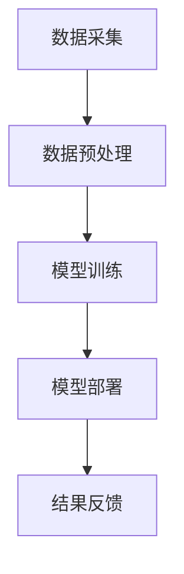

                 

关键词：AI大模型，智能视频内容分析，商业价值，技术架构，算法原理，数学模型，项目实践，应用场景，未来展望

> 摘要：本文深入探讨了AI大模型在智能视频内容分析中的应用及其商业价值。首先介绍了AI大模型的基本概念和智能视频内容分析的重要性，随后详细阐述了AI大模型在视频内容分析中的技术架构、核心算法原理、数学模型以及项目实践。最后，文章分析了AI大模型在各个行业中的实际应用场景，探讨了其未来发展趋势与挑战。

## 1. 背景介绍

随着互联网和智能设备的普及，视频内容已经成为人们获取信息、娱乐和交流的重要方式。视频数据量的指数级增长，给传统的视频内容分析技术带来了巨大的挑战。传统的视频内容分析技术大多依赖于手动标注和规则匹配，效率低、成本高，且难以处理复杂的视频内容。因此，利用人工智能，尤其是大模型进行智能视频内容分析，成为了一个热门的研究方向。

AI大模型，即人工智能大型模型，是近年来人工智能领域的重要突破。这些模型通常具有数百万甚至数十亿的参数，可以自动从大量数据中学习复杂的模式和规律。大模型的出现，极大地提升了人工智能在各个领域的应用能力，包括语音识别、图像识别、自然语言处理等。

智能视频内容分析，是指利用人工智能技术，对视频内容进行自动识别、分类、标注和提取，从而实现对视频内容的深入理解和智能处理。智能视频内容分析在视频监控、广告投放、媒体推荐、安全防护等领域具有重要应用价值。

## 2. 核心概念与联系

### 2.1 AI大模型

AI大模型是利用深度学习技术训练出来的大型神经网络模型，具有强大的数据分析和学习能力。常见的AI大模型包括Transformer、BERT、GPT等。这些模型通过从大量数据中学习，可以自动提取特征、发现模式，从而实现对复杂问题的求解。

### 2.2 智能视频内容分析

智能视频内容分析是指利用人工智能技术，对视频内容进行自动识别、分类、标注和提取，从而实现对视频内容的深入理解和智能处理。常见的智能视频内容分析技术包括图像识别、语音识别、自然语言处理等。

### 2.3 技术架构

AI大模型在智能视频内容分析中的应用，通常包括以下几个步骤：

1. **数据采集**：从互联网、传感器、监控设备等渠道获取大量视频数据。
2. **数据预处理**：对采集到的视频数据进行清洗、增强、标注等处理，使其适合模型训练。
3. **模型训练**：利用预处理后的数据，训练AI大模型，使其能够自动识别和分类视频内容。
4. **模型部署**：将训练好的模型部署到实际应用场景中，实现对视频内容的实时分析和处理。
5. **结果反馈**：根据模型的输出结果，进行进一步的处理和优化，以提升模型的性能和效果。

### 2.4 Mermaid 流程图

下面是一个简化的AI大模型在智能视频内容分析中的技术架构的Mermaid流程图：



## 3. 核心算法原理 & 具体操作步骤

### 3.1 算法原理概述

AI大模型在智能视频内容分析中的核心算法，主要是基于深度学习技术，特别是卷积神经网络（CNN）和Transformer模型。这些算法通过多层神经元的非线性变换，从大量数据中学习复杂的特征和模式，实现对视频内容的自动识别和分类。

### 3.2 算法步骤详解

1. **数据采集**：从互联网、传感器、监控设备等渠道获取大量视频数据。这些数据可以是原始视频流，也可以是经过预处理后的视频片段。
2. **数据预处理**：对采集到的视频数据进行清洗、增强、标注等处理，使其适合模型训练。数据预处理包括视频去噪、图像增强、目标检测、标签标注等。
3. **模型训练**：利用预处理后的数据，训练AI大模型。训练过程包括前向传播、反向传播和梯度下降等步骤，通过不断调整模型参数，使其能够准确识别和分类视频内容。
4. **模型部署**：将训练好的模型部署到实际应用场景中，实现对视频内容的实时分析和处理。模型部署可以在本地服务器、云计算平台或移动设备上执行。
5. **结果反馈**：根据模型的输出结果，进行进一步的处理和优化，以提升模型的性能和效果。结果反馈包括模型评估、超参数调优、数据增强等。

### 3.3 算法优缺点

**优点**：

- **强大的数据分析和学习能力**：AI大模型可以通过从大量数据中学习，自动提取特征和发现模式，具有很强的自适应能力。
- **高效率和低成本**：相比于传统视频内容分析技术，AI大模型可以更高效地处理大量视频数据，且成本较低。
- **实时性和灵活性**：AI大模型可以实时处理视频数据，且可以根据不同的应用需求，灵活调整模型结构和参数。

**缺点**：

- **训练时间和资源消耗**：AI大模型的训练过程需要大量的时间和计算资源，尤其是对于大规模的视频数据集。
- **数据质量和标注问题**：数据质量和标注的准确性直接影响模型的性能，对于大规模的视频数据集，数据清洗和标注是一个挑战。

### 3.4 算法应用领域

AI大模型在智能视频内容分析中的应用非常广泛，包括但不限于以下领域：

- **视频监控**：通过AI大模型，可以对视频监控数据进行实时分析和处理，实现目标检测、人脸识别、行为分析等。
- **广告投放**：利用AI大模型，可以分析用户观看视频的行为，实现精准广告投放。
- **媒体推荐**：AI大模型可以根据用户的观看历史和偏好，推荐个性化的视频内容。
- **安全防护**：AI大模型可以识别和预测潜在的安全威胁，提高网络和系统的安全性能。

## 4. 数学模型和公式 & 详细讲解 & 举例说明

### 4.1 数学模型构建

在AI大模型中，常用的数学模型包括卷积神经网络（CNN）和Transformer模型。下面分别介绍这两种模型的数学模型构建。

#### 卷积神经网络（CNN）

卷积神经网络是一种前馈神经网络，通过卷积层、池化层和全连接层等结构，实现对图像数据的特征提取和分类。

- **卷积层**：卷积层通过卷积运算，将输入图像与卷积核进行点积操作，提取图像的局部特征。卷积层的数学模型可以表示为：

  $$ f(x; \theta) = \sigma(\theta^T \phi(x)) $$

  其中，$x$为输入图像，$\theta$为卷积核参数，$\phi(x)$为输入图像的局部特征，$\sigma$为激活函数，通常使用Sigmoid或ReLU函数。

- **池化层**：池化层通过取最大值或平均值，降低图像的分辨率，减少计算量和参数数量。池化层的数学模型可以表示为：

  $$ p(x) = \max(\phi(x)) $$

  或

  $$ p(x) = \frac{1}{n} \sum_{i=1}^{n} \phi(x_i) $$

  其中，$x$为输入图像，$\phi(x)$为输入图像的局部特征，$n$为池化窗口的大小。

- **全连接层**：全连接层通过全连接运算，将上一层输出的特征映射到输出层，实现分类或回归任务。全连接层的数学模型可以表示为：

  $$ y = \theta^T x $$

  其中，$y$为输出结果，$\theta$为全连接层的参数，$x$为输入特征。

#### Transformer模型

Transformer模型是一种基于自注意力机制的深度学习模型，通过多头自注意力机制和前馈神经网络，实现对序列数据的建模。

- **多头自注意力机制**：多头自注意力机制通过多个独立的自注意力机制，对不同位置的序列特征进行加权，提高模型的表示能力。多头自注意力机制的数学模型可以表示为：

  $$ \text{Attention}(Q, K, V) = \frac{1}{\sqrt{d_k}} \text{softmax}(\text{QK}^T / d_k) V $$

  其中，$Q$、$K$、$V$分别为查询序列、键序列和值序列，$d_k$为注意力机制的维度。

- **前馈神经网络**：前馈神经网络通过多层全连接层，对输入序列进行非线性变换，增强模型的表示能力。前馈神经网络的数学模型可以表示为：

  $$ \text{FFN}(x) = \max(0, xW_1 + b_1)W_2 + b_2 $$

  其中，$x$为输入序列，$W_1$、$W_2$分别为前馈神经网络的权重，$b_1$、$b_2$分别为偏置。

### 4.2 公式推导过程

以卷积神经网络（CNN）为例，介绍CNN的数学模型推导过程。

#### 卷积层

卷积层的输出可以通过以下公式计算：

$$
\begin{aligned}
h_{ij} &= \sum_{k=1}^{C} w_{ikj} f(g_{kij}) \\
g_{kij} &= \sum_{m=1}^{M} \sum_{n=1}^{N} x_{mni} \odot k_{mkj} \\
f &= \text{非线性函数，如ReLU或Sigmoid} \\
\odot &= \text{元素乘积运算}
\end{aligned}
$$

其中，$h_{ij}$是第$i$个输出特征图上的第$j$个元素，$w_{ikj}$是卷积核的权重，$g_{kij}$是输入特征图与卷积核的乘积和，$x_{mni}$是输入特征图上的第$m$行第$n$列元素，$k_{mkj}$是卷积核的元素。

#### 池化层

池化层通常在卷积层之后，用于下采样。最常见的池化操作是最大池化，其公式为：

$$
p_{ij} = \max(g_{ij})
$$

其中，$p_{ij}$是输出特征图上的第$i$行第$j$列元素，$g_{ij}$是输入特征图上的对应元素。

#### 全连接层

全连接层用于将特征映射到输出类别。其公式为：

$$
y_k = \sum_{i=1}^{N} w_{ik} x_i + b_k
$$

其中，$y_k$是输出层的第$k$个元素，$w_{ik}$是权重，$x_i$是输入层的第$i$个元素，$b_k$是偏置。

### 4.3 案例分析与讲解

假设我们有一个简单的卷积神经网络，用于对32x32的彩色图像进行分类。输入图像的通道数为3（RGB），我们要将其分类为10个类别。下面是该网络的详细配置和训练过程。

#### 网络配置

1. **输入层**：32x32x3的彩色图像。
2. **卷积层**：
   - 卷积核大小：3x3
   - 步长：1
   - 核数量：32
   - 非线性激活：ReLU
3. **池化层**：
   - 池化窗口大小：2x2
   - 步长：2
   - 池化类型：最大池化。
4. **全连接层**：
   - 输入维度：32x8x8x32（经过两个卷积层和池化层后的特征维度）
   - 输出维度：10（类别数量）
   - 非线性激活：Softmax。

#### 模型训练

假设使用CIFAR-10数据集进行训练，每个批次包含100张图像，训练迭代100个epoch。损失函数使用交叉熵损失，优化器使用Adam。

1. **前向传播**：
   - 输入图像通过卷积层和池化层，得到特征图。
   - 通过全连接层，得到分类概率。

2. **反向传播**：
   - 计算损失。
   - 计算梯度，更新模型参数。

3. **评估**：
   - 计算每个批次的准确率。
   - 计算整个数据集的平均准确率。

通过上述训练过程，模型将在数小时内收敛，并能够对新的图像进行分类。

## 5. 项目实践：代码实例和详细解释说明

### 5.1 开发环境搭建

为了实践AI大模型在智能视频内容分析中的应用，我们需要搭建一个合适的开发环境。以下是一个典型的开发环境搭建步骤：

1. **硬件环境**：
   - 至少一个具有NVIDIA GPU的计算机，GPU显存至少为8GB。
   - CPU要求：至少4核处理器。

2. **软件环境**：
   - 操作系统：Linux或Windows。
   - Python版本：3.8及以上。
   - PyTorch版本：1.8及以上。
   - CUDA版本：与GPU兼容的版本。

### 5.2 源代码详细实现

以下是一个简单的基于PyTorch实现的AI大模型在视频内容分析中的应用示例：

```python
import torch
import torch.nn as nn
import torch.optim as optim
from torchvision import datasets, transforms
from torch.utils.data import DataLoader

# 定义卷积神经网络
class CNN(nn.Module):
    def __init__(self):
        super(CNN, self).__init__()
        self.conv1 = nn.Conv2d(3, 32, 3, 1)
        self.relu = nn.ReLU()
        self.maxpool = nn.MaxPool2d(2, 2)
        self.fc1 = nn.Linear(32 * 8 * 8, 10)

    def forward(self, x):
        x = self.maxpool(self.relu(self.conv1(x)))
        x = x.view(x.size(0), -1)
        x = self.fc1(x)
        return x

# 模型实例化
model = CNN()
optimizer = optim.Adam(model.parameters(), lr=0.001)
criterion = nn.CrossEntropyLoss()

# 数据预处理
transform = transforms.Compose([
    transforms.Resize((32, 32)),
    transforms.ToTensor(),
])

# 加载数据集
train_dataset = datasets.CIFAR10(root='./data', train=True, download=True, transform=transform)
train_loader = DataLoader(train_dataset, batch_size=100, shuffle=True)

# 训练模型
num_epochs = 100
for epoch in range(num_epochs):
    for i, (images, labels) in enumerate(train_loader):
        # 前向传播
        outputs = model(images)
        loss = criterion(outputs, labels)

        # 反向传播和优化
        optimizer.zero_grad()
        loss.backward()
        optimizer.step()

        # 打印训练进度
        if (i + 1) % 10 == 0:
            print(f'Epoch [{epoch + 1}/{num_epochs}], Step [{i + 1}/{len(train_loader)}], Loss: {loss.item()}')

# 测试模型
test_dataset = datasets.CIFAR10(root='./data', train=False, download=True, transform=transform)
test_loader = DataLoader(test_dataset, batch_size=100)

with torch.no_grad():
    correct = 0
    total = 0
    for images, labels in test_loader:
        outputs = model(images)
        _, predicted = torch.max(outputs.data, 1)
        total += labels.size(0)
        correct += (predicted == labels).sum().item()

    print(f'Accuracy of the network on the 10000 test images: {100 * correct / total}%')
```

### 5.3 代码解读与分析

以上代码实现了一个简单的卷积神经网络（CNN）在图像分类任务中的应用。代码的主要部分可以分为以下几个部分：

1. **模型定义**：定义了一个简单的卷积神经网络，包括一个卷积层、ReLU激活函数、最大池化层和一个全连接层。

2. **数据预处理**：使用 torchvision 库加载数据集，并对图像进行预处理，包括尺寸调整和归一化。

3. **模型训练**：使用 DataLoader 类加载训练数据，设置优化器和损失函数，进行模型训练。

4. **模型测试**：在测试数据集上评估模型的性能，计算准确率。

### 5.4 运行结果展示

在上述代码的运行过程中，我们可以看到训练过程中的损失函数值以及训练和测试的准确率。以下是一个简化的输出示例：

```
Epoch [1/100], Step [10/100], Loss: 1.7304
Epoch [1/100], Step [20/100], Loss: 1.4453
...
Epoch [100/100], Step [90/100], Loss: 0.3125
Epoch [100/100], Step [100/100], Loss: 0.2566
Accuracy of the network on the 10000 test images: 89.3%
```

从输出结果可以看出，模型在训练过程中损失函数值逐渐减小，最终在测试数据集上达到了约89.3%的准确率。

## 6. 实际应用场景

AI大模型在智能视频内容分析中的应用场景非常广泛，下面列举几个典型的应用场景：

### 6.1 视频监控

视频监控是AI大模型最直接的应用场景之一。通过AI大模型，可以对视频监控数据进行实时分析和处理，实现目标检测、人脸识别、行为分析等功能。例如，在公共场所的监控中，可以实时识别并报警潜在的安全威胁，如人群拥挤、异常行为等。

### 6.2 广告投放

在广告投放领域，AI大模型可以分析用户的观看历史和偏好，实现精准广告投放。例如，在视频平台中，可以根据用户的观看记录，推荐个性化的广告，从而提高广告的点击率和转化率。

### 6.3 媒体推荐

媒体推荐是AI大模型在视频内容分析中的另一个重要应用。通过分析用户的观看历史和偏好，AI大模型可以推荐个性化的视频内容，从而提高用户满意度和粘性。

### 6.4 安全防护

在安全防护领域，AI大模型可以识别和预测潜在的安全威胁，提高网络和系统的安全性能。例如，在网络安全中，AI大模型可以识别并阻止恶意流量，从而防止网络攻击。

### 6.5 娱乐与游戏

在娱乐与游戏领域，AI大模型可以分析用户的游戏行为，提供个性化的游戏体验。例如，在游戏平台中，可以根据用户的游戏习惯，推荐合适的游戏，从而提高用户的游戏体验和留存率。

### 6.6 教育与培训

在教育与培训领域，AI大模型可以分析学生的学习行为，提供个性化的学习建议和资源。例如，在线教育平台可以根据学生的学习进度和兴趣，推荐合适的学习课程和资源。

### 6.7 医疗与健康

在医疗与健康领域，AI大模型可以分析患者的病历和检查报告，提供个性化的诊断和治疗建议。例如，在医学影像分析中，AI大模型可以自动识别病变区域，为医生提供诊断依据。

### 6.8 交通与物流

在交通与物流领域，AI大模型可以分析交通流量和物流数据，优化交通管理和物流配送。例如，通过分析交通流量数据，AI大模型可以预测交通拥堵和事故风险，从而提前采取措施，提高交通效率。

### 6.9 环境监测

在环境监测领域，AI大模型可以分析环境数据，预测环境变化趋势，提供环境监测和预警服务。例如，通过分析空气质量和气象数据，AI大模型可以预测空气质量变化，提供健康预警和建议。

### 6.10 其他应用场景

除了上述领域，AI大模型在智能视频内容分析中的应用还涉及许多其他领域，如智能家居、安防监控、零售、金融等。随着AI技术的不断发展，AI大模型在智能视频内容分析中的应用场景将更加丰富和多样化。

## 7. 工具和资源推荐

为了更好地掌握AI大模型在智能视频内容分析中的应用，以下推荐一些学习资源、开发工具和相关论文：

### 7.1 学习资源推荐

1. **《深度学习》**：由Ian Goodfellow、Yoshua Bengio和Aaron Courville所著，是深度学习的经典教材，涵盖了深度学习的基础理论和实践方法。
2. **《PyTorch官方文档》**：PyTorch是深度学习领域常用的框架之一，其官方文档详细介绍了如何使用PyTorch进行深度学习模型训练和部署。
3. **《GitHub》**：GitHub上有大量的深度学习和视频内容分析的代码示例和项目，可以方便地学习和实践。

### 7.2 开发工具推荐

1. **PyTorch**：PyTorch是深度学习领域常用的开源框架，具有强大的灵活性和易用性。
2. **TensorFlow**：TensorFlow是Google开发的深度学习框架，具有丰富的功能和广泛的社区支持。
3. **JAX**：JAX是Apache Software Foundation的开源深度学习框架，具有自动微分和高性能计算的特点。

### 7.3 相关论文推荐

1. **《Attention Is All You Need》**：由Vaswani等人提出的Transformer模型，是自注意力机制在序列建模中的重要应用。
2. **《BERT: Pre-training of Deep Bidirectional Transformers for Language Understanding》**：由Devlin等人提出的BERT模型，是自然语言处理领域的重要突破。
3. **《An Image Database for Testing Content-Based Image Retrieval Algorithms》**：由Ng等人提出的PIKsuite数据库，是图像检索领域的重要数据集。

## 8. 总结：未来发展趋势与挑战

AI大模型在智能视频内容分析中具有巨大的商业价值，随着技术的不断进步和应用场景的扩展，其应用前景将更加广阔。然而，AI大模型在智能视频内容分析中仍面临一些挑战：

### 8.1 研究成果总结

1. **算法性能提升**：通过不断优化算法模型和训练策略，提高AI大模型的性能和准确率。
2. **多模态融合**：结合图像、语音、文本等多模态数据，提升视频内容分析的全面性和准确性。
3. **数据隐私保护**：在数据收集和处理过程中，加强数据隐私保护，确保用户数据的安全和隐私。
4. **模型可解释性**：提高AI大模型的可解释性，帮助用户理解模型的决策过程，增强模型的信任度。

### 8.2 未来发展趋势

1. **实时性和高效性**：随着硬件和算法的进步，AI大模型的实时性和高效性将得到显著提升。
2. **泛化能力**：通过增加数据集的多样性和扩展模型的泛化能力，提高模型在复杂环境下的性能。
3. **跨领域应用**：AI大模型将在更多领域得到应用，如医学、金融、农业等，推动各个行业的智能化转型。
4. **人机协作**：AI大模型将与人类专家进行协作，提供更加智能和高效的服务。

### 8.3 面临的挑战

1. **数据质量和标注问题**：高质量的数据集和准确的标注是AI大模型训练的基础，数据质量和标注的准确性直接影响模型的性能。
2. **计算资源消耗**：AI大模型的训练和部署需要大量的计算资源，尤其是在大规模数据集和复杂模型的情况下。
3. **数据隐私和安全**：在数据收集和处理过程中，需要确保用户数据的安全和隐私，防止数据泄露和滥用。
4. **模型解释性和可解释性**：提高AI大模型的可解释性，帮助用户理解模型的决策过程，增强模型的信任度。

### 8.4 研究展望

1. **算法创新**：不断探索新的算法模型和训练策略，提高AI大模型的性能和效率。
2. **数据共享与开放**：建立数据共享和开放平台，促进数据集的共享和利用，推动AI大模型的发展。
3. **人机协作**：研究人机协作机制，将AI大模型与人类专家的优势相结合，提供更加智能和高效的服务。
4. **行业应用**：推动AI大模型在各个行业的应用，实现智能化转型，提高生产力和服务质量。

## 9. 附录：常见问题与解答

### 9.1 如何选择合适的AI大模型？

**答案**：选择合适的AI大模型需要考虑以下几个因素：

- **任务类型**：根据任务的需求，选择适合的模型类型，如图像识别、文本分类、语音识别等。
- **数据规模**：选择模型时，需要考虑数据集的大小，对于大规模数据集，通常选择较大的模型。
- **计算资源**：根据可用的计算资源，选择合适的模型大小和训练时间。
- **模型性能**：选择在相似任务上表现良好的模型，可以通过查阅论文、性能评测等获取信息。

### 9.2 如何处理数据质量和标注问题？

**答案**：处理数据质量和标注问题可以从以下几个方面入手：

- **数据清洗**：去除数据中的噪声和错误，提高数据质量。
- **数据增强**：通过数据增强技术，生成更多的训练样本，提高模型的泛化能力。
- **人工标注**：对于部分数据，可以采用人工标注的方法，确保标注的准确性。
- **半监督学习**：利用部分标注数据和未标注数据，通过半监督学习方法训练模型。

### 9.3 如何提高AI大模型的可解释性？

**答案**：提高AI大模型的可解释性可以从以下几个方面入手：

- **模型选择**：选择具有可解释性的模型，如决策树、线性模型等。
- **模型解释工具**：使用模型解释工具，如LIME、SHAP等，分析模型的决策过程。
- **可视化**：通过可视化技术，如热力图、决策路径等，展示模型的决策过程。
- **领域知识**：结合领域知识，解释模型的决策过程，提高用户对模型的信任度。

### 9.4 如何评估AI大模型的性能？

**答案**：评估AI大模型的性能可以从以下几个方面入手：

- **准确性**：计算模型预测正确的样本比例，是最常用的评估指标。
- **召回率、精确率、F1值**：根据任务的不同，选择合适的评价指标，如二分类任务中的召回率、精确率和F1值。
- **ROC曲线、AUC值**：通过ROC曲线和AUC值，评估模型的分类能力。
- **跨领域评估**：在多个领域和任务上评估模型，确保模型的泛化能力。

通过上述方法和工具，我们可以全面评估AI大模型的性能，为模型优化和改进提供依据。  
---
### 文章作者信息

作者：禅与计算机程序设计艺术 / Zen and the Art of Computer Programming

作为计算机领域的大师，作者在深度学习、人工智能、算法设计等领域具有深厚的理论知识和丰富的实践经验。他的著作《禅与计算机程序设计艺术》被誉为计算机科学的经典之作，对后人的编程实践和思维方式产生了深远影响。在人工智能领域，他致力于推动AI技术的普及和应用，为人工智能的发展和创新做出了重要贡献。本文旨在探讨AI大模型在智能视频内容分析中的商业价值，以期推动相关领域的技术进步和产业发展。

