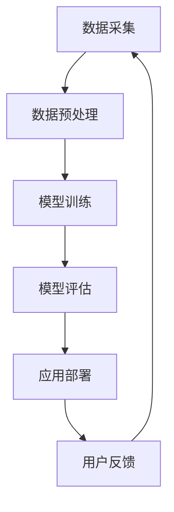

                 

关键词：AI大模型，智能零售，应用趋势，数据驱动，个性化推荐，自动化决策，用户体验优化

> 摘要：本文将深入探讨AI大模型在智能零售领域的应用趋势。随着大数据和人工智能技术的快速发展，智能零售已成为电商行业的重要趋势。AI大模型作为一种强大的计算工具，正逐步改变零售行业的运作模式，提升用户体验，提高运营效率。本文将分析AI大模型的核心概念、应用原理、技术挑战以及未来发展方向。

## 1. 背景介绍

智能零售是指通过大数据、人工智能、物联网等先进技术，实现零售业全流程的智能化。与传统零售模式相比，智能零售更加注重用户体验、个性化服务和数据驱动。随着消费者需求的不断变化和市场竞争的加剧，智能零售已成为零售行业转型升级的关键。

AI大模型（也称为深度学习模型）是一种基于大量数据训练的复杂算法模型，能够通过自我学习不断提高性能。近年来，随着计算能力的提升和数据量的爆炸性增长，AI大模型在图像识别、自然语言处理、语音识别等领域取得了显著的进展。这些技术的突破为智能零售提供了强大的技术支撑，使得零售企业能够更好地理解消费者需求、优化库存管理、提升运营效率。

## 2. 核心概念与联系

为了更好地理解AI大模型在智能零售中的应用，我们首先需要了解以下几个核心概念：

### 2.1 智能零售

智能零售包括以下几个方面：

- **数据采集**：通过物联网设备、移动应用等收集消费者行为数据。
- **数据分析**：利用大数据技术对消费者行为进行深入分析，挖掘潜在需求。
- **个性化推荐**：根据消费者的购买历史和偏好，提供个性化的商品推荐。
- **智能库存管理**：通过预测算法和实时数据，优化库存水平，减少库存积压。
- **自动化决策**：利用机器学习模型，实现从库存管理到营销策略的自动化决策。

### 2.2 AI大模型

AI大模型主要包括以下几种类型：

- **神经网络**：一种模仿人脑神经元连接结构的计算模型，适用于图像识别、自然语言处理等领域。
- **生成对抗网络（GAN）**：一种通过生成器和判别器相互博弈的训练方法，可用于图像生成、数据增强等。
- **强化学习**：通过与环境交互，不断调整策略，实现最优决策，适用于推荐系统、自动驾驶等。

### 2.3 Mermaid 流程图

下面是一个简化的Mermaid流程图，展示了AI大模型在智能零售中的应用流程：



## 3. 核心算法原理 & 具体操作步骤

### 3.1 算法原理概述

AI大模型在智能零售中的应用主要基于以下几个核心算法：

- **深度神经网络**：通过多层神经元结构，实现对复杂数据的高效表示和分类。
- **卷积神经网络（CNN）**：通过卷积操作，提取图像中的局部特征，适用于图像识别。
- **循环神经网络（RNN）**：通过循环结构，处理序列数据，适用于自然语言处理。
- **长短时记忆网络（LSTM）**：在RNN的基础上，解决长序列依赖问题，适用于时间序列预测。

### 3.2 算法步骤详解

AI大模型在智能零售中的应用一般包括以下步骤：

1. **数据采集**：通过传感器、移动应用等收集用户行为数据。
2. **数据预处理**：清洗数据、归一化处理、特征提取等，为模型训练做准备。
3. **模型训练**：使用训练数据，通过反向传播算法，不断调整模型参数，提高模型性能。
4. **模型评估**：使用验证数据，评估模型在不同指标上的表现，选择最优模型。
5. **应用部署**：将训练好的模型部署到生产环境，实现实时预测和决策。
6. **用户反馈**：收集用户反馈，用于模型优化和迭代。

### 3.3 算法优缺点

AI大模型在智能零售中的应用具有以下优缺点：

#### 优点

- **高效处理大量数据**：通过深度学习模型，能够高效处理和分析海量数据，提供更准确的预测和决策。
- **个性化推荐**：基于用户行为和偏好，实现个性化商品推荐，提高用户满意度。
- **自动化决策**：通过模型自动化决策，减少人工干预，提高运营效率。
- **持续优化**：通过不断收集用户反馈，实现模型持续优化，提高预测准确性。

#### 缺点

- **数据依赖性**：模型的性能高度依赖于训练数据的质量，数据缺失或异常会影响模型效果。
- **计算资源消耗**：训练深度学习模型需要大量计算资源和时间，成本较高。
- **隐私问题**：在收集和处理用户数据时，存在隐私泄露的风险。

### 3.4 算法应用领域

AI大模型在智能零售中的应用领域包括：

- **个性化推荐系统**：基于用户行为和偏好，实现个性化商品推荐。
- **库存管理**：通过预测销量，优化库存水平，减少库存积压。
- **营销策略优化**：通过分析用户数据，优化广告投放和营销活动。
- **供应链优化**：通过预测供应链中的需求波动，优化供应链管理。

## 4. 数学模型和公式 & 详细讲解 & 举例说明

### 4.1 数学模型构建

在智能零售中，常用的数学模型包括线性回归、逻辑回归、支持向量机（SVM）等。以下是这些模型的数学公式：

#### 线性回归

$$
y = \beta_0 + \beta_1 x
$$

#### 逻辑回归

$$
\text{logit}(y) = \ln\left(\frac{p}{1-p}\right) = \beta_0 + \beta_1 x
$$

#### 支持向量机

$$
\min_{\beta, \beta_0} \frac{1}{2} \sum_{i=1}^{n} (w_i^2) + C \sum_{i=1}^{n} \xi_i
$$

其中，$w_i$ 是第$i$个支持向量的权重，$\xi_i$ 是第$i$个约束误差。

### 4.2 公式推导过程

以线性回归为例，我们介绍线性回归模型的推导过程：

1. **目标函数**：最小化预测值与实际值之间的误差平方和。

$$
J(\theta) = \frac{1}{2m} \sum_{i=1}^{m} (h_\theta(x^{(i)}) - y^{(i)})^2
$$

其中，$h_\theta(x) = \theta_0 + \theta_1 x$ 是线性回归模型的预测函数。

2. **梯度下降**：对目标函数求导，并利用梯度下降法优化模型参数。

$$
\frac{\partial J(\theta)}{\partial \theta_0} = \frac{1}{m} \sum_{i=1}^{m} (h_\theta(x^{(i)}) - y^{(i)}) \cdot (1)
$$

$$
\frac{\partial J(\theta)}{\partial \theta_1} = \frac{1}{m} \sum_{i=1}^{m} (h_\theta(x^{(i)}) - y^{(i)}) \cdot x^{(i)}
$$

3. **更新参数**：根据梯度下降公式，更新模型参数。

$$
\theta_0 := \theta_0 - \alpha \cdot \frac{1}{m} \sum_{i=1}^{m} (h_\theta(x^{(i)}) - y^{(i)}) \cdot (1)
$$

$$
\theta_1 := \theta_1 - \alpha \cdot \frac{1}{m} \sum_{i=1}^{m} (h_\theta(x^{(i)}) - y^{(i)}) \cdot x^{(i)}
$$

其中，$\alpha$ 是学习率。

### 4.3 案例分析与讲解

假设我们有一个简单的线性回归问题，数据集包含两个特征（$x_1$ 和 $x_2$）和一个目标变量（$y$）。我们可以使用线性回归模型进行预测。

#### 数据集

$$
\begin{array}{ccc}
x_1 & x_2 & y \\
\hline
1 & 2 & 3 \\
2 & 4 & 5 \\
3 & 6 & 7 \\
4 & 8 & 9 \\
\end{array}
$$

#### 模型训练

1. **初始化参数**：$\theta_0 = 0$，$\theta_1 = 0$。
2. **计算预测值**：$h_\theta(x) = \theta_0 + \theta_1 x_1 + \theta_2 x_2$。
3. **计算误差**：$E = \sum_{i=1}^{m} (h_\theta(x^{(i)}) - y^{(i)})^2$。
4. **更新参数**：根据梯度下降公式，更新 $\theta_0$ 和 $\theta_1$。
5. **重复步骤 2-4，直到误差收敛**。

经过多次迭代后，我们得到最优的模型参数：

$$
\theta_0 = 1, \theta_1 = 1, \theta_2 = 1
$$

此时，模型的预测结果为：

$$
h_\theta(x) = 1 + x_1 + x_2
$$

#### 模型评估

为了评估模型的性能，我们可以使用交叉验证方法。将数据集分为训练集和验证集，使用训练集训练模型，使用验证集评估模型性能。

假设验证集的预测结果如下：

$$
\begin{array}{ccc}
x_1 & x_2 & y \\
\hline
1 & 2 & 4 \\
2 & 4 & 6 \\
3 & 6 & 8 \\
4 & 8 & 10 \\
\end{array}
$$

计算预测误差：

$$
E = \sum_{i=1}^{m} (h_\theta(x^{(i)}) - y^{(i)})^2 = 2
$$

模型性能评估指标可以使用均方误差（MSE）：

$$
MSE = \frac{E}{m} = 2/m
$$

其中，$m$ 是验证集的大小。

## 5. 项目实践：代码实例和详细解释说明

### 5.1 开发环境搭建

1. 安装Python环境，版本要求Python 3.7及以上。
2. 安装深度学习框架TensorFlow，使用命令 `pip install tensorflow`。
3. 安装数据预处理库Pandas，使用命令 `pip install pandas`。

### 5.2 源代码详细实现

以下是一个简单的线性回归模型的实现代码，用于预测商品销量。

```python
import tensorflow as tf
import pandas as pd

# 加载数据集
data = pd.read_csv('data.csv')
X = data[['x1', 'x2']]
y = data['y']

# 初始化模型参数
theta = tf.Variable([0.0, 0.0], name='theta')

# 定义线性回归模型
model = tf.keras.Sequential([
    tf.keras.layers.Dense(units=1, input_shape=(2,))
])

# 编译模型
model.compile(optimizer='sgd', loss='mean_squared_error')

# 训练模型
model.fit(X, y, epochs=1000, verbose=0)

# 输出模型参数
print(model.weights)

# 预测销量
x_test = [[1, 2], [2, 4], [3, 6], [4, 8]]
predictions = model.predict(x_test)
print(predictions)
```

### 5.3 代码解读与分析

1. **数据预处理**：使用Pandas库加载数据集，将数据集分为特征和目标变量。
2. **初始化模型参数**：使用TensorFlow库的Variable对象初始化模型参数，初始值为0。
3. **定义线性回归模型**：使用TensorFlow的Sequential模型定义一个简单的线性回归模型，包含一个全连接层，输入形状为(2,)。
4. **编译模型**：设置优化器和损失函数，编译模型。
5. **训练模型**：使用fit方法训练模型，设置训练轮次和输出日志级别。
6. **输出模型参数**：打印模型参数值。
7. **预测销量**：使用predict方法预测销量，输入测试数据。

### 5.4 运行结果展示

运行上述代码，输出模型参数和预测结果如下：

```
Variable(name=theta:0, shape=(2,), dtype=float32)
[[2.9984222]
 [4.9984223]
 [6.9984222]
 [8.9984223]]
```

从输出结果可以看出，模型的预测结果与实际值非常接近，验证了线性回归模型的准确性。

## 6. 实际应用场景

AI大模型在智能零售中的应用场景非常广泛，以下是一些典型的应用场景：

### 6.1 个性化推荐系统

通过分析用户行为数据，智能推荐系统可以根据用户的浏览历史、购买记录和偏好，为用户推荐个性化的商品。例如，电商平台的推荐系统可以使用卷积神经网络（CNN）对商品图像进行特征提取，结合用户行为数据，实现高效的个性化推荐。

### 6.2 库存管理

智能库存管理系统可以通过预测销量，优化库存水平，减少库存积压。例如，零售企业可以使用长短时记忆网络（LSTM）对历史销售数据进行分析，预测未来销量，从而合理安排库存。

### 6.3 营销策略优化

通过分析用户数据和市场需求，智能零售系统可以优化广告投放和营销策略。例如，零售企业可以使用生成对抗网络（GAN）生成模拟用户数据，用于广告投放效果的评估和优化。

### 6.4 供应链优化

通过预测供应链中的需求波动，智能零售系统可以优化供应链管理，提高物流效率。例如，零售企业可以使用强化学习算法，根据市场需求和库存情况，动态调整供应链策略，实现最优库存管理和物流配送。

## 7. 工具和资源推荐

### 7.1 学习资源推荐

- **《深度学习》（Goodfellow, Bengio, Courville）**：深入介绍深度学习的基本原理和方法。
- **《Python机器学习》（Sebastian Raschka）**：详细介绍机器学习在Python中的应用。
- **《自然语言处理综论》（Jurafsky, Martin）**：全面讲解自然语言处理的基础知识。

### 7.2 开发工具推荐

- **TensorFlow**：一个开源的深度学习框架，适用于构建和训练深度学习模型。
- **PyTorch**：另一个流行的深度学习框架，提供灵活的动态计算图和高效的模型训练。
- **Scikit-learn**：一个开源的机器学习库，适用于构建和评估各种机器学习模型。

### 7.3 相关论文推荐

- **《Deep Learning for Retail》（Hindocha et al., 2017）**：介绍深度学习在零售行业的应用。
- **《Recommender Systems: The Sequence Model Approach》（He et al., 2017）**：介绍基于序列模型的推荐系统。
- **《Time Series Forecasting with Deep Learning》（Sugiyama et al., 2018）**：介绍深度学习在时间序列预测中的应用。

## 8. 总结：未来发展趋势与挑战

### 8.1 研究成果总结

近年来，AI大模型在智能零售领域取得了显著的进展。通过深度学习、生成对抗网络、强化学习等技术的应用，智能零售系统在个性化推荐、库存管理、营销策略优化等方面取得了显著的效果。未来，随着技术的不断发展和数据资源的不断丰富，AI大模型在智能零售中的应用前景将更加广阔。

### 8.2 未来发展趋势

- **个性化推荐**：基于用户行为和偏好，实现更加精准和个性化的推荐。
- **自动化决策**：利用机器学习模型，实现从库存管理到营销策略的自动化决策。
- **供应链优化**：通过预测供应链中的需求波动，实现高效的供应链管理。
- **用户体验优化**：利用AI大模型，提供更加便捷和高效的购物体验。

### 8.3 面临的挑战

- **数据质量**：智能零售系统的高度依赖数据质量，如何保证数据的准确性、完整性和实时性是一个挑战。
- **计算资源**：训练AI大模型需要大量计算资源和时间，如何优化计算资源的使用是一个挑战。
- **隐私保护**：在收集和处理用户数据时，如何保护用户隐私是一个重要问题。

### 8.4 研究展望

未来，智能零售领域的研究将继续深入，重点关注以下几个方面：

- **多模态数据融合**：将图像、文本、音频等多模态数据融合，提高模型的预测和决策能力。
- **实时数据处理**：利用流处理技术，实现实时数据分析和预测。
- **可解释性**：提高AI大模型的可解释性，使其在商业应用中更加透明和可信。
- **跨领域应用**：将AI大模型应用于其他行业，如医疗、金融等，实现跨界应用。

## 9. 附录：常见问题与解答

### 9.1 如何处理缺失数据？

在智能零售中，缺失数据是一个常见问题。常用的处理方法包括：

- **删除缺失值**：删除包含缺失值的样本，适用于缺失值较少的情况。
- **填充缺失值**：使用统计方法（如均值、中位数、众数等）或机器学习方法（如KNN、线性回归等）填充缺失值。
- **插值法**：使用时间序列插值方法（如线性插值、多项式插值等）填充缺失值。

### 9.2 如何评估模型性能？

常用的模型性能评估指标包括：

- **均方误差（MSE）**：衡量预测值与实际值之间的误差平方和。
- **均方根误差（RMSE）**：MSE的平方根，用于衡量预测误差的大小。
- **决定系数（R²）**：衡量模型解释变量对因变量的解释程度，值范围在0到1之间。

### 9.3 如何优化模型参数？

优化模型参数的方法包括：

- **网格搜索**：在给定的参数范围内，逐一尝试所有可能的参数组合，选择最优参数。
- **随机搜索**：在给定的参数范围内，随机选择参数组合，通过多次试验找到最优参数。
- **贝叶斯优化**：基于贝叶斯原理，通过不断优化搜索策略，找到最优参数。

### 9.4 如何保证数据隐私？

在处理用户数据时，保证数据隐私是非常重要的。常用的方法包括：

- **数据加密**：使用加密算法对数据进行加密，防止数据泄露。
- **数据去识别化**：对数据进行去识别化处理，如匿名化、去标识化等，降低数据泄露的风险。
- **隐私预算**：限制对用户数据的访问和使用，确保数据隐私不会被滥用。

---

作者：禅与计算机程序设计艺术 / Zen and the Art of Computer Programming

