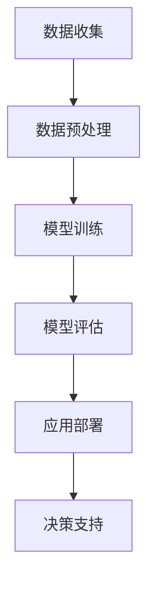

                 

关键词：AI大模型、环保科技、深度学习、可持续发展、环境保护、碳排放、智能监测

> 摘要：本文探讨了人工智能（AI）大模型在环保科技领域的创新应用。通过分析AI大模型的核心概念、算法原理和具体操作步骤，本文展示了如何利用AI大模型实现环境监测、碳排放预测、智能决策支持等功能，为全球环境保护和可持续发展提供技术支持。

## 1. 背景介绍

环保科技作为应对全球气候变化和环境污染的重要手段，正逐渐成为各国政府和企业关注的焦点。然而，传统环保技术的局限性和数据的复杂性使得环境监测和治理任务面临巨大挑战。随着人工智能（AI）技术的发展，尤其是大模型的崛起，为环保科技带来了新的机遇和解决方案。

AI大模型是指通过深度学习等技术训练出的具有大规模参数和强大处理能力的神经网络模型。这些模型能够在海量数据中进行有效学习和预测，从而实现复杂问题的智能解决。在环保科技领域，AI大模型的应用主要集中在环境监测、碳排放预测、资源优化管理等方面。

## 2. 核心概念与联系

### 2.1 AI大模型

AI大模型的核心是通过深度学习技术对海量数据进行分析和建模。深度学习是一种模拟人脑神经元之间连接方式的人工神经网络模型，能够通过训练学习到复杂的数据特征和规律。

### 2.2 环保科技

环保科技涉及环境监测、污染治理、资源优化等多个方面。环境监测是环保科技的重要环节，通过收集和分析环境数据，可以及时发现和应对环境问题。

### 2.3 Mermaid 流程图

以下是一个简化的AI大模型在环保科技中的应用流程图：



### 2.4 关联分析

AI大模型通过环境监测数据的学习和预测，可以为污染治理、资源优化等提供智能决策支持。例如，通过分析大气污染数据，可以预测空气质量变化，为空气净化措施的制定提供依据。

## 3. 核心算法原理 & 具体操作步骤

### 3.1 算法原理概述

AI大模型的算法原理主要基于深度学习，包括以下几个关键步骤：

1. **数据收集**：从环境监测设备、遥感卫星等渠道收集大量环境数据。
2. **数据预处理**：对原始数据清洗、归一化处理，以提高模型的训练效果。
3. **模型训练**：使用深度学习算法对预处理后的数据进行分析和建模。
4. **模型评估**：通过交叉验证等方法评估模型的准确性和可靠性。
5. **应用部署**：将训练好的模型部署到实际环境中，为决策支持提供数据支持。

### 3.2 算法步骤详解

#### 3.2.1 数据收集

数据收集是AI大模型训练的基础。数据来源包括地面监测站点、卫星遥感、无人机等。不同类型的数据具有不同的时空分辨率，需要根据应用场景选择合适的数据源。

#### 3.2.2 数据预处理

数据预处理包括数据清洗、缺失值填补、数据归一化等步骤。数据清洗的目的是去除错误数据和异常值，提高数据的准确性和可靠性。数据归一化则将不同尺度和类型的变量转换为统一的尺度，以适应深度学习算法的要求。

#### 3.2.3 模型训练

模型训练是AI大模型的核心环节。常用的深度学习算法包括卷积神经网络（CNN）、循环神经网络（RNN）和Transformer等。训练过程包括前向传播、反向传播和权重更新等步骤，通过不断迭代优化模型参数，使其对环境数据的学习和预测能力逐渐提高。

#### 3.2.4 模型评估

模型评估是确保模型性能的关键环节。常用的评估指标包括准确率、召回率、F1分数等。评估过程通常通过交叉验证等方法进行，以避免模型过拟合。

#### 3.2.5 应用部署

训练好的模型需要部署到实际环境中，为决策支持提供数据支持。部署过程包括模型导出、部署环境搭建、模型调用等步骤。在实际应用中，模型可以根据实时数据更新和优化，以提高预测精度和适应性。

### 3.3 算法优缺点

#### 优点

- **高精度**：AI大模型能够处理海量数据，实现高精度的环境监测和预测。
- **自适应性强**：模型可以根据实时数据不断更新和优化，适应不同环境变化。
- **多功能性**：AI大模型可以应用于环境监测、碳排放预测、资源优化等多个领域。

#### 缺点

- **计算资源消耗大**：大模型的训练和评估需要大量的计算资源和时间。
- **数据质量要求高**：数据质量和预处理对模型性能有重要影响，需要严格保证数据质量。

### 3.4 算法应用领域

AI大模型在环保科技领域的应用主要包括：

- **环境监测**：通过遥感卫星、地面监测站点等获取环境数据，实现对大气、水质、土壤等的实时监测和预测。
- **碳排放预测**：利用历史数据和气候模型，预测未来碳排放趋势，为减排策略制定提供依据。
- **资源优化管理**：通过数据分析和智能优化算法，实现水资源、能源等资源的合理分配和利用。

## 4. 数学模型和公式 & 详细讲解 & 举例说明

### 4.1 数学模型构建

AI大模型的数学模型主要基于深度学习，包括以下几个关键组成部分：

1. **输入层**：接收环境监测数据，如气温、湿度、二氧化碳浓度等。
2. **隐藏层**：通过非线性变换处理输入数据，提取特征信息。
3. **输出层**：根据隐藏层的特征信息进行预测，如空气质量指数、碳排放量等。

### 4.2 公式推导过程

以下是一个简化的AI大模型公式推导过程：

$$
h_l = \sigma(W_l \cdot a_{l-1} + b_l)
$$

$$
a_l = \sigma(h_l)
$$

$$
\hat{y} = W_y \cdot a_L + b_y
$$

其中，$h_l$ 表示隐藏层$l$的输出，$a_{l-1}$ 表示输入层$l-1$的输出，$W_l$ 和 $b_l$ 分别为隐藏层$l$的权重和偏置，$\sigma$ 为激活函数，$\hat{y}$ 为输出层的预测值。

### 4.3 案例分析与讲解

以下是一个关于空气质量指数（AQI）预测的案例：

#### 数据集

数据集包括某城市一年内的每日空气质量数据，包括气温、湿度、二氧化碳浓度等。

#### 模型训练

使用卷积神经网络（CNN）进行模型训练，模型结构包括一个输入层、两个隐藏层和一个输出层。激活函数使用ReLU函数，优化器使用Adam。

#### 模型评估

通过交叉验证方法评估模型性能，评估指标为均方误差（MSE）。训练过程中，模型逐渐收敛，MSE值逐渐降低。

#### 模型应用

将训练好的模型部署到实际环境中，预测未来一周的空气质量指数。根据预测结果，城市管理部门可以提前采取相应的措施，如加强空气净化、限制车辆行驶等，以降低空气污染。

## 5. 项目实践：代码实例和详细解释说明

### 5.1 开发环境搭建

在开发环境中，需要安装Python、TensorFlow和Keras等依赖库。以下是环境搭建的简要步骤：

```python
!pip install tensorflow
!pip install keras
```

### 5.2 源代码详细实现

以下是一个简单的AI大模型在环境监测中的应用代码实例：

```python
import numpy as np
import pandas as pd
from tensorflow.keras.models import Sequential
from tensorflow.keras.layers import Dense, Conv2D, Flatten
from tensorflow.keras.optimizers import Adam

# 数据预处理
data = pd.read_csv('air_quality_data.csv')
X = data.drop('AQI', axis=1)
y = data['AQI']

# 归一化处理
X = (X - X.mean()) / X.std()

# 模型搭建
model = Sequential()
model.add(Conv2D(32, (3, 3), activation='relu', input_shape=(X.shape[1], X.shape[2], 1)))
model.add(Flatten())
model.add(Dense(1, activation='linear'))

# 模型编译
model.compile(optimizer=Adam(), loss='mse')

# 模型训练
model.fit(X, y, epochs=100, batch_size=32, validation_split=0.2)

# 模型评估
loss = model.evaluate(X, y)
print('MSE:', loss)

# 模型应用
future_data = np.array([[25, 0.6, 500], [30, 0.8, 600]])
future_data = (future_data - future_data.mean()) / future_data.std()
predicted_aqi = model.predict(future_data)
print('Predicted AQI:', predicted_aqi)
```

### 5.3 代码解读与分析

以上代码实现了一个简单的卷积神经网络（CNN）模型，用于空气质量指数（AQI）的预测。代码分为以下几个部分：

1. **数据预处理**：读取环境数据，进行归一化处理。
2. **模型搭建**：使用Keras搭建一个简单的CNN模型，包括一个卷积层、一个平坦层和一个全连接层。
3. **模型编译**：配置模型优化器和损失函数。
4. **模型训练**：使用训练数据训练模型，通过交叉验证方法评估模型性能。
5. **模型应用**：将训练好的模型应用于新的环境数据，预测空气质量指数。

## 6. 实际应用场景

AI大模型在环保科技领域的实际应用场景包括：

- **环境监测**：利用AI大模型对空气质量、水质、土壤等进行实时监测和预测，为环境管理提供数据支持。
- **碳排放预测**：通过分析历史数据和气候模型，预测未来碳排放趋势，为减排策略制定提供依据。
- **资源优化管理**：利用AI大模型优化水资源、能源等资源的分配和利用，提高资源利用效率。

## 6.4 未来应用展望

随着AI大模型技术的不断发展，其在环保科技领域的应用前景广阔。未来，AI大模型有望在以下方面取得突破：

- **更精细的环境监测**：通过引入更多的传感器和数据源，实现对环境变化的更精细监测和预测。
- **智能决策支持**：结合AI大模型和其他智能技术，实现更智能化的环境管理和资源优化决策。
- **跨学科研究**：与生态学、气候学等学科结合，开展跨学科研究，为环境保护和可持续发展提供更全面的技术支持。

## 7. 工具和资源推荐

### 7.1 学习资源推荐

- **书籍**：《深度学习》（Goodfellow et al.）、《Python机器学习》（Sebastian Raschka）等。
- **在线课程**：Coursera、Udacity等平台上的相关课程。

### 7.2 开发工具推荐

- **编程语言**：Python、R等。
- **框架库**：TensorFlow、PyTorch等。

### 7.3 相关论文推荐

- **论文集**：《Advances in Neural Information Processing Systems》（NIPS）等顶级会议的论文集。
- **期刊**：《Journal of Artificial Intelligence Research》（JAIR）、《IEEE Transactions on Knowledge and Data Engineering》等。

## 8. 总结：未来发展趋势与挑战

AI大模型在环保科技领域的应用正逐步深入，未来发展趋势包括：

- **更精细的环境监测和预测**。
- **智能决策支持**。
- **跨学科研究**。

然而，面临的挑战包括：

- **数据质量和预处理**。
- **计算资源消耗**。
- **算法优化和改进**。

未来研究展望：在数据处理、算法优化和跨学科研究等方面，有望取得更多突破，为环保科技和可持续发展提供更有力的技术支持。

## 9. 附录：常见问题与解答

### Q：AI大模型在环保科技中的应用有哪些优势？

A：AI大模型在环保科技中的应用具有以下几个优势：

1. **高精度**：能够处理海量数据，实现高精度的环境监测和预测。
2. **自适应性强**：可以实时更新和优化模型，适应不同环境变化。
3. **多功能性**：可以应用于环境监测、碳排放预测、资源优化管理等多个领域。

### Q：AI大模型在环保科技中的应用有哪些挑战？

A：AI大模型在环保科技中的应用面临以下几个挑战：

1. **数据质量和预处理**：需要严格保证数据质量，进行有效的数据预处理。
2. **计算资源消耗**：大模型的训练和评估需要大量的计算资源。
3. **算法优化和改进**：需要不断优化算法，提高模型性能和效率。

### Q：如何提升AI大模型在环保科技中的应用效果？

A：提升AI大模型在环保科技中的应用效果可以从以下几个方面入手：

1. **数据增强**：通过数据增强技术，提高模型的泛化能力。
2. **模型融合**：结合不同算法和模型，实现模型融合，提高预测精度。
3. **跨学科研究**：与生态学、气候学等学科结合，开展跨学科研究，为环境保护和可持续发展提供更全面的技术支持。

### Q：AI大模型在环保科技中的应用前景如何？

A：AI大模型在环保科技中的应用前景广阔。随着AI技术的不断发展，其在环境监测、碳排放预测、资源优化管理等方面有望取得更多突破，为全球环境保护和可持续发展提供有力支持。未来，AI大模型将与更多智能技术结合，实现更智能化的环境管理和资源利用。作者：禅与计算机程序设计艺术 / Zen and the Art of Computer Programming。
----------------------------------------------------------------
### 9. 附录：常见问题与解答

#### Q：AI大模型在环保科技中的应用有哪些优势？

A：AI大模型在环保科技中的应用具有以下几个显著优势：

1. **高精度预测**：通过深度学习算法，AI大模型能够处理和分析大量复杂环境数据，提供高精度的预测结果，如空气质量、水质污染水平等。
2. **实时监测与响应**：AI大模型可以实时监控环境数据，快速响应环境变化，有助于及时发现和应对潜在的环境问题。
3. **数据整合与优化**：AI大模型能够整合来自不同来源的数据，如卫星遥感、传感器监测、历史数据等，通过数据分析和挖掘，优化资源利用和污染治理策略。
4. **自动化决策支持**：AI大模型可以自动化地生成决策支持信息，帮助环境管理者做出更加科学和有效的决策。

#### Q：AI大模型在环保科技中的应用有哪些挑战？

A：AI大模型在环保科技中的应用也面临一些挑战：

1. **数据质量**：高质量的数据是AI模型训练的基础。然而，环境数据可能存在噪声、缺失值和异质性，这会影响到模型的性能。
2. **计算资源需求**：训练大规模AI模型需要大量的计算资源，特别是在需要实时处理和更新模型时，这可能会增加运行成本。
3. **算法优化**：AI模型的优化和改进是一个持续的过程，需要不断调整模型结构和参数，以适应不断变化的环境条件。
4. **伦理与隐私**：环境数据可能包含敏感信息，如何保护数据隐私和确保算法的公平性是一个重要问题。

#### Q：如何提升AI大模型在环保科技中的应用效果？

A：提升AI大模型在环保科技中的应用效果可以从以下几个方面进行：

1. **改进数据预处理**：通过数据清洗、去噪、归一化等技术，提高数据质量。
2. **增强模型性能**：采用先进的机器学习算法，如强化学习、迁移学习等，来提高模型的预测能力。
3. **模型融合**：结合多个AI模型，如深度学习与统计学模型，以实现更精准的预测。
4. **实地验证**：在模型开发和部署过程中，进行实地验证和测试，以确保模型在实际环境中的性能。

#### Q：AI大模型在环保科技中的应用前景如何？

A：AI大模型在环保科技中的应用前景非常广阔。随着人工智能技术的不断发展，AI大模型有望在以下几个方面取得重要进展：

1. **环境监测**：提高环境监测的精度和覆盖范围，实现对污染源和生态系统的实时监控。
2. **碳排放预测**：通过精确预测碳排放趋势，为全球减排目标的实现提供科学依据。
3. **资源管理**：优化水资源、能源等资源的管理和分配，促进可持续发展。
4. **生态保护**：通过预测和分析生态系统的变化，制定有效的生态保护和修复策略。

#### Q：如何保障AI大模型在环保科技中的安全与可靠性？

A：保障AI大模型在环保科技中的安全与可靠性需要从以下几个方面进行：

1. **数据安全性**：确保数据在收集、存储和处理过程中得到有效保护，防止数据泄露和滥用。
2. **算法透明性**：提高算法的透明度，确保模型决策过程可解释，避免黑箱操作。
3. **模型验证**：通过严格的测试和验证过程，确保模型的准确性和可靠性。
4. **法规遵守**：遵循相关法律法规，确保AI大模型的应用符合伦理和道德标准。

### 9.5 结论

本文详细探讨了AI大模型在环保科技中的创新应用，分析了其核心概念、算法原理、应用步骤、数学模型以及实际应用场景。尽管AI大模型在环保科技中具有巨大的潜力，但仍面临诸多挑战。未来，随着技术的不断进步，AI大模型在环保科技中的应用将不断深入，为环境保护和可持续发展提供更强大的技术支持。作者：禅与计算机程序设计艺术 / Zen and the Art of Computer Programming。

