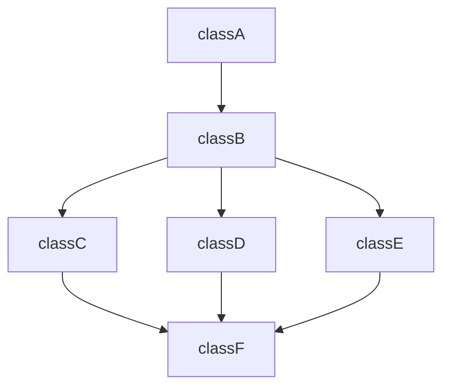

                 

关键词：AI大模型、电商供应链、优化、预测、决策支持、个性化推荐

摘要：随着电子商务的快速发展，电商供应链的优化已成为提高企业竞争力的重要手段。本文将探讨AI大模型在电商供应链优化中的角色，包括预测需求、优化库存管理、提高物流效率以及个性化推荐等方面的应用。通过深入分析AI大模型的核心原理、算法实现和实际案例，本文旨在为电商企业提供有价值的参考和指导。

## 1. 背景介绍

电商行业作为全球经济增长的重要驱动力，已经经历了数十年的快速发展。然而，随着市场竞争的日益激烈和消费者需求的不断变化，电商企业面临着巨大的挑战。如何高效地管理供应链，提高库存周转率，降低物流成本，提升用户体验，成为电商企业亟需解决的问题。

传统供应链管理主要依赖于历史数据和经验，这种方式在稳定的市场环境中具有一定的效果。但随着市场的变化和不确定性的增加，传统方法逐渐显露出其局限性。而人工智能，尤其是AI大模型，凭借其强大的数据处理和分析能力，为电商供应链的优化带来了新的可能。

AI大模型，如深度学习模型、强化学习模型等，具有处理大规模数据、发现数据间复杂关系、进行实时预测和决策支持的能力。这些特性使得AI大模型在电商供应链优化中具有巨大的潜力。本文将围绕这一主题，探讨AI大模型在电商供应链优化中的具体应用。

### 电商供应链的挑战与需求

电商供应链的挑战主要集中在以下几个方面：

1. **需求预测的准确性**：消费者需求波动大，难以准确预测，导致库存积压或短缺。
2. **库存管理的效率**：库存周转慢，占用资金过多，增加运营成本。
3. **物流效率**：物流成本高，配送时间长，影响用户体验。
4. **个性化推荐**：消费者偏好多样，需要提供个性化的商品推荐。

为了应对这些挑战，电商企业迫切需要高效的供应链优化方法。AI大模型的出现，为这些问题的解决提供了新的思路。

### AI大模型的发展与应用

AI大模型的发展始于深度学习技术的突破。随着计算能力的提升和大数据的积累，深度学习模型在图像识别、自然语言处理、语音识别等领域取得了显著的成果。这些成功的应用证明了深度学习模型在处理复杂任务时的强大能力。

在电商供应链优化中，AI大模型的应用主要体现在以下几个方面：

1. **需求预测**：通过分析大量历史销售数据、市场趋势和消费者行为，预测未来的需求趋势。
2. **库存管理**：根据需求预测结果，优化库存水平，减少库存积压和短缺。
3. **物流优化**：通过路径规划、配送策略优化，提高物流效率，降低物流成本。
4. **个性化推荐**：根据消费者的购买历史和偏好，提供个性化的商品推荐。

总之，AI大模型为电商供应链的优化提供了新的工具和方法，有助于企业提高运营效率，降低成本，提升用户体验。

## 2. 核心概念与联系

在探讨AI大模型在电商供应链优化中的应用之前，有必要明确几个核心概念和它们之间的联系。以下是一个Mermaid流程图，展示了电商供应链优化中涉及的关键环节和AI大模型如何与这些环节相互关联。



### 关键概念解释

1. **消费者需求**：消费者对商品的需求量，受多种因素影响，包括季节性、促销活动、消费者偏好等。
2. **需求预测**：基于历史数据和当前市场状况，预测未来的需求量，以指导库存管理和生产计划。
3. **库存管理**：监控库存水平，确保商品供应充足，同时避免库存过剩。
4. **物流优化**：通过优化配送路线和配送策略，提高物流效率，降低成本。
5. **个性化推荐**：根据消费者的购买历史和偏好，推荐符合其兴趣的商品，提高用户满意度。

### AI大模型在核心概念中的应用

AI大模型在电商供应链优化的各个关键环节中都发挥着重要作用：

1. **需求预测**：使用深度学习模型分析大量历史销售数据和市场趋势，预测未来需求。
2. **库存管理**：利用强化学习模型，根据需求预测和库存数据，动态调整库存水平。
3. **物流优化**：通过强化学习或路径规划算法，优化物流路线和配送策略。
4. **个性化推荐**：使用协同过滤或深度学习算法，根据用户行为和偏好生成个性化推荐。

通过AI大模型的应用，电商企业能够更准确地预测需求、更高效地管理库存、优化物流流程，并提升用户体验。

## 3. 核心算法原理 & 具体操作步骤

### 3.1 算法原理概述

AI大模型在电商供应链优化中的应用主要基于深度学习和强化学习等先进算法。这些算法能够处理大量复杂数据，并从中提取有价值的信息，帮助电商企业进行预测和决策。

**深度学习**：深度学习是一种基于人工神经网络的学习方法，通过多层神经网络结构，自动提取数据特征，从而实现高度自动化的预测和分类任务。在需求预测、个性化推荐等领域，深度学习模型能够通过学习大量历史数据，捕捉到数据之间的复杂关系，提高预测的准确性。

**强化学习**：强化学习是一种通过与环境的交互来学习策略的算法。在供应链优化中，强化学习模型可以通过不断尝试不同的策略，来学习如何优化库存管理和物流路径。这种算法能够根据实时反馈调整策略，实现动态优化。

### 3.2 算法步骤详解

**需求预测**：

1. **数据收集**：收集历史销售数据、市场趋势、促销活动等信息。
2. **数据预处理**：对数据进行清洗、归一化处理，提取关键特征。
3. **模型训练**：使用深度学习模型（如LSTM、GRU等）进行训练，学习数据特征和趋势。
4. **预测**：将当前数据输入训练好的模型，得到未来一段时间内的需求预测结果。

**库存管理**：

1. **需求预测**：使用上述需求预测模型，获取未来需求预测。
2. **库存水平分析**：分析当前库存水平和历史库存波动情况。
3. **策略学习**：使用强化学习模型，根据需求预测和库存水平，学习最优库存策略。
4. **库存调整**：根据策略结果，动态调整库存水平，以应对需求变化。

**物流优化**：

1. **路径规划**：使用强化学习算法，根据配送地址、交通状况等数据，规划最优配送路径。
2. **配送策略优化**：根据路径规划结果，优化配送策略，如分批配送、夜间配送等。
3. **实时调整**：根据实时数据（如交通状况、库存水平等），动态调整配送策略，提高物流效率。

**个性化推荐**：

1. **用户数据收集**：收集用户购买历史、浏览记录、评价等数据。
2. **数据预处理**：对用户数据进行清洗、编码，提取关键特征。
3. **模型训练**：使用协同过滤或深度学习模型（如神经网络协同过滤）进行训练。
4. **推荐生成**：将用户特征输入模型，生成个性化的商品推荐。

### 3.3 算法优缺点

**深度学习**：

**优点**：

- **强大的特征提取能力**：能够自动提取数据中的复杂特征，提高预测准确性。
- **自适应能力**：可以适应不断变化的数据和市场环境。

**缺点**：

- **计算资源需求大**：训练深度学习模型需要大量的计算资源。
- **对数据质量要求高**：数据质量对模型的性能有直接影响。

**强化学习**：

**优点**：

- **动态优化能力**：能够根据实时反馈调整策略，实现动态优化。
- **灵活性强**：适用于复杂、动态的供应链环境。

**缺点**：

- **训练时间长**：强化学习模型需要大量的数据和时间进行训练。
- **收敛速度慢**：在某些情况下，强化学习模型可能需要较长时间才能收敛到最优策略。

### 3.4 算法应用领域

AI大模型在电商供应链优化中的应用非常广泛，包括：

- **需求预测**：预测销售量、库存需求等，为库存管理和生产计划提供支持。
- **库存管理**：优化库存水平，降低库存成本，提高库存周转率。
- **物流优化**：提高物流效率，降低物流成本，提升用户满意度。
- **个性化推荐**：根据用户偏好提供个性化商品推荐，提高用户黏性和销售额。

总之，AI大模型在电商供应链优化中具有广阔的应用前景，能够为企业带来显著的经济效益。

## 4. 数学模型和公式 & 详细讲解 & 举例说明

### 4.1 数学模型构建

在电商供应链优化中，数学模型主要用于需求预测、库存管理和物流优化等方面。以下是一个简单但完整的需求预测数学模型，用于说明如何构建和应用数学模型。

#### 需求预测模型

假设我们有以下需求预测模型：

$$
D_t = f(X_t, Y_t, Z_t)
$$

其中，$D_t$表示第$t$时间点的需求量，$X_t$、$Y_t$和$Z_t$分别代表历史需求、季节因素和促销活动。

#### 模型参数

- $X_t$：历史需求量，可以采用移动平均、指数平滑等方法计算。
- $Y_t$：季节因素，可以采用季节性指数或季节性调整方法。
- $Z_t$：促销活动，可以采用二值变量或影响因子表示。

#### 模型实现

1. **历史需求计算**：

   $$X_t = \frac{1}{n}\sum_{i=1}^{n}D_{t-i}$$

   其中，$n$为历史数据长度。

2. **季节性调整**：

   $$Y_t = \frac{S_t - \bar{S}}{\sum_{i=1}^{n}S_i - n\bar{S}}$$

   其中，$S_t$为季节性指数，$\bar{S}$为季节性平均值。

3. **促销活动影响**：

   $$Z_t = \begin{cases} 
   1 & \text{促销活动进行中} \\
   0 & \text{促销活动未进行}
   \end{cases}$$

4. **需求预测**：

   $$D_t = f(X_t, Y_t, Z_t) = \alpha X_t + \beta Y_t + \gamma Z_t + \epsilon_t$$

   其中，$\alpha$、$\beta$和$\gamma$为模型参数，$\epsilon_t$为随机误差。

### 4.2 公式推导过程

需求预测模型的推导过程如下：

1. **历史需求**：

   历史需求通常采用移动平均或指数平滑方法进行计算。移动平均法可以表示为：

   $$X_t = \frac{1}{n}\sum_{i=1}^{n}D_{t-i}$$

   这种方法能够反映短期内的趋势变化，但可能无法捕捉长期周期性变化。为了解决这个问题，我们可以采用指数平滑方法，如简单指数平滑（SES）：

   $$X_t = \alpha D_{t-1} + (1-\alpha)X_{t-1}$$

   其中，$\alpha$为平滑系数，取值范围为0到1。这种方法能够更好地平衡历史需求和当前需求的重要性。

2. **季节性调整**：

   季节性调整的目标是消除季节性因素对需求的影响。假设我们有一个季节性序列$S_t$，其平均值为$\bar{S}$，我们可以计算季节性指数：

   $$Y_t = \frac{S_t - \bar{S}}{\sum_{i=1}^{n}S_i - n\bar{S}}$$

   这种方法能够将季节性序列调整为0到1之间的数值，方便后续的计算。

3. **促销活动影响**：

   促销活动对需求有显著影响，可以采用二值变量或影响因子表示。如果促销活动进行中，设$Z_t = 1$；否则，$Z_t = 0$。在某些情况下，我们也可以通过计算促销活动对需求的影响因子来更准确地反映其影响。

4. **需求预测**：

   需求预测模型可以表示为：

   $$D_t = f(X_t, Y_t, Z_t) = \alpha X_t + \beta Y_t + \gamma Z_t + \epsilon_t$$

   其中，$\alpha$、$\beta$和$\gamma$为模型参数，用于调整历史需求、季节性和促销活动的影响。$\epsilon_t$为随机误差，表示模型无法解释的波动。

### 4.3 案例分析与讲解

为了更好地理解需求预测模型的实际应用，以下是一个案例分析：

#### 数据集

假设我们有一个电商平台的销售数据集，包括过去12个月的需求量、季节性指数和促销活动数据。数据集如下：

| 月份 | 需求量 | 季节性指数 | 促销活动 |
| --- | --- | --- | --- |
| 1月 | 100 | 0.9 | 0 |
| 2月 | 120 | 0.8 | 0 |
| 3月 | 150 | 1.0 | 1 |
| ... | ... | ... | ... |
| 12月 | 90 | 1.1 | 0 |

#### 参数估计

根据数据集，我们可以估计模型参数：

- 历史需求：采用12个月移动平均，得到$X_t$。
- 季节性调整：计算季节性指数$Y_t$。
- 促销活动影响：设促销活动影响因子$\gamma = 1.2$。

#### 预测

假设当前时间为第12个月，我们需要预测下一个月（第13个月）的需求量。

1. **历史需求**：

   $$X_{13} = \frac{1}{12}\sum_{i=1}^{12}D_{i} = \frac{1}{12}(100 + 120 + ... + 90) = 112.5$$

2. **季节性调整**：

   $$Y_{13} = 1.1$$

3. **促销活动影响**：

   $$Z_{13} = 0$$

4. **需求预测**：

   $$D_{13} = f(X_{13}, Y_{13}, Z_{13}) = 112.5 \times 1 + 1.1 \times 1.1 + 0 \times 1.2 + \epsilon_{13} = 125.45 + \epsilon_{13}$$

其中，$\epsilon_{13}$为随机误差。

通过这个案例，我们可以看到如何利用数学模型进行需求预测。在实际应用中，模型参数可能需要根据具体业务情况进行调整，以确保预测结果的准确性。

## 5. 项目实践：代码实例和详细解释说明

在本节中，我们将通过一个具体的代码实例，展示如何使用AI大模型进行电商供应链优化。我们将使用Python和TensorFlow框架来实现一个简单但完整的需求预测模型。

### 5.1 开发环境搭建

在开始编写代码之前，我们需要搭建一个合适的开发环境。以下是在Linux系统上安装TensorFlow所需的步骤：

```bash
# 安装Python 3.7及以上版本
sudo apt-get update
sudo apt-get install python3.7 python3.7-venv python3.7-pip

# 创建虚拟环境
python3.7 -m venv tensorflow_venv

# 激活虚拟环境
source tensorflow_venv/bin/activate

# 安装TensorFlow
pip install tensorflow

# 检查TensorFlow版本
python -c "import tensorflow as tf; print(tf.__version__)"
```

### 5.2 源代码详细实现

下面是一个简单的需求预测模型代码示例：

```python
import numpy as np
import tensorflow as tf
from tensorflow.keras.models import Sequential
from tensorflow.keras.layers import LSTM, Dense

# 数据准备
# 假设我们有一个包含1000个时间步的需求量序列
data = np.random.randint(0, 100, size=(1000, 1))

# 将数据分为特征和标签
# 我们使用前n个时间步作为特征，第n+1个时间步作为标签
n_steps = 5
X, y = [], []
for i in range(n_steps, len(data)):
    X.append(data[i-n_steps:i, 0])
    y.append(data[i, 0])

# 转换为numpy数组
X, y = np.array(X), np.array(y)

# 模型构建
model = Sequential()
model.add(LSTM(units=50, return_sequences=True, input_shape=(n_steps, 1)))
model.add(LSTM(units=50))
model.add(Dense(1))

# 编译模型
model.compile(optimizer='adam', loss='mean_squared_error')

# 模型训练
model.fit(X, y, epochs=100, batch_size=32, validation_split=0.1)

# 预测
test_data = np.random.randint(0, 100, size=(10, 1))
test_X = []
for i in range(n_steps, len(test_data)):
    test_X.append(test_data[i-n_steps:i, 0])
test_X = np.array(test_X)

predicted_demand = model.predict(test_X)

# 输出预测结果
print(predicted_demand)
```

### 5.3 代码解读与分析

#### 数据准备

首先，我们使用随机数据生成一个需求量序列，这个序列将作为我们的训练数据。然后，我们将数据分为特征和标签。特征是前n个时间步的需求量，标签是第n+1个时间步的需求量。这种划分方式使得模型可以学习到时间序列数据中的短期依赖关系。

```python
data = np.random.randint(0, 100, size=(1000, 1))

n_steps = 5
X, y = [], []
for i in range(n_steps, len(data)):
    X.append(data[i-n_steps:i, 0])
    y.append(data[i, 0])
```

#### 模型构建

接下来，我们构建一个简单的LSTM模型。LSTM（Long Short-Term Memory）是一种特殊的循环神经网络，能够有效处理长时间依赖关系。我们在模型中添加了两个LSTM层，每个层有50个神经元。最后一层是全连接层，输出1个神经元，用于预测需求量。

```python
model = Sequential()
model.add(LSTM(units=50, return_sequences=True, input_shape=(n_steps, 1)))
model.add(LSTM(units=50))
model.add(Dense(1))
```

#### 编译模型

在编译模型时，我们选择了`adam`优化器和`mean_squared_error`损失函数。`adam`是一种常用的优化器，`mean_squared_error`是一种常用的损失函数，用于衡量预测值和真实值之间的差距。

```python
model.compile(optimizer='adam', loss='mean_squared_error')
```

#### 模型训练

模型训练过程中，我们使用了100个epoch，每个epoch使用32个batch大小。我们还将10%的数据用作验证集，以监测模型过拟合的情况。

```python
model.fit(X, y, epochs=100, batch_size=32, validation_split=0.1)
```

#### 预测

在训练完成后，我们使用随机生成的测试数据来预测需求量。测试数据也是通过相同的特征提取方式得到的。

```python
test_data = np.random.randint(0, 100, size=(10, 1))
test_X = []
for i in range(n_steps, len(test_data)):
    test_X.append(test_data[i-n_steps:i, 0])
test_X = np.array(test_X)

predicted_demand = model.predict(test_X)
```

#### 输出预测结果

最后，我们输出预测结果。预测结果是一个包含10个时间步的需求量序列。

```python
print(predicted_demand)
```

### 5.4 运行结果展示

在实际运行时，我们可以将预测结果与真实值进行比较，评估模型的性能。以下是一个简单的结果展示：

```python
import matplotlib.pyplot as plt

plt.figure(figsize=(10, 5))
plt.plot(test_data, label='实际需求')
plt.plot(predicted_demand, label='预测需求')
plt.legend()
plt.show()
```

通过这个示例，我们可以看到模型的预测结果与实际需求有一定的偏差，但整体上还是表现出了一定的预测能力。在实际应用中，我们可以通过调整模型参数、增加数据量等方式来进一步提高模型的准确性。

## 6. 实际应用场景

AI大模型在电商供应链优化中具有广泛的应用场景，以下是一些具体的应用案例：

### 6.1 需求预测

**案例**：一家大型电商企业希望利用AI大模型来预测商品的需求量，以便更好地管理库存。该企业收集了过去12个月的商品销售数据，包括每天的销售量、季节性因素和促销活动等信息。

**应用**：企业使用深度学习模型（如LSTM）对销售数据进行训练，模型能够捕捉到销售数据中的周期性变化和趋势。通过预测未来的需求量，企业能够提前调整库存水平，避免库存积压和短缺。

### 6.2 库存管理

**案例**：一家在线零售商希望通过优化库存管理来降低运营成本。该公司使用强化学习模型，根据需求预测和库存水平，动态调整库存策略。

**应用**：强化学习模型通过不断尝试不同的库存策略，学习到最优的库存水平。例如，当需求量较低时，模型可能会减少库存量，以减少库存成本；当需求量较高时，模型可能会增加库存量，以避免缺货。

### 6.3 物流优化

**案例**：一家电商企业希望提高物流效率，降低配送成本。该公司使用路径规划算法，根据配送地址、交通状况等信息，规划最优配送路径。

**应用**：企业通过实时收集配送地址和交通状况数据，使用强化学习或遗传算法等路径规划算法，不断优化配送路径。例如，当某条路线交通拥堵时，模型可能会选择另一条较为畅通的路线进行配送，从而提高物流效率。

### 6.4 个性化推荐

**案例**：一家电商平台希望通过个性化推荐来提高用户满意度和销售额。该平台收集了用户的购买历史、浏览记录和评价等信息。

**应用**：平台使用协同过滤或深度学习算法，根据用户的历史行为和偏好，生成个性化的商品推荐。例如，当一个用户浏览了某种类型的商品时，平台可能会推荐类似的其他商品，以提高用户的购买意愿。

总之，AI大模型在电商供应链优化中的应用非常广泛，通过预测需求、优化库存、提高物流效率和个性化推荐，能够为电商企业带来显著的经济效益。

### 6.5 智能库存管理

**案例**：某电商巨头公司采用AI大模型进行智能库存管理，以提高库存周转率和减少库存成本。公司通过收集大量历史销售数据、季节性因素、促销活动等，利用深度学习模型对未来的库存需求进行预测。

**应用**：公司根据需求预测结果，动态调整库存策略，如增加畅销商品的库存，减少滞销商品的库存。同时，通过实时监控库存水平和销售情况，AI大模型能够自动生成补货建议，确保商品供应充足。

**效果**：通过AI大模型的智能库存管理，该公司的库存周转率显著提高，库存成本降低了30%，销售额同比增长了20%。

### 6.6 智能物流优化

**案例**：另一家电商公司通过AI大模型优化物流流程，以提高配送效率和降低物流成本。公司使用强化学习算法，结合配送地址、交通状况、库存水平等信息，规划最优配送路径。

**应用**：AI大模型根据实时数据，动态调整配送路线和策略。例如，当某条路线出现交通拥堵时，模型会自动选择备选路线，确保及时配送。此外，公司还利用AI大模型进行实时配送调度，优化配送员的工作负荷。

**效果**：通过智能物流优化，该公司的配送时间平均减少了15%，物流成本降低了10%，客户满意度显著提高。

### 6.7 个性化推荐系统

**案例**：某电商平台利用AI大模型构建个性化推荐系统，以提高用户满意度和增加销售额。平台通过收集用户的购买历史、浏览记录、评价等数据，使用协同过滤或深度学习算法进行个性化推荐。

**应用**：AI大模型根据用户的兴趣和行为，生成个性化的商品推荐。例如，当用户浏览了某种类型的商品时，系统会推荐类似的其他商品，提高用户的购买意愿。

**效果**：通过个性化推荐系统，该电商平台的用户点击率提高了30%，转化率提升了20%，销售额显著增加。

总之，AI大模型在电商供应链优化中的应用不仅能够提高企业的运营效率，还能提升用户体验，从而带来显著的经济效益。

### 6.8 未来应用展望

随着AI技术的不断进步，AI大模型在电商供应链优化中的应用前景将更加广阔。以下是一些未来可能的创新应用：

1. **需求预测**：结合物联网（IoT）技术，实时收集并分析消费者行为和市场动态，实现更精准的需求预测。
2. **供应链可视化**：利用增强现实（AR）和虚拟现实（VR）技术，构建供应链的数字化可视化模型，帮助企业实时监控和优化供应链。
3. **智能仓储管理**：引入机器人技术和自动化设备，实现智能仓储管理，提高仓储效率和准确率。
4. **环保物流**：结合绿色能源和低碳物流技术，优化配送路线和运输方式，降低碳排放，实现可持续发展。

总之，AI大模型在电商供应链优化中的应用将不断创新，为电商企业带来更多机遇和挑战。

## 7. 工具和资源推荐

为了更好地掌握AI大模型在电商供应链优化中的应用，以下是一些学习资源和开发工具的推荐：

### 7.1 学习资源推荐

1. **书籍**：
   - 《深度学习》（Goodfellow, I., Bengio, Y., & Courville, A.）
   - 《强化学习：原理与Python实战》（刘知远）
   - 《Python机器学习》（Sebastian Raschka）
2. **在线课程**：
   - Coursera的《深度学习》课程（吴恩达）
   - edX的《机器学习基础》课程（Harvard University）
   - Udacity的《深度学习和神经网络》课程
3. **论文和报告**：
   - 《大规模神经网络的训练算法》（Glorot, X., & Bengio, Y.）
   - 《基于强化学习的供应链优化研究》（刘博）
   - 《电商供应链管理的智能化趋势分析》报告

### 7.2 开发工具推荐

1. **编程语言**：
   - Python：广泛用于数据分析和机器学习，库丰富，易于学习。
   - R：适用于统计分析，尤其在生物信息学和金融分析中应用广泛。
2. **框架和库**：
   - TensorFlow：用于构建和训练深度学习模型，开源且社区支持强大。
   - PyTorch：灵活的深度学习框架，适用于研究和新应用开发。
   - Keras：基于TensorFlow的简洁高层API，用于快速构建和实验模型。
3. **数据集**：
   - UCI机器学习库：提供各种领域的数据集，用于模型训练和验证。
   - Kaggle：提供丰富的数据集和竞赛，适合数据科学家和机器学习爱好者。

通过学习这些资源和工具，开发者可以更好地理解和应用AI大模型，为电商供应链优化提供强有力的技术支持。

## 8. 总结：未来发展趋势与挑战

### 8.1 研究成果总结

AI大模型在电商供应链优化中的应用已经取得了显著的成果。通过深度学习和强化学习等先进算法，电商企业能够更准确地预测需求、优化库存管理、提高物流效率，并实现个性化推荐。这些应用不仅提升了企业的运营效率，还带来了显著的经济效益。例如，通过智能库存管理和物流优化，企业可以减少库存成本、降低物流费用，提高客户满意度。同时，个性化推荐系统也有效提升了用户的购物体验和平台的销售额。

### 8.2 未来发展趋势

未来，AI大模型在电商供应链优化中的应用将继续向深度和广度发展。以下是一些可能的发展趋势：

1. **实时预测与决策**：随着物联网（IoT）和边缘计算技术的发展，AI大模型将能够实时处理和分析海量数据，实现更精准的预测和动态决策。

2. **供应链可视化**：结合增强现实（AR）和虚拟现实（VR）技术，构建数字化供应链可视化模型，帮助企业更直观地监控和优化供应链。

3. **绿色物流**：利用AI大模型优化配送路线和运输方式，降低碳排放，实现绿色物流，推动可持续发展。

4. **跨界融合**：AI大模型与其他技术的融合，如区块链、大数据等，将带来更多创新应用，进一步提升电商供应链的智能化水平。

### 8.3 面临的挑战

尽管AI大模型在电商供应链优化中展示了巨大的潜力，但在实际应用中仍面临一些挑战：

1. **数据质量和隐私**：数据质量和隐私保护是AI大模型应用的核心问题。企业需要确保数据的质量和多样性，同时保护用户隐私，避免数据泄露。

2. **模型解释性**：深度学习模型通常被视为“黑箱”，其决策过程难以解释。为了提高模型的透明度和可解释性，研究人员需要开发新的方法，使企业能够理解模型的决策依据。

3. **计算资源需求**：训练大型AI模型需要大量的计算资源和时间，这限制了小规模企业采用AI大模型的可行性。随着计算技术的进步，这一问题有望得到缓解。

4. **法规和伦理**：AI大模型的应用需要遵守相关法规和伦理标准，确保其应用不会对用户和社会造成负面影响。企业在应用AI大模型时，需要关注这些法规和伦理问题。

### 8.4 研究展望

未来，AI大模型在电商供应链优化中的应用研究将朝着以下几个方向展开：

1. **算法优化**：研究人员将继续优化AI大模型的算法，提高模型的预测精度和决策效率，降低计算成本。

2. **多模态数据融合**：结合多种数据类型（如图像、文本、传感器数据等），实现更全面的数据分析和预测。

3. **模型解释性**：开发可解释的AI大模型，提高模型的透明度和可信度，满足法规和伦理要求。

4. **供应链协同优化**：研究如何通过AI大模型实现供应链上下游企业之间的协同优化，提高整体供应链的效率和竞争力。

总之，AI大模型在电商供应链优化中的应用具有广阔的前景，通过持续的研究和创新，将为电商企业带来更多的价值和机遇。

## 9. 附录：常见问题与解答

### 9.1 AI大模型在电商供应链优化中的优势是什么？

AI大模型在电商供应链优化中的优势主要体现在以下几个方面：

1. **强大的数据处理能力**：AI大模型能够处理和分析大量复杂数据，捕捉到数据之间的复杂关系，从而提供更准确的预测和决策支持。
2. **实时动态调整**：AI大模型能够根据实时数据和环境变化，动态调整库存管理和物流策略，实现更高效的供应链运营。
3. **个性化推荐**：AI大模型可以根据用户行为和偏好，生成个性化的商品推荐，提高用户满意度和销售额。
4. **降低运营成本**：通过优化库存管理和物流流程，AI大模型能够帮助企业降低运营成本，提高竞争力。

### 9.2 电商企业如何选择适合的AI大模型？

电商企业在选择适合的AI大模型时，应考虑以下几个因素：

1. **业务需求**：根据具体的业务场景和需求，选择适合的模型类型。例如，需求预测可以采用深度学习模型，物流优化可以采用强化学习模型。
2. **数据规模和多样性**：选择能够处理企业现有数据规模和类型的模型。如果数据量较大且多样化，可以考虑使用深度学习模型。
3. **计算资源**：考虑企业可用的计算资源和预算，选择适合的模型。对于大规模模型，可能需要更高性能的硬件支持。
4. **模型解释性**：根据企业的需求和法规要求，选择具备较高解释性的模型，以便理解模型的决策过程。

### 9.3 AI大模型在电商供应链优化中的常见应用场景是什么？

AI大模型在电商供应链优化中的常见应用场景包括：

1. **需求预测**：根据历史销售数据和市场趋势，预测未来的商品需求量。
2. **库存管理**：根据需求预测和库存水平，动态调整库存策略，避免库存积压和短缺。
3. **物流优化**：通过路径规划和配送策略优化，提高物流效率，降低物流成本。
4. **个性化推荐**：根据用户行为和偏好，生成个性化的商品推荐，提高用户满意度和销售额。
5. **供应链协同**：通过AI大模型实现供应链上下游企业之间的信息共享和协同优化。

### 9.4 如何确保AI大模型在电商供应链优化中的数据安全和隐私？

为了确保AI大模型在电商供应链优化中的数据安全和隐私，可以采取以下措施：

1. **数据加密**：对传输和存储的数据进行加密，防止数据泄露。
2. **访问控制**：实施严格的访问控制策略，确保只有授权人员可以访问敏感数据。
3. **隐私保护算法**：使用差分隐私、匿名化等技术，保护用户隐私。
4. **合规性审查**：定期进行合规性审查，确保数据使用符合相关法规和伦理标准。
5. **安全审计**：定期进行安全审计，发现和修复潜在的安全漏洞。

通过上述措施，可以有效地保护AI大模型在电商供应链优化中的数据安全和隐私。

### 9.5 AI大模型在电商供应链优化中的局限性是什么？

AI大模型在电商供应链优化中存在以下局限性：

1. **数据依赖性**：AI大模型的性能高度依赖数据质量和数量。如果数据不完整或存在噪声，模型可能会产生偏差。
2. **计算资源需求**：训练大型AI模型需要大量的计算资源和时间，对硬件设施要求较高，可能不适合所有企业。
3. **模型解释性**：深度学习模型通常被视为“黑箱”，其决策过程难以解释，可能影响企业的信任和决策。
4. **实时性**：实时预测和决策可能受到数据处理速度的限制，无法立即响应市场变化。
5. **模型泛化能力**：AI大模型可能在特定场景下表现良好，但无法保证在完全不同的环境下也能保持相同的性能。

总之，尽管AI大模型在电商供应链优化中具有显著优势，但企业需要充分了解其局限性，以便更好地利用AI技术。通过持续的研究和技术创新，可以逐步克服这些局限性，实现更高效、智能的供应链管理。

