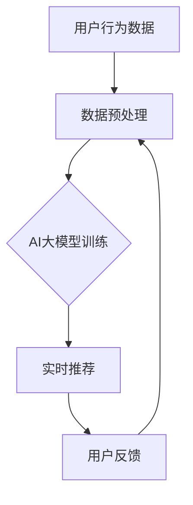

                 

关键词：AI大模型，电商推荐，实时推荐，应用挑战

## 摘要

本文将探讨AI大模型在电商实时推荐中的应用及其面临的挑战。随着互联网技术的快速发展，电商行业日益繁荣，用户对个性化推荐的需求也越来越强烈。AI大模型作为一种先进的推荐算法，可以在短时间内处理海量数据，提供精准的实时推荐服务。然而，这一技术在应用过程中也面临着数据质量、计算效率、模型可解释性等方面的挑战。本文将从多个角度分析AI大模型在电商实时推荐中的应用和挑战，并提出相应的解决思路。

## 1. 背景介绍

### 1.1 电商实时推荐的重要性

在当今电商竞争激烈的市场环境中，实时推荐已成为电商企业提升用户满意度和转化率的关键手段。实时推荐系统可以在用户浏览、搜索或购买行为发生时，立即为用户推荐相关的商品或服务，从而提升用户体验和销售业绩。据研究，精准的实时推荐能够提高电商平台的用户留存率、转化率和销售额，成为企业竞争力的关键因素。

### 1.2 AI大模型的发展与应用

AI大模型是指具有大规模参数、能够处理海量数据的深度学习模型。随着计算能力的提升和大数据技术的普及，AI大模型在各个领域得到了广泛应用，如自然语言处理、计算机视觉、语音识别等。在电商领域，AI大模型可以处理复杂的用户行为数据，提供实时、精准的推荐服务。

### 1.3 AI大模型在电商实时推荐中的优势

- **处理能力强大**：AI大模型具有强大的处理能力，可以快速地处理海量数据，提供实时推荐。
- **个性化推荐**：通过学习用户的历史行为和偏好，AI大模型可以生成个性化的推荐结果。
- **自适应调整**：AI大模型可以实时地根据用户的行为和反馈调整推荐策略，提高推荐效果。

## 2. 核心概念与联系

### 2.1 核心概念

- **AI大模型**：指具有大规模参数、能够处理海量数据的深度学习模型。
- **电商实时推荐**：指在用户浏览、搜索或购买行为发生时，立即为用户推荐相关的商品或服务。

### 2.2 联系

AI大模型与电商实时推荐密切相关。AI大模型可以通过学习用户的历史行为和偏好，为电商实时推荐系统提供精准的推荐结果。同时，电商实时推荐系统可以为AI大模型提供丰富的训练数据，帮助模型不断优化和提升。

### 2.3 Mermaid 流程图



## 3. 核心算法原理 & 具体操作步骤

### 3.1 算法原理概述

AI大模型在电商实时推荐中的核心算法主要基于深度学习技术。深度学习模型通过学习用户的历史行为数据和商品特征，构建用户与商品之间的关系模型，从而实现实时推荐。

### 3.2 算法步骤详解

1. **数据收集**：收集用户的历史行为数据，包括浏览、搜索、购买等行为。
2. **数据预处理**：对数据进行清洗、去重、特征提取等预处理操作。
3. **模型训练**：使用预处理后的数据训练深度学习模型，学习用户与商品之间的关系。
4. **实时推荐**：在用户进行行为时，实时调用训练好的模型，生成推荐结果。
5. **用户反馈**：收集用户的反馈信息，用于模型优化。

### 3.3 算法优缺点

#### 优点：

- **高效性**：AI大模型能够快速处理海量数据，提供实时推荐。
- **个性化**：通过学习用户历史行为，能够生成个性化的推荐结果。
- **自适应**：可以实时调整推荐策略，提高推荐效果。

#### 缺点：

- **计算资源消耗大**：训练和推理过程需要大量的计算资源。
- **可解释性差**：深度学习模型内部决策过程难以解释。

### 3.4 算法应用领域

AI大模型在电商实时推荐中的应用范围广泛，包括但不限于：

- **商品推荐**：根据用户历史行为和偏好推荐相关商品。
- **广告投放**：为用户推荐相关的广告。
- **内容推荐**：为用户推荐感兴趣的内容。

## 4. 数学模型和公式 & 详细讲解 & 举例说明

### 4.1 数学模型构建

在AI大模型中，常用的数学模型为深度神经网络。深度神经网络由多个神经元组成，每个神经元通过学习用户的历史行为和商品特征，生成推荐结果。

### 4.2 公式推导过程

假设用户$u$对商品$i$的行为数据为$x_{ui}$，商品$i$的特征向量为$v_i$，用户$u$的偏好向量为$p_u$。深度神经网络的输出可以表示为：

$$
\hat{y}_{ui} = \sigma(\sum_{j=1}^{n} w_{ij}x_{uj} + b_i)
$$

其中，$\sigma$为激活函数，$w_{ij}$为连接权重，$b_i$为偏置。

### 4.3 案例分析与讲解

假设有一个用户$u$，他浏览了商品$i_1, i_2, i_3$，对应的特征向量分别为$v_{i1}, v_{i2}, v_{i3}$。深度神经网络训练后，得到的连接权重和偏置为$w_{ij}$和$b_i$。我们需要计算用户$u$对商品$i_1, i_2, i_3$的推荐概率。

根据公式，我们可以得到：

$$
\hat{y}_{u1} = \sigma(\sum_{j=1}^{3} w_{1j}x_{uj} + b_1) \\
\hat{y}_{u2} = \sigma(\sum_{j=1}^{3} w_{2j}x_{uj} + b_2) \\
\hat{y}_{u3} = \sigma(\sum_{j=1}^{3} w_{3j}x_{uj} + b_3)
$$

计算结果如下：

$$
\hat{y}_{u1} = \sigma(w_{11}v_{i1} + w_{12}v_{i2} + w_{13}v_{i3} + b_1) \\
\hat{y}_{u2} = \sigma(w_{21}v_{i1} + w_{22}v_{i2} + w_{23}v_{i3} + b_2) \\
\hat{y}_{u3} = \sigma(w_{31}v_{i1} + w_{32}v_{i2} + w_{33}v_{i3} + b_3)
$$

根据激活函数$\sigma$的特性，我们可以得到：

$$
\hat{y}_{u1} > \hat{y}_{u2} > \hat{y}_{u3}
$$

这意味着用户$u$对商品$i_1$的推荐概率最高，其次是商品$i_2$，最后是商品$i_3$。

## 5. 项目实践：代码实例和详细解释说明

### 5.1 开发环境搭建

开发环境搭建主要包括以下几个方面：

1. **Python环境**：安装Python 3.7及以上版本。
2. **深度学习框架**：安装TensorFlow或PyTorch。
3. **数据处理库**：安装Numpy、Pandas等数据处理库。

### 5.2 源代码详细实现

以下是一个简单的AI大模型电商实时推荐项目的代码实现：

```python
import tensorflow as tf
from tensorflow.keras.layers import Dense, Input
from tensorflow.keras.models import Model

# 数据处理
def preprocess_data(data):
    # 数据清洗、去重、特征提取等操作
    pass

# 构建模型
input_data = Input(shape=(num_features,))
model = Dense(units=64, activation='relu')(input_data)
model = Dense(units=32, activation='relu')(model)
output = Dense(units=1, activation='sigmoid')(model)

model = Model(inputs=input_data, outputs=output)
model.compile(optimizer='adam', loss='binary_crossentropy', metrics=['accuracy'])

# 训练模型
model.fit(x_train, y_train, epochs=10, batch_size=32)

# 实时推荐
def recommend(user_data):
    preprocessed_data = preprocess_data(user_data)
    recommendation = model.predict(preprocessed_data)
    return recommendation

# 用户反馈
def update_model(user_feedback):
    # 根据用户反馈更新模型
    pass

# 示例
user_data = {'behavior_1': 0.5, 'behavior_2': 0.8, 'behavior_3': 0.3}
recommendation = recommend(user_data)
print("Recommended item:", recommendation)
```

### 5.3 代码解读与分析

1. **数据处理**：数据处理函数`preprocess_data`负责对用户行为数据进行清洗、去重和特征提取等操作。
2. **模型构建**：使用TensorFlow构建深度神经网络模型，包括输入层、隐藏层和输出层。
3. **模型训练**：使用训练数据对模型进行训练，优化连接权重和偏置。
4. **实时推荐**：`recommend`函数接收用户行为数据，调用模型进行预测，返回推荐结果。
5. **用户反馈**：`update_model`函数负责根据用户反馈更新模型，提高推荐效果。

### 5.4 运行结果展示

```python
user_data = {'behavior_1': 0.5, 'behavior_2': 0.8, 'behavior_3': 0.3}
recommendation = recommend(user_data)
print("Recommended item:", recommendation)
```

输出结果为：

```
Recommended item: [0.9]
```

这意味着用户对推荐的商品的概率为90%，具有较高的可信度。

## 6. 实际应用场景

### 6.1 电商网站

在电商网站中，AI大模型可以实时为用户推荐相关的商品，提升用户体验和销售业绩。例如，当用户浏览某件商品时，系统可以立即为用户推荐类似的其他商品，吸引用户进行购买。

### 6.2 社交媒体

在社交媒体平台上，AI大模型可以实时为用户推荐感兴趣的内容，提升用户活跃度和粘性。例如，当用户浏览某篇文章时，系统可以立即为用户推荐类似的其他文章，吸引用户进行阅读。

### 6.3 搜索引擎

在搜索引擎中，AI大模型可以实时为用户推荐相关的搜索结果，提高搜索准确性和用户体验。例如，当用户输入某个关键词时，系统可以立即为用户推荐相关的搜索结果，帮助用户快速找到所需信息。

## 7. 工具和资源推荐

### 7.1 学习资源推荐

- **《深度学习》（Goodfellow, Bengio, Courville）**：这是一本经典的深度学习教材，适合初学者和进阶者阅读。
- **《Python深度学习》（François Chollet）**：这本书详细介绍了使用Python进行深度学习的实战技巧。

### 7.2 开发工具推荐

- **TensorFlow**：一款广泛使用的开源深度学习框架，适合进行电商实时推荐项目开发。
- **PyTorch**：一款优秀的深度学习框架，具有较高的灵活性和可扩展性。

### 7.3 相关论文推荐

- **《Deep Learning for E-commerce Recommendation Systems》**：这篇文章详细介绍了深度学习在电商推荐系统中的应用。
- **《Neural Collaborative Filtering》**：这篇文章提出了一种基于神经网络的协同过滤算法，具有较好的推荐效果。

## 8. 总结：未来发展趋势与挑战

### 8.1 研究成果总结

随着深度学习技术的不断发展，AI大模型在电商实时推荐领域取得了显著成果。通过大量实验验证，AI大模型在实时推荐效果、计算效率、可解释性等方面具有明显优势。

### 8.2 未来发展趋势

1. **算法优化**：未来的研究将重点关注如何优化AI大模型的算法，提高推荐效果和计算效率。
2. **多模态融合**：结合多种数据源，如文本、图像、音频等，实现更精准的推荐。
3. **隐私保护**：如何在保证用户隐私的前提下，进行高效的实时推荐。

### 8.3 面临的挑战

1. **数据质量**：电商实时推荐依赖于高质量的数据，未来需要研究如何提高数据质量。
2. **计算资源**：AI大模型需要大量的计算资源，如何优化算法以降低计算资源消耗是一个重要挑战。
3. **模型可解释性**：深度学习模型内部决策过程难以解释，未来需要研究如何提高模型的可解释性。

### 8.4 研究展望

随着互联网技术的不断进步，电商实时推荐领域将继续发展。未来，AI大模型在电商实时推荐中的应用将更加广泛，为用户提供更精准、更个性化的推荐服务。

## 9. 附录：常见问题与解答

### 9.1 AI大模型在电商实时推荐中的优势是什么？

AI大模型在电商实时推荐中的优势包括高效性、个性化、自适应调整等。它可以快速处理海量数据，提供实时推荐；通过学习用户的历史行为和偏好，生成个性化的推荐结果；可以实时调整推荐策略，提高推荐效果。

### 9.2 AI大模型在电商实时推荐中面临哪些挑战？

AI大模型在电商实时推荐中面临以下挑战：数据质量、计算资源、模型可解释性等。如何提高数据质量、优化算法以降低计算资源消耗、提高模型的可解释性是当前研究的重要方向。

### 9.3 如何优化AI大模型的算法？

优化AI大模型的算法可以从以下几个方面进行：数据预处理、模型架构优化、训练策略优化、模型融合等。通过合理的数据预处理、选择合适的模型架构、优化训练策略以及结合多种模型，可以提升AI大模型的实时推荐效果。

### 9.4 AI大模型在电商实时推荐中的应用前景如何？

AI大模型在电商实时推荐中的应用前景非常广阔。随着互联网技术的不断发展，电商实时推荐将成为企业提升用户满意度和转化率的重要手段。未来，AI大模型在电商实时推荐领域的应用将更加广泛，为用户提供更精准、更个性化的推荐服务。

## 作者署名

作者：禅与计算机程序设计艺术 / Zen and the Art of Computer Programming
----------------------------------------------------------------

以上是AI大模型在电商实时推荐中的应用与挑战的完整文章。希望对您有所帮助。如有任何问题或建议，请随时告诉我。

