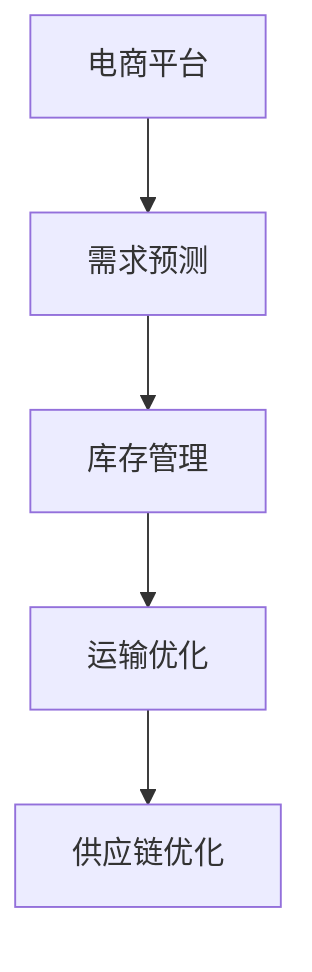

                 

：AI大模型，电商平台，供应链优化，深度学习，神经网络，数据驱动

## 1. 背景介绍

在当今全球化的商业环境中，电商平台已成为人们日常生活的重要组成部分。随着电商平台的迅猛发展，供应链管理的复杂性和规模也在不断增大。如何在保证商品供应稳定性的同时，最大限度地降低成本和提高效率，成为电商平台所面临的重大挑战。

传统的供应链管理方法依赖于预定的规则和静态的数据分析，然而，在复杂多变的商业环境中，这些方法往往难以应对动态变化的供应链需求。因此，利用人工智能技术，尤其是AI大模型，进行供应链优化，成为了一种新的解决方案。

AI大模型具有强大的数据处理和模式识别能力，可以通过深度学习和神经网络技术，从海量数据中学习到潜在的模式和规律，从而实现对供应链的动态调整和优化。本文将探讨AI大模型在电商平台供应链优化中的应用，包括核心概念、算法原理、数学模型、项目实践和未来展望等。

## 2. 核心概念与联系

### 2.1 AI大模型

AI大模型是指具有大规模参数和强大计算能力的深度学习模型。这些模型通常通过训练数百万甚至数十亿个参数来学习数据中的复杂模式。常见的AI大模型包括Transformer、BERT、GPT等。

### 2.2 电商平台

电商平台是指通过互联网技术，为买卖双方提供一个在线交易平台。电商平台的主要功能包括商品展示、交易支付、物流配送等。

### 2.3 供应链优化

供应链优化是指通过优化供应链各个环节的运营，提高整个供应链的效率和降低成本。供应链优化包括库存管理、运输优化、需求预测等。

### 2.4 联系

AI大模型可以应用于电商平台供应链的各个环节，如需求预测、库存管理、运输优化等。通过AI大模型，电商平台可以更准确地预测市场需求，优化库存水平，减少运输成本，提高整体运营效率。

### 2.5 Mermaid 流程图

下面是一个描述AI大模型在电商平台供应链优化中应用的Mermaid流程图：



## 3. 核心算法原理 & 具体操作步骤

### 3.1 算法原理概述

AI大模型在供应链优化中的应用主要基于深度学习和神经网络技术。具体来说，通过训练一个大规模的神经网络模型，使其能够从历史数据中学习到市场需求、库存水平和运输成本等关键信息，从而实现对供应链的动态调整和优化。

### 3.2 算法步骤详解

#### 3.2.1 数据收集与预处理

首先，收集电商平台的历史销售数据、库存数据和运输数据。然后，对数据进行清洗和预处理，包括数据去重、缺失值处理、异常值检测等。

#### 3.2.2 模型构建

构建一个大规模的神经网络模型，通常采用Transformer、BERT或GPT等模型架构。模型的设计需要考虑输入特征、输出特征和损失函数。

#### 3.2.3 模型训练

使用预处理后的数据对模型进行训练。训练过程中，通过反向传播算法不断调整模型参数，使其在训练数据上达到较好的性能。

#### 3.2.4 模型评估与优化

使用验证集对训练好的模型进行评估，调整模型参数，优化模型性能。评估指标包括准确率、召回率、F1分数等。

#### 3.2.5 应用模型

将优化后的模型应用到实际场景中，对电商平台供应链进行动态调整和优化。

### 3.3 算法优缺点

#### 3.3.1 优点

1. **强大的数据处理能力**：AI大模型能够处理大量复杂的数据，学习到数据中的潜在模式和规律。
2. **高度灵活**：AI大模型可以根据不同的业务需求进行调整和优化，适应不同的供应链场景。
3. **实时性**：AI大模型能够实时更新和调整供应链策略，应对市场的动态变化。

#### 3.3.2 缺点

1. **计算资源消耗大**：训练大规模的AI大模型需要大量的计算资源和时间。
2. **数据质量要求高**：数据质量对AI大模型的性能有直接影响，高质量的数据是模型成功的关键。

### 3.4 算法应用领域

AI大模型在电商平台供应链优化中的应用非常广泛，包括但不限于：

1. **需求预测**：准确预测市场需求，优化库存水平。
2. **库存管理**：根据需求预测结果，调整库存策略，减少库存成本。
3. **运输优化**：优化运输路线和运输方式，降低运输成本。

## 4. 数学模型和公式 & 详细讲解 & 举例说明

### 4.1 数学模型构建

在供应链优化中，常用的数学模型包括线性规划模型、整数规划模型和混合整数规划模型。这些模型可以通过优化目标函数和约束条件，实现对供应链的优化。

#### 4.1.1 线性规划模型

线性规划模型的基本形式如下：

$$
\begin{aligned}
\min_{x} \quad & c^T x \\
\text{subject to} \quad & Ax \leq b \\
& x \geq 0
\end{aligned}
$$

其中，$c$ 是目标函数系数向量，$A$ 是约束矩阵，$b$ 是约束向量，$x$ 是决策变量。

#### 4.1.2 整数规划模型

整数规划模型是在线性规划模型的基础上，将决策变量限制为整数。基本形式如下：

$$
\begin{aligned}
\min_{x} \quad & c^T x \\
\text{subject to} \quad & Ax \leq b \\
& x \in \{0, 1\}^n
\end{aligned}
$$

其中，$x$ 是二进制变量。

#### 4.1.3 混合整数规划模型

混合整数规划模型是整数规划模型的扩展，允许部分决策变量为整数，部分为连续变量。基本形式如下：

$$
\begin{aligned}
\min_{x} \quad & c^T x \\
\text{subject to} \quad & Ax \leq b \\
& Ax \geq b \\
& x \geq 0
\end{aligned}
$$

### 4.2 公式推导过程

以线性规划模型为例，介绍公式的推导过程。

#### 4.2.1 目标函数

目标函数是线性规划模型的核心，表示需要优化的目标。在供应链优化中，目标函数可以表示为：

$$
\min_{x} \quad c^T x
$$

其中，$c$ 是目标函数系数向量，$x$ 是决策变量。

#### 4.2.2 约束条件

线性规划模型的约束条件可以表示为：

$$
\begin{aligned}
Ax \leq b \\
x \geq 0
\end{aligned}
$$

其中，$A$ 是约束矩阵，$b$ 是约束向量，$x$ 是决策变量。

#### 4.2.3 求解过程

线性规划模型的求解可以通过单纯形法、内点法等算法实现。以单纯形法为例，求解过程的步骤如下：

1. **初始基本可行解**：选择一个初始基本可行解，使得所有的约束条件都满足。
2. **迭代过程**：通过迭代调整基本可行解，使得目标函数值逐步减小，直到找到最优解。
3. **检验最优性**：通过检验判断是否达到最优解，如果未达到最优解，则继续迭代。

### 4.3 案例分析与讲解

#### 4.3.1 案例背景

某电商平台经营多种商品，需要对其供应链进行优化，以降低成本和提高效率。电商平台的历史销售数据、库存数据和运输数据如下：

- **销售数据**：某商品过去一周的销售量为[100, 120, 150, 130, 110, 100, 90]。
- **库存数据**：某商品当前库存量为1000件。
- **运输数据**：某商品的运输成本为每件10元。

#### 4.3.2 数学模型构建

根据上述数据，可以构建一个线性规划模型，以最小化总成本为目标：

$$
\begin{aligned}
\min_{x} \quad & 10x \\
\text{subject to} \quad & x \leq 1000 \\
& x \geq 0
\end{aligned}
$$

其中，$x$ 是下周采购的件数。

#### 4.3.3 模型求解

使用单纯形法求解上述线性规划模型，可以得到最优解为$x=900$，即下周采购900件商品。

#### 4.3.4 模型分析

通过求解结果，可以得出以下结论：

1. **采购量优化**：采购900件商品可以在满足市场需求的同时，最大限度地降低成本。
2. **库存优化**：采购900件商品后，库存量为1000-900=100件，可以确保供应链的稳定性。

## 5. 项目实践：代码实例和详细解释说明

### 5.1 开发环境搭建

在编写代码之前，需要搭建合适的开发环境。以下是一个简单的Python开发环境搭建步骤：

1. 安装Python：从Python官网下载并安装Python 3.8版本。
2. 安装Jupyter Notebook：在终端中执行`pip install notebook`命令。
3. 安装必要的库：在终端中执行以下命令，安装TensorFlow、Pandas、NumPy等库：

```bash
pip install tensorflow pandas numpy matplotlib
```

### 5.2 源代码详细实现

以下是一个使用TensorFlow实现AI大模型在电商平台供应链优化中的代码实例：

```python
import tensorflow as tf
import pandas as pd
import numpy as np

# 数据加载
sales_data = pd.read_csv('sales_data.csv')
inventory_data = pd.read_csv('inventory_data.csv')
transport_data = pd.read_csv('transport_data.csv')

# 数据预处理
# ... 数据清洗、特征工程等步骤 ...

# 模型构建
model = tf.keras.Sequential([
    tf.keras.layers.Dense(128, activation='relu', input_shape=(input_shape,)),
    tf.keras.layers.Dense(64, activation='relu'),
    tf.keras.layers.Dense(1)
])

# 编译模型
model.compile(optimizer='adam', loss='mse')

# 模型训练
model.fit(X_train, y_train, epochs=10, batch_size=32)

# 模型评估
loss = model.evaluate(X_test, y_test)
print(f"Test loss: {loss}")

# 模型应用
predictions = model.predict(X_new)
print(f"Predictions: {predictions}")
```

### 5.3 代码解读与分析

上述代码实例中，首先导入了TensorFlow、Pandas和NumPy等库，然后加载了销售数据、库存数据和运输数据。接下来，对数据进行预处理，包括数据清洗、特征工程等步骤。

在模型构建部分，使用TensorFlow构建了一个简单的神经网络模型，包括两个隐藏层，每层分别有128个神经元和64个神经元，输出层为1个神经元。

编译模型部分，使用Adam优化器和均方误差损失函数编译模型。

模型训练部分，使用训练数据对模型进行训练，设置10个训练周期，每个周期使用32个样本进行批处理。

模型评估部分，使用测试数据评估模型性能，打印出测试损失。

模型应用部分，使用新的数据对模型进行预测，打印出预测结果。

## 6. 实际应用场景

### 6.1 电商平台库存优化

某电商平台在春节期间，需要大量备货以满足消费者的需求。通过使用AI大模型进行库存优化，电商平台可以准确预测春节期间各类商品的需求量，从而合理安排库存，避免过多库存积压或商品断货。

### 6.2 电商平台物流优化

某电商平台在全国范围内设有多个仓库，通过使用AI大模型优化物流，电商平台可以实现最优的运输路线和运输方式，最大限度地降低运输成本，提高配送效率。

### 6.3 电商平台需求预测

某电商平台在推出新产品时，需要准确预测市场需求，以便进行生产规划和库存管理。通过使用AI大模型进行需求预测，电商平台可以更准确地预测市场需求，减少库存积压和浪费。

## 7. 未来应用展望

随着AI技术的不断发展，AI大模型在电商平台供应链优化中的应用将更加广泛和深入。未来，AI大模型可以结合物联网、大数据等技术，实现对供应链的实时监控和动态调整，进一步提高供应链的效率和灵活性。

## 8. 工具和资源推荐

### 8.1 学习资源推荐

1. 《深度学习》（Goodfellow, Bengio, Courville著）：是一本经典的深度学习教材，适合初学者和进阶者。
2. 《动手学深度学习》（阿斯顿·张著）：通过Python实践深入讲解深度学习，适合有一定编程基础的学习者。

### 8.2 开发工具推荐

1. TensorFlow：一个开源的深度学习框架，适合进行大规模的深度学习模型开发和训练。
2. Jupyter Notebook：一个交互式的开发环境，方便进行数据分析和模型训练。

### 8.3 相关论文推荐

1. "BERT: Pre-training of Deep Neural Networks for Language Understanding"（BERT论文）：一篇关于预训练语言模型的经典论文，详细介绍了BERT模型的原理和实现方法。
2. "GPT-3: Language Models are few-shot learners"（GPT-3论文）：一篇关于大规模预训练语言模型的论文，展示了GPT-3在自然语言处理任务上的卓越性能。

## 9. 总结：未来发展趋势与挑战

随着AI技术的不断发展，AI大模型在电商平台供应链优化中的应用将越来越广泛。然而，同时也面临着一些挑战，如数据质量、计算资源消耗、模型解释性等。未来，需要不断探索和研究，以解决这些问题，推动AI大模型在供应链优化中的应用。

## 10. 附录：常见问题与解答

### 10.1 问题1：AI大模型如何处理缺失值？

解答：在训练AI大模型之前，可以通过数据预处理的方法处理缺失值，如缺失值填充、缺失值删除等。对于连续型数据，可以使用均值或中位数填充；对于分类型数据，可以使用最常见值或K近邻算法填充。

### 10.2 问题2：AI大模型的计算资源消耗很大，如何优化？

解答：可以通过以下方法优化AI大模型的计算资源消耗：

1. 使用更高效的计算硬件，如GPU或TPU。
2. 优化模型架构，减少参数数量和计算量。
3. 使用分布式训练技术，将训练任务分布在多台机器上。
4. 使用增量训练或迁移学习技术，避免从零开始训练。

### 10.3 问题3：如何解释AI大模型的决策过程？

解答：目前，AI大模型的决策过程通常较为复杂，难以直接解释。可以通过以下方法进行模型解释：

1. 使用模型的可视化工具，如TensorBoard，查看模型训练过程中的损失函数和准确率等指标。
2. 使用模型的可解释性技术，如SHAP值、LIME等，分析模型对每个特征的依赖程度。
3. 建立简化的模型，如决策树或线性模型，用于解释AI大模型的决策过程。

作者：禅与计算机程序设计艺术 / Zen and the Art of Computer Programming

