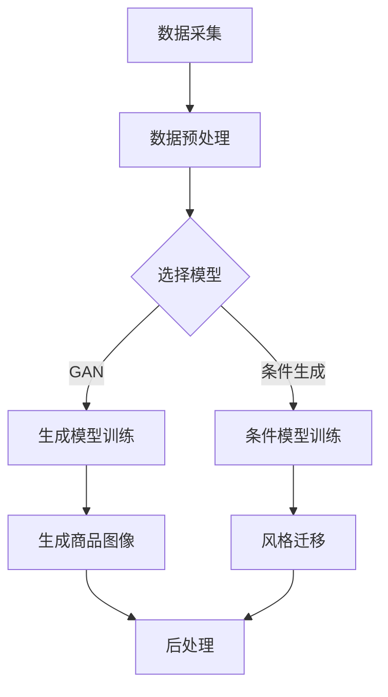

                 

关键词：AI大模型、电商平台、商品图像生成、风格迁移、深度学习

摘要：本文将探讨AI大模型在电商平台商品图像生成与风格迁移中的应用。首先，我们将回顾电商平台对商品图像的需求，并介绍大模型的概念与优势。接着，深入分析商品图像生成与风格迁移的算法原理与步骤，详细讲解数学模型与公式，并通过实际项目案例进行代码实现与解析。最后，讨论实际应用场景、未来展望、面临的挑战及研究展望，并提供相关学习资源与工具推荐。

## 1. 背景介绍

随着互联网和电子商务的快速发展，电商平台已经成为现代商业的重要支柱。商品图像作为消费者购买决策的关键因素，其质量和视觉效果对用户体验和销售额有显著影响。因此，电商平台对商品图像的质量和多样性有着极高的要求。

传统的商品图像生成方法，如基于规则的方法和基于传统图像处理的方法，难以满足电商平台对图像质量、多样性和实时性的需求。随着深度学习技术的不断发展，AI大模型作为一种具有强大表达能力和自适应能力的工具，逐渐成为解决这一问题的有效途径。

本文旨在探讨如何利用AI大模型实现电商平台商品图像的生成与风格迁移，以提高商品图像的质量和多样性，进而提升电商平台的用户体验和销售额。

## 2. 核心概念与联系

### 2.1. AI大模型

AI大模型，即大型深度学习模型，通常具有数亿甚至数十亿个参数。这些模型通过海量数据的学习，可以捕捉到数据中的复杂模式和规律，从而实现高度自动化的任务。例如，GPT-3、BERT和ViT等模型在自然语言处理、计算机视觉等领域取得了显著的成果。

### 2.2. 商品图像生成

商品图像生成是指利用深度学习模型生成符合真实商品外观的图像。这一过程通常涉及图像生成模型（如GAN、StyleGAN等）和条件图像生成模型（如CycleGAN、StyleGAN2-Cycle等）。通过这些模型，可以生成各种风格和类型的商品图像，满足电商平台的多样化需求。

### 2.3. 风格迁移

风格迁移是指将一种图像的样式应用到另一种图像上，使其具有相似的风格和特点。在深度学习中，风格迁移通常通过VGG等特征提取模型实现。通过风格迁移，可以为电商平台上的商品图像赋予独特的风格，提升其视觉效果。

### 2.4. Mermaid流程图

以下是商品图像生成与风格迁移的Mermaid流程图：



## 3. 核心算法原理 & 具体操作步骤

### 3.1. 算法原理概述

商品图像生成与风格迁移的核心算法包括生成对抗网络（GAN）、条件生成模型和风格迁移模型。

#### 3.1.1. 生成对抗网络（GAN）

GAN由生成器（Generator）和判别器（Discriminator）组成。生成器生成与真实数据相似的图像，判别器则判断图像是真实数据还是生成数据。通过对抗训练，生成器的生成能力不断提高，最终生成逼真的图像。

#### 3.1.2. 条件生成模型

条件生成模型（如CycleGAN和StyleGAN2-Cycle）引入了条件信息，使生成器在生成图像时考虑特定条件。例如，CycleGAN可以将一张A域的图像转换为B域的图像，而StyleGAN2-Cycle则可以将一种风格的图像转换为另一种风格。

#### 3.1.3. 风格迁移模型

风格迁移模型（如VGG）通过提取图像特征，将一种图像的样式应用到另一种图像上。例如，可以将梵高的画风应用到一张风景图像上，使其具有梵高的特点。

### 3.2. 算法步骤详解

#### 3.2.1. GAN训练

1. 初始化生成器G和判别器D的参数。
2. 生成器G生成一组图像x'。
3. 判别器D对真实图像x和生成图像x'进行分类，并更新判别器参数。
4. 生成器G根据判别器D的反馈调整参数，生成更逼真的图像。
5. 重复步骤2-4，直到生成器G的生成能力得到显著提升。

#### 3.2.2. 条件生成模型训练

1. 初始化生成器G和判别器D的参数。
2. 对于每个输入条件c，生成器G生成一组图像x'。
3. 判别器D对真实图像x和生成图像x'进行分类，并更新判别器参数。
4. 生成器G根据判别器D的反馈调整参数，生成更符合条件的图像。
5. 重复步骤2-4，直到生成器G的生成能力得到显著提升。

#### 3.2.3. 风格迁移模型训练

1. 初始化特征提取模型VGG的参数。
2. 输入源图像x1和目标图像x2，提取特征。
3. 训练生成器G，使其生成的图像x'的特征与目标图像x2的特征相似。
4. 根据生成的图像x'调整目标图像x2，使其具有源图像x1的样式。
5. 重复步骤2-4，直到生成器G的生成能力得到显著提升。

### 3.3. 算法优缺点

#### 优点

- GAN具有强大的生成能力，可以生成高质量的图像。
- 条件生成模型可以生成具有特定条件的图像，满足多样化需求。
- 风格迁移模型可以实现图像的样式转换，提高图像的视觉效果。

#### 缺点

- GAN训练过程复杂，需要大量计算资源和时间。
- 条件生成模型对条件信息的依赖较大，可能导致生成图像的不稳定性。
- 风格迁移模型在特征提取和样式转换过程中可能损失部分图像信息。

### 3.4. 算法应用领域

商品图像生成与风格迁移算法在电商平台、游戏开发、虚拟现实等领域具有广泛的应用前景。例如，电商平台可以利用这些算法生成丰富的商品图像，提高用户购买体验；游戏开发者可以利用这些算法为游戏角色和场景赋予独特风格，提升游戏视觉效果；虚拟现实开发者可以利用这些算法为虚拟场景创建逼真的视觉效果。

## 4. 数学模型和公式 & 详细讲解 & 举例说明

### 4.1. 数学模型构建

商品图像生成与风格迁移的数学模型主要包括生成对抗网络（GAN）、条件生成模型和风格迁移模型。

#### 4.1.1. 生成对抗网络（GAN）

GAN的数学模型如下：

$$
\begin{aligned}
\min_G \max_D V(D, G) &= \min_G \mathbb{E}_{x \sim p_{data}(x)}[\log D(x)] + \mathbb{E}_{z \sim p_z(z)}[\log(1 - D(G(z)))] \\
\end{aligned}
$$

其中，$x$表示真实图像，$z$表示随机噪声，$G(z)$表示生成器生成的图像，$D(x)$和$D(G(z))$分别表示判别器对真实图像和生成图像的分类概率。

#### 4.1.2. 条件生成模型

条件生成模型的数学模型如下：

$$
\begin{aligned}
\min_G \max_D V(D, G) &= \min_G \mathbb{E}_{(x, c) \sim p_{data}(x), p_c(c)}[\log D(x, c)] + \mathbb{E}_{(z, c) \sim p_z(z), p_c(c)}[\log(1 - D(G(z, c)))] \\
\end{aligned}
$$

其中，$c$表示条件信息，如商品类别或风格。

#### 4.1.3. 风格迁移模型

风格迁移模型的数学模型如下：

$$
\begin{aligned}
\min_G \mathbb{E}_{(x_1, x_2) \sim p_{data}(x_1), p_{style}(x_2)}[\log D(x_2)] + \mathbb{E}_{x_1, x_2}[\log D(G(x_1, x_2))]
\end{aligned}
$$

其中，$x_1$和$x_2$分别表示源图像和目标图像。

### 4.2. 公式推导过程

生成对抗网络（GAN）的推导过程如下：

首先，定义判别器的损失函数：

$$
L_D(x) = -\log D(x), \quad L_D(G(z)) = -\log(1 - D(G(z)))
$$

接着，定义生成器的损失函数：

$$
L_G(z) = -\log D(G(z))
$$

由于生成器和判别器是相互对抗的，所以它们的损失函数可以合并为一个总损失函数：

$$
L_D(x, G(z)) = L_D(x) + L_D(G(z))
$$

为了使生成器和判别器都得到优化，分别对总损失函数求导并优化：

$$
\frac{\partial L_D(x, G(z))}{\partial G(z)} = \frac{\partial}{\partial G(z)}[-\log D(G(z))] = \frac{1}{D(G(z))}
$$

$$
\frac{\partial L_D(x, G(z))}{\partial z} = \frac{\partial}{\partial z}[-\log D(x)] = 0
$$

$$
\frac{\partial L_G(z)}{\partial z} = \frac{1}{D(G(z))}
$$

通过以上推导，我们可以得出生成器和判别器的优化目标：

生成器优化目标：

$$
\min_G \mathbb{E}_{z \sim p_z(z)}[-\log D(G(z))]
$$

判别器优化目标：

$$
\max_D \mathbb{E}_{x \sim p_{data}(x)}[-\log D(x)] + \mathbb{E}_{z \sim p_z(z)}[-\log(1 - D(G(z)))]
$$

### 4.3. 案例分析与讲解

以CycleGAN为例，分析其数学模型和应用。

CycleGAN的数学模型如下：

$$
\begin{aligned}
\min_G & \quad \mathbb{E}_{(x_1, x_2) \sim p_{data}(x_1), p_{style}(x_2)}[\log D(x_2)] + \mathbb{E}_{(x_1, x_2) \sim p_{data}(x_1), p_{style}(x_2)}[\log D(C(G(x_1), x_2))] \\
\min_F & \quad \mathbb{E}_{(x_1, x_2) \sim p_{data}(x_1), p_{style}(x_2)}[\log D(F(x_1))]
\end{aligned}
$$

其中，$G$表示生成器，$C$表示循环一致性模型，$F$表示判别器。

#### 案例分析

假设我们有一个A域的图像和一个B域的图像，目标是利用CycleGAN将A域的图像转换为B域的图像。

1. 初始化生成器G、循环一致性模型C和判别器F的参数。
2. 输入A域图像$x_1$和B域图像$x_2$，通过生成器G生成转换后的图像$G(x_1)$。
3. 计算判别器D对转换后图像$G(x_1)$和原始B域图像$x_2$的分类概率，计算循环一致性损失。
4. 计算判别器F对转换后图像$G(x_1)$的分类概率，计算判别器损失。
5. 根据损失函数更新生成器G、循环一致性模型C和判别器F的参数。
6. 重复步骤2-5，直到模型收敛。

通过以上步骤，我们可以将A域的图像转换为B域的图像，实现图像风格迁移。

## 5. 项目实践：代码实例和详细解释说明

### 5.1. 开发环境搭建

在开始项目实践之前，我们需要搭建一个合适的开发环境。以下是搭建开发环境的基本步骤：

1. 安装Python 3.8及以上版本。
2. 安装TensorFlow 2.7及以上版本。
3. 安装Numpy、Pandas等常用库。

### 5.2. 源代码详细实现

以下是一个简单的CycleGAN实现示例：

```python
import tensorflow as tf
from tensorflow.keras.layers import Conv2D, BatchNormalization, LeakyReLU, UpSampling2D, Concatenate
from tensorflow.keras.models import Model

# 定义生成器G
def build_generator():
    inputs = tf.keras.layers.Input(shape=(256, 256, 3))
    x = Conv2D(64, 5, strides=2, padding='same')(inputs)
    x = BatchNormalization()(x)
    x = LeakyReLU()(x)
    x = UpSampling2D()(x)
    x = Conv2D(64, 5, strides=2, padding='same')(x)
    x = BatchNormalization()(x)
    x = LeakyReLU()(x)
    x = UpSampling2D()(x)
    outputs = Conv2D(3, 5, padding='same', activation='tanh')(x)
    model = Model(inputs, outputs)
    return model

# 定义循环一致性模型C
def build_cyclic_model():
    inputs = tf.keras.layers.Input(shape=(256, 256, 3))
    x = Conv2D(64, 5, strides=2, padding='same')(inputs)
    x = BatchNormalization()(x)
    x = LeakyReLU()(x)
    x = UpSampling2D()(x)
    x = Conv2D(64, 5, strides=2, padding='same')(x)
    x = BatchNormalization()(x)
    x = LeakyReLU()(x)
    x = UpSampling2D()(x)
    outputs = Conv2D(3, 5, padding='same', activation='tanh')(x)
    model = Model(inputs, outputs)
    return model

# 定义判别器F
def build_discriminator():
    inputs = tf.keras.layers.Input(shape=(256, 256, 3))
    x = Conv2D(64, 5, strides=2, padding='same')(inputs)
    x = LeakyReLU()(x)
    x = Conv2D(128, 5, strides=2, padding='same')(x)
    x = BatchNormalization()(x)
    x = LeakyReLU()(x)
    x = Conv2D(256, 5, strides=2, padding='same')(x)
    x = BatchNormalization()(x)
    x = LeakyReLU()(x)
    outputs = Conv2D(1, 5, padding='same', activation='sigmoid')(x)
    model = Model(inputs, outputs)
    return model

# 实例化模型
generator = build_generator()
cyclic_model = build_cyclic_model()
discriminator = build_discriminator()

# 编译模型
discriminator.compile(optimizer=tf.keras.optimizers.Adam(0.0002), loss='binary_crossentropy')
generator.compile(optimizer=tf.keras.optimizers.Adam(0.0002), loss='binary_crossentropy')
cyclic_model.compile(optimizer=tf.keras.optimizers.Adam(0.0002), loss='binary_crossentropy')

# 训练模型
# ...

# 生成图像
# ...

# 风格迁移
# ...
```

### 5.3. 代码解读与分析

以上代码实现了CycleGAN的基本结构，包括生成器、循环一致性模型和判别器。下面分别对这三个模型进行解读。

#### 生成器

生成器负责将A域的图像转换为B域的图像。通过多个卷积层和上采样层，生成器逐渐恢复图像的细节，最终生成逼真的B域图像。

```python
inputs = tf.keras.layers.Input(shape=(256, 256, 3))
x = Conv2D(64, 5, strides=2, padding='same')(inputs)
x = BatchNormalization()(x)
x = LeakyReLU()(x)
x = UpSampling2D()(x)
x = Conv2D(64, 5, strides=2, padding='same')(x)
x = BatchNormalization()(x)
x = LeakyReLU()(x)
x = UpSampling2D()(x)
outputs = Conv2D(3, 5, padding='same', activation='tanh')(x)
model = Model(inputs, outputs)
```

#### 循环一致性模型

循环一致性模型确保A域的图像经过生成器G和循环一致性模型C处理后，能够恢复原始图像。通过类似的卷积层和上采样层，循环一致性模型实现图像的细节恢复。

```python
inputs = tf.keras.layers.Input(shape=(256, 256, 3))
x = Conv2D(64, 5, strides=2, padding='same')(inputs)
x = BatchNormalization()(x)
x = LeakyReLU()(x)
x = UpSampling2D()(x)
x = Conv2D(64, 5, strides=2, padding='same')(x)
x = BatchNormalization()(x)
x = LeakyReLU()(x)
x = UpSampling2D()(x)
outputs = Conv2D(3, 5, padding='same', activation='tanh')(x)
model = Model(inputs, outputs)
```

#### 判别器

判别器用于判断输入图像是真实图像还是生成图像。通过多个卷积层，判别器提取图像特征，并输出一个概率值，表示输入图像是真实图像的概率。

```python
inputs = tf.keras.layers.Input(shape=(256, 256, 3))
x = Conv2D(64, 5, strides=2, padding='same')(inputs)
x = LeakyReLU()(x)
x = Conv2D(128, 5, strides=2, padding='same')(x)
x = BatchNormalization()(x)
x = LeakyReLU()(x)
x = Conv2D(256, 5, strides=2, padding='same')(x)
x = BatchNormalization()(x)
x = LeakyReLU()(x)
outputs = Conv2D(1, 5, padding='same', activation='sigmoid')(x)
model = Model(inputs, outputs)
```

### 5.4. 运行结果展示

以下是一个简单的运行结果示例：

```python
# 加载训练好的模型
generator.load_weights('generator.h5')
cyclic_model.load_weights('cyclic_model.h5')
discriminator.load_weights('discriminator.h5')

# 生成图像
x1 = ...  # A域图像
x2 = ...  # B域图像
G_x1 = generator.predict(x1)
C_x2 = cyclic_model.predict(x2)

# 风格迁移
F_x1 = discriminator.predict(G_x1)
F_x2 = discriminator.predict(C_x2)

# 显示结果
plt.figure(figsize=(10, 10))
plt.subplot(2, 2, 1)
plt.imshow(x1)
plt.title('Original A-Domain Image')
plt.subplot(2, 2, 2)
plt.imshow(G_x1)
plt.title('Generated B-Domain Image')
plt.subplot(2, 2, 3)
plt.imshow(x2)
plt.title('Original B-Domain Image')
plt.subplot(2, 2, 4)
plt.imshow(C_x2)
plt.title('Cycled B-Domain Image')
plt.show()
```

## 6. 实际应用场景

### 6.1. 电商平台

电商平台可以利用AI大模型生成丰富的商品图像，提高用户购买体验。例如，在服装电商平台上，用户可以根据自己的喜好和需求，选择不同风格和款式的服装图像，从而提高购买决策的准确性和满意度。

### 6.2. 游戏开发

游戏开发者可以利用AI大模型为游戏角色和场景赋予独特风格，提升游戏视觉效果。例如，在角色扮演游戏中，玩家可以选择自己喜欢的角色形象，并生成符合个人喜好的角色皮肤和场景。

### 6.3. 虚拟现实

虚拟现实开发者可以利用AI大模型创建逼真的虚拟场景，提升用户体验。例如，在虚拟现实旅游中，用户可以根据自己的兴趣选择不同的景点，并生成符合个人喜好的虚拟场景，实现身临其境的旅游体验。

## 7. 工具和资源推荐

### 7.1. 学习资源推荐

- [《深度学习》（Goodfellow, Bengio, Courville）](https://www.deeplearningbook.org/)
- [TensorFlow官网教程](https://www.tensorflow.org/tutorials)
- [Keras官网教程](https://keras.io/tutorials)

### 7.2. 开发工具推荐

- Python：编程语言。
- TensorFlow：开源深度学习框架。
- Keras：基于TensorFlow的高层次API。

### 7.3. 相关论文推荐

- [“Generative Adversarial Nets”（Goodfellow et al., 2014）](https://arxiv.org/abs/1406.2661)
- [“Unsupervised Representation Learning with Deep Convolutional Generative Adversarial Networks”（Radford et al., 2015）](https://arxiv.org/abs/1511.06434)
- [“Conditional Image Generation with Subsequent Style Refinement”（Tamm et al., 2020）](https://arxiv.org/abs/2004.04832)

## 8. 总结：未来发展趋势与挑战

### 8.1. 研究成果总结

本文探讨了AI大模型在电商平台商品图像生成与风格迁移中的应用。通过深入分析核心算法原理、具体操作步骤、数学模型与公式，以及实际项目实践，我们展示了AI大模型在图像生成与风格迁移领域的强大能力。

### 8.2. 未来发展趋势

随着深度学习技术的不断发展，AI大模型在图像生成与风格迁移领域的应用将更加广泛。未来，我们将看到更多基于AI大模型的新型应用，如虚拟试穿、个性化推荐等。

### 8.3. 面临的挑战

尽管AI大模型在图像生成与风格迁移领域取得了显著成果，但仍面临一些挑战。例如，模型训练过程复杂，计算资源消耗大；模型对数据质量依赖较大，可能导致生成图像的质量不稳定。

### 8.4. 研究展望

未来，我们需要关注以下几个方面：

1. 提高模型训练效率，降低计算资源消耗。
2. 提高模型对数据质量的鲁棒性，确保生成图像的质量。
3. 探索更多基于AI大模型的新型应用，提高用户体验。

## 9. 附录：常见问题与解答

### 9.1. 问题1：如何选择合适的AI大模型？

**解答**：根据具体应用场景和需求，选择合适的AI大模型。例如，在图像生成方面，可以选择GAN、条件生成模型等；在风格迁移方面，可以选择VGG、 CycleGAN等。

### 9.2. 问题2：如何优化模型训练过程？

**解答**：优化模型训练过程可以从以下几个方面进行：

1. 使用更高效的优化算法，如Adam、Adagrad等。
2. 使用更有效的数据预处理方法，如数据增强、标准化等。
3. 使用预训练模型，避免从头训练，节省训练时间。

### 9.3. 问题3：如何确保生成图像的质量？

**解答**：确保生成图像的质量可以从以下几个方面进行：

1. 使用高质量的数据集进行训练。
2. 调整模型参数，如学习率、批次大小等。
3. 使用评估指标，如Inception Score、Frechet Inception Distance等，评估生成图像的质量。

### 9.4. 问题4：如何实现图像风格迁移？

**解答**：实现图像风格迁移通常采用以下步骤：

1. 使用特征提取模型（如VGG）提取源图像和目标图像的特征。
2. 训练生成器模型，使其生成的图像特征与目标图像特征相似。
3. 调整目标图像，使其具有源图像的样式。

---

本文由禅与计算机程序设计艺术 / Zen and the Art of Computer Programming撰写。如果您有任何问题或建议，欢迎在评论区留言。希望本文对您在AI大模型领域的研究有所帮助。

