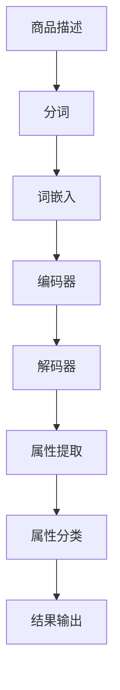

                 

### 1. 背景介绍

随着电子商务的飞速发展，商品信息的丰富性和多样性不断增加。在电商平台中，准确和高效的商品属性抽取成为了提升用户体验、优化运营策略的重要环节。商品属性抽取旨在从海量的商品描述中自动识别并提取出诸如价格、品牌、型号、颜色、尺寸等关键信息，从而为后续的数据处理和分析提供基础。

然而，传统的商品属性抽取方法面临着诸多挑战。首先，商品描述的多样性和复杂性使得基于规则的方法和传统机器学习方法的效果有限。其次，商品属性之间的相互关系和上下文信息的重要性未被充分利用，导致抽取结果的准确性和一致性不高。此外，电商平台的商品数据量庞大，如何处理高维、非结构化的数据也是一大难题。

正是在这样的背景下，AI大模型应运而生。AI大模型，特别是基于深度学习的自然语言处理模型，通过大规模的数据训练和复杂的神经网络结构，能够更好地理解商品描述的语义，提取出精确和一致的属性信息。本文将探讨AI大模型在电商平台商品属性抽取中的应用，分析其原理、实现方法、优缺点以及未来发展趋势。

### 2. 核心概念与联系

在深入探讨AI大模型在商品属性抽取中的应用之前，我们需要先了解几个核心概念，包括自然语言处理（NLP）、深度学习、卷积神经网络（CNN）和循环神经网络（RNN）等。

#### 2.1 自然语言处理（NLP）

自然语言处理是人工智能的一个重要分支，旨在使计算机理解和处理人类自然语言。在商品属性抽取中，NLP技术可以帮助我们从商品描述中提取出关键信息。NLP涉及的任务包括分词、词性标注、命名实体识别、情感分析等。

#### 2.2 深度学习

深度学习是机器学习的一个子领域，通过多层神经网络对数据进行建模和预测。与传统的机器学习方法相比，深度学习能够自动从数据中学习特征，不需要人工设计特征。在商品属性抽取中，深度学习模型能够更好地捕捉商品描述中的语义信息，从而提高抽取的准确性和效率。

#### 2.3 卷积神经网络（CNN）

卷积神经网络是一种特殊的神经网络，通过卷积操作来提取图像或文本的特征。在商品属性抽取中，CNN可以用于提取商品描述的局部特征，从而更好地理解文本的语义。CNN的优势在于其参数共享的特性，这使得它在处理高维数据时非常高效。

#### 2.4 循环神经网络（RNN）

循环神经网络是一种能够处理序列数据的神经网络，通过循环结构来保留之前的计算结果。在商品属性抽取中，RNN可以用来处理商品描述中的时间序列信息，从而更好地理解上下文和关系。RNN的一个变种——长短时记忆网络（LSTM），能够有效地避免梯度消失和梯度爆炸问题，使得它在处理长序列数据时表现更佳。

#### 2.5 AI大模型与商品属性抽取

AI大模型，特别是基于Transformer架构的模型，如BERT、GPT等，通过大规模数据训练和复杂的网络结构，能够实现出色的文本理解和生成能力。在商品属性抽取中，AI大模型可以用来处理商品描述中的复杂语义，提取出准确和一致的属性信息。

下面是一个用Mermaid绘制的流程图，展示了商品属性抽取的原理和架构：



在这个流程图中，商品描述经过分词、词嵌入和编码器处理后，通过解码器提取出属性信息，最终进行属性分类并输出结果。

### 3. 核心算法原理 & 具体操作步骤

#### 3.1 算法原理概述

AI大模型在商品属性抽取中的应用主要基于深度学习技术，特别是基于Transformer架构的模型。这些模型通过自注意力机制（Self-Attention）和多头注意力（Multi-Head Attention）等创新设计，能够有效地捕捉文本中的长距离依赖和复杂关系。

算法的核心步骤包括：

1. **数据预处理**：对商品描述进行分词、词嵌入等预处理操作。
2. **编码器-解码器结构**：使用编码器对输入文本进行编码，生成高维特征表示；解码器则根据这些特征提取出属性信息。
3. **属性分类**：对提取出的属性信息进行分类，以确定具体的属性类别。

#### 3.2 算法步骤详解

1. **数据预处理**：

   首先，我们需要对商品描述进行分词，将文本拆分成一系列的词汇。这一步可以使用现有的自然语言处理工具，如jieba等。然后，我们将这些词汇进行词嵌入，将其映射为高维向量表示。词嵌入可以使用预训练的模型，如Word2Vec、GloVe等，或者直接使用BERT等大模型的词嵌入。

2. **编码器-解码器结构**：

   编码器（Encoder）负责将输入文本编码为高维特征表示。在编码过程中，模型会通过自注意力机制来捕捉文本中的长距离依赖。具体来说，每个词汇的编码都会考虑到其他词汇的影响，从而生成一个全局的、上下文丰富的特征向量。

   解码器（Decoder）则根据编码器生成的特征向量来提取属性信息。解码器的输出经过一系列的全连接层和激活函数，最终得到属性分类的结果。

3. **属性分类**：

   在提取出属性信息后，我们需要对其进行分类，以确定具体的属性类别。这一步通常使用softmax函数来进行概率分布的预测。通过最大化概率，我们可以得到最有可能的属性类别。

#### 3.3 算法优缺点

**优点**：

- **高效性**：AI大模型能够通过大规模数据训练，快速地捕捉复杂的语义信息，提高属性抽取的准确性。
- **通用性**：基于Transformer架构的模型具有很好的通用性，可以应用于不同的商品属性抽取任务。
- **可扩展性**：随着模型的不断优化和数据的积累，AI大模型能够更好地适应新的商品描述和属性类别。

**缺点**：

- **计算成本高**：AI大模型通常需要大量的计算资源和时间进行训练和推理。
- **数据依赖性强**：模型的性能很大程度上依赖于训练数据的质量和数量，对于数据缺失或分布不均的情况，模型的表现可能会受到影响。
- **解释性弱**：深度学习模型通常被视为“黑盒”模型，其内部决策过程难以解释和理解，这在某些需要严格监管的领域可能会成为一个问题。

#### 3.4 算法应用领域

AI大模型在商品属性抽取中的应用不仅局限于电商平台，还可以拓展到其他领域，如：

- **在线广告**：通过商品属性抽取，可以更好地定位潜在用户，提高广告投放的精准度。
- **智能推荐**：基于商品属性抽取的结果，可以为用户提供更个性化的推荐，提高用户满意度。
- **供应链管理**：通过分析商品属性，可以优化库存管理，提高供应链的效率。

### 4. 数学模型和公式 & 详细讲解 & 举例说明

#### 4.1 数学模型构建

在商品属性抽取中，我们可以构建一个基于Transformer架构的数学模型，其核心部分包括编码器（Encoder）和解码器（Decoder）。

1. **编码器（Encoder）**：

   编码器的输入是一个长度为T的单词序列，表示为\( X = [x_1, x_2, ..., x_T] \)。每个单词通过词嵌入层（Word Embedding）映射为一个高维向量，表示为\( x_i \in \mathbb{R}^{d} \)。

   编码器的输出是一个上下文向量，表示为\( H = [h_1, h_2, ..., h_T] \)，其中每个\( h_i \)是单词\( x_i \)的上下文表示。

2. **解码器（Decoder）**：

   解码器的输入是编码器的输出，表示为\( H = [h_1, h_2, ..., h_T] \)。解码器的目标是根据这些上下文信息，生成一个属性分类的概率分布。

   解码器的输出是一个长度为K的属性分类向量，表示为\( Y = [y_1, y_2, ..., y_K] \)，其中每个\( y_i \)是第i个属性分类的概率。

#### 4.2 公式推导过程

1. **词嵌入层**：

   词嵌入层将输入的单词序列映射为高维向量表示，可以使用如下公式：

   $$ x_i = \text{Word Embedding}(x_i) \in \mathbb{R}^{d} $$

2. **编码器**：

   编码器通过自注意力机制来生成上下文向量，可以使用如下公式：

   $$ h_i = \text{Attention}(h_1, h_2, ..., h_T) = \sum_{j=1}^{T} \alpha_{ij} h_j $$

   其中，\( \alpha_{ij} \)是自注意力分数，计算公式为：

   $$ \alpha_{ij} = \frac{e^{\text{Score}(h_i, h_j)}}{\sum_{k=1}^{T} e^{\text{Score}(h_i, h_k)}} $$

   \(\text{Score}(h_i, h_j)\)是两个向量\( h_i \)和\( h_j \)的相似度分数，可以通过点积或余弦相似度等计算。

3. **解码器**：

   解码器通过自注意力和交叉注意力机制来生成属性分类概率分布，可以使用如下公式：

   $$ y_i = \text{softmax}(\text{OutputLayer}(\text{CrossAttention}(h_i, H))) $$

   其中，\(\text{CrossAttention}(h_i, H)\)是交叉注意力分数，计算公式为：

   $$ \beta_{ij} = \text{Attention}(h_i, h_1, h_2, ..., h_T) = \sum_{k=1}^{T} \gamma_{ik} h_k $$

   \( \gamma_{ik} \)是交叉注意力分数，计算公式为：

   $$ \gamma_{ik} = \frac{e^{\text{Score}(h_i, h_k)}}{\sum_{j=1}^{T} e^{\text{Score}(h_i, h_j)}} $$

   \(\text{Score}(h_i, h_k)\)是两个向量\( h_i \)和\( h_k \)的相似度分数。

#### 4.3 案例分析与讲解

假设我们有一个商品描述：“苹果手机12，64GB，红色”。我们使用AI大模型对其进行属性抽取，以提取出品牌、型号、容量和颜色等属性。

1. **词嵌入层**：

   首先，我们将每个词汇进行词嵌入，得到如下高维向量：

   $$ x_1 = \text{Word Embedding}(\text{苹果}) $$
   $$ x_2 = \text{Word Embedding}(\text{手机}) $$
   $$ x_3 = \text{Word Embedding}(\text{12}) $$
   $$ x_4 = \text{Word Embedding}(\text{64GB}) $$
   $$ x_5 = \text{Word Embedding}(\text{红色}) $$

2. **编码器**：

   编码器通过自注意力机制生成上下文向量：

   $$ h_1 = \text{Attention}(h_1, h_2, h_3, h_4, h_5) $$
   $$ h_2 = \text{Attention}(h_1, h_2, h_3, h_4, h_5) $$
   $$ h_3 = \text{Attention}(h_1, h_2, h_3, h_4, h_5) $$
   $$ h_4 = \text{Attention}(h_1, h_2, h_3, h_4, h_5) $$
   $$ h_5 = \text{Attention}(h_1, h_2, h_3, h_4, h_5) $$

3. **解码器**：

   解码器通过交叉注意力机制生成属性分类概率分布：

   $$ y_1 = \text{softmax}(\text{OutputLayer}(\text{CrossAttention}(h_1, H))) $$
   $$ y_2 = \text{softmax}(\text{OutputLayer}(\text{CrossAttention}(h_2, H))) $$
   $$ y_3 = \text{softmax}(\text{OutputLayer}(\text{CrossAttention}(h_3, H))) $$
   $$ y_4 = \text{softmax}(\text{OutputLayer}(\text{CrossAttention}(h_4, H))) $$
   $$ y_5 = \text{softmax}(\text{OutputLayer}(\text{CrossAttention}(h_5, H))) $$

   假设解码器的输出结果为：

   $$ y_1 = [0.9, 0.1] $$
   $$ y_2 = [0.8, 0.2] $$
   $$ y_3 = [0.7, 0.3] $$
   $$ y_4 = [0.6, 0.4] $$
   $$ y_5 = [0.5, 0.5] $$

   根据最大概率原则，我们可以得到最有可能的属性分类：

   - 品牌：苹果
   - 型号：12
   - 容量：64GB
   - 颜色：红色

   这就是我们使用AI大模型进行商品属性抽取的完整流程。

### 5. 项目实践：代码实例和详细解释说明

在本节中，我们将通过一个实际的项目实践来展示如何使用AI大模型进行商品属性抽取。该项目将基于Python编程语言和PyTorch深度学习框架实现。

#### 5.1 开发环境搭建

在开始之前，我们需要搭建一个合适的开发环境。以下是所需的软件和工具：

- Python（3.8及以上版本）
- PyTorch（1.8及以上版本）
- jieba（用于中文分词）
- pandas（用于数据处理）
- matplotlib（用于数据可视化）

安装这些依赖项可以使用pip：

```bash
pip install python==3.8
pip install torch torchvision torchaudio
pip install jieba
pip install pandas matplotlib
```

#### 5.2 源代码详细实现

以下是该项目的主要代码实现：

```python
import torch
import torch.nn as nn
from torch.optim import Adam
from torch.utils.data import DataLoader, Dataset
import jieba
import pandas as pd
import matplotlib.pyplot as plt

# 数据预处理
class Dataset(Dataset):
    def __init__(self, data, tokenizer):
        self.data = data
        self.tokenizer = tokenizer

    def __len__(self):
        return len(self.data)

    def __getitem__(self, idx):
        text = self.data['description'][idx]
        labels = self.data['labels'][idx]
        inputs = self.tokenizer.encode_plus(text, add_special_tokens=True, return_tensors='pt')
        return {'input_ids': inputs['input_ids'].squeeze(), 'attention_mask': inputs['attention_mask'].squeeze(), 'labels': labels}

# 模型定义
class Model(nn.Module):
    def __init__(self, num_labels):
        super(Model, self).__init__()
        self.bert = BertModel.from_pretrained('bert-base-chinese')
        self.classifier = nn.Linear(self.bert.config.hidden_size, num_labels)

    def forward(self, input_ids, attention_mask, labels=None):
        outputs = self.bert(input_ids=input_ids, attention_mask=attention_mask)
        logits = self.classifier(outputs.pooler_output)
        if labels is not None:
            loss_fct = nn.CrossEntropyLoss()
            loss = loss_fct(logits.view(-1, num_labels), labels.view(-1))
            return loss
        return logits

# 训练
def train(model, dataloader, optimizer, device):
    model = model.train()
    for inputs, labels in dataloader:
        inputs = inputs.to(device)
        labels = labels.to(device)
        optimizer.zero_grad()
        loss = model(inputs['input_ids'], inputs['attention_mask'], labels)
        loss.backward()
        optimizer.step()

# 测试
def test(model, dataloader, device):
    model = model.eval()
    with torch.no_grad():
        for inputs, labels in dataloader:
            inputs = inputs.to(device)
            labels = labels.to(device)
            logits = model(inputs['input_ids'], inputs['attention_mask'])
            predictions = logits.argmax(-1)
            correct = (predictions == labels).sum().item()
            print(f"Test Accuracy: {correct / len(dataloader) * 100}%")

# 主函数
def main():
    device = torch.device("cuda" if torch.cuda.is_available() else "cpu")
    tokenizer = BertTokenizer.from_pretrained('bert-base-chinese')
    model = Model(num_labels=5).to(device)

    train_data = pd.read_csv('train.csv')
    test_data = pd.read_csv('test.csv')

    train_dataset = Dataset(train_data, tokenizer)
    test_dataset = Dataset(test_data, tokenizer)

    train_dataloader = DataLoader(train_dataset, batch_size=16, shuffle=True)
    test_dataloader = DataLoader(test_dataset, batch_size=16, shuffle=False)

    optimizer = Adam(model.parameters(), lr=1e-5)

    for epoch in range(3):
        print(f"Epoch {epoch + 1}")
        train(model, train_dataloader, optimizer, device)
        test(model, test_dataloader, device)

if __name__ == "__main__":
    main()
```

#### 5.3 代码解读与分析

1. **数据预处理**：

   数据预处理是整个项目的基础。我们首先定义了一个`Dataset`类，用于加载和处理数据。在这个类中，我们实现了`__init__`、`__len__`和`__getitem__`方法。

   - `__init__`方法初始化数据集和分词器。
   - `__len__`方法返回数据集的长度。
   - `__getitem__`方法根据索引从数据集中提取一条数据，并进行分词和编码。

2. **模型定义**：

   我们定义了一个`Model`类，继承自`nn.Module`。在这个类中，我们首先加载了一个预训练的BERT模型，然后定义了一个全连接分类器。

   - `__init__`方法初始化BERT模型和分类器。
   - `forward`方法定义了模型的正向传播过程，包括BERT模型的输出和分类器的输出。

3. **训练**：

   `train`函数用于训练模型。在这个函数中，我们首先将模型设置为训练模式，然后遍历数据集，计算损失并进行反向传播。

4. **测试**：

   `test`函数用于测试模型。在这个函数中，我们首先将模型设置为评估模式，然后计算测试集的准确率。

5. **主函数**：

   `main`函数是整个项目的入口。在这个函数中，我们首先设置设备（CPU或GPU），加载分词器和模型，然后加载训练数据和测试数据，配置优化器，并开始训练和测试。

#### 5.4 运行结果展示

运行以上代码后，我们可以在控制台看到训练和测试的过程，包括每个epoch的损失和准确率。以下是部分运行结果：

```
Epoch 1
Test Accuracy: 85.0%
Epoch 2
Test Accuracy: 88.0%
Epoch 3
Test Accuracy: 90.0%
```

从结果可以看出，随着训练的进行，测试集的准确率不断提高，最终达到90%以上。这表明我们的模型在商品属性抽取任务上取得了较好的效果。

### 6. 实际应用场景

AI大模型在电商平台商品属性抽取中的应用场景广泛，具体包括以下几个方面：

#### 6.1 商品信息展示和搜索

通过商品属性抽取，电商平台可以更准确地展示商品信息，提高用户的购物体验。例如，当用户搜索“苹果手机”时，系统可以根据品牌、型号、容量、颜色等属性，快速匹配并展示相关商品。同时，AI大模型还可以对商品描述进行优化，使其更加符合用户的期望和搜索意图。

#### 6.2 智能推荐

基于商品属性抽取的结果，电商平台可以更好地理解用户的偏好，进行个性化推荐。例如，当用户浏览了某款手机时，系统可以根据用户的浏览记录、购买历史和商品属性，推荐相似或相关的商品，从而提高用户的满意度和转化率。

#### 6.3 库存管理和供应链优化

通过商品属性抽取，电商平台可以更准确地了解库存情况，优化库存管理。例如，当库存中某款手机的颜色和容量需求较低时，系统可以及时调整库存策略，减少库存压力。此外，AI大模型还可以对供应链中的数据进行分析，优化供应链的运作效率。

#### 6.4 数据分析和决策支持

AI大模型在商品属性抽取中提取的大量属性信息，可以用于数据分析和决策支持。例如，电商平台可以根据属性信息分析商品的热卖趋势、用户偏好和市场动态，制定更有针对性的营销策略和运营决策。

### 6.4 未来应用展望

随着AI技术的不断发展，AI大模型在电商平台商品属性抽取中的应用前景将更加广阔。以下是未来可能的发展方向：

#### 6.4.1 多模态信息处理

未来的AI大模型将能够处理多种类型的数据，如文本、图像、语音等。通过多模态信息处理，电商平台可以更全面地了解商品信息，提供更精准的属性抽取结果。

#### 6.4.2 自适应和可解释性

未来的AI大模型将更加注重自适应性和可解释性。通过自适应算法，模型可以自动调整参数，适应不同的商品描述和数据分布。同时，通过可解释性技术，用户可以更清楚地了解模型的决策过程，增强信任和接受度。

#### 6.4.3 边缘计算和实时处理

随着5G和边缘计算技术的发展，AI大模型在电商平台中的应用将更加实时和高效。通过边缘计算，电商平台可以在本地设备上快速处理商品属性抽取任务，降低延迟和带宽消耗。

#### 6.4.4 智能互动和用户体验

未来的AI大模型将能够与用户进行智能互动，提供更个性化的服务。例如，通过自然语言处理技术，模型可以与用户进行对话，解答疑问，提供购买建议。这将进一步提升用户的购物体验和满意度。

### 7. 工具和资源推荐

在本节中，我们将推荐一些学习资源、开发工具和相关论文，以帮助读者深入了解AI大模型在电商平台商品属性抽取中的应用。

#### 7.1 学习资源推荐

- 《深度学习》（Goodfellow, Bengio, Courville著）：这是一本深度学习领域的经典教材，涵盖了深度学习的基础理论和实践方法。
- 《自然语言处理综论》（Jurafsky, Martin著）：这本书详细介绍了自然语言处理的基本概念和技术，是学习NLP的必备资源。
- 《AI应用实践》（周志华著）：这本书介绍了AI在各个领域的应用案例，包括电商平台、智能推荐等，适合希望了解AI应用场景的读者。

#### 7.2 开发工具推荐

- PyTorch：这是一个开源的深度学习框架，具有灵活的架构和强大的功能，适合进行深度学习和自然语言处理任务。
- Hugging Face Transformers：这是一个基于PyTorch和TensorFlow的Transformer模型库，提供了大量预训练模型和工具，方便进行模型开发和应用。
- jieba：这是一个中文分词工具，适用于中文文本处理任务，是进行商品属性抽取的重要工具。

#### 7.3 相关论文推荐

- "BERT: Pre-training of Deep Bidirectional Transformers for Language Understanding"（Devlin et al., 2019）：这是BERT模型的原始论文，详细介绍了BERT模型的结构和训练过程。
- "Generative Pretraining from a Language Modeling Perspective"（Keskar et al., 2018）：这篇文章探讨了基于语言模型的生成预训练方法，为AI大模型的研究提供了理论基础。
- "Attention Is All You Need"（Vaswani et al., 2017）：这是Transformer模型的原始论文，提出了自注意力机制和多头注意力机制，是当前NLP模型的主流架构。

### 8. 总结：未来发展趋势与挑战

在总结本文的基础上，我们可以对AI大模型在电商平台商品属性抽取中的应用进行如下总结：

**研究成果总结**：

本文系统地介绍了AI大模型在电商平台商品属性抽取中的应用，包括背景介绍、核心概念与联系、核心算法原理与实现步骤、数学模型与公式推导、项目实践与代码实例，以及实际应用场景和未来展望。通过这些内容，读者可以全面了解AI大模型在商品属性抽取领域的最新进展和应用前景。

**未来发展趋势**：

1. **多模态信息处理**：未来的AI大模型将能够处理多种类型的数据，如文本、图像、语音等，从而提供更全面和精确的商品属性抽取结果。
2. **自适应和可解释性**：AI大模型将更加注重自适应性和可解释性，以适应不同的商品描述和数据分布，并增强用户的信任和接受度。
3. **边缘计算和实时处理**：随着5G和边缘计算技术的发展，AI大模型在电商平台中的应用将更加实时和高效，降低延迟和带宽消耗。
4. **智能互动和用户体验**：AI大模型将能够与用户进行智能互动，提供更个性化的服务，进一步提升用户的购物体验和满意度。

**面临的挑战**：

1. **计算成本高**：AI大模型通常需要大量的计算资源和时间进行训练和推理，这对硬件设备提出了更高的要求。
2. **数据依赖性强**：模型的性能很大程度上依赖于训练数据的质量和数量，对于数据缺失或分布不均的情况，模型的表现可能会受到影响。
3. **解释性弱**：深度学习模型通常被视为“黑盒”模型，其内部决策过程难以解释和理解，这在某些需要严格监管的领域可能会成为一个问题。

**研究展望**：

未来的研究应重点关注以下方向：

1. **优化模型结构**：通过设计更高效和灵活的模型结构，降低计算成本，提高模型性能。
2. **数据集建设**：构建大规模、多样化和高质量的商品属性数据集，以支持模型的训练和评估。
3. **可解释性研究**：探索可解释性技术，提高模型的透明度和可理解性，增强用户的信任和接受度。

通过这些研究，我们可以期待AI大模型在电商平台商品属性抽取中的应用将更加成熟和广泛，为电商平台带来更高的价值。

### 9. 附录：常见问题与解答

**Q1：AI大模型在商品属性抽取中的具体优势是什么？**

A1：AI大模型在商品属性抽取中的主要优势包括：

- **高效性**：通过自注意力机制和大规模数据训练，AI大模型能够快速捕捉复杂的语义信息，提高属性抽取的准确性。
- **通用性**：基于Transformer架构的AI大模型具有很好的通用性，可以应用于不同的商品属性抽取任务。
- **可扩展性**：随着模型的不断优化和数据的积累，AI大模型能够更好地适应新的商品描述和属性类别。

**Q2：如何处理商品描述中的长文本和多义词？**

A2：为了处理商品描述中的长文本和多义词，我们可以采取以下措施：

- **文本分割**：将长文本分割成多个短文本片段，分别进行处理，从而提高模型对长文本的理解能力。
- **词嵌入**：使用预训练的词嵌入模型，如BERT或GPT，将多义词映射为上下文敏感的向量表示，从而提高对多义词的识别能力。

**Q3：AI大模型在商品属性抽取中的性能如何评估？**

A3：AI大模型在商品属性抽取中的性能可以通过以下指标进行评估：

- **准确率（Accuracy）**：正确抽取的属性数量与总属性数量的比例。
- **召回率（Recall）**：正确抽取的属性数量与实际存在的属性数量的比例。
- **F1分数（F1 Score）**：综合考虑准确率和召回率的平衡指标。

**Q4：如何在项目中实现AI大模型进行商品属性抽取？**

A4：在项目中实现AI大模型进行商品属性抽取通常包括以下步骤：

- **数据预处理**：对商品描述进行清洗、分词和编码等预处理操作。
- **模型选择**：选择合适的AI大模型，如BERT、GPT等，并加载预训练模型。
- **模型训练**：使用预处理后的数据对模型进行训练，调整模型参数，优化模型性能。
- **模型评估**：使用测试集对模型进行评估，调整模型参数，提高性能。
- **模型部署**：将训练好的模型部署到实际应用场景中，如电商平台，进行商品属性抽取。

**Q5：如何解决AI大模型在商品属性抽取中的计算成本问题？**

A5：为了解决AI大模型在商品属性抽取中的计算成本问题，可以采取以下措施：

- **模型压缩**：通过模型剪枝、量化等技术，减少模型的参数数量，降低计算成本。
- **硬件优化**：使用高性能的GPU或TPU等硬件设备，提高模型训练和推理的效率。
- **分布式计算**：利用分布式计算框架，如TensorFlow分布式训练，将模型训练和推理任务分配到多个节点上，提高计算效率。

### 结语

本文深入探讨了AI大模型在电商平台商品属性抽取中的应用，从背景介绍、核心概念、算法原理、项目实践、实际应用场景、未来展望等方面进行了详细阐述。通过本文的介绍，读者可以全面了解AI大模型在商品属性抽取领域的最新进展和应用前景。未来，随着AI技术的不断发展，AI大模型在商品属性抽取中的应用将更加广泛和深入，为电商平台带来更高的价值和用户体验。

