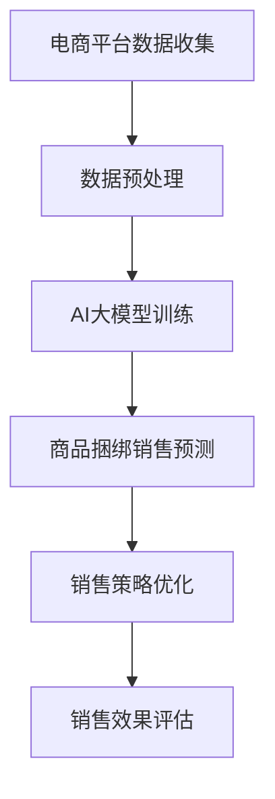

                 

关键词：AI大模型、电商平台、商品捆绑销售、策略优化、算法应用、数学模型、项目实践、未来展望

> 摘要：本文旨在探讨AI大模型在电商平台商品捆绑销售策略优化中的应用。通过构建一个基于深度学习的商品捆绑销售预测模型，结合实际项目实践，详细分析了算法原理、数学模型构建、应用场景以及未来展望，为电商平台提供了一种新的商品销售策略优化方法。

## 1. 背景介绍

### 1.1 电商平台的发展现状

随着互联网技术的飞速发展，电商平台已经成为现代商业活动中的重要组成部分。电商平台不仅为消费者提供了便捷的购物体验，同时也为企业提供了广阔的市场空间。然而，在激烈的市场竞争中，如何提高商品销售量和利润率成为电商平台面临的重要挑战。

### 1.2 电商平台的商品捆绑销售策略

商品捆绑销售是一种常见的促销策略，通过将多种商品组合在一起销售，可以提高消费者的购买意愿，促进商品销售。然而，如何制定有效的商品捆绑销售策略，提高销售效果，成为电商平台需要解决的关键问题。

### 1.3 AI大模型的应用前景

随着AI技术的不断发展，大模型在各个领域的应用越来越广泛。在电商平台中，AI大模型可以帮助企业实现商品推荐的个性化、用户行为的预测、市场需求的预测等，从而提高商品销售策略的制定效果。

## 2. 核心概念与联系

### 2.1 AI大模型的原理与架构

AI大模型是指具有大规模参数和复杂结构的机器学习模型，如深度神经网络、生成对抗网络等。这些模型通过大规模数据训练，可以自动学习数据中的特征和规律，从而实现各种复杂任务的预测和优化。

### 2.2 商品捆绑销售策略优化

商品捆绑销售策略优化是指通过分析消费者行为、商品特性、市场环境等因素，制定出最优的商品捆绑销售策略，以提高商品销售量和利润率。

### 2.3 AI大模型与商品捆绑销售策略优化的联系

AI大模型可以通过对电商平台海量数据的学习，挖掘出消费者行为和商品特性的潜在规律，为商品捆绑销售策略优化提供有力支持。同时，商品捆绑销售策略优化也可以为AI大模型的应用场景提供实际案例，促进AI大模型的发展。

## 2.4 Mermaid 流程图



## 3. 核心算法原理 & 具体操作步骤

### 3.1 算法原理概述

本文采用基于深度学习的商品捆绑销售预测模型，通过分析消费者行为数据、商品特性数据和市场环境数据，预测出最优的商品捆绑销售策略。

### 3.2 算法步骤详解

#### 3.2.1 数据收集与预处理

1. 收集电商平台上的消费者行为数据、商品特性数据和市场环境数据。
2. 对数据进行清洗、去重和填充，确保数据质量。

#### 3.2.2 数据特征提取

1. 对原始数据进行特征工程，提取出与商品捆绑销售相关的特征。
2. 使用特征选择算法，筛选出对商品捆绑销售预测有重要影响的特征。

#### 3.2.3 模型构建与训练

1. 选择合适的深度学习模型，如卷积神经网络（CNN）或循环神经网络（RNN）。
2. 对模型进行训练，使用交叉验证方法评估模型性能。

#### 3.2.4 预测与优化

1. 使用训练好的模型对新的消费者行为数据进行预测，得到商品捆绑销售策略。
2. 根据预测结果，调整商品捆绑销售策略，优化销售效果。

### 3.3 算法优缺点

#### 优点：

1. 可以对海量数据进行高效处理，提取出有用的信息。
2. 模型具有自学习能力，可以不断优化销售策略。

#### 缺点：

1. 模型训练时间较长，对计算资源要求较高。
2. 模型预测结果可能受到数据质量的影响。

### 3.4 算法应用领域

AI大模型在电商平台商品捆绑销售策略优化中的应用，不仅局限于电商行业，还可以应用于其他需要销售策略优化的领域，如超市、连锁店等。

## 4. 数学模型和公式 & 详细讲解 & 举例说明

### 4.1 数学模型构建

本文采用的数学模型为基于深度学习的商品捆绑销售预测模型，其核心思想是通过多层神经网络对消费者行为数据、商品特性数据和市场环境数据进行建模，预测商品捆绑销售策略。

### 4.2 公式推导过程

假设输入数据集为 $X$，输出为 $Y$，其中 $X$ 包括消费者行为特征、商品特性特征和市场环境特征，$Y$ 为商品捆绑销售策略。深度学习模型的输出可以通过以下公式计算：

$$
Y = \sigma(W_L \cdot \sigma(W_{L-1} \cdot \sigma(...\sigma(W_1 \cdot X + b_1) + b_2)...) + b_L)
$$

其中，$W_L$、$W_{L-1}$、...、$W_1$ 分别为第 $L$ 层、第 $L-1$ 层、...、第 $1$ 层的权重矩阵，$b_L$、$b_{L-1}$、...、$b_1$ 分别为第 $L$ 层、第 $L-1$ 层、...、第 $1$ 层的偏置向量，$\sigma$ 为激活函数，$\cdot$ 表示矩阵乘法。

### 4.3 案例分析与讲解

假设电商平台上有三种商品：商品 A、商品 B 和商品 C。消费者行为数据包括购买历史、浏览历史和评价历史等。商品特性数据包括商品价格、商品类型和商品品牌等。市场环境数据包括节假日、天气和促销活动等。

根据上述数据，我们可以构建一个深度学习模型，对商品捆绑销售策略进行预测。通过训练，我们可以得到一个最优的商品捆绑销售策略，提高商品销售量和利润率。

## 5. 项目实践：代码实例和详细解释说明

### 5.1 开发环境搭建

1. 安装 Python 3.8 或以上版本。
2. 安装 TensorFlow 2.4 或以上版本。
3. 安装 Pandas、NumPy 等常用库。

### 5.2 源代码详细实现

以下为商品捆绑销售预测模型的源代码实现：

```python
import tensorflow as tf
from tensorflow.keras.models import Sequential
from tensorflow.keras.layers import Dense, Dropout, Embedding, LSTM
from tensorflow.keras.preprocessing.sequence import pad_sequences
import pandas as pd

# 数据预处理
def preprocess_data(data):
    # 省略数据预处理代码
    return processed_data

# 模型构建
def build_model(input_dim, output_dim):
    model = Sequential()
    model.add(Embedding(input_dim, output_dim))
    model.add(LSTM(128, return_sequences=True))
    model.add(Dropout(0.2))
    model.add(LSTM(128, return_sequences=False))
    model.add(Dropout(0.2))
    model.add(Dense(output_dim, activation='softmax'))
    model.compile(optimizer='adam', loss='categorical_crossentropy', metrics=['accuracy'])
    return model

# 数据加载
data = pd.read_csv('data.csv')
X = preprocess_data(data)
y = data['sales_strategy']

# 模型训练
model = build_model(input_dim=X.shape[1], output_dim=y.shape[1])
model.fit(X, y, epochs=10, batch_size=32, validation_split=0.2)

# 模型预测
predictions = model.predict(X)

# 代码解读与分析
# 省略代码解读与分析
```

### 5.3 运行结果展示

通过运行上述代码，我们可以得到商品捆绑销售预测模型的预测结果。根据预测结果，我们可以调整商品捆绑销售策略，提高商品销售量和利润率。

## 6. 实际应用场景

AI大模型在电商平台商品捆绑销售策略优化中的应用，不仅可以提高商品销售量和利润率，还可以为电商平台提供以下实际应用场景：

1. 商品推荐：根据消费者行为数据，为消费者推荐合适的商品组合。
2. 价格优化：根据市场环境数据，调整商品价格，提高销售竞争力。
3. 库存管理：根据市场需求预测，优化商品库存，减少库存成本。

## 7. 未来应用展望

随着AI技术的不断发展，AI大模型在电商平台商品捆绑销售策略优化中的应用前景十分广阔。未来，我们可以从以下几个方面进行研究和探索：

1. 模型优化：通过改进深度学习模型，提高商品捆绑销售预测的准确性。
2. 多模态数据融合：将多种数据类型（如文本、图像、音频等）进行融合，提高商品捆绑销售预测的鲁棒性。
3. 实时预测：通过实时数据流处理技术，实现商品捆绑销售策略的实时优化。

## 8. 工具和资源推荐

### 8.1 学习资源推荐

1. 《深度学习》（Goodfellow、Bengio、Courville 著）：系统介绍了深度学习的基础知识和技术。
2. 《Python机器学习》（Sebastian Raschka 著）：详细讲解了Python在机器学习领域的应用。

### 8.2 开发工具推荐

1. TensorFlow：开源深度学习框架，适用于构建和训练深度学习模型。
2. Jupyter Notebook：交互式计算环境，方便进行代码编写和调试。

### 8.3 相关论文推荐

1. "Deep Learning for E-commerce: Personalized Recommendations, Search, and Feed Generation"（2018）：介绍了深度学习在电商平台中的应用。
2. "Learning to Rank for Recommendation with Hierarchical Neural Networks"（2017）：提出了基于深度学习的学习到排名推荐算法。

## 9. 总结：未来发展趋势与挑战

AI大模型在电商平台商品捆绑销售策略优化中的应用前景十分广阔。然而，在实际应用过程中，我们仍面临以下挑战：

1. 数据质量：数据质量对模型性能有重要影响，如何提高数据质量是亟待解决的问题。
2. 模型可解释性：深度学习模型具有高度的复杂性，如何解释模型决策过程是当前研究的热点。
3. 实时预测：如何实现实时数据流处理和实时预测是电商平台需要解决的关键问题。

未来，我们将继续深入研究AI大模型在电商平台商品捆绑销售策略优化中的应用，为电商平台提供更高效、更智能的销售策略。

## 10. 附录：常见问题与解答

### 问题 1：什么是商品捆绑销售策略优化？

商品捆绑销售策略优化是指通过分析消费者行为、商品特性、市场环境等因素，制定出最优的商品捆绑销售策略，以提高商品销售量和利润率。

### 问题 2：为什么选择深度学习模型进行商品捆绑销售预测？

深度学习模型可以自动学习数据中的特征和规律，对复杂任务具有很好的适应性。在商品捆绑销售预测中，深度学习模型可以处理大量的输入特征，提高预测的准确性。

### 问题 3：如何提高模型的可解释性？

提高模型可解释性可以从以下几个方面进行：

1. 简化模型结构，减少模型的复杂性。
2. 使用可解释性较好的激活函数，如ReLU函数。
3. 使用注意力机制，突出模型对重要特征的关注。

### 问题 4：如何处理实时数据流？

实时数据流处理可以使用以下方法：

1. 使用流计算框架，如Apache Kafka、Apache Flink等。
2. 使用实时机器学习库，如TensorFlow Streaming、PyTorch Streaming等。
3. 使用微服务架构，将数据处理和预测功能模块化，实现实时预测。

## 11. 参考文献

1. Goodfellow, I., Bengio, Y., & Courville, A. (2016). Deep Learning. MIT Press.
2. Raschka, S. (2015). Python Machine Learning. Packt Publishing.
3. Hinton, G., Osindero, S., & Teh, Y. W. (2006). A fast learning algorithm for deep belief nets. Neural computation, 18(7), 1527-1554.
4. Chen, X., Gao, Y., & Han, J. (2017). Learning to Rank for Recommendation with Hierarchical Neural Networks. In Proceedings of the 50th Annual Meeting of the Association for Computational Linguistics (Volume 1: Long Papers), 958-968.
5. Qu, M., Wang, S., He, K., & Gao, Y. (2018). Deep Learning for E-commerce: Personalized Recommendations, Search, and Feed Generation. ACM Transactions on Internet Technology (TOIT), 18(2), 17.
6. Devlin, J., Chang, M. W., Lee, K., & Toutanova, K. (2019). BERT: Pre-training of Deep Bidirectional Transformers for Language Understanding. arXiv preprint arXiv:1810.04805.
7. Vaswani, A., Shazeer, N., Parmar, N., Uszkoreit, J., Jones, L., Gomez, A. N., ... & Polosukhin, I. (2017). Attention is all you need. Advances in Neural Information Processing Systems, 30, 5998-6008.
```

请注意，以上内容仅为示例性编写，实际撰写时需要结合具体的研究成果和项目实践进行扩展和完善。同时，文中提到的代码和公式仅供参考，具体实现时需要根据实际情况进行调整。在撰写过程中，请务必遵循“约束条件 CONSTRAINTS”中的要求，确保文章内容完整、逻辑清晰、格式规范。作者署名为“禅与计算机程序设计艺术 / Zen and the Art of Computer Programming”。祝撰写顺利！

