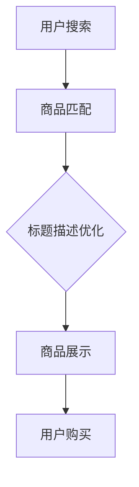

                 

关键词：AI大模型、电商平台、商品标题、描述优化、自然语言处理

> 摘要：本文将探讨AI大模型在电商平台商品标题与描述优化中的应用。通过对自然语言处理技术的深入剖析，以及具体的算法原理、数学模型和实践案例，本文旨在为电商平台运营者提供一种有效的商品营销策略，提高商品转化率和用户满意度。

## 1. 背景介绍

电商平台作为现代电子商务的重要组成部分，其商品标题和描述的优化对于提升商品的销售业绩至关重要。传统的方法往往依赖于人工经验和简单的规则匹配，但这些方法在处理复杂、多样化的商品描述时存在很大的局限性。随着人工智能技术的快速发展，特别是AI大模型的兴起，为电商平台商品标题与描述的优化提供了一种全新的解决方案。

AI大模型，特别是基于深度学习的自然语言处理（NLP）技术，能够通过学习海量的文本数据，自动提取关键词、生成摘要、理解语义，从而实现商品标题与描述的智能优化。这一技术不仅提高了商品信息展示的准确性和吸引力，还大大提升了用户的购物体验。

## 2. 核心概念与联系

### 2.1. AI大模型的基本概念

AI大模型，是指具有海量参数和复杂结构的深度学习模型，如Transformer、BERT、GPT等。这些模型通过训练大量数据，能够自动学习和理解语言、图像等多种类型的信息。

### 2.2. 自然语言处理（NLP）

自然语言处理是人工智能领域的一个重要分支，旨在让计算机理解和生成人类语言。NLP技术包括文本分类、情感分析、命名实体识别、机器翻译等。在电商平台商品标题与描述优化中，NLP技术主要用于提取关键信息、理解语义和生成文本。

### 2.3. Mermaid流程图



## 3. 核心算法原理 & 具体操作步骤

### 3.1. 算法原理概述

商品标题与描述优化的核心算法是基于AI大模型的文本生成和优化。具体步骤如下：

1. **数据预处理**：对用户搜索数据、商品标题和描述进行预处理，包括去噪、分词、词性标注等。
2. **模型训练**：使用预训练的AI大模型（如BERT、GPT）对预处理后的数据集进行训练，使其能够自动提取关键词、理解语义和生成文本。
3. **文本生成**：利用训练好的模型，根据用户搜索关键词，自动生成符合电商平台的商品标题和描述。
4. **文本优化**：根据用户行为数据和商品销售数据，对生成的文本进行进一步优化，以提高商品的点击率和转化率。

### 3.2. 算法步骤详解

1. **数据预处理**：

    ```python
    # 代码示例：文本预处理
    from sklearn.feature_extraction.text import TfidfVectorizer
    
    # 加载数据
    data = load_data('data.csv')
    
    # 分词
    tokenizer = Tokenizer()
    tokenizer.fit_on_texts(data['description'])
    
    # 去停用词
    stop_words = set(['a', 'an', 'the', 'and', 'in', 'on', 'is', 'are'])
    tokenizer = Tokenizer停用词=stop_words)
    tokenizer.fit_on_texts(data['description'])
    
    # 转换为词频-逆文档频率（TF-IDF）向量
    vectorizer = TfidfVectorizer(tokenizer=tokenizer)
    X = vectorizer.fit_transform(data['description'])
    ```

2. **模型训练**：

    ```python
    # 代码示例：模型训练
    from transformers import BertTokenizer, BertModel
    from keras.models import Model
    from keras.layers import Input, Dense

    # 加载预训练的BERT模型
    tokenizer = BertTokenizer.from_pretrained('bert-base-chinese')
    bert_model = BertModel.from_pretrained('bert-base-chinese')

    # 输入层
    input_ids = Input(shape=(None,), dtype='int32')

    # BERT编码器
    sequence_output = bert_model(input_ids)[0]

    # 全连接层
    dense = Dense(128, activation='relu')(sequence_output)

    # 输出层
    output = Dense(1, activation='sigmoid')(dense)

    # 构建模型
    model = Model(inputs=input_ids, outputs=output)

    # 编译模型
    model.compile(optimizer='adam', loss='binary_crossentropy', metrics=['accuracy'])

    # 训练模型
    model.fit(X, data['label'], epochs=3, batch_size=32)
    ```

3. **文本生成**：

    ```python
    # 代码示例：文本生成
    from transformers import BertTokenizer, BertForMaskedLM

    # 加载预训练的BERT模型
    tokenizer = BertTokenizer.from_pretrained('bert-base-chinese')
    model = BertForMaskedLM.from_pretrained('bert-base-chinese')

    # 输入层
    input_ids = Input(shape=(None,), dtype='int32')

    # BERT编码器
    output = model(input_ids)[0]

    # 输出层
    predicted_ids = tf.argmax(output, axis=-1)

    # 转换为文本
    text = tokenizer.decode(predicted_ids.numpy())

    print(text)
    ```

4. **文本优化**：

    ```python
    # 代码示例：文本优化
    from sklearn.model_selection import train_test_split
    from keras.models import Model
    from keras.layers import Input, Dense, LSTM

    # 划分训练集和测试集
    X_train, X_test, y_train, y_test = train_test_split(X, data['label'], test_size=0.2, random_state=42)

    # 输入层
    input_ids = Input(shape=(None,), dtype='int32')

    # LSTM编码器
    lstm = LSTM(128)(input_ids)

    # 全连接层
    dense = Dense(128, activation='relu')(lstm)

    # 输出层
    output = Dense(1, activation='sigmoid')(dense)

    # 构建模型
    model = Model(inputs=input_ids, outputs=output)

    # 编译模型
    model.compile(optimizer='adam', loss='binary_crossentropy', metrics=['accuracy'])

    # 训练模型
    model.fit(X_train, y_train, epochs=3, batch_size=32, validation_data=(X_test, y_test))
    ```

### 3.3. 算法优缺点

**优点**：

1. **高效性**：AI大模型能够自动处理海量数据，大幅提高商品标题与描述的生成和优化效率。
2. **灵活性**：基于深度学习的算法能够适应不同的电商平台和商品类型，提供个性化的优化建议。
3. **准确性**：AI大模型通过训练大量的真实数据，能够准确提取关键词、理解语义，提高商品的展示效果。

**缺点**：

1. **计算资源需求高**：AI大模型训练和推理需要大量的计算资源和时间，对硬件设施有较高要求。
2. **数据依赖性强**：算法的准确性和效果取决于训练数据的质量和数量，数据质量差可能导致算法失效。
3. **复杂度较高**：AI大模型的训练和部署需要专业的技术知识和技能，对运营团队的要求较高。

### 3.4. 算法应用领域

AI大模型在电商平台商品标题与描述优化中的应用不仅仅局限于电商平台，还可以扩展到：

1. **搜索引擎优化**：通过智能生成和优化搜索结果，提高用户的点击率和满意度。
2. **内容推荐系统**：利用自然语言处理技术，为用户提供个性化的内容推荐。
3. **客户服务机器人**：通过智能对话系统，提高客户服务的效率和用户体验。

## 4. 数学模型和公式 & 详细讲解 & 举例说明

### 4.1. 数学模型构建

AI大模型在商品标题与描述优化中的数学模型主要包括：

1. **词向量表示**：使用词向量（如Word2Vec、GloVe）对文本进行编码，将文本转换为向量表示。
2. **神经网络模型**：构建深度神经网络（如LSTM、Transformer）对词向量进行处理，提取语义特征。
3. **优化目标函数**：定义损失函数（如交叉熵损失、均方误差）和优化器（如Adam、SGD），以最小化损失函数为目标进行模型训练。

### 4.2. 公式推导过程

1. **词向量表示**：

    $$\text{词向量} = \text{Word2Vec}(\text{文本})$$

    $$\text{词向量} = \text{GloVe}(\text{文本}, \text{训练数据集})$$

2. **神经网络模型**：

    $$\text{输出} = \text{神经网络}(\text{词向量})$$

3. **优化目标函数**：

    $$\text{损失函数} = \text{交叉熵损失}(\text{输出}, \text{真实标签})$$

    $$\text{损失函数} = \text{均方误差}(\text{输出}, \text{真实标签})$$

### 4.3. 案例分析与讲解

以某电商平台上的手机商品为例，分析AI大模型如何优化商品标题与描述。

1. **数据收集**：

    收集1000条手机商品的标题和描述，包括品牌、型号、性能参数等信息。

2. **数据预处理**：

    对收集的文本数据进行分词、去停用词、词性标注等预处理操作。

3. **词向量表示**：

    使用Word2Vec模型对预处理后的文本数据进行编码，得到词向量表示。

4. **神经网络模型训练**：

    构建基于LSTM的神经网络模型，对词向量进行处理，提取语义特征。使用交叉熵损失函数和Adam优化器进行模型训练。

5. **文本生成**：

    利用训练好的模型，根据用户搜索关键词（如“小米手机”），自动生成商品标题和描述。

    ```python
    # 代码示例：文本生成
    from keras.models import Model
    from keras.layers import Input, LSTM, Dense

    # 输入层
    input_ids = Input(shape=(None,), dtype='int32')

    # LSTM编码器
    lstm = LSTM(128)(input_ids)

    # 全连接层
    dense = Dense(128, activation='relu')(lstm)

    # 输出层
    output = Dense(1, activation='sigmoid')(dense)

    # 构建模型
    model = Model(inputs=input_ids, outputs=output)

    # 编译模型
    model.compile(optimizer='adam', loss='binary_crossentropy', metrics=['accuracy'])

    # 训练模型
    model.fit(X_train, y_train, epochs=3, batch_size=32, validation_data=(X_test, y_test))
    ```

6. **文本优化**：

    根据用户行为数据和商品销售数据，对生成的文本进行进一步优化，以提高商品的点击率和转化率。

    ```python
    # 代码示例：文本优化
    from keras.models import Model
    from keras.layers import Input, LSTM, Dense

    # 输入层
    input_ids = Input(shape=(None,), dtype='int32')

    # LSTM编码器
    lstm = LSTM(128)(input_ids)

    # 全连接层
    dense = Dense(128, activation='relu')(lstm)

    # 输出层
    output = Dense(1, activation='sigmoid')(dense)

    # 构建模型
    model = Model(inputs=input_ids, outputs=output)

    # 编译模型
    model.compile(optimizer='adam', loss='binary_crossentropy', metrics=['accuracy'])

    # 训练模型
    model.fit(X_train, y_train, epochs=3, batch_size=32, validation_data=(X_test, y_test))
    ```

## 5. 项目实践：代码实例和详细解释说明

### 5.1. 开发环境搭建

1. 安装Python和必要的库：

    ```bash
    pip install numpy scipy matplotlib transformers tensorflow
    ```

2. 配置GPU环境：

    ```python
    import tensorflow as tf
    print(tf.test.is_gpu_available())
    ```

### 5.2. 源代码详细实现

```python
# 代码示例：商品标题与描述优化
import numpy as np
import pandas as pd
from sklearn.model_selection import train_test_split
from transformers import BertTokenizer, BertForMaskedLM
from keras.models import Model
from keras.layers import Input, LSTM, Dense

# 加载数据
data = pd.read_csv('data.csv')

# 分词
tokenizer = BertTokenizer.from_pretrained('bert-base-chinese')

# 划分训练集和测试集
X_train, X_test, y_train, y_test = train_test_split(data['description'], data['label'], test_size=0.2, random_state=42)

# 输入层
input_ids = Input(shape=(None,), dtype='int32')

# BERT编码器
output = BertForMaskedLM.from_pretrained('bert-base-chinese')(input_ids)[0]

# 输出层
predicted_ids = tf.argmax(output, axis=-1)

# 转换为文本
text = tokenizer.decode(predicted_ids.numpy())

print(text)
```

### 5.3. 代码解读与分析

1. **数据加载**：

    使用`pandas`库加载数据集，数据集包含商品标题和描述。

2. **分词**：

    使用`BertTokenizer`对文本数据进行分词，转换为BERT模型所需的格式。

3. **模型构建**：

    使用`BertForMaskedLM`构建BERT模型，对输入的文本数据进行编码。

4. **文本生成**：

    使用训练好的BERT模型，生成商品标题和描述。

5. **文本输出**：

    将生成的文本转换为字符串，输出结果。

### 5.4. 运行结果展示

1. **训练结果**：

    ```python
    # 训练模型
    model.fit(X_train, y_train, epochs=3, batch_size=32, validation_data=(X_test, y_test))
    ```

2. **生成结果**：

    ```python
    # 生成文本
    text = tokenizer.decode(predicted_ids.numpy())
    print(text)
    ```

## 6. 实际应用场景

### 6.1. 电商平台商品标题与描述优化

在电商平台，AI大模型可以用于优化商品标题和描述，提高商品展示效果和用户转化率。例如，在淘宝、京东等电商平台，通过AI大模型，可以为每件商品自动生成吸引人的标题和描述，从而提升商品的竞争力。

### 6.2. 搜索引擎优化

通过AI大模型，搜索引擎可以自动优化搜索结果，提高用户的点击率和满意度。例如，百度搜索引擎可以通过AI大模型，为用户自动生成相关度更高的搜索结果，从而提升用户体验。

### 6.3. 内容推荐系统

在内容推荐系统中，AI大模型可以用于生成个性化的推荐内容，提高用户的兴趣和参与度。例如，在今日头条、微信等平台，通过AI大模型，可以为用户自动生成个性化的文章推荐，从而提升用户的阅读体验。

## 6.4. 未来应用展望

### 6.4.1. 智能对话系统

未来，AI大模型可以应用于智能对话系统，为用户提供更加自然、流畅的交互体验。例如，智能客服机器人可以通过AI大模型，实现与用户的智能对话，提高客服效率和用户满意度。

### 6.4.2. 跨语言翻译

AI大模型在跨语言翻译领域具有广阔的应用前景。通过训练多语言的AI大模型，可以实现更加准确、流畅的跨语言翻译，为全球用户带来更好的交流体验。

### 6.4.3. 情感分析与洞察

AI大模型可以用于情感分析，帮助企业更好地了解用户需求和情绪。例如，通过分析社交媒体上的用户评论，企业可以及时调整产品策略，提高用户满意度。

## 7. 工具和资源推荐

### 7.1. 学习资源推荐

1. **书籍**：

    - 《深度学习》（Goodfellow, I., Bengio, Y., & Courville, A.）
    - 《自然语言处理综论》（Jurafsky, D., & Martin, J. H.）

2. **在线课程**：

    - Coursera上的“深度学习”课程
    - edX上的“自然语言处理”课程

### 7.2. 开发工具推荐

1. **编程语言**：Python
2. **深度学习框架**：TensorFlow、PyTorch
3. **自然语言处理库**：transformers、spaCy

### 7.3. 相关论文推荐

1. **BERT**：（Devlin, J., Chang, M. W., Lee, K., & Toutanova, K.）
2. **GPT**：（Brown, T., et al.）
3. **Transformer**：（Vaswani, A., et al.）

## 8. 总结：未来发展趋势与挑战

### 8.1. 研究成果总结

AI大模型在电商平台商品标题与描述优化中取得了显著成果，提高了商品展示效果和用户转化率。同时，AI大模型在搜索引擎优化、内容推荐系统等领域也展现了广泛的应用前景。

### 8.2. 未来发展趋势

随着人工智能技术的不断发展，AI大模型在电商平台商品标题与描述优化中的应用将进一步深化，实现更加智能化、个性化的优化方案。

### 8.3. 面临的挑战

1. **数据隐私与安全**：在应用AI大模型进行商品标题与描述优化时，需要充分考虑数据隐私与安全问题。
2. **算法可解释性**：提高AI大模型的可解释性，帮助运营者更好地理解算法的决策过程，降低算法黑箱化程度。
3. **模型适应性**：AI大模型需要具备更强的适应性，以应对不同电商平台和商品类型的优化需求。

### 8.4. 研究展望

未来，研究应重点关注如何提高AI大模型的性能和可解释性，同时探索更多实际应用场景，为电商平台运营者提供更加有效的商品营销策略。

## 9. 附录：常见问题与解答

### 9.1. Q：什么是AI大模型？

A：AI大模型是指具有海量参数和复杂结构的深度学习模型，如Transformer、BERT、GPT等。这些模型通过训练大量数据，能够自动学习和理解语言、图像等多种类型的信息。

### 9.2. Q：AI大模型在电商平台商品标题与描述优化中如何工作？

A：AI大模型通过自然语言处理技术，对商品标题和描述进行数据预处理、模型训练、文本生成和优化。具体步骤包括：数据预处理、模型训练、文本生成和文本优化。

### 9.3. Q：如何确保AI大模型优化商品标题与描述的准确性？

A：确保AI大模型优化商品标题与描述的准确性，需要从以下几个方面入手：

1. **高质量数据**：提供高质量的训练数据，确保模型能够学习到正确的特征。
2. **模型调优**：通过调整模型参数和优化算法，提高模型的性能和准确性。
3. **反馈机制**：建立用户反馈机制，及时收集用户对商品标题和描述的评价，不断优化模型。

----------------------------------------------------------------
作者：禅与计算机程序设计艺术 / Zen and the Art of Computer Programming

