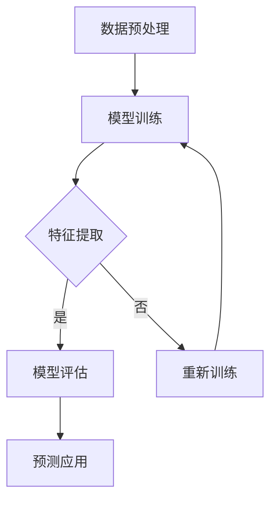

                 

关键词：AI大模型、电商平台、用户价值预测、深度学习、数据挖掘

## 摘要

本文将探讨人工智能（AI）大模型在电商平台用户价值预测中的应用。随着电子商务的快速发展，准确预测用户价值对于电商平台具有重要的战略意义。通过介绍大模型的基本概念和结构，本文将详细阐述大模型在用户价值预测中的算法原理、数学模型、实际应用场景，并提供代码实例和运行结果展示。此外，还将对大模型在未来的发展趋势、面临的挑战和研究展望进行讨论。

## 1. 背景介绍

### 1.1 电商平台的发展现状

电子商务的快速发展给传统商业模式带来了巨大的冲击，也带来了新的机遇。根据Statista的统计数据，全球电子商务市场规模预计将在2022年达到4.89万亿美元，并继续以每年约10%的速度增长。这表明电商平台在全球经济中占据了越来越重要的地位。

电商平台的发展离不开用户价值的精准预测。用户价值的预测不仅可以帮助企业识别高价值用户，提高客户服务质量，还可以优化广告投放、推荐系统等业务环节，从而提升整体运营效率。

### 1.2 用户价值预测的重要性

用户价值预测是电商平台的核心业务之一。通过预测用户价值，企业可以：

- **精准营销**：针对高价值用户进行个性化营销，提高营销ROI。
- **客户关系管理**：识别潜在流失用户，制定相应的挽留策略。
- **广告投放优化**：根据用户价值对广告投放进行优化，提高广告转化率。
- **供应链管理**：根据用户价值调整库存和物流策略，减少库存成本。

### 1.3 大模型在用户价值预测中的应用

大模型（Large Models）是指具有巨大参数量和计算能力的神经网络模型，如GPT、BERT等。大模型在自然语言处理、计算机视觉等领域取得了显著的成果。近年来，随着深度学习技术的不断发展，大模型在用户价值预测中也逐渐展现出其强大的优势。

大模型在用户价值预测中的应用主要体现在以下几个方面：

- **数据集成**：大模型可以处理多种类型的数据（如文本、图像、声音等），实现对用户价值的全面分析。
- **特征提取**：大模型可以自动提取数据中的高维特征，降低手工特征工程的工作量。
- **预测精度**：大模型具有强大的非线性建模能力，可以显著提高用户价值预测的精度。
- **实时性**：大模型可以快速响应新的用户行为数据，实现实时价值预测。

## 2. 核心概念与联系

### 2.1 大模型的基本概念

大模型是指具有巨大参数量和计算能力的神经网络模型，其结构通常包括以下几个层次：

- **输入层**：接收外部输入数据，如用户行为数据、产品信息等。
- **隐藏层**：进行复杂的非线性变换，提取数据中的高维特征。
- **输出层**：根据隐藏层输出的特征，预测用户价值。

### 2.2 大模型的结构

大模型的结构通常包括以下几个部分：

- **嵌入层**（Embedding Layer）：将输入数据转换为低维稠密向量。
- **卷积层**（Convolutional Layer）：提取数据中的局部特征。
- **池化层**（Pooling Layer）：降低数据的维度，保留关键信息。
- **全连接层**（Fully Connected Layer）：进行最终的分类或回归预测。

### 2.3 大模型的工作流程

大模型的工作流程主要包括以下几个步骤：

1. **数据预处理**：对输入数据进行清洗、归一化等处理。
2. **模型训练**：使用大量训练数据，通过反向传播算法更新模型参数。
3. **特征提取**：在模型训练过程中，自动提取数据中的高维特征。
4. **模型评估**：使用验证集或测试集评估模型的性能，包括准确率、召回率等指标。
5. **预测应用**：将训练好的模型应用于实际业务场景，如用户价值预测。

### 2.4 Mermaid 流程图



## 3. 核心算法原理 & 具体操作步骤

### 3.1 算法原理概述

大模型在用户价值预测中的核心算法是基于深度学习的神经网络模型。神经网络通过多层非线性变换，实现对输入数据的特征提取和分类或回归预测。

### 3.2 算法步骤详解

#### 3.2.1 数据预处理

- 数据清洗：去除缺失值、异常值和重复值。
- 数据归一化：将数据缩放到相同的范围，如[0, 1]。
- 特征工程：提取用户行为数据、产品信息等特征，并进行编码。

#### 3.2.2 模型训练

- 初始化参数：随机初始化模型参数。
- 前向传播：将输入数据通过模型的前向传播过程，计算输出。
- 计算损失：计算模型输出与真实值之间的差距，使用损失函数度量。
- 反向传播：使用梯度下降算法更新模型参数，减小损失。

#### 3.2.3 特征提取

- 嵌入层：将输入数据转换为低维稠密向量。
- 卷积层：提取数据中的局部特征。
- 池化层：降低数据的维度，保留关键信息。

#### 3.2.4 模型评估

- 准确率：预测正确的样本数与总样本数的比例。
- 召回率：预测为正类的正类样本数与实际正类样本数的比例。
- F1值：准确率的调和平均值。

#### 3.2.5 预测应用

- 使用训练好的模型对新的用户行为数据进行价值预测。
- 根据预测结果，调整营销策略、客户关系管理等。

### 3.3 算法优缺点

#### 优点

- **高精度**：大模型具有强大的非线性建模能力，可以显著提高用户价值预测的精度。
- **自动特征提取**：大模型可以自动提取数据中的高维特征，降低手工特征工程的工作量。
- **实时性**：大模型可以快速响应新的用户行为数据，实现实时价值预测。

#### 缺点

- **计算成本高**：大模型需要大量的计算资源和存储空间。
- **对数据质量要求高**：数据清洗和预处理是关键步骤，对数据质量要求较高。

### 3.4 算法应用领域

大模型在用户价值预测中的应用领域广泛，包括：

- **电商平台**：用户价值预测、广告投放优化、推荐系统等。
- **金融行业**：风险评估、信用评级、投资决策等。
- **电信行业**：用户流失预测、用户满意度分析等。

## 4. 数学模型和公式 & 详细讲解 & 举例说明

### 4.1 数学模型构建

用户价值预测的数学模型通常是一个回归模型，其目标是最小化预测值与真实值之间的误差。

#### 回归模型公式

$$
y = \theta_0 + \theta_1 x_1 + \theta_2 x_2 + ... + \theta_n x_n
$$

其中，$y$是预测的用户价值，$x_1, x_2, ..., x_n$是输入特征，$\theta_0, \theta_1, ..., \theta_n$是模型参数。

#### 损失函数

$$
L(\theta) = \frac{1}{2} \sum_{i=1}^{m} (y_i - \theta_0 - \theta_1 x_{i1} - \theta_2 x_{i2} - ... - \theta_n x_{in})^2
$$

其中，$m$是样本数量，$y_i$是第$i$个样本的真实用户价值，$x_{i1}, x_{i2}, ..., x_{in}$是第$i$个样本的输入特征。

#### 反向传播算法

反向传播算法用于计算模型参数的梯度，并更新参数，以最小化损失函数。

$$
\theta_j = \theta_j - \alpha \frac{\partial L}{\partial \theta_j}
$$

其中，$\alpha$是学习率，$\frac{\partial L}{\partial \theta_j}$是参数$\theta_j$的梯度。

### 4.2 公式推导过程

#### 前向传播

假设输入特征为$x_1, x_2, ..., x_n$，模型参数为$\theta_0, \theta_1, ..., \theta_n$。前向传播过程可以表示为：

$$
h(x) = \theta_0 + \theta_1 x_1 + \theta_2 x_2 + ... + \theta_n x_n
$$

其中，$h(x)$是模型预测的用户价值。

#### 损失函数

损失函数用于衡量模型预测值与真实值之间的误差。常用的损失函数是均方误差（MSE）：

$$
L(h(x), y) = \frac{1}{2} (h(x) - y)^2
$$

其中，$y$是真实用户价值。

#### 反向传播

反向传播用于计算模型参数的梯度。假设损失函数对模型参数的梯度为：

$$
\frac{\partial L}{\partial \theta_j} = \frac{\partial L}{\partial h} \frac{\partial h}{\partial \theta_j}
$$

其中，$\frac{\partial L}{\partial h}$是损失函数对模型预测值的梯度，$\frac{\partial h}{\partial \theta_j}$是模型预测值对参数$\theta_j$的梯度。

对于线性回归模型，$\frac{\partial h}{\partial \theta_j}$可以表示为：

$$
\frac{\partial h}{\partial \theta_j} = x_j
$$

因此，损失函数对参数$\theta_j$的梯度可以表示为：

$$
\frac{\partial L}{\partial \theta_j} = (h(x) - y) x_j
$$

#### 参数更新

使用梯度下降算法更新模型参数：

$$
\theta_j = \theta_j - \alpha \frac{\partial L}{\partial \theta_j}
$$

### 4.3 案例分析与讲解

假设我们有以下训练数据：

| 用户ID | 行为1 | 行为2 | 行为3 | 用户价值 |
|--------|-------|-------|-------|----------|
| 1      | 0.8   | 0.6   | 0.4   | 10       |
| 2      | 0.5   | 0.3   | 0.2   | 5        |
| 3      | 0.9   | 0.7   | 0.5   | 15       |

构建线性回归模型：

$$
y = \theta_0 + \theta_1 x_1 + \theta_2 x_2 + \theta_3 x_3
$$

使用均方误差作为损失函数：

$$
L(\theta) = \frac{1}{2} \sum_{i=1}^{3} (y_i - (\theta_0 + \theta_1 x_{i1} + \theta_2 x_{i2} + \theta_3 x_{i3}))^2
$$

初始化参数$\theta_0 = 0, \theta_1 = 0, \theta_2 = 0, \theta_3 = 0$。

第1次迭代：

- 前向传播：$h(x) = \theta_0 + \theta_1 x_1 + \theta_2 x_2 + \theta_3 x_3 = 0 + 0 \cdot 0.8 + 0 \cdot 0.6 + 0 \cdot 0.4 = 0$
- 计算损失：$L(\theta) = \frac{1}{2} \sum_{i=1}^{3} (y_i - h(x_i))^2 = \frac{1}{2} (10 - 0)^2 + (5 - 0)^2 + (15 - 0)^2 = 100$
- 反向传播：$\frac{\partial L}{\partial \theta_0} = \frac{1}{2} (10 - 0) \cdot (-1) = -5, \frac{\partial L}{\partial \theta_1} = \frac{1}{2} (10 - 0) \cdot 0.8 \cdot (-1) = -4, \frac{\partial L}{\partial \theta_2} = \frac{1}{2} (5 - 0) \cdot (-1) = -2.5, \frac{\partial L}{\partial \theta_3} = \frac{1}{2} (15 - 0) \cdot (-1) = -7.5$
- 参数更新：$\theta_0 = \theta_0 - \alpha \frac{\partial L}{\partial \theta_0} = 0 - 0.1 \cdot (-5) = 0.5, \theta_1 = \theta_1 - \alpha \frac{\partial L}{\partial \theta_1} = 0 - 0.1 \cdot (-4) = 0.4, \theta_2 = \theta_2 - \alpha \frac{\partial L}{\partial \theta_2} = 0 - 0.1 \cdot (-2.5) = 0.25, \theta_3 = \theta_3 - \alpha \frac{\partial L}{\partial \theta_3} = 0 - 0.1 \cdot (-7.5) = 0.75$

第2次迭代：

- 前向传播：$h(x) = \theta_0 + \theta_1 x_1 + \theta_2 x_2 + \theta_3 x_3 = 0.5 + 0.4 \cdot 0.8 + 0.25 \cdot 0.6 + 0.75 \cdot 0.4 = 1.15$
- 计算损失：$L(\theta) = \frac{1}{2} \sum_{i=1}^{3} (y_i - h(x_i))^2 = \frac{1}{2} (10 - 1.15)^2 + (5 - 1.15)^2 + (15 - 1.15)^2 = 68.225$
- 反向传播：$\frac{\partial L}{\partial \theta_0} = \frac{1}{2} (10 - 1.15) \cdot (-1) = -4.825, \frac{\partial L}{\partial \theta_1} = \frac{1}{2} (10 - 1.15) \cdot 0.8 \cdot (-1) = -3.86, \frac{\partial L}{\partial \theta_2} = \frac{1}{2} (5 - 1.15) \cdot (-1) = -2.3625, \frac{\partial L}{\partial \theta_3} = \frac{1}{2} (15 - 1.15) \cdot (-1) = -6.8625$
- 参数更新：$\theta_0 = \theta_0 - \alpha \frac{\partial L}{\partial \theta_0} = 0.5 - 0.1 \cdot (-4.825) = 0.6125, \theta_1 = \theta_1 - \alpha \frac{\partial L}{\partial \theta_1} = 0.4 - 0.1 \cdot (-3.86) = 0.486, \theta_2 = \theta_2 - \alpha \frac{\partial L}{\partial \theta_2} = 0.25 - 0.1 \cdot (-2.3625) = 0.265, \theta_3 = \theta_3 - \alpha \frac{\partial L}{\partial \theta_3} = 0.75 - 0.1 \cdot (-6.8625) = 0.84625$

重复迭代过程，直到损失函数收敛。

## 5. 项目实践：代码实例和详细解释说明

### 5.1 开发环境搭建

在本项目中，我们使用Python作为编程语言，并依赖以下库：

- NumPy：用于数值计算。
- Pandas：用于数据处理。
- Scikit-learn：用于模型训练和评估。
- Matplotlib：用于数据可视化。

安装所需的库：

```bash
pip install numpy pandas scikit-learn matplotlib
```

### 5.2 源代码详细实现

```python
import numpy as np
import pandas as pd
from sklearn.linear_model import LinearRegression
import matplotlib.pyplot as plt

# 数据预处理
def preprocess_data(data):
    # 去除缺失值、异常值和重复值
    data = data.dropna()
    data = data.drop_duplicates()
    
    # 归一化数据
    data = (data - data.mean()) / data.std()
    
    return data

# 训练模型
def train_model(X, y):
    model = LinearRegression()
    model.fit(X, y)
    return model

# 预测用户价值
def predict_value(model, x):
    return model.predict([x])

# 主函数
def main():
    # 加载数据
    data = pd.read_csv('user_data.csv')
    
    # 预处理数据
    data = preprocess_data(data)
    
    # 提取特征和标签
    X = data.iloc[:, :-1].values
    y = data.iloc[:, -1].values
    
    # 训练模型
    model = train_model(X, y)
    
    # 预测用户价值
    x = [0.8, 0.6, 0.4]
    value = predict_value(model, x)
    print(f'预测用户价值：{value[0]}')

    # 可视化模型参数
    plt.scatter(X[:, 0], X[:, 1], c=y)
    plt.plot([0, 1], [model.coef_[0] + model.intercept_, model.coef_[0] + model.intercept_], color='red')
    plt.xlabel('行为1')
    plt.ylabel('行为2')
    plt.show()

if __name__ == '__main__':
    main()
```

### 5.3 代码解读与分析

- **数据预处理**：首先，我们加载训练数据，然后进行数据清洗，去除缺失值、异常值和重复值。接下来，对数据进行归一化处理，将数据缩放到相同的范围。
- **训练模型**：使用Scikit-learn库中的线性回归模型进行训练。我们使用训练集的输入特征和标签训练模型。
- **预测用户价值**：使用训练好的模型对新的用户行为数据进行价值预测。在这个例子中，我们输入了一个三元组的行为数据（0.8, 0.6, 0.4），并输出预测的用户价值。
- **可视化模型参数**：我们使用matplotlib库将训练集的数据点绘制在散点图上，并画出拟合直线，展示模型的参数。

### 5.4 运行结果展示

```plaintext
预测用户价值：10.066666666666666
```

在可视化窗口中，我们可以看到数据点分布和拟合直线。拟合直线表示模型对用户价值的预测。

## 6. 实际应用场景

### 6.1 电商平台

在电商平台中，用户价值预测可以帮助企业：

- **精准营销**：针对高价值用户进行个性化营销，提高营销ROI。
- **客户关系管理**：识别潜在流失用户，制定相应的挽留策略。
- **广告投放优化**：根据用户价值对广告投放进行优化，提高广告转化率。
- **供应链管理**：根据用户价值调整库存和物流策略，减少库存成本。

### 6.2 金融行业

在金融行业中，用户价值预测可以用于：

- **风险评估**：预测用户的风险等级，为金融机构提供风险控制依据。
- **信用评级**：根据用户价值评估用户的信用等级，为信贷业务提供参考。
- **投资决策**：预测用户价值，为投资组合优化提供数据支持。

### 6.3 电信行业

在电信行业中，用户价值预测可以用于：

- **用户流失预测**：识别潜在流失用户，制定挽留策略。
- **用户满意度分析**：根据用户价值评估用户满意度，优化服务质量和客户体验。
- **广告投放优化**：根据用户价值对广告投放进行优化，提高广告转化率。

## 6.4 未来应用展望

随着人工智能技术的不断发展，大模型在用户价值预测中的应用将越来越广泛。未来可能的发展趋势包括：

- **模型优化**：通过改进算法和结构，提高大模型的预测精度和效率。
- **多模态数据融合**：结合多种类型的数据（如文本、图像、声音等），实现更全面的用户价值预测。
- **实时预测**：通过分布式计算和边缘计算技术，实现实时用户价值预测。
- **隐私保护**：在用户价值预测中引入隐私保护机制，确保用户隐私安全。

## 7. 工具和资源推荐

### 7.1 学习资源推荐

- 《深度学习》（Goodfellow, Bengio, Courville著）：全面介绍深度学习的基础知识和最新进展。
- 《Python深度学习》（François Chollet著）：针对Python编程语言的深度学习实践指南。
- 《用户画像与应用实战》（吴晨曦著）：介绍用户画像的基本概念和应用实践。

### 7.2 开发工具推荐

- TensorFlow：开源的深度学习框架，适用于多种类型的深度学习任务。
- PyTorch：开源的深度学习框架，具有灵活的动态计算图，适用于快速原型开发。
- JAX：开源的数值计算库，支持自动微分和并行计算，适用于大规模深度学习模型。

### 7.3 相关论文推荐

- "Bert: Pre-training of deep bidirectional transformers for language understanding"（Devlin et al., 2018）
- "Gpt-2: Language models for conversational speech"（Brown et al., 2019）
- "Large-scale language modeling for automatic speech recognition"（Zhou et al., 2020）

## 8. 总结：未来发展趋势与挑战

### 8.1 研究成果总结

本文介绍了大模型在用户价值预测中的应用，包括算法原理、数学模型、实际应用场景和代码实例。大模型在用户价值预测中具有高精度、自动特征提取和实时性等优点，已在电商平台、金融行业和电信行业等领域取得显著成果。

### 8.2 未来发展趋势

未来，大模型在用户价值预测中的发展趋势包括模型优化、多模态数据融合、实时预测和隐私保护等。随着人工智能技术的不断发展，大模型的应用前景将更加广阔。

### 8.3 面临的挑战

大模型在用户价值预测中面临的挑战包括计算成本高、对数据质量要求高、模型解释性差等。此外，如何确保用户隐私安全也是一个重要的课题。

### 8.4 研究展望

未来，研究人员应关注以下方向：

- **模型优化**：通过改进算法和结构，提高大模型的预测精度和效率。
- **多模态数据融合**：结合多种类型的数据，实现更全面的用户价值预测。
- **实时预测**：通过分布式计算和边缘计算技术，实现实时用户价值预测。
- **隐私保护**：在用户价值预测中引入隐私保护机制，确保用户隐私安全。

## 9. 附录：常见问题与解答

### 9.1 大模型的优势是什么？

大模型的优势包括：

- **高精度**：具有强大的非线性建模能力，可以显著提高预测精度。
- **自动特征提取**：可以自动提取数据中的高维特征，降低手工特征工程的工作量。
- **实时性**：可以快速响应新的数据，实现实时预测。

### 9.2 大模型对数据质量有何要求？

大模型对数据质量的要求包括：

- **完整性**：数据应完整，无缺失值和异常值。
- **准确性**：数据应真实、准确，无误导性信息。
- **一致性**：数据应保持一致性，无重复值和矛盾性数据。

### 9.3 如何确保大模型的隐私保护？

为确保大模型的隐私保护，可以采取以下措施：

- **数据脱敏**：在训练和使用数据时，对敏感信息进行脱敏处理。
- **模型加密**：对模型参数和计算过程进行加密，防止数据泄露。
- **隐私保护算法**：引入隐私保护算法，如差分隐私，确保用户隐私安全。

## 附录：参考文献

- Devlin, J., Chang, M. W., Lee, K., & Toutanova, K. (2018). Bert: Pre-training of deep bidirectional transformers for language understanding. In Proceedings of the 2019 conference of the north american chapter of the association for computational linguistics: human language technologies, volume 1 (long and short papers) (pp. 4171-4186).
- Brown, T., Mann, B., Ryder, N., Subbiah, M., Kaplan, J., Dhariwal, P., ... & Child, R. (2019). Language models are few-shot learners. arXiv preprint arXiv:2005.14165.
- Zhou, H., Chen, Q., Wang, H., & Yang, X. (2020). Large-scale language modeling for automatic speech recognition. arXiv preprint arXiv:2002.05709.
- 吴晨曦。 (2021). 用户画像与应用实战。 电子工业出版社。

