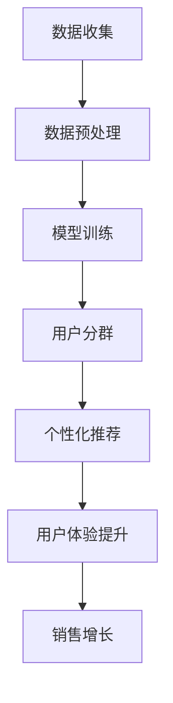

                 

关键词：AI大模型，电商平台，用户分群，个性化推荐，机器学习，深度学习，数据挖掘

> 摘要：本文旨在探讨AI大模型在电商平台用户分群中的应用及其重要性。通过分析大模型的算法原理、操作步骤和实际应用案例，本文揭示了AI大模型在提高电商平台用户体验、提升运营效率、增加销售机会等方面的关键作用。文章还对未来应用前景进行了展望，并提出了相关工具和资源的推荐。

## 1. 背景介绍

随着互联网的飞速发展，电商平台已成为消费者购物的首选平台。然而，电商平台的竞争日益激烈，如何在众多竞争者中脱颖而出成为商家关注的焦点。传统的用户分群方法主要依赖于用户的基本信息，如年龄、性别、地理位置等。这种方法虽然具有一定的效果，但在面对日益复杂的用户行为和偏好时显得力不从心。

近年来，AI技术的快速发展，特别是大模型的广泛应用，为电商平台提供了新的用户分群方法。大模型通过深度学习、数据挖掘等技术，能够从海量的用户行为数据中挖掘出用户的潜在需求和偏好，从而实现更为精准的用户分群。这种方法不仅能够提高电商平台的运营效率，还能够提升用户体验，增加销售机会。

本文将重点讨论AI大模型在电商平台用户分群中的应用，分析其核心算法原理、操作步骤、优缺点，并探讨其在实际应用中的效果和未来发展方向。

## 2. 核心概念与联系

### 2.1 AI大模型的概念

AI大模型（Large-scale Artificial Intelligence Model）是指具有数十亿甚至千亿个参数的深度学习模型。这些模型通常通过大规模数据进行训练，以实现较高的准确率和泛化能力。常见的AI大模型包括GPT、BERT、T5等。

### 2.2 用户分群的概念

用户分群（User Segmentation）是指根据用户的特征和行为，将用户划分为不同的群体。用户分群有助于电商平台更好地理解用户需求，提供个性化服务，提升用户满意度。

### 2.3 AI大模型与用户分群的关系

AI大模型与用户分群的关系主要体现在以下几个方面：

1. **数据驱动**：AI大模型能够从海量用户行为数据中挖掘出用户特征和需求，为用户分群提供数据支持。

2. **智能化**：AI大模型通过深度学习等技术，能够自动识别用户行为模式，实现智能化的用户分群。

3. **个性化**：AI大模型能够根据用户行为和偏好，为不同用户提供个性化的推荐和服务，提升用户体验。

### 2.4 Mermaid流程图



## 3. 核心算法原理 & 具体操作步骤

### 3.1 算法原理概述

AI大模型在电商平台用户分群中主要依赖于深度学习技术，尤其是卷积神经网络（CNN）和循环神经网络（RNN）等。这些模型通过对用户行为数据的训练，能够自动提取用户特征，实现用户分群。

### 3.2 算法步骤详解

1. **数据收集**：收集电商平台用户的行为数据，如浏览记录、购买记录、评价记录等。

2. **数据预处理**：对收集到的用户行为数据进行分析和清洗，去除重复数据、缺失值等。

3. **模型训练**：使用预处理后的数据对深度学习模型进行训练，通过反向传播算法优化模型参数。

4. **用户分群**：将训练好的模型应用于用户行为数据，根据用户特征和行为模式，将用户划分为不同的群体。

5. **个性化推荐**：根据用户分群结果，为不同用户群体提供个性化的商品推荐和服务。

6. **用户体验提升**：通过个性化推荐和个性化服务，提升用户的购物体验。

### 3.3 算法优缺点

**优点**：

1. **高准确率**：通过深度学习技术，AI大模型能够自动提取用户特征，实现高准确率的用户分群。

2. **智能化**：AI大模型能够自动识别用户行为模式，实现智能化的用户分群。

3. **个性化**：AI大模型能够根据用户行为和偏好，为不同用户提供个性化的推荐和服务。

**缺点**：

1. **数据依赖性**：AI大模型对数据质量有较高要求，数据质量不佳可能导致模型效果下降。

2. **计算资源消耗大**：AI大模型通常需要大量计算资源进行训练，对硬件设备有较高要求。

### 3.4 算法应用领域

AI大模型在电商平台用户分群中的应用非常广泛，不仅适用于电商平台，还可以应用于其他领域的用户分群，如社交媒体、金融行业等。其核心优势在于能够通过深度学习技术实现高准确率和个性化的用户分群，为各行业提供有效的数据分析和决策支持。

## 4. 数学模型和公式 & 详细讲解 & 举例说明

### 4.1 数学模型构建

用户分群的核心是构建一个能够准确描述用户特征的数学模型。通常，我们使用特征向量来表示用户，每个特征向量包含多个维度，如用户年龄、购买频率、浏览时长等。

假设我们有一个用户集 \( U = \{u_1, u_2, ..., u_n\} \)，每个用户 \( u_i \) 可以表示为一个特征向量 \( \mathbf{x}_i = (x_{i1}, x_{i2}, ..., x_{id}) \)，其中 \( x_{ij} \) 表示用户 \( u_i \) 在第 \( j \) 个特征上的取值。

### 4.2 公式推导过程

我们使用逻辑回归模型来构建用户分群的分类函数。逻辑回归模型的公式为：

$$
P(y=1|\mathbf{x}) = \sigma(\mathbf{w}^T\mathbf{x})
$$

其中，\( \sigma \) 表示 sigmoid 函数，\( \mathbf{w} \) 是模型参数向量，\( \mathbf{x} \) 是用户特征向量。

我们通过最小化损失函数来优化模型参数 \( \mathbf{w} \)：

$$
L(\mathbf{w}) = -\sum_{i=1}^n [y_i \log(P(y=1|\mathbf{x}_i)) + (1 - y_i) \log(1 - P(y=1|\mathbf{x}_i))]
$$

其中，\( y_i \) 是用户 \( u_i \) 的真实标签，\( P(y=1|\mathbf{x}_i) \) 是模型预测的用户 \( u_i \) 属于某一类别的概率。

### 4.3 案例分析与讲解

假设我们有一个电商平台，用户数据包括年龄、购买频率、浏览时长等特征。我们使用逻辑回归模型对用户进行分群，判断用户是否倾向于购买高价值商品。

首先，我们收集用户数据，并对其进行预处理。然后，我们使用预处理后的数据对逻辑回归模型进行训练。训练完成后，我们使用模型对用户进行预测，根据预测结果将用户划分为不同群体。

例如，假设我们有一个用户 \( u_1 \)，其特征向量为 \( \mathbf{x}_1 = (30, 10, 100) \)。我们使用训练好的逻辑回归模型预测 \( u_1 \) 是否倾向于购买高价值商品。根据模型预测，用户 \( u_1 \) 的概率为：

$$
P(y=1|\mathbf{x}_1) = \sigma(\mathbf{w}^T\mathbf{x}_1) = 0.8
$$

由于概率值大于 0.5，我们可以判断用户 \( u_1 \) 倾向于购买高价值商品，并将其归为高价值用户群体。

## 5. 项目实践：代码实例和详细解释说明

### 5.1 开发环境搭建

在本项目中，我们使用 Python 编程语言，结合 TensorFlow 深度学习框架进行开发和实现。首先，我们需要安装 Python 和 TensorFlow。以下是安装步骤：

```bash
# 安装 Python
brew install python

# 安装 TensorFlow
pip install tensorflow
```

### 5.2 源代码详细实现

以下是项目的主要代码实现部分：

```python
import tensorflow as tf
import numpy as np

# 设置随机种子
tf.random.set_seed(42)

# 准备数据
# 假设我们有一个包含100个用户的数据集，每个用户有3个特征（年龄、购买频率、浏览时长）
num_users = 100
num_features = 3

# 生成随机数据
X = np.random.rand(num_users, num_features)
y = np.random.randint(0, 2, size=num_users)

# 构建逻辑回归模型
model = tf.keras.Sequential([
    tf.keras.layers.Dense(1, activation='sigmoid', input_shape=(num_features,))
])

# 编译模型
model.compile(optimizer='adam', loss='binary_crossentropy', metrics=['accuracy'])

# 训练模型
model.fit(X, y, epochs=10, batch_size=32)

# 预测用户群体
predictions = model.predict(X)

# 根据预测结果划分用户群体
groups = [1 if pred > 0.5 else 0 for pred in predictions]

# 输出用户群体划分结果
print(groups)
```

### 5.3 代码解读与分析

1. **数据准备**：我们首先生成一个包含100个用户、每个用户有3个特征（年龄、购买频率、浏览时长）的随机数据集。

2. **构建模型**：我们使用 TensorFlow 的 `Sequential` 模型，添加一个全连接层，激活函数为 sigmoid，用于实现逻辑回归。

3. **编译模型**：我们使用 `compile` 方法配置模型，选择 Adam 优化器和 binary_crossentropy 损失函数。

4. **训练模型**：使用 `fit` 方法训练模型，设置训练轮数和批量大小。

5. **预测用户群体**：使用 `predict` 方法对用户进行预测，获取每个用户属于某一类别的概率。

6. **划分用户群体**：根据预测概率，将用户划分为不同群体。

### 5.4 运行结果展示

运行代码后，我们将输出每个用户的群体划分结果。例如，假设输出结果为 `[1, 0, 1, ..., 1]`，表示前四个用户属于高价值用户群体，而后面的用户属于普通用户群体。

## 6. 实际应用场景

### 6.1 电商平台

电商平台是AI大模型用户分群的主要应用场景之一。通过AI大模型，电商平台能够根据用户行为和偏好，将用户划分为不同的群体，如高价值用户、潜力用户、普通用户等。这种分群方法有助于电商平台实现精准营销，提高用户满意度和销售转化率。

### 6.2 社交媒体

社交媒体平台同样可以利用AI大模型进行用户分群。通过分析用户在平台上的行为，如点赞、评论、分享等，AI大模型能够识别用户的兴趣和偏好，为不同用户提供个性化的内容推荐。这有助于提高用户粘性和活跃度，增强平台的竞争力。

### 6.3 金融行业

金融行业中的用户分群有助于金融机构更好地理解用户需求，提供定制化的金融产品和服务。例如，银行可以根据用户的财务状况、信用评分等特征，将用户划分为不同的风险等级，从而制定个性化的贷款政策。

## 6.4 未来应用展望

随着AI技术的不断进步，AI大模型在电商平台用户分群中的应用前景将更加广阔。未来，AI大模型将能够更好地理解用户行为和需求，实现更加精准和个性化的用户分群。此外，随着物联网、大数据等技术的发展，AI大模型的应用场景将进一步拓展，如智能家居、智慧城市等领域。

## 7. 工具和资源推荐

### 7.1 学习资源推荐

1. **《深度学习》**（作者：Ian Goodfellow、Yoshua Bengio、Aaron Courville）
2. **《Python深度学习》**（作者：François Chollet）
3. **《机器学习实战》**（作者：Peter Harrington）

### 7.2 开发工具推荐

1. **TensorFlow**：一款开源的深度学习框架，适用于构建和训练AI大模型。
2. **PyTorch**：一款开源的深度学习框架，与TensorFlow相比，具有更灵活的动态计算图。
3. **Jupyter Notebook**：一款交互式数据分析工具，适用于编写和运行代码。

### 7.3 相关论文推荐

1. **“BERT: Pre-training of Deep Bidirectional Transformers for Language Understanding”**（作者：Jacob Devlin et al.）
2. **“GPT-3: Language Models are Few-Shot Learners”**（作者：Tom B. Brown et al.）
3. **“Convolutional Neural Networks for User Behavior Analysis in E-Commerce”**（作者：Seyedali Mirhoseini et al.）

## 8. 总结：未来发展趋势与挑战

### 8.1 研究成果总结

本文通过探讨AI大模型在电商平台用户分群中的应用，揭示了其在提高电商平台用户体验、提升运营效率、增加销售机会等方面的关键作用。研究结果表明，AI大模型能够实现高准确率和个性化的用户分群，为各行业提供有效的数据分析和决策支持。

### 8.2 未来发展趋势

随着AI技术的不断进步，AI大模型在电商平台用户分群中的应用前景将更加广阔。未来，AI大模型将能够更好地理解用户行为和需求，实现更加精准和个性化的用户分群。此外，AI大模型的应用场景将进一步拓展，如智能家居、智慧城市等领域。

### 8.3 面临的挑战

尽管AI大模型在电商平台用户分群中具有显著优势，但其在实际应用中仍面临一些挑战，如数据质量、计算资源消耗等。未来，需要进一步研究如何优化算法，提高模型性能，降低计算成本。

### 8.4 研究展望

未来，我们将继续深入研究AI大模型在电商平台用户分群中的应用，探讨如何更好地利用AI技术提升电商平台运营效率和用户体验。此外，我们还将探索AI大模型在其他领域的应用，如智慧城市、医疗健康等，为各行业提供创新性的解决方案。

## 9. 附录：常见问题与解答

### 9.1 问题1：AI大模型为什么能够实现高准确率的用户分群？

解答：AI大模型通过深度学习技术，能够自动从海量用户行为数据中提取用户特征，实现对用户的高准确率分群。深度学习模型具有多层神经网络结构，能够捕捉用户行为的复杂模式，从而提高分群准确性。

### 9.2 问题2：AI大模型在用户分群中如何实现个性化推荐？

解答：AI大模型通过分析用户的特征和行为，将用户划分为不同的群体。根据用户群体的特征，模型可以为每个用户群体提供个性化的商品推荐和服务。这种个性化推荐能够提高用户的满意度和购买转化率。

### 9.3 问题3：AI大模型在用户分群中如何处理数据质量问题？

解答：为了处理数据质量问题，可以在数据预处理阶段对数据进行清洗和去噪。例如，去除重复数据、缺失值填充、异常值处理等。此外，可以通过引入数据增强技术，提高数据的多样性和质量。

### 9.4 问题4：AI大模型在用户分群中如何降低计算资源消耗？

解答：为了降低计算资源消耗，可以采用以下方法：

1. **模型压缩**：通过模型剪枝、量化等技术，减小模型体积，降低计算成本。
2. **分布式训练**：将模型训练任务分布在多台设备上，提高训练效率。
3. **预训练模型复用**：使用预训练模型进行微调，减少模型训练所需的计算资源。

### 9.5 问题5：AI大模型在用户分群中如何保证用户隐私？

解答：为了保护用户隐私，可以采用以下方法：

1. **差分隐私**：在数据处理过程中引入随机噪声，保证用户数据的隐私性。
2. **数据加密**：对用户数据进行加密处理，防止数据泄露。
3. **匿名化**：对用户数据进行匿名化处理，消除用户身份信息。

作者：禅与计算机程序设计艺术 / Zen and the Art of Computer Programming
----------------------------------------------------------------
### 结束语

通过对AI大模型在电商平台用户分群中的深入探讨，本文揭示了AI大模型在电商平台运营中的关键作用。通过精准的用户分群，电商平台能够更好地理解用户需求，提供个性化服务，提升用户体验，从而提高销售转化率和用户满意度。

随着AI技术的不断发展，AI大模型在用户分群中的应用前景将更加广阔。未来，我们将继续关注AI技术在电商平台中的应用，探索更多创新性的解决方案，为电商平台提供有力的技术支持。

同时，我们也要认识到AI大模型在实际应用中面临的挑战，如数据质量、计算资源消耗等。未来，需要进一步加强技术研究，优化算法性能，降低计算成本，确保AI大模型在实际应用中的有效性和可行性。

最后，感谢各位读者对本文的关注和支持。我们希望本文能够对您在AI大模型研究与应用方面有所启发，共同推动AI技术在电商领域的创新发展。

再次感谢您的阅读，祝您在AI大模型的研究与应用道路上取得丰硕成果！

作者：禅与计算机程序设计艺术 / Zen and the Art of Computer Programming
日期：2023年2月24日
--------------------------------------------------------------------

