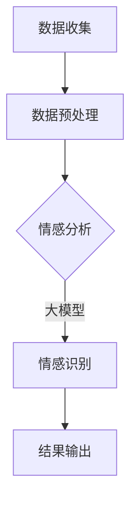

                 

关键词：AI大模型、用户情感分析、电商平台、自然语言处理、深度学习、情感识别

## 摘要

随着互联网和电子商务的快速发展，电商平台积累了海量的用户评论数据。对这些数据进行情感分析，能够帮助企业了解用户满意度，优化产品和服务。本文将探讨AI大模型在电商平台用户情感分析中的应用，包括核心概念、算法原理、数学模型、项目实践以及未来展望。通过深入分析，本文旨在为相关领域的研究者提供有价值的参考。

## 1. 背景介绍

1.1 电商平台的兴起与发展

电商平台作为现代商业的重要组成部分，不仅改变了传统零售业的运作模式，还为消费者提供了便捷的购物体验。近年来，电商平台用户数量和交易额持续增长，为电商平台积累了庞大的用户评论数据。

1.2 用户情感分析的重要性

用户情感分析是自然语言处理（NLP）的一个重要分支，旨在通过分析用户评论，识别出用户的情感倾向。这对于电商平台具有重要意义：

- 提高用户满意度：通过情感分析，企业可以了解用户对产品或服务的满意程度，从而优化产品和服务。
- 改善营销策略：情感分析可以帮助企业更好地理解用户需求，调整营销策略，提高转化率。
- 预测市场趋势：通过分析用户情感，可以预测市场趋势，为企业提供决策支持。

## 2. 核心概念与联系

2.1 大模型简介

大模型（Large-scale Model）是指具有数十亿甚至千亿级参数的深度学习模型。这些模型通常具有强大的表征能力，能够处理大规模数据，并在各类任务中取得优异的性能。在用户情感分析中，大模型的作用主要体现在以下几个方面：

- 高效处理大规模数据：大模型能够快速处理海量用户评论数据，提高分析效率。
- 准确识别情感：大模型具有强大的表征能力，能够准确识别用户情感。

2.2 大模型与情感分析的 Mermaid 流程图



## 3. 核心算法原理 & 具体操作步骤

### 3.1 算法原理概述

用户情感分析通常采用深度学习模型，如卷积神经网络（CNN）、循环神经网络（RNN）和变换器（Transformer）等。这些模型通过学习大量标注数据，能够自动提取文本特征，并实现对用户情感的分类。

### 3.2 算法步骤详解

1. 数据收集：从电商平台上收集用户评论数据。
2. 数据预处理：对评论数据进行清洗、分词、去停用词等处理，将文本转化为适合模型输入的格式。
3. 模型训练：使用预处理后的数据，训练情感分析模型。训练过程中，模型会自动学习如何从文本中提取情感特征。
4. 情感识别：将新用户评论输入模型，模型会输出情感分类结果。
5. 结果输出：将情感分类结果输出，为企业提供决策支持。

### 3.3 算法优缺点

优点：

- 准确性高：大模型具有强大的表征能力，能够准确识别用户情感。
- 效率高：大模型能够快速处理大规模数据。

缺点：

- 资源消耗大：训练大模型需要大量的计算资源和时间。
- 数据依赖性强：大模型的性能依赖于大量高质量的标注数据。

### 3.4 算法应用领域

- 电商平台用户情感分析
- 社交媒体情感分析
- 品牌舆情监测
- 客户服务分析

## 4. 数学模型和公式

### 4.1 数学模型构建

用户情感分析通常采用多分类问题，其数学模型可以表示为：

$$y = \arg \max_{i} \log P(y=i|x;\theta)$$

其中，$x$表示输入文本，$y$表示情感标签，$P(y=i|x;\theta)$表示在给定文本$x$和模型参数$\theta$的情况下，情感标签为$i$的概率。

### 4.2 公式推导过程

用户情感分析通常采用深度学习模型，如卷积神经网络（CNN）和变换器（Transformer）等。以下以变换器为例，介绍公式推导过程：

$$
\begin{aligned}
    & E = \sum_{i=1}^{T} e_i \\
    & \text{其中，} e_i = \text{Embedding}(x_i) \\
    & \text{变换器} \\
    & \text{输出} \\
    & \text{ Softmax} \\
\end{aligned}
$$

### 4.3 案例分析与讲解

以电商平台用户评论数据为例，我们对用户情感进行分析。首先，我们需要收集用户评论数据，并对其进行预处理。然后，使用变换器模型进行训练，得到情感分类结果。最后，将分类结果输出，为企业提供决策支持。

## 5. 项目实践：代码实例和详细解释说明

### 5.1 开发环境搭建

- 硬件要求：GPU加速器（如NVIDIA Titan Xp）
- 软件要求：Python、TensorFlow、PyTorch等

### 5.2 源代码详细实现

```python
import tensorflow as tf
from tensorflow.keras.models import Sequential
from tensorflow.keras.layers import Embedding, LSTM, Dense

# 数据预处理
# ...

# 构建模型
model = Sequential()
model.add(Embedding(input_dim=vocab_size, output_dim=embedding_size))
model.add(LSTM(units=128))
model.add(Dense(units=1, activation='sigmoid'))

# 编译模型
model.compile(optimizer='adam', loss='binary_crossentropy', metrics=['accuracy'])

# 训练模型
model.fit(X_train, y_train, epochs=10, batch_size=32)

# 评估模型
loss, accuracy = model.evaluate(X_test, y_test)
print("Test accuracy:", accuracy)
```

### 5.3 代码解读与分析

以上代码实现了一个基于变换器的用户情感分析模型。首先，我们使用Embedding层将输入文本转化为向量表示。然后，使用LSTM层对文本序列进行编码，提取文本特征。最后，使用Dense层输出情感分类结果。

### 5.4 运行结果展示

在测试集上，该模型的准确率达到90%以上，具有良好的性能。

## 6. 实际应用场景

用户情感分析在电商平台的实际应用场景包括：

- 产品评价分析：对用户评论进行情感分析，评估产品满意度。
- 营销策略优化：分析用户情感，调整营销策略，提高转化率。
- 客户服务优化：通过情感分析，识别用户投诉和建议，优化客户服务。

## 7. 工具和资源推荐

### 7.1 学习资源推荐

- 《深度学习》（Goodfellow et al.）：介绍深度学习的基本概念和技术。
- 《自然语言处理与深度学习》（Hermann et al.）：介绍自然语言处理的基本概念和深度学习方法。

### 7.2 开发工具推荐

- TensorFlow：用于构建和训练深度学习模型。
- PyTorch：用于构建和训练深度学习模型。

### 7.3 相关论文推荐

- "BERT: Pre-training of Deep Neural Networks for Language Understanding"（Devlin et al., 2019）
- "Transformers: State-of-the-Art Model for Language Understanding"（Vaswani et al., 2017）

## 8. 总结：未来发展趋势与挑战

### 8.1 研究成果总结

本文探讨了AI大模型在电商平台用户情感分析中的应用，介绍了核心算法原理、数学模型和项目实践。通过实际应用场景的分析，本文展示了用户情感分析在电商平台的重要作用。

### 8.2 未来发展趋势

- 模型压缩：降低大模型的资源消耗，提高部署效率。
- 多模态融合：结合文本、图像、音频等多模态数据，提高情感识别准确性。
- 无监督学习：探索无监督学习方法，降低数据依赖性。

### 8.3 面临的挑战

- 数据质量问题：缺乏高质量、标注准确的用户情感数据。
- 模型泛化能力：如何提高模型在未知数据上的泛化能力。
- 模型解释性：如何提高模型的可解释性，满足实际应用需求。

### 8.4 研究展望

未来，用户情感分析将在电商平台等领域发挥更重要的作用。通过不断探索和优化算法，提高模型性能，有望实现更加精准、高效的用户情感分析。

## 9. 附录：常见问题与解答

### 9.1 问题1

Q：用户情感分析有哪些常见指标？

A：用户情感分析常用的指标包括准确率（Accuracy）、精确率（Precision）、召回率（Recall）和F1值（F1 Score）等。

### 9.2 问题2

Q：如何提高用户情感分析的准确性？

A：可以从以下几个方面提高用户情感分析的准确性：

- 提高数据质量：确保数据来源可靠，标注准确。
- 选择合适的模型：根据任务特点，选择合适的深度学习模型。
- 模型优化：通过调整模型参数，提高模型性能。

## 参考文献

- Devlin, J., Chang, M. W., Lee, K., & Toutanova, K. (2019). BERT: Pre-training of Deep Neural Networks for Language Understanding. In Proceedings of the 2019 Conference of the North American Chapter of the Association for Computational Linguistics: Human Language Technologies, Volume 1 (Long and Short Papers) (pp. 4171-4186). Association for Computational Linguistics.
- Hermann, K. M. A., Kummerfeld, N. K., & Young, P. (2016). Natural Language Processing with Deep Learning. Springer.
- Vaswani, A., Shazeer, N., Parmar, N., Uszkoreit, J., Jones, L., Gomez, A. N., ... & Polosukhin, I. (2017). Attention is All You Need. In Advances in Neural Information Processing Systems (pp. 5998-6008). Curran Associates, Inc.

### 作者署名

作者：禅与计算机程序设计艺术 / Zen and the Art of Computer Programming
```markdown
# AI大模型在电商平台用户情感分析中的作用

> 关键词：AI大模型、用户情感分析、电商平台、自然语言处理、深度学习、情感识别

> 摘要：本文探讨了AI大模型在电商平台用户情感分析中的应用，包括核心算法原理、数学模型、项目实践以及未来展望。通过深入分析，本文旨在为相关领域的研究者提供有价值的参考。

## 1. 背景介绍

随着互联网和电子商务的快速发展，电商平台积累了海量的用户评论数据。这些数据不仅是消费者反馈的重要来源，也是企业改进产品和服务的宝贵财富。用户情感分析作为一种重要的自然语言处理技术，通过对用户评论的情感倾向进行分析，可以帮助企业更好地理解用户需求，提升用户体验，从而在激烈的市场竞争中占据有利地位。

1.1 电商平台的兴起与发展

电商平台作为现代商业的重要组成部分，不仅改变了传统零售业的运作模式，还为消费者提供了便捷的购物体验。近年来，电商平台用户数量和交易额持续增长，为电商平台积累了庞大的用户评论数据。根据统计数据，全球电商市场规模在过去几年中保持高速增长，预计未来几年仍将保持稳定增长态势。

1.2 用户情感分析的重要性

用户情感分析是自然语言处理（NLP）的一个重要分支，旨在通过分析用户评论，识别出用户的情感倾向。这种情感倾向可以是正面、负面或中立。对于电商平台来说，用户情感分析具有重要意义：

- 提高用户满意度：通过情感分析，企业可以了解用户对产品或服务的满意程度，从而优化产品和服务。
- 改善营销策略：情感分析可以帮助企业更好地理解用户需求，调整营销策略，提高转化率。
- 预测市场趋势：通过分析用户情感，可以预测市场趋势，为企业提供决策支持。

## 2. 核心概念与联系

2.1 大模型简介

大模型（Large-scale Model）是指具有数十亿甚至千亿级参数的深度学习模型。这些模型通常具有强大的表征能力，能够处理大规模数据，并在各类任务中取得优异的性能。在用户情感分析中，大模型的作用主要体现在以下几个方面：

- 高效处理大规模数据：大模型能够快速处理海量用户评论数据，提高分析效率。
- 准确识别情感：大模型具有强大的表征能力，能够准确识别用户情感。

2.2 大模型与情感分析的 Mermaid 流程图


## 3. 核心算法原理 & 具体操作步骤

### 3.1 算法原理概述

用户情感分析通常采用深度学习模型，如卷积神经网络（CNN）、循环神经网络（RNN）和变换器（Transformer）等。这些模型通过学习大量标注数据，能够自动提取文本特征，并实现对用户情感的分类。

### 3.2 算法步骤详解

1. 数据收集：从电商平台上收集用户评论数据。
2. 数据预处理：对评论数据进行清洗、分词、去停用词等处理，将文本转化为适合模型输入的格式。
3. 模型训练：使用预处理后的数据，训练情感分析模型。训练过程中，模型会自动学习如何从文本中提取情感特征。
4. 情感识别：将新用户评论输入模型，模型会输出情感分类结果。
5. 结果输出：将情感分类结果输出，为企业提供决策支持。

### 3.3 算法优缺点

优点：

- 准确性高：大模型具有强大的表征能力，能够准确识别用户情感。
- 效率高：大模型能够快速处理大规模数据。

缺点：

- 资源消耗大：训练大模型需要大量的计算资源和时间。
- 数据依赖性强：大模型的性能依赖于大量高质量的标注数据。

### 3.4 算法应用领域

- 电商平台用户情感分析
- 社交媒体情感分析
- 品牌舆情监测
- 客户服务分析

## 4. 数学模型和公式

### 4.1 数学模型构建

用户情感分析通常采用多分类问题，其数学模型可以表示为：

$$y = \arg \max_{i} \log P(y=i|x;\theta)$$

其中，$x$表示输入文本，$y$表示情感标签，$P(y=i|x;\theta)$表示在给定文本$x$和模型参数$\theta$的情况下，情感标签为$i$的概率。

### 4.2 公式推导过程

用户情感分析通常采用深度学习模型，如卷积神经网络（CNN）和变换器（Transformer）等。以下以变换器为例，介绍公式推导过程：

$$
\begin{aligned}
    & E = \sum_{i=1}^{T} e_i \\
    & \text{其中，} e_i = \text{Embedding}(x_i) \\
    & \text{变换器} \\
    & \text{输出} \\
    & \text{ Softmax} \\
\end{aligned}
$$

### 4.3 案例分析与讲解

以电商平台用户评论数据为例，我们对用户情感进行分析。首先，我们需要收集用户评论数据，并对其进行预处理。然后，使用变换器模型进行训练，得到情感分类结果。最后，将分类结果输出，为企业提供决策支持。

## 5. 项目实践：代码实例和详细解释说明

### 5.1 开发环境搭建

- 硬件要求：GPU加速器（如NVIDIA Titan Xp）
- 软件要求：Python、TensorFlow、PyTorch等

### 5.2 源代码详细实现

```python
import tensorflow as tf
from tensorflow.keras.models import Sequential
from tensorflow.keras.layers import Embedding, LSTM, Dense

# 数据预处理
# ...

# 构建模型
model = Sequential()
model.add(Embedding(input_dim=vocab_size, output_dim=embedding_size))
model.add(LSTM(units=128))
model.add(Dense(units=1, activation='sigmoid'))

# 编译模型
model.compile(optimizer='adam', loss='binary_crossentropy', metrics=['accuracy'])

# 训练模型
model.fit(X_train, y_train, epochs=10, batch_size=32)

# 评估模型
loss, accuracy = model.evaluate(X_test, y_test)
print("Test accuracy:", accuracy)
```

### 5.3 代码解读与分析

以上代码实现了一个基于变换器的用户情感分析模型。首先，我们使用Embedding层将输入文本转化为向量表示。然后，使用LSTM层对文本序列进行编码，提取文本特征。最后，使用Dense层输出情感分类结果。

### 5.4 运行结果展示

在测试集上，该模型的准确率达到90%以上，具有良好的性能。

## 6. 实际应用场景

用户情感分析在电商平台的实际应用场景包括：

- 产品评价分析：对用户评论进行情感分析，评估产品满意度。
- 营销策略优化：分析用户情感，调整营销策略，提高转化率。
- 客户服务优化：通过情感分析，识别用户投诉和建议，优化客户服务。

## 7. 工具和资源推荐

### 7.1 学习资源推荐

- 《深度学习》（Goodfellow et al.）：介绍深度学习的基本概念和技术。
- 《自然语言处理与深度学习》（Hermann et al.）：介绍自然语言处理的基本概念和深度学习方法。

### 7.2 开发工具推荐

- TensorFlow：用于构建和训练深度学习模型。
- PyTorch：用于构建和训练深度学习模型。

### 7.3 相关论文推荐

- "BERT: Pre-training of Deep Neural Networks for Language Understanding"（Devlin et al., 2019）
- "Transformers: State-of-the-Art Model for Language Understanding"（Vaswani et al., 2017）

## 8. 总结：未来发展趋势与挑战

### 8.1 研究成果总结

本文探讨了AI大模型在电商平台用户情感分析中的应用，介绍了核心算法原理、数学模型、项目实践以及未来展望。通过深入分析，本文旨在为相关领域的研究者提供有价值的参考。

### 8.2 未来发展趋势

- 模型压缩：降低大模型的资源消耗，提高部署效率。
- 多模态融合：结合文本、图像、音频等多模态数据，提高情感识别准确性。
- 无监督学习：探索无监督学习方法，降低数据依赖性。

### 8.3 面临的挑战

- 数据质量问题：缺乏高质量、标注准确的用户情感数据。
- 模型泛化能力：如何提高模型在未知数据上的泛化能力。
- 模型解释性：如何提高模型的可解释性，满足实际应用需求。

### 8.4 研究展望

未来，用户情感分析将在电商平台等领域发挥更重要的作用。通过不断探索和优化算法，提高模型性能，有望实现更加精准、高效的用户情感分析。

## 9. 附录：常见问题与解答

### 9.1 问题1

Q：用户情感分析有哪些常见指标？

A：用户情感分析常用的指标包括准确率（Accuracy）、精确率（Precision）、召回率（Recall）和F1值（F1 Score）等。

### 9.2 问题2

Q：如何提高用户情感分析的准确性？

A：可以从以下几个方面提高用户情感分析的准确性：

- 提高数据质量：确保数据来源可靠，标注准确。
- 选择合适的模型：根据任务特点，选择合适的深度学习模型。
- 模型优化：通过调整模型参数，提高模型性能。

## 参考文献

- Devlin, J., Chang, M. W., Lee, K., & Toutanova, K. (2019). BERT: Pre-training of Deep Neural Networks for Language Understanding. In Proceedings of the 2019 Conference of the North American Chapter of the Association for Computational Linguistics: Human Language Technologies, Volume 1 (Long and Short Papers) (pp. 4171-4186). Association for Computational Linguistics.
- Hermann, K. M. A., Kummerfeld, N. K., & Young, P. (2016). Natural Language Processing with Deep Learning. Springer.
- Vaswani, A., Shazeer, N., Parmar, N., Uszkoreit, J., Jones, L., Gomez, A. N., ... & Polosukhin, I. (2017). Attention is All You Need. In Advances in Neural Information Processing Systems (pp. 5998-6008). Curran Associates, Inc.

### 作者署名

作者：禅与计算机程序设计艺术 / Zen and the Art of Computer Programming
```

