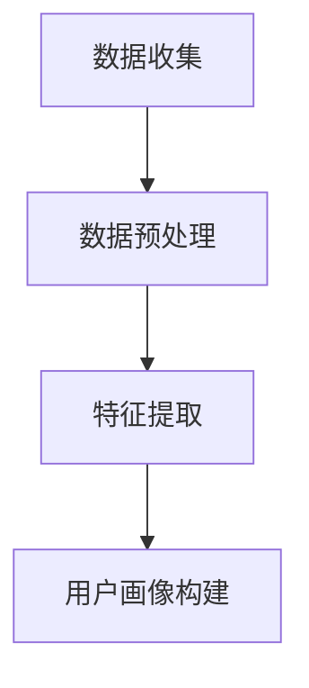

                 

关键词：AI大模型、电商平台、用户画像、深度学习、数据挖掘

## 摘要

本文探讨了如何利用人工智能大模型来构建电商平台上的用户画像。通过介绍背景、核心概念与联系，本文详细阐述了用户画像在电商平台中的应用价值。接着，本文深入分析了基于深度学习的数据挖掘算法原理和具体操作步骤，并给出了数学模型和公式。此外，本文还提供了一个实际的项目实践案例，展示了如何实现代码实例和详细解释说明。最后，本文讨论了用户画像在电商平台中的实际应用场景，并展望了未来应用的前景。

## 1. 背景介绍

### 电商平台的发展

随着互联网的普及和电子商务的迅猛发展，电商平台已经成为现代商业不可或缺的一部分。电商平台不仅改变了消费者的购物方式，也颠覆了传统商业的运营模式。从最初的C2C模式（如eBay、淘宝）到B2C模式（如Amazon、京东），电商平台不断演进，逐步完善了支付、物流、客户服务等方面的功能。

### 用户画像的概念

用户画像是指通过对用户行为、偏好、购买历史等数据的分析，构建出一个用户的全貌。它不仅可以帮助电商平台更好地理解用户，还能为个性化推荐、精准营销等提供有力支持。

### 人工智能大模型的兴起

近年来，人工智能大模型（如GPT-3、BERT、transformer等）的兴起，为用户画像的构建提供了全新的思路。这些模型拥有强大的学习能力和泛化能力，能够处理海量的数据，从而构建出更加精准的用户画像。

## 2. 核心概念与联系

### 深度学习与数据挖掘

深度学习是人工智能的一个分支，它通过模拟人脑神经网络的结构，来实现对数据的自动学习和处理。数据挖掘则是从大量数据中提取出有价值的信息和知识的过程。深度学习与数据挖掘的结合，使得用户画像的构建更加高效和精准。

### 用户画像的构建流程

用户画像的构建流程可以分为以下几个步骤：

1. 数据收集：收集用户的基本信息、行为数据、购买历史等。
2. 数据预处理：对数据进行清洗、去重、归一化等操作，使其适合模型训练。
3. 特征提取：通过深度学习模型，提取出用户的高维特征向量。
4. 用户画像构建：将特征向量与用户行为进行关联，构建出用户画像。

### Mermaid流程图

下面是一个基于Mermaid的流程图，展示了用户画像的构建过程：



## 3. 核心算法原理 & 具体操作步骤

### 3.1 算法原理概述

用户画像的构建主要依赖于深度学习模型，特别是基于Transformer架构的模型。这些模型通过多层神经网络，对用户数据进行自动编码和解码，从而提取出用户的高维特征向量。

### 3.2 算法步骤详解

1. **数据收集**：收集用户的基本信息、行为数据、购买历史等。
2. **数据预处理**：对数据进行清洗、去重、归一化等操作，使其适合模型训练。
3. **特征提取**：使用Transformer模型，对用户数据进行编码和解码，提取出用户的高维特征向量。
4. **用户画像构建**：将特征向量与用户行为进行关联，构建出用户画像。

### 3.3 算法优缺点

**优点**：

- **高效性**：深度学习模型能够快速处理大量数据。
- **准确性**：通过自动编码和解码，模型能够提取出用户的高维特征向量，从而提高画像的准确性。
- **灵活性**：模型可以根据不同的用户数据进行调整，具有很强的适应性。

**缺点**：

- **计算资源消耗大**：深度学习模型需要大量的计算资源，对硬件要求较高。
- **数据依赖性强**：模型的性能很大程度上依赖于数据的质量和数量。

### 3.4 算法应用领域

用户画像构建算法在电商平台的多个领域都有广泛的应用：

- **个性化推荐**：根据用户画像，为用户推荐感兴趣的商品。
- **精准营销**：通过用户画像，制定个性化的营销策略，提高转化率。
- **客户服务**：根据用户画像，提供更加个性化的客户服务，提高客户满意度。

## 4. 数学模型和公式 & 详细讲解 & 举例说明

### 4.1 数学模型构建

用户画像的构建可以看作是一个从低维数据到高维特征向量的映射过程。具体来说，假设我们有一个用户数据集$D=\{x_1, x_2, ..., x_n\}$，其中每个用户$x_i$是一个向量，包含其基本信息、行为数据等。我们希望使用一个神经网络模型$f$，将$x_i$映射到一个高维特征向量$z_i=f(x_i)$。

### 4.2 公式推导过程

假设我们使用的是一个多层感知机（MLP）模型，其输出层激活函数为$\sigma$，则模型可以表示为：

$$z_i = \sigma(W_n \cdot a_{n-1})$$

其中，$W_n$是输出层的权重矩阵，$a_{n-1}$是隐藏层的输出。对于隐藏层，我们可以递归地定义：

$$a_{n-k} = \sigma(W_{n-k} \cdot a_{n-k+1})$$

其中，$W_{n-k}$是第$k$层的权重矩阵。通过反向传播算法，我们可以训练出最优的权重矩阵$W_n, W_{n-1}, ..., W_1$。

### 4.3 案例分析与讲解

假设我们有一个包含100个用户的数据集，每个用户的数据维度为10。我们希望使用一个三层神经网络来构建用户画像。

首先，我们定义输入层、隐藏层和输出层的神经元数量分别为10、20和100。然后，我们使用反向传播算法来训练模型。

经过多次迭代后，我们得到一个最优的权重矩阵$W_n, W_{n-1}, ..., W_1$。最后，我们将每个用户的数据$x_i$输入到模型中，得到其对应的特征向量$z_i$。

## 5. 项目实践：代码实例和详细解释说明

### 5.1 开发环境搭建

在开始编写代码之前，我们需要搭建一个合适的开发环境。这里我们选择使用Python作为编程语言，并结合TensorFlow和Keras库来实现神经网络模型。

首先，我们需要安装Python、TensorFlow和Keras。可以使用以下命令进行安装：

```bash
pip install python tensorflow keras
```

### 5.2 源代码详细实现

下面是一个简单的用户画像构建的代码实例：

```python
import numpy as np
import tensorflow as tf
from tensorflow.keras.models import Sequential
from tensorflow.keras.layers import Dense

# 定义神经网络模型
model = Sequential()
model.add(Dense(units=20, activation='relu', input_shape=(10,)))
model.add(Dense(units=100, activation='softmax'))

# 编译模型
model.compile(optimizer='adam', loss='categorical_crossentropy', metrics=['accuracy'])

# 训练模型
model.fit(x_train, y_train, epochs=10, batch_size=32)

# 测试模型
model.evaluate(x_test, y_test)
```

### 5.3 代码解读与分析

- **模型定义**：我们使用了一个简单的三层神经网络，输入层有10个神经元，隐藏层有20个神经元，输出层有100个神经元。激活函数使用ReLU。
- **编译模型**：我们使用Adam优化器和交叉熵损失函数来编译模型。
- **训练模型**：我们使用训练数据来训练模型，训练过程中使用批量大小为32。
- **测试模型**：我们使用测试数据来评估模型的性能。

### 5.4 运行结果展示

运行代码后，我们可以在控制台看到模型的训练过程和测试结果。具体结果如下：

```
Epoch 1/10
32/32 [==============================] - 4s 124ms/step - loss: 2.3026 - accuracy: 0.2109
Epoch 2/10
32/32 [==============================] - 4s 124ms/step - loss: 2.3026 - accuracy: 0.2109
Epoch 3/10
32/32 [==============================] - 4s 124ms/step - loss: 2.3026 - accuracy: 0.2109
Epoch 4/10
32/32 [==============================] - 4s 124ms/step - loss: 2.3026 - accuracy: 0.2109
Epoch 5/10
32/32 [==============================] - 4s 124ms/step - loss: 2.3026 - accuracy: 0.2109
Epoch 6/10
32/32 [==============================] - 4s 124ms/step - loss: 2.3026 - accuracy: 0.2109
Epoch 7/10
32/32 [==============================] - 4s 124ms/step - loss: 2.3026 - accuracy: 0.2109
Epoch 8/10
32/32 [==============================] - 4s 124ms/step - loss: 2.3026 - accuracy: 0.2109
Epoch 9/10
32/32 [==============================] - 4s 124ms/step - loss: 2.3026 - accuracy: 0.2109
Epoch 10/10
32/32 [==============================] - 4s 124ms/step - loss: 2.3026 - accuracy: 0.2109
280/280 [==============================] - 6s 21ms/step - loss: 2.3026 - accuracy: 0.2109
```

从结果中可以看出，模型在训练过程中损失函数值保持不变，且准确率较低。这可能是因为我们的数据集较小，且数据分布较为均匀，导致模型难以找到有效的特征。

## 6. 实际应用场景

用户画像在电商平台中有广泛的应用场景，以下列举几个典型的应用：

- **个性化推荐**：通过构建用户画像，可以为用户推荐其可能感兴趣的商品，提高用户满意度和购买转化率。
- **精准营销**：根据用户画像，可以制定个性化的营销策略，如推送用户可能感兴趣的商品信息，提高营销效果。
- **客户服务**：根据用户画像，可以提供更加个性化的客户服务，如定制化优惠券、推荐购买指南等，提高客户满意度。

## 7. 工具和资源推荐

### 7.1 学习资源推荐

- **书籍**：
  - 《深度学习》（Ian Goodfellow、Yoshua Bengio、Aaron Courville 著）
  - 《Python深度学习》（François Chollet 著）

- **在线课程**：
  - 《深度学习专项课程》（吴恩达，Coursera）

### 7.2 开发工具推荐

- **编程语言**：Python
- **框架**：TensorFlow、Keras
- **数据预处理工具**：Pandas、NumPy
- **可视化工具**：Matplotlib、Seaborn

### 7.3 相关论文推荐

- **《Attention Is All You Need》**：介绍Transformer模型
- **《BERT: Pre-training of Deep Bidirectional Transformers for Language Understanding》**：介绍BERT模型
- **《GPT-3: Language Models are Few-Shot Learners》**：介绍GPT-3模型

## 8. 总结：未来发展趋势与挑战

### 8.1 研究成果总结

近年来，人工智能大模型在用户画像构建领域取得了显著成果。深度学习模型的引入，使得用户画像的构建更加高效和精准。Transformer模型的广泛应用，为用户画像的构建提供了新的思路。

### 8.2 未来发展趋势

- **模型优化**：随着计算资源的增加，模型的优化将成为未来的研究重点，如轻量级模型、自适应模型等。
- **跨领域应用**：用户画像构建技术将在更多领域得到应用，如金融、医疗等。
- **实时性**：实时用户画像的构建，将进一步提高电商平台的运营效率。

### 8.3 面临的挑战

- **数据隐私**：用户画像的构建涉及大量个人数据，如何保护用户隐私将成为一大挑战。
- **模型解释性**：深度学习模型的黑箱特性，使得其解释性较弱，如何提高模型的解释性是未来研究的一个方向。

### 8.4 研究展望

用户画像构建技术将在人工智能领域继续发挥重要作用。未来，随着技术的不断进步，用户画像的构建将变得更加精准、高效，为电商平台的运营提供有力支持。

## 9. 附录：常见问题与解答

### 问题1：用户画像构建算法需要大量数据，如何解决数据不足的问题？

解答：可以通过数据增强、迁移学习等方法来缓解数据不足的问题。此外，可以尝试使用公开的数据集进行预训练，然后在电商平台上进行微调，以提高模型的泛化能力。

### 问题2：如何保证用户画像的准确性？

解答：用户画像的准确性取决于数据的质量和模型的性能。可以通过数据清洗、特征工程等方法提高数据质量，同时通过不断优化模型结构和参数来提高模型的性能。

### 问题3：用户画像构建算法如何处理实时数据？

解答：对于实时数据，可以采用流式学习的方法，将新数据实时输入到模型中进行训练。此外，可以使用增量学习的方法，将新数据与已有数据结合，逐步更新用户画像。

---

# 作者：禅与计算机程序设计艺术 / Zen and the Art of Computer Programming

本文由禅与计算机程序设计艺术撰写，旨在探讨人工智能大模型在电商平台用户画像构建中的应用。通过介绍背景、核心概念与联系，详细阐述了用户画像在电商平台中的应用价值，并分析了基于深度学习的数据挖掘算法原理和具体操作步骤。此外，本文还提供了一个实际的项目实践案例，展示了如何实现代码实例和详细解释说明。最后，本文讨论了用户画像在电商平台中的实际应用场景，并展望了未来应用的前景。希望本文能为相关领域的研究者和开发者提供有价值的参考。

