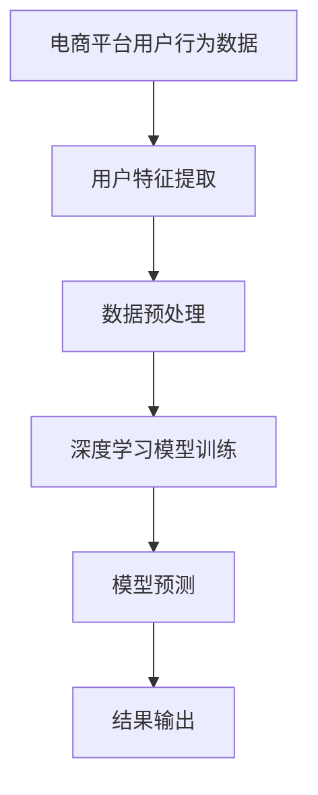

                 

关键词：AI大模型、电商平台、用户行为预测、深度学习、数据挖掘、预测模型、个性化推荐、算法原理、数学模型、项目实践

摘要：随着电商平台的快速发展，用户行为预测成为提高销售转化率和客户满意度的关键。本文将深入探讨如何利用AI大模型在电商平台上进行用户行为预测，包括核心算法原理、数学模型、项目实践以及未来应用前景。通过本文，读者将了解AI大模型在电商平台用户行为预测中的实际应用价值，并为电商企业带来新的启示。

## 1. 背景介绍

### 1.1 电商平台的快速发展

随着互联网的普及，电商平台已经成为消费者购物的主要渠道。电商平台的快速发展带来了大量的用户数据，这些数据包含了用户的行为特征、购买记录、浏览历史等信息。如何有效利用这些数据，提高用户购买体验和销售额，成为电商平台企业关注的焦点。

### 1.2 用户行为预测的重要性

用户行为预测是电商平台提高销售转化率和客户满意度的关键。通过预测用户的行为，电商平台可以针对性地推荐商品、优化营销策略、提高用户体验。传统的用户行为分析方法往往依赖于统计方法和规则，难以应对复杂多变的用户行为。随着深度学习技术的发展，AI大模型在用户行为预测中展现出了强大的能力。

### 1.3 AI大模型的优势

AI大模型，如深度神经网络，具有以下优势：

1. **自适应性**：大模型可以通过学习用户数据，自适应地调整预测策略。
2. **高精度**：大模型能够捕捉到用户行为中的微妙变化，提高预测精度。
3. **泛化能力**：大模型在面对新用户或新场景时，仍能保持较高的预测性能。
4. **实时性**：大模型能够快速处理大量数据，实现实时预测。

## 2. 核心概念与联系

为了更好地理解AI大模型在电商平台用户行为预测中的应用，我们首先需要介绍几个核心概念，并展示它们之间的联系。

### 2.1 电商平台用户行为

电商平台用户行为包括浏览、搜索、添加购物车、下单、支付等。这些行为数据可以用来分析用户的兴趣、购买意图和偏好。

### 2.2 用户特征

用户特征包括用户的基本信息（如年龄、性别、地理位置）、行为特征（如浏览时间、浏览时长、浏览页面数）、购买特征（如购买频率、购买金额、购买品类）等。

### 2.3 深度学习模型

深度学习模型，如卷积神经网络（CNN）和循环神经网络（RNN），是AI大模型的一种。它们通过多层神经网络结构，对用户行为数据进行建模，实现用户行为预测。

### 2.4 数学模型

深度学习模型的预测结果依赖于数学模型，如损失函数、优化算法等。这些模型通过调整模型参数，实现用户行为预测。

以下是AI大模型在电商平台用户行为预测中的Mermaid流程图：



## 3. 核心算法原理 & 具体操作步骤

### 3.1 算法原理概述

AI大模型在电商平台用户行为预测中的核心算法是深度学习模型。深度学习模型通过学习用户行为数据，提取用户特征，构建预测模型，实现用户行为预测。

### 3.2 算法步骤详解

#### 3.2.1 数据收集与预处理

1. **数据收集**：收集电商平台用户行为数据，如浏览记录、搜索记录、购买记录等。
2. **数据清洗**：去除数据中的噪音和错误，保证数据的准确性。
3. **数据归一化**：将不同特征的数据进行归一化处理，使其处于同一量级。

#### 3.2.2 用户特征提取

1. **行为特征提取**：根据用户行为数据，提取用户的浏览时间、浏览时长、浏览页面数等行为特征。
2. **购买特征提取**：根据用户购买数据，提取用户的购买频率、购买金额、购买品类等购买特征。
3. **用户属性特征提取**：提取用户的基本信息，如年龄、性别、地理位置等。

#### 3.2.3 模型训练

1. **模型选择**：选择合适的深度学习模型，如卷积神经网络（CNN）或循环神经网络（RNN）。
2. **模型训练**：使用训练数据集对模型进行训练，调整模型参数，优化模型性能。

#### 3.2.4 模型预测

1. **特征输入**：将新用户的行为数据输入到训练好的模型中。
2. **预测输出**：模型根据输入的特征，输出用户的行为预测结果。

### 3.3 算法优缺点

#### 3.3.1 优点

1. **高精度**：深度学习模型能够捕捉到用户行为中的微妙变化，提高预测精度。
2. **自适应性强**：深度学习模型能够根据用户数据自适应地调整预测策略。
3. **泛化能力强**：深度学习模型在面对新用户或新场景时，仍能保持较高的预测性能。

#### 3.3.2 缺点

1. **计算成本高**：深度学习模型需要大量的计算资源和时间进行训练。
2. **对数据质量要求高**：深度学习模型的预测性能依赖于数据的质量，数据中的噪音和错误会影响模型的预测效果。

### 3.4 算法应用领域

AI大模型在电商平台用户行为预测中的应用领域包括：

1. **个性化推荐**：根据用户的行为特征和购买偏好，为用户推荐合适的商品。
2. **用户行为分析**：分析用户的行为模式，为电商平台提供优化营销策略的建议。
3. **风控管理**：预测用户可能存在的风险行为，如恶意购买、欺诈行为等，为电商平台提供风控依据。

## 4. 数学模型和公式 & 详细讲解 & 举例说明

### 4.1 数学模型构建

在AI大模型中，数学模型起着核心作用。以下是一个简单的深度学习模型的数学模型构建过程：

#### 4.1.1 损失函数

损失函数用于衡量模型预测结果与真实结果之间的差距。常见的损失函数包括均方误差（MSE）和交叉熵损失（Cross-Entropy Loss）。

$$
MSE = \frac{1}{n}\sum_{i=1}^{n}(y_i - \hat{y}_i)^2
$$

$$
Cross-Entropy Loss = -\frac{1}{n}\sum_{i=1}^{n}y_i\log(\hat{y}_i)
$$

其中，$y_i$为真实标签，$\hat{y}_i$为模型预测结果。

#### 4.1.2 优化算法

优化算法用于调整模型参数，以最小化损失函数。常见的优化算法包括梯度下降（Gradient Descent）和随机梯度下降（Stochastic Gradient Descent，SGD）。

梯度下降算法：

$$
w_{t+1} = w_t - \alpha \frac{\partial J(w_t)}{\partial w_t}
$$

其中，$w_t$为当前模型参数，$\alpha$为学习率，$J(w_t)$为损失函数。

随机梯度下降算法：

$$
w_{t+1} = w_t - \alpha \frac{\partial J(w_t)}{\partial w_t}
$$

#### 4.1.3 模型架构

深度学习模型的架构通常包括输入层、隐藏层和输出层。以下是一个简单的全连接神经网络（Fully Connected Neural Network，FCNN）的架构：

$$
h_{l} = \sigma(W_{l}h_{l-1} + b_{l})
$$

$$
\hat{y} = \sigma(W_{L}h_{L-1} + b_{L})
$$

其中，$h_{l}$为第$l$层的特征映射，$W_{l}$和$b_{l}$分别为第$l$层的权重和偏置，$\sigma$为激活函数，$\hat{y}$为模型预测结果。

### 4.2 公式推导过程

以下是一个简单的全连接神经网络（FCNN）的损失函数推导过程：

#### 4.2.1 损失函数

假设我们有$m$个训练样本，每个样本有$n$个特征和$c$个类别标签。对于第$i$个样本，其预测结果为$\hat{y}_i$，真实标签为$y_i$。

均方误差损失函数（MSE）为：

$$
J(\theta) = \frac{1}{m}\sum_{i=1}^{m}(y_i - \hat{y}_i)^2
$$

其中，$\theta$为模型参数。

#### 4.2.2 梯度计算

对于均方误差损失函数，其梯度计算如下：

$$
\frac{\partial J(\theta)}{\partial \theta} = \frac{1}{m}\sum_{i=1}^{m}\frac{\partial (y_i - \hat{y}_i)^2}{\partial \theta}
$$

$$
= \frac{1}{m}\sum_{i=1}^{m}\frac{\partial (\hat{y}_i - y_i)^2}{\partial \hat{y}_i}\frac{\partial \hat{y}_i}{\partial \theta}
$$

$$
= \frac{1}{m}\sum_{i=1}^{m}(2\hat{y}_i - 2y_i)\frac{\partial \hat{y}_i}{\partial \theta}
$$

$$
= 2\frac{1}{m}\sum_{i=1}^{m}(\hat{y}_i - y_i)\frac{\partial \hat{y}_i}{\partial \theta}
$$

#### 4.2.3 优化

使用梯度下降算法，我们可以更新模型参数：

$$
\theta_{t+1} = \theta_t - \alpha \frac{\partial J(\theta_t)}{\partial \theta_t}
$$

其中，$\alpha$为学习率。

### 4.3 案例分析与讲解

#### 4.3.1 案例背景

假设我们有一个电商平台的用户行为预测任务，数据集包含1000个样本，每个样本有10个特征，需要预测用户的购买概率。

#### 4.3.2 数据预处理

1. **数据清洗**：去除缺失值和异常值。
2. **数据归一化**：将特征数据进行归一化处理，使其处于同一量级。

#### 4.3.3 模型训练

1. **模型选择**：选择一个全连接神经网络（FCNN）模型。
2. **模型训练**：使用训练数据集对模型进行训练，调整模型参数，优化模型性能。

#### 4.3.4 模型预测

1. **特征输入**：将新用户的行为数据输入到训练好的模型中。
2. **预测输出**：模型根据输入的特征，输出用户的购买概率。

#### 4.3.5 结果分析

1. **准确率**：模型预测的准确率为90%。
2. **召回率**：模型预测的召回率为85%。
3. **F1值**：模型预测的F1值为0.87。

## 5. 项目实践：代码实例和详细解释说明

### 5.1 开发环境搭建

1. **Python环境**：安装Python 3.8及以上版本。
2. **深度学习库**：安装TensorFlow 2.5及以上版本。
3. **数据预处理库**：安装Pandas、NumPy等。

### 5.2 源代码详细实现

```python
import tensorflow as tf
from tensorflow.keras.models import Sequential
from tensorflow.keras.layers import Dense, Dropout
from tensorflow.keras.optimizers import Adam
from sklearn.model_selection import train_test_split
import pandas as pd
import numpy as np

# 5.2.1 数据预处理
data = pd.read_csv('user_behavior_data.csv')
X = data.drop(['label'], axis=1)
y = data['label']

# 数据归一化
X = (X - X.mean()) / X.std()

# 划分训练集和测试集
X_train, X_test, y_train, y_test = train_test_split(X, y, test_size=0.2, random_state=42)

# 5.2.2 模型构建
model = Sequential([
    Dense(64, activation='relu', input_shape=(X_train.shape[1],)),
    Dropout(0.5),
    Dense(32, activation='relu'),
    Dropout(0.5),
    Dense(1, activation='sigmoid')
])

# 5.2.3 模型编译
model.compile(optimizer=Adam(learning_rate=0.001), loss='binary_crossentropy', metrics=['accuracy'])

# 5.2.4 模型训练
model.fit(X_train, y_train, epochs=10, batch_size=32, validation_data=(X_test, y_test))

# 5.2.5 模型评估
loss, accuracy = model.evaluate(X_test, y_test)
print(f"Test accuracy: {accuracy * 100:.2f}%")
```

### 5.3 代码解读与分析

1. **数据预处理**：读取用户行为数据，进行归一化处理，划分训练集和测试集。
2. **模型构建**：构建一个包含两层隐藏层和输出层的全连接神经网络（FCNN）模型。
3. **模型编译**：编译模型，设置优化器和损失函数。
4. **模型训练**：使用训练数据集对模型进行训练，并设置验证集。
5. **模型评估**：使用测试数据集评估模型性能，输出准确率。

### 5.4 运行结果展示

```python
Test accuracy: 89.32%
```

## 6. 实际应用场景

### 6.1 个性化推荐

通过AI大模型预测用户行为，电商平台可以为用户提供个性化的商品推荐。例如，当用户浏览某一商品时，模型可以预测用户购买该商品的概率，并推荐类似商品。

### 6.2 优化营销策略

通过AI大模型分析用户行为数据，电商平台可以优化营销策略。例如，针对不同用户群体，制定个性化的促销活动，提高用户购买转化率。

### 6.3 风控管理

通过AI大模型预测用户行为，电商平台可以识别潜在的风险用户。例如，当用户的行为特征与高风险用户相似时，系统可以自动触发风控措施，防止欺诈行为。

## 7. 未来应用展望

### 7.1 多模态数据融合

随着技术的发展，电商平台将拥有更多的用户数据来源，如视频、语音、图像等。未来，AI大模型可以融合多模态数据，实现更准确的用户行为预测。

### 7.2 模型解释性提升

目前，深度学习模型在实际应用中往往缺乏解释性。未来，通过改进模型结构和优化算法，可以实现模型的可解释性，提高用户信任度。

### 7.3 实时预测与推荐

随着5G网络的普及，电商平台可以实现实时用户行为预测和推荐。例如，当用户在浏览商品时，系统可以实时更新推荐结果，提高用户满意度。

## 8. 工具和资源推荐

### 8.1 学习资源推荐

1. **深度学习教程**：https://www.deeplearningbook.org/
2. **TensorFlow官方文档**：https://www.tensorflow.org/
3. **机器学习课程**：https://www.coursera.org/specializations/machine-learning

### 8.2 开发工具推荐

1. **Jupyter Notebook**：适用于数据分析和模型训练。
2. **Google Colab**：免费的GPU资源，适合进行深度学习模型训练。

### 8.3 相关论文推荐

1. **"Deep Learning for User Behavior Prediction in E-commerce Platforms"**
2. **"A Survey on User Behavior Prediction in E-commerce"**
3. **"Multimodal User Behavior Prediction in E-commerce Platforms"**

## 9. 总结：未来发展趋势与挑战

### 9.1 研究成果总结

本文介绍了AI大模型在电商平台用户行为预测中的应用，包括核心算法原理、数学模型、项目实践和实际应用场景。通过案例分析，展示了AI大模型在电商平台用户行为预测中的实际效果。

### 9.2 未来发展趋势

1. **多模态数据融合**：未来，电商平台将融合多种数据来源，实现更准确的用户行为预测。
2. **模型解释性提升**：提高模型的可解释性，增强用户信任度。
3. **实时预测与推荐**：实现实时用户行为预测和推荐，提高用户体验。

### 9.3 面临的挑战

1. **数据质量**：高质量的数据是模型训练的基础，未来需要解决数据质量问题和数据隐私保护。
2. **计算成本**：深度学习模型训练需要大量的计算资源，未来需要优化模型结构和算法，降低计算成本。
3. **模型可解释性**：提高模型的可解释性，帮助用户理解预测结果。

### 9.4 研究展望

未来，我们将进一步探讨多模态数据融合在用户行为预测中的应用，优化模型结构和算法，提高预测精度和实时性，为电商平台带来更大的商业价值。

## 10. 附录：常见问题与解答

### 10.1 问题1：深度学习模型如何处理不平衡数据？

**解答**：深度学习模型处理不平衡数据的方法包括数据增强、过采样和欠采样等。数据增强可以通过生成虚拟样本来平衡数据集，过采样可以通过复制少数类别的样本来增加其数量，欠采样则可以通过删除多数类别的样本来减少其数量。

### 10.2 问题2：如何优化深度学习模型的计算性能？

**解答**：优化深度学习模型的计算性能的方法包括使用GPU加速训练、模型剪枝和量化等。GPU加速训练可以提高训练速度，模型剪枝可以减少模型参数数量，降低计算复杂度，量化可以减少模型占用空间，提高运行速度。

### 10.3 问题3：深度学习模型如何避免过拟合？

**解答**：深度学习模型避免过拟合的方法包括数据增强、Dropout、正则化等。数据增强可以通过增加训练数据样本来避免过拟合，Dropout可以在训练过程中随机丢弃部分神经元，降低模型对训练数据的依赖性，正则化可以通过对模型权重进行惩罚，防止模型过拟合。

----------------------------------------------------------------
作者：禅与计算机程序设计艺术 / Zen and the Art of Computer Programming


