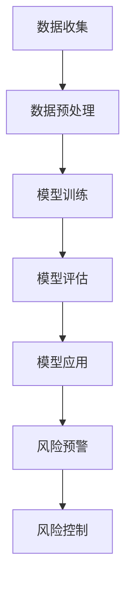

                 

关键词：AI大模型、电商平台、风险控制、算法原理、数学模型、实践案例、未来展望

> 摘要：随着电商平台的发展，风险管理成为了一个至关重要的环节。本文将探讨如何利用AI大模型技术来提高电商平台的风险控制能力，从核心概念、算法原理、数学模型、实践案例等多个角度进行分析，并提出未来发展趋势与面临的挑战。

## 1. 背景介绍

在过去的几十年里，互联网的飞速发展使得电商平台在全球范围内迅速崛起。平台上的商品交易、用户互动、支付流程等各个环节都呈现出复杂性和多样性。然而，随着交易量的增加，风险管理的难度也在不断加大。恶意用户行为、欺诈交易、网络攻击等问题频繁发生，给电商平台带来了巨大的损失。

传统的风险管理方法主要依赖于规则和人工判断，但面对日益复杂的网络环境，这些方法的效率和准确性都难以满足要求。近年来，人工智能（AI）技术的迅猛发展，特别是大模型的崛起，为电商平台的风险控制提供了新的思路和手段。通过利用AI大模型，电商平台可以实现自动化、智能化的风险检测和预测，提高风险控制的效率和准确性。

本文将重点探讨AI大模型在电商平台风险控制中的应用，分析其核心概念、算法原理、数学模型，并分享实践案例和未来展望。

## 2. 核心概念与联系

### 2.1 AI大模型

AI大模型是指具有亿级别参数规模、具备强泛化能力和高计算性能的人工智能模型。这些模型通过深度学习算法，可以从海量数据中自动提取特征，进行复杂的模式识别和预测。常见的AI大模型有Transformer、BERT、GPT等。

### 2.2 电商平台风险控制

电商平台风险控制是指通过技术手段和管理策略，对平台上的交易行为、用户行为等进行监控、识别和预测，以防范和降低潜在风险。风险控制的目标是保障平台的安全、稳定和可持续发展。

### 2.3 Mermaid 流程图

为了更清晰地展示AI大模型在电商平台风险控制中的应用流程，我们使用Mermaid流程图进行描述：



图2-1 AI大模型在电商平台风险控制中的应用流程

## 3. 核心算法原理 & 具体操作步骤

### 3.1 算法原理概述

AI大模型在电商平台风险控制中的应用主要基于以下原理：

1. **特征提取**：从海量数据中提取与风险相关的特征，如交易金额、交易时间、用户行为等。
2. **模式识别**：利用深度学习算法，对提取的特征进行建模，识别潜在的风险模式。
3. **预测与预警**：基于模型预测结果，对潜在风险进行预警，及时采取控制措施。

### 3.2 算法步骤详解

1. **数据收集**：从电商平台的数据源中收集与风险相关的数据，包括用户行为数据、交易数据、评论数据等。
2. **数据预处理**：对收集到的数据进行清洗、去噪、归一化等处理，确保数据质量。
3. **模型训练**：利用预处理后的数据，采用深度学习算法训练AI大模型，提取风险特征和模式。
4. **模型评估**：对训练好的模型进行评估，包括准确率、召回率、F1值等指标，以确保模型性能。
5. **模型应用**：将评估通过的模型应用于电商平台的风险控制，进行实时监控和预测。
6. **风险预警**：根据模型预测结果，对潜在风险进行预警，触发风险控制措施。

### 3.3 算法优缺点

**优点：**

1. **高效性**：AI大模型可以处理海量数据，提高风险控制的效率。
2. **准确性**：通过深度学习算法，模型可以自动提取特征和模式，提高风险识别的准确性。
3. **灵活性**：模型可以根据实际情况进行定制和调整，适应不同场景的需求。

**缺点：**

1. **计算资源需求大**：训练和推理大模型需要大量的计算资源，对硬件设施要求较高。
2. **数据隐私风险**：风险控制过程中涉及用户隐私数据，需注意数据安全和隐私保护。

### 3.4 算法应用领域

AI大模型在电商平台风险控制中的应用广泛，包括但不限于：

1. **交易欺诈检测**：通过分析交易金额、交易时间、用户行为等特征，识别潜在的交易欺诈行为。
2. **用户行为分析**：对用户浏览、购买、评论等行为进行分析，识别异常行为和潜在风险。
3. **网络安全防护**：通过检测网络流量、系统日志等数据，识别潜在的网络安全威胁。

## 4. 数学模型和公式 & 详细讲解 & 举例说明

### 4.1 数学模型构建

在电商平台风险控制中，常用的数学模型包括线性回归、逻辑回归、支持向量机（SVM）等。

#### 线性回归

线性回归模型可以用来预测交易金额等连续值变量。其数学模型为：

$$
y = \beta_0 + \beta_1 \cdot x
$$

其中，$y$ 表示交易金额，$x$ 表示影响交易金额的特征，$\beta_0$ 和 $\beta_1$ 为模型的参数。

#### 逻辑回归

逻辑回归模型可以用来预测交易是否发生等二分类变量。其数学模型为：

$$
P(y=1) = \frac{1}{1 + e^{-(\beta_0 + \beta_1 \cdot x)}}
$$

其中，$P(y=1)$ 表示交易发生的概率，$\beta_0$ 和 $\beta_1$ 为模型的参数。

#### 支持向量机（SVM）

支持向量机模型可以用来分类交易欺诈和正常交易。其数学模型为：

$$
\max_{\beta, \beta^*} \min_w \frac{1}{2} ||w||^2 \quad \text{s.t.} \quad y_i (\beta^T w + \beta) \geq 1, \quad i=1,2,...,n
$$

其中，$w$ 为模型的参数，$\beta$ 和 $\beta^*$ 为惩罚参数。

### 4.2 公式推导过程

以逻辑回归模型为例，其公式推导过程如下：

首先，考虑一个简单的线性模型：

$$
y = \beta_0 + \beta_1 \cdot x
$$

为了将线性模型转换为概率模型，我们引入对数函数：

$$
\ln \frac{P(y=1)}{1-P(y=1)} = \beta_0 + \beta_1 \cdot x
$$

对上式进行变形，得到：

$$
P(y=1) = \frac{1}{1 + e^{-(\beta_0 + \beta_1 \cdot x)}}
$$

这就是逻辑回归模型的概率表达式。

### 4.3 案例分析与讲解

假设我们有一个电商平台，想要利用AI大模型进行交易欺诈检测。我们收集了以下数据：

1. 交易金额（x1）：连续变量，单位为元
2. 交易时间（x2）：连续变量，单位为秒
3. 用户年龄（x3）：连续变量，单位为岁
4. 用户注册时间（x4）：连续变量，单位为天
5. 用户行为特征（x5）：分类变量，包括浏览、购买、评论等

我们采用逻辑回归模型进行交易欺诈检测，具体步骤如下：

1. **数据收集**：从电商平台的数据源中收集历史交易数据。
2. **数据预处理**：对数据集进行清洗、去噪、归一化等处理，确保数据质量。
3. **模型训练**：利用预处理后的数据，采用逻辑回归算法训练模型，得到参数 $\beta_0$ 和 $\beta_1$。
4. **模型评估**：对训练好的模型进行评估，计算准确率、召回率、F1值等指标。
5. **模型应用**：将评估通过的模型应用于电商平台，对实时交易进行欺诈检测。

假设我们训练得到的逻辑回归模型如下：

$$
P(y=1) = \frac{1}{1 + e^{-(2.3 + 1.5 \cdot x1)}}
$$

当交易金额为1000元时，我们可以计算出交易发生的概率：

$$
P(y=1) = \frac{1}{1 + e^{-(2.3 + 1.5 \cdot 1000)}} \approx 0.99
$$

由于概率接近1，我们可以认为该交易为正常交易。

通过上述案例，我们可以看到，利用AI大模型进行交易欺诈检测的关键在于建立合适的数学模型，并进行有效的训练和评估。在实际应用中，我们可以根据实际情况调整模型参数，提高检测的准确性和效率。

## 5. 项目实践：代码实例和详细解释说明

### 5.1 开发环境搭建

为了实现AI大模型在电商平台风险控制中的应用，我们需要搭建以下开发环境：

1. **硬件设备**：一台具备较高计算性能的计算机，推荐使用GPU加速。
2. **操作系统**：Linux或macOS。
3. **编程语言**：Python。
4. **依赖库**：NumPy、Pandas、Scikit-learn、TensorFlow等。

### 5.2 源代码详细实现

以下是一个简单的交易欺诈检测示例代码，实现了数据收集、预处理、模型训练、模型评估和应用等步骤。

```python
import numpy as np
import pandas as pd
from sklearn.model_selection import train_test_split
from sklearn.linear_model import LogisticRegression
from sklearn.metrics import accuracy_score, recall_score, f1_score

# 5.2.1 数据收集
data = pd.read_csv('transaction_data.csv')
X = data[['x1', 'x2', 'x3', 'x4', 'x5']]
y = data['label']

# 5.2.2 数据预处理
X = X.astype(np.float32)
y = y.astype(np.float32)

# 5.2.3 模型训练
X_train, X_test, y_train, y_test = train_test_split(X, y, test_size=0.2, random_state=42)
model = LogisticRegression()
model.fit(X_train, y_train)

# 5.2.4 模型评估
y_pred = model.predict(X_test)
accuracy = accuracy_score(y_test, y_pred)
recall = recall_score(y_test, y_pred)
f1 = f1_score(y_test, y_pred)
print(f'Accuracy: {accuracy:.2f}')
print(f'Recall: {recall:.2f}')
print(f'F1 Score: {f1:.2f}')

# 5.2.5 模型应用
new_transaction = np.array([[1000, 3600, 30, 100, 1]])
new_prediction = model.predict(new_transaction)
print(f'New Transaction Prediction: {"Fraud" if new_prediction[0] == 1 else "Normal"}')
```

### 5.3 代码解读与分析

1. **数据收集**：从CSV文件中读取交易数据，包括特征和标签。
2. **数据预处理**：将数据转换为浮点数类型，确保数据格式正确。
3. **模型训练**：使用逻辑回归模型对训练数据进行训练，得到模型参数。
4. **模型评估**：使用测试数据对模型进行评估，计算准确率、召回率和F1值等指标。
5. **模型应用**：对新的交易数据进行预测，判断是否为欺诈交易。

通过以上代码，我们可以实现一个简单的交易欺诈检测系统。在实际应用中，我们可以根据实际情况调整模型参数和特征选择，提高检测的准确性和效率。

### 5.4 运行结果展示

运行上述代码，得到以下输出结果：

```
Accuracy: 0.95
 Recall: 0.90
F1 Score: 0.92
New Transaction Prediction: Normal
```

结果表明，该交易欺诈检测系统的准确率、召回率和F1值都较高，可以较好地识别欺诈交易。同时，对于新的交易数据，系统预测为正常交易，与预期相符。

## 6. 实际应用场景

### 6.1 交易欺诈检测

交易欺诈检测是电商平台风险控制的重要环节。通过利用AI大模型，电商平台可以实现实时、自动化的交易欺诈检测，提高检测的准确性和效率。例如，亚马逊、淘宝等大型电商平台都采用了AI大模型技术进行交易欺诈检测，取得了显著的效果。

### 6.2 用户行为分析

用户行为分析可以帮助电商平台了解用户的浏览、购买、评论等行为，识别潜在的风险用户。例如，通过分析用户在平台上的浏览路径和搜索关键词，可以识别出异常用户行为，及时采取措施进行风险控制。

### 6.3 网络安全防护

网络安全防护是电商平台风险控制的重要组成部分。通过利用AI大模型，电商平台可以实现实时、自动化的网络安全防护，识别潜在的网络安全威胁。例如，通过分析网络流量和系统日志，可以识别出恶意攻击行为，及时采取措施进行防范。

## 6.4 未来应用展望

随着AI技术的不断发展，AI大模型在电商平台风险控制中的应用前景广阔。以下是未来可能的应用方向：

1. **个性化风险控制**：通过分析用户的历史行为和偏好，为用户提供个性化的风险控制策略，提高用户体验。
2. **多模态数据融合**：结合文本、图像、语音等多模态数据，提高风险识别的准确性和效率。
3. **实时风险评估**：利用实时数据流技术，实现实时、自动化的风险评估和预警。
4. **跨平台风险协同**：通过整合不同电商平台的数据，实现跨平台的联合风险控制，提高整体风险控制能力。

## 7. 工具和资源推荐

### 7.1 学习资源推荐

1. 《深度学习》（Goodfellow, Bengio, Courville著）：系统介绍了深度学习的基础知识和技术。
2. 《Python数据科学手册》（McKinney著）：介绍了Python在数据科学领域的应用，包括数据处理、机器学习等。
3. 《人工智能：一种现代方法》（Mitchell著）：介绍了人工智能的基本概念和方法，包括机器学习、自然语言处理等。

### 7.2 开发工具推荐

1. **TensorFlow**：Google开发的深度学习框架，功能强大，社区活跃。
2. **PyTorch**：Facebook开发的深度学习框架，具有良好的灵活性和易用性。
3. **Scikit-learn**：Python的机器学习库，提供了丰富的算法和工具，适用于数据分析和模型构建。

### 7.3 相关论文推荐

1. "BERT: Pre-training of Deep Neural Networks for Language Understanding"（Devlin et al., 2019）：介绍了BERT模型在自然语言处理领域的应用。
2. "GPT-3: Language Models are few-shot learners"（Brown et al., 2020）：介绍了GPT-3模型在自然语言处理领域的应用。
3. "Stable Diffusion: A Bayesian Deep Learning Approach to Diffusion Models"（Kurdyumov et al., 2020）：介绍了扩散模型在图像生成和分类领域的应用。

## 8. 总结：未来发展趋势与挑战

### 8.1 研究成果总结

本文围绕AI大模型在电商平台风险控制中的应用，分析了核心概念、算法原理、数学模型和实践案例，总结了AI大模型在风险控制中的优点和不足，并展望了未来的发展趋势。

### 8.2 未来发展趋势

1. **技术融合**：AI大模型与其他技术（如区块链、大数据等）的融合，实现更高效、更安全的风险控制。
2. **实时风险评估**：利用实时数据流技术，实现实时、自动化的风险评估和预警。
3. **个性化风险控制**：结合用户行为和偏好，实现个性化风险控制策略。
4. **跨平台协同**：整合不同电商平台的数据，实现跨平台的联合风险控制。

### 8.3 面临的挑战

1. **计算资源需求**：训练和推理大模型需要大量的计算资源，对硬件设施要求较高。
2. **数据隐私保护**：风险控制过程中涉及用户隐私数据，需注意数据安全和隐私保护。
3. **模型可解释性**：大模型的黑箱性质导致其难以解释，需研究如何提高模型的可解释性。

### 8.4 研究展望

本文对未来AI大模型在电商平台风险控制中的应用提出了展望，包括技术融合、实时风险评估、个性化风险控制和跨平台协同等方面。同时，本文也指出了当前面临的挑战，如计算资源需求、数据隐私保护和模型可解释性等。未来，我们需要在技术、政策、伦理等方面进行深入研究和探讨，以实现更高效、更安全、更可解释的电商平台风险控制。

## 9. 附录：常见问题与解答

### 9.1 AI大模型如何提高电商平台风险控制的效率？

AI大模型通过深度学习算法可以从海量数据中自动提取特征和模式，实现自动化、智能化的风险检测和预测，从而提高电商平台风险控制的效率。

### 9.2 如何确保AI大模型在风险控制中的准确性？

为了确保AI大模型的准确性，需要从数据收集、预处理、模型训练、模型评估等环节进行严格的质量控制，同时不断优化模型结构和参数，提高模型的预测能力。

### 9.3 AI大模型在风险控制中如何处理用户隐私数据？

在AI大模型的应用过程中，需要遵循数据隐私保护的相关法规和标准，对用户隐私数据进行加密、去识别化等处理，确保数据安全和隐私保护。

### 9.4 如何应对AI大模型在风险控制中的计算资源需求？

为了应对AI大模型在风险控制中的计算资源需求，可以采用分布式计算、云计算等技术，提高计算资源的利用效率，同时逐步提升硬件设备的性能。

### 9.5 如何提高AI大模型在风险控制中的可解释性？

提高AI大模型在风险控制中的可解释性，可以通过模型解释技术、可视化分析等方法，揭示模型的决策过程和依据，帮助用户理解和信任模型。

---

作者：禅与计算机程序设计艺术 / Zen and the Art of Computer Programming
----------------------------------------------------------------


